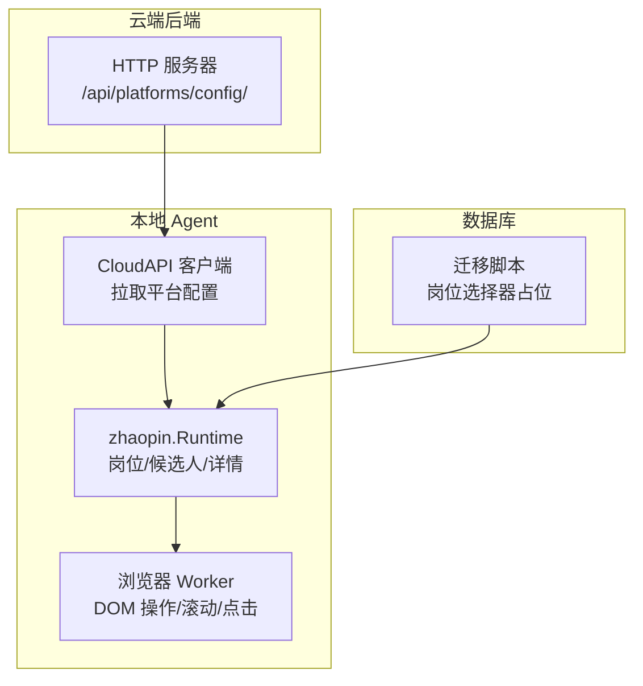
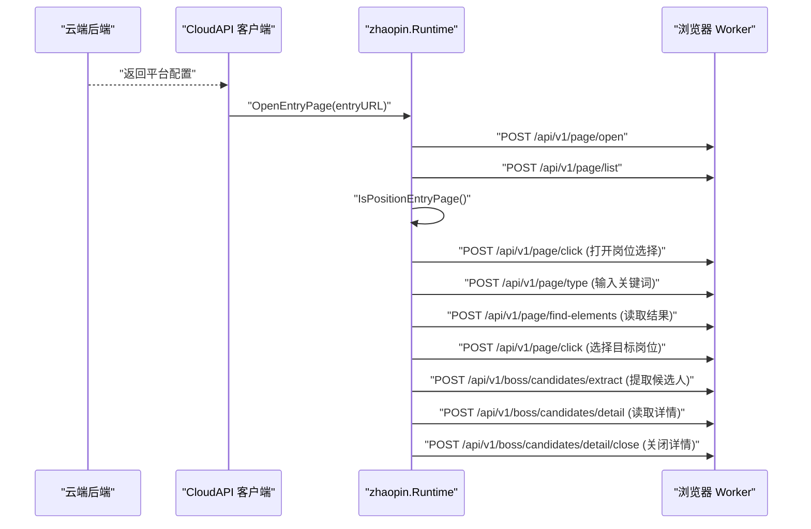
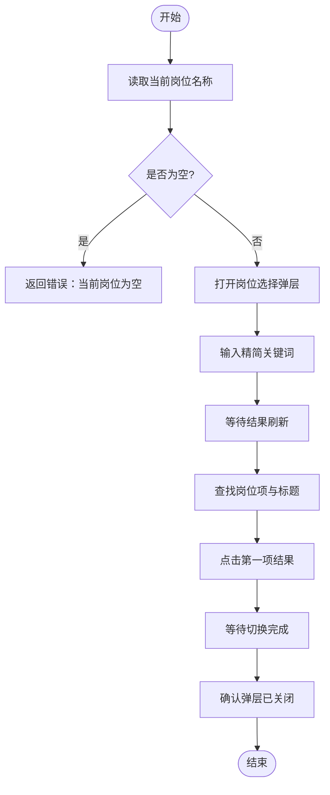
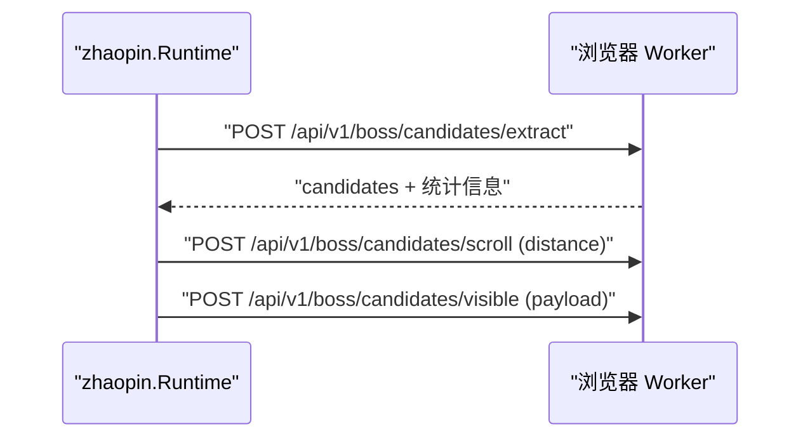
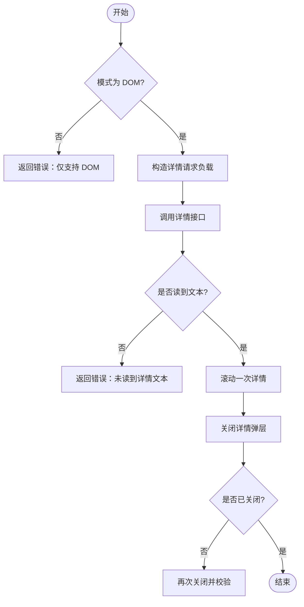
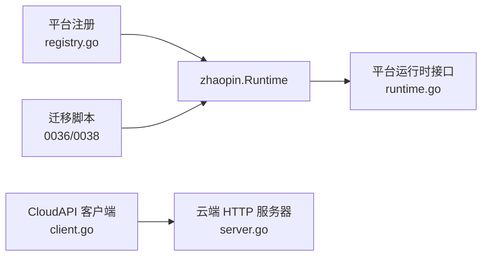

# 职位管理

<cite>
**本文引用的文件**
- [position.go](file://goodhr5/local-agent-go/internal/platforms/zhaopin/position.go)
- [navigation.go](file://goodhr5/local-agent-go/internal/platforms/zhaopin/navigation.go)
- [helpers.go](file://goodhr5/local-agent-go/internal/platforms/zhaopin/helpers.go)
- [entry.go](file://goodhr5/local-agent-go/internal/platforms/zhaopin/entry.go)
- [candidate.go](file://goodhr5/local-agent-go/internal/platforms/zhaopin/candidate.go)
- [detail.go](file://goodhr5/local-agent-go/internal/platforms/zhaopin/detail.go)
- [runtime.go](file://goodhr5/local-agent-go/internal/platformcore/runtime.go)
- [registry.go](file://goodhr5/local-agent-go/internal/platforms/registry.go)
- [defaults.go](file://goodhr5/local-agent-go/internal/browserprofile/defaults.go)
- [0036_boss_position_switch_config.sql](file://goodhr5/cloud/backend/db/migrations/0036_boss_position_switch_config.sql)
- [0038_ensure_boss_position_config.sql](file://goodhr5/cloud/backend/db/migrations/0038_ensure_boss_position_config.sql)
- [0009_position_template_configs.sql](file://goodhr5/cloud/backend/db/migrations/0009_position_template_configs.sql)
- [server.go](file://goodhr5/cloud/backend/internal/httpapi/server.go)
- [client.go](file://goodhr5/local-agent-go/internal/cloudapi/client.go)
</cite>

## 目录
1. [简介](#简介)
2. [项目结构](#项目结构)
3. [核心组件](#核心组件)
4. [架构总览](#架构总览)
5. [详细组件分析](#详细组件分析)
6. [依赖关系分析](#依赖关系分析)
7. [性能考虑](#性能考虑)
8. [故障排查指南](#故障排查指南)
9. [结论](#结论)
10. [附录](#附录)

## 简介
本文件聚焦智联招聘平台的“职位管理”能力，围绕职位数据的获取、解析与存储机制展开，覆盖以下关键点：
- 职位列表抓取策略：通过本地 Agent 的浏览器 Worker 驱动页面交互，定位并提取候选人卡片。
- 职位信息字段映射：将平台 DOM 字段映射为统一候选对象，便于后续处理。
- 搜索条件构建：对岗位名称进行规范化与精简，生成平台可识别的查询词。
- 职位状态管理：入口页判断、当前岗位读取、岗位切换流程。
- 分页处理：滚动加载与可见范围控制。
- 数据去重逻辑：基于候选人指纹的去重。
- 配置参数说明：平台配置中的选择器、行为开关等。
- 异常处理方案：关键步骤的错误返回与重试建议。
- 性能优化技巧：等待时间、批量处理、最小化网络调用。
- API 调用示例与数据处理流程：从云端到本地 Agent 的完整链路。

## 项目结构
智联招聘相关实现位于本地 Agent 的 zhaopin 包中，包含岗位切换、候选人提取、详情读取、导航与工具函数等；云端提供平台配置接口，供本地 Agent 拉取运行时配置。

图表来源
- [server.go:211-217](file://goodhr5/cloud/backend/internal/httpapi/server.go#L211-L217)
- [client.go:92-100](file://goodhr5/local-agent-go/internal/cloudapi/client.go#L92-L100)
- [runtime.go:54-82](file://goodhr5/local-agent-go/internal/platformcore/runtime.go#L54-L82)
- [0036_boss_position_switch_config.sql:1-40](file://goodhr5/cloud/backend/db/migrations/0036_boss_position_switch_config.sql#L1-L40)

章节来源
- [server.go:211-217](file://goodhr5/cloud/backend/internal/httpapi/server.go#L211-L217)
- [client.go:92-100](file://goodhr5/local-agent-go/internal/cloudapi/client.go#L92-L100)
- [runtime.go:54-82](file://goodhr5/local-agent-go/internal/platformcore/runtime.go#L54-L82)
- [0036_boss_position_switch_config.sql:1-40](file://goodhr5/cloud/backend/db/migrations/0036_boss_position_switch_config.sql#L1-L40)

## 核心组件
- 平台运行时接口：定义统一的岗位打开、切换、候选人提取、详情读取、关闭等能力。
- 智联运行时实现：具体实现上述接口，封装与 Worker 的交互细节。
- 导航与工具：岗位名称规范化、搜索关键词生成、元素定位转换、日志格式化等。
- 入口页处理：打开入口、判断是否仍在入口页。
- 候选人处理：可见列表提取、滚动、可见性保证、筛选文本与去重指纹。
- 详情处理：DOM 模式详情读取、滚动、关闭与文本清理。

章节来源
- [runtime.go:54-82](file://goodhr5/local-agent-go/internal/platformcore/runtime.go#L54-L82)
- [position.go:11-102](file://goodhr5/local-agent-go/internal/platforms/zhaopin/position.go#L11-L102)
- [navigation.go:73-93](file://goodhr5/local-agent-go/internal/platforms/zhaopin/navigation.go#L73-L93)
- [helpers.go:112-160](file://goodhr5/local-agent-go/internal/platforms/zhaopin/helpers.go#L112-L160)
- [entry.go:12-43](file://goodhr5/local-agent-go/internal/platforms/zhaopin/entry.go#L12-L43)
- [candidate.go:13-85](file://goodhr5/local-agent-go/internal/platforms/zhaopin/candidate.go#L13-L85)
- [detail.go:13-102](file://goodhr5/local-agent-go/internal/platforms/zhaopin/detail.go#L13-L102)

## 架构总览
智联招聘职位管理的整体流程如下：
- 云端提供平台配置（含入口 URL、选择器等），本地 Agent 启动时拉取。
- 本地 Agent 使用浏览器 Worker 打开入口页，判断是否在岗位运行入口。
- 根据岗位配置，构造搜索关键词，打开岗位选择弹层并输入关键词，选择目标岗位。
- 提取当前可见候选人列表，必要时滚动加载更多。
- 对每个候选人读取详情（仅 DOM 模式），执行后续业务逻辑（如打招呼、索要简历）。
- 关闭详情，继续处理下一个候选人或结束任务。

图表来源
- [entry.go:12-43](file://goodhr5/local-agent-go/internal/platforms/zhaopin/entry.go#L12-L43)
- [position.go:31-102](file://goodhr5/local-agent-go/internal/platforms/zhaopin/position.go#L31-L102)
- [candidate.go:13-69](file://goodhr5/local-agent-go/internal/platforms/zhaopin/candidate.go#L13-L69)
- [detail.go:13-96](file://goodhr5/local-agent-go/internal/platforms/zhaopin/detail.go#L13-L96)

## 详细组件分析

### 岗位切换与搜索关键词构建
- 当前岗位读取：通过配置中的“当前岗位”选择器提取文本，若为空则报错。
- 岗位切换流程：
  - 点击“更多岗位”按钮打开选择弹层。
  - 等待弹层展开后，向搜索输入框输入关键词。
  - 等待搜索结果刷新，读取前若干项标题与元素引用。
  - 点击第一项结果，等待切换完成。
  - 校验弹层已关闭。
- 搜索关键词构建：
  - 去除岗位名中的中英文括号说明。
  - 去除下划线分隔后的多余部分。
  - 若结果为空，回退到原始岗位名。

图表来源
- [position.go:11-102](file://goodhr5/local-agent-go/internal/platforms/zhaopin/position.go#L11-L102)
- [navigation.go:73-93](file://goodhr5/local-agent-go/internal/platforms/zhaopin/navigation.go#L73-L93)

章节来源
- [position.go:11-102](file://goodhr5/local-agent-go/internal/platforms/zhaopin/position.go#L11-L102)
- [navigation.go:73-93](file://goodhr5/local-agent-go/internal/platforms/zhaopin/navigation.go#L73-L93)

### 候选人列表提取与滚动
- 列表提取：调用 Worker 的候选人提取接口，传入平台 ID、平台配置与最大数量。
- 返回数据包含：
  - 找到计数、查找耗时、转换耗时、总耗时。
  - 候选人数组，每项包含字段、原始文本、过滤文本等。
- 滚动加载：通过滚动接口增加距离以加载更多内容。
- 可见性保证：小步滚动确保目标候选人卡片进入可视区域。

图表来源
- [candidate.go:13-69](file://goodhr5/local-agent-go/internal/platforms/zhaopin/candidate.go#L13-L69)

章节来源
- [candidate.go:13-69](file://goodhr5/local-agent-go/internal/platforms/zhaopin/candidate.go#L13-L69)

### 候选人详情读取与关闭
- 详情模式限制：仅支持 DOM 模式。
- 详情读取：
  - 构造可见性 payload，设置详情页超时、截图关闭、滚动次数等。
  - 调用详情接口，提取文本内容。
  - 若未读到文本，返回错误。
- 详情滚动：在 AI 分析期间滚动一次以提升完整性。
- 详情关闭：
  - 发送 Escape 键关闭弹层。
  - 等待短暂时间后检查是否仍存在详情容器。
  - 若仍未关闭，再次尝试关闭并校验。

图表来源
- [detail.go:13-96](file://goodhr5/local-agent-go/internal/platforms/zhaopin/detail.go#L13-L96)

章节来源
- [detail.go:13-96](file://goodhr5/local-agent-go/internal/platforms/zhaopin/detail.go#L13-L96)

### 入口页处理与页面匹配
- 打开入口页：校验入口 URL 非空，调用打开接口。
- 准备入口页：智联无需额外初始化动作。
- 判断是否在入口页：
  - 获取当前页面列表，取默认页。
  - 比较当前 URL 与配置的入口 URL（支持前缀/包含/精确匹配）。

章节来源
- [entry.go:12-43](file://goodhr5/local-agent-go/internal/platforms/zhaopin/entry.go#L12-L43)
- [navigation.go:12-71](file://goodhr5/local-agent-go/internal/platforms/zhaopin/navigation.go#L12-L71)

### 字段映射与去重指纹
- 候选人字段映射：
  - 名称优先取 candidate_name/name，其次 fields.name。
  - 年龄优先取 age/candidate_age，其次从 basic_info 正则提取。
  - 筛选文本优先 filter_text，其次 raw_text。
- 去重指纹：
  - 组合平台 ID、规范化后的姓名与年龄。
  - 若姓名或年龄为空，不生成指纹。

章节来源
- [candidate.go:71-85](file://goodhr5/local-agent-go/internal/platforms/zhaopin/candidate.go#L71-L85)
- [runtime.go:50-63](file://goodhr5/local-agent-go/internal/platforms/zhaopin/runtime.go#L50-L63)
- [helpers.go:182-192](file://goodhr5/local-agent-go/internal/platforms/zhaopin/helpers.go#L182-L192)

### 配置与选择器
- 平台配置分区：
  - auth.pages：入口页配置，支持 entry 标记与 URL。
  - position：岗位相关选择器（当前岗位、切换按钮、列表容器、列表项、项文本、点击目标）。
  - card.fields：候选人卡片字段定位。
- 选择器转换：
  - 支持 target_classes/parent_classes 等字段。
  - 兼容旧版 targetClasses/parentClasses。
- 默认入口页：
  - 智联招聘默认入口 URL 指向推荐页。

章节来源
- [navigation.go:12-39](file://goodhr5/local-agent-go/internal/platforms/zhaopin/navigation.go#L12-L39)
- [helpers.go:112-160](file://goodhr5/local-agent-go/internal/platforms/zhaopin/helpers.go#L112-L160)
- [defaults.go:47-47](file://goodhr5/local-agent-go/internal/browserprofile/defaults.go#L47-L47)
- [0036_boss_position_switch_config.sql:1-40](file://goodhr5/cloud/backend/db/migrations/0036_boss_position_switch_config.sql#L1-L40)
- [0038_ensure_boss_position_config.sql:36-75](file://goodhr5/cloud/backend/db/migrations/0038_ensure_boss_position_config.sql#L36-L75)

## 依赖关系分析
- 平台注册：智联运行时通过 registry 注册为 “zhaopin”。
- 云端配置：本地 Agent 通过 cloudapi 客户端拉取 /api/platforms/config/。
- 运行时接口：platformcore 定义统一接口，zhaopin 实现具体逻辑。
- 数据库迁移：系统配置中包含岗位选择器占位，便于后台替换真实选择器。

图表来源
- [registry.go:12-19](file://goodhr5/local-agent-go/internal/platforms/registry.go#L12-L19)
- [client.go:92-100](file://goodhr5/local-agent-go/internal/cloudapi/client.go#L92-L100)
- [server.go:211-217](file://goodhr5/cloud/backend/internal/httpapi/server.go#L211-L217)
- [runtime.go:54-82](file://goodhr5/local-agent-go/internal/platformcore/runtime.go#L54-L82)
- [0036_boss_position_switch_config.sql:1-40](file://goodhr5/cloud/backend/db/migrations/0036_boss_position_switch_config.sql#L1-L40)
- [0038_ensure_boss_position_config.sql:36-75](file://goodhr5/cloud/backend/db/migrations/0038_ensure_boss_position_config.sql#L36-L75)

章节来源
- [registry.go:12-19](file://goodhr5/local-agent-go/internal/platforms/registry.go#L12-L19)
- [client.go:92-100](file://goodhr5/local-agent-go/internal/cloudapi/client.go#L92-L100)
- [server.go:211-217](file://goodhr5/cloud/backend/internal/httpapi/server.go#L211-L217)
- [runtime.go:54-82](file://goodhr5/local-agent-go/internal/platformcore/runtime.go#L54-L82)
- [0036_boss_position_switch_config.sql:1-40](file://goodhr5/cloud/backend/db/migrations/0036_boss_position_switch_config.sql#L1-L40)
- [0038_ensure_boss_position_config.sql:36-75](file://goodhr5/cloud/backend/db/migrations/0038_ensure_boss_position_config.sql#L36-L75)

## 性能考虑
- 等待时间优化：
  - 弹层展开与结果刷新使用固定延迟，可根据实际页面响应调整。
  - 详情关闭后短暂等待，避免竞态。
- 批量处理：
  - 候选人整理过程中按批次输出日志，减少频繁 I/O。
- 最小化调用：
  - 详情读取关闭截图以减少额外开销。
  - 滚动详情仅在 AI 分析阶段执行一次。
- 选择器稳定性：
  - 使用 parent_classes/target_classes 提高定位鲁棒性。
  - 通过 find_attempts/find_interval_ms 提升查找成功率。

[本节为通用指导，不直接分析具体文件]

## 故障排查指南
- 岗位名称为空：
  - 检查当前岗位选择器是否正确配置。
  - 确认页面结构与选择器匹配。
- 岗位选择失败：
  - 验证“更多岗位”按钮选择器。
  - 检查搜索输入框选择器与关键词格式。
  - 确认搜索结果项选择器与标题选择器。
- 候选人提取失败：
  - 检查平台配置是否包含必要字段定位。
  - 查看 Worker 返回的统计信息与错误消息。
- 详情读取失败：
  - 确认模式为 DOM。
  - 检查详情页容器是否存在。
  - 若未读到文本，检查滚动与等待时间。
- 详情关闭失败：
  - 多次尝试关闭并校验容器状态。
  - 记录错误上下文以便定位。

章节来源
- [position.go:11-102](file://goodhr5/local-agent-go/internal/platforms/zhaopin/position.go#L11-L102)
- [candidate.go:13-69](file://goodhr5/local-agent-go/internal/platforms/zhaopin/candidate.go#L13-L69)
- [detail.go:13-96](file://goodhr5/local-agent-go/internal/platforms/zhaopin/detail.go#L13-L96)

## 结论
智联招聘职位管理通过本地 Agent 与云端配置的协同，实现了稳定的岗位切换、候选人提取与详情读取流程。借助统一的运行时接口与灵活的配置体系，系统具备良好的可扩展性与可维护性。建议在部署时完善选择器配置，并根据实际页面响应调整等待时间与滚动策略，以获得最佳性能与稳定性。

[本节为总结性内容，不直接分析具体文件]

## 附录

### API 调用示例与数据处理流程
- 拉取平台配置：
  - 方法：GET
  - 路径：/api/platforms/config/
  - 说明：本地 Agent 启动时拉取平台配置，包含入口 URL、选择器等。
- 打开入口页：
  - 方法：POST
  - 路径：/api/v1/page/open
  - 负载：{ url: "入口地址" }
- 判断是否在入口页：
  - 方法：POST
  - 路径：/api/v1/page/list
  - 负载：{}
  - 说明：返回页面列表，用于匹配入口页。
- 打开岗位选择弹层：
  - 方法：POST
  - 路径：/api/v1/page/click
  - 负载：{ element: { selector: "a[zp-stat-id=\"talent_more_jobs\"]" }, timeout: 10000 }
- 输入岗位关键词：
  - 方法：POST
  - 路径：/api/v1/page/type
  - 负载：{ element: { selector: ".job-side-selector__filter input" }, text: "精简关键词", timeout: 10000 }
- 读取岗位搜索结果：
  - 方法：POST
  - 路径：/api/v1/page/find-elements
  - 负载：{ element: { selector: ".job-side-selector__item" }, visible_only: true, max_items: 20, fields: [{ position_name: { selector: ".job-side-selector__title" } }] }
- 提取候选人列表：
  - 方法：POST
  - 路径：/api/v1/boss/candidates/extract
  - 负载：{ platform_id: "zhaopin", platform_config: {...}, max_items: N }
- 读取候选人详情：
  - 方法：POST
  - 路径：/api/v1/boss/candidates/detail
  - 负载：{ platform_id: "zhaopin", platform_config: {...}, candidate_name: "...", card_index: N, position_id: "...", screenshot: false, force_scroll: false, card_scroll_attempts: 3, require_full: false, detail_ready_timeout: 5000, viewport_margin: 24 }
- 关闭候选人详情：
  - 方法：POST
  - 路径：/api/v1/boss/candidates/detail/close
  - 负载：{ platform_id: "zhaopin", platform_config: {...}, key: "Escape", candidate_name: "..." }

章节来源
- [server.go:211-217](file://goodhr5/cloud/backend/internal/httpapi/server.go#L211-L217)
- [client.go:92-100](file://goodhr5/local-agent-go/internal/cloudapi/client.go#L92-L100)
- [position.go:31-102](file://goodhr5/local-agent-go/internal/platforms/zhaopin/position.go#L31-L102)
- [candidate.go:13-69](file://goodhr5/local-agent-go/internal/platforms/zhaopin/candidate.go#L13-L69)
- [detail.go:13-96](file://goodhr5/local-agent-go/internal/platforms/zhaopin/detail.go#L13-L96)

### 职位配置参数说明
- 入口页配置：
  - pages[].url：入口页面地址。
  - pages[].entry：是否为主入口。
  - pages[].match：匹配方式（prefix/contains/exact）。
- 岗位配置：
  - position.current：当前岗位选择器。
  - position.switchBtn：岗位选择按钮选择器。
  - position.list：岗位列表容器选择器。
  - position.item：岗位列表项选择器。
  - position.itemText：岗位名称文字选择器。
  - position.clickTarget：岗位点击目标选择器。
- 候选人卡片配置：
  - card.fields：字段定位映射，支持 target_classes/parent_classes。
- 其他：
  - find_attempts/find_interval_ms：查找尝试次数与间隔。
  - viewport_margin：视口边距，影响可见性判定。

章节来源
- [navigation.go:12-71](file://goodhr5/local-agent-go/internal/platforms/zhaopin/navigation.go#L12-L71)
- [helpers.go:112-160](file://goodhr5/local-agent-go/internal/platforms/zhaopin/helpers.go#L112-L160)
- [0036_boss_position_switch_config.sql:1-40](file://goodhr5/cloud/backend/db/migrations/0036_boss_position_switch_config.sql#L1-L40)
- [0038_ensure_boss_position_config.sql:36-75](file://goodhr5/cloud/backend/db/migrations/0038_ensure_boss_position_config.sql#L36-L75)

### 职位状态管理与分页处理
- 状态管理：
  - 入口页判断：通过页面列表与配置匹配。
  - 当前岗位读取：通过选择器提取文本。
  - 岗位切换：打开弹层、输入关键词、选择结果、校验关闭。
- 分页处理：
  - 滚动加载：通过 distance 参数控制滚动距离。
  - 可见性保证：小步滚动确保目标卡片进入可视区域。
  - 最大数量限制：通过 max_items 控制提取上限。

章节来源
- [entry.go:12-43](file://goodhr5/local-agent-go/internal/platforms/zhaopin/entry.go#L12-L43)
- [position.go:31-102](file://goodhr5/local-agent-go/internal/platforms/zhaopin/position.go#L31-L102)
- [candidate.go:52-69](file://goodhr5/local-agent-go/internal/platforms/zhaopin/candidate.go#L52-L69)

### 数据去重逻辑
- 指纹生成：
  - 平台 ID + 规范化姓名 + 规范化年龄。
  - 若姓名或年龄为空，不生成指纹。
- 应用位置：
  - 候选人列表提取后，为每个候选人计算指纹并写入 id 字段。

章节来源
- [candidate.go:71-85](file://goodhr5/local-agent-go/internal/platforms/zhaopin/candidate.go#L71-L85)
- [runtime.go:50-63](file://goodhr5/local-agent-go/internal/platforms/zhaopin/runtime.go#L50-L63)
- [helpers.go:182-192](file://goodhr5/local-agent-go/internal/platforms/zhaopin/helpers.go#L182-L192)

### 异常处理方案
- 岗位名称为空：返回错误并记录警告日志。
- 岗位选择失败：捕获点击、输入、查找、点击结果的错误，返回带上下文的错误消息。
- 候选人提取失败：记录请求耗时与错误信息。
- 详情读取失败：检查模式与文本内容，返回明确错误。
- 详情关闭失败：多次尝试并记录错误上下文。

章节来源
- [position.go:11-102](file://goodhr5/local-agent-go/internal/platforms/zhaopin/position.go#L11-L102)
- [candidate.go:13-69](file://goodhr5/local-agent-go/internal/platforms/zhaopin/candidate.go#L13-L69)
- [detail.go:13-96](file://goodhr5/local-agent-go/internal/platforms/zhaopin/detail.go#L13-L96)

### 性能优化技巧
- 合理设置等待时间：避免过长等待影响效率，过短导致不稳定。
- 批量处理日志：减少频繁 I/O 开销。
- 关闭不必要功能：如详情截图，降低网络与存储压力。
- 优化选择器：使用父类与目标类组合，提高定位稳定性。
- 控制滚动次数：仅在必要时滚动，减少页面操作成本。

[本节为通用指导，不直接分析具体文件]