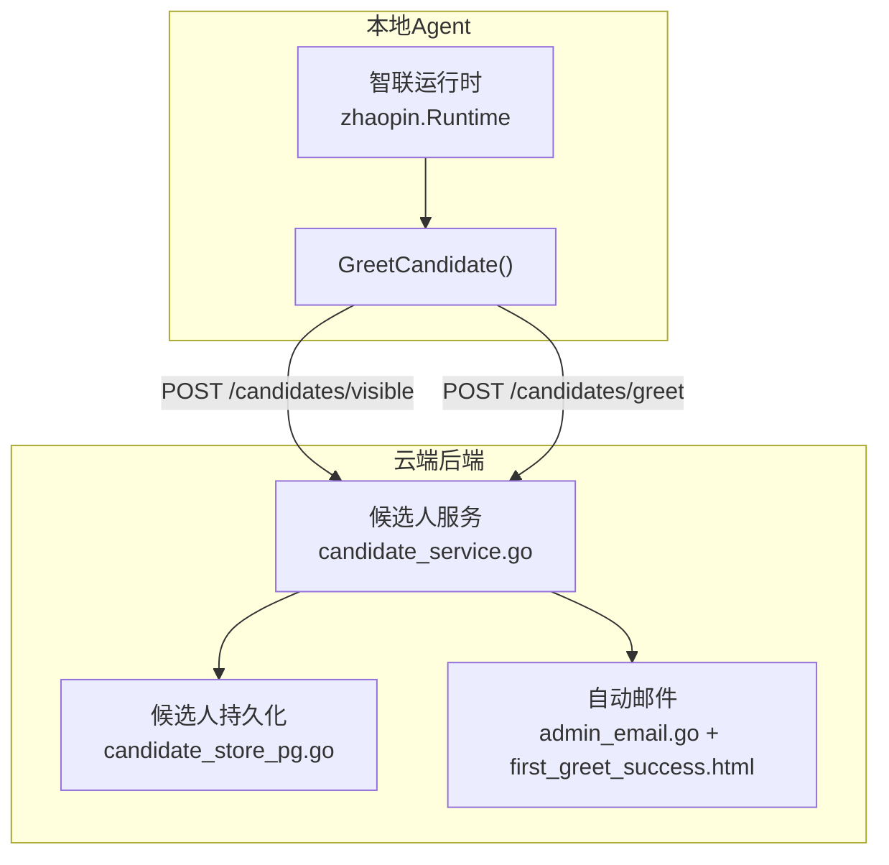
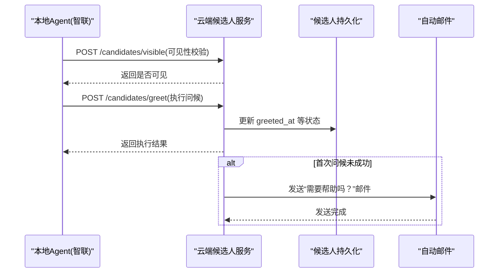
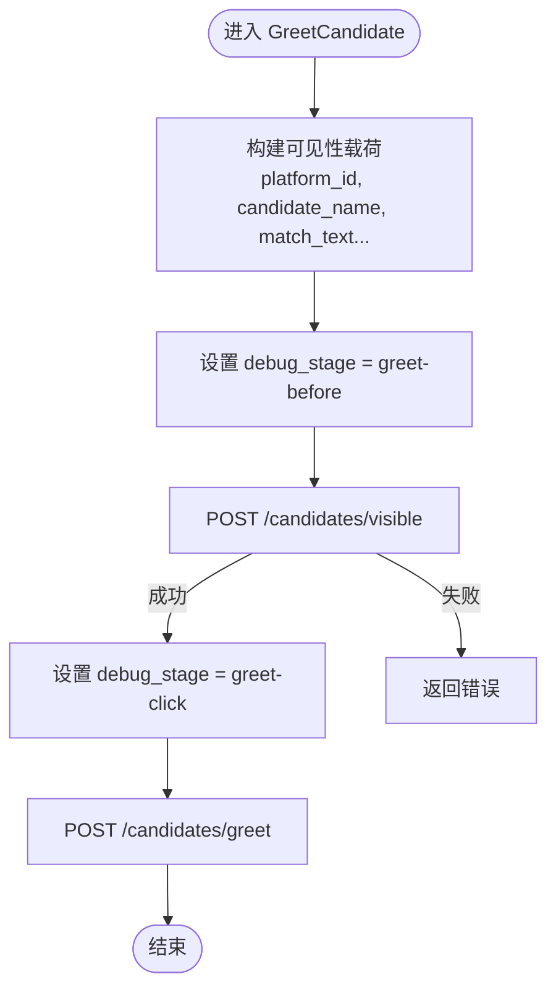
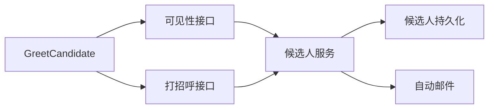

# 自动问候

<cite>
**本文引用的文件**
- [greet.go](file://goodhr5/local-agent-go/internal/platforms/zhaopin/greet.go)
- [runtime.go](file://goodhr5/local-agent-go/internal/platforms/zhaopin/runtime.go)
- [candidate_service.go](file://goodhr5/cloud/backend/internal/httpapi/candidate_service.go)
- [candidate_store_pg.go](file://goodhr5/cloud/backend/internal/httpapi/candidate_store_pg.go)
- [candidate_screening_store.go](file://goodhr5/cloud/backend/internal/httpapi/candidate_screening_store.go)
- [admin_email.go](file://goodhr5/cloud/backend/internal/httpapi/admin_email.go)
- [first_greet_success.html](file://goodhr5/cloud/backend/templates/automatic_emails/first_greet_success.html)
</cite>

## 目录
1. [简介](#简介)
2. [项目结构](#项目结构)
3. [核心组件](#核心组件)
4. [架构总览](#架构总览)
5. [详细组件分析](#详细组件分析)
6. [依赖关系分析](#依赖关系分析)
7. [性能与限制](#性能与限制)
8. [故障排查指南](#故障排查指南)
9. [结论](#结论)
10. [附录：配置与使用示例](#附录：配置与使用示例)

## 简介
本文件聚焦智联招聘平台的“自动问候”能力，围绕消息发送自动化流程、模板引擎与个性化生成、问候语配置、发送时机控制、频率限制、状态跟踪、失败重试策略、发送记录管理、模板定制与A/B测试支持、效果分析方法进行系统化说明。文档以代码级事实为依据，提供可操作的流程图与时序图，帮助读者快速理解并落地实践。

## 项目结构
自动问候功能横跨本地Agent（浏览器自动化）与云端后端（业务编排、存储与通知）。关键路径包括：
- 本地Agent侧：平台运行时封装智联招聘的打招呼动作，通过HTTP调用云端接口完成可见性校验与打招呼执行。
- 云端后端侧：候选人服务负责评分、筛选与问候标记；持久化层维护候选人的问候时间等状态；邮件系统用于首次未成功时的提醒。

图表来源
- [greet.go:11-22](file://goodhr5/local-agent-go/internal/platforms/zhaopin/greet.go#L11-L22)
- [candidate_service.go:288-294](file://goodhr5/cloud/backend/internal/httpapi/candidate_service.go#L288-L294)
- [candidate_store_pg.go:184-196](file://goodhr5/cloud/backend/internal/httpapi/candidate_store_pg.go#L184-L196)
- [admin_email.go:686-698](file://goodhr5/cloud/backend/internal/httpapi/admin_email.go#L686-L698)
- [first_greet_success.html:1-9](file://goodhr5/cloud/backend/templates/automatic_emails/first_greet_success.html#L1-L9)

章节来源
- [greet.go:11-22](file://goodhr5/local-agent-go/internal/platforms/zhaopin/greet.go#L11-L22)
- [runtime.go:24-41](file://goodhr5/local-agent-go/internal/platforms/zhaopin/runtime.go#L24-L41)
- [candidate_service.go:288-294](file://goodhr5/cloud/backend/internal/httpapi/candidate_service.go#L288-L294)
- [candidate_store_pg.go:184-196](file://goodhr5/cloud/backend/internal/httpapi/candidate_store_pg.go#L184-L196)
- [admin_email.go:686-698](file://goodhr5/cloud/backend/internal/httpapi/admin_email.go#L686-L698)
- [first_greet_success.html:1-9](file://goodhr5/cloud/backend/templates/automatic_emails/first_greet_success.html#L1-L9)

## 核心组件
- 智联打招呼入口：本地Agent的智联运行时实现，负责组装可见性参数并依次调用可见性校验与打招呼接口。
- 候选人服务：对候选人进行AI评分与原因生成，并在问候成功后更新问候时间字段。
- 候选人持久化：维护候选人 engagement 状态，包含问候时间、详情获取时间等关键字段。
- 自动邮件：当首次打招呼尚未成功时，向用户发送邮件提示，引导检查门槛、额度与登录状态。

章节来源
- [greet.go:11-22](file://goodhr5/local-agent-go/internal/platforms/zhaopin/greet.go#L11-L22)
- [candidate_service.go:288-294](file://goodhr5/cloud/backend/internal/httpapi/candidate_service.go#L288-L294)
- [candidate_store_pg.go:184-196](file://goodhr5/cloud/backend/internal/httpapi/candidate_store_pg.go#L184-L196)
- [admin_email.go:686-698](file://goodhr5/cloud/backend/internal/httpapi/admin_email.go#L686-L698)
- [first_greet_success.html:1-9](file://goodhr5/cloud/backend/templates/automatic_emails/first_greet_success.html#L1-L9)

## 架构总览
自动问候的整体数据流如下：
- 本地Agent在智联页面定位候选人后，构造可见性载荷并调用云端可见性接口，随后调用打招呼接口。
- 云端候选人服务根据配置与AI结果决定是否问候，并在成功后写入问候时间。
- 若首次问候未成功，云端触发自动邮件提醒，指导用户调整门槛或检查平台状态。

图表来源
- [greet.go:11-22](file://goodhr5/local-agent-go/internal/platforms/zhaopin/greet.go#L11-L22)
- [candidate_service.go:288-294](file://goodhr5/cloud/backend/internal/httpapi/candidate_service.go#L288-L294)
- [candidate_store_pg.go:184-196](file://goodhr5/cloud/backend/internal/httpapi/candidate_store_pg.go#L184-L196)
- [admin_email.go:686-698](file://goodhr5/cloud/backend/internal/httpapi/admin_email.go#L686-L698)
- [first_greet_success.html:1-9](file://goodhr5/cloud/backend/templates/automatic_emails/first_greet_success.html#L1-L9)

## 详细组件分析

### 智联打招呼入口（本地Agent）
- 职责：将候选人信息包装为可见性载荷，按阶段设置调试标记，依次调用可见性与打招呼接口。
- 关键点：
  - 可见性载荷包含平台标识、配置、候选人名称、匹配文本、滚动与等待参数等。
  - 通过 debug_stage 区分“可见前”和“点击打招呼”两个阶段，便于问题定位。
  - 错误直接上抛给上层调度器，由统一错误策略处理重试与告警。

图表来源
- [greet.go:11-22](file://goodhr5/local-agent-go/internal/platforms/zhaopin/greet.go#L11-L22)
- [runtime.go:24-41](file://goodhr5/local-agent-go/internal/platforms/zhaopin/runtime.go#L24-L41)

章节来源
- [greet.go:11-22](file://goodhr5/local-agent-go/internal/platforms/zhaopin/greet.go#L11-L22)
- [runtime.go:24-41](file://goodhr5/local-agent-go/internal/platforms/zhaopin/runtime.go#L24-L41)

### 候选人服务与问候标记
- 职责：计算AI问候评分与原因，并在成功后更新候选人的问候时间。
- 关键点：
  - 响应中包含问候评分与原因，便于前端展示与后续分析。
  - 问候成功后写入 greeted_at，作为“已问候”的状态标志。

章节来源
- [candidate_service.go:288-294](file://goodhr5/cloud/backend/internal/httpapi/candidate_service.go#L288-L294)
- [candidate_store_pg.go:184-196](file://goodhr5/cloud/backend/internal/httpapi/candidate_store_pg.go#L184-L196)

### 候选人持久化与状态字段
- 职责：维护候选人 engagement 状态，包括首次看到时间、详情获取时间、问候时间、简历请求时间等。
- 关键点：
  - 问候时间字段在更新时采用“非空覆盖”策略，确保只推进不回退。
  - 源字段可用于区分来源渠道（如 greeting）。

章节来源
- [candidate_store_pg.go:184-196](file://goodhr5/cloud/backend/internal/httpapi/candidate_store_pg.go#L184-L196)
- [candidate_screening_store.go:26-26](file://goodhr5/cloud/backend/internal/httpapi/candidate_screening_store.go#L26-L26)
- [candidate_screening_store.go:117-117](file://goodhr5/cloud/backend/internal/httpapi/candidate_screening_store.go#L117-L117)
- [candidate_screening_store.go:273-273](file://goodhr5/cloud/backend/internal/httpapi/candidate_screening_store.go#L273-L273)

### 自动邮件与首次未成功提醒
- 职责：当首次打招呼尚未成功时，向用户发送邮件，提供操作指引。
- 关键点：
  - 邮件主题与HTML模板集中管理，便于统一风格与多语言扩展。
  - 邮件内容引导用户检查筛选门槛、平台额度与登录状态，并链接到岗位运行结果页。

章节来源
- [admin_email.go:686-698](file://goodhr5/cloud/backend/internal/httpapi/admin_email.go#L686-L698)
- [first_greet_success.html:1-9](file://goodhr5/cloud/backend/templates/automatic_emails/first_greet_success.html#L1-L9)

## 依赖关系分析
- 本地Agent依赖云端API进行可见性校验与打招呼执行。
- 云端候选人服务依赖持久化层更新问候状态。
- 自动邮件模块依赖模板与主题映射，用于首次未成功场景的通知。

图表来源
- [greet.go:11-22](file://goodhr5/local-agent-go/internal/platforms/zhaopin/greet.go#L11-L22)
- [candidate_service.go:288-294](file://goodhr5/cloud/backend/internal/httpapi/candidate_service.go#L288-L294)
- [candidate_store_pg.go:184-196](file://goodhr5/cloud/backend/internal/httpapi/candidate_store_pg.go#L184-L196)
- [admin_email.go:686-698](file://goodhr5/cloud/backend/internal/httpapi/admin_email.go#L686-L698)

章节来源
- [greet.go:11-22](file://goodhr5/local-agent-go/internal/platforms/zhaopin/greet.go#L11-L22)
- [candidate_service.go:288-294](file://goodhr5/cloud/backend/internal/httpapi/candidate_service.go#L288-L294)
- [candidate_store_pg.go:184-196](file://goodhr5/cloud/backend/internal/httpapi/candidate_store_pg.go#L184-L196)
- [admin_email.go:686-698](file://goodhr5/cloud/backend/internal/httpapi/admin_email.go#L686-L698)

## 性能与限制
- 可见性校验与打招呼分两步调用，避免无效点击，降低平台限流风险。
- 通过 wait_ms、card_scroll_attempts、viewport_margin 等参数控制页面交互节奏，适配不同网络与渲染速度。
- 建议结合平台配额与登录状态监控，避免频繁失败导致账号受限。

[本节为通用性能建议，不直接分析具体文件]

## 故障排查指南
- 首次未成功：查看自动邮件中的操作指引，确认筛选门槛、平台额度与登录状态。
- 调试阶段：通过 debug_stage 区分“可见前”与“点击打招呼”，定位失败发生在哪一步。
- 状态字段：检查 persisted 的 greeted_at 是否更新，确认问候是否真正成功。

章节来源
- [admin_email.go:686-698](file://goodhr5/cloud/backend/internal/httpapi/admin_email.go#L686-L698)
- [first_greet_success.html:1-9](file://goodhr5/cloud/backend/templates/automatic_emails/first_greet_success.html#L1-L9)
- [greet.go:11-22](file://goodhr5/local-agent-go/internal/platforms/zhaopin/greet.go#L11-L22)
- [candidate_store_pg.go:184-196](file://goodhr5/cloud/backend/internal/httpapi/candidate_store_pg.go#L184-L196)

## 结论
自动问候在智联招聘平台上通过“可见性校验 + 打招呼执行”的两步流程实现，配合候选人服务的AI评分与状态持久化，形成闭环。首次未成功场景通过自动邮件及时触达用户，提升整体成功率与可运维性。建议在部署中关注平台配额、登录状态与交互参数调优，以获得稳定高效的问候效果。

[本节为总结性内容，不直接分析具体文件]

## 附录：配置与使用示例
- 问候语配置与个性化
  - 通过候选人匹配文本与基本信息字段生成个性化问候内容，可在云端服务层结合AI评分与原因输出进行动态拼接。
  - 模板引擎支持HTML模板与主题映射，便于统一风格与扩展。
- 发送时机控制
  - 可见性校验通过后进入打招呼阶段，避免无效点击。
  - 可通过 wait_ms、card_scroll_attempts 等参数控制交互节奏。
- 频率限制机制
  - 结合平台配额与登录状态监控，合理设置轮询与重试间隔，避免触发平台风控。
- 状态跟踪与记录
  - 使用 greeted_at 字段记录问候时间，结合来源字段区分渠道。
  - 自动邮件记录首次未成功事件，辅助运营分析。
- A/B测试与效果分析
  - 基于AI问候评分与原因，对不同模板或阈值进行分组对比，观察问候成功率与回复率变化。
  - 通过候选人服务输出的评分与原因字段，沉淀指标用于效果评估。

[本节为概念性说明，不直接分析具体文件]