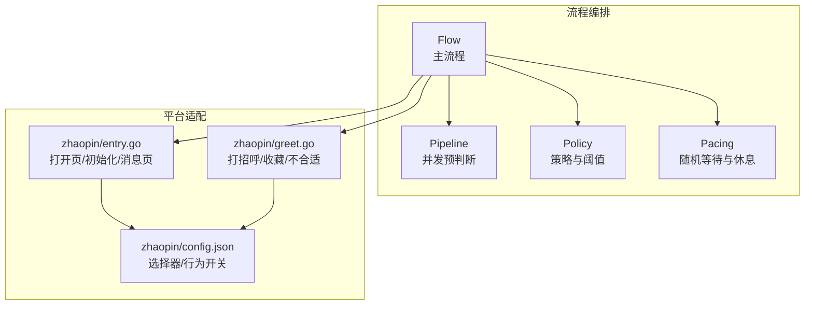
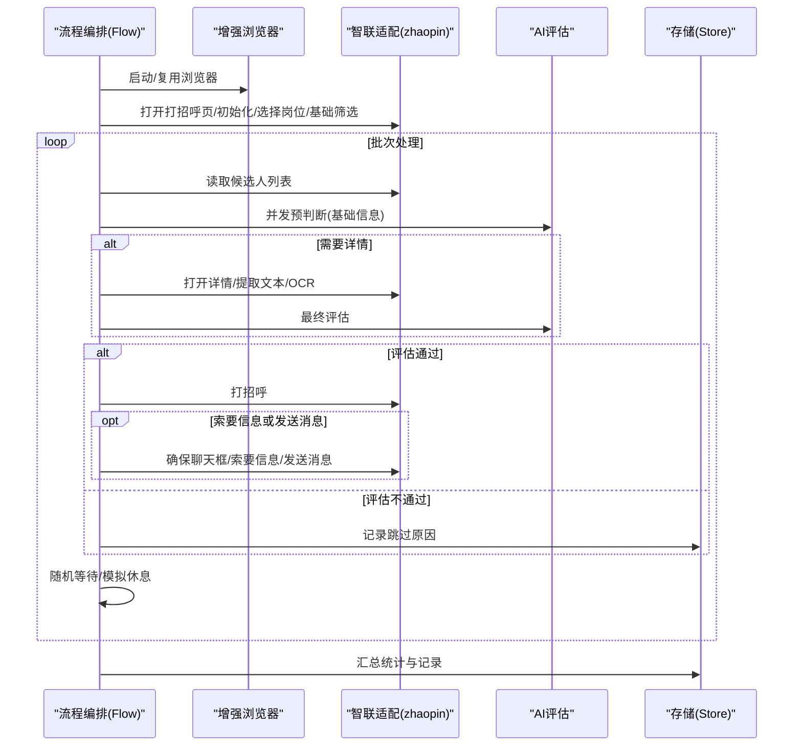
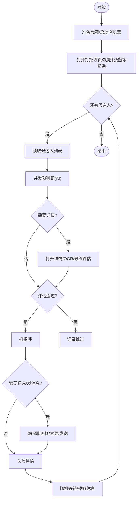
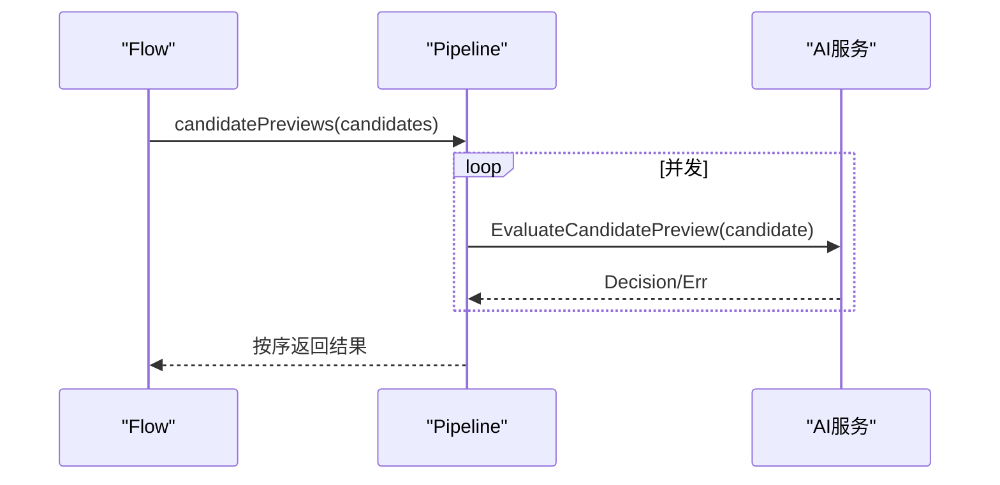
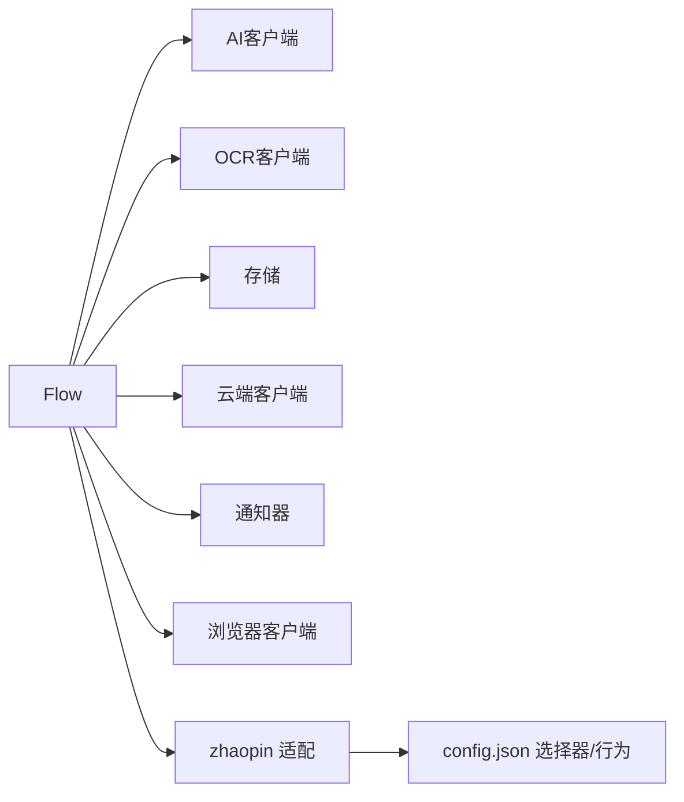

# 自动问候

<cite>
**本文引用的文件**
- [flow.go](file://goodhr5/local-agent-go-new/internal/flow/greeting/flow.go)
- [pipeline.go](file://goodhr5/local-agent-go-new/internal/flow/greeting/pipeline.go)
- [policy.go](file://goodhr5/local-agent-go-new/internal/flow/greeting/policy.go)
- [pacing.go](file://goodhr5/local-agent-go-new/internal/flow/greeting/pacing.go)
- [greet.go](file://goodhr5/local-agent-go-new/internal/platform/zhaopin/greet.go)
- [entry.go](file://goodhr5/local-agent-go-new/internal/platform/zhaopin/entry.go)
- [config.json](file://goodhr5/local-agent-go-new/internal/platform/zhaopin/config.json)
</cite>

## 目录
1. [简介](#简介)
2. [项目结构](#项目结构)
3. [核心组件](#核心组件)
4. [架构总览](#架构总览)
5. [详细组件分析](#详细组件分析)
6. [依赖关系分析](#依赖关系分析)
7. [性能与频率控制](#性能与频率控制)
8. [故障排查指南](#故障排查指南)
9. [结论](#结论)
10. [附录：配置与使用示例](#附录配置与使用示例)

## 简介
本文件面向智联招聘平台的“自动问候”能力，系统化说明消息发送的自动化流程、模板与个性化生成方式、发送时机与频率限制、状态跟踪与失败重试策略、发送记录管理，以及模板定制、A/B测试支持与效果分析方法。文档以代码实现为依据，提供可追溯的文件来源与图示，帮助读者快速理解并正确配置该功能。

## 项目结构
自动问候由“流程编排层”和“平台适配层”共同组成：
- 流程编排层（local-agent-go-new/internal/flow/greeting）负责整体任务编排、候选人筛选、AI评估、节奏控制、截图与日志、结果持久化等。
- 平台适配层（local-agent-go-new/internal/platform/zhaopin）封装智联招聘页面的具体操作，如打开页面、选择岗位、滚动列表、打开详情、打招呼、索要信息、发消息、关闭会话等。
- 平台行为与选择器通过配置文件集中管理（config.json），便于在不改代码的情况下调整页面交互细节。

图表来源
- [flow.go:49-95](file://goodhr5/local-agent-go-new/internal/flow/greeting/flow.go#L49-L95)
- [pipeline.go:25-98](file://goodhr5/local-agent-go-new/internal/flow/greeting/pipeline.go#L25-L98)
- [policy.go:12-54](file://goodhr5/local-agent-go-new/internal/flow/greeting/policy.go#L12-L54)
- [pacing.go:22-112](file://goodhr5/local-agent-go-new/internal/flow/greeting/pacing.go#L22-L112)
- [entry.go:21-45](file://goodhr5/local-agent-go-new/internal/platform/zhaopin/entry.go#L21-L45)
- [greet.go:11-24](file://goodhr5/local-agent-go-new/internal/platform/zhaopin/greet.go#L11-L24)
- [config.json:39-53](file://goodhr5/local-agent-go-new/internal/platform/zhaopin/config.json#L39-L53)

章节来源
- [flow.go:49-95](file://goodhr5/local-agent-go-new/internal/flow/greeting/flow.go#L49-L95)
- [entry.go:21-45](file://goodhr5/local-agent-go-new/internal/platform/zhaopin/entry.go#L21-L45)
- [config.json:39-53](file://goodhr5/local-agent-go-new/internal/platform/zhaopin/config.json#L39-L53)

## 核心组件
- Flow 主流程：按步骤启动浏览器、进入智联打招呼入口、选择岗位、应用基础筛选、分批扫描候选人、执行 AI 预判断与最终判断、打开/关闭详情、打招呼、可选索要信息与发送自定义消息、保存结果与统计。
- Pipeline 并发预判断：对当前批候选人的基础信息进行并行 AI 预判断，保持页面顺序输出，用于提前过滤低匹配候选人，减少不必要的详情打开。
- Policy 策略：决定是否需要打开详情、是否命中个人概率、是否允许索要信息、索要信息的分数阈值等。
- Pacing 节奏控制：在关键节点插入随机等待，模拟人类浏览；按用户偏好进行周期性“模拟休息”，避免长时间高频操作。
- 平台适配（zhaopin）：封装智联招聘的具体页面操作，所有选择器与行为开关集中在 config.json。

章节来源
- [flow.go:25-95](file://goodhr5/local-agent-go-new/internal/flow/greeting/flow.go#L25-L95)
- [pipeline.go:25-98](file://goodhr5/local-agent-go-new/internal/flow/greeting/pipeline.go#L25-L98)
- [policy.go:12-54](file://goodhr5/local-agent-go-new/internal/flow/greeting/policy.go#L12-L54)
- [pacing.go:22-112](file://goodhr5/local-agent-go-new/internal/flow/greeting/pacing.go#L22-L112)
- [greet.go:11-24](file://goodhr5/local-agent-go-new/internal/platform/zhaopin/greet.go#L11-L24)
- [entry.go:21-45](file://goodhr5/local-agent-go-new/internal/platform/zhaopin/entry.go#L21-L45)

## 架构总览
自动问候的整体调用链如下：
- 流程编排层驱动浏览器进入智联打招呼入口，选择岗位并应用筛选。
- 每批候选人先进行并发 AI 预判断，决定是否打开详情。
- 需要详情的候选人打开详情页，必要时进行 OCR 识别，再执行最终 AI 评估。
- 根据评估结果决定是否打招呼；若开启索要信息或自定义消息，则进入聊天框完成相应动作。
- 每次操作均伴随随机等待与日志记录，结果写入存储。

图表来源
- [flow.go:49-95](file://goodhr5/local-agent-go-new/internal/flow/greeting/flow.go#L49-L95)
- [flow.go:121-336](file://goodhr5/local-agent-go-new/internal/flow/greeting/flow.go#L121-L336)
- [pipeline.go:25-98](file://goodhr5/local-agent-go-new/internal/flow/greeting/pipeline.go#L25-L98)
- [greet.go:11-24](file://goodhr5/local-agent-go-new/internal/platform/zhaopin/greet.go#L11-L24)
- [entry.go:21-45](file://goodhr5/local-agent-go-new/internal/platform/zhaopin/entry.go#L21-L45)

## 详细组件分析

### 主流程（Flow）
- 步骤化执行：准备截图工作区、启动浏览器、打开打招呼页、初始化页面、选择岗位、应用基础筛选、批量处理候选人。
- 批次循环：每批读取候选人，去重后并发预判断；按需打开详情、OCR、最终评估；通过后打招呼，必要时进入聊天框索要信息或发送消息；关闭详情/聊天框；记录结果。
- 错误与停止：使用连续错误策略，遇到不可恢复错误时终止；支持优雅停止信号；对平台特定错误（如已联系、详情不可用）做区分处理。
- 统计与记录：维护成功、跳过、失败计数；将每个候选人的动作、结果、原因保存到存储。

图表来源
- [flow.go:49-95](file://goodhr5/local-agent-go-new/internal/flow/greeting/flow.go#L49-L95)
- [flow.go:121-336](file://goodhr5/local-agent-go-new/internal/flow/greeting/flow.go#L121-L336)
- [flow.go:343-642](file://goodhr5/local-agent-go-new/internal/flow/greeting/flow.go#L343-L642)

章节来源
- [flow.go:49-95](file://goodhr5/local-agent-go-new/internal/flow/greeting/flow.go#L49-L95)
- [flow.go:121-336](file://goodhr5/local-agent-go-new/internal/flow/greeting/flow.go#L121-L336)
- [flow.go:343-642](file://goodhr5/local-agent-go-new/internal/flow/greeting/flow.go#L343-L642)

### 并发预判断（Pipeline）
- 并发度：最多固定并发数，按页面原顺序输出结果，保证后续处理的稳定性。
- 预判断目的：基于候选人基础信息进行快速过滤，降低详情打开与 OCR 成本。
- 取消与超时：支持上下文取消，避免阻塞。

图表来源
- [pipeline.go:25-98](file://goodhr5/local-agent-go-new/internal/flow/greeting/pipeline.go#L25-L98)
- [pipeline.go:100-151](file://goodhr5/local-agent-go-new/internal/flow/greeting/pipeline.go#L100-L151)

章节来源
- [pipeline.go:25-98](file://goodhr5/local-agent-go-new/internal/flow/greeting/pipeline.go#L25-L98)
- [pipeline.go:100-151](file://goodhr5/local-agent-go-new/internal/flow/greeting/pipeline.go#L100-L151)

### 策略（Policy）
- 是否需要详情：平台行为、AI/OCR需求、详情模式等条件决定。
- 关键词模式下的详情打开概率：支持百分比随机命中。
- 索要信息阈值：优先使用岗位配置的请求分数阈值，否则回退到打招呼阈值或默认值。
- 允许索要的条件：必须有最终评分且严格大于阈值。

章节来源
- [policy.go:12-54](file://goodhr5/local-agent-go-new/internal/flow/greeting/policy.go#L12-L54)

### 节奏控制（Pacing）
- 随机等待：在列表浏览、滚动加载、打开/关闭详情、打招呼前等关键节点插入随机秒数等待，提升拟人化程度。
- 模拟休息：按用户偏好设置休息次数、首次触发点、时长范围，周期性地暂停任务，避免长时间高频操作。
- 可取消：所有等待均响应上下文取消与优雅停止信号。

章节来源
- [pacing.go:22-112](file://goodhr5/local-agent-go-new/internal/flow/greeting/pacing.go#L22-L112)
- [pacing.go:114-176](file://goodhr5/local-agent-go-new/internal/flow/greeting/pacing.go#L114-L176)

### 平台适配（智联 zhaopin）
- 页面入口与初始化：打开登录页、推荐页、消息页，并在各页执行初始化动作（如关闭弹框）。
- 候选人操作：打招呼、收藏、标记不合适等统一委托通用实现。
- 选择器与行为：通过 config.json 定义页面元素定位、行为开关（如是否需要详情、列表加载方式）、字段读取规则等。

章节来源
- [entry.go:11-45](file://goodhr5/local-agent-go-new/internal/platform/zhaopin/entry.go#L11-L45)
- [greet.go:11-24](file://goodhr5/local-agent-go-new/internal/platform/zhaopin/greet.go#L11-L24)
- [config.json:39-53](file://goodhr5/local-agent-go-new/internal/platform/zhaopin/config.json#L39-L53)
- [config.json:227-276](file://goodhr5/local-agent-go-new/internal/platform/zhaopin/config.json#L227-L276)
- [config.json:277-380](file://goodhr5/local-agent-go-new/internal/platform/zhaopin/config.json#L277-L380)

## 依赖关系分析
- Flow 依赖：浏览器客户端、AI 客户端、OCR 客户端、存储、云端客户端、通知器、日志。
- 平台适配依赖：通用选择器与行为配置（config.json），以及通用页面操作实现。
- 耦合与内聚：流程编排与平台适配解耦，平台差异集中在 zhaopin 包与配置中；策略与节奏控制独立，便于扩展与测试。

图表来源
- [flow.go:25-39](file://goodhr5/local-agent-go-new/internal/flow/greeting/flow.go#L25-L39)
- [entry.go:11-45](file://goodhr5/local-agent-go-new/internal/platform/zhaopin/entry.go#L11-L45)
- [config.json:39-53](file://goodhr5/local-agent-go-new/internal/platform/zhaopin/config.json#L39-L53)

章节来源
- [flow.go:25-39](file://goodhr5/local-agent-go-new/internal/flow/greeting/flow.go#L25-L39)
- [entry.go:11-45](file://goodhr5/local-agent-go-new/internal/platform/zhaopin/entry.go#L11-L45)
- [config.json:39-53](file://goodhr5/local-agent-go-new/internal/platform/zhaopin/config.json#L39-L53)

## 性能与频率控制
- 并发预判断：提高吞吐，减少无效详情打开。
- 随机等待：在多个关键节点插入随机延迟，降低平台风控风险。
- 模拟休息：按用户偏好周期性暂停，避免长时间高频操作。
- 批处理与上限：支持批次数量与岗位匹配上限控制，防止过度消耗。
- 详情打开概率：关键词模式下可按百分比随机打开详情，平衡效率与质量。

章节来源
- [pipeline.go:25-98](file://goodhr5/local-agent-go-new/internal/flow/greeting/pipeline.go#L25-L98)
- [pacing.go:22-112](file://goodhr5/local-agent-go-new/internal/flow/greeting/pacing.go#L22-L112)
- [flow.go:121-336](file://goodhr5/local-agent-go-new/internal/flow/greeting/flow.go#L121-L336)
- [policy.go:20-33](file://goodhr5/local-agent-go-new/internal/flow/greeting/policy.go#L20-L33)

## 故障排查指南
- 常见错误类型：
  - 详情不可用：跳过并记录原因。
  - 已联系：本轮不重复打招呼，跳过并记录。
  - OCR无文本：跳过并记录。
  - 页面诊断：在滚动、打开/关闭详情、确认聊天框、索要信息、发送消息失败时记录页面诊断信息。
- 错误策略：使用连续错误策略，达到阈值后终止任务，避免无限重试。
- 日志与进度：每一步均有开始/成功/失败/跳过日志，并通过进度报告向用户反馈当前状态。
- 建议排查步骤：
  - 检查 config.json 中的选择器是否与当前页面一致。
  - 查看对应步骤的日志标签（如 open_detail、ocr、greet、ensure_candidate_conversation）。
  - 关注随机等待与模拟休息是否过长导致任务看似停滞。
  - 核对岗位配置中的 AI/OCR/详情模式与阈值设置。

章节来源
- [flow.go:343-642](file://goodhr5/local-agent-go-new/internal/flow/greeting/flow.go#L343-L642)
- [flow.go:644-665](file://goodhr5/local-agent-go-new/internal/flow/greeting/flow.go#L644-L665)

## 结论
自动问候功能通过“流程编排 + 平台适配 + 配置驱动”的方式，实现了智联招聘平台的高效、拟人化、可观测的消息发送自动化。其核心优势包括：
- 并发预判断降低无效详情打开，提升效率。
- 随机等待与模拟休息保障账号安全与平台友好性。
- 策略与阈值灵活可控，支持精细化运营。
- 完善的日志、诊断与记录，便于问题定位与效果分析。

## 附录：配置与使用示例
- 模板与个性化：
  - 自定义问候语：在岗位配置中设置问候消息，系统会在确认后发送。
  - 索要信息：可配置电话、微信、附件简历的索要动作，结合 AI 评分阈值决定是否执行。
  - 详情模式：支持普通模式与 AI 模式；AI 模式可结合图片与文本进行更精准评估。
- 发送时机控制：
  - 列表浏览前、滚动加载后、打开/关闭详情前后、打招呼前均会插入随机等待。
  - 可按用户偏好进行周期性模拟休息。
- 频率限制机制：
  - 批次数量与岗位匹配上限控制。
  - 关键词模式下详情打开概率控制。
- 状态跟踪与失败重试：
  - 每步操作记录开始/成功/失败/跳过，附带原因。
  - 连续错误策略在达到阈值后终止任务。
- A/B测试与效果分析：
  - 可通过不同岗位的详情打开概率、索要阈值、AI 模式等维度进行对比。
  - 利用统计指标（成功、跳过、失败）与候选人记录进行分析。

章节来源
- [flow.go:557-637](file://goodhr5/local-agent-go-new/internal/flow/greeting/flow.go#L557-L637)
- [policy.go:35-54](file://goodhr5/local-agent-go-new/internal/flow/greeting/policy.go#L35-L54)
- [config.json:227-380](file://goodhr5/local-agent-go-new/internal/platform/zhaopin/config.json#L227-L380)