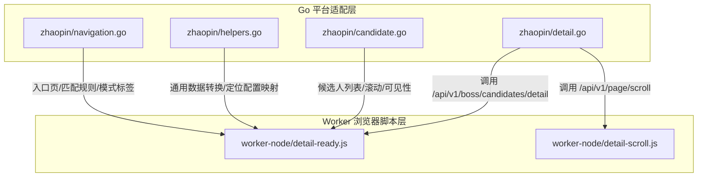
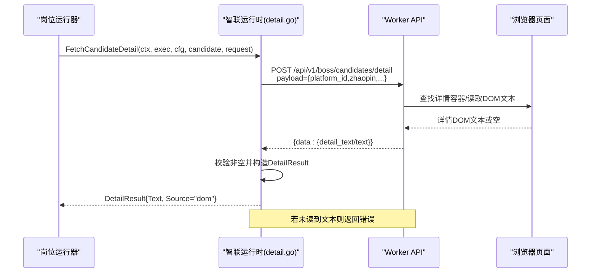
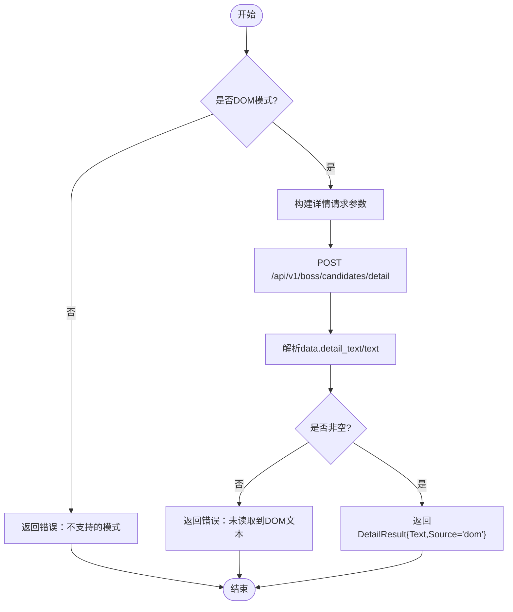
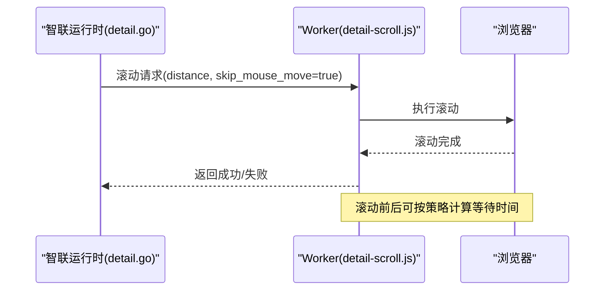
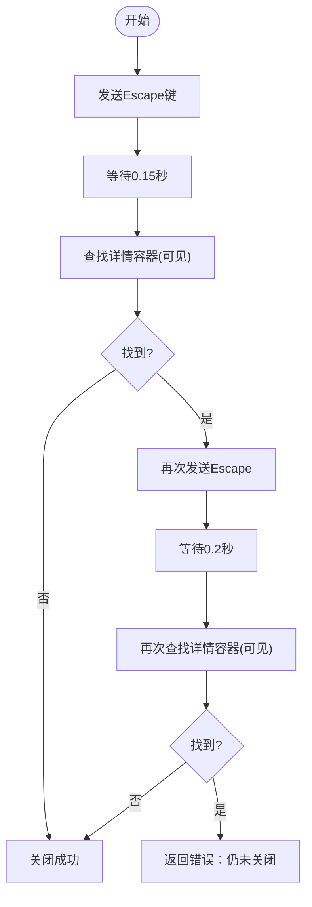
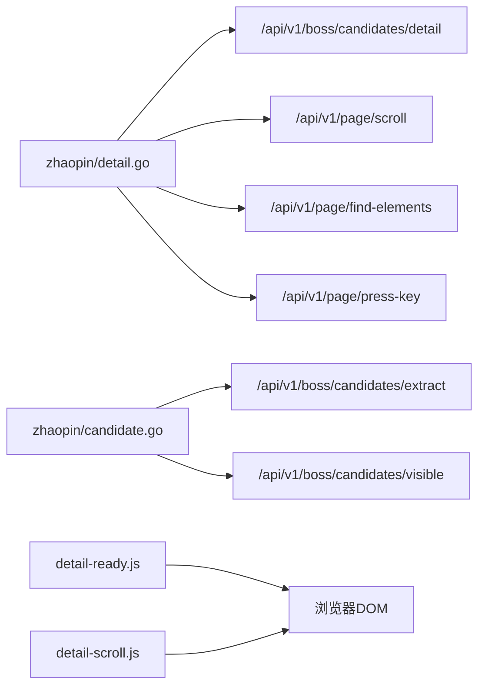

# 详情页面处理

<cite>
**本文引用的文件**   
- [detail.go](file://goodhr5/local-agent-go/internal/platforms/zhaopin/detail.go)
- [candidate.go](file://goodhr5/local-agent-go/internal/platforms/zhaopin/candidate.go)
- [helpers.go](file://goodhr5/local-agent-go/internal/platforms/zhaopin/helpers.go)
- [navigation.go](file://goodhr5/local-agent-go/internal/platforms/zhaopin/navigation.go)
- [detail-ready.js](file://goodhr5/local-agent-go/worker-node/src/detail-ready.js)
- [detail-scroll.js](file://goodhr5/local-agent-go/worker-node/src/detail-scroll.js)
</cite>

## 目录
1. [引言](#引言)
2. [项目结构](#项目结构)
3. [核心组件](#核心组件)
4. [架构总览](#架构总览)
5. [详细组件分析](#详细组件分析)
6. [依赖关系分析](#依赖关系分析)
7. [性能考虑](#性能考虑)
8. [故障排查指南](#故障排查指南)
9. [结论](#结论)

## 引言
本文聚焦智联招聘平台“候选人详情页”的自动化处理方案，覆盖以下关键目标：
- DOM 结构与动态内容加载解析
- 简历文本提取、联系方式识别与技能标签解析策略
- 页面跳转、弹窗操作与异步等待机制
- 错误处理、重试策略与性能优化建议
- 基于现有代码的数据提取实现路径说明

本项目的智联招聘详情处理采用“Go 本地运行时 + Worker Node 脚本”的分层架构：Go 侧负责平台适配、参数组装、日志与流程控制；Worker 侧负责浏览器内 DOM 查询、滚动节奏与可见性检测。

## 项目结构
智联招聘详情相关代码主要分布在两个位置：
- Go 平台适配层：internal/platforms/zhaopin/*
- Worker 浏览器脚本层：worker-node/src/detail-*.js

图示来源
- [detail.go:13-39](file://goodhr5/local-agent-go/internal/platforms/zhaopin/detail.go#L13-L39)
- [detail-ready.js:9-50](file://goodhr5/local-agent-go/worker-node/src/detail-ready.js#L9-L50)
- [detail-scroll.js:15-37](file://goodhr5/local-agent-go/worker-node/src/detail-scroll.js#L15-L37)

章节来源
- [detail.go:13-39](file://goodhr5/local-agent-go/internal/platforms/zhaopin/detail.go#L13-L39)
- [detail-ready.js:9-50](file://goodhr5/local-agent-go/worker-node/src/detail-ready.js#L9-L50)
- [detail-scroll.js:15-37](file://goodhr5/local-agent-go/worker-node/src/detail-scroll.js#L15-L37)

## 核心组件
- 详情提取入口：FetchCandidateDetail
  - 仅支持 DOM 模式
  - 通过 Worker API 获取详情文本
  - 返回标准化 DetailResult
- 详情滚动：ScrollCandidateDetail
  - 直接调用页面滚动接口
- 详情关闭：CloseCandidateDetail
  - 发送 Escape 键
  - 轮询确认弹窗已消失
  - 失败时二次尝试并报错
- 文本清理：CleanCandidateDetailText
  - 去除首尾空白
- 候选人与列表辅助：ListVisibleCandidates、EnsureCandidateVisible、CandidateFilterText、CandidateFingerprint
- Worker 等待与滚动：waitForDetailContainer、detailScrollWaits、effectiveDetailWheelDistance

章节来源
- [detail.go:13-102](file://goodhr5/local-agent-go/internal/platforms/zhaopin/detail.go#L13-L102)
- [candidate.go:13-85](file://goodhr5/local-agent-go/internal/platforms/zhaopin/candidate.go#L13-L85)
- [detail-ready.js:9-50](file://goodhr5/local-agent-go/worker-node/src/detail-ready.js#L9-L50)
- [detail-scroll.js:15-37](file://goodhr5/local-agent-go/worker-node/src/detail-scroll.js#L15-L37)

## 架构总览
智联招聘详情页处理的关键交互如下：

图示来源
- [detail.go:13-39](file://goodhr5/local-agent-go/internal/platforms/zhaopin/detail.go#L13-L39)

## 详细组件分析

### 详情提取流程（FetchCandidateDetail）
- 模式校验：仅允许 DOM 模式
- 参数构建：
  - platform_id=zhaopin
  - position_id=当前岗位ID
  - screenshot=false
  - force_scroll=false
  - card_scroll_attempts=3
  - require_full=false
  - detail_ready_timeout=5000
  - viewport_margin=24
- 调用 Worker 详情接口，解析 data.detail_text 或 data.text
- 若为空，返回错误；否则返回结构化结果

图示来源
- [detail.go:13-39](file://goodhr5/local-agent-go/internal/platforms/zhaopin/detail.go#L13-L39)

章节来源
- [detail.go:13-39](file://goodhr5/local-agent-go/internal/platforms/zhaopin/detail.go#L13-L39)

### 详情滚动与等待（ScrollCandidateDetail、detail-ready.js、detail-scroll.js）
- Go 侧 ScrollCandidateDetail：直接调用页面滚动接口，跳过鼠标移动，记录耗时
- Worker 侧 waitForDetailContainer：
  - 固定间隔轮询详情容器可见性
  - 超时后返回 ready=false 及原因
- Worker 侧 detailScrollWaits/effectiveDetailWheelDistance：
  - 统一截图与滚动等待时长
  - 根据可滚动方向修正滚轮距离

图示来源
- [detail.go:42-55](file://goodhr5/local-agent-go/internal/platforms/zhaopin/detail.go#L42-L55)
- [detail-ready.js:9-50](file://goodhr5/local-agent-go/worker-node/src/detail-ready.js#L9-L50)
- [detail-scroll.js:15-37](file://goodhr5/local-agent-go/worker-node/src/detail-scroll.js#L15-L37)

章节来源
- [detail.go:42-55](file://goodhr5/local-agent-go/internal/platforms/zhaopin/detail.go#L42-L55)
- [detail-ready.js:9-50](file://goodhr5/local-agent-go/worker-node/src/detail-ready.js#L9-L50)
- [detail-scroll.js:15-37](file://goodhr5/local-agent-go/worker-node/src/detail-scroll.js#L15-L37)

### 详情弹窗关闭（CloseCandidateDetail）
- 发送 Escape 键关闭弹窗
- 短暂等待后检查是否存在 .new-resume-detail--inner 或 .resume-detail
- 若仍存在，再次发送 Escape 并等待
- 最多两次尝试，最终仍失败则返回错误

图示来源
- [detail.go:57-96](file://goodhr5/local-agent-go/internal/platforms/zhaopin/detail.go#L57-L96)

章节来源
- [detail.go:57-96](file://goodhr5/local-agent-go/internal/platforms/zhaopin/detail.go#L57-L96)

### 候选人列表与可见性（candidate.go）
- ListVisibleCandidates：调用 Worker 提取候选人卡片，统计 find/convert/elapsed 耗时
- EnsureCandidateVisible：将目标候选人滚动至可视区域
- CandidateFilterText/CandidateFingerprint：用于筛选与去重

章节来源
- [candidate.go:13-85](file://goodhr5/local-agent-go/internal/platforms/zhaopin/candidate.go#L13-L85)

### 工具与配置映射（helpers.go、navigation.go）
- helpers.go：提供 map/list/string/int 安全读取、Worker 响应 data 字段解析、元素定位 payload 转换等
- navigation.go：入口页选择、URL 匹配、岗位名称规范化、详情模式标签

章节来源
- [helpers.go:9-206](file://goodhr5/local-agent-go/internal/platforms/zhaopin/helpers.go#L9-L206)
- [navigation.go:12-161](file://goodhr5/local-agent-go/internal/platforms/zhaopin/navigation.go#L12-L161)

## 依赖关系分析
- Go 平台适配层依赖 Worker API：
  - /api/v1/boss/candidates/detail：详情DOM文本
  - /api/v1/boss/candidates/extract：候选人列表
  - /api/v1/boss/candidates/visible：滚动至可见
  - /api/v1/page/scroll：页面滚动
  - /api/v1/page/find-elements：元素存在性检测
  - /api/v1/page/press-key：按键模拟
- Worker 脚本依赖浏览器 DOM：
  - 详情容器可见性检测
  - 滚动与截图等待策略

图示来源
- [detail.go:13-96](file://goodhr5/local-agent-go/internal/platforms/zhaopin/detail.go#L13-L96)
- [candidate.go:13-69](file://goodhr5/local-agent-go/internal/platforms/zhaopin/candidate.go#L13-L69)
- [detail-ready.js:9-50](file://goodhr5/local-agent-go/worker-node/src/detail-ready.js#L9-L50)
- [detail-scroll.js:15-37](file://goodhr5/local-agent-go/worker-node/src/detail-scroll.js#L15-L37)

章节来源
- [detail.go:13-96](file://goodhr5/local-agent-go/internal/platforms/zhaopin/detail.go#L13-L96)
- [candidate.go:13-69](file://goodhr5/local-agent-go/internal/platforms/zhaopin/candidate.go#L13-L69)
- [detail-ready.js:9-50](file://goodhr5/local-agent-go/worker-node/src/detail-ready.js#L9-L50)
- [detail-scroll.js:15-37](file://goodhr5/local-agent-go/worker-node/src/detail-scroll.js#L15-L37)

## 性能考虑
- 详情等待策略
  - detail_ready_timeout=5000ms，避免长时间阻塞
  - viewport_margin=24，减少误判导致的无效滚动
- 滚动策略
  - 使用 skip_mouse_move=true 降低不必要的鼠标移动开销
  - detailScrollWaits 统一截图与滚动等待时长，避免抖动
- 日志与可观测性
  - 候选人提取与整理过程输出 find_elapsed_ms、convert_elapsed_ms、elapsed_ms
  - 详情滚动与关闭过程记录耗时与状态

[本节为通用性能建议，不直接分析具体文件]

## 故障排查指南
- 详情未读取到DOM文本
  - 现象：返回错误“智联招聘详情弹框未读取到 DOM 文本”
  - 可能原因：详情容器未出现、Worker 未返回 text/detail_text
  - 处理建议：
    - 检查 detail_ready_timeout 与 pollIntervalMs 是否合理
    - 查看 Worker 日志中 reason 字段（如“未找到可见详情容器”）
    - 必要时增大 timeout 或调整 viewport_margin
- 详情弹窗无法关闭
  - 现象：返回错误“智联详情弹框仍未关闭”
  - 可能原因：页面结构变化导致选择器失效、键盘事件被拦截
  - 处理建议：
    - 检查选择器 .new-resume-detail--inner, .resume-detail 在当前页面是否有效
    - 增加二次 Escape 后的等待时间
    - 在 Worker 侧增加元素存在性诊断日志
- 候选人列表为空或耗时过长
  - 现象：found_count 为 0 或 elapsed_ms 过大
  - 可能原因：页面未滚动到底、网络延迟、Worker 卡顿
  - 处理建议：
    - 确保先执行滚动再提取
    - 观察 find_elapsed_ms 与 convert_elapsed_ms 分布
    - 适当增加最大项数上限或分批处理

章节来源
- [detail.go:13-39](file://goodhr5/local-agent-go/internal/platforms/zhaopin/detail.go#L13-L39)
- [detail.go:57-96](file://goodhr5/local-agent-go/internal/platforms/zhaopin/detail.go#L57-L96)
- [detail-ready.js:9-50](file://goodhr5/local-agent-go/worker-node/src/detail-ready.js#L9-L50)
- [candidate.go:13-49](file://goodhr5/local-agent-go/internal/platforms/zhaopin/candidate.go#L13-L49)

## 结论
智联招聘平台的详情页面处理以“Go 平台适配 + Worker 浏览器脚本”为核心架构：
- Go 侧专注流程编排、参数装配与错误处理
- Worker 侧专注 DOM 可见性检测、滚动节奏与截图等待
- 通过统一的 Worker API 与稳定的选择器策略，保证详情页访问的鲁棒性与可观测性

在实际落地中，建议：
- 优先保障详情容器的稳定可见性检测
- 对弹窗关闭进行双重确认与二次恢复
- 结合日志指标持续优化等待与滚动策略，提升整体吞吐与稳定性

[本节为总结性内容，不直接分析具体文件]