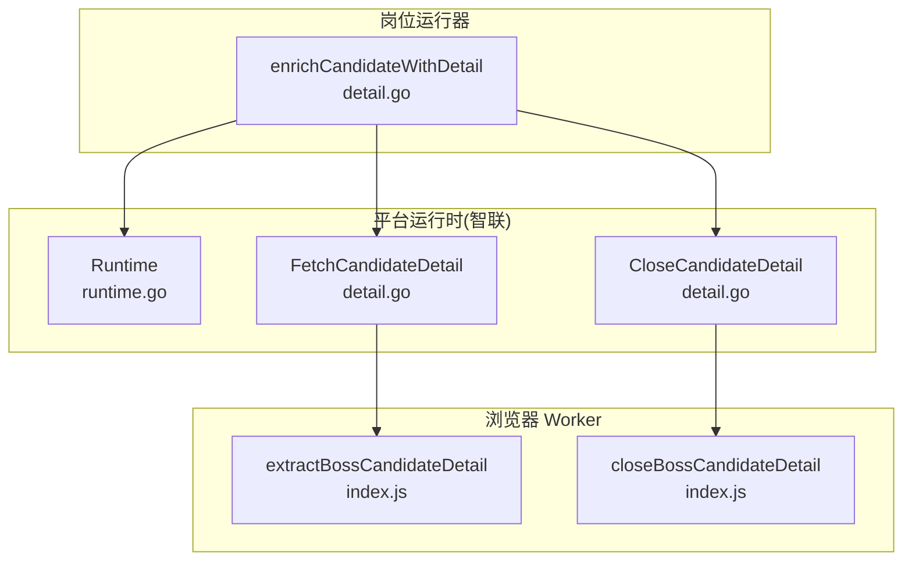
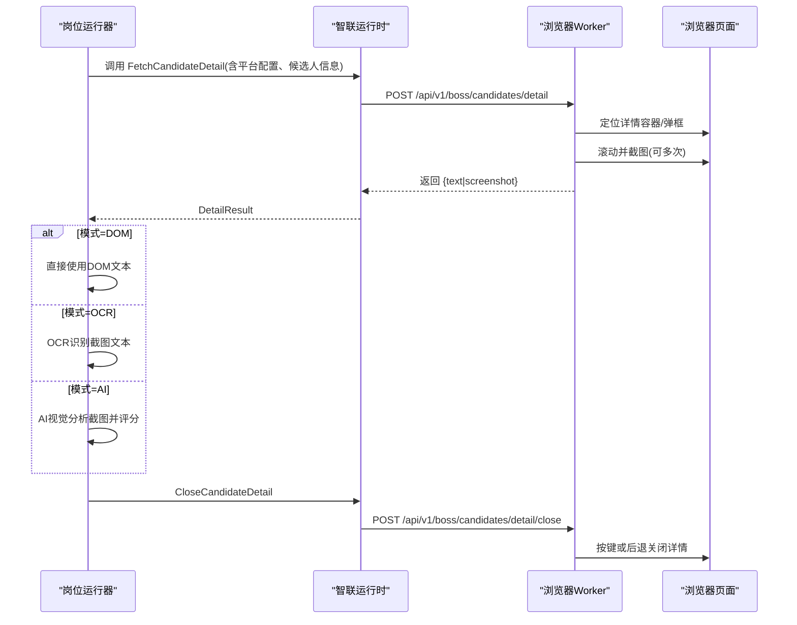
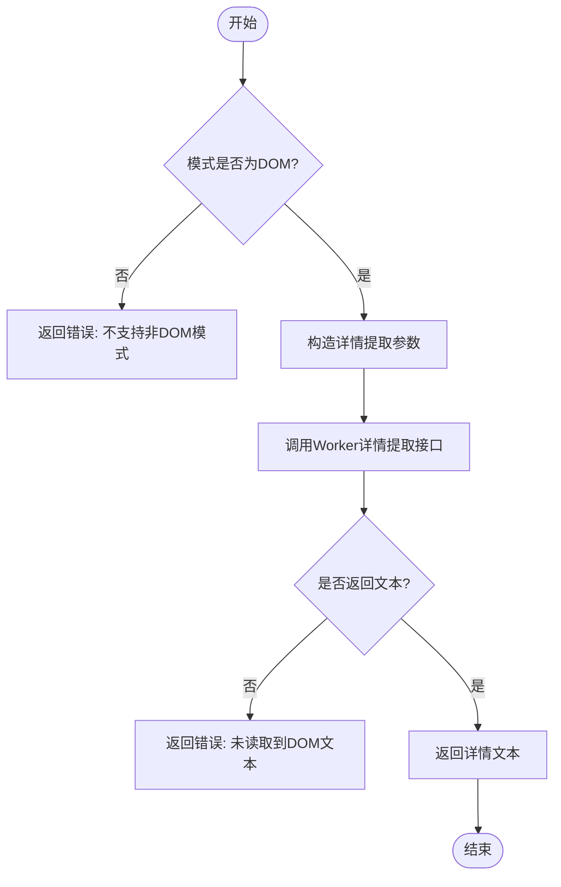
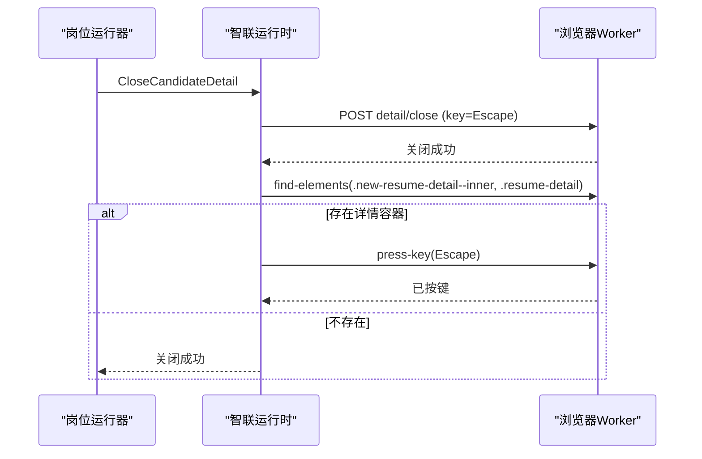
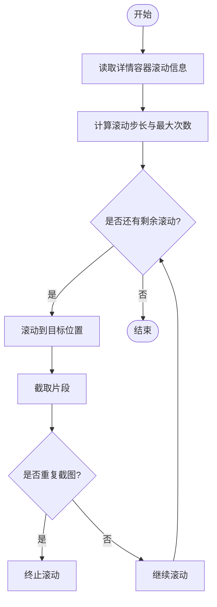
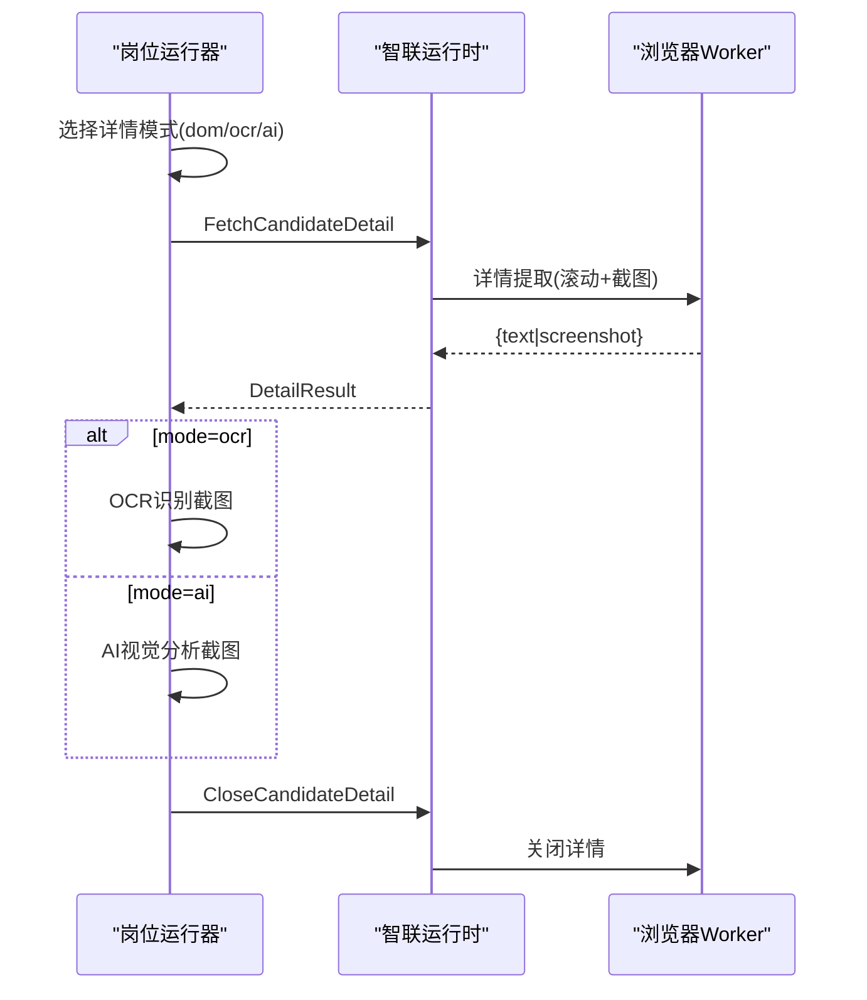
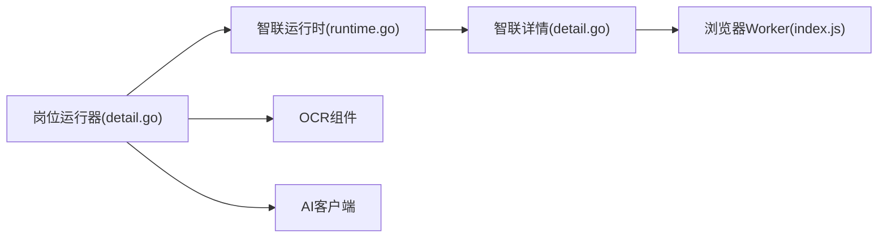

# 详情页面处理

<cite>
**本文引用的文件**
- [detail.go](file://goodhr5/local-agent-go/internal/platforms/zhaopin/detail.go)
- [candidate.go](file://goodhr5/local-agent-go/internal/platforms/zhaopin/candidate.go)
- [entry.go](file://goodhr5/local-agent-go/internal/platforms/zhaopin/entry.go)
- [helpers.go](file://goodhr5/local-agent-go/internal/platforms/zhaopin/helpers.go)
- [runtime.go](file://goodhr5/local-agent-go/internal/platforms/zhaopin/runtime.go)
- [runtime.go](file://goodhr5/local-agent-go/internal/platformcore/runtime.go)
- [detail.go](file://goodhr5/local-agent-go/internal/positionrunner/detail.go)
- [index.js](file://goodhr5/local-agent-go/worker-node/src/index.js)
</cite>

## 目录
1. [简介](#简介)
2. [项目结构](#项目结构)
3. [核心组件](#核心组件)
4. [架构总览](#架构总览)
5. [详细组件分析](#详细组件分析)
6. [依赖关系分析](#依赖关系分析)
7. [性能考虑](#性能考虑)
8. [故障排查指南](#故障排查指南)
9. [结论](#结论)
10. [附录](#附录)

## 简介
本文件聚焦智联招聘平台“候选人详情页”的自动化处理方案，覆盖 DOM 解析、动态内容加载、表单元素识别、简历内容提取、联系方式与技能标签解析策略，以及页面跳转、弹窗操作、异步等待机制。同时给出错误处理、重试策略与性能优化建议，并展示关键实现路径以便定位代码。

## 项目结构
智联招聘详情流程由三层协作完成：
- 平台运行时（Go）：封装平台特定行为，负责调用浏览器 Worker 接口、组装参数、解析结果、关闭弹窗等。
- 岗位运行器（Go）：编排详情读取流程，支持 DOM/OCR/AI 三种模式，管理滚动、截图、超时、重试与清理。
- 浏览器 Worker（Node.js）：实际在浏览器中执行定位、滚动、截图、DOM 文本提取等操作。

图表来源
- [detail.go:122-279](file://goodhr5/local-agent-go/internal/positionrunner/detail.go#L122-L279)
- [detail.go:13-39](file://goodhr5/local-agent-go/internal/platforms/zhaopin/detail.go#L13-L39)
- [detail.go:57-96](file://goodhr5/local-agent-go/internal/platforms/zhaopin/detail.go#L57-L96)
- [index.js:1714-2009](file://goodhr5/local-agent-go/worker-node/src/index.js#L1714-L2009)

章节来源
- [detail.go:122-279](file://goodhr5/local-agent-go/internal/positionrunner/detail.go#L122-L279)
- [detail.go:13-39](file://goodhr5/local-agent-go/internal/platforms/zhaopin/detail.go#L13-L39)
- [detail.go:57-96](file://goodhr5/local-agent-go/internal/platforms/zhaopin/detail.go#L57-L96)
- [index.js:1714-2009](file://goodhr5/local-agent-go/worker-node/src/index.js#L1714-L2009)

## 核心组件
- 平台运行时（智联）
  - 打开入口页、判断是否仍在入口页、滚动列表、确保候选人可见、提取候选人、提取详情、关闭详情、清理详情文本。
- 岗位运行器
  - 决定详情模式（DOM/OCR/AI），组织详情读取、截图、OCR、AI 评分、滚动浏览、超时控制、异常分类与重试、最终关闭详情。
- 浏览器 Worker
  - 根据平台配置定位候选人卡片与详情容器，执行滚动、截图、DOM 文本提取；按平台差异处理关闭逻辑（如智联使用返回键或后退）。

章节来源
- [runtime.go:11-69](file://goodhr5/local-agent-go/internal/platforms/zhaopin/runtime.go#L11-L69)
- [detail.go:13-39](file://goodhr5/local-agent-go/internal/platforms/zhaopin/detail.go#L13-L39)
- [detail.go:57-96](file://goodhr5/local-agent-go/internal/platforms/zhaopin/detail.go#L57-L96)
- [detail.go:122-279](file://goodhr5/local-agent-go/internal/positionrunner/detail.go#L122-L279)
- [index.js:1714-2009](file://goodhr5/local-agent-go/worker-node/src/index.js#L1714-L2009)

## 架构总览
智联招聘详情处理的端到端流程如下：
- 岗位运行器根据岗位配置选择详情模式（DOM/OCR/AI）。
- 平台运行时构造请求参数，调用 Worker 的详情提取接口。
- Worker 在浏览器中定位详情容器，滚动并截图，必要时提取 DOM 文本。
- 岗位运行器根据模式进行 OCR 或 AI 图片分析，合并文本，设置状态，并在完成后关闭详情。

图表来源
- [detail.go:13-39](file://goodhr5/local-agent-go/internal/platforms/zhaopin/detail.go#L13-L39)
- [detail.go:57-96](file://goodhr5/local-agent-go/internal/platforms/zhaopin/detail.go#L57-L96)
- [index.js:1714-2009](file://goodhr5/local-agent-go/worker-node/src/index.js#L1714-L2009)
- [detail.go:122-279](file://goodhr5/local-agent-go/internal/positionrunner/detail.go#L122-L279)

## 详细组件分析

### 智联详情提取（DOM 模式）
- 入口校验：仅允许 DOM 模式。
- 参数构造：包含平台 ID、配置、候选人标识、位置 ID、截图开关、滚动次数、视口边距、详情就绪超时等。
- 调用 Worker：POST 到详情提取接口，解析 data.detail_text 或 data.text。
- 失败处理：若未读到文本则返回错误。
- 关闭详情：优先尝试 Escape 键，二次检测是否存在详情容器，必要时再次按键，直至确认关闭。

图表来源
- [detail.go:13-39](file://goodhr5/local-agent-go/internal/platforms/zhaopin/detail.go#L13-L39)

章节来源
- [detail.go:13-39](file://goodhr5/local-agent-go/internal/platforms/zhaopin/detail.go#L13-L39)

### 详情关闭与二次确认
- 首次关闭：发送关闭请求（默认使用 Escape 键）。
- 延迟等待：短暂等待弹框关闭。
- 二次检测：查找详情容器（例如 .new-resume-detail--inner, .resume-detail），若仍存在则再次按键并等待。
- 最终判定：若仍无法关闭，返回错误。

图表来源
- [detail.go:57-96](file://goodhr5/local-agent-go/internal/platforms/zhaopin/detail.go#L57-L96)
- [index.js:1984-2009](file://goodhr5/local-agent-go/worker-node/src/index.js#L1984-L2009)

章节来源
- [detail.go:57-96](file://goodhr5/local-agent-go/internal/platforms/zhaopin/detail.go#L57-L96)
- [index.js:1984-2009](file://goodhr5/local-agent-go/worker-node/src/index.js#L1984-L2009)

### 详情滚动与截图（Worker 侧）
- 滚动信息读取：获取详情容器的滚动高度、可视高度、溢出样式，判断是否可滚动。
- 分段截图策略：基于容器尺寸与视口高度计算滚动步长与重叠区域，限制最大滚动次数，避免重复截图。
- 去重检测：对比相邻截图字节差异，达到阈值即停止滚动。
- 底部判定：当 scrollTop 接近 scrollHeight - clientHeight 时认为到底。

图表来源
- [index.js:3200-3239](file://goodhr5/local-agent-go/worker-node/src/index.js#L3200-L3239)
- [index.js:3763-3804](file://goodhr5/local-agent-go/worker-node/src/index.js#L3763-L3804)
- [test-screenshot.js:137-195](file://goodhr5/local-agent-go/worker-node/src/test-screenshot.js#L137-L195)

章节来源
- [index.js:3200-3239](file://goodhr5/local-agent-go/worker-node/src/index.js#L3200-L3239)
- [index.js:3763-3804](file://goodhr5/local-agent-go/worker-node/src/index.js#L3763-L3804)
- [test-screenshot.js:137-195](file://goodhr5/local-agent-go/worker-node/src/test-screenshot.js#L137-L195)

### 岗位运行器对详情的编排（DOM/OCR/AI）
- 模式选择：从岗位快照的 common_config/keyword_config 中读取 detail_mode，支持 dom、ocr、ai。
- 打开前延时：模拟人工点击等待。
- 详情提取：调用平台运行时 FetchCandidateDetail，捕获错误并记录候选人的 detail_error。
- 截图与 OCR：若返回截图且模式为 ocr，调用本地 OCR 识别并清理文本。
- 截图与 AI：若模式为 ai，调用 AI 视觉分析，得到评分、理由、阈值与详情文本，决定是否打招呼。
- 文本合并：将详情文本与原始文本合并，去空值，更新候选人状态。
- 后台滚动：若平台实现 DetailAnalysisScroller，则在 AI 分析期间后台滚动详情，提升阅读完整性。
- 关闭详情：统一通过平台运行时 CloseCandidateDetail，并支持兜底关闭。

图表来源
- [detail.go:122-279](file://goodhr5/local-agent-go/internal/positionrunner/detail.go#L122-L279)
- [detail.go:13-39](file://goodhr5/local-agent-go/internal/platforms/zhaopin/detail.go#L13-L39)
- [index.js:1714-2009](file://goodhr5/local-agent-go/worker-node/src/index.js#L1714-L2009)

章节来源
- [detail.go:122-279](file://goodhr5/local-agent-go/internal/positionrunner/detail.go#L122-L279)

### 简历内容提取算法（DOM 模式）
- 数据来源：Worker 返回的 detail_text 或 text。
- 清洗策略：平台运行时提供 CleanCandidateDetailText，去除多余空白与平台附加内容。
- 合并策略：岗位运行器将详情文本与原始文本合并，避免重复与空值。
- 输出字段：候选人对象中包含 detail_text、raw_text、detail_source 等。

章节来源
- [detail.go:13-39](file://goodhr5/local-agent-go/internal/platforms/zhaopin/detail.go#L13-L39)
- [detail.go:181-279](file://goodhr5/local-agent-go/internal/positionrunner/detail.go#L181-L279)

### 联系方式识别规则（通用策略）
- 数据源：Worker 提取的 DOM 文本或截图 OCR 文本。
- 识别方式：正则匹配常见手机号、邮箱、微信号格式；结合上下文关键词（如“电话”“微信”“联系方式”）提高准确率。
- 清洗与归一化：去除空格、标点、无效占位符；统一格式（如手机号加区号、邮箱小写）。
- 验证：可选调用外部校验服务（如手机号段校验、邮箱域名白名单）。

说明：该策略为通用方法，具体实现需结合 Worker 的 DOM 文本结构与正则表达式。

### 技能标签解析方法（通用策略）
- 数据源：DOM 文本或截图 OCR 文本。
- 识别方式：基于技能词库与上下文匹配，提取“技能”“经验”“证书”等段落中的关键词。
- 结构化：将技能映射为标准标签集合，去重并按重要性排序。
- 扩展：支持自定义技能词库与权重配置。

说明：该策略为通用方法，具体实现需结合平台页面的技能展示结构。

### 页面跳转处理与弹窗操作策略
- 页面跳转：Worker 在关闭详情时对智联采用后退（URL 包含 resumeNumber=）或按键（Escape）两种策略。
- 弹窗操作：优先按键关闭，其次检测容器是否存在，必要时再次按键；若仍无法关闭，返回错误。
- 稳定性：通过查找可见元素与短延时等待，降低误判概率。

章节来源
- [index.js:1984-2009](file://goodhr5/local-agent-go/worker-node/src/index.js#L1984-L2009)
- [detail.go:57-96](file://goodhr5/local-agent-go/internal/platforms/zhaopin/detail.go#L57-L96)

### 异步数据等待机制
- 详情就绪超时：传入 detail_ready_timeout，用于等待详情容器渲染完成。
- 滚动等待：每次滚动后等待固定毫秒数，确保内容稳定。
- 截图去重：通过相邻截图相似度判断是否到达底部，避免无意义滚动。
- 后台滚动：AI 分析期间后台滚动详情，提升阅读完整性。

章节来源
- [detail.go:13-39](file://goodhr5/local-agent-go/internal/platforms/zhaopin/detail.go#L13-L39)
- [index.js:3200-3239](file://goodhr5/local-agent-go/worker-node/src/index.js#L3200-L3239)
- [index.js:3763-3804](file://goodhr5/local-agent-go/worker-node/src/index.js#L3763-L3804)
- [detail.go:41-86](file://goodhr5/local-agent-go/internal/positionrunner/detail.go#L41-L86)

## 依赖关系分析
- 平台运行时依赖：
  - 平台配置（platform_config）：包含平台 ID、元素定位、滚动参数等。
  - 候选人信息（candidate）：包含名称、年龄、卡片索引、元素引用等。
- 岗位运行器依赖：
  - 岗位快照（PositionSnapshot）：common_config/keyword_config 决定详情模式。
  - 本地组件：OCR、AI 客户端、截图目录。
- Worker 依赖：
  - Playwright 浏览器 API：页面、鼠标、键盘、定位器、截图。
  - 平台规则：bossRules 返回各平台的元素定位与滚动容器。

图表来源
- [detail.go:122-279](file://goodhr5/local-agent-go/internal/positionrunner/detail.go#L122-L279)
- [runtime.go:11-69](file://goodhr5/local-agent-go/internal/platforms/zhaopin/runtime.go#L11-L69)
- [detail.go:13-39](file://goodhr5/local-agent-go/internal/platforms/zhaopin/detail.go#L13-L39)
- [index.js:1714-2009](file://goodhr5/local-agent-go/worker-node/src/index.js#L1714-L2009)

章节来源
- [detail.go:122-279](file://goodhr5/local-agent-go/internal/positionrunner/detail.go#L122-L279)
- [runtime.go:11-69](file://goodhr5/local-agent-go/internal/platforms/zhaopin/runtime.go#L11-L69)
- [detail.go:13-39](file://goodhr5/local-agent-go/internal/platforms/zhaopin/detail.go#L13-L39)
- [index.js:1714-2009](file://goodhr5/local-agent-go/worker-node/src/index.js#L1714-L2009)

## 性能考虑
- 滚动效率：合理设置滚动步长与重叠区域，减少截图次数；利用去重检测提前终止。
- 超时控制：为详情提取、OCR、AI 分析设置合理超时，避免长时间阻塞。
- 并发控制：后台滚动与主流程解耦，避免相互干扰。
- 资源占用：限制最大滚动次数与截图数量，避免内存与磁盘压力。
- 网络与 I/O：复用浏览器实例，减少启动开销；批量处理候选人详情。

## 故障排查指南
- 详情未打开：检查 Worker 是否返回详情容器；查看日志中的 card_index、force_scroll、screenshot_enabled 等参数。
- 文本为空：确认 DOM 模式是否正确；检查 detail_ready_timeout 是否足够；查看 Worker 返回的 detail_text/text。
- 关闭失败：确认是否命中智联特殊逻辑（URL 包含 resumeNumber=）；检查按键与后退顺序；查看 find-elements 检测结果。
- OCR/AI 失败：检查组件是否可用；查看错误码与超时；必要时降级为 DOM 模式。
- 滚动异常：查看滚动信息（scrollable、scrollTop、scrollHeight、clientHeight）；调整滚动步长与等待时间。

章节来源
- [detail.go:13-39](file://goodhr5/local-agent-go/internal/platforms/zhaopin/detail.go#L13-L39)
- [detail.go:57-96](file://goodhr5/local-agent-go/internal/platforms/zhaopin/detail.go#L57-L96)
- [index.js:1714-2009](file://goodhr5/local-agent-go/worker-node/src/index.js#L1714-L2009)
- [index.js:3200-3239](file://goodhr5/local-agent-go/worker-node/src/index.js#L3200-L3239)

## 结论
智联招聘详情处理通过平台运行时与岗位运行器的协同，实现了 DOM/OCR/AI 多模式的详情提取与分析。Worker 侧提供稳定的滚动、截图与 DOM 文本提取能力，配合合理的超时、重试与关闭策略，保障流程的鲁棒性与性能。建议在平台 UI 变化时及时更新元素定位与滚动策略，并持续监控日志与指标以优化体验。

## 附录
- 关键实现路径
  - 详情提取（DOM）：[detail.go:13-39](file://goodhr5/local-agent-go/internal/platforms/zhaopin/detail.go#L13-L39)
  - 详情关闭：[detail.go:57-96](file://goodhr5/local-agent-go/internal/platforms/zhaopin/detail.go#L57-L96)
  - 岗位运行器编排：[detail.go:122-279](file://goodhr5/local-agent-go/internal/positionrunner/detail.go#L122-L279)
  - Worker 详情提取与关闭：[index.js:1714-2009](file://goodhr5/local-agent-go/worker-node/src/index.js#L1714-L2009)
  - 滚动信息与截图策略：[index.js:3200-3239](file://goodhr5/local-agent-go/worker-node/src/index.js#L3200-L3239), [index.js:3763-3804](file://goodhr5/local-agent-go/worker-node/src/index.js#L3763-L3804)
  - 平台运行时基础：[runtime.go:11-69](file://goodhr5/local-agent-go/internal/platforms/zhaopin/runtime.go#L11-L69)
  - 工具函数：[helpers.go:9-110](file://goodhr5/local-agent-go/internal/platforms/zhaopin/helpers.go#L9-L110)