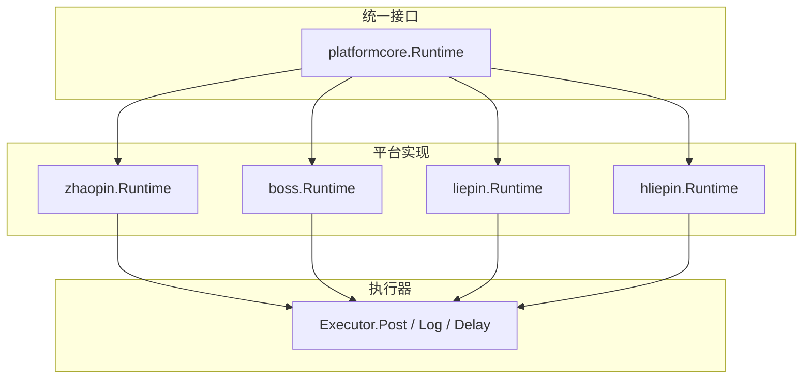
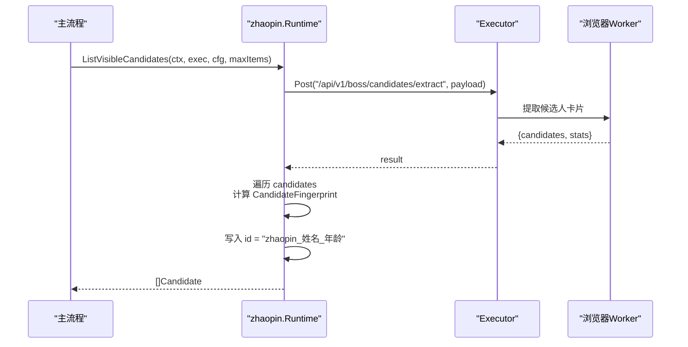
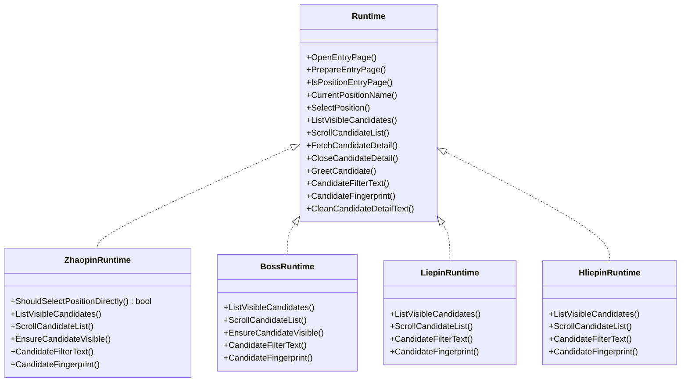

# 运行时环境

<cite>
**本文引用的文件**
- [platformcore/runtime.go](file://goodhr5/local-agent-go/internal/platformcore/runtime.go)
- [zhaopin/runtime.go](file://goodhr5/local-agent-go/internal/platforms/zhaopin/runtime.go)
- [zhaopin/candidate.go](file://goodhr5/local-agent-go/internal/platforms/zhaopin/candidate.go)
- [boss/runtime.go](file://goodhr5/local-agent-go/internal/platforms/boss/runtime.go)
- [boss/candidate.go](file://goodhr5/local-agent-go/internal/platforms/boss/candidate.go)
- [hliepin/runtime.go](file://goodhr5/local-agent-go/internal/platforms/hliepin/runtime.go)
- [hliepin/candidate.go](file://goodhr5/local-agent-go/internal/platforms/hliepin/candidate.go)
- [liepin/runtime.go](file://goodhr5/local-agent-go/internal/platforms/liepin/runtime.go)
- [liepin/candidate.go](file://goodhr5/local-agent-go/internal/platforms/liepin/candidate.go)
</cite>

## 目录
1. [简介](#简介)
2. [项目结构](#项目结构)
3. [核心组件](#核心组件)
4. [架构总览](#架构总览)
5. [详细组件分析](#详细组件分析)
6. [依赖关系分析](#依赖关系分析)
7. [性能考量](#性能考量)
8. [故障排查指南](#故障排查指南)
9. [结论](#结论)
10. [附录：使用示例与最佳实践](#附录使用示例与最佳实践)

## 简介
本文件聚焦智联招聘平台在本地 Agent 中的运行时环境，围绕统一接口、平台实现、候选人数据组装与去重指纹生成展开。重点说明：
- Runtime 接口与平台实现如何协作完成候选人提取、滚动、详情读取与打招呼等流程。
- 候选人原始文本组装逻辑（candidateRawText）在不同平台的差异。
- 年龄信息提取算法（candidateAge）的正则策略与字段优先级。
- 候选人 ID 规范化（normalizeCandidateIDPart）与去重指纹（CandidateFingerprint）的生成规则。
- 运行时配置项、错误处理机制与性能优化策略。
- 提供具体调用路径与示例，帮助快速集成与排障。

## 项目结构
本地 Agent 通过 platformcore 定义统一的平台运行时接口，各平台（Boss、猎聘企业端、猎聘猎头端、智联招聘）分别实现该接口，并在各自 candidate.go 中实现候选人列表提取、滚动、筛选文本与指纹生成等能力。

图表来源
- [platformcore/runtime.go:54-82](file://goodhr5/local-agent-go/internal/platformcore/runtime.go#L54-L82)
- [zhaopin/runtime.go:11-22](file://goodhr5/local-agent-go/internal/platforms/zhaopin/runtime.go#L11-L22)
- [boss/runtime.go:11-19](file://goodhr5/local-agent-go/internal/platforms/boss/runtime.go#L11-L19)
- [liepin/runtime.go:10-17](file://goodhr5/local-agent-go/internal/platforms/liepin/runtime.go#L10-L17)
- [hliepin/runtime.go:10-19](file://goodhr5/local-agent-go/internal/platforms/hliepin/runtime.go#L10-L19)

章节来源
- [platformcore/runtime.go:1-127](file://goodhr5/local-agent-go/internal/platformcore/runtime.go#L1-L127)

## 核心组件
- 统一接口 Runtime：定义打开入口页、准备页面、岗位选择、候选人列表提取、滚动、详情读取、关闭详情、打招呼、筛选文本、指纹生成、详情清理等能力。
- 平台 Runtime 实现：以 zhaopin.Runtime 为代表，实现 ShouldSelectPositionDirectly、ListVisibleCandidates、ScrollCandidateList、EnsureCandidateVisible、CandidateFilterText、CandidateFingerprint 等方法。
- 候选人数据结构 Candidate：键值对映射，包含 name、candidate_name、raw_text、filter_text、fields、card_index、element_ref、platform_id 等字段。
- 执行器 Executor：封装与浏览器 Worker 的通信（Post）、日志记录（Log）与延时（Delay）。

章节来源
- [platformcore/runtime.go:10-82](file://goodhr5/local-agent-go/internal/platformcore/runtime.go#L10-L82)
- [zhaopin/candidate.go:13-86](file://goodhr5/local-agent-go/internal/platforms/zhaopin/candidate.go#L13-L86)

## 架构总览
以下序列图展示智联招聘平台从“提取可见候选人”到“生成稳定 ID”的完整调用链。

图表来源
- [zhaopin/candidate.go:14-49](file://goodhr5/local-agent-go/internal/platforms/zhaopin/candidate.go#L14-L49)
- [zhaopin/runtime.go:24-41](file://goodhr5/local-agent-go/internal/platforms/zhaopin/runtime.go#L24-L41)

章节来源
- [zhaopin/candidate.go:14-49](file://goodhr5/local-agent-go/internal/platforms/zhaopin/candidate.go#L14-L49)

## 详细组件分析

### 平台标识符管理
- 平台 ID 注入：在 ListVisibleCandidates 过程中为每个候选人设置 platform_id，便于后续区分数据来源。
- 直接切换岗位策略：zhaopin.Runtime.ShouldSelectPositionDirectly 返回 true，表示每次直接切换目标岗位，不读取当前页面岗位名称，减少一次页面交互。

章节来源
- [zhaopin/candidate.go:41-45](file://goodhr5/local-agent-go/internal/platforms/zhaopin/candidate.go#L41-L45)
- [zhaopin/runtime.go:19-22](file://goodhr5/local-agent-go/internal/platforms/zhaopin/runtime.go#L19-L22)

### 候选人数据组装逻辑（candidateRawText）
不同平台对原始文本的组装策略略有差异：
- hliepin/liepin：按固定字段顺序拼接 name、basic_info、education、university、description，用换行连接，形成稳定的候选卡文本。
- boss：未单独实现 candidateRawText，通常直接使用 raw_text/filter_text/fields.basic_info。
- zhaopin：未单独实现 candidateRawText，同样优先使用 raw_text/filter_text/fields.basic_info。

用途：
- 作为筛选文本、详情定位、稳定性校验的基础。
- 用于 hliepin 的去重指纹时进行“稳定化”处理，剔除活跃状态、已查看等易变标记。

章节来源
- [hliepin/runtime.go:21-30](file://goodhr5/local-agent-go/internal/platforms/hliepin/runtime.go#L21-L30)
- [liepin/runtime.go:19-28](file://goodhr5/local-agent-go/internal/platforms/liepin/runtime.go#L19-L28)
- [hliepin/candidate.go:129-154](file://goodhr5/local-agent-go/internal/platforms/hliepin/candidate.go#L129-L154)

### 年龄信息提取算法（candidateAge）
所有平台均遵循相同优先级：
1. 优先从结构化字段获取：candidate.age、candidate.candidate_age、fields.age、fields.candidate_age。
2. 若为空，则回退到文本提取：从 candidate.raw_text、candidate.filter_text、fields.basic_info 中匹配正则 “([1-9][0-9]?)\s*岁”，提取年龄数字。
3. 若仍无法获取，返回空字符串。

该算法确保在结构化数据缺失时仍能稳健地从页面文本中提取年龄，提高鲁棒性。

章节来源
- [boss/runtime.go:38-57](file://goodhr5/local-agent-go/internal/platforms/boss/runtime.go#L38-L57)
- [hliepin/runtime.go:32-45](file://goodhr5/local-agent-go/internal/platforms/hliepin/runtime.go#L32-L45)
- [liepin/runtime.go:30-43](file://goodhr5/local-agent-go/internal/platforms/liepin/runtime.go#L30-L43)
- [zhaopin/runtime.go:50-63](file://goodhr5/local-agent-go/internal/platforms/zhaopin/runtime.go#L50-L63)

### 候选人 ID 规范化（normalizeCandidateIDPart）
- 行为：去除首尾空白，并将内部连续空白合并为一个空格后再移除所有空格，得到紧凑的标识片段。
- 目的：消除多余空白导致的指纹不一致，保证同名同年龄的候选人产生相同 ID。

章节来源
- [boss/runtime.go:59-63](file://goodhr5/local-agent-go/internal/platforms/boss/runtime.go#L59-L63)
- [hliepin/runtime.go:47-50](file://goodhr5/local-agent-go/internal/platforms/hliepin/runtime.go#L47-L50)
- [liepin/runtime.go:45-48](file://goodhr5/local-agent-go/internal/platforms/liepin/runtime.go#L45-L48)
- [zhaopin/runtime.go:65-68](file://goodhr5/local-agent-go/internal/platforms/zhaopin/runtime.go#L65-L68)

### 去重指纹生成（CandidateFingerprint）
- 智联招聘：id = "zhaopin_" + normalize(姓名) + "_" + normalize(年龄)。要求姓名与年龄均非空。
- Boss：id = "boss_" + normalize(姓名) + "_" + normalize(年龄)。
- 猎聘企业端：id = "liepin_" + normalize(姓名) + "_" + normalize(年龄)。
- 猎聘猎头端：优先使用平台提供的 platform_candidate_id；否则基于“稳定化后的原始文本”+姓名+年龄做哈希前缀，生成更稳定的唯一标识。

章节来源
- [zhaopin/candidate.go:76-85](file://goodhr5/local-agent-go/internal/platforms/zhaopin/candidate.go#L76-L85)
- [boss/candidate.go:76-86](file://goodhr5/local-agent-go/internal/platforms/boss/candidate.go#L76-L86)
- [liepin/candidate.go:62-71](file://goodhr5/local-agent-go/internal/platforms/liepin/candidate.go#L62-L71)
- [hliepin/candidate.go:105-119](file://goodhr5/local-agent-go/internal/platforms/hliepin/candidate.go#L105-L119)

### 运行时配置选项
- 平台配置 PlatformConfig：由云端下发，包含页面选择器、行为参数、候选卡片字段请求等。
- 关键配置点：
  - card.item：候选人卡片元素选择器。
  - behavior.nextPageBtn / disabledClass：翻页按钮与禁用类名。
  - fields：字段请求规则，如 name、basic_info、education、university、description、platform_candidate_id 等。
  - pages.auth：入口页与登录页配置。
- 平台特定参数：
  - zhaopin：ShouldSelectPositionDirectly=true，跳过当前岗位读取。
  - hliepin：首次为空时的轮询等待与 required_text="立即沟通" 的兜底策略。

章节来源
- [hliepin/candidate.go:17-40](file://goodhr5/local-agent-go/internal/platforms/hliepin/candidate.go#L17-L40)
- [hliepin/candidate.go:121-127](file://goodhr5/local-agent-go/internal/platforms/hliepin/candidate.go#L121-L127)
- [zhaopin/runtime.go:19-22](file://goodhr5/local-agent-go/internal/platforms/zhaopin/runtime.go#L19-L22)

### 错误处理机制
- 提取失败：当 exec.Post 返回错误时，记录警告日志并向上返回错误，避免静默失败。
- 列表为空：在 hliepin 场景下，首次为空会触发轮询等待，必要时记录页面 URL 与选择器以便诊断。
- 日志输出：在各阶段记录耗时、数量、错误信息，便于追踪问题。

章节来源
- [zhaopin/candidate.go:17-25](file://goodhr5/local-agent-go/internal/platforms/zhaopin/candidate.go#L17-L25)
- [boss/candidate.go:17-25](file://goodhr5/local-agent-go/internal/platforms/boss/candidate.go#L17-L25)
- [hliepin/candidate.go:27-47](file://goodhr5/local-agent-go/internal/platforms/hliepin/candidate.go#L27-L47)

### 性能优化策略
- 批量日志与统计：在候选人提取前后记录 found_count、find_elapsed_ms、convert_elapsed_ms、elapsed_ms，便于性能分析。
- 小步滚动与重试：EnsureCandidateVisible 使用距离、等待时间、滚动次数等参数，提升定位成功率。
- 直接切换岗位：zhaopin 跳过当前岗位读取，减少一次页面交互。
- 稳定文本与哈希：hliepin 通过剔除易变行并使用哈希前缀，降低重复率与误判。

章节来源
- [zhaopin/candidate.go:27-34](file://goodhr5/local-agent-go/internal/platforms/zhaopin/candidate.go#L27-L34)
- [zhaopin/runtime.go:24-41](file://goodhr5/local-agent-go/internal/platforms/zhaopin/runtime.go#L24-L41)
- [hliepin/candidate.go:129-154](file://goodhr5/local-agent-go/internal/platforms/hliepin/candidate.go#L129-L154)

## 依赖关系分析

图表来源
- [platformcore/runtime.go:54-82](file://goodhr5/local-agent-go/internal/platformcore/runtime.go#L54-L82)
- [zhaopin/runtime.go:11-22](file://goodhr5/local-agent-go/internal/platforms/zhaopin/runtime.go#L11-L22)
- [boss/runtime.go:11-19](file://goodhr5/local-agent-go/internal/platforms/boss/runtime.go#L11-L19)
- [liepin/runtime.go:10-17](file://goodhr5/local-agent-go/internal/platforms/liepin/runtime.go#L10-L17)
- [hliepin/runtime.go:10-19](file://goodhr5/local-agent-go/internal/platforms/hliepin/runtime.go#L10-L19)

章节来源
- [platformcore/runtime.go:54-82](file://goodhr5/local-agent-go/internal/platformcore/runtime.go#L54-L82)

## 性能考量
- 提取阶段：通过 executor.Post 一次性拉取多张卡片，减少多次网络往返。
- 转换阶段：在循环中分批记录进度，避免频繁日志影响性能。
- 滚动与定位：合理设置 distance、wait_ms、card_scroll_attempts、require_full、viewport_margin，平衡速度与稳定性。
- 指纹计算：仅在必要时计算哈希，且对稳定文本进行预处理，降低重复计算成本。

[本节为通用指导，不直接分析具体文件]

## 故障排查指南
- 候选人提取为空：检查页面 URL、选择器是否正确；在 hliepin 场景下确认是否触发了轮询等待与 required_text。
- 年龄解析失败：确认 raw_text/filter_text/basic_info 是否包含“xx岁”格式；检查正则匹配条件。
- 指纹不稳定：确认 normalizeCandidateIDPart 是否生效；在 hliepin 场景下检查稳定化文本是否剔除了易变行。
- 错误日志：关注 warning 日志中的 elapsed、err、found_count、candidates 数量，定位瓶颈与异常。

章节来源
- [hliepin/candidate.go:27-47](file://goodhr5/local-agent-go/internal/platforms/hliepin/candidate.go#L27-L47)
- [boss/runtime.go:38-57](file://goodhr5/local-agent-go/internal/platforms/boss/runtime.go#L38-L57)
- [zhaopin/runtime.go:50-63](file://goodhr5/local-agent-go/internal/platforms/zhaopin/runtime.go#L50-L63)

## 结论
智联招聘平台的运行时环境通过统一接口与平台实现解耦，实现了候选人数据的标准化提取、年龄信息的稳健解析与 ID 的稳定生成。结合合理的配置、错误处理与性能优化策略，能够在复杂页面环境下保持高可用性与可维护性。

[本节为总结，不直接分析具体文件]

## 附录：使用示例与最佳实践

- 示例一：提取智联招聘候选人并生成稳定 ID
  - 调用路径：zhaopin.Runtime.ListVisibleCandidates -> executor.Post -> 遍历 candidates -> CandidateFingerprint -> 写入 id
  - 关键点：确保 platform_config 中包含正确的 card.item 与 fields；注意 ShouldSelectPositionDirectly 的策略。
  - 参考路径
    - [zhaopin/candidate.go:14-49](file://goodhr5/local-agent-go/internal/platforms/zhaopin/candidate.go#L14-L49)
    - [zhaopin/runtime.go:19-22](file://goodhr5/local-agent-go/internal/platforms/zhaopin/runtime.go#L19-L22)

- 示例二：年龄解析与 ID 规范化
  - 调用路径：candidateAge -> 字段优先 -> 正则回退；normalizeCandidateIDPart -> 去除空白
  - 关键点：当结构化字段缺失时，确保 raw_text/filter_text/basic_info 包含“xx岁”；规范化后保证同名同年龄一致。
  - 参考路径
    - [zhaopin/runtime.go:50-63](file://goodhr5/local-agent-go/internal/platforms/zhaopin/runtime.go#L50-L63)
    - [zhaopin/runtime.go:65-68](file://goodhr5/local-agent-go/internal/platforms/zhaopin/runtime.go#L65-L68)

- 示例三：猎聘猎头端的稳定文本与哈希指纹
  - 调用路径：hliepinStableCandidateText -> 剔除易变行 -> sha256 前缀 -> 生成指纹
  - 关键点：确保过滤掉“在线”“活跃”“已查看”等易变标记，提升跨会话一致性。
  - 参考路径
    - [hliepin/candidate.go:129-154](file://goodhr5/local-agent-go/internal/platforms/hliepin/candidate.go#L129-L154)
    - [hliepin/candidate.go:105-119](file://goodhr5/local-agent-go/internal/platforms/hliepin/candidate.go#L105-L119)

- 最佳实践
  - 配置先行：明确 card.item、behavior、fields 的选择器与字段请求。
  - 日志驱动：关注提取耗时、数量与错误信息，快速定位问题。
  - 稳健解析：优先结构化字段，回退文本解析；规范化 ID 片段，避免空白干扰。
  - 性能调优：合理设置滚动参数与等待时间，避免过度交互。

[本节为实践指导，不直接分析具体文件]