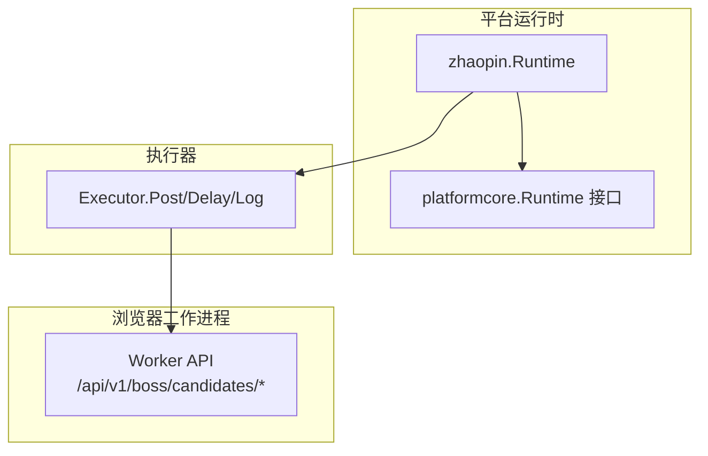
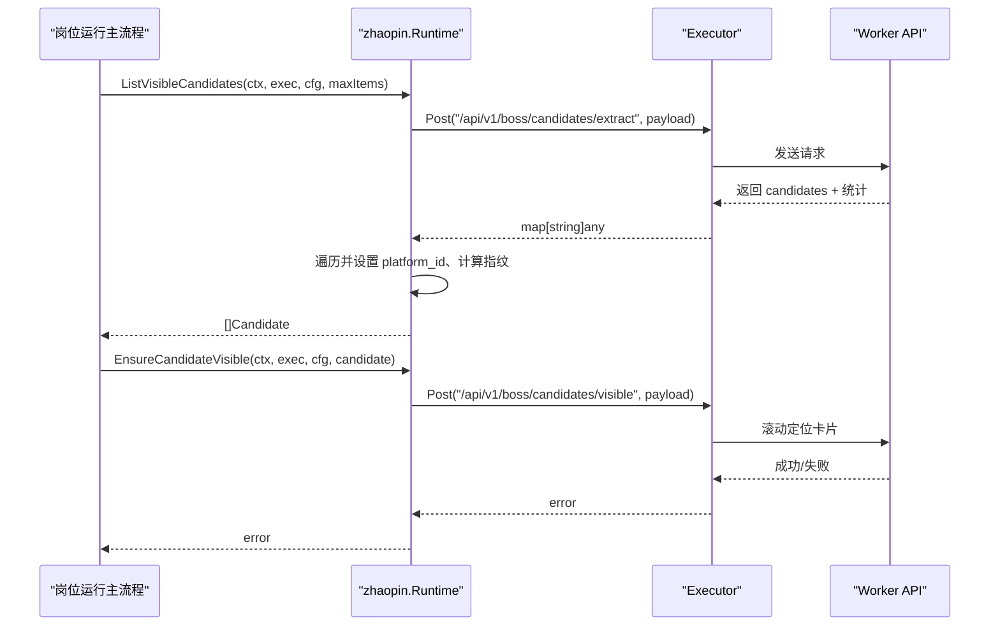
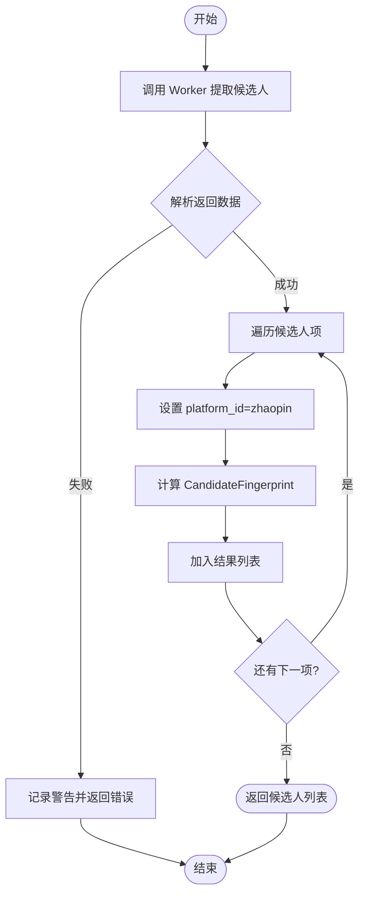
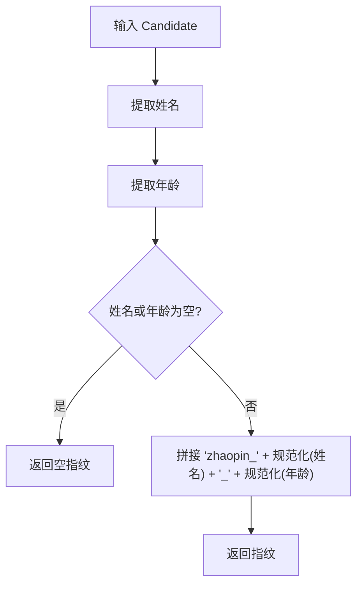
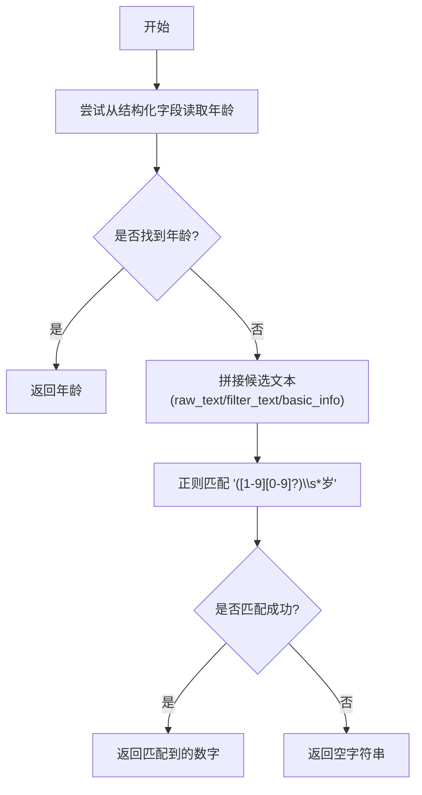
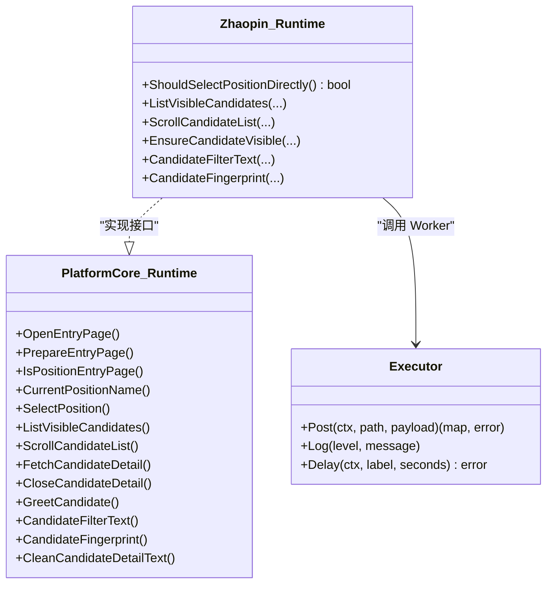

# 运行时环境

<cite>
**本文引用的文件**
- [runtime.go](file://goodhr5/local-agent-go/internal/platforms/zhaopin/runtime.go)
- [candidate.go](file://goodhr5/local-agent-go/internal/platforms/zhaopin/candidate.go)
- [helpers.go](file://goodhr5/local-agent-go/internal/platforms/zhaopin/helpers.go)
- [runtime_test.go](file://goodhr5/local-agent-go/internal/platforms/zhaopin/runtime_test.go)
- [runtime.go](file://goodhr5/local-agent-go/internal/platformcore/runtime.go)
- [runtime.go](file://goodhr5/local-agent-go/internal/platforms/boss/runtime.go)
- [runtime.go](file://goodhr5/local-agent-go/internal/platforms/hliepin/runtime.go)
</cite>

## 目录
1. [简介](#简介)
2. [项目结构](#项目结构)
3. [核心组件](#核心组件)
4. [架构总览](#架构总览)
5. [详细组件分析](#详细组件分析)
6. [依赖关系分析](#依赖关系分析)
7. [性能考虑](#性能考虑)
8. [故障排查指南](#故障排查指南)
9. [结论](#结论)
10. [附录：使用示例与最佳实践](#附录使用示例与最佳实践)

## 简介
本文件聚焦智联招聘平台在本地 Agent 中的运行时实现，围绕 Runtime 结构体及其能力展开，重点说明：
- 平台标识符管理：通过接口与平台包提供统一入口。
- 候选人数据组装逻辑：从 Worker 响应到候选人的标准化转换、指纹生成。
- 年龄信息提取算法：优先读取结构化字段，缺失时通过正则从文本中解析“xx岁”。
- 关键函数：candidateRawText（在其他平台用于原始文本组装）、candidateAge、normalizeCandidateIDPart。
- 运行时配置选项、错误处理机制与性能优化策略。
- 结合测试用例给出具体使用方式与调用路径。

## 项目结构
智联招聘平台的运行时位于 local-agent-go 的 platforms/zhaopin 包内，遵循 platformcore 定义的统一接口，并通过 Executor 与浏览器 Worker 通信。核心文件职责如下：
- runtime.go：定义 Runtime 结构体、平台策略（如是否直接切换岗位）、年龄提取、ID 部分规范化等。
- candidate.go：候选人列表提取、滚动、可见性定位、筛选文本、去重指纹。
- helpers.go：通用工具方法（map/字符串/耗时格式化等）。
- runtime_test.go：覆盖关键流程的单元测试，验证行为与参数。

图表来源
- [runtime.go:11-22](file://goodhr5/local-agent-go/internal/platforms/zhaopin/runtime.go#L11-L22)
- [runtime.go:10-18](file://goodhr5/local-agent-go/internal/platformcore/runtime.go#L10-L18)
- [candidate.go:14-49](file://goodhr5/local-agent-go/internal/platforms/zhaopin/candidate.go#L14-L49)

章节来源
- [runtime.go:11-22](file://goodhr5/local-agent-go/internal/platforms/zhaopin/runtime.go#L11-L22)
- [candidate.go:14-49](file://goodhr5/local-agent-go/internal/platforms/zhaopin/candidate.go#L14-L49)
- [runtime.go:10-18](file://goodhr5/local-agent-go/internal/platformcore/runtime.go#L10-L18)

## 核心组件
- Runtime 结构体：无状态对象，承载智联招聘的平台策略与数据处理能力。
- 平台策略：ShouldSelectPositionDirectly 返回 true，表示每次直接切换岗位，不读取当前页面岗位。
- 候选人生命周期：ListVisibleCandidates、ScrollCandidateList、EnsureCandidateVisible、FetchCandidateDetail、GreetCandidate、CloseCandidateDetail 等由接口定义，智联实现通过 Executor 调用 Worker。
- 数据辅助：CandidateFilterText、CandidateFingerprint、candidateAge、normalizeCandidateIDPart。

章节来源
- [runtime.go:11-22](file://goodhr5/local-agent-go/internal/platforms/zhaopin/runtime.go#L11-L22)
- [candidate.go:14-85](file://goodhr5/local-agent-go/internal/platforms/zhaopin/candidate.go#L14-L85)
- [runtime.go:43-68](file://goodhr5/local-agent-go/internal/platforms/zhaopin/runtime.go#L43-L68)

## 架构总览
智联招聘运行时通过 platformcore 的统一接口暴露能力，内部借助 Executor 与浏览器 Worker 交互，完成候选人提取、滚动、详情读取、打招呼等操作。

图表来源
- [candidate.go:14-49](file://goodhr5/local-agent-go/internal/platforms/zhaopin/candidate.go#L14-L49)
- [candidate.go:62-69](file://goodhr5/local-agent-go/internal/platforms/zhaopin/candidate.go#L62-L69)
- [runtime.go:24-41](file://goodhr5/local-agent-go/internal/platforms/zhaopin/runtime.go#L24-L41)

## 详细组件分析

### Runtime 结构与平台策略
- 结构体：Runtime 为空结构，无状态，便于在不同平台间复用相同模式。
- 平台策略：ShouldSelectPositionDirectly 返回 true，表明智联招聘跳过“读取当前岗位”的步骤，直接切换到目标岗位，减少不必要的 DOM 操作与等待。

章节来源
- [runtime.go:11-22](file://goodhr5/local-agent-go/internal/platforms/zhaopin/runtime.go#L11-L22)
- [runtime_test.go:129-135](file://goodhr5/local-agent-go/internal/platforms/zhaopin/runtime_test.go#L129-L135)

### 候选人列表提取与组装
- 入口：ListVisibleCandidates 调用 Worker 的 /api/v1/boss/candidates/extract，传入 platform_id、platform_config、max_items。
- 日志与统计：记录 found_count、find_elapsed_ms、convert_elapsed_ms、elapsed_ms，便于性能观测。
- 数据组装：将每个 item 转为 Candidate，注入 platform_id="zhaopin"，并计算 CandidateFingerprint 作为 id。
- 滚动与可见性：ScrollCandidateList 与 EnsureCandidateVisible 分别负责滚动列表和定位指定卡片。

图表来源
- [candidate.go:14-49](file://goodhr5/local-agent-go/internal/platforms/zhaopin/candidate.go#L14-L49)

章节来源
- [candidate.go:14-49](file://goodhr5/local-agent-go/internal/platforms/zhaopin/candidate.go#L14-L49)

### 候选人去重指纹与 ID 组成部分规范化
- 指纹规则：以“平台前缀_姓名_年龄”形式生成，例如 zhaopin_张三_28。
- 姓名来源：优先 candidate_name，其次 name，再 fallback fields.name。
- 年龄来源：见下方“年龄信息提取算法”。
- 规范化：normalizeCandidateIDPart 去除首尾空白并将中间连续空白合并为单个空字符，确保指纹稳定。

图表来源
- [candidate.go:76-85](file://goodhr5/local-agent-go/internal/platforms/zhaopin/candidate.go#L76-L85)
- [runtime.go:65-68](file://goodhr5/local-agent-go/internal/platforms/zhaopin/runtime.go#L65-L68)

章节来源
- [candidate.go:76-85](file://goodhr5/local-agent-go/internal/platforms/zhaopin/candidate.go#L76-L85)
- [runtime.go:65-68](file://goodhr5/local-agent-go/internal/platforms/zhaopin/runtime.go#L65-L68)
- [runtime_test.go:116-127](file://goodhr5/local-agent-go/internal/platforms/zhaopin/runtime_test.go#L116-L127)

### 年龄信息提取算法
- 优先级：
  1) 直接从 candidate 或 fields 中读取 age/candidate_age。
  2) 若缺失，则从 raw_text/filter_text/basic_info 中用正则匹配“数字+岁”，提取数字部分。
- 正则表达式：匹配 1-99 之间的年龄数字，兼容空格与中文“岁”。
- 与其他平台对比：Boss、猎聘猎头端采用相同策略，体现跨平台一致性。

图表来源
- [runtime.go:50-63](file://goodhr5/local-agent-go/internal/platforms/zhaopin/runtime.go#L50-L63)
- [runtime.go:36-55](file://goodhr5/local-agent-go/internal/platforms/boss/runtime.go#L36-L55)
- [runtime.go:32-45](file://goodhr5/local-agent-go/internal/platforms/hliepin/runtime.go#L32-L45)

章节来源
- [runtime.go:50-63](file://goodhr5/local-agent-go/internal/platforms/zhaopin/runtime.go#L50-L63)
- [runtime.go:36-55](file://goodhr5/local-agent-go/internal/platforms/boss/runtime.go#L36-L55)
- [runtime.go:32-45](file://goodhr5/local-agent-go/internal/platforms/hliepin/runtime.go#L32-L45)

### 候选人卡片原始文本组合（candidateRawText）
- 在智联招聘包中未直接实现 candidateRawText；该函数存在于其他平台（如猎聘猎头端），用于将 fields 中的多个关键字段拼接为原始文本，供后续解析或展示。
- 典型字段顺序：name、basic_info、education、university、description，按非空顺序拼接并用换行分隔。
- 对智联招聘的意义：虽然智联未使用该函数，但理解其设计有助于把握跨平台原始文本组装的一致性思路。

章节来源
- [runtime.go:21-30](file://goodhr5/local-agent-go/internal/platforms/hliepin/runtime.go#L21-L30)

### 运行时配置选项
- 平台配置通过 cloudapi.PlatformConfig 传递，包含认证信息、页面列表、元素选择器等。
- 可见性定位参数：distance、wait_ms、card_scroll_attempts、require_full、viewport_margin 等，控制滚动距离、等待时间、重试次数与视口要求。
- 详情页参数：detail_ready_timeout、force_scroll、card_scroll_attempts、require_full、skip_mouse_move 等，控制详情页加载与滚动行为。
- 这些参数在 EnsureCandidateVisible、FetchCandidateDetail、ScrollCandidateDetail 等方法中以 payload 形式下发给 Worker。

章节来源
- [runtime.go:24-41](file://goodhr5/local-agent-go/internal/platforms/zhaopin/runtime.go#L24-L41)
- [runtime_test.go:290-329](file://goodhr5/local-agent-go/internal/platforms/zhaopin/runtime_test.go#L290-L329)
- [runtime_test.go:332-351](file://goodhr5/local-agent-go/internal/platforms/zhaopin/runtime_test.go#L332-L351)

### 错误处理机制
- 提取失败：当 Worker 返回错误时，记录警告日志并向上返回错误，避免静默失败。
- 可选能力缺失：如 RequestCandidateInfo 中手机号确认项不存在时，跳过确认点击并关闭聊天框，不报错。
- 模式限制：FetchCandidateDetail 拒绝 OCR/截图模式，仅支持 DOM 模式，防止不兼容路径。
- 元素选择失败：当点击选择器不能为空或未找到元素时，返回明确错误信息，便于定位问题。

章节来源
- [candidate.go:17-25](file://goodhr5/local-agent-go/internal/platforms/zhaopin/candidate.go#L17-L25)
- [runtime_test.go:205-233](file://goodhr5/local-agent-go/internal/platforms/zhaopin/runtime_test.go#L205-L233)
- [runtime_test.go:353-365](file://goodhr5/local-agent-go/internal/platforms/zhaopin/runtime_test.go#L353-L365)
- [runtime_test.go:246-257](file://goodhr5/local-agent-go/internal/platforms/zhaopin/runtime_test.go#L246-L257)

### 性能优化策略
- 批量提取与进度日志：每 20 条或最后一条输出进度日志，便于监控长列表处理。
- 耗时统计：记录 find_elapsed_ms、convert_elapsed_ms、elapsed_ms，帮助定位瓶颈。
- 直接切换岗位：ShouldSelectPositionDirectly 返回 true，减少页面状态读取与复核开销。
- 滚动与等待调优：合理设置 distance、wait_ms、card_scroll_attempts，平衡稳定性与速度。
- 详情滚动优化：AI 分析期间只滚动详情弹框，skip_mouse_move=true，避免多余鼠标移动。

章节来源
- [candidate.go:14-49](file://goodhr5/local-agent-go/internal/platforms/zhaopin/candidate.go#L14-L49)
- [runtime.go:19-22](file://goodhr5/local-agent-go/internal/platforms/zhaopin/runtime.go#L19-L22)
- [runtime_test.go:332-351](file://goodhr5/local-agent-go/internal/platforms/zhaopin/runtime_test.go#L332-L351)

## 依赖关系分析
- 对外接口：platformcore.Runtime 定义了统一的运行时能力，智联招聘实现该接口。
- 执行器：Executor 抽象了与浏览器 Worker 的通信，屏蔽底层 HTTP/CDP 细节。
- 工具库：helpers.go 提供 map/字符串/耗时格式化等通用方法，提升代码复用性与可读性。
- 平台对比：Boss、猎聘猎头端采用相似的年龄提取与 ID 规范化策略，体现跨平台一致性。

图表来源
- [runtime.go:46-110](file://goodhr5/local-agent-go/internal/platformcore/runtime.go#L46-L110)
- [runtime.go:11-22](file://goodhr5/local-agent-go/internal/platforms/zhaopin/runtime.go#L11-L22)
- [candidate.go:14-85](file://goodhr5/local-agent-go/internal/platforms/zhaopin/candidate.go#L14-L85)

章节来源
- [runtime.go:46-110](file://goodhr5/local-agent-go/internal/platformcore/runtime.go#L46-L110)
- [runtime.go:11-22](file://goodhr5/local-agent-go/internal/platforms/zhaopin/runtime.go#L11-L22)
- [candidate.go:14-85](file://goodhr5/local-agent-go/internal/platforms/zhaopin/candidate.go#L14-L85)

## 性能考虑
- 提取阶段：通过 Worker 侧并行查找与转换，后端记录 find_elapsed_ms 与 convert_elapsed_ms，便于定位慢点。
- 列表滚动：distance=120、wait_ms=260、card_scroll_attempts=18，兼顾速度与稳定性。
- 详情页：detail_ready_timeout=5000ms，避免过长等待；skip_mouse_move=true 减少不必要动作。
- 日志粒度：每 20 条输出一次进度，降低日志开销同时保持可观测性。

[本节为通用指导，无需特定文件引用]

## 故障排查指南
- 候选人提取失败：检查 Worker 返回的错误信息，关注 elapsed_ms 与 find/convert 耗时。
- 可见性定位失败：核对 card_index、element_ref、distance、wait_ms、card_scroll_attempts 等参数。
- 详情页模式不支持：仅支持 DOM 模式，OCR/截图模式会被拒绝。
- 索要信息失败：若手机号确认项不存在，应跳过确认并关闭聊天框；若选择器为空或未找到元素，需检查平台配置与页面结构。

章节来源
- [candidate.go:17-25](file://goodhr5/local-agent-go/internal/platforms/zhaopin/candidate.go#L17-L25)
- [runtime_test.go:205-233](file://goodhr5/local-agent-go/internal/platforms/zhaopin/runtime_test.go#L205-L233)
- [runtime_test.go:353-365](file://goodhr5/local-agent-go/internal/platforms/zhaopin/runtime_test.go#L353-L365)
- [runtime_test.go:246-257](file://goodhr5/local-agent-go/internal/platforms/zhaopin/runtime_test.go#L246-L257)

## 结论
智联招聘平台的运行时实现以简洁的无状态 Runtime 为核心，依托 platformcore 统一接口与 Executor 与 Worker 通信，实现了候选人提取、滚动、可见性定位、详情读取与打招呼等完整流程。年龄提取与 ID 规范化策略与其他平台保持一致，提升了跨平台可维护性。通过合理的配置选项、完善的错误处理与性能优化，保障了在高并发场景下的稳定性与效率。

[本节为总结，无需特定文件引用]

## 附录：使用示例与最佳实践
- 获取候选人列表：
  - 调用 ListVisibleCandidates，传入 platform_id="zhaopin"、platform_config、max_items。
  - 观察日志中的 found_count、find_elapsed_ms、convert_elapsed_ms、elapsed_ms。
  - 参考路径：[candidate.go:14-49](file://goodhr5/local-agent-go/internal/platforms/zhaopin/candidate.go#L14-L49)

- 定位候选人卡片：
  - 调用 EnsureCandidateVisible，传入 card_index、element_ref、distance、wait_ms、card_scroll_attempts。
  - 参考路径：[candidate.go:62-69](file://goodhr5/local-agent-go/internal/platforms/zhaopin/candidate.go#L62-L69)、[runtime.go:24-41](file://goodhr5/local-agent-go/internal/platforms/zhaopin/runtime.go#L24-L41)

- 读取候选人详情：
  - 调用 FetchCandidateDetail，Mode="dom"，携带 position_id、require_candidate_match、detail_ready_timeout。
  - 参考路径：[runtime_test.go:290-329](file://goodhr5/local-agent-go/internal/platforms/zhaopin/runtime_test.go#L290-L329)

- 滚动详情弹框：
  - 调用 ScrollCandidateDetail，distance=260，skip_mouse_move=true。
  - 参考路径：[runtime_test.go:332-351](file://goodhr5/local-agent-go/internal/platforms/zhaopin/runtime_test.go#L332-L351)

- 年龄提取与指纹：
  - 使用 candidateAge 从结构化字段或文本中提取年龄。
  - 使用 CandidateFingerprint 生成“zhaopin_姓名_年龄”的稳定指纹。
  - 参考路径：[runtime.go:50-63](file://goodhr5/local-agent-go/internal/platforms/zhaopin/runtime.go#L50-L63)、[candidate.go:76-85](file://goodhr5/local-agent-go/internal/platforms/zhaopin/candidate.go#L76-L85)、[runtime_test.go:116-127](file://goodhr5/local-agent-go/internal/platforms/zhaopin/runtime_test.go#L116-L127)

- 最佳实践：
  - 合理设置滚动与等待参数，避免过度等待或频繁重试。
  - 利用日志与耗时统计定位瓶颈。
  - 遵循平台策略（如直接切换岗位）以减少不必要的 DOM 操作。
  - 在索要信息时处理可选项缺失情况，保证流程鲁棒性。

[本节为使用指导，无需特定文件引用]