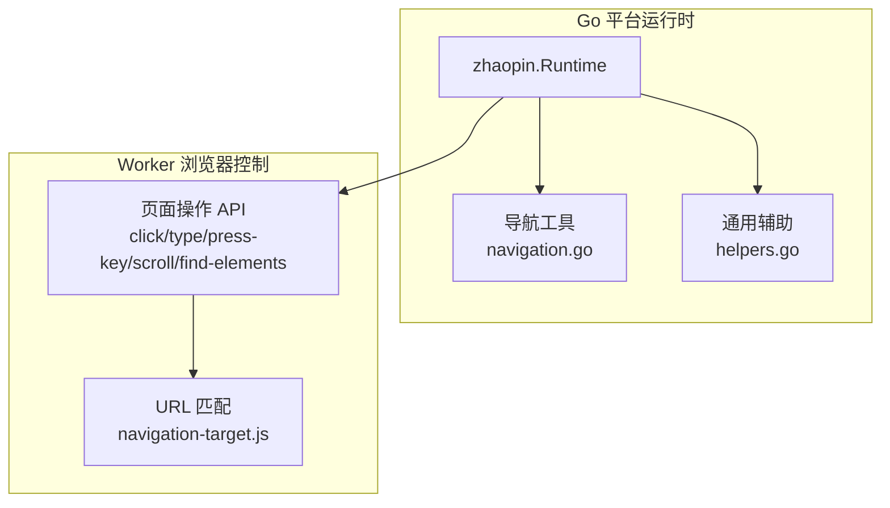
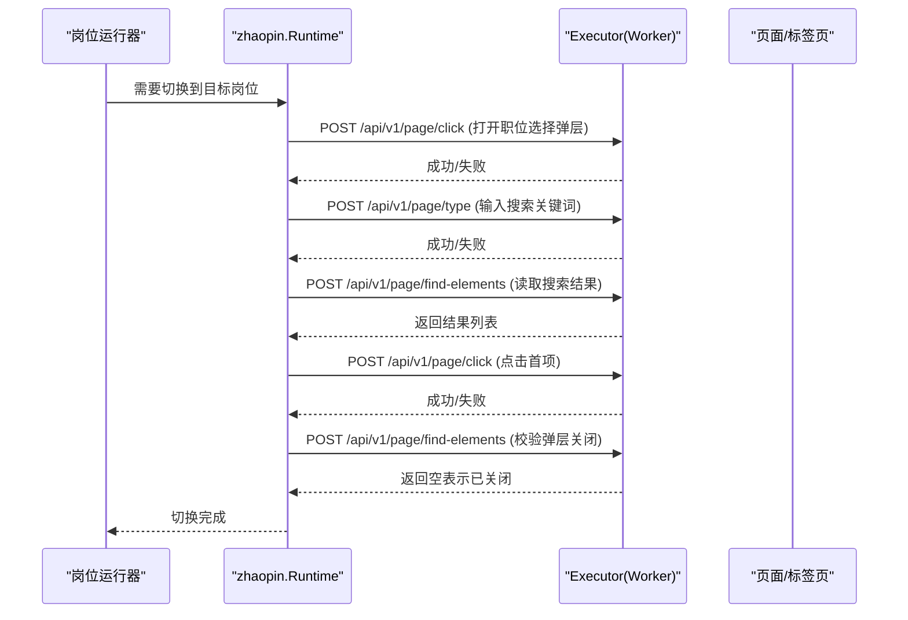
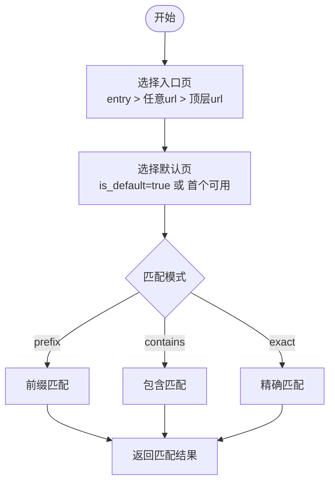
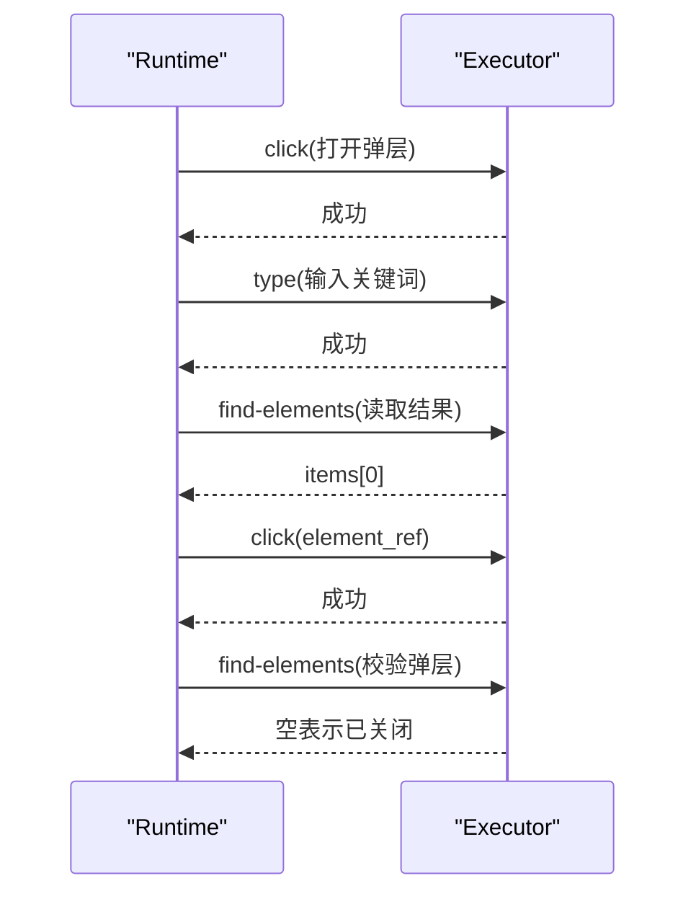
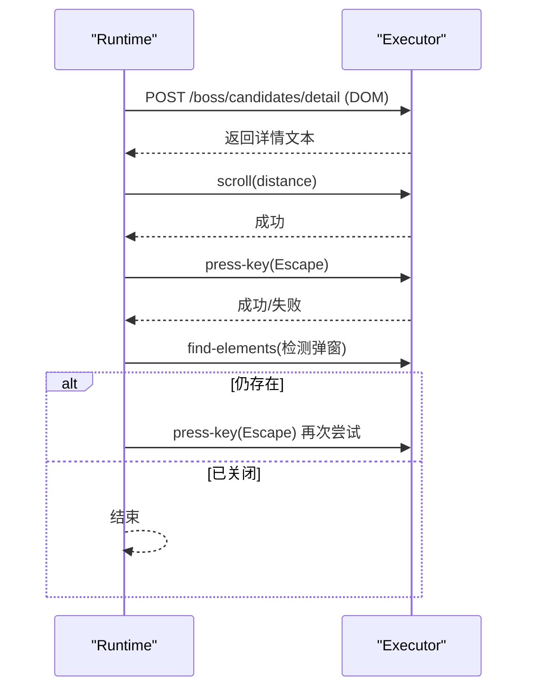
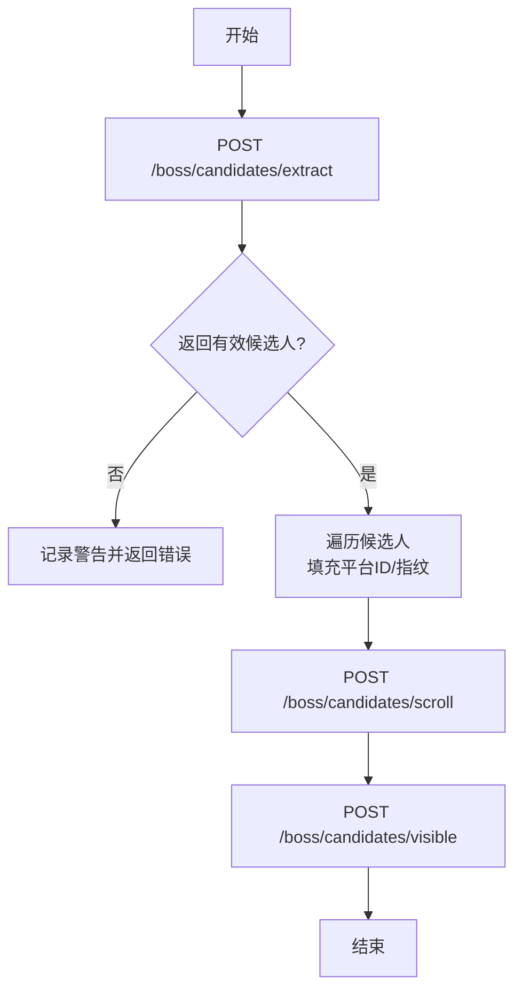
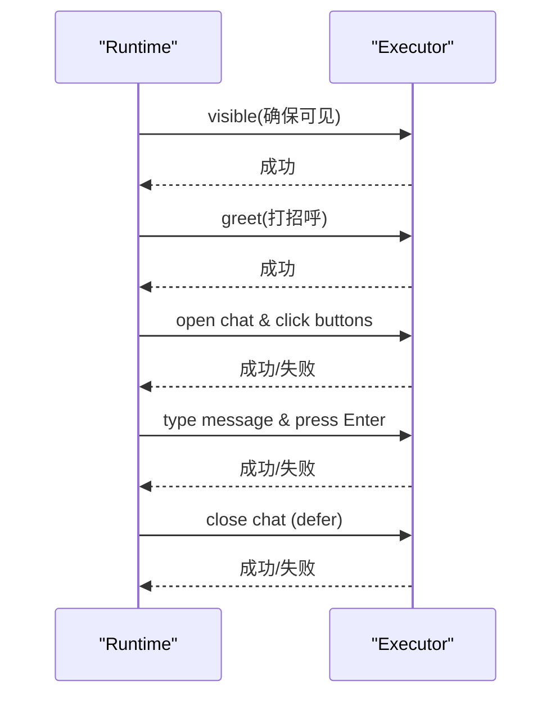
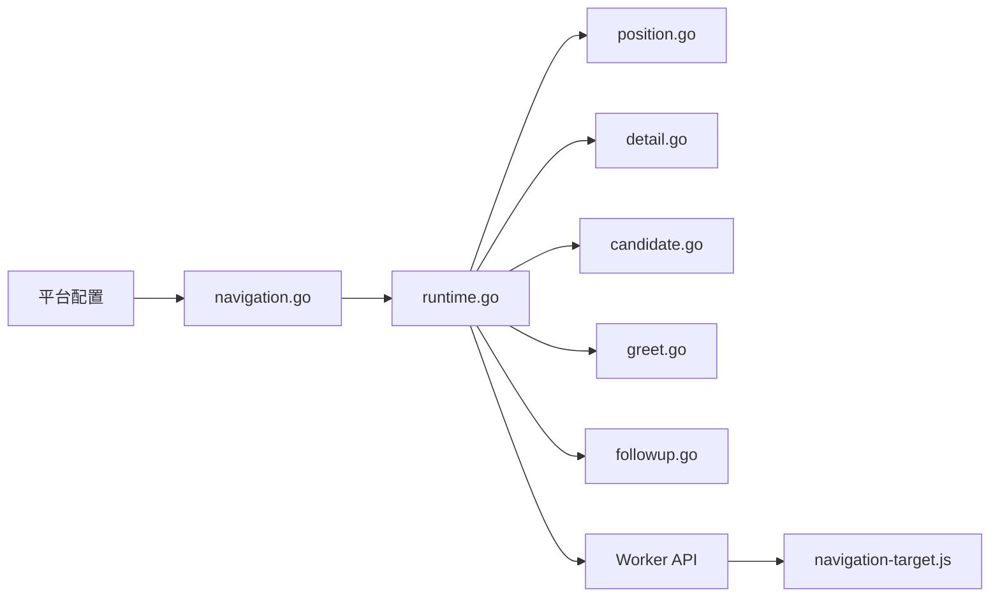

# 页面导航

<cite>
**本文引用的文件**
- [navigation.go](file://goodhr5/local-agent-go/internal/platforms/zhaopin/navigation.go)
- [runtime.go](file://goodhr5/local-agent-go/internal/platforms/zhaopin/runtime.go)
- [position.go](file://goodhr5/local-agent-go/internal/platforms/zhaopin/position.go)
- [detail.go](file://goodhr5/local-agent-go/internal/platforms/zhaopin/detail.go)
- [candidate.go](file://goodhr5/local-agent-go/internal/platforms/zhaopin/candidate.go)
- [greet.go](file://goodhr5/local-agent-go/internal/platforms/zhaopin/greet.go)
- [followup.go](file://goodhr5/local-agent-go/internal/platforms/zhaopin/followup.go)
- [helpers.go](file://goodhr5/local-agent-go/internal/platforms/zhaopin/helpers.go)
- [navigation-target.js](file://goodhr5/local-agent-go/worker-node/src/navigation-target.js)
</cite>

## 目录
1. [简介](#简介)
2. [项目结构](#项目结构)
3. [核心组件](#核心组件)
4. [架构总览](#架构总览)
5. [详细组件分析](#详细组件分析)
6. [依赖关系分析](#依赖关系分析)
7. [性能考虑](#性能考虑)
8. [故障排查指南](#故障排查指南)
9. [结论](#结论)
10. [附录](#附录)

## 简介
本文件聚焦智联招聘平台的“页面导航”能力，围绕以下目标展开：
- 页面跳转策略与 URL 模式识别：如何判断现有标签页是否可复用、如何匹配入口与目标地址。
- 路由处理方法：岗位切换、详情页打开与关闭、候选人列表滚动与可见性保证、打招呼与信息索要的导航流程。
- 页面状态管理、历史记录处理与浏览器行为模拟：通过 Worker API 完成点击、输入、按键、滚动等动作，并配合超时与重试保障稳定性。
- 错误恢复与超时策略：关键步骤均设置超时、失败日志与二次确认/重试机制。
- 导航路径配置与自定义规则：基于平台配置的入口页、元素定位、匹配模式（前缀/包含/精确）。
- 性能优化技巧：减少不必要的刷新、复用已有筛选条件、限制查找范围与次数、合理设置等待时间。

## 项目结构
智联招聘导航相关代码主要分布在两个层面：
- Go 层（平台运行时）：负责业务编排、参数构造、调用 Worker 接口、错误处理与日志记录。
- Worker 层（Node.js）：提供浏览器操作原语（点击、输入、按键、滚动、文本查找），以及 URL 规范化与匹配逻辑。

图表来源
- [runtime.go:11-22](file://goodhr5/local-agent-go/internal/platforms/zhaopin/runtime.go#L11-L22)
- [navigation.go:12-71](file://goodhr5/local-agent-go/internal/platforms/zhaopin/navigation.go#L12-L71)
- [helpers.go:112-160](file://goodhr5/local-agent-go/internal/platforms/zhaopin/helpers.go#L112-L160)
- [navigation-target.js:8-30](file://goodhr5/local-agent-go/worker-node/src/navigation-target.js#L8-L30)

章节来源
- [runtime.go:11-22](file://goodhr5/local-agent-go/internal/platforms/zhaopin/runtime.go#L11-L22)
- [navigation.go:12-71](file://goodhr5/local-agent-go/internal/platforms/zhaopin/navigation.go#L12-L71)
- [helpers.go:112-160](file://goodhr5/local-agent-go/internal/platforms/zhaopin/helpers.go#L112-L160)
- [navigation-target.js:8-30](file://goodhr5/local-agent-go/worker-node/src/navigation-target.js#L8-L30)

## 核心组件
- 运行时 Runtime：声明平台特性（如直接选择岗位）、构造候选人与详情请求负载、统一日志与耗时统计。
- 导航工具 navigation.go：入口页选择、默认页选择、URL 匹配策略、岗位名称规范化与搜索关键词生成。
- 岗位切换 position.go：打开职位选择弹层、输入关键词、读取搜索结果、点击首项并校验弹层关闭。
- 详情页 detail.go：仅支持 DOM 模式提取详情、滚动详情弹窗、关闭详情弹窗（含重试）。
- 候选人 candidate.go：提取当前可见候选人、滚动列表、确保卡片可见、去重指纹。
- 打招呼 greet.go：先确保候选人可见，再执行打招呼。
- 后续交互 followup.go：在聊天框中按配置索要电话/微信/附件简历、发送问候语并安全关闭。
- 辅助 helpers.go：从配置与响应中提取数据、构造元素定位负载、格式化日志等。
- Worker URL 匹配 navigation-target.js：规范化 URL 并判断现有标签页是否包含目标地址，用于避免重复刷新。

章节来源
- [runtime.go:11-69](file://goodhr5/local-agent-go/internal/platforms/zhaopin/runtime.go#L11-L69)
- [navigation.go:12-93](file://goodhr5/local-agent-go/internal/platforms/zhaopin/navigation.go#L12-L93)
- [position.go:13-102](file://goodhr5/local-agent-go/internal/platforms/zhaopin/position.go#L13-L102)
- [detail.go:13-103](file://goodhr5/local-agent-go/internal/platforms/zhaopin/detail.go#L13-L103)
- [candidate.go:13-86](file://goodhr5/local-agent-go/internal/platforms/zhaopin/candidate.go#L13-L86)
- [greet.go:11-23](file://goodhr5/local-agent-go/internal/platforms/zhaopin/greet.go#L11-L23)
- [followup.go:25-168](file://goodhr5/local-agent-go/internal/platforms/zhaopin/followup.go#L25-L168)
- [helpers.go:75-160](file://goodhr5/local-agent-go/internal/platforms/zhaopin/helpers.go#L75-L160)
- [navigation-target.js:8-30](file://goodhr5/local-agent-go/worker-node/src/navigation-target.js#L8-L30)

## 架构总览
智联招聘导航由“Go 运行时 + Worker 浏览器控制”组成。Go 层负责业务编排与参数构造，Worker 层提供稳定的页面操作与 URL 匹配能力。

图表来源
- [position.go:33-102](file://goodhr5/local-agent-go/internal/platforms/zhaopin/position.go#L33-L102)

章节来源
- [position.go:33-102](file://goodhr5/local-agent-go/internal/platforms/zhaopin/position.go#L33-L102)

## 详细组件分析

### 页面跳转策略与 URL 模式识别
- 入口页选择：优先使用标记为 entry 的页面；若无则回退到任意有 url 的页面；若仍无，则回退到顶层 url。
- 默认页选择：优先 is_default 为 true 的页面；否则取第一个可用页面。
- URL 匹配策略：支持 prefix（前缀匹配）、contains（包含匹配，默认）、exact（精确匹配）。
- 标签页复用：Worker 层对 URL 进行规范化（去除多余斜杠、统一大小写 origin），判断现有标签页是否包含目标地址，从而避免刷新导致用户筛选条件丢失。

图表来源
- [navigation.go:12-71](file://goodhr5/local-agent-go/internal/platforms/zhaopin/navigation.go#L12-L71)
- [navigation-target.js:8-30](file://goodhr5/local-agent-go/worker-node/src/navigation-target.js#L8-L30)

章节来源
- [navigation.go:12-71](file://goodhr5/local-agent-go/internal/platforms/zhaopin/navigation.go#L12-L71)
- [navigation-target.js:8-30](file://goodhr5/local-agent-go/worker-node/src/navigation-target.js#L8-L30)

### 路由处理方法：岗位切换
- 打开职位选择弹层：通过固定选择器触发。
- 输入关键词：将岗位名称规范化后输入搜索框。
- 读取搜索结果：限定可见元素、限制最大数量，提取首条结果的元素引用。
- 点击首项并校验：点击后等待切换完成，再次检查弹层是否关闭。
- 超时与错误：每一步均设置超时，失败时包装错误信息便于定位。

图表来源
- [position.go:33-102](file://goodhr5/local-agent-go/internal/platforms/zhaopin/position.go#L33-L102)

章节来源
- [position.go:33-102](file://goodhr5/local-agent-go/internal/platforms/zhaopin/position.go#L33-L102)

### 详情页导航：打开、滚动与关闭
- 打开详情：仅支持 DOM 模式，构造可见性负载并调用详情提取接口。
- 滚动详情：直接滚动一次，便于 AI 分析完整内容。
- 关闭详情：优先尝试 Escape 键，若未关闭则再次尝试；循环检测直到弹窗消失或达到重试上限。

图表来源
- [detail.go:13-96](file://goodhr5/local-agent-go/internal/platforms/zhaopin/detail.go#L13-L96)

章节来源
- [detail.go:13-96](file://goodhr5/local-agent-go/internal/platforms/zhaopin/detail.go#L13-L96)

### 候选人列表导航：提取、滚动与可见性保证
- 提取候选人：调用统一提取接口，解析返回的 candidates 列表，补充平台标识与去重指纹。
- 滚动列表：按距离滚动以加载更多卡片。
- 确保可见：通过可见性接口与小步滚动定位到指定候选人卡片，便于后续操作。

图表来源
- [candidate.go:13-86](file://goodhr5/local-agent-go/internal/platforms/zhaopin/candidate.go#L13-L86)

章节来源
- [candidate.go:13-86](file://goodhr5/local-agent-go/internal/platforms/zhaopin/candidate.go#L13-L86)

### 打招呼与信息索要：导航与交互
- 打招呼：先确保候选人可见，再调用打招呼接口。
- 索要信息：打开聊天框，根据配置点击要电话/换微信/要附件简历，必要时发送问候语，最后安全关闭聊天框。
- 错误恢复：每个子步骤均有超时与错误包装；关闭聊天框使用 defer 确保清理。

图表来源
- [greet.go:11-23](file://goodhr5/local-agent-go/internal/platforms/zhaopin/greet.go#L11-L23)
- [followup.go:30-168](file://goodhr5/local-agent-go/internal/platforms/zhaopin/followup.go#L30-L168)

章节来源
- [greet.go:11-23](file://goodhr5/local-agent-go/internal/platforms/zhaopin/greet.go#L11-L23)
- [followup.go:30-168](file://goodhr5/local-agent-go/internal/platforms/zhaopin/followup.go#L30-L168)

### 页面状态管理与历史记录处理
- 标签页复用：通过 Worker 层的 URL 规范化与包含匹配，避免重复刷新，保留用户筛选条件。
- 弹层状态校验：岗位切换与详情关闭后，均通过 find-elements 校验弹层是否消失，确保状态一致。
- 浏览器行为模拟：统一通过 Executor 的 click/type/press-key/scroll/find-elements 等接口实现，屏蔽底层差异。

章节来源
- [navigation-target.js:8-30](file://goodhr5/local-agent-go/worker-node/src/navigation-target.js#L8-L30)
- [position.go:80-102](file://goodhr5/local-agent-go/internal/platforms/zhaopin/position.go#L80-L102)
- [detail.go:57-96](file://goodhr5/local-agent-go/internal/platforms/zhaopin/detail.go#L57-L96)

### 导航错误的恢复机制与超时策略
- 超时保护：所有页面操作均设置 timeout，防止长时间阻塞。
- 重试与二次确认：详情关闭采用两次尝试；岗位切换后校验弹层状态。
- 错误包装：将底层错误包装为可读的错误消息，便于定位问题。
- 日志记录：关键步骤输出耗时、命中数量、元素选择器等上下文信息。

章节来源
- [position.go:33-102](file://goodhr5/local-agent-go/internal/platforms/zhaopin/position.go#L33-L102)
- [detail.go:57-96](file://goodhr5/local-agent-go/internal/platforms/zhaopin/detail.go#L57-L96)
- [followup.go:104-168](file://goodhr5/local-agent-go/internal/platforms/zhaopin/followup.go#L104-L168)

### 页面加载监控
- 耗时统计：候选人提取、整理、详情浏览等步骤记录 elapsed_ms，便于性能分析。
- 阶段标记：visible/greet/request-info 等阶段通过 debug_stage 区分，便于追踪。
- 元素可见性：通过 visible_only 与 max_items 限制查找范围，提高稳定性。

章节来源
- [candidate.go:13-49](file://goodhr5/local-agent-go/internal/platforms/zhaopin/candidate.go#L13-L49)
- [detail.go:42-55](file://goodhr5/local-agent-go/internal/platforms/zhaopin/detail.go#L42-L55)
- [helpers.go:38-48](file://goodhr5/local-agent-go/internal/platforms/zhaopin/helpers.go#L38-L48)

### 导航路径的配置方法与自定义跳转规则
- 入口页配置：pages 数组中可设置 entry 与 url；若无 entry，则回退到任意有 url 的页面。
- 匹配模式：match 支持 prefix、contains、exact；未设置时默认 contains。
- 元素定位：通过 platformElement 与 elementPayload 将云端配置转换为 Worker 统一协议，支持 target_classes、parent_classes、find_attempts、find_interval_ms。
- 岗位搜索关键词：positionSearchQuery 会移除括号说明与多余空格，生成精简关键词以提升匹配成功率。

章节来源
- [navigation.go:12-93](file://goodhr5/local-agent-go/internal/platforms/zhaopin/navigation.go#L12-L93)
- [helpers.go:112-160](file://goodhr5/local-agent-go/internal/platforms/zhaopin/helpers.go#L112-L160)

### 性能优化技巧
- 复用标签页：避免刷新导致筛选条件丢失，提升整体效率。
- 限制查找范围：visible_only、max_items、限定父级选择器，降低误匹配与开销。
- 合理等待：Delay 时间按需设置，避免过长影响吞吐。
- 减少无效操作：仅在必要时滚动与可见性检查，减少网络与渲染压力。

章节来源
- [navigation-target.js:8-30](file://goodhr5/local-agent-go/worker-node/src/navigation-target.js#L8-L30)
- [position.go:58-86](file://goodhr5/local-agent-go/internal/platforms/zhaopin/position.go#L58-L86)
- [candidate.go:52-69](file://goodhr5/local-agent-go/internal/platforms/zhaopin/candidate.go#L52-L69)

## 依赖关系分析
- Go 运行时依赖 Worker 提供的页面操作 API，并通过统一的 payload 协议传递元素定位与超时等参数。
- Worker 层提供 URL 规范化与匹配能力，供上层决定是否复用现有标签页。
- 平台配置驱动导航行为：入口页、匹配模式、元素定位、字段提取等。

图表来源
- [navigation.go:12-93](file://goodhr5/local-agent-go/internal/platforms/zhaopin/navigation.go#L12-L93)
- [runtime.go:11-69](file://goodhr5/local-agent-go/internal/platforms/zhaopin/runtime.go#L11-L69)
- [position.go:13-102](file://goodhr5/local-agent-go/internal/platforms/zhaopin/position.go#L13-L102)
- [detail.go:13-103](file://goodhr5/local-agent-go/internal/platforms/zhaopin/detail.go#L13-L103)
- [candidate.go:13-86](file://goodhr5/local-agent-go/internal/platforms/zhaopin/candidate.go#L13-L86)
- [greet.go:11-23](file://goodhr5/local-agent-go/internal/platforms/zhaopin/greet.go#L11-L23)
- [followup.go:25-168](file://goodhr5/local-agent-go/internal/platforms/zhaopin/followup.go#L25-L168)
- [navigation-target.js:8-30](file://goodhr5/local-agent-go/worker-node/src/navigation-target.js#L8-L30)

章节来源
- [navigation.go:12-93](file://goodhr5/local-agent-go/internal/platforms/zhaopin/navigation.go#L12-L93)
- [runtime.go:11-69](file://goodhr5/local-agent-go/internal/platforms/zhaopin/runtime.go#L11-L69)
- [position.go:13-102](file://goodhr5/local-agent-go/internal/platforms/zhaopin/position.go#L13-L102)
- [detail.go:13-103](file://goodhr5/local-agent-go/internal/platforms/zhaopin/detail.go#L13-L103)
- [candidate.go:13-86](file://goodhr5/local-agent-go/internal/platforms/zhaopin/candidate.go#L13-L86)
- [greet.go:11-23](file://goodhr5/local-agent-go/internal/platforms/zhaopin/greet.go#L11-L23)
- [followup.go:25-168](file://goodhr5/local-agent-go/internal/platforms/zhaopin/followup.go#L25-L168)
- [navigation-target.js:8-30](file://goodhr5/local-agent-go/worker-node/src/navigation-target.js#L8-L30)

## 性能考虑
- 标签页复用可减少页面初始化与筛选重建成本。
- 使用 visible_only 与 max_items 限制 DOM 查询规模，降低内存与 CPU 占用。
- 合理设置超时与等待时间，避免过度等待造成吞吐下降。
- 日志中记录各阶段耗时，便于定位瓶颈与调优。

## 故障排查指南
- 岗位切换失败：检查弹层是否打开、关键词是否正确、搜索结果是否为空、首项元素引用是否存在。
- 详情关闭失败：确认 Escape 键是否生效、弹窗选择器是否变化、是否需要多次尝试。
- 候选人不可见：检查可见性接口是否成功、滚动距离是否足够、是否存在遮挡。
- 打招呼与信息索要失败：确认聊天框是否打开、按钮选择器是否匹配、文本输入与发送是否成功。
- URL 匹配异常：核对规范化后的 URL、匹配模式（prefix/contains/exact）是否符合预期。

章节来源
- [position.go:33-102](file://goodhr5/local-agent-go/internal/platforms/zhaopin/position.go#L33-L102)
- [detail.go:57-96](file://goodhr5/local-agent-go/internal/platforms/zhaopin/detail.go#L57-L96)
- [candidate.go:52-69](file://goodhr5/local-agent-go/internal/platforms/zhaopin/candidate.go#L52-L69)
- [followup.go:104-168](file://goodhr5/local-agent-go/internal/platforms/zhaopin/followup.go#L104-L168)
- [navigation-target.js:8-30](file://goodhr5/local-agent-go/worker-node/src/navigation-target.js#L8-L30)

## 结论
智联招聘的页面导航通过“Go 运行时 + Worker 浏览器控制”的分层设计，实现了稳定、可配置、可观测的导航能力。通过 URL 规范化与匹配策略、严格的超时与错误恢复、以及合理的性能优化手段，能够在复杂页面环境中可靠地完成岗位切换、详情处理与候选人交互。建议在生产环境中结合日志与耗时指标持续优化等待时间与查找范围，进一步提升整体效率与稳定性。

## 附录
- 常用 Worker 接口参考：
  - 点击：/api/v1/page/click
  - 输入：/api/v1/page/type
  - 按键：/api/v1/page/press-key
  - 滚动：/api/v1/page/scroll
  - 查找元素：/api/v1/page/find-elements
  - 提取文本：/api/v1/page/extract-text
- 平台配置关键字段：
  - pages[].entry、pages[].url、pages[].is_default
  - match: prefix | contains | exact
  - element 定位：target_classes、parent_classes、find_attempts、find_interval_ms