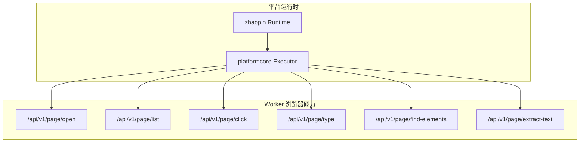
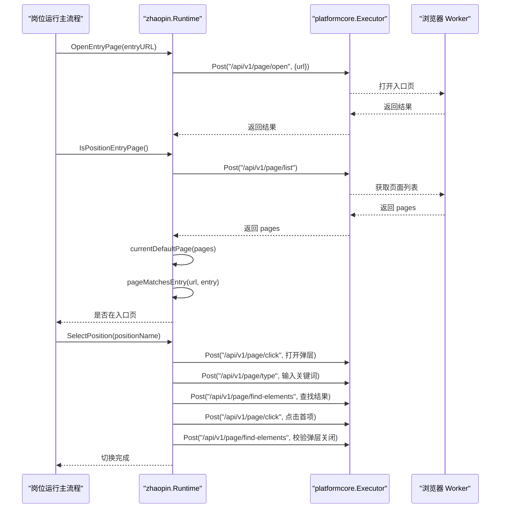
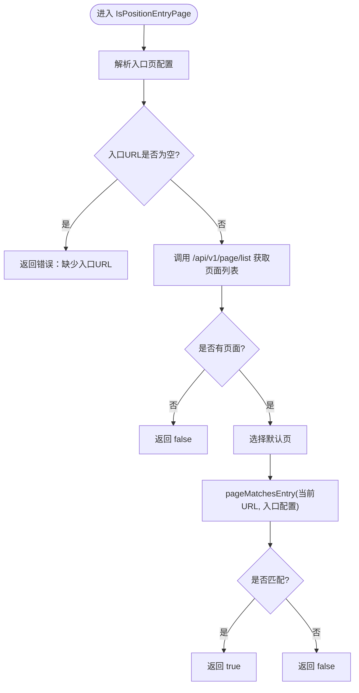
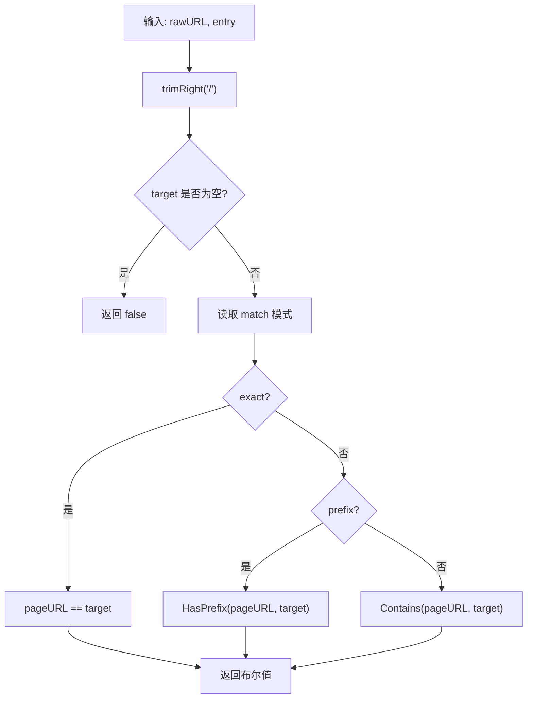
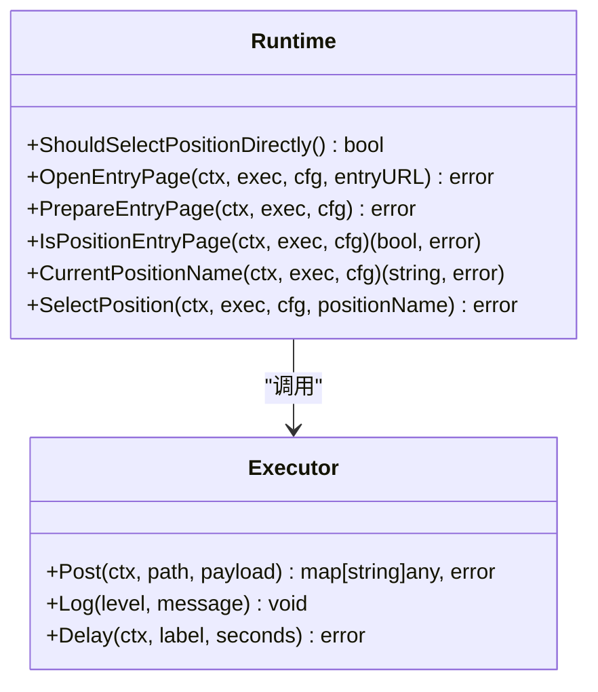
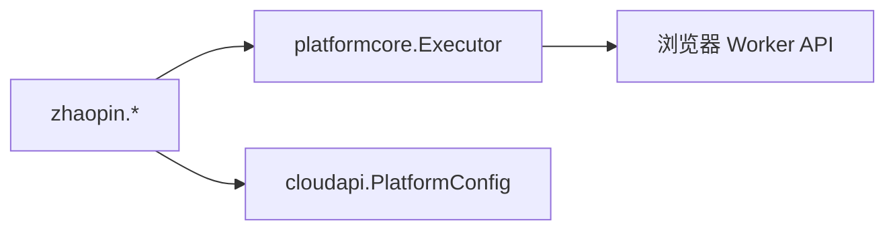

# 页面导航

<cite>
**本文引用的文件**
- [navigation.go](file://goodhr5/local-agent-go/internal/platforms/zhaopin/navigation.go)
- [entry.go](file://goodhr5/local-agent-go/internal/platforms/zhaopin/entry.go)
- [position.go](file://goodhr5/local-agent-go/internal/platforms/zhaopin/position.go)
- [runtime.go](file://goodhr5/local-agent-go/internal/platforms/zhaopin/runtime.go)
- [helpers.go](file://goodhr5/local-agent-go/internal/platforms/zhaopin/helpers.go)
- [runtime.go](file://goodhr5/local-agent-go/internal/platformcore/runtime.go)
</cite>

## 目录
1. [简介](#简介)
2. [项目结构](#项目结构)
3. [核心组件](#核心组件)
4. [架构总览](#架构总览)
5. [详细组件分析](#详细组件分析)
6. [依赖关系分析](#依赖关系分析)
7. [性能考量](#性能考量)
8. [故障排查指南](#故障排查指南)
9. [结论](#结论)
10. [附录](#附录)

## 简介
本文件聚焦智联招聘平台在本地运行时的“页面导航”能力，覆盖以下主题：
- 页面跳转策略与入口页识别
- URL 模式匹配与路由判断
- 页面状态管理、历史记录与浏览器行为模拟
- 导航错误恢复、超时处理与页面加载监控
- 导航路径配置方法、自定义跳转规则与性能优化技巧
- 具体实现代码位置与使用示例（以源码路径引用为主）

该能力通过统一的平台运行时接口抽象，结合 Worker 提供的浏览器操作 API，完成打开入口页、判断当前是否在入口页、读取/切换岗位等导航流程。

## 项目结构
智联招聘平台的导航相关代码集中在 local-agent-go 的 zhaopin 包中，并通过 platformcore 的统一接口对外暴露能力。关键文件职责如下：
- entry.go：打开入口页、准备入口页、判断当前是否仍在入口页
- navigation.go：URL 匹配、默认页选择、岗位名称规范化、列表项合并等工具逻辑
- position.go：读取当前岗位名称、通过弹层搜索并切换到目标岗位
- runtime.go：平台运行时实例与通用参数构造、候选人匹配文本生成等
- helpers.go：配置解析、元素定位转换、日志摘要等通用辅助函数
- platformcore/runtime.go：定义 Executor、Runtime 等统一接口，约束各平台实现

图表来源
- [entry.go:12-43](file://goodhr5/local-agent-go/internal/platforms/zhaopin/entry.go#L12-L43)
- [position.go:13-102](file://goodhr5/local-agent-go/internal/platforms/zhaopin/position.go#L13-L102)
- [runtime.go:11-22](file://goodhr5/local-agent-go/internal/platforms/zhaopin/runtime.go#L11-L22)
- [runtime.go:10-18](file://goodhr5/local-agent-go/internal/platformcore/runtime.go#L10-L18)

章节来源
- [entry.go:12-43](file://goodhr5/local-agent-go/internal/platforms/zhaopin/entry.go#L12-L43)
- [navigation.go:12-71](file://goodhr5/local-agent-go/internal/platforms/zhaopin/navigation.go#L12-L71)
- [position.go:13-102](file://goodhr5/local-agent-go/internal/platforms/zhaopin/position.go#L13-L102)
- [runtime.go:11-22](file://goodhr5/local-agent-go/internal/platforms/zhaopin/runtime.go#L11-L22)
- [helpers.go:112-160](file://goodhr5/local-agent-go/internal/platforms/zhaopin/helpers.go#L112-L160)
- [runtime.go:10-18](file://goodhr5/local-agent-go/internal/platformcore/runtime.go#L10-L18)

## 核心组件
- 平台运行时 Runtime：封装智联招聘的导航与岗位切换能力，提供 ShouldSelectPositionDirectly 等策略开关
- 执行器 Executor：统一调用 Worker 的浏览器操作接口（open、list、click、type、find-elements、extract-text），并提供延迟与日志能力
- 入口页判定：基于云端配置的 pages 或 url，结合当前页面列表进行匹配
- URL 匹配：支持精确、前缀、包含三种匹配模式
- 岗位切换：通过弹层搜索关键词、定位首条结果并点击，等待关闭后确认切换成功
- 工具与配置解析：从平台配置中提取元素定位、合并父子类名、规范化文本等

章节来源
- [runtime.go:11-22](file://goodhr5/local-agent-go/internal/platforms/zhaopin/runtime.go#L11-L22)
- [entry.go:12-43](file://goodhr5/local-agent-go/internal/platforms/zhaopin/entry.go#L12-L43)
- [navigation.go:12-71](file://goodhr5/local-agent-go/internal/platforms/zhaopin/navigation.go#L12-L71)
- [position.go:31-102](file://goodhr5/local-agent-go/internal/platforms/zhaopin/position.go#L31-L102)
- [helpers.go:112-160](file://goodhr5/local-agent-go/internal/platforms/zhaopin/helpers.go#L112-L160)

## 架构总览
智联招聘导航由“平台运行时 + 统一执行器 + Worker 浏览器能力”三层构成：
- 平台运行时负责业务编排与策略选择
- 执行器屏蔽底层浏览器差异，统一通过 HTTP 调用 Worker
- Worker 提供 open、list、click、type、find-elements、extract-text 等原子能力

图表来源
- [entry.go:12-43](file://goodhr5/local-agent-go/internal/platforms/zhaopin/entry.go#L12-L43)
- [position.go:31-102](file://goodhr5/local-agent-go/internal/platforms/zhaopin/position.go#L31-L102)
- [runtime.go:10-18](file://goodhr5/local-agent-go/internal/platformcore/runtime.go#L10-L18)

## 详细组件分析

### 入口页打开与初始化
- 打开入口页：校验 entryURL 非空，调用 /api/v1/page/open 打开指定 URL
- 入口页准备：当前实现为空操作，可后续扩展弹窗处理
- 入口页判断：
  - 从配置解析入口页（优先 auth.pages.entry.url，其次 pages 首个有 url 的项，最后 cfg.url）
  - 获取当前页面列表，选择默认页（is_default=true 或第一个）
  - 使用 pageMatchesEntry 判断当前 URL 是否匹配入口配置

图表来源
- [entry.go:22-43](file://goodhr5/local-agent-go/internal/platforms/zhaopin/entry.go#L22-L43)
- [navigation.go:12-39](file://goodhr5/local-agent-go/internal/platforms/zhaopin/navigation.go#L12-L39)
- [navigation.go:55-71](file://goodhr5/local-agent-go/internal/platforms/zhaopin/navigation.go#L55-L71)

章节来源
- [entry.go:12-43](file://goodhr5/local-agent-go/internal/platforms/zhaopin/entry.go#L12-L43)
- [navigation.go:12-39](file://goodhr5/local-agent-go/internal/platforms/zhaopin/navigation.go#L12-L39)
- [navigation.go:55-71](file://goodhr5/local-agent-go/internal/platforms/zhaopin/navigation.go#L55-L71)

### URL 模式识别与路由判断
- 匹配模式：
  - exact：完全相等
  - prefix：前缀匹配
  - contains：包含匹配（默认）
- 归一化：去除末尾斜杠、空白，大小写不敏感的模式名
- 用途：用于判断当前页面是否仍停留在入口页或特定路由

图表来源
- [navigation.go:55-71](file://goodhr5/local-agent-go/internal/platforms/zhaopin/navigation.go#L55-L71)

章节来源
- [navigation.go:55-71](file://goodhr5/local-agent-go/internal/platforms/zhaopin/navigation.go#L55-L71)

### 页面状态管理与历史记录
- 页面状态：通过 /api/v1/page/list 获取当前所有页面及其属性（如 is_default、url）
- 默认页选择：优先 is_default=true 的页面，否则取第一个
- 历史记录：通过 Worker 的页面列表能力间接体现；导航过程中通过 open/click/type 等操作驱动页面变化
- 浏览器行为模拟：
  - 打开新页：/api/v1/page/open
  - 点击元素：/api/v1/page/click
  - 输入文本：/api/v1/page/type
  - 查找元素：/api/v1/page/find-elements
  - 提取文本：/api/v1/page/extract-text

章节来源
- [entry.go:27-43](file://goodhr5/local-agent-go/internal/platforms/zhaopin/entry.go#L27-L43)
- [position.go:31-102](file://goodhr5/local-agent-go/internal/platforms/zhaopin/position.go#L31-L102)
- [runtime.go:10-18](file://goodhr5/local-agent-go/internal/platformcore/runtime.go#L10-L18)

### 页面跳转策略与路由处理方法
- 直接切换策略：ShouldSelectPositionDirectly 返回 true，表示每次直接切换到目标岗位，无需读取当前岗位后再切换
- 路由处理：
  - 入口页判断：IsPositionEntryPage
  - 岗位切换：SelectPosition（打开弹层 -> 输入关键词 -> 查找结果 -> 点击首项 -> 等待关闭 -> 校验）
  - 当前岗位读取：CurrentPositionName（通过 extract-text 读取当前岗位文本）

图表来源
- [runtime.go:11-22](file://goodhr5/local-agent-go/internal/platforms/zhaopin/runtime.go#L11-L22)
- [runtime.go:10-18](file://goodhr5/local-agent-go/internal/platformcore/runtime.go#L10-L18)
- [position.go:13-102](file://goodhr5/local-agent-go/internal/platforms/zhaopin/position.go#L13-L102)

章节来源
- [runtime.go:11-22](file://goodhr5/local-agent-go/internal/platforms/zhaopin/runtime.go#L11-L22)
- [position.go:13-102](file://goodhr5/local-agent-go/internal/platforms/zhaopin/position.go#L13-L102)

### 导航错误的恢复机制
- 错误类型与提示：
  - 入口URL缺失：返回明确错误
  - 打开弹层失败：包装错误信息并返回
  - 输入关键词失败：包装错误信息并返回
  - 搜索结果为空：返回查询词以便定位
  - 首项缺少元素引用：返回错误
  - 点击失败：包装错误信息并返回
  - 弹层未关闭：返回错误提示
- 恢复建议：
  - 重试打开弹层与输入
  - 调整查找范围或关键词
  - 增加等待时间或使用 Delay
  - 记录日志与截图以便诊断

章节来源
- [entry.go:12-43](file://goodhr5/local-agent-go/internal/platforms/zhaopin/entry.go#L12-L43)
- [position.go:31-102](file://goodhr5/local-agent-go/internal/platforms/zhaopin/position.go#L31-L102)

### 超时处理策略
- 元素查找与交互：通过 Worker 的 timeout 字段控制单次操作的超时（例如 click、type 的 10000ms）
- 文本提取：extract-text 设置 3000ms 超时
- 等待与缓冲：使用 Delay 在关键步骤之间插入等待，避免竞态
- 建议：
  - 根据网络与页面响应调整 timeout
  - 对不稳定元素增加 find_attempts 与 find_interval_ms（通过 elementPayload 配置）

章节来源
- [position.go:31-102](file://goodhr5/local-agent-go/internal/platforms/zhaopin/position.go#L31-L102)
- [position.go:13-28](file://goodhr5/local-agent-go/internal/platforms/zhaopin/position.go#L13-L28)
- [helpers.go:132-160](file://goodhr5/local-agent-go/internal/platforms/zhaopin/helpers.go#L132-L160)

### 页面加载监控
- 通过 /api/v1/page/list 获取页面列表，检查默认页与入口匹配
- 通过 /api/v1/page/find-elements 验证关键元素是否存在（如弹层容器）
- 通过日志输出关键步骤（如搜索完成、切换完成）便于追踪

章节来源
- [entry.go:27-43](file://goodhr5/local-agent-go/internal/platforms/zhaopin/entry.go#L27-L43)
- [position.go:79-102](file://goodhr5/local-agent-go/internal/platforms/zhaopin/position.go#L79-L102)

### 导航路径的配置方法与自定义跳转规则
- 入口页配置优先级：
  - auth.pages 中 entry=true 且 url 非空
  - 否则取 pages 中第一个 url 非空的项
  - 若均无，则回退到 cfg.url
- 匹配模式：
  - exact：精确匹配
  - prefix：前缀匹配
  - contains：包含匹配（默认）
- 元素定位：
  - 通过 platformElement 与 elementPayload 将云端配置转换为 Worker 协议
  - 支持 target_classes、parent_classes、find_attempts、find_interval_ms 等

章节来源
- [navigation.go:12-39](file://goodhr5/local-agent-go/internal/platforms/zhaopin/navigation.go#L12-L39)
- [navigation.go:55-71](file://goodhr5/local-agent-go/internal/platforms/zhaopin/navigation.go#L55-L71)
- [helpers.go:112-160](file://goodhr5/local-agent-go/internal/platforms/zhaopin/helpers.go#L112-L160)

### 性能优化技巧
- 减少不必要的页面列表查询：仅在需要时调用 /api/v1/page/list
- 合理设置 timeout 与 Delay：避免过短导致失败，过长影响吞吐
- 使用 shouldSelectPositionDirectly：跳过当前岗位读取，提升切换效率
- 元素定位优化：
  - 使用更具体的 target_classes
  - 增加 parent_classes 缩小查找范围
  - 调整 find_attempts 与 find_interval_ms 提高稳定性

章节来源
- [runtime.go:19-22](file://goodhr5/local-agent-go/internal/platforms/zhaopin/runtime.go#L19-L22)
- [position.go:31-102](file://goodhr5/local-agent-go/internal/platforms/zhaopin/position.go#L31-L102)
- [helpers.go:132-160](file://goodhr5/local-agent-go/internal/platforms/zhaopin/helpers.go#L132-L160)

## 依赖关系分析
- zhaopin 包依赖 platformcore 的 Executor 接口，屏蔽底层浏览器差异
- 通过 cloudapi.PlatformConfig 传入平台配置，解析入口页、元素定位等
- 与 Worker 的 HTTP 接口紧密耦合，所有导航动作均通过 Post 调用

图表来源
- [runtime.go:10-18](file://goodhr5/local-agent-go/internal/platformcore/runtime.go#L10-L18)
- [entry.go:12-43](file://goodhr5/local-agent-go/internal/platforms/zhaopin/entry.go#L12-L43)
- [position.go:13-102](file://goodhr5/local-agent-go/internal/platforms/zhaopin/position.go#L13-L102)

章节来源
- [runtime.go:10-18](file://goodhr5/local-agent-go/internal/platformcore/runtime.go#L10-L18)
- [entry.go:12-43](file://goodhr5/local-agent-go/internal/platforms/zhaopin/entry.go#L12-L43)
- [position.go:13-102](file://goodhr5/local-agent-go/internal/platforms/zhaopin/position.go#L13-L102)

## 性能考量
- 超时与等待：为关键操作设置合理超时，使用 Delay 缓冲页面渲染
- 元素查找：通过父级类名缩小范围，减少全量查找开销
- 直接切换：启用 ShouldSelectPositionDirectly 避免冗余读取
- 日志与监控：记录关键步骤耗时与结果，便于定位瓶颈

[本节为通用指导，不直接分析具体文件]

## 故障排查指南
- 入口页缺失：检查配置中 auth.pages 或 cfg.url 是否正确
- 弹层无法打开：确认 selector 有效，必要时增加 timeout 或重试
- 搜索无结果：调整关键词（positionSearchQuery 会去除括号说明），或扩大查找范围
- 首项无元素引用：检查 find-elements 返回结构与字段映射
- 弹层未关闭：再次查找弹层容器，必要时手动关闭或重试

章节来源
- [entry.go:12-43](file://goodhr5/local-agent-go/internal/platforms/zhaopin/entry.go#L12-L43)
- [position.go:31-102](file://goodhr5/local-agent-go/internal/platforms/zhaopin/position.go#L31-L102)
- [navigation.go:73-93](file://goodhr5/local-agent-go/internal/platforms/zhaopin/navigation.go#L73-L93)

## 结论
智联招聘平台的页面导航通过统一的运行时接口与 Worker 浏览器能力协作，实现了入口页打开、URL 匹配、岗位切换等核心流程。借助配置化的元素定位与灵活的匹配模式，系统具备良好的可扩展性与稳定性。建议在复杂场景下结合日志与监控持续优化超时与等待策略，确保导航过程的健壮性。

[本节为总结，不直接分析具体文件]

## 附录
- 使用示例（以源码路径引用）：
  - 打开入口页：[entry.go:12-20](file://goodhr5/local-agent-go/internal/platforms/zhaopin/entry.go#L12-L20)
  - 判断是否在入口页：[entry.go:27-43](file://goodhr5/local-agent-go/internal/platforms/zhaopin/entry.go#L27-L43)
  - 读取当前岗位名称：[position.go:13-28](file://goodhr5/local-agent-go/internal/platforms/zhaopin/position.go#L13-L28)
  - 切换岗位（弹层搜索）：[position.go:31-102](file://goodhr5/local-agent-go/internal/platforms/zhaopin/position.go#L31-L102)
  - URL 匹配策略：[navigation.go:55-71](file://goodhr5/local-agent-go/internal/platforms/zhaopin/navigation.go#L55-L71)
  - 元素定位转换：[helpers.go:132-160](file://goodhr5/local-agent-go/internal/platforms/zhaopin/helpers.go#L132-L160)

[本节为参考索引，不直接分析具体文件]