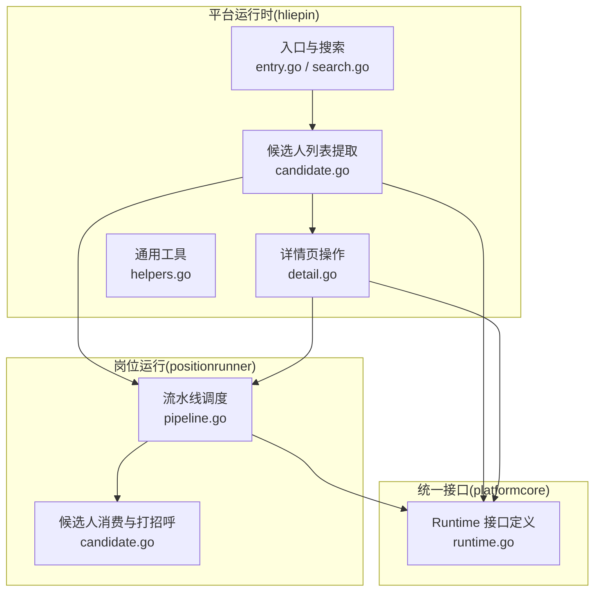
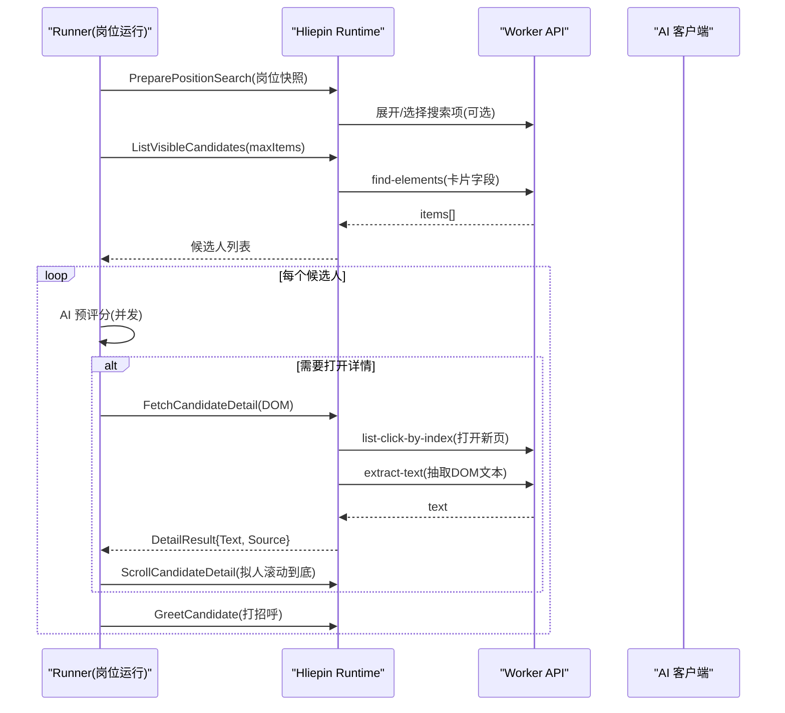
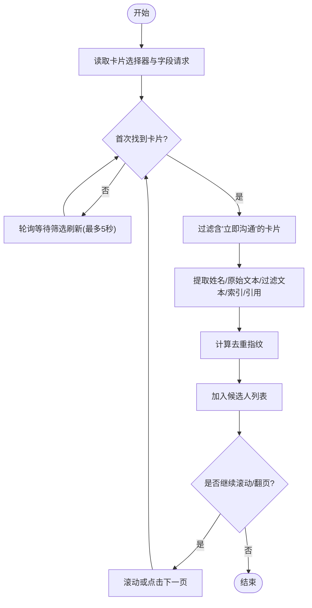
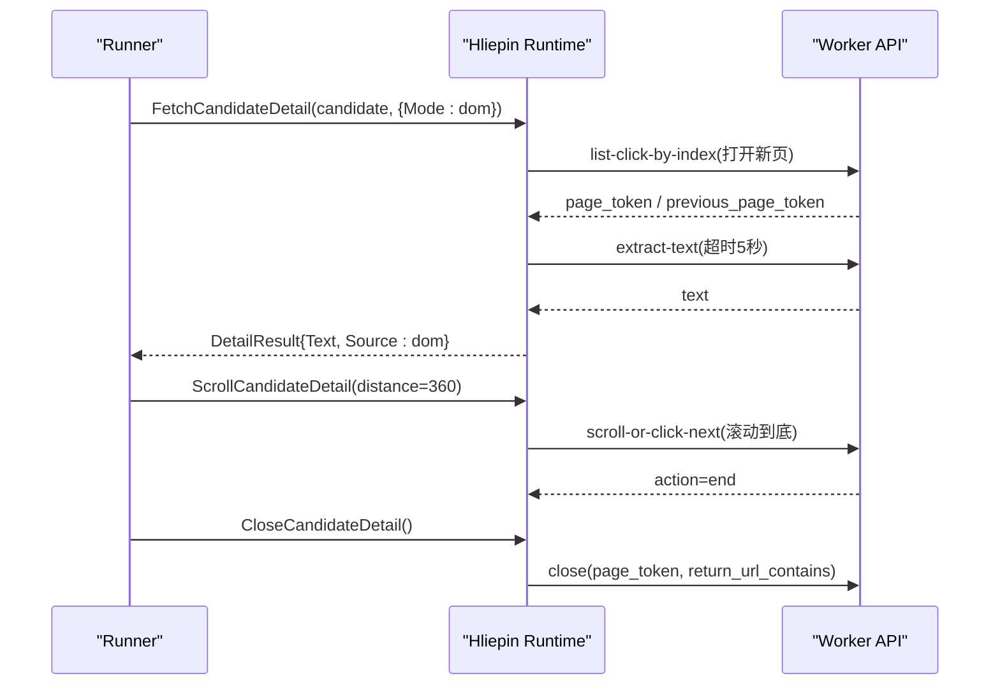
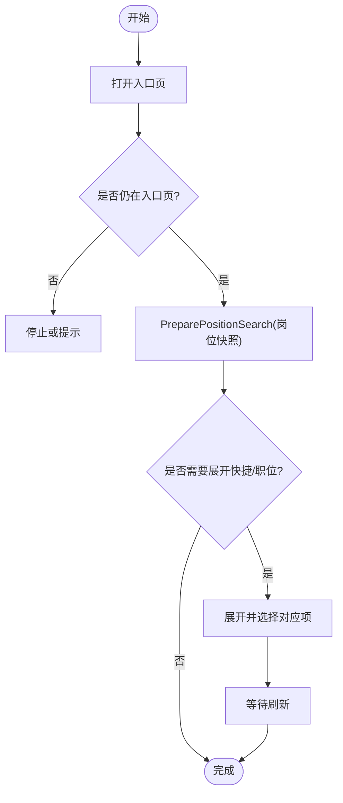
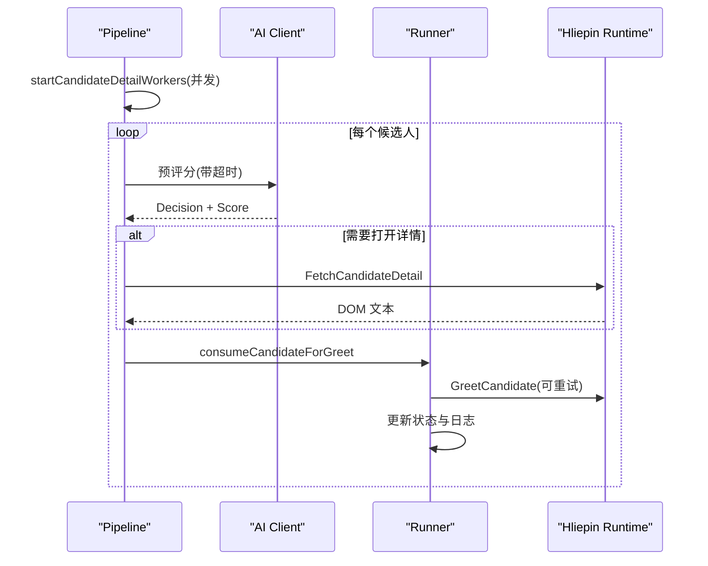
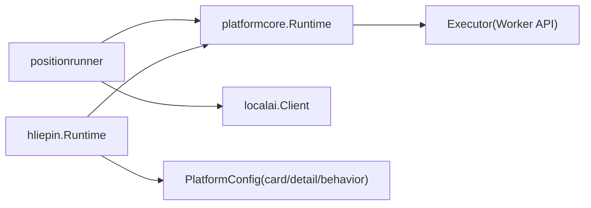

# 候选人处理

<cite>
**本文引用的文件**
- [candidate.go](file://goodhr5/local-agent-go/internal/platforms/hliepin/candidate.go)
- [detail.go](file://goodhr5/local-agent-go/internal/platforms/hliepin/detail.go)
- [entry.go](file://goodhr5/local-agent-go/internal/platforms/hliepin/entry.go)
- [helpers.go](file://goodhr5/local-agent-go/internal/platforms/hliepin/helpers.go)
- [search.go](file://goodhr5/local-agent-go/internal/platforms/hliepin/search.go)
- [runtime.go](file://goodhr5/local-agent-go/internal/platformcore/runtime.go)
- [candidate.go](file://goodhr5/local-agent-go/internal/positionrunner/candidate.go)
- [pipeline.go](file://goodhr5/local-agent-go/internal/positionrunner/pipeline.go)
</cite>

## 目录
1. [简介](#简介)
2. [项目结构](#项目结构)
3. [核心组件](#核心组件)
4. [架构总览](#架构总览)
5. [详细组件分析](#详细组件分析)
6. [依赖关系分析](#依赖关系分析)
7. [性能考量](#性能考量)
8. [故障排查指南](#故障排查指南)
9. [结论](#结论)
10. [附录](#附录)

## 简介
本文件面向猎聘平台候选人的抓取、解析与处理，覆盖以下目标：
- 候选人卡片信息提取算法与页面布局特征
- 简历数据结构解析与候选人画像构建逻辑
- 列表动态加载与滚动加载策略
- 基本信息、教育背景、工作经历、技能标签的提取要点
- 数据标准化、去重指纹与匹配评分计算流程
- 详情页打开、滚动、文本抽取与关闭流程

## 项目结构
猎聘平台的候选人处理由“平台运行时实现”和“岗位运行流水线”两部分组成：
- 平台运行时（hliepin）：负责浏览器交互、DOM 元素定位、列表与详情读取、滚动与关闭等。
- 岗位运行（positionrunner）：负责候选人队列消费、AI 预评分、打招呼执行、休息模拟与结果保存。

图表来源
- [entry.go:12-44](file://goodhr5/local-agent-go/internal/platforms/hliepin/entry.go#L12-L44)
- [search.go:22-54](file://goodhr5/local-agent-go/internal/platforms/hliepin/search.go#L22-L54)
- [candidate.go:14-79](file://goodhr5/local-agent-go/internal/platforms/hliepin/candidate.go#L14-L79)
- [detail.go:14-56](file://goodhr5/local-agent-go/internal/platforms/hliepin/detail.go#L14-L56)
- [runtime.go:46-74](file://goodhr5/local-agent-go/internal/platformcore/runtime.go#L46-L74)
- [pipeline.go:49-116](file://goodhr5/local-agent-go/internal/positionrunner/pipeline.go#L49-L116)
- [candidate.go:16-76](file://goodhr5/local-agent-go/internal/positionrunner/candidate.go#L16-L76)

章节来源
- [entry.go:12-44](file://goodhr5/local-agent-go/internal/platforms/hliepin/entry.go#L12-L44)
- [search.go:22-54](file://goodhr5/local-agent-go/internal/platforms/hliepin/search.go#L22-L54)
- [candidate.go:14-79](file://goodhr5/local-agent-go/internal/platforms/hliepin/candidate.go#L14-L79)
- [detail.go:14-56](file://goodhr5/local-agent-go/internal/platforms/hliepin/detail.go#L14-L56)
- [runtime.go:46-74](file://goodhr5/local-agent-go/internal/platformcore/runtime.go#L46-L74)
- [pipeline.go:49-116](file://goodhr5/local-agent-go/internal/positionrunner/pipeline.go#L49-L116)
- [candidate.go:16-76](file://goodhr5/local-agent-go/internal/positionrunner/candidate.go#L16-L76)

## 核心组件
- 平台运行时 Runtime 接口：定义了打开入口页、准备页面、判断入口页、获取当前岗位、切换岗位、列出可见候选人、滚动列表、读取详情、关闭详情、打招呼、筛选文本、去重指纹、清理详情文本等能力。
- 猎聘运行时实现：基于云端配置的元素选择器与 Worker 调用，完成列表抓取、详情页 DOM 文本抽取、滚动到底、返回上一页等操作。
- 岗位运行 Runner：将平台返回的候选人纳入流水线，进行 AI 预评分、决定是否打开详情、执行打招呼、记录状态与日志。

章节来源
- [runtime.go:46-74](file://goodhr5/local-agent-go/internal/platformcore/runtime.go#L46-L74)
- [candidate.go:14-79](file://goodhr5/local-agent-go/internal/platforms/hliepin/candidate.go#L14-L79)
- [detail.go:14-56](file://goodhr5/local-agent-go/internal/platforms/hliepin/detail.go#L14-L56)
- [pipeline.go:49-116](file://goodhr5/local-agent-go/internal/positionrunner/pipeline.go#L49-L116)

## 架构总览
猎聘候选人处理的端到端流程如下：
- 入口与搜索准备：根据岗位快照保留或调整搜索上下文，必要时展开快捷搜索或发布职位并等待刷新。
- 列表抓取：通过统一的 find-elements 接口按配置字段抓取候选人卡片，支持首次为空时的轮询等待。
- 详情页读取：点击候选人进入新页，等待新页稳定后抽取 DOM 文本，用于后续 AI 分析与画像构建。
- 流水线处理：对候选人进行 AI 预评分，决定是否继续打开详情；对通过者执行打招呼与信息索要。
- 滚动与翻页：在列表与详情页分别采用滚动或下一页按钮推进，保证完整浏览。

图表来源
- [search.go:22-54](file://goodhr5/local-agent-go/internal/platforms/hliepin/search.go#L22-L54)
- [candidate.go:14-79](file://goodhr5/local-agent-go/internal/platforms/hliepin/candidate.go#L14-L79)
- [detail.go:14-56](file://goodhr5/local-agent-go/internal/platforms/hliepin/detail.go#L14-L56)
- [pipeline.go:49-116](file://goodhr5/local-agent-go/internal/positionrunner/pipeline.go#L49-L116)

## 详细组件分析

### 候选人列表抓取与去重
- 列表抓取策略
  - 使用配置的 card.item 选择器抓取可见候选人；若首次为空，回退到表格行选择器并按需轮询等待筛选刷新。
  - 仅保留包含“立即沟通”的卡片，确保可开聊。
  - 从卡片文本与 fields 中提取姓名、原始文本、过滤文本、索引、元素引用等。
- 去重指纹
  - 优先使用平台候选人 ID 生成指纹；否则基于姓名、年龄与稳定的列表文本哈希生成指纹。
  - 提供稳定文本清洗函数，剔除活跃状态、已查看、操作按钮等易变标记。
- 滚动推进
  - 通过 scroll-or-click-next 统一接口滚动或点击下一页，支持禁用类检测与直接点击下一页。

图表来源
- [candidate.go:14-79](file://goodhr5/local-agent-go/internal/platforms/hliepin/candidate.go#L14-L79)
- [candidate.go:81-98](file://goodhr5/local-agent-go/internal/platforms/hliepin/candidate.go#L81-L98)
- [candidate.go:105-119](file://goodhr5/local-agent-go/internal/platforms/hliepin/candidate.go#L105-L119)
- [candidate.go:129-159](file://goodhr5/local-agent-go/internal/platforms/hliepin/candidate.go#L129-L159)

章节来源
- [candidate.go:14-79](file://goodhr5/local-agent-go/internal/platforms/hliepin/candidate.go#L14-L79)
- [candidate.go:81-98](file://goodhr5/local-agent-go/internal/platforms/hliepin/candidate.go#L81-L98)
- [candidate.go:105-119](file://goodhr5/local-agent-go/internal/platforms/hliepin/candidate.go#L105-L119)
- [candidate.go:129-159](file://goodhr5/local-agent-go/internal/platforms/hliepin/candidate.go#L129-L159)

### 详情页读取与滚动
- 打开详情页
  - 通过 list-click-by-index 打开新页，要求新页且垂直方向打开，附带诊断信息便于问题定位。
  - 等待新页稳定后，按配置的 detail.content 抽取 DOM 文本。
- 滚动详情
  - 使用 scroll-or-click-next 以随机时长滚动到底，避免机械行为。
- 关闭详情页
  - 依据 token 与 URL 片段安全返回上一页。

图表来源
- [detail.go:14-56](file://goodhr5/local-agent-go/internal/platforms/hliepin/detail.go#L14-L56)
- [detail.go:58-75](file://goodhr5/local-agent-go/internal/platforms/hliepin/detail.go#L58-L75)
- [detail.go:77-90](file://goodhr5/local-agent-go/internal/platforms/hliepin/detail.go#L77-L90)

章节来源
- [detail.go:14-56](file://goodhr5/local-agent-go/internal/platforms/hliepin/detail.go#L14-L56)
- [detail.go:58-75](file://goodhr5/local-agent-go/internal/platforms/hliepin/detail.go#L58-L75)
- [detail.go:77-90](file://goodhr5/local-agent-go/internal/platforms/hliepin/detail.go#L77-L90)

### 搜索准备与页面初始化
- 入口页打开与判断
  - 打开入口页并校验当前页面是否为岗位运行入口页。
- 搜索准备
  - 保留岗位上下文，不再自动改变用户手动设置的搜索与筛选条件；如需快捷搜索或发布职位，则展开并精确匹配选择。
  - 支持展开“快捷搜索”和“正在发布的职位”，并在选择后等待刷新。

图表来源
- [entry.go:12-44](file://goodhr5/local-agent-go/internal/platforms/hliepin/entry.go#L12-L44)
- [search.go:22-54](file://goodhr5/local-agent-go/internal/platforms/hliepin/search.go#L22-L54)
- [search.go:56-123](file://goodhr5/local-agent-go/internal/platforms/hliepin/search.go#L56-L123)

章节来源
- [entry.go:12-44](file://goodhr5/local-agent-go/internal/platforms/hliepin/entry.go#L12-L44)
- [search.go:22-54](file://goodhr5/local-agent-go/internal/platforms/hliepin/search.go#L22-L54)
- [search.go:56-123](file://goodhr5/local-agent-go/internal/platforms/hliepin/search.go#L56-L123)

### 流水线与打分、打招呼
- 流水线并发
  - 为候选人开启后台预评分工作池，按并发度投递任务，输出决策与错误。
- 预评分与详情决策
  - 对每个候选人执行 AI 基础预评分，决定是否打开详情。
- 打招呼与信息索要
  - 对通过的候选人执行打招呼，并根据岗位配置决定是否索要电话、微信或简历；支持重试与超时控制。
- 去重与状态管理
  - 过滤已见过的候选人，维护状态机（scanned/passed/detail_fetched/ai_passed/greeted/skipped/failed）。

图表来源
- [pipeline.go:49-116](file://goodhr5/local-agent-go/internal/positionrunner/pipeline.go#L49-L116)
- [candidate.go:16-76](file://goodhr5/local-agent-go/internal/positionrunner/candidate.go#L16-L76)
- [candidate.go:269-287](file://goodhr5/local-agent-go/internal/positionrunner/candidate.go#L269-L287)

章节来源
- [pipeline.go:49-116](file://goodhr5/local-agent-go/internal/positionrunner/pipeline.go#L49-L116)
- [candidate.go:16-76](file://goodhr5/local-agent-go/internal/positionrunner/candidate.go#L16-L76)
- [candidate.go:269-287](file://goodhr5/local-agent-go/internal/positionrunner/candidate.go#L269-L287)

### 数据标准化与字段映射
- 字段请求
  - 通过 card.fields 配置声明式地映射各字段到 DOM 元素；猎聘额外追加平台候选人 ID 的读取规则。
- 文本规范化
  - 提供字符串与整型的安全读取、空值合并、文本规范化与预览摘要等工具函数。
- 详情文本清理
  - 提供平台详情文本清理钩子，去除平台附加内容。

章节来源
- [helpers.go:9-110](file://goodhr5/local-agent-go/internal/platforms/hliepin/helpers.go#L9-L110)
- [helpers.go:162-180](file://goodhr5/local-agent-go/internal/platforms/hliepin/helpers.go#L162-L180)
- [candidate.go:121-127](file://goodhr5/local-agent-go/internal/platforms/hliepin/candidate.go#L121-L127)
- [detail.go:92-95](file://goodhr5/local-agent-go/internal/platforms/hliepin/detail.go#L92-L95)

## 依赖关系分析
- 平台运行时依赖
  - 依赖 platformcore.Executor 调用 Worker API（find-elements、extract-text、scroll-or-click-next、list-click-by-index、close 等）。
  - 依赖云端平台配置（card、detail、behavior 等分区）决定选择器与行为。
- 岗位运行依赖
  - 依赖 platformcore.Runtime 抽象平台差异，屏蔽具体网站实现细节。
  - 依赖 localai.Client 进行预评分与决策。
- 耦合与内聚
  - hliepin 包内聚了猎聘特有的选择器与交互逻辑；positionrunner 包内聚了候选人生命周期管理与并发控制；platformcore 提供最小必要接口，降低耦合。

图表来源
- [runtime.go:10-18](file://goodhr5/local-agent-go/internal/platformcore/runtime.go#L10-L18)
- [runtime.go:46-74](file://goodhr5/local-agent-go/internal/platformcore/runtime.go#L46-L74)
- [pipeline.go:118-131](file://goodhr5/local-agent-go/internal/positionrunner/pipeline.go#L118-L131)

章节来源
- [runtime.go:10-18](file://goodhr5/local-agent-go/internal/platformcore/runtime.go#L10-L18)
- [runtime.go:46-74](file://goodhr5/local-agent-go/internal/platformcore/runtime.go#L46-L74)
- [pipeline.go:118-131](file://goodhr5/local-agent-go/internal/positionrunner/pipeline.go#L118-L131)

## 性能考量
- 列表抓取
  - 首次为空时采用短间隔轮询与超时控制，避免长时间阻塞。
  - 限制 max_items 减少单次 DOM 扫描开销。
- 详情页读取
  - 设置合理的 extract-text 超时，防止页面未就绪导致卡死。
  - 滚动详情采用随机时长，兼顾稳定性与效率。
- 并发与限流
  - 预评分阶段使用并发工作池，提升吞吐；同时通过超时与错误捕获保护主流程。
  - 打招呼前引入随机延时，降低平台风控风险。
- 资源释放
  - 详情页关闭使用 token 与 URL 片段精准返回，避免多余页面残留。

[本节为通用指导，不直接分析具体文件]

## 故障排查指南
- 列表为空
  - 检查 card.item 选择器是否命中；若首次为空，确认轮询等待是否生效。
  - 核对页面 URL 与筛选条件，确保“立即沟通”存在。
- 详情页无法打开
  - 检查 list-click-by-index 的 item 与 clickTarget 配置；确认 require_new_page 与 vertical_only 参数。
  - 观察诊断信息与日志中的 candidate_name、diagnostic_platform。
- 详情页文本为空
  - 检查 detail.content 配置是否存在；确认 extract-text 超时是否足够。
- 滚动未完成
  - 检查 scroll-or-click-next 的 next_element 与 bottom_threshold；确认 action 是否为 end。
- 打招呼失败
  - 检查重试次数与超时；查看岗位运行日志中的错误与耗时。

章节来源
- [candidate.go:27-47](file://goodhr5/local-agent-go/internal/platforms/hliepin/candidate.go#L27-L47)
- [detail.go:26-56](file://goodhr5/local-agent-go/internal/platforms/hliepin/detail.go#L26-L56)
- [detail.go:58-75](file://goodhr5/local-agent-go/internal/platforms/hliepin/detail.go#L58-L75)
- [candidate.go:111-135](file://goodhr5/local-agent-go/internal/positionrunner/candidate.go#L111-L135)

## 结论
本方案通过声明式字段映射与统一的 Worker API，实现了猎聘平台候选人列表的高效抓取与详情页的稳定读取；结合岗位运行流水线的并发预评分与智能打招呼，形成完整的候选人处理闭环。去重指纹与文本规范化保障了数据的准确性与一致性；滚动与翻页策略提升了覆盖率与鲁棒性。未来可在字段映射与选择器层面持续优化，以适配猎聘页面的演进。

[本节为总结性内容，不直接分析具体文件]

## 附录
- 关键流程参考路径
  - 列表抓取与去重：[candidate.go:14-79](file://goodhr5/local-agent-go/internal/platforms/hliepin/candidate.go#L14-L79)、[candidate.go:105-119](file://goodhr5/local-agent-go/internal/platforms/hliepin/candidate.go#L105-L119)
  - 详情页读取与滚动：[detail.go:14-56](file://goodhr5/local-agent-go/internal/platforms/hliepin/detail.go#L14-L56)、[detail.go:58-75](file://goodhr5/local-agent-go/internal/platforms/hliepin/detail.go#L58-L75)
  - 搜索准备与入口页：[entry.go:12-44](file://goodhr5/local-agent-go/internal/platforms/hliepin/entry.go#L12-L44)、[search.go:22-54](file://goodhr5/local-agent-go/internal/platforms/hliepin/search.go#L22-L54)
  - 流水线与打分：[pipeline.go:49-116](file://goodhr5/local-agent-go/internal/positionrunner/pipeline.go#L49-L116)
  - 打招呼与信息索要：[candidate.go:16-76](file://goodhr5/local-agent-go/internal/positionrunner/candidate.go#L16-L76)

[本节为索引性内容，不直接分析具体文件]