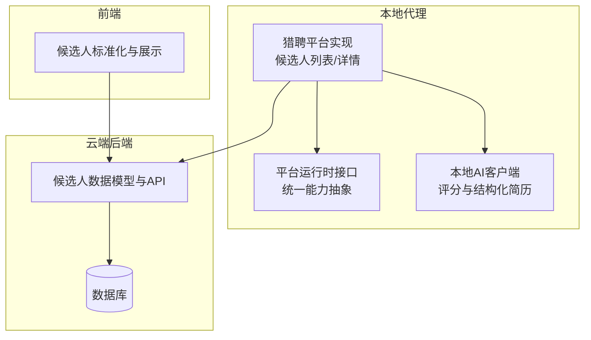
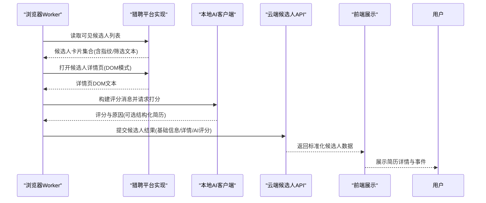
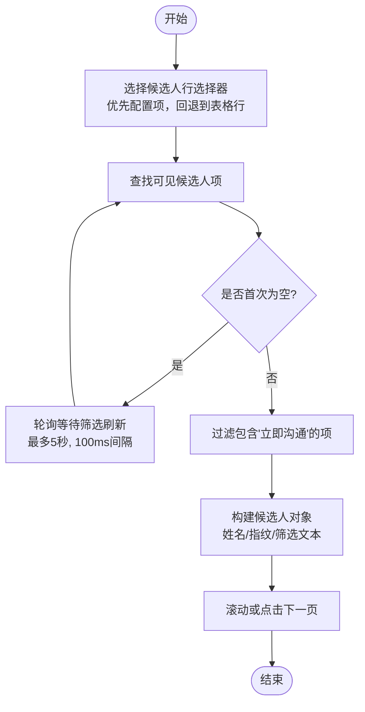
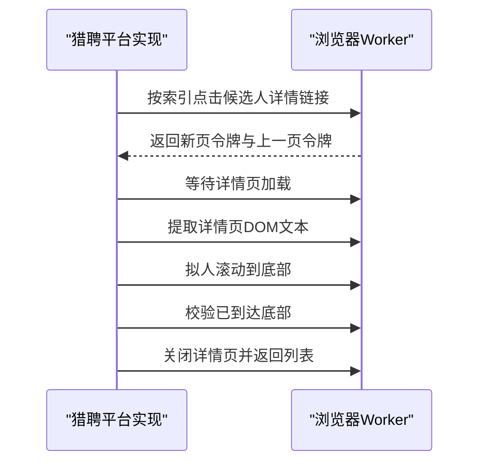
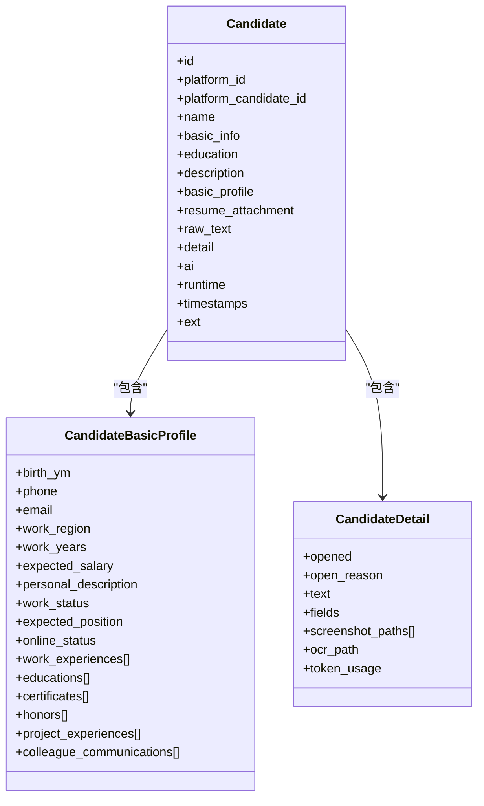
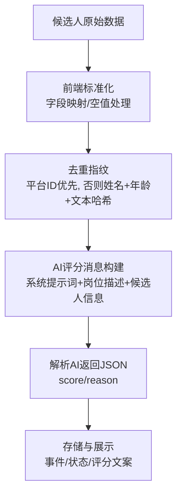
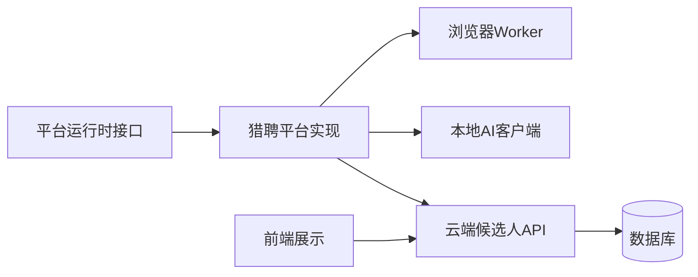

# 候选人处理

<cite>
**本文引用的文件**
- [candidate.go](file://goodhr5/local-agent-go/internal/platforms/hliepin/candidate.go)
- [detail.go](file://goodhr5/local-agent-go/internal/platforms/hliepin/detail.go)
- [search.go](file://goodhr5/local-agent-go/internal/platforms/hliepin/search.go)
- [runtime.go](file://goodhr5/local-agent-go/internal/platformcore/runtime.go)
- [candidate-match.js](file://goodhr5/local-agent-go/worker-node/src/candidate-match.js)
- [client.go](file://goodhr5/local-agent-go/internal/localai/client.go)
- [candidate.go](file://goodhr5/cloud/backend/internal/httpapi/candidate.go)
- [candidate_service.go](file://goodhr5/cloud/backend/internal/httpapi/candidate_service.go)
- [candidate-normalize.ts](file://goodhr5/cloud/frontend-next/lib/candidate-normalize.ts)
- [0018_upgrade_default_prompts_to_score_mode.sql](file://goodhr5/cloud/backend/db/migrations/0018_upgrade_default_prompts_to_score_mode.sql)
- [page.tsx](file://goodhr5/cloud/frontend-next/app/admin/resumes/detail/page.tsx)
</cite>

## 目录
1. [简介](#简介)
2. [项目结构](#项目结构)
3. [核心组件](#核心组件)
4. [架构总览](#架构总览)
5. [详细组件分析](#详细组件分析)
6. [依赖关系分析](#依赖关系分析)
7. [性能考量](#性能考量)
8. [故障排查指南](#故障排查指南)
9. [结论](#结论)
10. [附录](#附录)

## 简介
本文件面向猎聘平台候选人处理的完整链路，覆盖候选人卡片提取、详情页抓取、简历数据结构解析、候选人画像构建、数据标准化与去重、匹配评分计算等关键环节。文档同时说明猎聘猎头端候选人列表的页面布局特征、动态加载机制与滚动加载策略，并给出可操作的排错建议与优化方向。

## 项目结构
围绕猎聘候选人处理，代码分布在本地代理（浏览器自动化）、云端后端（数据模型与API）和前端（展示与标准化）三部分：
- 本地代理平台实现：负责在猎聘页面上定位候选人卡片、读取详情、滚动列表与详情页、生成去重指纹与筛选文本。
- 云端后端：定义统一的候选人数据模型、提供候选人列表与详情接口、承载AI评分字段。
- 前端：对后端返回的候选人数据进行标准化展示，包括经历、教育、证书、荣誉、项目经验、沟通记录等。

图表来源
- [runtime.go:54-82](file://goodhr5/local-agent-go/internal/platformcore/runtime.go#L54-L82)
- [candidate.go:14-79](file://goodhr5/local-agent-go/internal/platforms/hliepin/candidate.go#L14-L79)
- [detail.go:14-56](file://goodhr5/local-agent-go/internal/platforms/hliepin/detail.go#L14-L56)
- [client.go:689-712](file://goodhr5/local-agent-go/internal/localai/client.go#L689-L712)
- [candidate.go:126-143](file://goodhr5/cloud/backend/internal/httpapi/candidate.go#L126-L143)
- [candidate-service.go:30-79](file://goodhr5/cloud/backend/internal/httpapi/candidate_service.go#L30-L79)
- [candidate-normalize.ts:76-142](file://goodhr5/cloud/frontend-next/lib/candidate-normalize.ts#L76-L142)

章节来源
- [runtime.go:54-82](file://goodhr5/local-agent-go/internal/platformcore/runtime.go#L54-L82)
- [candidate.go:14-79](file://goodhr5/local-agent-go/internal/platforms/hliepin/candidate.go#L14-L79)
- [detail.go:14-56](file://goodhr5/local-agent-go/internal/platforms/hliepin/detail.go#L14-L56)
- [client.go:689-712](file://goodhr5/local-agent-go/internal/localai/client.go#L689-L712)
- [candidate.go:126-143](file://goodhr5/cloud/backend/internal/httpapi/candidate.go#L126-L143)
- [candidate-service.go:30-79](file://goodhr5/cloud/backend/internal/httpapi/candidate_service.go#L30-L79)
- [candidate-normalize.ts:76-142](file://goodhr5/cloud/frontend-next/lib/candidate-normalize.ts#L76-L142)

## 核心组件
- 猎聘平台运行时能力：统一抽象了打开入口、准备页面、读取岗位、列出候选人、滚动列表、抓取详情、关闭详情、打招呼、筛选文本、去重指纹、清理详情文本等能力。
- 猎聘具体实现：基于选择器与回退策略提取候选人卡片，支持首次为空时的轮询等待；详情页通过DOM模式读取文本并拟人化滚动到底；提供稳定的候选人名与指纹算法。
- 本地AI客户端：构建评分消息、稳定提示词替换、结构化简历示例输出、解析AI返回的JSON评分与原因。
- 云端数据模型：定义候选人基础信息、工作经历、教育经历、证书、荣誉、项目经验、沟通记录、AI评分、时间戳等统一结构。
- 前端标准化：将后端返回的扁平候选人数据转换为便于展示的标准化对象，包含事件标签、状态文案、评分文案、经历行摘要等。

章节来源
- [runtime.go:54-127](file://goodhr5/local-agent-go/internal/platformcore/runtime.go#L54-L127)
- [candidate.go:14-189](file://goodhr5/local-agent-go/internal/platforms/hliepin/candidate.go#L14-L189)
- [detail.go:14-96](file://goodhr5/local-agent-go/internal/platforms/hliepin/detail.go#L14-L96)
- [client.go:689-879](file://goodhr5/local-agent-go/internal/localai/client.go#L689-L879)
- [candidate.go:6-143](file://goodhr5/cloud/backend/internal/httpapi/candidate.go#L6-L143)
- [candidate-normalize.ts:76-227](file://goodhr5/cloud/frontend-next/lib/candidate-normalize.ts#L76-L227)

## 架构总览
猎聘候选人处理从“列表扫描”到“详情抓取”，再到“AI评分与结构化简历”，最后“入库与展示”的端到端流程如下：

图表来源
- [candidate.go:14-79](file://goodhr5/local-agent-go/internal/platforms/hliepin/candidate.go#L14-L79)
- [detail.go:14-56](file://goodhr5/local-agent-go/internal/platforms/hliepin/detail.go#L14-L56)
- [client.go:689-712](file://goodhr5/local-agent-go/internal/localai/client.go#L689-L712)
- [candidate-service.go:30-79](file://goodhr5/cloud/backend/internal/httpapi/candidate_service.go#L30-L79)
- [candidate-normalize.ts:76-142](file://goodhr5/cloud/frontend-next/lib/candidate-normalize.ts#L76-L142)

## 详细组件分析

### 猎聘候选人列表提取与滚动
- 列表元素选择与回退：优先使用配置中的卡片项选择器；若为空则回退到表格行选择器，并在首次为空时按固定间隔轮询等待筛选刷新完成。
- 可见性过滤与最小过滤条件：仅提取可见元素，并通过“立即沟通”关键词过滤无效条目。
- 姓名与指纹：从行文本或字段中提取姓名；指纹优先使用平台候选人ID，否则基于姓名、年龄与稳定化后的行文本哈希生成。
- 滚动推进：封装滚动或点击下一页动作，支持禁用类检测与下一页按钮选择器，自动等待页面刷新。

图表来源
- [candidate.go:14-79](file://goodhr5/local-agent-go/internal/platforms/hliepin/candidate.go#L14-L79)
- [candidate.go:81-98](file://goodhr5/local-agent-go/internal/platforms/hliepin/candidate.go#L81-L98)
- [search.go:22-54](file://goodhr5/local-agent-go/internal/platforms/hliepin/search.go#L22-L54)

章节来源
- [candidate.go:14-98](file://goodhr5/local-agent-go/internal/platforms/hliepin/candidate.go#L14-L98)
- [search.go:22-54](file://goodhr5/local-agent-go/internal/platforms/hliepin/search.go#L22-L54)

### 详情页抓取与拟人滚动
- 详情页打开：通过索引点击目标链接，要求新页面打开并等待加载；记录当前页与返回页令牌以便后续关闭。
- DOM文本提取：读取详情页内容区域文本，若为空则报错；支持配置内容区域选择器。
- 拟人滚动：以随机时长连续滚轮滚动至底部，确保完整阅读；完成后校验是否到达底部。
- 关闭详情：根据URL片段与页令牌安全返回搜索列表页。

图表来源
- [detail.go:14-56](file://goodhr5/local-agent-go/internal/platforms/hliepin/detail.go#L14-L56)
- [detail.go:58-90](file://goodhr5/local-agent-go/internal/platforms/hliepin/detail.go#L58-L90)

章节来源
- [detail.go:14-96](file://goodhr5/local-agent-go/internal/platforms/hliepin/detail.go#L14-L96)

### 简历数据结构解析与候选人画像构建
- 结构化简历示例：本地AI客户端在开启“输出结构化简历”时，会要求AI返回包含姓名、出生年月、联系方式、工作地区、工作年限、期望薪资、教育程度、期望职位、在线状态、个人描述、工作经历、教育经历、证书、荣誉、项目经验、沟通记录等字段的JSON。
- 云端数据模型：后端定义了候选人基础信息、工作经历、教育经历、证书、荣誉、项目经验、沟通记录、AI评分、时间戳等统一结构，用于持久化与对外暴露。
- 前端标准化：前端将后端返回的扁平候选人数据映射为标准化对象，包含事件标签、状态文案、评分文案、经历行摘要、时间段文案等，便于管理后台展示。

图表来源
- [candidate.go:61-143](file://goodhr5/cloud/backend/internal/httpapi/candidate.go#L61-L143)
- [client.go:724-805](file://goodhr5/local-agent-go/internal/localai/client.go#L724-L805)
- [candidate-normalize.ts:76-142](file://goodhr5/cloud/frontend-next/lib/candidate-normalize.ts#L76-L142)

章节来源
- [candidate.go:61-143](file://goodhr5/cloud/backend/internal/httpapi/candidate.go#L61-L143)
- [client.go:724-805](file://goodhr5/local-agent-go/internal/localai/client.go#L724-L805)
- [candidate-normalize.ts:76-142](file://goodhr5/cloud/frontend-next/lib/candidate-normalize.ts#L76-L142)

### 候选人基本信息提取、教育背景解析、工作经历分析、技能标签识别
- 基本信息：姓名、出生年月、联系方式、工作地区、工作年限、期望薪资、在线状态、个人描述等由AI解析后写入基础信息字段。
- 教育背景：学校名称、专业、学历层次、起止年月由AI解析并填入教育经历数组。
- 工作经历：公司名称、职位名称、工作内容、起止年月由AI解析并填入工作经历数组。
- 技能标签：系统未直接定义“技能标签”字段；可通过证书、荣誉、项目经验与个人描述进行间接识别与展示。

章节来源
- [candidate.go:61-143](file://goodhr5/cloud/backend/internal/httpapi/candidate.go#L61-L143)
- [client.go:724-805](file://goodhr5/local-agent-go/internal/localai/client.go#L724-L805)
- [candidate-normalize.ts:96-118](file://goodhr5/cloud/frontend-next/lib/candidate-normalize.ts#L96-L118)

### 候选人数据标准化、去重算法、匹配评分计算
- 数据标准化：前端将后端返回的候选人数据映射为标准化的展示对象，统一字段命名与空值处理，并提供事件标签、状态文案、评分文案、经历行摘要等辅助方法。
- 去重算法：猎聘平台实现中，候选人指纹优先使用平台候选人ID；若无ID，则基于姓名、年龄与稳定化后的行文本哈希生成唯一标识，避免重复入库。
- 匹配评分计算：本地AI客户端构建评分消息，结合岗位要求与候选人信息调用AI，解析返回的JSON得到分数与原因；默认提示词迁移到评分模式，支持宽松规则与保留进一步查看空间。

图表来源
- [candidate.go:105-119](file://goodhr5/local-agent-go/internal/platforms/hliepin/candidate.go#L105-L119)
- [client.go:689-712](file://goodhr5/local-agent-go/internal/localai/client.go#L689-L712)
- [client.go:854-879](file://goodhr5/local-agent-go/internal/localai/client.go#L854-L879)
- [candidate-normalize.ts:160-188](file://goodhr5/cloud/frontend-next/lib/candidate-normalize.ts#L160-L188)
- [0018_upgrade_default_prompts_to_score_mode.sql:10-20](file://goodhr5/cloud/backend/db/migrations/0018_upgrade_default_prompts_to_score_mode.sql#L10-L20)

章节来源
- [candidate.go:105-119](file://goodhr5/local-agent-go/internal/platforms/hliepin/candidate.go#L105-L119)
- [client.go:689-712](file://goodhr5/local-agent-go/internal/localai/client.go#L689-L712)
- [client.go:854-879](file://goodhr5/local-agent-go/internal/localai/client.go#L854-L879)
- [candidate-normalize.ts:160-188](file://goodhr5/cloud/frontend-next/lib/candidate-normalize.ts#L160-L188)
- [0018_upgrade_default_prompts_to_score_mode.sql:10-20](file://goodhr5/cloud/backend/db/migrations/0018_upgrade_default_prompts_to_score_mode.sql#L10-L20)

### 猎聘网站候选人列表页面布局特征与动态加载机制
- 布局特征：候选人列表采用表格行结构，部分版本使用特定类名；当旧类不存在时回退到通用表格行选择器。
- 动态加载：首次可能为空，需轮询等待筛选刷新；滚动或点击下一页时，需要等待页面刷新并检测下一页按钮禁用状态。
- 滚动加载策略：封装滚动或点击下一页的统一接口，支持距离、阈值、禁用类、下一页等待时间与直接点击策略。

章节来源
- [candidate.go:14-79](file://goodhr5/local-agent-go/internal/platforms/hliepin/candidate.go#L14-L79)
- [candidate.go:81-98](file://goodhr5/local-agent-go/internal/platforms/hliepin/candidate.go#L81-L98)
- [search.go:125-144](file://goodhr5/local-agent-go/internal/platforms/hliepin/search.go#L125-L144)

### 候选人匹配与重新定位
- 文本相似度：使用双字符集合重叠度计算两段候选人卡片文本的相似度，兼容包含关系与完全相等。
- 最佳匹配：结合姓名与卡片文本，在当前页面全部候选人中找出最符合的一项，设置最低阈值避免误匹配。
- Locator兼容：支持直接Locator与扫描结果包装对象，返回真正可操作的Locator。

章节来源
- [candidate-match.js:1-80](file://goodhr5/local-agent-go/worker-node/src/candidate-match.js#L1-L80)

## 依赖关系分析
- 平台运行时接口被猎聘具体实现依赖，提供统一能力抽象。
- 猎聘实现依赖浏览器Worker提供的页面操作接口（查找元素、滚动、点击、提取文本）。
- 本地AI客户端依赖岗位快照与候选人信息构建评分消息，并解析AI返回的JSON。
- 云端后端提供候选人数据模型与API，供本地代理提交结果与前端查询。
- 前端依赖后端返回的候选人数据，进行标准化展示。

图表来源
- [runtime.go:54-127](file://goodhr5/local-agent-go/internal/platformcore/runtime.go#L54-L127)
- [candidate.go:14-98](file://goodhr5/local-agent-go/internal/platforms/hliepin/candidate.go#L14-L98)
- [client.go:689-712](file://goodhr5/local-agent-go/internal/localai/client.go#L689-L712)
- [candidate-service.go:30-79](file://goodhr5/cloud/backend/internal/httpapi/candidate_service.go#L30-L79)

章节来源
- [runtime.go:54-127](file://goodhr5/local-agent-go/internal/platformcore/runtime.go#L54-L127)
- [candidate.go:14-98](file://goodhr5/local-agent-go/internal/platforms/hliepin/candidate.go#L14-L98)
- [client.go:689-712](file://goodhr5/local-agent-go/internal/localai/client.go#L689-L712)
- [candidate-service.go:30-79](file://goodhr5/cloud/backend/internal/httpapi/candidate_service.go#L30-L79)

## 性能考量
- 列表提取优化：首次为空时使用短间隔轮询，避免长时间阻塞；限制最大等待时间，防止无限等待。
- 详情页滚动：使用随机时长滚动，降低被反爬检测风险，同时确保完整阅读。
- AI评分缓存：构建评分消息时将稳定规则与本次变量分离，提升缓存命中率。
- 结构化简历开关：按需开启结构化简历输出，减少不必要的Token消耗。
- 前端展示优化：标准化过程中对空值与数组进行安全处理，避免渲染异常。

## 故障排查指南
- 列表为空：检查页面是否处于筛选刷新状态；确认选择器是否正确；查看轮询等待是否超时。
- 详情页无文本：确认详情页内容区域选择器是否有效；检查DOM文本提取是否成功。
- 滚动未完成：校验滚动参数与底部阈值；确认下一页按钮禁用类是否正确。
- AI评分失败：检查提示词配置与岗位描述；确认AI返回是否为合法JSON；查看错误日志。
- 前端展示异常：核对标准化函数对空值与数组的处理；确认事件标签与状态文案映射是否正确。

章节来源
- [candidate.go:27-47](file://goodhr5/local-agent-go/internal/platforms/hliepin/candidate.go#L27-L47)
- [detail.go:41-56](file://goodhr5/local-agent-go/internal/platforms/hliepin/detail.go#L41-L56)
- [detail.go:58-75](file://goodhr5/local-agent-go/internal/platforms/hliepin/detail.go#L58-L75)
- [client.go:854-879](file://goodhr5/local-agent-go/internal/localai/client.go#L854-L879)
- [candidate-normalize.ts:160-188](file://goodhr5/cloud/frontend-next/lib/candidate-normalize.ts#L160-L188)

## 结论
猎聘平台候选人处理在本项目中形成了从列表扫描、详情抓取、AI评分到数据标准化与展示的完整闭环。通过稳定的选择器与回退策略、拟人化滚动、结构化简历输出与前端标准化，系统在鲁棒性与用户体验方面具备良好表现。建议在后续迭代中持续优化选择器稳定性、AI提示词与评分阈值，以及前端展示的可读性与性能。

## 附录
- 管理后台候选人详情页面：用于展示候选人基本信息、经历与分析结果，依赖标准化函数进行数据呈现。

章节来源
- [page.tsx:1-23](file://goodhr5/cloud/frontend-next/app/admin/resumes/detail/page.tsx#L1-L23)