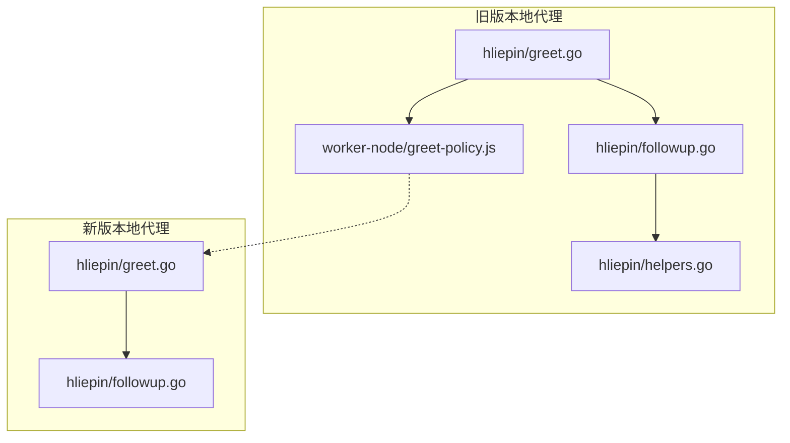
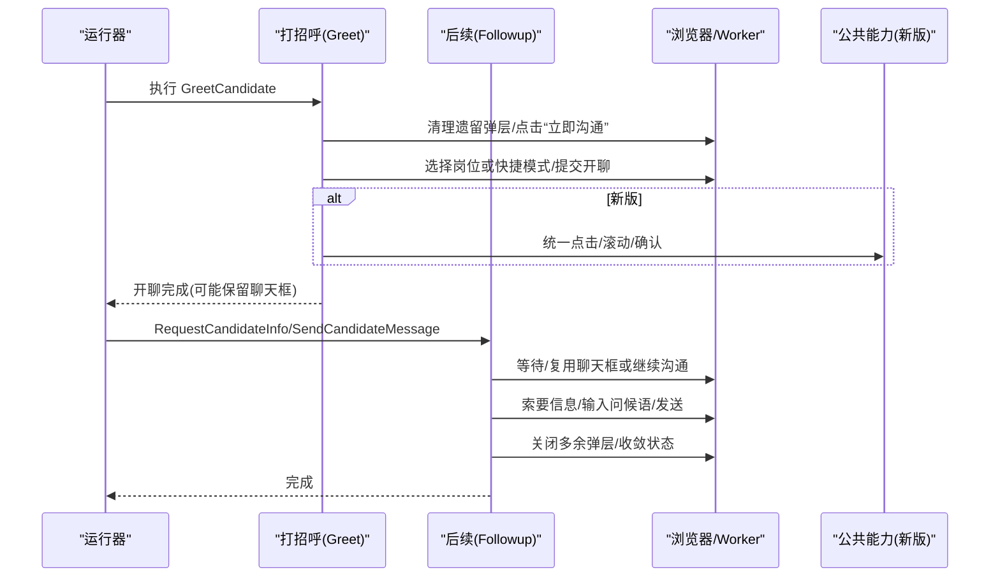
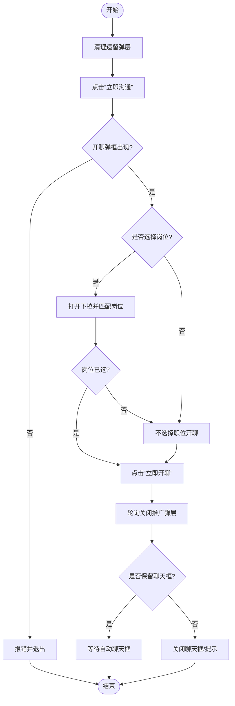
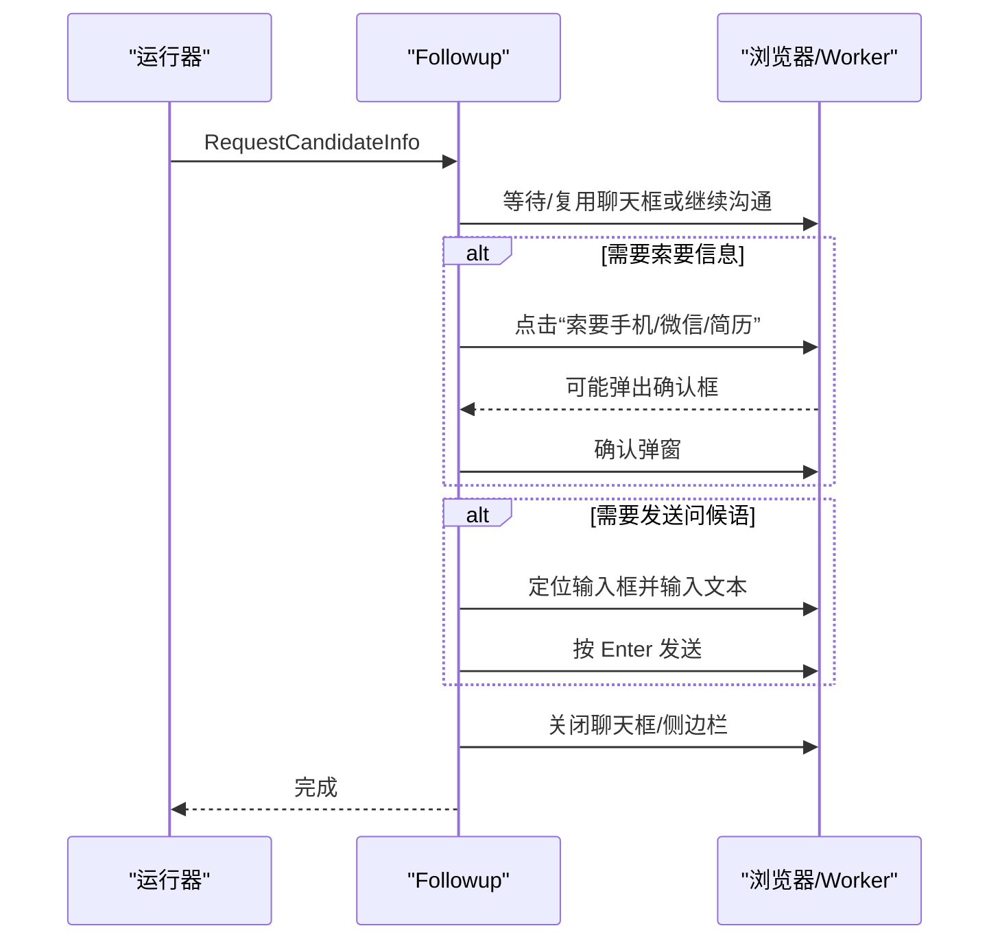
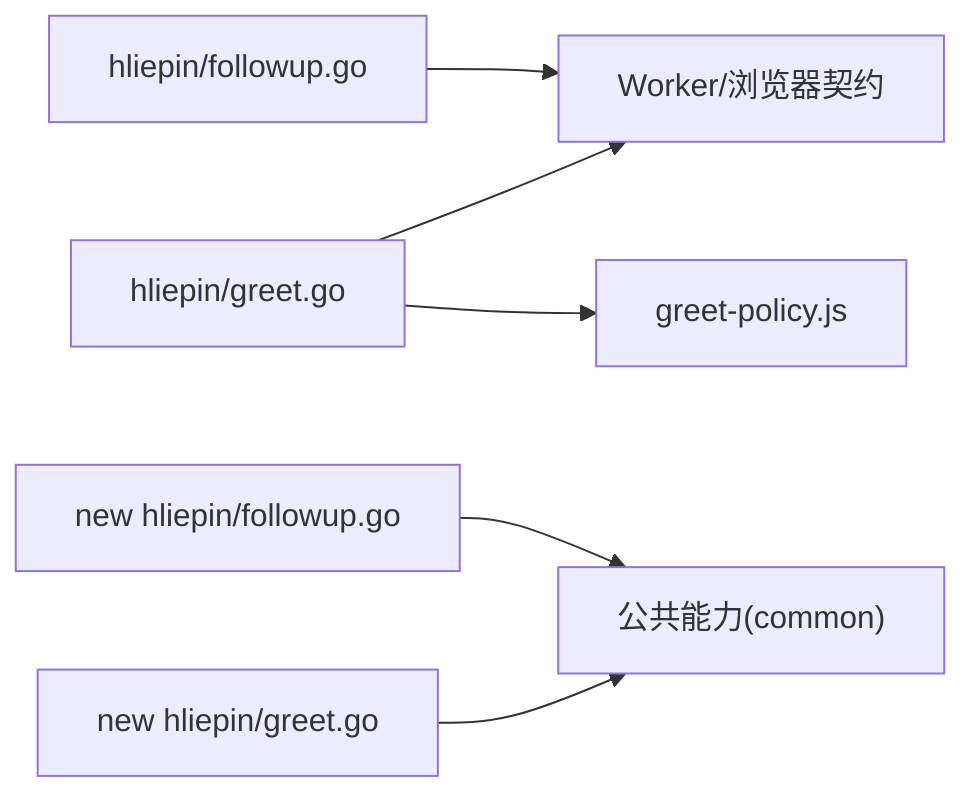

# 在线沟通

<cite>
**本文引用的文件**
- [greet.go](file://goodhr5/local-agent-go/internal/platforms/hliepin/greet.go)
- [followup.go](file://goodhr5/local-agent-go/internal/platforms/hliepin/followup.go)
- [helpers.go](file://goodhr5/local-agent-go/internal/platforms/hliepin/helpers.go)
- [greet-policy.js](file://goodhr5/local-agent-go/worker-node/src/greet-policy.js)
- [greet.go](file://goodhr5/local-agent-go-new/internal/platform/hliepin/greet.go)
- [followup.go](file://goodhr5/local-agent-go-new/internal/platform/hliepin/followup.go)
</cite>

## 目录
1. [简介](#简介)
2. [项目结构](#项目结构)
3. [核心组件](#核心组件)
4. [架构总览](#架构总览)
5. [详细组件分析](#详细组件分析)
6. [依赖关系分析](#依赖关系分析)
7. [性能与稳定性考虑](#性能与稳定性考虑)
8. [故障排查指南](#故障排查指南)
9. [结论](#结论)
10. [附录](#附录)

## 简介
本文件聚焦猎聘平台在线沟通能力的实现，覆盖聊天界面交互、消息发送机制、对话框处理策略、自动问候语生成与个性化定制、发送频率控制、聊天窗口定位、输入框操作、发送按钮点击、模板管理、发送状态跟踪与失败重试等关键主题。文档基于仓库中猎聘平台的本地代理实现（旧版与新架构两套）进行梳理，帮助读者理解从“开聊”到“索要信息/发消息”的完整流程，以及弹层清理、状态校验与异常恢复策略。

## 项目结构
围绕猎聘在线沟通能力，代码主要分布在以下位置：
- 旧版本地代理（Go + Worker Node）：
  - 平台运行时逻辑：internal/platforms/hliepin
  - Worker 端策略：worker-node/src
- 新版本地代理（Go 新架构）：
  - 平台运行时逻辑：internal/platform/hliepin
  - 公共能力封装：internal/platform/common（由调用方使用）

图表来源
- [greet.go:21-97](file://goodhr5/local-agent-go/internal/platforms/hliepin/greet.go#L21-L97)
- [followup.go:47-130](file://goodhr5/local-agent-go/internal/platforms/hliepin/followup.go#L47-L130)
- [helpers.go:112-160](file://goodhr5/local-agent-go/internal/platforms/hliepin/helpers.go#L112-L160)
- [greet-policy.js:1-13](file://goodhr5/local-agent-go/worker-node/src/greet-policy.js#L1-L13)
- [greet.go:18-80](file://goodhr5/local-agent-go-new/internal/platform/hliepin/greet.go#L18-L80)
- [followup.go:13-41](file://goodhr5/local-agent-go-new/internal/platform/hliepin/followup.go#L13-L41)

章节来源
- [greet.go:21-97](file://goodhr5/local-agent-go/internal/platforms/hliepin/greet.go#L21-L97)
- [followup.go:47-130](file://goodhr5/local-agent-go/internal/platforms/hliepin/followup.go#L47-L130)
- [greet-policy.js:1-13](file://goodhr5/local-agent-go/worker-node/src/greet-policy.js#L1-L13)
- [greet.go:18-80](file://goodhr5/local-agent-go-new/internal/platform/hliepin/greet.go#L18-L80)
- [followup.go:13-41](file://goodhr5/local-agent-go-new/internal/platform/hliepin/followup.go#L13-L41)

## 核心组件
- 打招呼入口与弹层处理
  - 旧版：GreetCandidate 负责清理遗留弹层、点击“立即沟通”、选择岗位或快捷模式、提交开聊、收尾关闭提示。
  - 新版：GreetCandidate 统一通过浏览器契约完成点击、选择岗位、确认提交，并处理开聊后推广弹层与对话收尾。
- 后续动作与消息发送
  - 旧版：RequestCandidateInfo 复用或打开聊天框，支持索要手机/微信/简历，输入并发送首次问候语；提供等待、确认、清理等辅助流程。
  - 新版：EnsureCandidateConversation / RequestCandidateInfo / SendCandidateMessage / CloseCandidateConversation 将具体交互委托给公共能力。
- 工具与策略
  - helpers.go：元素定位配置解析、数据转换、日志摘要等。
  - greet-policy.js：是否执行打招呼后续点击的策略开关。

章节来源
- [greet.go:21-97](file://goodhr5/local-agent-go/internal/platforms/hliepin/greet.go#L21-L97)
- [followup.go:47-130](file://goodhr5/local-agent-go/internal/platforms/hliepin/followup.go#L47-L130)
- [helpers.go:112-160](file://goodhr5/local-agent-go/internal/platforms/hliepin/helpers.go#L112-L160)
- [greet-policy.js:1-13](file://goodhr5/local-agent-go/worker-node/src/greet-policy.js#L1-L13)
- [greet.go:18-80](file://goodhr5/local-agent-go-new/internal/platform/hliepin/greet.go#L18-L80)
- [followup.go:13-41](file://goodhr5/local-agent-go-new/internal/platform/hliepin/followup.go#L13-L41)

## 架构总览
下图展示猎聘在线沟通的核心调用链：从“开聊”到“索要信息/发消息”，再到“弹层清理与状态收敛”。

图表来源
- [greet.go:21-97](file://goodhr5/local-agent-go/internal/platforms/hliepin/greet.go#L21-L97)
- [followup.go:47-130](file://goodhr5/local-agent-go/internal/platforms/hliepin/followup.go#L47-L130)
- [greet.go:18-80](file://goodhr5/local-agent-go-new/internal/platform/hliepin/greet.go#L18-L80)
- [followup.go:13-41](file://goodhr5/local-agent-go-new/internal/platform/hliepin/followup.go#L13-L41)

## 详细组件分析

### 打招呼流程（开聊）
- 旧版实现要点
  - 清理遗留弹层：在点击候选人前，检测并关闭“开聊弹框”、聊天框、联系人抽屉，避免串台。
  - 稳定点击：使用稳定点击封装，等待“立即沟通”出现并点击，随后等待开聊弹框渲染。
  - 岗位匹配：若启用发布职位匹配模式，则打开下拉列表，读取选项并匹配当前岗位；未匹配时走“不选择职位开聊”。
  - 提交开聊：点击“立即开聊”，并在需要时按两次 Esc 关闭提示。
  - 收尾策略：根据是否需要后续索要信息决定是否保留自动打开的聊天框。
- 新版实现要点
  - 统一浏览器契约：通过 Click/Scroll/FindAll/Poll 等接口完成点击、滚动、查找与验证。
  - 岗位选择增强：先滚动到目标项，再点击并校验是否已选中；若已选中直接返回成功。
  - 推广弹层处理：开聊后轮询检测并关闭相似候选人推广弹框，必要时用 Escape 兜底。
  - 对话收尾：根据是否选择岗位与是否保持对话开启，决定等待自动聊天框或主动关闭。

图表来源
- [greet.go:21-97](file://goodhr5/local-agent-go/internal/platforms/hliepin/greet.go#L21-L97)
- [greet.go:18-80](file://goodhr5/local-agent-go-new/internal/platform/hliepin/greet.go#L18-L80)

章节来源
- [greet.go:21-97](file://goodhr5/local-agent-go/internal/platforms/hliepin/greet.go#L21-L97)
- [greet.go:18-80](file://goodhr5/local-agent-go-new/internal/platform/hliepin/greet.go#L18-L80)

### 后续动作：索要信息与发送消息
- 旧版实现要点
  - 复用或打开聊天框：优先检测打招呼后是否已自动打开当前候选人的聊天框；否则点击“继续沟通”并等待聊天框就绪。
  - 索要信息：依次点击“索要手机/微信/简历”，如出现确认弹框则点击确定。
  - 发送问候语：定位输入框，输入问候语并按 Enter 发送。
  - 弹层清理：确保聊天框与联系人抽屉均关闭，连续多次检查直至页面干净。
- 新版实现要点
  - 统一委托：EnsureCandidateConversation / RequestCandidateInfo / SendCandidateMessage / CloseCandidateConversation 调用公共能力完成。
  - 标签页保护：在索要信息前后记录当前 URL，防止误开简历详情页影响主流程。

图表来源
- [followup.go:47-130](file://goodhr5/local-agent-go/internal/platforms/hliepin/followup.go#L47-L130)
- [followup.go:13-41](file://goodhr5/local-agent-go-new/internal/platform/hliepin/followup.go#L13-L41)

章节来源
- [followup.go:47-130](file://goodhr5/local-agent-go/internal/platforms/hliepin/followup.go#L47-L130)
- [followup.go:13-41](file://goodhr5/local-agent-go-new/internal/platform/hliepin/followup.go#L13-L41)

### 聊天窗口定位与输入框操作
- 聊天框定位
  - 旧版：通过固定选择器组合定位聊天容器、姓名、输入框与关闭按钮，轮询等待可见性并校验候选人姓名匹配。
  - 新版：通过公共能力统一等待与校验候选人对话面板。
- 输入框操作
  - 旧版：使用 Worker 的 type 接口向输入框写入文本，再按 Enter 发送。
  - 新版：委托公共能力完成输入与发送。

章节来源
- [followup.go:116-128](file://goodhr5/local-agent-go/internal/platforms/hliepin/followup.go#L116-L128)
- [followup.go:13-41](file://goodhr5/local-agent-go-new/internal/platform/hliepin/followup.go#L13-L41)

### 自动问候语生成与个性化定制
- 问候语来源
  - 旧版：由上层传入请求中的问候语文本，进入聊天框后直接输入并发送。
  - 新版：通过公共能力封装发送逻辑，上游负责准备问候语内容。
- 个性化定制
  - 岗位名称参与匹配：开聊岗位匹配时使用规范化后的岗位名，保证截断显示下的鲁棒匹配。
  - 候选人姓名匹配：对脱敏姓名做首字校验，避免串到其他候选人。
- 发送频率控制
  - 轮询与超时：多处采用轮询+延迟策略（如等待弹框、等待按钮渲染），避免过早判定失败。
  - 策略开关：打招呼后续点击策略由 greet-policy.js 控制，不同平台可差异化处理。

章节来源
- [followup.go:47-130](file://goodhr5/local-agent-go/internal/platforms/hliepin/followup.go#L47-L130)
- [greet.go:241-263](file://goodhr5/local-agent-go/internal/platforms/hliepin/greet.go#L241-L263)
- [greet-policy.js:1-13](file://goodhr5/local-agent-go/worker-node/src/greet-policy.js#L1-L13)

### 发送状态跟踪与失败重试
- 状态跟踪
  - 旧版：通过 inspectCandidateInfoPanels 实时统计聊天框与联系人抽屉数量及候选人姓名，用于判断是否串台、是否需清理。
  - 新版：公共能力内部维护状态，对外暴露简洁方法。
- 失败重试与兜底
  - 轮询重试：等待弹框、按钮渲染、推广弹层关闭等均采用有限次轮询与延时。
  - 兜底操作：当关闭按钮失效时，使用 Escape 键作为兜底；开聊后推广弹层也采用轮询+Escape 兜底。
  - 错误聚合：收尾阶段收集多个关闭操作的错误并合并返回，便于定位问题。

章节来源
- [followup.go:233-367](file://goodhr5/local-agent-go/internal/platforms/hliepin/followup.go#L233-L367)
- [greet.go:221-257](file://goodhr5/local-agent-go-new/internal/platform/hliepin/greet.go#L221-L257)

### 消息模板管理
- 模板位置
  - 问候语内容由上游传入，不在本文件中硬编码；岗位匹配与候选人匹配规则在本文件中实现。
- 模板扩展点
  - 可通过配置注入不同的岗位匹配策略与候选人姓名匹配策略，以适配不同业务场景。

章节来源
- [followup.go:47-130](file://goodhr5/local-agent-go/internal/platforms/hliepin/followup.go#L47-L130)
- [greet.go:241-263](file://goodhr5/local-agent-go/internal/platforms/hliepin/greet.go#L241-L263)

## 依赖关系分析
- 模块耦合
  - 打招呼与后续动作解耦：Greet 负责开聊，Followup 负责索要信息与发消息，两者通过状态与弹层约定协作。
  - 新旧架构差异：旧版更多内联实现，新版将通用交互下沉到公共能力，降低重复代码。
- 外部依赖
  - Worker/浏览器契约：通过 HTTP API 或浏览器对象进行页面操作（点击、输入、按键、滚动、查找）。
  - 策略文件：greet-policy.js 控制不同平台的后续行为。

图表来源
- [greet.go:21-97](file://goodhr5/local-agent-go/internal/platforms/hliepin/greet.go#L21-L97)
- [followup.go:47-130](file://goodhr5/local-agent-go/internal/platforms/hliepin/followup.go#L47-L130)
- [greet-policy.js:1-13](file://goodhr5/local-agent-go/worker-node/src/greet-policy.js#L1-L13)
- [greet.go:18-80](file://goodhr5/local-agent-go-new/internal/platform/hliepin/greet.go#L18-L80)
- [followup.go:13-41](file://goodhr5/local-agent-go-new/internal/platform/hliepin/followup.go#L13-L41)

章节来源
- [greet.go:21-97](file://goodhr5/local-agent-go/internal/platforms/hliepin/greet.go#L21-L97)
- [followup.go:47-130](file://goodhr5/local-agent-go/internal/platforms/hliepin/followup.go#L47-L130)
- [greet-policy.js:1-13](file://goodhr5/local-agent-go/worker-node/src/greet-policy.js#L1-L13)
- [greet.go:18-80](file://goodhr5/local-agent-go-new/internal/platform/hliepin/greet.go#L18-L80)
- [followup.go:13-41](file://goodhr5/local-agent-go-new/internal/platform/hliepin/followup.go#L13-L41)

## 性能与稳定性考虑
- 轮询与超时
  - 多处采用短间隔轮询（如 100ms、150ms、250ms）配合最大尝试次数，平衡响应速度与资源占用。
- 稳定点击与滚动
  - 使用稳定点击与滚动到可视区域，减少因页面布局变化导致的点击失败。
- 弹层收敛
  - 收尾阶段多次检查直到连续 N 次无弹层，确保页面状态稳定后再继续。
- 策略开关
  - 通过 greet-policy.js 对不同平台差异化处理，避免不必要的后续点击带来的性能损耗。

[本节为通用指导，不直接分析具体文件]

## 故障排查指南
- 常见问题定位
  - 开聊弹框未关闭：检查 closeGreetModalIfPresent/closeHliepinGreetModalIfPresent 的轮询与 Escape 兜底。
  - 岗位匹配失败：核对岗位名规范化与匹配逻辑，关注截断显示与大小写处理。
  - 聊天框串台：检查候选人姓名匹配与聊天框数量校验，避免跨候选人操作。
  - 发送失败：确认输入框选择器与 Enter 发送是否生效，查看 Worker 响应与错误信息。
- 建议步骤
  - 查看日志中的阶段标记（如“等待聊天框”“索要按钮就绪”“弹层收尾”），定位卡点。
  - 复现场景时抓取页面截图与控制台输出，结合选择器有效性验证。
  - 针对推广弹层与确认弹窗，确认轮询次数与兜底策略是否触发。

章节来源
- [followup.go:132-197](file://goodhr5/local-agent-go/internal/platforms/hliepin/followup.go#L132-L197)
- [followup.go:233-367](file://goodhr5/local-agent-go/internal/platforms/hliepin/followup.go#L233-L367)
- [greet.go:164-205](file://goodhr5/local-agent-go/internal/platforms/hliepin/greet.go#L164-L205)
- [greet.go:221-257](file://goodhr5/local-agent-go-new/internal/platform/hliepin/greet.go#L221-L257)

## 结论
猎聘在线沟通功能通过“开聊—索要信息—发消息—弹层清理”的闭环设计，实现了高鲁棒性的自动化交互。旧版实现注重细节与容错，新版通过公共能力抽象提升一致性与可维护性。建议在后续迭代中继续强化：
- 更细粒度的状态观测与指标上报
- 更灵活的模板与策略配置
- 更强的异常恢复与自愈能力

[本节为总结性内容，不直接分析具体文件]

## 附录
- 关键常量与选择器
  - 聊天容器、输入框、关闭按钮、候选人抽屉等选择器在 followup.go 中集中定义，便于统一维护。
- 工具函数
  - helpers.go 提供元素定位配置解析、数据转换与日志摘要，支撑多平台一致性实现。

章节来源
- [followup.go:15-32](file://goodhr5/local-agent-go/internal/platforms/hliepin/followup.go#L15-L32)
- [helpers.go:112-160](file://goodhr5/local-agent-go/internal/platforms/hliepin/helpers.go#L112-L160)