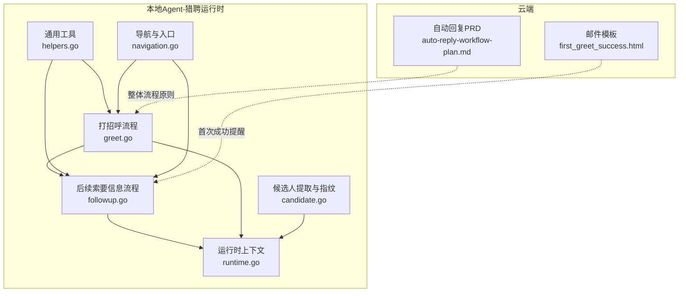
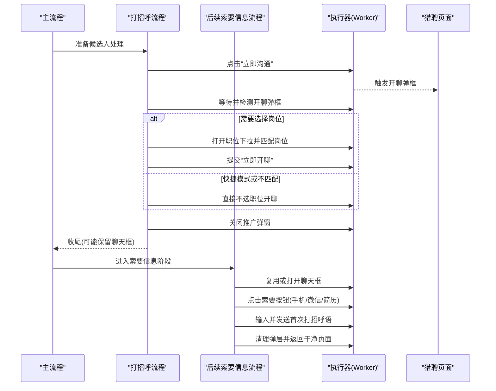
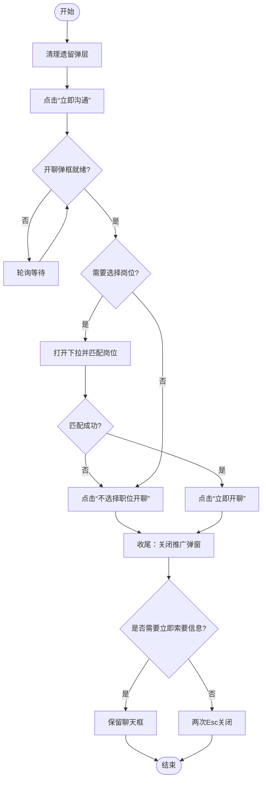
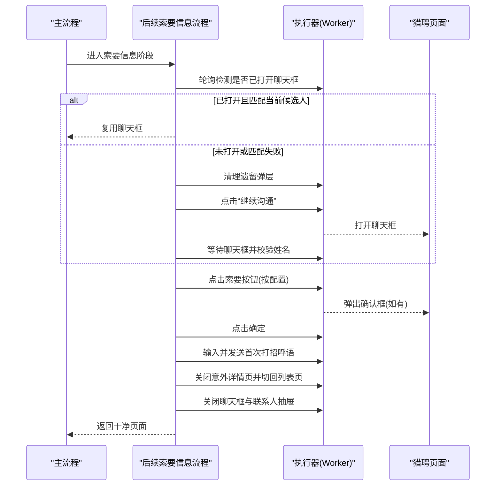
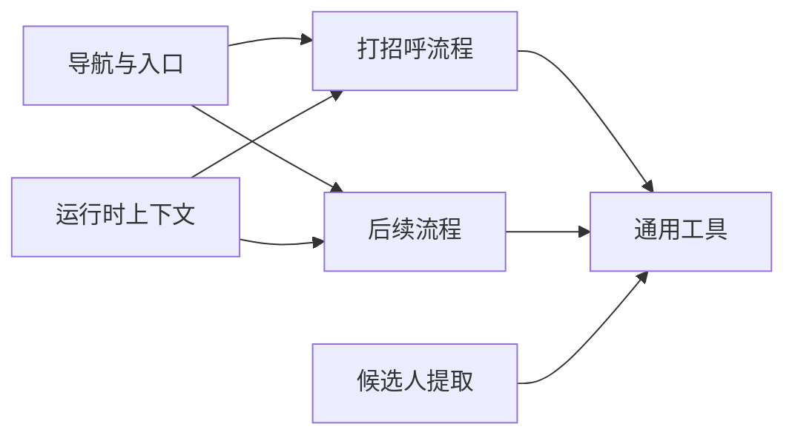

# 在线沟通

<cite>
**本文引用的文件**
- [greet.go](file://goodhr5/local-agent-go/internal/platforms/hliepin/greet.go)
- [followup.go](file://goodhr5/local-agent-go/internal/platforms/hliepin/followup.go)
- [runtime.go](file://goodhr5/local-agent-go/internal/platforms/hliepin/runtime.go)
- [candidate.go](file://goodhr5/local-agent-go/internal/platforms/hliepin/candidate.go)
- [helpers.go](file://goodhr5/local-agent-go/internal/platforms/hliepin/helpers.go)
- [navigation.go](file://goodhr5/local-agent-go/internal/platforms/hliepin/navigation.go)
- [auto-reply-workflow-plan.md](file://goodhr5/docs/auto-reply-workflow-plan.md)
- [first_greet_success.html](file://goodhr5/cloud/backend/templates/automatic_emails/first_greet_success.html)
</cite>

## 目录
1. [简介](#简介)
2. [项目结构](#项目结构)
3. [核心组件](#核心组件)
4. [架构总览](#架构总览)
5. [详细组件分析](#详细组件分析)
6. [依赖关系分析](#依赖关系分析)
7. [性能与稳定性](#性能与稳定性)
8. [故障排查指南](#故障排查指南)
9. [结论](#结论)
10. [附录](#附录)

## 简介
本文件聚焦猎聘平台在线沟通功能的自动化实现，覆盖聊天界面交互、消息发送机制、对话框处理策略、自动问候语生成与个性化定制、发送频率控制、聊天窗口定位、输入框操作、发送按钮点击、消息模板管理、发送状态跟踪与失败重试等。内容基于本地 Agent 对猎聘猎头端的浏览器自动化实现，并结合云端配置与通知能力进行说明。

## 项目结构
猎聘在线沟通相关代码主要位于本地 Agent 的“平台运行时”模块中，按平台维度组织：
- 平台运行时：负责与招聘网站页面交互（点击、输入、弹窗处理、等待稳定）。
- 通用工具：元素定位、数据解析、日志格式化等。
- 导航与入口：页面匹配、默认页选择、岗位名称规范化。
- 候选人列表：提取可见候选人、滚动翻页、去重指纹。
- 云端协作：通过执行器调用 Worker API，完成页面级动作；云端提供配置、模板、统计与提醒。

图表来源
- [greet.go:31-143](file://goodhr5/local-agent-go/internal/platforms/hliepin/greet.go#L31-L143)
- [followup.go:50-141](file://goodhr5/local-agent-go/internal/platforms/hliepin/followup.go#L50-L141)
- [runtime.go:10-19](file://goodhr5/local-agent-go/internal/platforms/hliepin/runtime.go#L10-L19)
- [candidate.go:14-79](file://goodhr5/local-agent-go/internal/platforms/hliepin/candidate.go#L14-L79)
- [helpers.go:75-99](file://goodhr5/local-agent-go/internal/platforms/hliepin/helpers.go#L75-L99)
- [navigation.go:7-33](file://goodhr5/local-agent-go/internal/platforms/hliepin/navigation.go#L7-L33)
- [first_greet_success.html:1-9](file://goodhr5/cloud/backend/templates/automatic_emails/first_greet_success.html#L1-L9)
- [auto-reply-workflow-plan.md:1-31](file://goodhr5/docs/auto-reply-workflow-plan.md#L1-L31)

章节来源
- [greet.go:31-143](file://goodhr5/local-agent-go/internal/platforms/hliepin/greet.go#L31-L143)
- [followup.go:50-141](file://goodhr5/local-agent-go/internal/platforms/hliepin/followup.go#L50-L141)
- [runtime.go:10-19](file://goodhr5/local-agent-go/internal/platforms/hliepin/runtime.go#L10-L19)
- [candidate.go:14-79](file://goodhr5/local-agent-go/internal/platforms/hliepin/candidate.go#L14-L79)
- [helpers.go:75-99](file://goodhr5/local-agent-go/internal/platforms/hliepin/helpers.go#L75-L99)
- [navigation.go:7-33](file://goodhr5/local-agent-go/internal/platforms/hliepin/navigation.go#L7-L33)
- [first_greet_success.html:1-9](file://goodhr5/cloud/backend/templates/automatic_emails/first_greet_success.html#L1-L9)
- [auto-reply-workflow-plan.md:1-31](file://goodhr5/docs/auto-reply-workflow-plan.md#L1-L31)

## 核心组件
- 打招呼流程：打开候选人行“立即沟通”，等待并处理开聊弹框，必要时选择岗位或跳过岗位，提交后关闭推广弹窗，收尾时根据是否需要立即索要信息决定是否保留聊天框。
- 后续索要信息流程：复用已打开的聊天框或重新打开，按配置索要手机/微信/简历，发送岗位首次打招呼语，最后清理弹层并返回干净页面。
- 运行时上下文：维护平台标识、当前岗位、是否必须选择岗位等运行态信息。
- 候选人提取：从列表中提取可见候选人，过滤无效项，计算去重指纹，支持滚动翻页。
- 通用工具：Worker 响应解析、字段读取、文本规范化、日志摘要等。
- 导航与入口：页面匹配规则、默认页选择、岗位名称规范化。

章节来源
- [greet.go:31-143](file://goodhr5/local-agent-go/internal/platforms/hliepin/greet.go#L31-L143)
- [followup.go:50-141](file://goodhr5/local-agent-go/internal/platforms/hliepin/followup.go#L50-L141)
- [runtime.go:10-19](file://goodhr5/local-agent-go/internal/platforms/hliepin/runtime.go#L10-L19)
- [candidate.go:14-79](file://goodhr5/local-agent-go/internal/platforms/hliepin/candidate.go#L14-L79)
- [helpers.go:75-99](file://goodhr5/local-agent-go/internal/platforms/hliepin/helpers.go#L75-L99)
- [navigation.go:7-33](file://goodhr5/local-agent-go/internal/platforms/hliepin/navigation.go#L7-L33)

## 架构总览
猎聘在线沟通采用“云端大脑 + 本地手脚”的架构：云端负责配置、模板、统计与提醒；本地 Agent 通过执行器调用 Worker API 完成页面级动作（查找元素、点击、输入、按键、滚动、截图等），并对弹窗、异步渲染、跨候选人串台等复杂场景做鲁棒处理。

图表来源
- [greet.go:31-143](file://goodhr5/local-agent-go/internal/platforms/hliepin/greet.go#L31-L143)
- [followup.go:50-141](file://goodhr5/local-agent-go/internal/platforms/hliepin/followup.go#L50-L141)

章节来源
- [greet.go:31-143](file://goodhr5/local-agent-go/internal/platforms/hliepin/greet.go#L31-L143)
- [followup.go:50-141](file://goodhr5/local-agent-go/internal/platforms/hliepin/followup.go#L50-L141)

## 详细组件分析

### 打招呼流程（猎聘）
- 入口：准备候选人处理，关闭遗留弹层，避免干扰。
- 交互：点击“立即沟通”，等待开聊弹框出现。
- 岗位选择：若需选择岗位则打开下拉并匹配当前岗位；未匹配或快捷模式则直接“不选择职位开聊”。
- 提交：点击“立即开聊”，等待弹框隐藏。
- 收尾：等待并关闭开聊后偶发的推广弹窗；如需立即索要信息则保留聊天框，否则两次 Esc 关闭。

图表来源
- [greet.go:31-143](file://goodhr5/local-agent-go/internal/platforms/hliepin/greet.go#L31-L143)
- [greet.go:145-179](file://goodhr5/local-agent-go/internal/platforms/hliepin/greet.go#L145-L179)
- [greet.go:181-195](file://goodhr5/local-agent-go/internal/platforms/hliepin/greet.go#L181-L195)
- [greet.go:241-251](file://goodhr5/local-agent-go/internal/platforms/hliepin/greet.go#L241-L251)
- [greet.go:297-334](file://goodhr5/local-agent-go/internal/platforms/hliepin/greet.go#L297-L334)

章节来源
- [greet.go:31-143](file://goodhr5/local-agent-go/internal/platforms/hliepin/greet.go#L31-L143)
- [greet.go:145-179](file://goodhr5/local-agent-go/internal/platforms/hliepin/greet.go#L145-L179)
- [greet.go:181-195](file://goodhr5/local-agent-go/internal/platforms/hliepin/greet.go#L181-L195)
- [greet.go:241-251](file://goodhr5/local-agent-go/internal/platforms/hliepin/greet.go#L241-L251)
- [greet.go:297-334](file://goodhr5/local-agent-go/internal/platforms/hliepin/greet.go#L297-L334)

### 后续索要信息与消息发送（猎聘）
- 复用判断：每100毫秒检查是否已自动打开当前候选人的聊天框，存在则复用，避免重复点击。
- 打开聊天框：若无复用则清理遗留弹层，点击“继续沟通”，等待聊天框确认且姓名匹配。
- 索要信息：按配置依次点击“索要手机/微信/简历”，如出现确认弹窗则点击确定。
- 发送问候语：向输入框写入岗位首次打招呼语并按 Enter 发送。
- 收尾：关闭意外打开的简历详情页并切回列表页；关闭聊天框与联系人抽屉，确保连续多次检测为干净状态。

图表来源
- [followup.go:50-141](file://goodhr5/local-agent-go/internal/platforms/hliepin/followup.go#L50-L141)
- [followup.go:143-175](file://goodhr5/local-agent-go/internal/platforms/hliepin/followup.go#L143-L175)
- [followup.go:177-208](file://goodhr5/local-agent-go/internal/platforms/hliepin/followup.go#L177-L208)
- [followup.go:210-242](file://goodhr5/local-agent-go/internal/platforms/hliepin/followup.go#L210-L242)
- [followup.go:244-298](file://goodhr5/local-agent-go/internal/platforms/hliepin/followup.go#L244-L298)
- [followup.go:320-397](file://goodhr5/local-agent-go/internal/platforms/hliepin/followup.go#L320-L397)

章节来源
- [followup.go:50-141](file://goodhr5/local-agent-go/internal/platforms/hliepin/followup.go#L50-L141)
- [followup.go:143-175](file://goodhr5/local-agent-go/internal/platforms/hliepin/followup.go#L143-L175)
- [followup.go:177-208](file://goodhr5/local-agent-go/internal/platforms/hliepin/followup.go#L177-L208)
- [followup.go:210-242](file://goodhr5/local-agent-go/internal/platforms/hliepin/followup.go#L210-L242)
- [followup.go:244-298](file://goodhr5/local-agent-go/internal/platforms/hliepin/followup.go#L244-L298)
- [followup.go:320-397](file://goodhr5/local-agent-go/internal/platforms/hliepin/followup.go#L320-L397)

### 聊天窗口定位与输入框操作
- 聊天框定位：通过父容器选择器与可见性检测，结合候选人姓名匹配，防止串到其他候选人。
- 输入框操作：使用执行器的“类型文本”接口向输入框写入消息，随后“按键”Enter 发送。
- 稳定点击：封装稳定点击逻辑，支持期望文本、嵌套选择器、等待隐藏等参数，提升抗抖动能力。

章节来源
- [followup.go:143-175](file://goodhr5/local-agent-go/internal/platforms/hliepin/followup.go#L143-L175)
- [followup.go:244-298](file://goodhr5/local-agent-go/internal/platforms/hliepin/followup.go#L244-L298)
- [helpers.go:75-99](file://goodhr5/local-agent-go/internal/platforms/hliepin/helpers.go#L75-L99)

### 自动问候语生成与个性化定制
- 生成来源：岗位首次打招呼语由云端配置或 AI 生成后下发至本地流程，作为 CandidateInfoRequest 的一部分传入。
- 个性化定制：可通过岗位配置、候选人字段（如姓名、年龄、筛选文本）在云端组装问候语模板，再下发到本地执行。
- 发送时机：在确认聊天框就绪后，将问候语写入输入框并按 Enter 发送。

章节来源
- [followup.go:50-141](file://goodhr5/local-agent-go/internal/platforms/hliepin/followup.go#L50-L141)
- [auto-reply-workflow-plan.md:1-31](file://goodhr5/docs/auto-reply-workflow-plan.md#L1-L31)

### 发送频率控制与失败重试
- 频率控制：云端数据库包含每日打招呼计数与免费额度限制等配置，用于控制发送频率与上限。
- 失败重试：本地流程对关键步骤设置轮询与超时（如等待弹窗、等待按钮渲染、等待聊天框打开），并在异常时记录错误；云端侧可结合邮件模板进行首次成功提醒与后续跟进。

章节来源
- [first_greet_success.html:1-9](file://goodhr5/cloud/backend/templates/automatic_emails/first_greet_success.html#L1-L9)
- [followup.go:177-208](file://goodhr5/local-agent-go/internal/platforms/hliepin/followup.go#L177-L208)
- [followup.go:244-298](file://goodhr5/local-agent-go/internal/platforms/hliepin/followup.go#L244-L298)

### 消息模板管理与通知
- 模板位置：云端模板目录包含自动邮件模板，例如“首次打招呼尚未成功时的帮助邮件”。
- 通知触发：当首次打招呼未成功时，系统可发送邮件提示用户检查筛选门槛、平台额度与登录状态，并提供查看岗位运行结果的链接。

章节来源
- [first_greet_success.html:1-9](file://goodhr5/cloud/backend/templates/automatic_emails/first_greet_success.html#L1-L9)

## 依赖关系分析
- 平台运行时依赖执行器（Worker）提供的页面级能力，所有 DOM 操作均通过统一 API 完成。
- 打招呼与后续流程共享通用工具函数，保证元素定位、数据解析的一致性。
- 候选人提取与去重指纹影响后续流程的准确性，避免重复处理与串台。
- 导航与入口配置决定页面匹配与默认页选择，影响流程起点。

图表来源
- [greet.go:31-143](file://goodhr5/local-agent-go/internal/platforms/hliepin/greet.go#L31-L143)
- [followup.go:50-141](file://goodhr5/local-agent-go/internal/platforms/hliepin/followup.go#L50-L141)
- [candidate.go:14-79](file://goodhr5/local-agent-go/internal/platforms/hliepin/candidate.go#L14-L79)
- [helpers.go:75-99](file://goodhr5/local-agent-go/internal/platforms/hliepin/helpers.go#L75-L99)
- [navigation.go:7-33](file://goodhr5/local-agent-go/internal/platforms/hliepin/navigation.go#L7-L33)
- [runtime.go:10-19](file://goodhr5/local-agent-go/internal/platforms/hliepin/runtime.go#L10-L19)

章节来源
- [greet.go:31-143](file://goodhr5/local-agent-go/internal/platforms/hliepin/greet.go#L31-L143)
- [followup.go:50-141](file://goodhr5/local-agent-go/internal/platforms/hliepin/followup.go#L50-L141)
- [candidate.go:14-79](file://goodhr5/local-agent-go/internal/platforms/hliepin/candidate.go#L14-L79)
- [helpers.go:75-99](file://goodhr5/local-agent-go/internal/platforms/hliepin/helpers.go#L75-L99)
- [navigation.go:7-33](file://goodhr5/local-agent-go/internal/platforms/hliepin/navigation.go#L7-L33)
- [runtime.go:10-19](file://goodhr5/local-agent-go/internal/platforms/hliepin/runtime.go#L10-L19)

## 性能与稳定性
- 轮询与超时：对弹窗出现、按钮渲染、聊天框打开等异步场景采用短间隔轮询与明确超时，避免固定延迟导致的时序问题。
- 稳定点击：封装稳定点击逻辑，支持期望文本、嵌套选择器、等待隐藏等，降低 UI 抖动影响。
- 防串台：通过聊天框数量检测与候选人姓名匹配，避免跨候选人误操作。
- 收尾保障：连续多次检测弹层状态，确保页面恢复干净后再继续主流程。

[本节为通用指导，无需特定文件引用]

## 故障排查指南
- 开聊弹框未出现：检查“立即沟通”点击是否成功，确认轮询等待是否超时，查看日志中的等待与错误信息。
- 岗位未匹配：核对当前岗位名称与下拉选项的匹配逻辑，确认岗位列表是否加载完成。
- 聊天框串台：检查聊天框数量与候选人姓名匹配结果，确保只处理当前候选人的聊天框。
- 索要按钮缺失：等待异步渲染完成，确认按钮可见性，必要时延长等待时间。
- 发送失败：检查输入框选择器是否正确，确认 Enter 按键是否生效，查看执行器返回的错误信息。
- 首次打招呼未成功：参考云端邮件模板提示，检查筛选门槛、平台额度与登录状态，查看最近发送失败日志。

章节来源
- [greet.go:181-195](file://goodhr5/local-agent-go/internal/platforms/hliepin/greet.go#L181-L195)
- [greet.go:241-251](file://goodhr5/local-agent-go/internal/platforms/hliepin/greet.go#L241-L251)
- [followup.go:177-208](file://goodhr5/local-agent-go/internal/platforms/hliepin/followup.go#L177-L208)
- [followup.go:244-298](file://goodhr5/local-agent-go/internal/platforms/hliepin/followup.go#L244-L298)
- [first_greet_success.html:1-9](file://goodhr5/cloud/backend/templates/automatic_emails/first_greet_success.html#L1-L9)

## 结论
猎聘在线沟通功能通过本地 Agent 对页面进行精细化交互，结合云端配置与模板，实现了稳定的打招呼、索要信息与消息发送流程。其核心在于对弹窗与异步渲染的鲁棒处理、防串台的严格校验、以及完善的收尾保障。配合云端频率控制与通知机制，可在大规模自动化场景中保持高可用性与可观测性。

[本节为总结，无需特定文件引用]

## 附录
- 自动回复工作流原则：云端是大脑，本地是手脚；默认发送方式为 AI 生成后直接发送；通知对象为岗位创建人。
- 首次打招呼未成功时的帮助邮件模板：提供操作步骤与查看岗位运行结果的链接。

章节来源
- [auto-reply-workflow-plan.md:1-31](file://goodhr5/docs/auto-reply-workflow-plan.md#L1-L31)
- [first_greet_success.html:1-9](file://goodhr5/cloud/backend/templates/automatic_emails/first_greet_success.html#L1-L9)