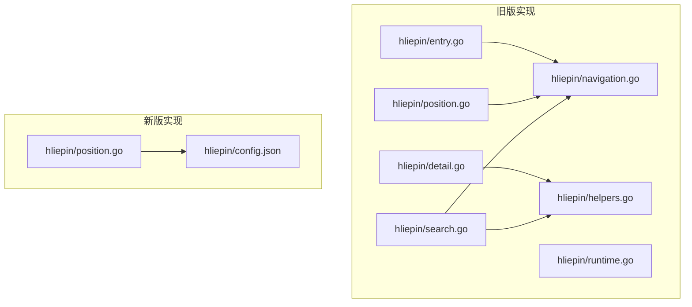
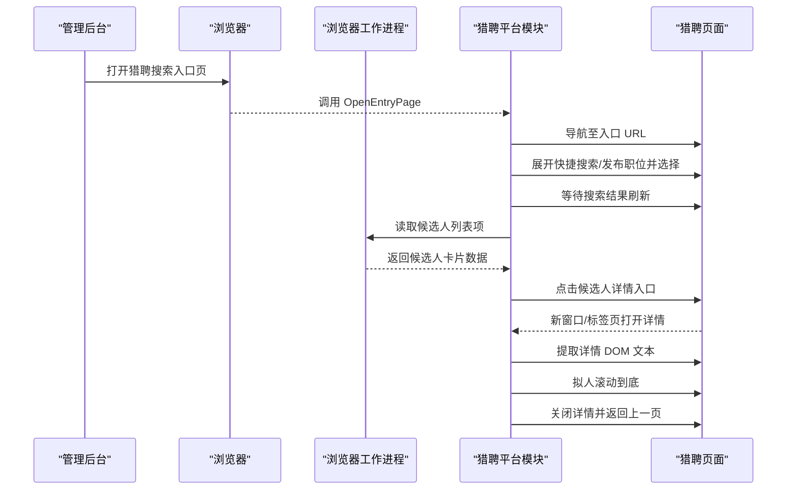
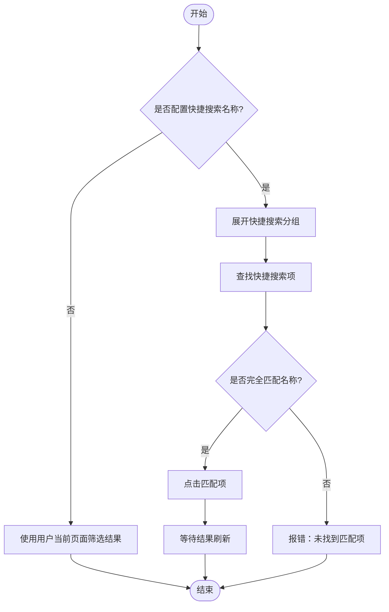
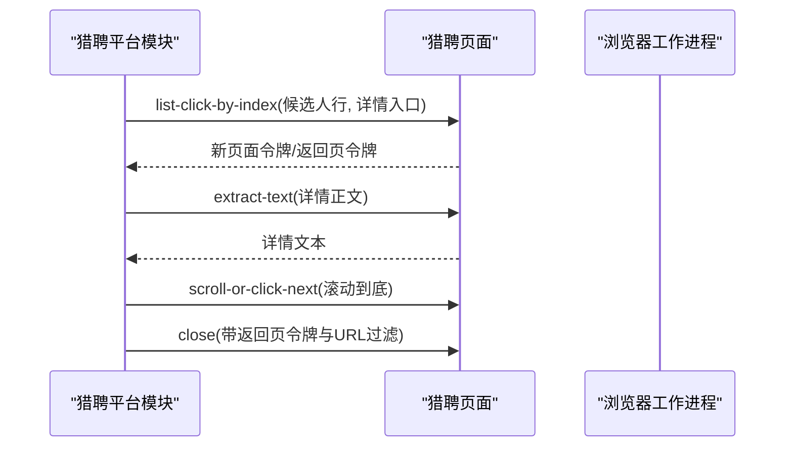
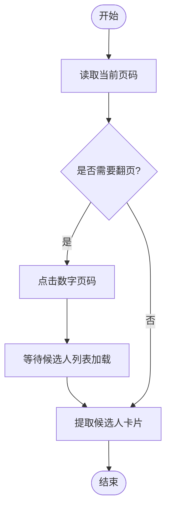
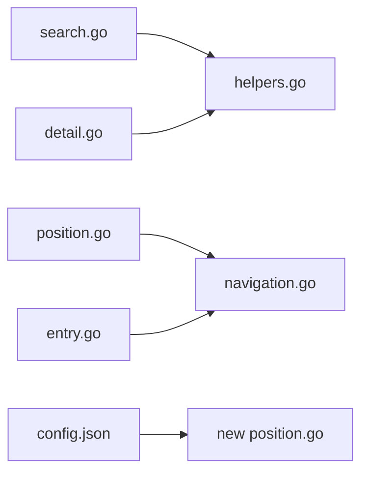

# 搜索功能

<cite>
**本文引用的文件**
- [search.go](file://goodhr5/local-agent-go/internal/platforms/hliepin/search.go)
- [position.go](file://goodhr5/local-agent-go/internal/platforms/hliepin/position.go)
- [navigation.go](file://goodhr5/local-agent-go/internal/platforms/hliepin/navigation.go)
- [detail.go](file://goodhr5/local-agent-go/internal/platforms/hliepin/detail.go)
- [entry.go](file://goodhr5/local-agent-go/internal/platforms/hliepin/entry.go)
- [helpers.go](file://goodhr5/local-agent-go/internal/platforms/hliepin/helpers.go)
- [runtime.go](file://goodhr5/local-agent-go/internal/platforms/hliepin/runtime.go)
- [config.json](file://goodhr5/local-agent-go-new/internal/platform/hliepin/config.json)
- [position.go](file://goodhr5/local-agent-go-new/internal/platform/hliepin/position.go)
</cite>

## 目录
1. [简介](#简介)
2. [项目结构](#项目结构)
3. [核心组件](#核心组件)
4. [架构总览](#架构总览)
5. [详细组件分析](#详细组件分析)
6. [依赖关系分析](#依赖关系分析)
7. [性能与缓存](#性能与缓存)
8. [故障排查指南](#故障排查指南)
9. [结论](#结论)
10. [附录](#附录)

## 简介
本文件聚焦猎聘平台搜索功能的实现与运行机制，覆盖以下方面：
- 搜索入口与页面初始化、URL 参数构建与跳转策略
- 搜索条件编码与快捷搜索匹配逻辑
- 候选人列表解析、详情页读取与关闭流程
- 分页数据获取机制（数字页码翻页）
- 搜索历史、常用筛选与智能建议的当前实现边界
- 性能优化、缓存策略与错误恢复机制

说明：仓库中猎聘搜索能力主要由本地 Agent 的“猎聘猎头端”平台模块驱动。前端仅负责打开浏览器并导航到平台页面，具体搜索交互由后端 Go 代码通过浏览器自动化完成。

## 项目结构
猎聘搜索相关代码主要位于本地 Agent 的猎聘平台实现目录中，分为旧版与新两套实现：
- 旧版：local-agent-go/internal/platforms/hliepin/*
- 新版：local-agent-go-new/internal/platform/hliepin/*

图表来源
- [search.go:1-247](file://goodhr5/local-agent-go/internal/platforms/hliepin/search.go#L1-L247)
- [position.go:1-41](file://goodhr5/local-agent-go/internal/platforms/hliepin/position.go#L1-L41)
- [detail.go:1-96](file://goodhr5/local-agent-go/internal/platforms/hliepin/detail.go#L1-L96)
- [entry.go:1-45](file://goodhr5/local-agent-go/internal/platforms/hliepin/entry.go#L1-L45)
- [navigation.go:1-140](file://goodhr5/local-agent-go/internal/platforms/hliepin/navigation.go#L1-L140)
- [helpers.go:1-207](file://goodhr5/local-agent-go/internal/platforms/hliepin/helpers.go#L1-L207)
- [runtime.go:1-51](file://goodhr5/local-agent-go/internal/platforms/hliepin/runtime.go#L1-L51)
- [config.json:1-736](file://goodhr5/local-agent-go-new/internal/platform/hliepin/config.json#L1-L736)
- [position.go:1-69](file://goodhr5/local-agent-go-new/internal/platform/hliepin/position.go#L1-L69)

章节来源
- [search.go:1-247](file://goodhr5/local-agent-go/internal/platforms/hliepin/search.go#L1-L247)
- [config.json:1-736](file://goodhr5/local-agent-go-new/internal/platform/hliepin/config.json#L1-L736)

## 核心组件
- 搜索准备与快捷选择：负责在猎聘搜索页展开并选择“快捷搜索”或“正在发布的职位”，并等待结果刷新。
- 岗位上下文与跳过策略：决定是否跳过页面岗位切换，以及从配置或运行时状态读取当前岗位名称。
- 详情页处理：打开候选人详情、提取 DOM 文本、拟人化滚动到底、关闭详情并返回上一页。
- 页面导航与匹配：判断当前页面是否仍为入口页、按 URL 前缀/包含/精确匹配入口。
- 通用工具：Worker 响应解析、元素定位载荷转换、字段读取与日志摘要等。
- 新版配置驱动：以 JSON 配置定义选择器、行为开关、候选字段与分页模式。

章节来源
- [search.go:22-123](file://goodhr5/local-agent-go/internal/platforms/hliepin/search.go#L22-L123)
- [position.go:11-40](file://goodhr5/local-agent-go/internal/platforms/hliepin/position.go#L11-L40)
- [detail.go:14-96](file://goodhr5/local-agent-go/internal/platforms/hliepin/detail.go#L14-L96)
- [navigation.go:6-65](file://goodhr5/local-agent-go/internal/platforms/hliepin/navigation.go#L6-L65)
- [helpers.go:75-160](file://goodhr5/local-agent-go/internal/platforms/hliepin/helpers.go#L75-L160)
- [config.json:39-62](file://goodhr5/local-agent-go-new/internal/platform/hliepin/config.json#L39-L62)

## 架构总览
猎聘搜索的整体流程由前端触发打开平台页面，再由本地 Agent 的猎聘平台模块执行页面操作与数据抓取。

图表来源
- [entry.go:12-26](file://goodhr5/local-agent-go/internal/platforms/hliepin/entry.go#L12-L26)
- [search.go:56-123](file://goodhr5/local-agent-go/internal/platforms/hliepin/search.go#L56-L123)
- [detail.go:14-96](file://goodhr5/local-agent-go/internal/platforms/hliepin/detail.go#L14-L96)

## 详细组件分析

### 搜索准备与快捷搜索匹配
- 入口准备：PreparePositionSearch 会保留岗位上下文，默认不再自动改变用户手动设置的搜索和筛选条件；若配置了快捷搜索名称，则尝试展开并完整匹配选择。
- 快捷搜索匹配：selectShortcutSearch 先尝试展开快捷搜索分组，再查找可见项并按配置名称进行完全一致匹配，找到后点击并等待结果刷新。
- 发布职位匹配：selectPublishedPosition 展开“正在发布的职位”，按岗位运行名称进行规范化比较（去除空格、标点、省略号），优先完整匹配，其次取前六个字符前缀匹配。
- 隐藏筛选：ensureHiddenCandidateFilters 支持勾选“隐藏已查看/已沟通/已获取联系方式”，但当前版本默认停用自动勾选，交由用户手动设置。

图表来源
- [search.go:22-123](file://goodhr5/local-agent-go/internal/platforms/hliepin/search.go#L22-L123)
- [search.go:146-183](file://goodhr5/local-agent-go/internal/platforms/hliepin/search.go#L146-L183)

章节来源
- [search.go:22-123](file://goodhr5/local-agent-go/internal/platforms/hliepin/search.go#L22-L123)
- [search.go:146-183](file://goodhr5/local-agent-go/internal/platforms/hliepin/search.go#L146-L183)

### 岗位上下文与跳过策略
- ShouldSkipPositionSelection：猎聘猎头端跳过页面岗位选择，因为候选人范围已由岗位配置中的搜索关键词限定。
- CurrentPositionName：优先使用运行时保存的岗位名称；否则从页面配置的选择器中提取当前岗位文本并规范化。
- SelectPosition：统一接口保留，但猎聘猎头端不执行页面岗位切换。

章节来源
- [position.go:11-40](file://goodhr5/local-agent-go/internal/platforms/hliepin/position.go#L11-L40)
- [navigation.go:67-71](file://goodhr5/local-agent-go/internal/platforms/hliepin/navigation.go#L67-L71)

### 详情页读取与关闭
- FetchCandidateDetail：仅支持 DOM 模式；根据候选人卡片索引点击详情目标，等待新页面打开，提取正文文本。
- ScrollCandidateDetail：拟人化滚动，随机时长将详情页滚动到底部，确保内容加载完整。
- CloseCandidateDetail：通过页面令牌与 URL 片段匹配关闭详情并返回上一页。
- CleanCandidateDetailText：清理平台附加内容，返回干净文本。

图表来源
- [detail.go:14-96](file://goodhr5/local-agent-go/internal/platforms/hliepin/detail.go#L14-L96)

章节来源
- [detail.go:14-96](file://goodhr5/local-agent-go/internal/platforms/hliepin/detail.go#L14-L96)

### 页面导航与入口匹配
- OpenEntryPage：校验入口 URL 并导航。
- PrepareEntryPage：搜索会刷新候选人条件，岗位选择和隐藏筛选统一在搜索完成后执行，因此入口页无需额外动作。
- IsPositionEntryPage：列出当前页面，判断是否仍为入口页（支持前缀/包含/精确匹配）。

章节来源
- [entry.go:12-45](file://goodhr5/local-agent-go/internal/platforms/hliepin/entry.go#L12-L45)
- [navigation.go:6-65](file://goodhr5/local-agent-go/internal/platforms/hliepin/navigation.go#L6-L65)

### 分页数据获取机制
- 新版配置：behavior.supports_paging=true，candidate_list_mode=number_page，表示通过数字页码翻页。
- 选择器：candidate.page_number 用于点击非激活页码；candidate.current_page 用于读取当前激活页码。
- 位置选择后继续翻页：SelectPosition 读取当前页码，若大于 0，则将 nextCandidatePage 设置为下一页，便于复用窗口继续扫描。

图表来源
- [config.json:39-62](file://goodhr5/local-agent-go-new/internal/platform/hliepin/config.json#L39-L62)
- [config.json:370-395](file://goodhr5/local-agent-go-new/internal/platform/hliepin/config.json#L370-L395)
- [position.go:52-62](file://goodhr5/local-agent-go-new/internal/platform/hliepin/position.go#L52-L62)

章节来源
- [config.json:39-62](file://goodhr5/local-agent-go-new/internal/platform/hliepin/config.json#L39-L62)
- [config.json:370-395](file://goodhr5/local-agent-go-new/internal/platform/hliepin/config.json#L370-L395)
- [position.go:52-62](file://goodhr5/local-agent-go-new/internal/platform/hliepin/position.go#L52-L62)

### 关键词匹配算法与排序策略
- 关键词匹配：快捷搜索采用“完整一致匹配”；发布职位采用“规范化+前缀匹配”（去除空格、标点、省略号，必要时取前六个字符前缀）。
- 排序策略：代码未实现自定义排序；候选人列表顺序由猎聘平台自身决定，系统按页面返回顺序读取。

章节来源
- [search.go:185-223](file://goodhr5/local-agent-go/internal/platforms/hliepin/search.go#L185-L223)

### 搜索历史、常用条件与智能建议
- 搜索历史：未发现维护搜索历史的代码；流程依赖用户手动准备页面状态或岗位配置中的快捷搜索名称。
- 常用搜索条件：filter_actions 为空，默认不自动改变用户手动设置的搜索和隐藏条件；如需扩展，可在配置中添加动作。
- 智能搜索建议：未发现服务端或前端提供的智能建议实现；当前依赖配置驱动的快捷搜索名称。

章节来源
- [config.json:54-62](file://goodhr5/local-agent-go-new/internal/platform/hliepin/config.json#L54-L62)

## 依赖关系分析
猎聘平台模块依赖浏览器工作进程的 HTTP API 进行页面操作与数据提取，并通过配置选择器定位页面元素。

图表来源
- [search.go:1-247](file://goodhr5/local-agent-go/internal/platforms/hliepin/search.go#L1-L247)
- [helpers.go:1-207](file://goodhr5/local-agent-go/internal/platforms/hliepin/helpers.go#L1-L207)
- [navigation.go:1-140](file://goodhr5/local-agent-go/internal/platforms/hliepin/navigation.go#L1-L140)
- [detail.go:1-96](file://goodhr5/local-agent-go/internal/platforms/hliepin/detail.go#L1-L96)
- [entry.go:1-45](file://goodhr5/local-agent-go/internal/platforms/hliepin/entry.go#L1-L45)
- [config.json:1-736](file://goodhr5/local-agent-go-new/internal/platform/hliepin/config.json#L1-L736)
- [position.go:1-69](file://goodhr5/local-agent-go-new/internal/platform/hliepin/position.go#L1-L69)

章节来源
- [search.go:1-247](file://goodhr5/local-agent-go/internal/platforms/hliepin/search.go#L1-L247)
- [helpers.go:1-207](file://goodhr5/local-agent-go/internal/platforms/hliepin/helpers.go#L1-L207)
- [navigation.go:1-140](file://goodhr5/local-agent-go/internal/platforms/hliepin/navigation.go#L1-L140)
- [detail.go:1-96](file://goodhr5/local-agent-go/internal/platforms/hliepin/detail.go#L1-L96)
- [entry.go:1-45](file://goodhr5/local-agent-go/internal/platforms/hliepin/entry.go#L1-L45)
- [config.json:1-736](file://goodhr5/local-agent-go-new/internal/platform/hliepin/config.json#L1-L736)
- [position.go:1-69](file://goodhr5/local-agent-go-new/internal/platform/hliepin/position.go#L1-L69)

## 性能与缓存
- 滚动与等待：详情页滚动采用随机时长拟人化，减少被检测风险；搜索与详情页操作均设置超时与等待时间，避免长时间阻塞。
- 选择器与重试：元素定位支持父级层级、目标类名、查找次数与间隔等参数，提升稳定性；详情页打开与关闭使用页面令牌与 URL 片段过滤，降低误判。
- 分页效率：通过数字页码翻页，避免依赖“下一页”按钮；读取当前页码后可从下一页继续，提高复用窗口的效率。
- 缓存策略：未发现显式缓存层；建议在 Worker 层对频繁读取的 DOM 片段做短期内存缓存，或在平台配置中增加可复用的选择器组以减少重复查找。

[本节提供通用指导，不直接分析具体文件]

## 故障排查指南
- 未找到快捷搜索项：检查是否成功展开快捷搜索分组；确认配置名称与页面项完全一致；查看错误日志中列出的当前快捷搜索项集合。
- 未找到发布职位：确认岗位名称规范化后的匹配逻辑；若页面标题被截断，系统将尝试前缀匹配；如仍失败，检查当前页面是否存在该职位。
- 详情页无法打开：确认候选人行索引正确；检查详情入口选择器是否命中；查看新页面令牌与返回页令牌是否正确传递。
- 详情页未读取到文本：确认详情正文选择器有效；必要时调整超时与等待时间；检查页面是否加载完整。
- 关闭详情失败：确认页面令牌与 URL 过滤条件；必要时延长超时；检查是否出现推广弹框干扰。

章节来源
- [search.go:56-123](file://goodhr5/local-agent-go/internal/platforms/hliepin/search.go#L56-L123)
- [search.go:185-223](file://goodhr5/local-agent-go/internal/platforms/hliepin/search.go#L185-L223)
- [detail.go:14-96](file://goodhr5/local-agent-go/internal/platforms/hliepin/detail.go#L14-L96)

## 结论
猎聘搜索功能在当前仓库中以“用户手动准备页面 + 配置驱动快捷搜索”的方式实现，重点在于稳定地选择快捷搜索或发布职位、读取候选人列表与详情、并进行拟人化滚动与翻页。系统未内置搜索历史与智能建议，也未实现自定义排序；性能与稳定性主要通过选择器配置、超时与等待策略保障。后续可扩展 filter_actions 以实现常用筛选自动化，并在 Worker 层引入缓存以提升性能。

[本节总结性内容，不直接分析具体文件]

## 附录
- URL 参数构建：当前实现通过 OpenEntryPage 直接导航至配置的入口 URL；未在代码中发现动态拼接查询参数的逻辑。
- 搜索条件编码：快捷搜索名称作为配置项传入，页面侧通过选择器进行文本匹配；发布职位名称经规范化后匹配。
- 结果页解析：候选人卡片字段通过 candidate_fields 配置读取；详情页文本通过 extract-text 提取。
- 错误恢复：所有关键操作均设置超时与验证条件；失败时返回明确错误信息，便于定位问题。

[本节为补充说明，不直接分析具体文件]