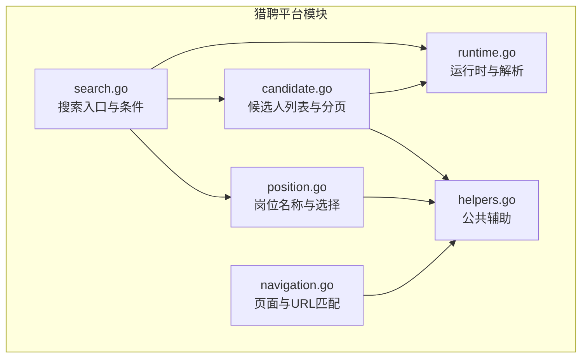
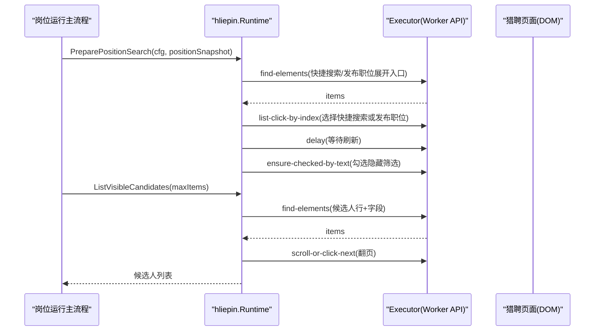
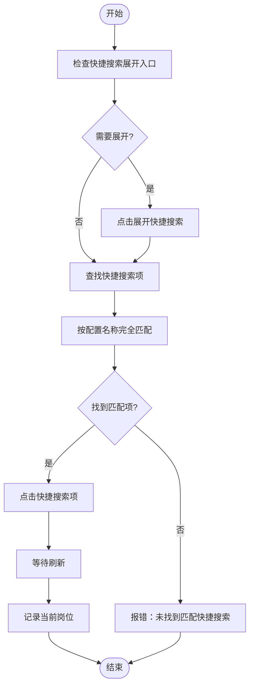
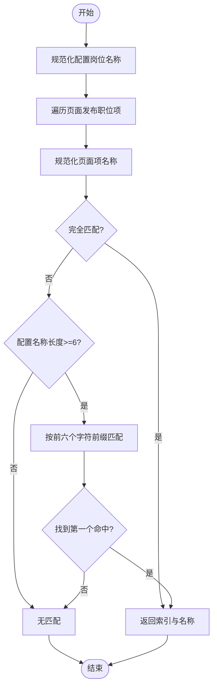
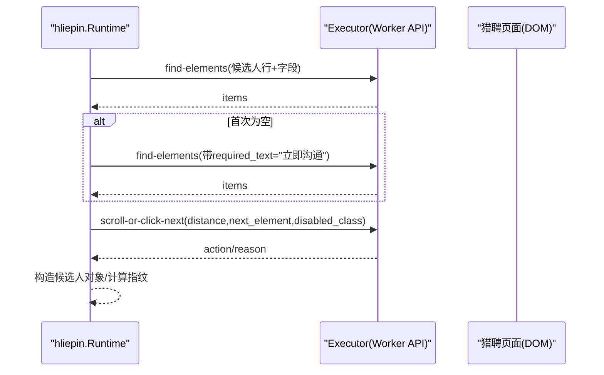
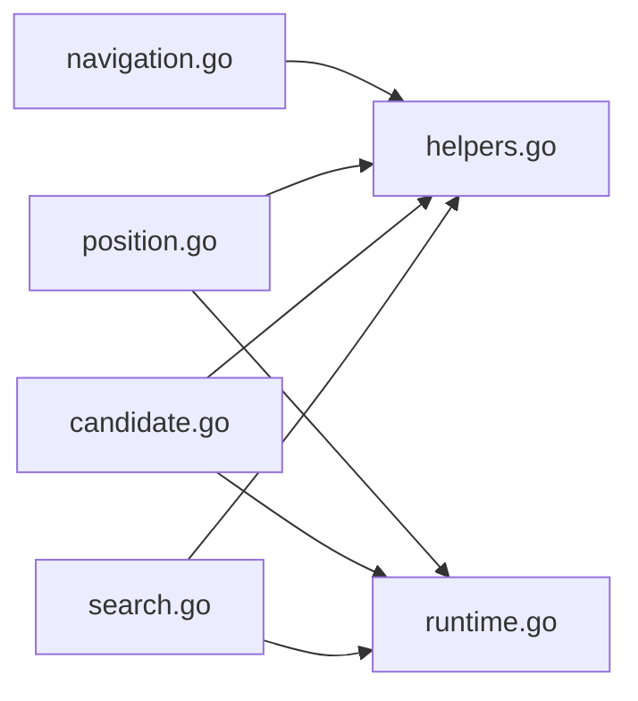

# 搜索功能

<cite>
**本文引用的文件**   
- [search.go](file://goodhr5/local-agent-go/internal/platforms/hliepin/search.go)
- [candidate.go](file://goodhr5/local-agent-go/internal/platforms/hliepin/candidate.go)
- [position.go](file://goodhr5/local-agent-go/internal/platforms/hliepin/position.go)
- [runtime.go](file://goodhr5/local-agent-go/internal/platforms/hliepin/runtime.go)
- [navigation.go](file://goodhr5/local-agent-go/internal/platforms/hliepin/navigation.go)
- [helpers.go](file://goodhr5/local-agent-go/internal/platforms/hliepin/helpers.go)
</cite>

## 目录
1. [引言](#引言)
2. [项目结构](#项目结构)
3. [核心组件](#核心组件)
4. [架构总览](#架构总览)
5. [详细组件分析](#详细组件分析)
6. [依赖关系分析](#依赖关系分析)
7. [性能与缓存策略](#性能与缓存策略)
8. [错误恢复与排障](#错误恢复与排障)
9. [结论](#结论)

## 引言
本文面向猎聘平台搜索功能的实现，聚焦本地 Agent 侧对猎聘猎头端页面的自动化操作。文档覆盖以下目标：
- 搜索入口与条件设置：快捷搜索、正在发布的职位、隐藏筛选条件。
- 搜索结果解析：候选人列表提取、字段映射、去重指纹。
- 分页与滚动：下一页按钮识别、滚动推进、加载等待。
- 关键词匹配与排序：页面项匹配算法、规范化文本、稳定选择逻辑。
- 历史与建议：当前代码未实现服务端搜索历史与智能建议；说明现有能力边界。
- 性能优化与错误恢复：轮询重试、超时控制、日志诊断。

本仓库中并未直接实现猎聘网站 URL 参数构建或后端搜索接口；实际搜索由浏览器页面渲染，Agent 通过 DOM 选择器与 Worker API 驱动交互。因此，URL 参数与排序等细节以“页面行为”和“选择器配置”形式体现，而非显式字符串拼接。

## 项目结构
猎聘相关逻辑位于本地 Agent 的 `internal/platforms/hliepin` 包下，按职责拆分为多个文件：
- `search.go`：搜索入口准备、快捷搜索与发布职位选择、隐藏筛选条件勾选。
- `candidate.go`：候选人列表提取、分页滚动、候选者指纹与过滤文本。
- `position.go`：岗位名称读取与岗位选择跳过逻辑。
- `runtime.go`：运行时上下文、候选人年龄解析、ID 规范化。
- `navigation.go`：页面入口、默认页判断、URL 匹配、通用工具函数。
- `helpers.go`：Worker 响应解析、元素定位转换、字段请求组装等公共辅助。

**图表来源**
- [search.go:1-247](file://goodhr5/local-agent-go/internal/platforms/hliepin/search.go#L1-L247)
- [candidate.go:1-189](file://goodhr5/local-agent-go/internal/platforms/hliepin/candidate.go#L1-L189)
- [position.go:1-41](file://goodhr5/local-agent-go/internal/platforms/hliepin/position.go#L1-L41)
- [runtime.go:1-51](file://goodhr5/local-agent-go/internal/platforms/hliepin/runtime.go#L1-L51)
- [navigation.go:1-140](file://goodhr5/local-agent-go/internal/platforms/hliepin/navigation.go#L1-L140)
- [helpers.go:1-207](file://goodhr5/local-agent-go/internal/platforms/hliepin/helpers.go#L1-L207)

**章节来源**
- [search.go:1-247](file://goodhr5/local-agent-go/internal/platforms/hliepin/search.go#L1-L247)
- [candidate.go:1-189](file://goodhr5/local-agent-go/internal/platforms/hliepin/candidate.go#L1-L189)
- [position.go:1-41](file://goodhr5/local-agent-go/internal/platforms/hliepin/position.go#L1-L41)
- [runtime.go:1-51](file://goodhr5/local-agent-go/internal/platforms/hliepin/runtime.go#L1-L51)
- [navigation.go:1-140](file://goodhr5/local-agent-go/internal/platforms/hliepin/navigation.go#L1-L140)
- [helpers.go:1-207](file://goodhr5/local-agent-go/internal/platforms/hliepin/helpers.go#L1-L207)

## 核心组件
- 搜索准备与条件设置：
  - `PreparePositionSearch`：保留岗位上下文，默认停用自动选择发布职位、快捷搜索与三项隐藏条件，改为使用用户手动筛选结果。
  - `selectShortcutSearch`：展开快捷搜索列表并按配置名称完整匹配后点击。
  - `selectPublishedPosition`：展开正在发布的职位并按岗位名称匹配后点击。
  - `ensureHiddenCandidateFilters`：按岗位配置勾选“隐藏已查看/已沟通/已获取联系方式”。
- 候选人列表解析：
  - `ListVisibleCandidates`：查找候选人行，必要时回退到表格行并轮询等待“立即沟通”标记出现。
  - `ScrollCandidateList`：滚动或点击下一页，支持禁用类名检测。
  - `CandidateFilterText` / `CandidateFingerprint`：生成筛选文本与稳定去重指纹。
- 岗位信息：
  - `CurrentPositionName`：从运行上下文或页面元素读取当前岗位名称。
  - `ShouldSkipPositionSelection`：猎聘猎头端跳过岗位切换。
- 运行时与工具：
  - `Runtime`：维护平台 ID、名称、当前岗位与开聊弹框是否需选择岗位。
  - `platformEntryPage` / `pageMatchesEntry`：入口页与 URL 匹配。
  - `elementPayload` / `cardFieldRequests`：将云端定位配置转换为 Worker 统一协议。

**章节来源**
- [search.go:22-54](file://goodhr5/local-agent-go/internal/platforms/hliepin/search.go#L22-L54)
- [search.go:56-89](file://goodhr5/local-agent-go/internal/platforms/hliepin/search.go#L56-L89)
- [search.go:91-123](file://goodhr5/local-agent-go/internal/platforms/hliepin/search.go#L91-L123)
- [search.go:146-183](file://goodhr5/local-agent-go/internal/platforms/hliepin/search.go#L146-L183)
- [candidate.go:14-79](file://goodhr5/local-agent-go/internal/platforms/hliepin/candidate.go#L14-L79)
- [candidate.go:81-98](file://goodhr5/local-agent-go/internal/platforms/hliepin/candidate.go#L81-L98)
- [candidate.go:100-119](file://goodhr5/local-agent-go/internal/platforms/hliepin/candidate.go#L100-L119)
- [position.go:11-34](file://goodhr5/local-agent-go/internal/platforms/hliepin/position.go#L11-L34)
- [runtime.go:10-19](file://goodhr5/local-agent-go/internal/platforms/hliepin/runtime.go#L10-L19)
- [navigation.go:6-33](file://goodhr5/local-agent-go/internal/platforms/hliepin/navigation.go#L6-L33)
- [navigation.go:49-65](file://goodhr5/local-agent-go/internal/platforms/hliepin/navigation.go#L49-L65)
- [helpers.go:118-160](file://goodhr5/local-agent-go/internal/platforms/hliepin/helpers.go#L118-L160)
- [helpers.go:162-180](file://goodhr5/local-agent-go/internal/platforms/hliepin/helpers.go#L162-L180)

## 架构总览
猎聘搜索流程由本地 Agent 驱动浏览器页面，通过 Worker API 执行页面操作（查找元素、点击、滚动、打开新页、关闭页等），并在 Go 层完成数据解析与业务决策。

**图表来源**
- [search.go:22-54](file://goodhr5/local-agent-go/internal/platforms/hliepin/search.go#L22-L54)
- [search.go:56-89](file://goodhr5/local-agent-go/internal/platforms/hliepin/search.go#L56-L89)
- [search.go:91-123](file://goodhr5/local-agent-go/internal/platforms/hliepin/search.go#L91-L123)
- [search.go:146-183](file://goodhr5/local-agent-go/internal/platforms/hliepin/search.go#L146-L183)
- [candidate.go:14-79](file://goodhr5/local-agent-go/internal/platforms/hliepin/candidate.go#L14-L79)
- [candidate.go:81-98](file://goodhr5/local-agent-go/internal/platforms/hliepin/candidate.go#L81-L98)

## 详细组件分析

### 搜索入口与条件设置
- 快捷搜索选择：
  - 先检查是否存在“快捷搜索”展开入口；若存在则点击展开。
  - 查找所有快捷搜索项，按配置名称进行完全匹配，找到后点击对应项。
  - 等待页面刷新，记录当前岗位名称。
- 发布职位选择：
  - 先检查是否存在“正在发布的职位”展开入口；若存在则点击展开。
  - 查找所有发布职位项，优先完全匹配岗位名称；若页面截断，去掉省略号并按前六个字符匹配第一个命中项。
  - 点击匹配项，等待刷新，记录当前岗位名称。
- 隐藏筛选条件：
  - 根据岗位配置的布尔开关决定是否勾选“隐藏已查看/已沟通/已获取联系方式”。
  - 每次勾选前先滚动到顶部，确保可见性。

**图表来源**
- [search.go:56-89](file://goodhr5/local-agent-go/internal/platforms/hliepin/search.go#L56-L89)
- [search.go:185-195](file://goodhr5/local-agent-go/internal/platforms/hliepin/search.go#L185-L195)

**章节来源**
- [search.go:56-89](file://goodhr5/local-agent-go/internal/platforms/hliepin/search.go#L56-L89)
- [search.go:91-123](file://goodhr5/local-agent-go/internal/platforms/hliepin/search.go#L91-L123)
- [search.go:125-144](file://goodhr5/local-agent-go/internal/platforms/hliepin/search.go#L125-L144)
- [search.go:146-183](file://goodhr5/local-agent-go/internal/platforms/hliepin/search.go#L146-L183)

### 关键词匹配算法
- 快捷搜索匹配：
  - 对页面项文本进行 trim 后与配置名称进行完全相等比较。
- 发布职位匹配：
  - 先对配置岗位名称与页面项名称分别做规范化：去除多余空格、转小写、移除末尾英文句点或中文省略号。
  - 优先完全匹配；若失败且配置名称长度足够，取前六个字符作为前缀匹配第一个命中项。
- 文本规范化：
  - `normalizePublishedJobName`：统一比较文本，移除页面截断产生的末尾标点。
  - `firstRunes`：安全截取前 N 个字符，避免越界。

**图表来源**
- [search.go:197-223](file://goodhr5/local-agent-go/internal/platforms/hliepin/search.go#L197-L223)
- [search.go:220-232](file://goodhr5/local-agent-go/internal/platforms/hliepin/search.go#L220-L232)

**章节来源**
- [search.go:185-195](file://goodhr5/local-agent-go/internal/platforms/hliepin/search.go#L185-L195)
- [search.go:197-223](file://goodhr5/local-agent-go/internal/platforms/hliepin/search.go#L197-L223)
- [search.go:220-232](file://goodhr5/local-agent-go/internal/platforms/hliepin/search.go#L220-L232)

### 搜索结果解析与分页
- 候选人列表提取：
  - 优先使用配置中的候选人卡片选择器；若为空则回退到表格行选择器。
  - 首次为空时启用轮询等待，直到出现“立即沟通”标记或超时。
  - 对每个候选人行提取字段，构造标准候选人对象，包含姓名、状态、原始文本、过滤文本、平台 ID、卡片索引、元素引用、字段映射等。
- 分页推进：
  - 通过 Worker API 的 `scroll-or-click-next` 方法，支持滚动或点击下一页。
  - 下一页按钮选择器与禁用类名可从配置读取，否则使用默认值。
  - 每次翻页后记录动作原因，便于日志诊断。
- 过滤文本与指纹：
  - `CandidateFilterText`：返回用于匹配的过滤文本。
  - `CandidateFingerprint`：优先使用平台候选人 ID；否则基于姓名、年龄与稳定文本计算哈希，保证跨会话去重。

**图表来源**
- [candidate.go:14-79](file://goodhr5/local-agent-go/internal/platforms/hliepin/candidate.go#L14-L79)
- [candidate.go:81-98](file://goodhr5/local-agent-go/internal/platforms/hliepin/candidate.go#L81-L98)
- [candidate.go:100-119](file://goodhr5/local-agent-go/internal/platforms/hliepin/candidate.go#L100-L119)

**章节来源**
- [candidate.go:14-79](file://goodhr5/local-agent-go/internal/platforms/hliepin/candidate.go#L14-L79)
- [candidate.go:81-98](file://goodhr5/local-agent-go/internal/platforms/hliepin/candidate.go#L81-L98)
- [candidate.go:100-119](file://goodhr5/local-agent-go/internal/platforms/hliepin/candidate.go#L100-L119)

### 分页数据获取机制
- 下一页按钮识别：
  - 从配置读取 `behavior.nextPageBtn`，默认 `.ant-pagination-next`。
  - 禁用类名从配置读取 `behavior.nextPageDisabledClass`，默认 `ant-pagination-disabled`。
- 翻页策略：
  - 优先尝试滚动，若不可滚动则点击下一页按钮。
  - 点击下一页后等待一定时间，确保内容加载完成。
- 空结果处理：
  - 若候选人列表为空，记录当前页面 URL、选择器与最大条目数，便于排查。

**章节来源**
- [candidate.go:81-98](file://goodhr5/local-agent-go/internal/platforms/hliepin/candidate.go#L81-L98)
- [candidate.go:41-47](file://goodhr5/local-agent-go/internal/platforms/hliepin/candidate.go#L41-L47)

### 搜索历史管理、常用搜索条件保存、智能搜索建议
- 当前实现未提供搜索历史记录存储、常用搜索条件持久化或智能搜索建议服务。
- 快捷搜索名称来自岗位配置；发布职位选择基于页面展示项匹配。
- 如需扩展：
  - 可在云端配置中增加“最近搜索词”“收藏筛选条件”字段，并由前端或云端服务维护。
  - 智能建议可结合用户历史行为与岗位语义，在云端生成推荐词，再由 Agent 在页面输入框中填充。

[本节为概念性说明，不直接分析具体文件]

### 排序策略
- 当前代码未实现服务端排序逻辑；排序由猎聘页面自身决定。
- Agent 仅负责触发页面操作与解析结果，不干预排序规则。
- 如需自定义排序：
  - 可通过页面交互（如点击排序列头）或注入脚本调整排序。
  - 或在云端配置中定义排序偏好，由 Agent 模拟用户操作。

[本节为概念性说明，不直接分析具体文件]

## 依赖关系分析
猎聘模块内部依赖关系如下：
- `search.go` 依赖 `helpers.go` 与 `runtime.go`，并通过 `executor.Post` 调用 Worker API。
- `candidate.go` 依赖 `helpers.go` 与 `runtime.go`，同样通过 Worker API 进行页面操作。
- `position.go` 依赖 `helpers.go` 与 `runtime.go`，用于岗位名称读取与选择跳过。
- `navigation.go` 提供页面入口与 URL 匹配工具，供上层流程判断当前页面。
- `helpers.go` 提供 Worker 响应解析、元素定位转换、字段请求组装等公共能力。

**图表来源**
- [search.go:1-247](file://goodhr5/local-agent-go/internal/platforms/hliepin/search.go#L1-L247)
- [candidate.go:1-189](file://goodhr5/local-agent-go/internal/platforms/hliepin/candidate.go#L1-L189)
- [position.go:1-41](file://goodhr5/local-agent-go/internal/platforms/hliepin/position.go#L1-L41)
- [navigation.go:1-140](file://goodhr5/local-agent-go/internal/platforms/hliepin/navigation.go#L1-L140)
- [helpers.go:1-207](file://goodhr5/local-agent-go/internal/platforms/hliepin/helpers.go#L1-L207)

**章节来源**
- [search.go:1-247](file://goodhr5/local-agent-go/internal/platforms/hliepin/search.go#L1-L247)
- [candidate.go:1-189](file://goodhr5/local-agent-go/internal/platforms/hliepin/candidate.go#L1-L189)
- [position.go:1-41](file://goodhr5/local-agent-go/internal/platforms/hliepin/position.go#L1-L41)
- [navigation.go:1-140](file://goodhr5/local-agent-go/internal/platforms/hliepin/navigation.go#L1-L140)
- [helpers.go:1-207](file://goodhr5/local-agent-go/internal/platforms/hliepin/helpers.go#L1-L207)

## 性能与缓存策略
- 轮询与超时：
  - 候选人列表首次为空时，启用轮询等待，超时时间与轮询间隔可配置。
  - 点击下一页后等待固定时长，确保内容加载完成。
- 选择器优化：
  - 通过 `elementPayload` 将云端定位配置转换为 Worker 统一协议，支持父类与目标类组合，提高稳定性。
  - 候选人字段请求通过 `cardFieldRequests` 动态组装，减少不必要的数据抓取。
- 日志与诊断：
  - 关键步骤输出耗时与动作原因，便于定位性能瓶颈。
  - 空结果时记录页面 URL、选择器与最大条目数，辅助排查。

**章节来源**
- [candidate.go:27-40](file://goodhr5/local-agent-go/internal/platforms/hliepin/candidate.go#L27-L40)
- [candidate.go:81-98](file://goodhr5/local-agent-go/internal/platforms/hliepin/candidate.go#L81-L98)
- [helpers.go:118-160](file://goodhr5/local-agent-go/internal/platforms/hliepin/helpers.go#L118-L160)
- [helpers.go:162-180](file://goodhr5/local-agent-go/internal/platforms/hliepin/helpers.go#L162-L180)

## 错误恢复与排障
- 常见错误：
  - 未找到快捷搜索项或发布职位项：返回明确错误信息，包含当前页面项名称列表。
  - 点击失败：包装底层错误并附带岗位运行状态提示。
  - 候选人列表为空：记录页面 URL、选择器与最大条目数，便于复现。
- 恢复策略：
  - 展开入口不存在时跳过展开，继续后续流程。
  - 候选人列表首次为空时启用轮询等待，直到出现“立即沟通”标记或超时。
  - 下一页按钮禁用时停止翻页，避免无效操作。
- 排障建议：
  - 检查页面选择器是否与猎聘版本匹配。
  - 确认岗位配置中的快捷搜索名称与页面显示一致。
  - 查看日志中的动作原因与耗时，定位卡顿环节。

**章节来源**
- [search.go:66-82](file://goodhr5/local-agent-go/internal/platforms/hliepin/search.go#L66-L82)
- [search.go:100-116](file://goodhr5/local-agent-go/internal/platforms/hliepin/search.go#L100-L116)
- [candidate.go:41-47](file://goodhr5/local-agent-go/internal/platforms/hliepin/candidate.go#L41-L47)

## 结论
猎聘搜索功能在当前实现中主要依赖浏览器页面渲染与 DOM 操作，Agent 通过 Worker API 驱动页面交互，完成搜索条件设置、候选人列表解析与分页推进。关键词匹配与排序逻辑由页面自身决定，Agent 不直接干预。性能方面通过轮询、超时与日志诊断提升稳定性；错误恢复策略确保在页面结构变化或网络延迟时仍能稳健运行。未来可扩展搜索历史、常用条件保存与智能建议功能，以提升用户体验与自动化效率。