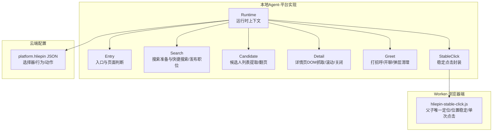
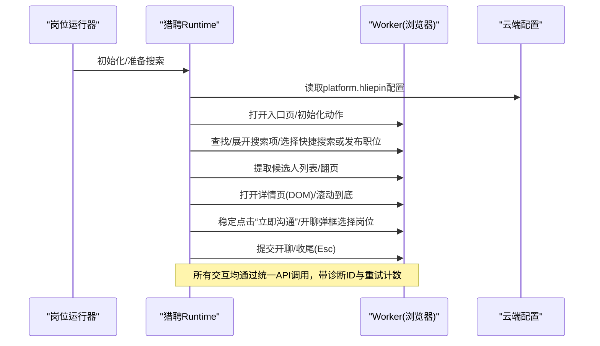
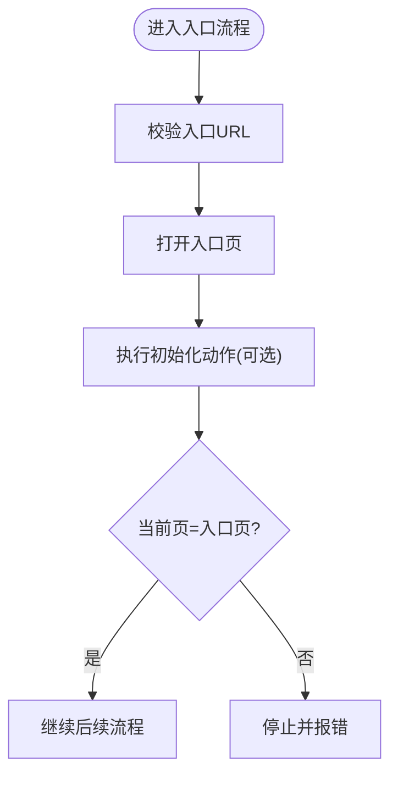
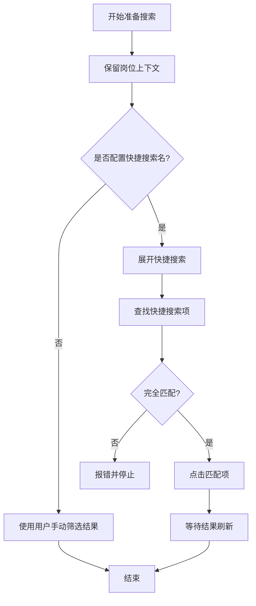
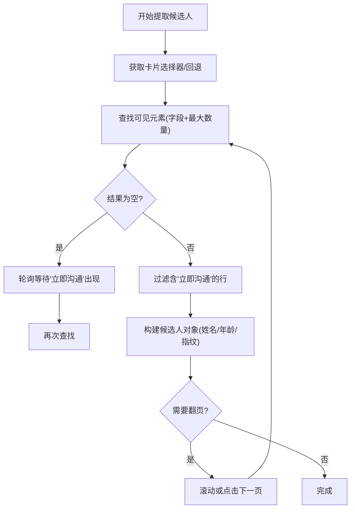
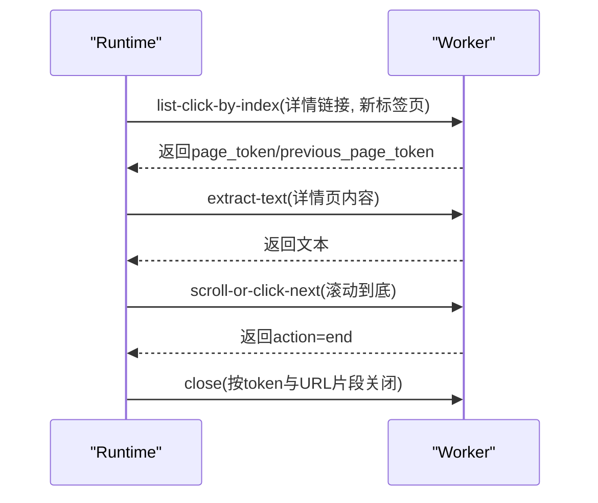
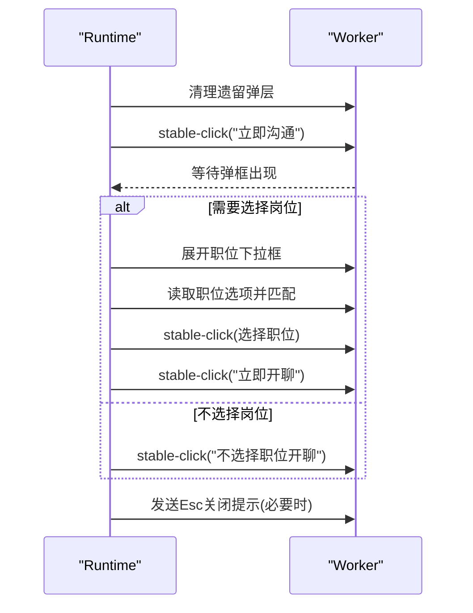
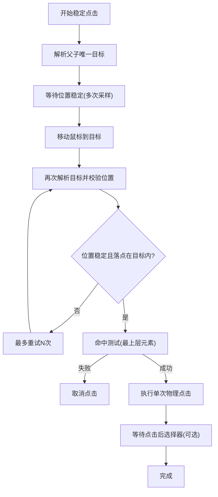
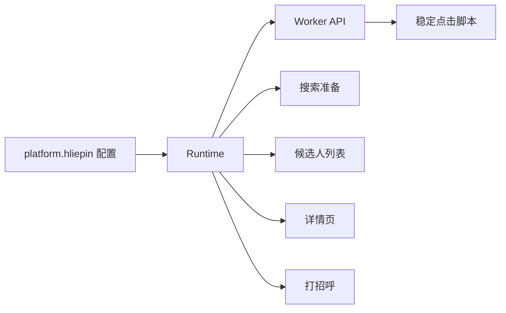

# 猎聘适配器

<cite>
**本文引用的文件**
- [entry.go](file://goodhr5/local-agent-go/internal/platforms/hliepin/entry.go)
- [search.go](file://goodhr5/local-agent-go/internal/platforms/hliepin/search.go)
- [candidate.go](file://goodhr5/local-agent-go/internal/platforms/hliepin/candidate.go)
- [detail.go](file://goodhr5/local-agent-go/internal/platforms/hliepin/detail.go)
- [greet.go](file://goodhr5/local-agent-go/internal/platforms/hliepin/greet.go)
- [stable_click.go](file://goodhr5/local-agent-go/internal/platforms/hliepin/stable_click.go)
- [runtime.go](file://goodhr5/local-agent-go/internal/platforms/hliepin/runtime.go)
- [hliepin-stable-click.js](file://goodhr5/local-agent-go/worker-node/src/hliepin-stable-click.js)
- [0051_hliepin_platform_config.sql](file://goodhr5/cloud/backend/db/migrations/0051_hliepin_platform_config.sql)
</cite>

## 目录
1. [简介](#简介)
2. [项目结构](#项目结构)
3. [核心组件](#核心组件)
4. [架构总览](#架构总览)
5. [详细组件分析](#详细组件分析)
6. [依赖关系分析](#依赖关系分析)
7. [性能考虑](#性能考虑)
8. [故障排查指南](#故障排查指南)
9. [结论](#结论)
10. [附录](#附录)

## 简介
本文件为猎聘平台适配器的完整技术文档，聚焦猎聘猎头端的页面布局特征、动态加载机制与元素选择器策略，系统说明职位搜索、候选人筛选、简历信息提取、在线沟通等关键流程的实现原理。文档重点阐述猎聘特有的稳定点击机制、滚动加载处理、验证码识别策略（由通用登录页初始化动作承载），并提供配置参数说明、性能调优建议与故障排查指南，同时解释数据格式转换与状态同步机制。

## 项目结构
猎聘适配器位于本地 Agent 的“平台实现”层，围绕运行时 Runtime 组织多个职责文件：入口与页面判断、搜索准备、候选人列表提取与翻页、详情页 DOM 抓取与滚动、打招呼与开聊流程、稳定点击能力，以及云端下发的平台选择器配置。Worker 侧提供浏览器端稳定点击脚本，确保在弹层动画与遮挡场景下的唯一目标定位与单次安全点击。

图表来源
- [runtime.go:10-19](file://goodhr5/local-agent-go/internal/platforms/hliepin/runtime.go#L10-L19)
- [entry.go:12-44](file://goodhr5/local-agent-go/internal/platforms/hliepin/entry.go#L12-L44)
- [search.go:22-144](file://goodhr5/local-agent-go/internal/platforms/hliepin/search.go#L22-L144)
- [candidate.go:14-98](file://goodhr5/local-agent-go/internal/platforms/hliepin/candidate.go#L14-L98)
- [detail.go:14-90](file://goodhr5/local-agent-go/internal/platforms/hliepin/detail.go#L14-L90)
- [greet.go:20-126](file://goodhr5/local-agent-go/internal/platforms/hliepin/greet.go#L20-L126)
- [stable_click.go:15-81](file://goodhr5/local-agent-go/internal/platforms/hliepin/stable_click.go#L15-L81)
- [hliepin-stable-click.js:39-231](file://goodhr5/local-agent-go/worker-node/src/hliepin-stable-click.js#L39-L231)
- [0051_hliepin_platform_config.sql:1-103](file://goodhr5/cloud/backend/db/migrations/0051_hliepin_platform_config.sql#L1-L103)

章节来源
- [runtime.go:10-19](file://goodhr5/local-agent-go/internal/platforms/hliepin/runtime.go#L10-L19)
- [entry.go:12-44](file://goodhr5/local-agent-go/internal/platforms/hliepin/entry.go#L12-L44)
- [search.go:22-144](file://goodhr5/local-agent-go/internal/platforms/hliepin/search.go#L22-L144)
- [candidate.go:14-98](file://goodhr5/local-agent-go/internal/platforms/hliepin/candidate.go#L14-L98)
- [detail.go:14-90](file://goodhr5/local-agent-go/internal/platforms/hliepin/detail.go#L14-L90)
- [greet.go:20-126](file://goodhr5/local-agent-go/internal/platforms/hliepin/greet.go#L20-L126)
- [stable_click.go:15-81](file://goodhr5/local-agent-go/internal/platforms/hliepin/stable_click.go#L15-L81)
- [hliepin-stable-click.js:39-231](file://goodhr5/local-agent-go/worker-node/src/hliepin-stable-click.js#L39-L231)
- [0051_hliepin_platform_config.sql:1-103](file://goodhr5/cloud/backend/db/migrations/0051_hliepin_platform_config.sql#L1-L103)

## 核心组件
- 运行时 Runtime：维护平台标识、当前岗位名称、是否需要在开聊弹框中选择岗位等上下文。
- 入口与页面判断：打开入口页、执行初始化动作、判断当前是否为岗位运行入口页。
- 搜索准备：保留岗位上下文；默认停用自动选择发布职位或快捷搜索与三项隐藏条件，交由用户手动设置；支持按配置的快捷搜索名或发布职位进行匹配与选择。
- 候选人列表：提取可见候选人卡片，兼容新旧选择器并等待刷新完成；支持翻页推进；生成去重指纹。
- 详情页：仅支持 DOM 模式读取详情文本；拟人化滚动到底；通过 page_token 管理新标签页与返回。
- 打招呼与开聊：清理遗留弹层；稳定点击“立即沟通”；在开聊弹框中匹配并选择岗位或直接不选；提交后收尾（Esc 关闭提示）。
- 稳定点击：基于父子唯一选择器、位置稳定性校验、鼠标移动后复核、最终命中测试与单次物理点击。

章节来源
- [runtime.go:10-51](file://goodhr5/local-agent-go/internal/platforms/hliepin/runtime.go#L10-L51)
- [entry.go:12-44](file://goodhr5/local-agent-go/internal/platforms/hliepin/entry.go#L12-L44)
- [search.go:22-144](file://goodhr5/local-agent-go/internal/platforms/hliepin/search.go#L22-L144)
- [candidate.go:14-98](file://goodhr5/local-agent-go/internal/platforms/hliepin/candidate.go#L14-L98)
- [detail.go:14-90](file://goodhr5/local-agent-go/internal/platforms/hliepin/detail.go#L14-L90)
- [greet.go:20-126](file://goodhr5/local-agent-go/internal/platforms/hliepin/greet.go#L20-L126)
- [stable_click.go:15-81](file://goodhr5/local-agent-go/internal/platforms/hliepin/stable_click.go#L15-L81)

## 架构总览
猎聘适配器采用“云端配置 + 本地运行时 + Worker 浏览器能力”的分层架构。云端通过 system_configs 下发 platform.hliepin 的配置，包含认证页面、卡片字段、动作按钮、详情页选择器、翻页行为等。本地运行时根据配置调用 Worker API 完成页面操作、元素查找、滚动、点击与文本提取。Worker 侧的稳定点击脚本负责在复杂 UI（弹层、抽屉、聊天框）下保证唯一目标定位与单次安全点击。

图表来源
- [entry.go:12-44](file://goodhr5/local-agent-go/internal/platforms/hliepin/entry.go#L12-L44)
- [search.go:22-144](file://goodhr5/local-agent-go/internal/platforms/hliepin/search.go#L22-L144)
- [candidate.go:14-98](file://goodhr5/local-agent-go/internal/platforms/hliepin/candidate.go#L14-L98)
- [detail.go:14-90](file://goodhr5/local-agent-go/internal/platforms/hliepin/detail.go#L14-L90)
- [greet.go:20-126](file://goodhr5/local-agent-go/internal/platforms/hliepin/greet.go#L20-L126)
- [stable_click.go:15-81](file://goodhr5/local-agent-go/internal/platforms/hliepin/stable_click.go#L15-L81)
- [0051_hliepin_platform_config.sql:1-103](file://goodhr5/cloud/backend/db/migrations/0051_hliepin_platform_config.sql#L1-L103)

## 详细组件分析

### 入口与页面判断
- 打开入口页：校验入口 URL 并通过页面管理接口打开。
- 初始化入口页：无额外动作（搜索会刷新候选人条件，岗位选择和隐藏筛选在搜索完成后处理）。
- 判断是否在入口页：获取当前页面列表，比较当前页 URL 与配置中的入口页 URL。

图表来源
- [entry.go:12-44](file://goodhr5/local-agent-go/internal/platforms/hliepin/entry.go#L12-L44)

章节来源
- [entry.go:12-44](file://goodhr5/local-agent-go/internal/platforms/hliepin/entry.go#L12-L44)

### 职位搜索与筛选
- 准备搜索：保留岗位名称；默认停用自动选择发布职位或快捷搜索与三项隐藏条件，改为用户手动设置；若配置了快捷搜索名则记录但不自动执行。
- 快捷搜索：展开快捷搜索列表，按完整名称匹配并点击，等待结果刷新。
- 发布职位：展开正在发布的职位，按岗位名称匹配（含截断前缀匹配），点击并等待刷新。
- 隐藏候选筛选：如需勾选“隐藏已查看/已沟通/已获取联系方式”，先回到顶部，再按文本确保勾选，并等待重新加载。

图表来源
- [search.go:22-144](file://goodhr5/local-agent-go/internal/platforms/hliepin/search.go#L22-L144)

章节来源
- [search.go:22-144](file://goodhr5/local-agent-go/internal/platforms/hliepin/search.go#L22-L144)

### 候选人列表提取与翻页
- 列表提取：优先使用配置中的卡片选择器，否则回退到表格行；首次为空时轮询等待“立即沟通”出现；过滤不含“立即沟通”的行；从文本或字段中提取姓名、年龄、原始文本与平台候选人 ID；计算去重指纹。
- 翻页推进：使用统一的“滚动或点击下一页”接口，支持下一页按钮与禁用类检测，并记录推进原因。
- 指纹生成：优先使用平台候选人 ID；否则组合姓名、年龄与稳定文本摘要生成哈希指纹。

图表来源
- [candidate.go:14-98](file://goodhr5/local-agent-go/internal/platforms/hliepin/candidate.go#L14-L98)

章节来源
- [candidate.go:14-98](file://goodhr5/local-agent-go/internal/platforms/hliepin/candidate.go#L14-L98)

### 详情页 DOM 抓取与滚动
- 打开详情：仅支持 DOM 模式；通过 index 与 item 定位并点击详情链接，要求打开新标签页并等待；记录详情页 token 与返回页 token。
- 提取文本：读取详情页内容区域文本；若为空则报错。
- 滚动到底：使用连续滚轮模拟人类浏览，随机时长滚动至底部；若未到达底部则报错。
- 关闭详情：通过 page_token 与 URL 片段匹配关闭详情页并返回搜索页。

图表来源
- [detail.go:14-90](file://goodhr5/local-agent-go/internal/platforms/hliepin/detail.go#L14-L90)

章节来源
- [detail.go:14-90](file://goodhr5/local-agent-go/internal/platforms/hliepin/detail.go#L14-L90)

### 打招呼与在线沟通
- 前置清理：点击候选人前检查并关闭遗留的开聊弹框、聊天框与候选人列表抽屉。
- 稳定点击“立即沟通”：在候选人行父级内定位唯一目标，等待位置稳定，移动鼠标后复核，最终命中测试通过后执行单次物理点击；等待开聊弹框出现。
- 开聊弹框岗位选择：
  - 若需选择岗位：展开下拉框，读取职位选项，按名称匹配（支持截断双向包含），选择后提交。
  - 若不选择岗位：直接点击“不选择职位开聊”。
- 收尾：提交后发送两次 Esc 关闭提示；若后续需要索要信息则保留可能自动出现的聊天框。

图表来源
- [greet.go:20-126](file://goodhr5/local-agent-go/internal/platforms/hliepin/greet.go#L20-L126)
- [greet.go:128-178](file://goodhr5/local-agent-go/internal/platforms/hliepin/greet.go#L128-L178)
- [greet.go:180-234](file://goodhr5/local-agent-go/internal/platforms/hliepin/greet.go#L180-L234)

章节来源
- [greet.go:20-126](file://goodhr5/local-agent-go/internal/platforms/hliepin/greet.go#L20-L126)
- [greet.go:128-178](file://goodhr5/local-agent-go/internal/platforms/hliepin/greet.go#L128-L178)
- [greet.go:180-234](file://goodhr5/local-agent-go/internal/platforms/hliepin/greet.go#L180-L234)

### 猎聘稳定点击机制
- 父子唯一选择器：以候选人行父级（如表格行）作为唯一容器，避免跨弹层误命中同类元素。
- 位置稳定性校验：连续多次读取目标 bounding box，直到位置稳定且误差在容忍范围内。
- 鼠标移动后复核：移动鼠标到目标后再次解析目标并校验位置，防止弹层/抽屉遮挡导致位移。
- 命中测试：点击前验证落点最上层元素仍属于目标，避免误点其他候选人。
- 单次物理点击：使用人类点击方式，只执行一次；可等待点击后出现或消失的选择器。

图表来源
- [stable_click.go:15-81](file://goodhr5/local-agent-go/internal/platforms/hliepin/stable_click.go#L15-L81)
- [hliepin-stable-click.js:39-231](file://goodhr5/local-agent-go/worker-node/src/hliepin-stable-click.js#L39-L231)

章节来源
- [stable_click.go:15-81](file://goodhr5/local-agent-go/internal/platforms/hliepin/stable_click.go#L15-L81)
- [hliepin-stable-click.js:39-231](file://goodhr5/local-agent-go/worker-node/src/hliepin-stable-click.js#L39-L231)

### 数据格式转换与状态同步
- 候选人字段：从配置中定义字段请求，补充猎聘稳定的平台候选人 ID；将多段文本拼接为原始文本用于筛选与指纹。
- 去重指纹：优先使用平台候选人 ID；否则组合姓名、年龄与稳定文本摘要生成哈希指纹，避免重复处理。
- 详情页状态：通过 page_token 与 previous_page_token 在新标签页与返回页之间切换，确保详情页关闭后回到正确上下文。
- 运行上下文：Runtime 保存当前岗位名称与是否需要选择岗位标记，贯穿搜索、开聊与收尾流程。

章节来源
- [candidate.go:121-189](file://goodhr5/local-agent-go/internal/platforms/hliepin/candidate.go#L121-L189)
- [detail.go:14-90](file://goodhr5/local-agent-go/internal/platforms/hliepin/detail.go#L14-L90)
- [runtime.go:10-51](file://goodhr5/local-agent-go/internal/platforms/hliepin/runtime.go#L10-L51)

## 依赖关系分析
- 运行时依赖云端配置：platform.hliepin 定义了认证页面、卡片字段、动作按钮、详情页选择器与翻页行为。
- Worker 依赖浏览器能力：稳定点击脚本依赖 ensurePage、moveMouseToElement、humanMouseClick 等能力。
- 模块耦合：搜索、候选人、详情页、打招呼均通过统一 Executor 调用 Worker API，降低耦合度；稳定点击被多处复用。

图表来源
- [0051_hliepin_platform_config.sql:1-103](file://goodhr5/cloud/backend/db/migrations/0051_hliepin_platform_config.sql#L1-L103)
- [stable_click.go:15-81](file://goodhr5/local-agent-go/internal/platforms/hliepin/stable_click.go#L15-L81)
- [hliepin-stable-click.js:39-231](file://goodhr5/local-agent-go/worker-node/src/hliepin-stable-click.js#L39-L231)

章节来源
- [0051_hliepin_platform_config.sql:1-103](file://goodhr5/cloud/backend/db/migrations/0051_hliepin_platform_config.sql#L1-L103)
- [stable_click.go:15-81](file://goodhr5/local-agent-go/internal/platforms/hliepin/stable_click.go#L15-L81)
- [hliepin-stable-click.js:39-231](file://goodhr5/local-agent-go/worker-node/src/hliepin-stable-click.js#L39-L231)

## 性能考虑
- 列表提取优化：首次为空时轮询等待“立即沟通”出现，减少无效扫描；限制最大条目数，避免过多 DOM 遍历。
- 翻页效率：使用统一的滚动或点击下一页接口，结合禁用类检测，减少无效翻页尝试。
- 详情页滚动：随机时长滚动到底，模拟人类浏览，降低平台风控风险；滚动完成后快速返回。
- 稳定点击：通过位置稳定性校验与命中测试，减少误点击导致的重试与错误分支；控制最大移动次数与超时时间。
- 日志诊断：每次稳定点击生成唯一动作 ID，便于追踪传输重发与实际点击次数，辅助性能分析与问题定位。

[本节为通用指导，无需具体文件引用]

## 故障排查指南
- 入口页缺失：检查云端配置中的入口 URL 是否正确；确认当前页面列表是否包含入口页。
- 搜索项未展开：若快捷搜索或发布职位未显示展开入口，视为无需展开；若展开失败，检查选择器与网络加载。
- 快捷搜索/发布职位匹配失败：核对配置名称与页面文本的一致性（大小写、空白、省略号）；输出当前列表名称以便比对。
- 候选人列表为空：检查选择器是否匹配新版结构；等待“立即沟通”出现；确认页面 URL 与筛选条件。
- 详情页未读取到文本：确认详情页内容选择器；检查新标签页是否成功打开；必要时延长等待时间。
- 开聊弹框未出现：轮询等待弹框出现；若超时，检查网络与页面渲染；必要时清理遗留弹层后重试。
- 稳定点击失败：检查父子选择器是否唯一；查看位置稳定性与命中测试结果；确认未被弹层遮挡；关注动作 ID 的诊断日志。

章节来源
- [entry.go:12-44](file://goodhr5/local-agent-go/internal/platforms/hliepin/entry.go#L12-L44)
- [search.go:56-144](file://goodhr5/local-agent-go/internal/platforms/hliepin/search.go#L56-L144)
- [candidate.go:14-98](file://goodhr5/local-agent-go/internal/platforms/hliepin/candidate.go#L14-L98)
- [detail.go:14-90](file://goodhr5/local-agent-go/internal/platforms/hliepin/detail.go#L14-L90)
- [greet.go:164-234](file://goodhr5/local-agent-go/internal/platforms/hliepin/greet.go#L164-L234)
- [stable_click.go:46-81](file://goodhr5/local-agent-go/internal/platforms/hliepin/stable_click.go#L46-L81)
- [hliepin-stable-click.js:51-231](file://goodhr5/local-agent-go/worker-node/src/hliepin-stable-click.js#L51-L231)

## 结论
猎聘适配器通过云端配置驱动、本地运行时编排与 Worker 浏览器能力的协同，实现了稳健的页面操作与数据提取。稳定点击机制有效应对弹层动画与遮挡场景，保障点击准确性与安全性。搜索准备默认尊重用户手动筛选，提升可控性与可审计性。整体架构清晰、职责分明，具备良好的扩展性与可维护性。

[本节为总结性内容，无需具体文件引用]

## 附录

### 配置参数说明（platform.hliepin）
- 认证页面：
  - pages：包含入口页与登录页匹配规则（URL 包含匹配、标题匹配）。
  - entry_url：入口页地址。
  - login_url_prefixes：登录页前缀。
  - logged_in_url_contains：已登录 URL 片段。
- 卡片字段：
  - item：卡片父级与目标类集合。
  - fields：姓名、基本信息、教育、学校、描述等字段选择器。
  - scroll：滚动目标类集合。
- 动作按钮：
  - greetBtn、continueBtn、phoneBtn、confirmBtn：对应按钮选择器集合。
- 详情页：
  - openTarget：详情打开目标选择器。
  - content：详情内容区域选择器。
  - closeBtn：关闭按钮选择器。
- 岗位：
  - current、switchBtn、list、item、itemText：岗位选择相关选择器。
- 行为：
  - needsDetailPage：是否需要详情页。
  - supportsPaging：是否支持分页。
  - nextPageBtn：下一页按钮选择器。
  - nextPageDisabledClass：下一页禁用类名。

章节来源
- [0051_hliepin_platform_config.sql:1-103](file://goodhr5/cloud/backend/db/migrations/0051_hliepin_platform_config.sql#L1-L103)