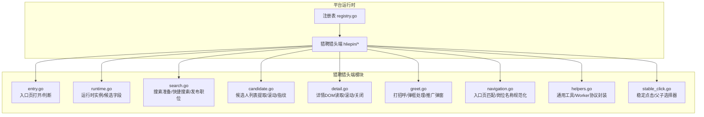
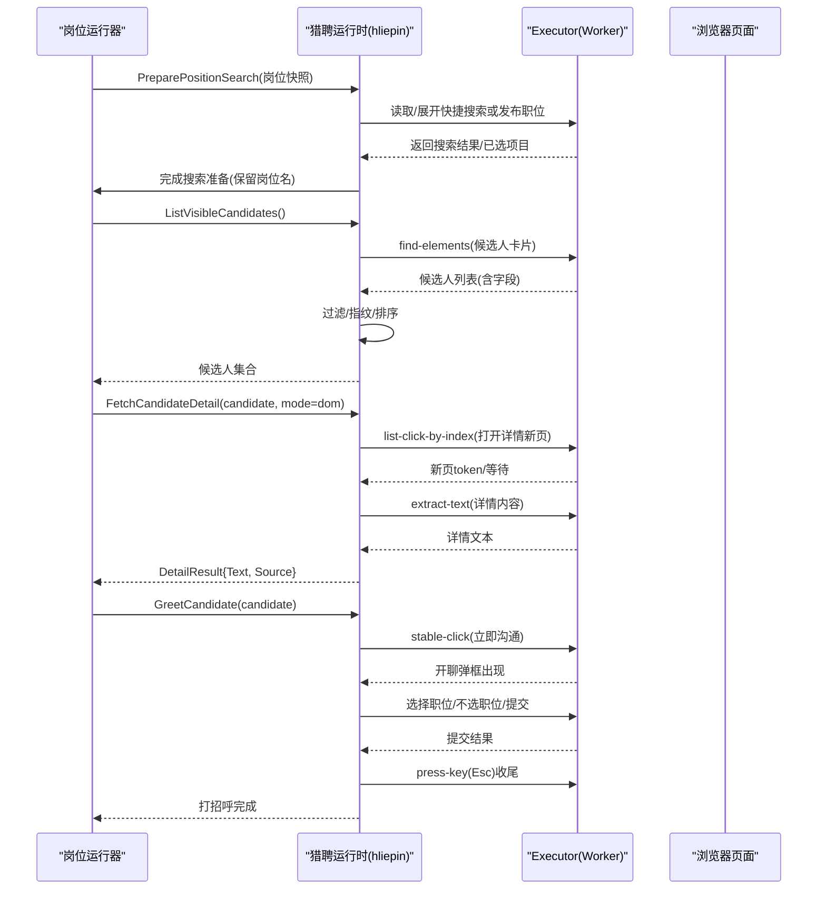
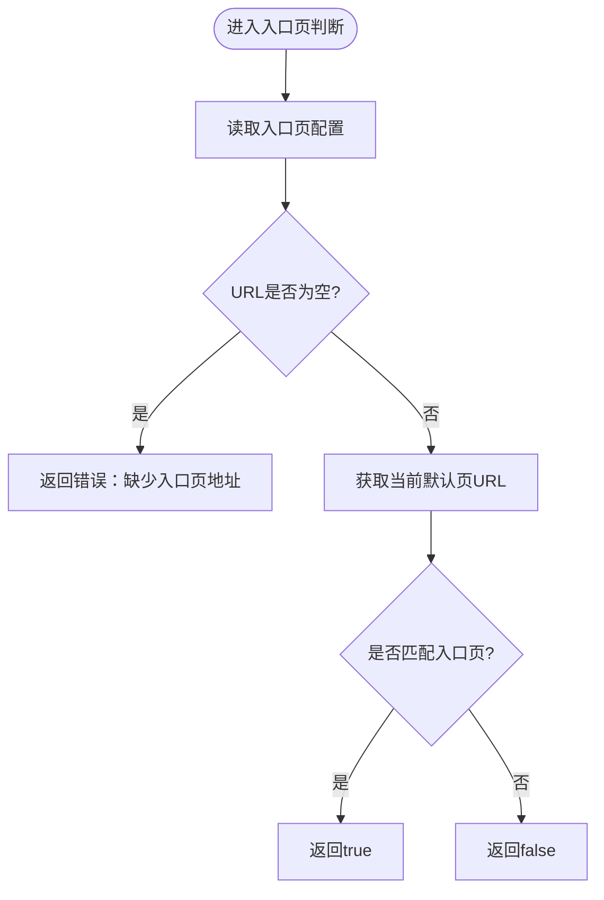
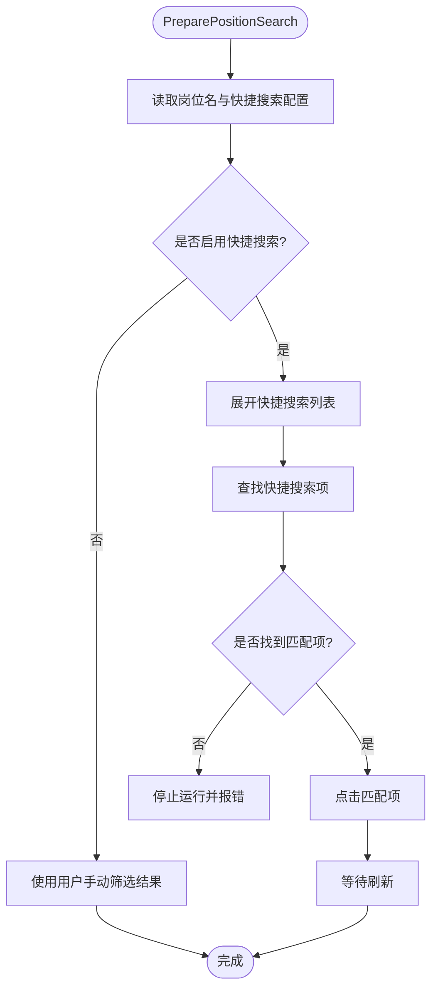
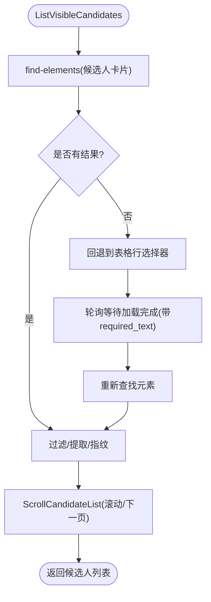
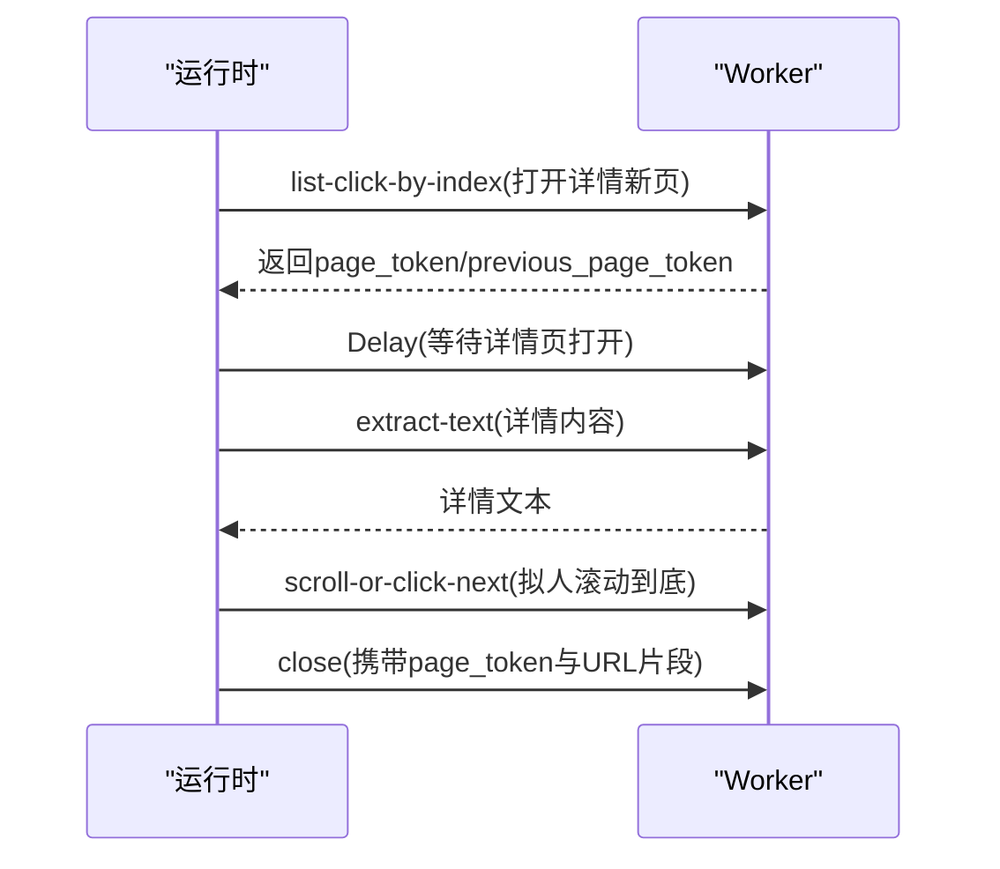
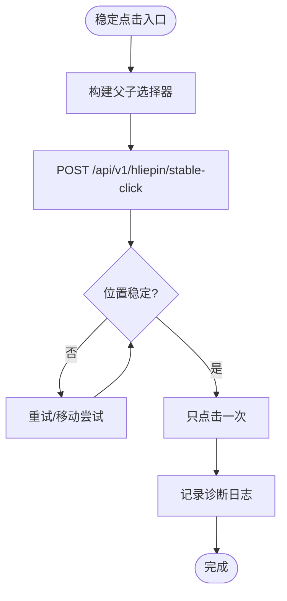
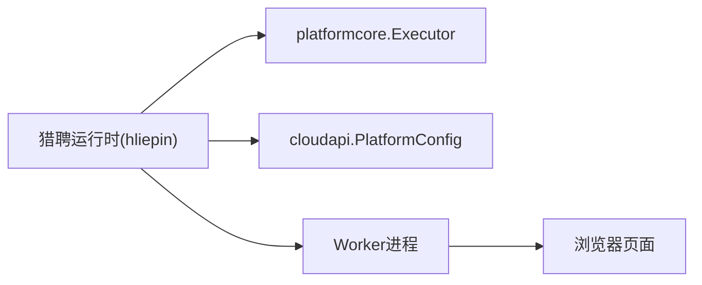

# 猎聘适配器

<cite>
**本文引用的文件**
- [entry.go](file://goodhr5/local-agent-go/internal/platforms/hliepin/entry.go)
- [runtime.go](file://goodhr5/local-agent-go/internal/platforms/hliepin/runtime.go)
- [search.go](file://goodhr5/local-agent-go/internal/platforms/hliepin/search.go)
- [stable_click.go](file://goodhr5/local-agent-go/internal/platforms/hliepin/stable_click.go)
- [candidate.go](file://goodhr5/local-agent-go/internal/platforms/hliepin/candidate.go)
- [detail.go](file://goodhr5/local-agent-go/internal/platforms/hliepin/detail.go)
- [greet.go](file://goodhr5/local-agent-go/internal/platforms/hliepin/greet.go)
- [navigation.go](file://goodhr5/local-agent-go/internal/platforms/hliepin/navigation.go)
- [helpers.go](file://goodhr5/local-agent-go/internal/platforms/hliepin/helpers.go)
- [registry.go](file://goodhr5/local-agent-go/internal/platforms/registry.go)
</cite>

## 目录
1. [简介](#简介)
2. [项目结构](#项目结构)
3. [核心组件](#核心组件)
4. [架构总览](#架构总览)
5. [详细组件分析](#详细组件分析)
6. [依赖关系分析](#依赖关系分析)
7. [性能与稳定性优化](#性能与稳定性优化)
8. [故障排查指南](#故障排查指南)
9. [结论](#结论)
10. [附录：配置参数说明](#附录：配置参数说明)

## 简介
本文件为猎聘平台适配器的技术文档，聚焦猎聘猎头端（hliepin）在企业自动化招聘流程中的页面解析、元素定位、动态加载处理、候选人筛选与提取、详情读取、在线沟通等关键能力。文档同时覆盖稳定点击机制、滚动加载策略、验证码识别策略、数据格式转换与状态同步机制，并提供配置项说明、性能调优建议与故障排查指引。

## 项目结构
猎聘适配器位于本地 Agent 的“平台运行时”模块中，按平台维度组织代码。猎聘猎头端的核心实现集中在 hliepin 包内，包含入口页管理、搜索准备、候选人列表提取、详情页操作、打招呼沟通、导航辅助与通用工具函数；并通过统一注册表接入平台调度。



图表来源
- [registry.go:15-20](file://goodhr5/local-agent-go/internal/platforms/registry.go#L15-L20)
- [entry.go:12-44](file://goodhr5/local-agent-go/internal/platforms/hliepin/entry.go#L12-L44)
- [runtime.go:10-51](file://goodhr5/local-agent-go/internal/platforms/hliepin/runtime.go#L10-L51)
- [search.go:22-54](file://goodhr5/local-agent-go/internal/platforms/hliepin/search.go#L22-L54)
- [candidate.go:14-79](file://goodhr5/local-agent-go/internal/platforms/hliepin/candidate.go#L14-L79)
- [detail.go:14-96](file://goodhr5/local-agent-go/internal/platforms/hliepin/detail.go#L14-L96)
- [greet.go:30-143](file://goodhr5/local-agent-go/internal/platforms/hliepin/greet.go#L30-L143)
- [navigation.go:6-65](file://goodhr5/local-agent-go/internal/platforms/hliepin/navigation.go#L6-L65)
- [helpers.go:112-180](file://goodhr5/local-agent-go/internal/platforms/hliepin/helpers.go#L112-L180)
- [stable_click.go:15-82](file://goodhr5/local-agent-go/internal/platforms/hliepin/stable_click.go#L15-L82)

章节来源
- [registry.go:1-35](file://goodhr5/local-agent-go/internal/platforms/registry.go#L1-L35)
- [entry.go:12-44](file://goodhr5/local-agent-go/internal/platforms/hliepin/entry.go#L12-L44)
- [runtime.go:10-51](file://goodhr5/local-agent-go/internal/platforms/hliepin/runtime.go#L10-L51)

## 核心组件
- 入口页管理：负责打开并校验当前是否处于猎聘猎头端岗位运行入口页。
- 搜索准备：保留岗位上下文，支持快捷搜索与发布职位选择（当前默认停用自动选择，使用用户手动筛选）。
- 候选人列表：提取可见候选人卡片，处理首次为空时的轮询等待，生成去重指纹。
- 详情页：仅支持 DOM 模式读取详情文本，拟人化滚动到底并安全关闭。
- 打招呼：稳定点击“立即沟通”，处理开聊弹框、职位下拉匹配、推广弹窗、收尾 Esc。
- 导航辅助：入口页匹配、岗位名称规范化、元素定位协议转换。
- 稳定点击：基于父子唯一选择器与位置稳定性检测，确保只点击一次且可重放诊断。
- 通用工具：Worker 响应解析、配置分区读取、字段请求组装、日志格式化。

章节来源
- [entry.go:12-44](file://goodhr5/local-agent-go/internal/platforms/hliepin/entry.go#L12-L44)
- [search.go:22-54](file://goodhr5/local-agent-go/internal/platforms/hliepin/search.go#L22-L54)
- [candidate.go:14-79](file://goodhr5/local-agent-go/internal/platforms/hliepin/candidate.go#L14-L79)
- [detail.go:14-96](file://goodhr5/local-agent-go/internal/platforms/hliepin/detail.go#L14-L96)
- [greet.go:30-143](file://goodhr5/local-agent-go/internal/platforms/hliepin/greet.go#L30-L143)
- [navigation.go:6-65](file://goodhr5/local-agent-go/internal/platforms/hliepin/navigation.go#L6-L65)
- [stable_click.go:15-82](file://goodhr5/local-agent-go/internal/platforms/hliepin/stable_click.go#L15-L82)
- [helpers.go:112-180](file://goodhr5/local-agent-go/internal/platforms/hliepin/helpers.go#L112-L180)

## 架构总览
猎聘适配器通过统一的 Executor 接口与 Worker 进程通信，执行页面查找、点击、滚动、键盘输入等操作；平台运行时根据云端配置动态决定选择器与行为。整体调用链如下：



图表来源
- [search.go:22-54](file://goodhr5/local-agent-go/internal/platforms/hliepin/search.go#L22-L54)
- [candidate.go:14-79](file://goodhr5/local-agent-go/internal/platforms/hliepin/candidate.go#L14-L79)
- [detail.go:14-56](file://goodhr5/local-agent-go/internal/platforms/hliepin/detail.go#L14-L56)
- [greet.go:30-143](file://goodhr5/local-agent-go/internal/platforms/hliepin/greet.go#L30-L143)
- [stable_click.go:46-82](file://goodhr5/local-agent-go/internal/platforms/hliepin/stable_click.go#L46-L82)

## 详细组件分析

### 入口页管理
- 打开入口页：校验配置 URL 并调用页面打开接口。
- 判断是否在入口页：获取当前默认页 URL，与配置的入口页进行匹配（支持前缀/包含/精确匹配）。



图表来源
- [entry.go:28-44](file://goodhr5/local-agent-go/internal/platforms/hliepin/entry.go#L28-L44)
- [navigation.go:6-65](file://goodhr5/local-agent-go/internal/platforms/hliepin/navigation.go#L6-L65)

章节来源
- [entry.go:12-44](file://goodhr5/local-agent-go/internal/platforms/hliepin/entry.go#L12-L44)
- [navigation.go:6-65](file://goodhr5/local-agent-go/internal/platforms/hliepin/navigation.go#L6-L65)

### 搜索准备与快捷搜索/发布职位
- 准备阶段：从岗位快照读取岗位名与快捷搜索配置，记录当前岗位名；当前默认停用自动选择发布职位与快捷搜索，使用用户手动筛选结果。
- 快捷搜索：若启用，则展开快捷搜索列表，按完整名称匹配并点击，等待刷新。
- 发布职位：若启用，则展开正在发布的职位，按名称匹配（支持截断前缀匹配），点击后等待刷新。
- 隐藏条件：三项隐藏筛选（已查看/已沟通/已获取联系方式）由用户手动设置，不再自动勾选。



图表来源
- [search.go:22-54](file://goodhr5/local-agent-go/internal/platforms/hliepin/search.go#L22-L54)
- [search.go:56-123](file://goodhr5/local-agent-go/internal/platforms/hliepin/search.go#L56-L123)

章节来源
- [search.go:22-54](file://goodhr5/local-agent-go/internal/platforms/hliepin/search.go#L22-L54)
- [search.go:56-123](file://goodhr5/local-agent-go/internal/platforms/hliepin/search.go#L56-L123)

### 候选人列表提取与滚动
- 列表提取：优先使用配置的元素定位；若首次为空，回退到表格行选择器并按“立即沟通”文本轮询等待加载完成。
- 过滤与指纹：过滤不含“立即沟通”的行；从原始文本或字段中提取姓名、年龄，生成稳定指纹用于去重。
- 滚动推进：支持滚动与下一页按钮点击，自动判断禁用状态并等待加载。



图表来源
- [candidate.go:14-79](file://goodhr5/local-agent-go/internal/platforms/hliepin/candidate.go#L14-L79)
- [candidate.go:81-98](file://goodhr5/local-agent-go/internal/platforms/hliepin/candidate.go#L81-L98)

章节来源
- [candidate.go:14-79](file://goodhr5/local-agent-go/internal/platforms/hliepin/candidate.go#L14-L79)
- [candidate.go:81-98](file://goodhr5/local-agent-go/internal/platforms/hliepin/candidate.go#L81-L98)

### 详情页读取与滚动
- 详情打开：通过 list-click-by-index 打开新页，等待新页 token 并延迟等待渲染。
- 文本提取：仅支持 DOM 模式，提取详情内容文本。
- 拟人滚动：在随机时长内滚动到底部，避免机械式滚动。
- 安全关闭：使用 page_token 与 URL 片段匹配，回到搜索列表页。



图表来源
- [detail.go:14-56](file://goodhr5/local-agent-go/internal/platforms/hliepin/detail.go#L14-L56)
- [detail.go:58-90](file://goodhr5/local-agent-go/internal/platforms/hliepin/detail.go#L58-L90)

章节来源
- [detail.go:14-96](file://goodhr5/local-agent-go/internal/platforms/hliepin/detail.go#L14-L96)

### 在线沟通（打招呼）
- 稳定点击：在候选人行父级中定位“立即沟通”按钮，等待位置稳定并保证只点击一次。
- 开聊弹框：轮询等待弹框出现，支持选择职位或不选职位两种路径。
- 职位匹配：优先完整匹配，其次去除省略号做双向包含匹配，失败时走“不选职位”路径。
- 推广弹窗：开聊后偶发相似候选人推广弹窗，检测并关闭，失败则按 Escape 兜底。
- 收尾：根据是否需要索要信息决定是否保留聊天框；否则发送两次 Esc 关闭弹层。

```mermaid
sequenceDiagram
participant R as "运行时"
participant W as "Worker"
R->>W : stable-click(立即沟通)
W-->>R : 开聊弹框出现
R->>W : 选择职位/不选职位
alt 选择职位
R->>W : stable-click(提交立即开聊)
else 不选职位
R->>W : stable-click(不选择职位开聊)
end
R->>W : 检测并关闭推广弹窗
opt 需要保留聊天框
R-->>R : 跳过Esc收尾
else 不需要保留
R->>W : press-key(Esc) x2
end
```

图表来源
- [greet.go:30-143](file://goodhr5/local-agent-go/internal/platforms/hliepin/greet.go#L30-L143)
- [greet.go:145-179](file://goodhr5/local-agent-go/internal/platforms/hliepin/greet.go#L145-L179)
- [greet.go:241-251](file://goodhr5/local-agent-go/internal/platforms/hliepin/greet.go#L241-L251)
- [greet.go:297-334](file://goodhr5/local-agent-go/internal/platforms/hliepin/greet.go#L297-L334)
- [stable_click.go:46-82](file://goodhr5/local-agent-go/internal/platforms/hliepin/stable_click.go#L46-L82)

章节来源
- [greet.go:30-143](file://goodhr5/local-agent-go/internal/platforms/hliepin/greet.go#L30-L143)
- [greet.go:145-179](file://goodhr5/local-agent-go/internal/platforms/hliepin/greet.go#L145-L179)
- [greet.go:241-251](file://goodhr5/local-agent-go/internal/platforms/hliepin/greet.go#L241-L251)
- [greet.go:297-334](file://goodhr5/local-agent-go/internal/platforms/hliepin/greet.go#L297-L334)
- [stable_click.go:46-82](file://goodhr5/local-agent-go/internal/platforms/hliepin/stable_click.go#L46-L82)

### 稳定点击机制
- 父子唯一选择器：以候选人行父级（基于稳定简历 ID）限定范围，禁止退回全局按钮选择器，提升定位稳定性。
- 位置稳定性检测：多次检查目标坐标变化，容忍微小偏移，限制最大移动尝试次数。
- 单次点击保障：通过动作 ID 贯穿 Worker 自动重发，确保只执行一次点击。
- 诊断日志：记录动作名称、父级、目标、实际点击次数与传输重发次数，便于问题定位。



图表来源
- [stable_click.go:15-82](file://goodhr5/local-agent-go/internal/platforms/hliepin/stable_click.go#L15-L82)

章节来源
- [stable_click.go:15-82](file://goodhr5/local-agent-go/internal/platforms/hliepin/stable_click.go#L15-L82)

### 数据格式转换与状态同步
- 字段请求：将云端配置中的元素定位转换为 Worker 统一协议，支持 target_classes、parent_classes、find_attempts、find_interval_ms 等。
- 候选人指纹：优先使用平台候选人 ID；否则组合姓名、年龄与稳定文本摘要生成 SHA256 指纹，确保跨次扫描去重。
- 详情状态：通过 page_token 与 previous_page_token 在新旧页之间切换，结合 URL 片段匹配确保正确关闭。
- 行为标记：在候选人对象中临时标记是否保留开聊后的聊天框，供后续索要信息流程判断。

章节来源
- [helpers.go:112-180](file://goodhr5/local-agent-go/internal/platforms/hliepin/helpers.go#L112-L180)
- [candidate.go:105-119](file://goodhr5/local-agent-go/internal/platforms/hliepin/candidate.go#L105-L119)
- [detail.go:77-90](file://goodhr5/local-agent-go/internal/platforms/hliepin/detail.go#L77-L90)
- [greet.go:112-116](file://goodhr5/local-agent-go/internal/platforms/hliepin/greet.go#L112-L116)

## 依赖关系分析
猎聘适配器依赖以下内部模块：
- platformcore.Executor：提供页面操作抽象（查找、点击、滚动、键盘输入、延迟等）。
- cloudapi.PlatformConfig：提供平台配置（入口页、元素定位、行为开关等）。
- worker 进程：执行具体 DOM 操作与页面状态管理。



图表来源
- [registry.go:15-20](file://goodhr5/local-agent-go/internal/platforms/registry.go#L15-L20)
- [helpers.go:75-99](file://goodhr5/local-agent-go/internal/platforms/hliepin/helpers.go#L75-L99)

章节来源
- [registry.go:15-20](file://goodhr5/local-agent-go/internal/platforms/registry.go#L15-L20)
- [helpers.go:75-99](file://goodhr5/local-agent-go/internal/platforms/hliepin/helpers.go#L75-L99)

## 性能与稳定性优化
- 列表加载等待：首次为空时采用短间隔轮询与 required_text 约束，减少无效等待时间。
- 滚动策略：详情页滚动采用随机时长与底部阈值，模拟人类浏览行为，降低被风控概率。
- 稳定点击：通过父子选择器与位置稳定性检测，避免重复点击与误点。
- 弹框处理：开聊后推广弹窗检测与兜底 Esc，提高流程鲁棒性。
- 配置驱动：元素定位与行为开关通过云端配置下发，便于快速适配页面变更。

[本节为通用指导，不直接分析具体文件]

## 故障排查指南
- 入口页未匹配：检查云端配置中的入口页 URL 与匹配模式是否正确。
- 搜索准备失败：确认快捷搜索名称或发布职位名称是否与页面显示一致（注意截断与大小写）。
- 候选人列表为空：检查选择器是否失效；必要时回退到表格行选择器并观察 required_text 是否生效。
- 详情页无法读取：确认 mode 为 dom；检查详情内容区域选择器是否有效。
- 打招呼失败：核对“立即沟通”按钮是否可定位；开聊弹框是否出现；职位下拉是否匹配；推广弹窗是否关闭。
- 稳定点击异常：查看诊断日志中的 action_id、父级、目标与实际点击次数；确认位置稳定性参数是否合理。

章节来源
- [entry.go:28-44](file://goodhr5/local-agent-go/internal/platforms/hliepin/entry.go#L28-L44)
- [search.go:56-123](file://goodhr5/local-agent-go/internal/platforms/hliepin/search.go#L56-L123)
- [candidate.go:14-79](file://goodhr5/local-agent-go/internal/platforms/hliepin/candidate.go#L14-L79)
- [detail.go:14-56](file://goodhr5/local-agent-go/internal/platforms/hliepin/detail.go#L14-L56)
- [greet.go:30-143](file://goodhr5/local-agent-go/internal/platforms/hliepin/greet.go#L30-L143)
- [stable_click.go:46-82](file://goodhr5/local-agent-go/internal/platforms/hliepin/stable_click.go#L46-L82)

## 结论
猎聘适配器通过配置驱动与稳定点击机制，实现了猎聘猎头端的候选人搜索、筛选、详情读取与在线沟通全流程自动化。其设计强调页面变化的容错性与可观测性，配合 Worker 提供的底层页面操作能力，能够在复杂动态场景中保持高成功率与可维护性。

[本节为总结，不直接分析具体文件]

## 附录：配置参数说明
- 入口页配置（auth.pages）：
  - url：入口页地址
  - match：匹配模式（prefix/contains/精确）
- 元素定位（card/detail/behavior 等分区）：
  - target_classes/targetClasses：目标类名列表
  - parent_classes/parentClasses：父级类名列表
  - find_attempts/find_interval_ms：查找尝试次数与间隔
- 候选人字段（card.fields）：
  - 各字段对应的定位规则（selector/attribute 等）
- 行为开关（behavior）：
  - nextPageBtn：下一页按钮选择器
  - nextPageDisabledClass：下一页禁用类名
- 搜索相关（common_config）：
  - hliepin_shortcut_search_name：快捷搜索名称（当前默认停用自动选择）
  - hliepin_hide_viewed/hliepin_hide_contacted/hliepin_hide_contact_obtained：隐藏筛选开关（当前默认由用户手动设置）

章节来源
- [navigation.go:6-65](file://goodhr5/local-agent-go/internal/platforms/hliepin/navigation.go#L6-L65)
- [helpers.go:112-180](file://goodhr5/local-agent-go/internal/platforms/hliepin/helpers.go#L112-L180)
- [search.go:146-183](file://goodhr5/local-agent-go/internal/platforms/hliepin/search.go#L146-L183)
- [candidate.go:81-98](file://goodhr5/local-agent-go/internal/platforms/hliepin/candidate.go#L81-L98)