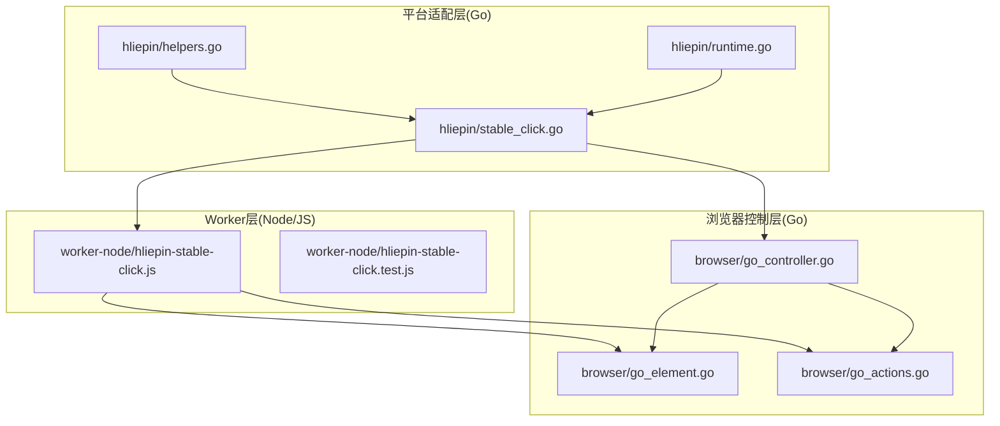
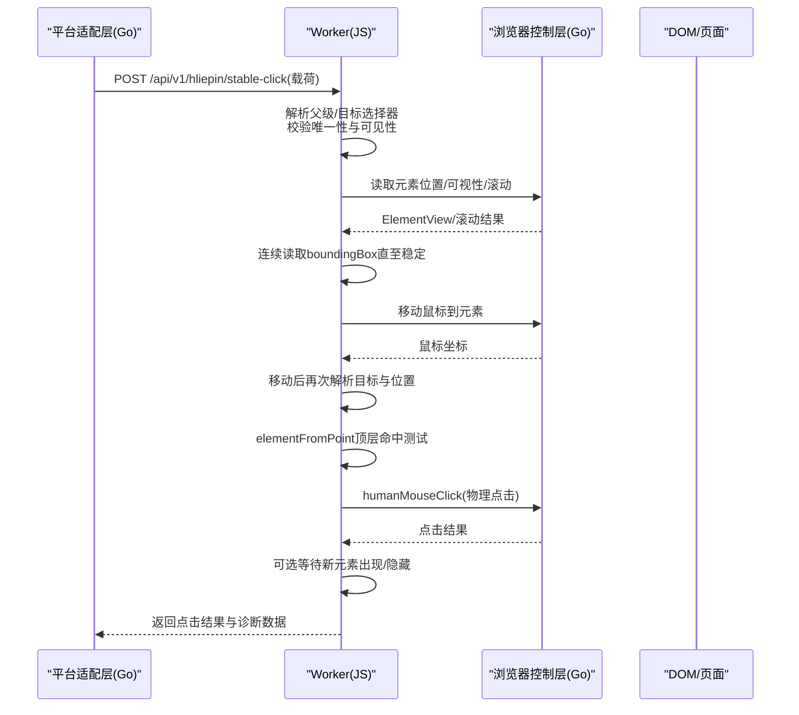
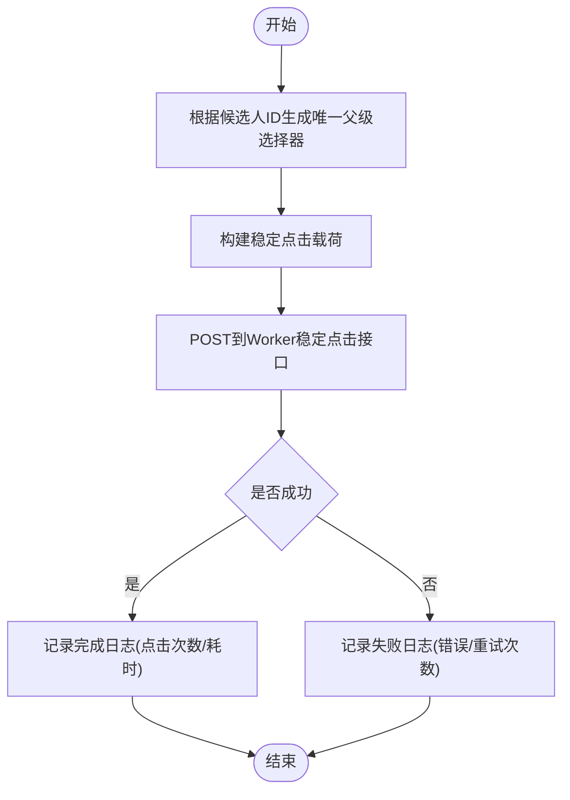
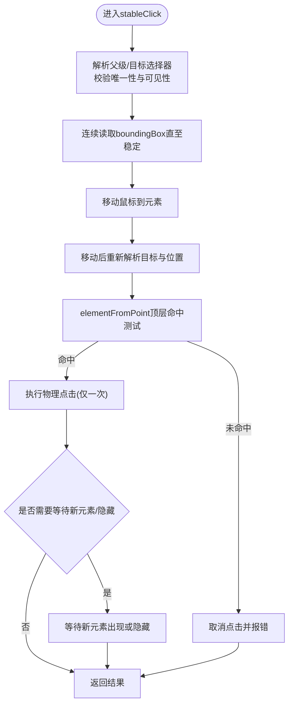
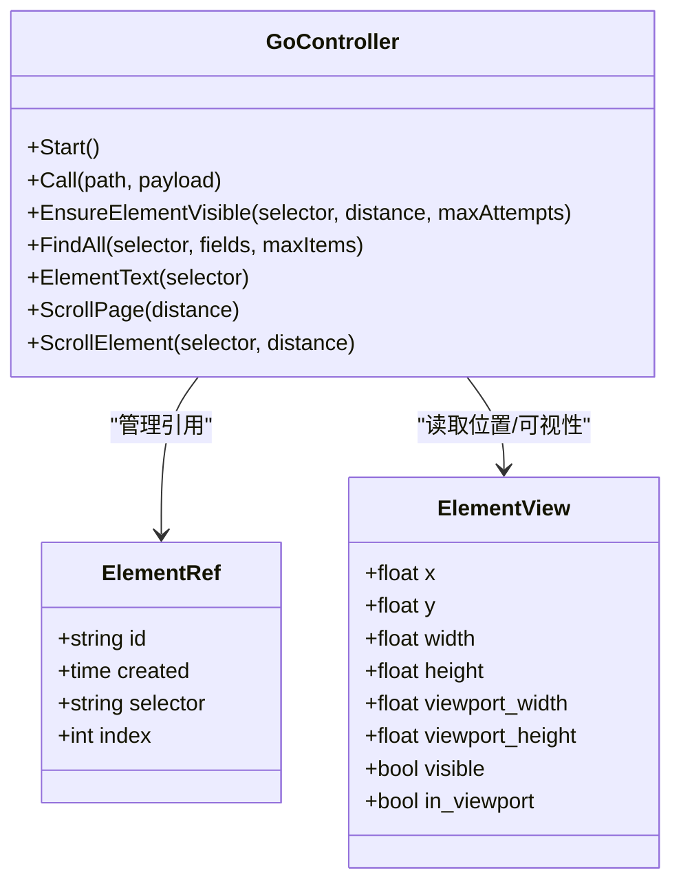
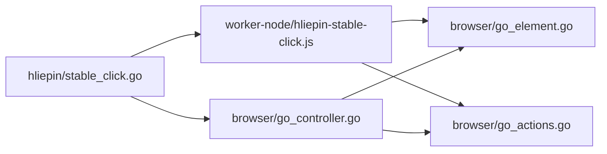

# 稳定点击机制

<cite>
**本文引用的文件**
- [stable_click.go](file://goodhr5/local-agent-go/internal/platforms/hliepin/stable_click.go)
- [hliepin-stable-click.js](file://goodhr5/local-agent-go/worker-node/src/hliepin-stable-click.js)
- [hliepin-stable-click.test.js](file://goodhr5/local-agent-go/worker-node/src/hliepin-stable-click.test.js)
- [go_element.go](file://goodhr5/local-agent-go/internal/browser/go_element.go)
- [go_actions.go](file://goodhr5/local-agent-go/internal/browser/go_actions.go)
- [go_controller.go](file://goodhr5/local-agent-go/internal/browser/go_controller.go)
- [helpers.go](file://goodhr5/local-agent-go/internal/platforms/hliepin/helpers.go)
- [runtime.go](file://goodhr5/local-agent-go/internal/platforms/hliepin/runtime.go)
- [error_policy.go](file://goodhr5/local-agent-go/internal/positionrunner/error_policy.go)
</cite>

## 目录
1. [简介](#简介)
2. [项目结构](#项目结构)
3. [核心组件](#核心组件)
4. [架构总览](#架构总览)
5. [详细组件分析](#详细组件分析)
6. [依赖关系分析](#依赖关系分析)
7. [性能与资源优化](#性能与资源优化)
8. [故障排查指南](#故障排查指南)
9. [结论](#结论)

## 简介
本文件面向猎聘平台（含猎头端）的“稳定点击”能力，系统性解析其点击稳定性保障算法、元素可见性检测、动态元素等待策略、点击重试与防抖、并发控制、页面状态验证、点击结果确认以及异常恢复策略。同时给出性能优化、资源占用控制与内存管理的实践建议，帮助读者在复杂弹层与抽屉动画场景下实现高可靠、低误触的点击执行。

## 项目结构
围绕猎聘稳定点击，代码分布在三层：
- 平台适配层（Go）：负责组装唯一父级选择器、构造稳定点击载荷、记录诊断日志并调用 Worker。
- Worker 层（Node/JS）：实现父子唯一定位、位置稳定复核、鼠标移动后二次校验、物理点击与点击后状态确认。
- 浏览器控制层（Go）：提供元素查找、可视性判断、滚动入视口、截图等基础能力，支撑上层动作。

图表来源
- [stable_click.go:1-82](file://goodhr5/local-agent-go/internal/platforms/hliepin/stable_click.go#L1-L82)
- [hliepin-stable-click.js:1-233](file://goodhr5/local-agent-go/worker-node/src/hliepin-stable-click.js#L1-L233)
- [go_element.go:1-330](file://goodhr5/local-agent-go/internal/browser/go_element.go#L1-L330)
- [go_actions.go:1-184](file://goodhr5/local-agent-go/internal/browser/go_actions.go#L1-L184)
- [go_controller.go:1-374](file://goodhr5/local-agent-go/internal/browser/go_controller.go#L1-L374)

章节来源
- [stable_click.go:1-82](file://goodhr5/local-agent-go/internal/platforms/hliepin/stable_click.go#L1-L82)
- [hliepin-stable-click.js:1-233](file://goodhr5/local-agent-go/worker-node/src/hliepin-stable-click.js#L1-L233)
- [go_element.go:1-330](file://goodhr5/local-agent-go/internal/browser/go_element.go#L1-L330)
- [go_actions.go:1-184](file://goodhr5/local-agent-go/internal/browser/go_actions.go#L1-L184)
- [go_controller.go:1-374](file://goodhr5/local-agent-go/internal/browser/go_controller.go#L1-L374)

## 核心组件
- 平台适配层（Go）
  - 唯一父级选择器生成：基于候选人平台 ID 构造稳定行父级选择器，避免全局按钮误命中。
  - 稳定点击载荷构建：注入动作 ID、稳定检查次数、间隔、超时、位置容差、最大移动尝试次数等参数。
  - 诊断日志：记录开始、完成、失败、重试计数与耗时。
- Worker 层（Node/JS）
  - 父子唯一定位：校验父级数量=1且可见；目标数量=1或按索引定位；可选嵌套子元素。
  - 文本匹配：支持忽略字间空白与精确匹配，兼容猎聘按钮展示空白。
  - 位置稳定复核：连续多次读取 boundingBox，直到稳定或超时。
  - 移动后二次校验：移动鼠标后重新解析目标与位置，确保未位移。
  - 顶层命中测试：使用 elementFromPoint 验证落点仍为目标，防止弹层遮挡。
  - 物理点击与结果确认：仅一次物理点击；可等待新元素出现或隐藏以确认点击结果。
- 浏览器控制层（Go）
  - 元素查找与可视性：支持可见过滤、字段提取、引用缓存。
  - 滚动入视口：通过真实滚轮将元素滚动到当前视口，返回尝试过程与最终视图信息。
  - 控制器路由：统一封装浏览器操作为 Worker 风格 API，便于上层调用。

章节来源
- [stable_click.go:15-82](file://goodhr5/local-agent-go/internal/platforms/hliepin/stable_click.go#L15-L82)
- [hliepin-stable-click.js:51-233](file://goodhr5/local-agent-go/worker-node/src/hliepin-stable-click.js#L51-L233)
- [go_element.go:12-105](file://goodhr5/local-agent-go/internal/browser/go_element.go#L12-L105)
- [go_actions.go:11-56](file://goodhr5/local-agent-go/internal/browser/go_actions.go#L11-L56)
- [go_controller.go:259-335](file://goodhr5/local-agent-go/internal/browser/go_controller.go#L259-L335)

## 架构总览
猎聘稳定点击采用“平台适配层 + Worker + 浏览器控制层”的分层协作模式。平台适配层负责业务语义与参数装配，Worker 负责页面内稳定的定位、等待与点击，浏览器控制层提供底层 DOM 与交互能力。

图表来源
- [stable_click.go:46-82](file://goodhr5/local-agent-go/internal/platforms/hliepin/stable_click.go#L46-L82)
- [hliepin-stable-click.js:124-233](file://goodhr5/local-agent-go/worker-node/src/hliepin-stable-click.js#L124-L233)
- [go_element.go:184-216](file://goodhr5/local-agent-go/internal/browser/go_element.go#L184-L216)
- [go_actions.go:11-56](file://goodhr5/local-agent-go/internal/browser/go_actions.go#L11-L56)

## 详细组件分析

### 平台适配层：唯一父级与稳定点击载荷
- 唯一父级选择器：基于候选人平台 ID 生成稳定行父级选择器，禁止退回全局按钮选择器，降低多候选项误命中风险。
- 载荷参数：包含动作 ID、父级/目标选择器、稳定检查次数、间隔、超时、位置容差、最大移动尝试次数、超时等。
- 诊断日志：记录开始、完成、失败、重试次数与耗时，便于问题回溯。

图表来源
- [stable_click.go:37-82](file://goodhr5/local-agent-go/internal/platforms/hliepin/stable_click.go#L37-L82)
- [helpers.go:9-36](file://goodhr5/local-agent-go/internal/platforms/hliepin/helpers.go#L9-L36)

章节来源
- [stable_click.go:15-82](file://goodhr5/local-agent-go/internal/platforms/hliepin/stable_click.go#L15-L82)
- [helpers.go:9-36](file://goodhr5/local-agent-go/internal/platforms/hliepin/helpers.go#L9-L36)

### Worker 层：稳定点击主流程
- 父子唯一定位：校验父级数量=1且可见；目标数量=1或按索引定位；支持嵌套子元素。
- 文本匹配：支持忽略字间空白与精确匹配，兼容猎聘按钮展示空白。
- 位置稳定复核：连续多次读取 boundingBox，直到稳定或超时。
- 移动后二次校验：移动鼠标后重新解析目标与位置，确保未位移。
- 顶层命中测试：使用 elementFromPoint 验证落点仍为目标，防止弹层遮挡。
- 物理点击与结果确认：仅一次物理点击；可等待新元素出现或隐藏以确认点击结果。

图表来源
- [hliepin-stable-click.js:51-233](file://goodhr5/local-agent-go/worker-node/src/hliepin-stable-click.js#L51-L233)

章节来源
- [hliepin-stable-click.js:51-233](file://goodhr5/local-agent-go/worker-node/src/hliepin-stable-click.js#L51-L233)
- [hliepin-stable-click.test.js:41-115](file://goodhr5/local-agent-go/worker-node/src/hliepin-stable-click.test.js#L41-L115)

### 浏览器控制层：可视性与滚动入视口
- 可视性检测：通过 getBoundingClientRect 与 computedStyle 判断元素可见与是否在视口内。
- 滚动入视口：使用真实滚轮将元素滚动到当前视口，返回每次尝试的视图信息与最终结果。
- 控制器路由：统一封装浏览器操作为 Worker 风格 API，便于上层调用。

图表来源
- [go_controller.go:109-194](file://goodhr5/local-agent-go/internal/browser/go_controller.go#L109-L194)
- [go_element.go:184-216](file://goodhr5/local-agent-go/internal/browser/go_element.go#L184-L216)
- [go_actions.go:11-56](file://goodhr5/local-agent-go/internal/browser/go_actions.go#L11-L56)

章节来源
- [go_element.go:12-105](file://goodhr5/local-agent-go/internal/browser/go_element.go#L12-L105)
- [go_actions.go:11-56](file://goodhr5/local-agent-go/internal/browser/go_actions.go#L11-L56)
- [go_controller.go:259-335](file://goodhr5/local-agent-go/internal/browser/go_controller.go#L259-L335)

### 猎聘特有策略与配置
- 弹层与抽屉动画期间的父子唯一定位：通过父级选择器限定作用域，避免跨弹层命中同类元素。
- 文本归一化：支持忽略字间空白与精确匹配，兼容猎聘按钮展示空白。
- 稳定点击参数：默认稳定检查次数、间隔、超时、位置容差、最大移动尝试次数等，可在载荷中覆盖。

章节来源
- [hliepin-stable-click.js:33-97](file://goodhr5/local-agent-go/worker-node/src/hliepin-stable-click.js#L33-L97)
- [hliepin-stable-click.js:99-122](file://goodhr5/local-agent-go/worker-node/src/hliepin-stable-click.js#L99-L122)
- [hliepin-stable-click.test.js:52-74](file://goodhr5/local-agent-go/worker-node/src/hliepin-stable-click.test.js#L52-L74)

## 依赖关系分析
- 平台适配层依赖 Worker 的稳定点击接口，并通过浏览器控制层提供的能力进行辅助（如可视性、滚动）。
- Worker 依赖浏览器控制层的元素查询、可视性、滚动与点击能力。
- 浏览器控制层提供统一的 API 路由，屏蔽底层差异，向上层暴露一致的行为。

图表来源
- [stable_click.go:46-82](file://goodhr5/local-agent-go/internal/platforms/hliepin/stable_click.go#L46-L82)
- [hliepin-stable-click.js:124-233](file://goodhr5/local-agent-go/worker-node/src/hliepin-stable-click.js#L124-L233)
- [go_controller.go:259-335](file://goodhr5/local-agent-go/internal/browser/go_controller.go#L259-L335)

章节来源
- [stable_click.go:46-82](file://goodhr5/local-agent-go/internal/platforms/hliepin/stable_click.go#L46-L82)
- [hliepin-stable-click.js:124-233](file://goodhr5/local-agent-go/worker-node/src/hliepin-stable-click.js#L124-L233)
- [go_controller.go:259-335](file://goodhr5/local-agent-go/internal/browser/go_controller.go#L259-L335)

## 性能与资源优化
- 减少无效 DOM 查询：优先使用唯一父级选择器缩小范围，避免全局扫描。
- 合理设置稳定检查参数：稳定检查次数、间隔与超时需平衡速度与鲁棒性，过大导致延迟，过小导致误判。
- 控制滚动频率：滚动入视口时限制最大尝试次数与间隔，避免频繁滚动造成卡顿。
- 复用元素引用：通过元素引用缓存减少重复查找，注意及时清理过期引用。
- 最小化截图与日志：仅在必要时截图，日志输出控制级别与频率，避免 I/O 瓶颈。
- 并发控制：同一页面内串行执行稳定点击，避免多线程竞争导致的 DOM 状态不一致。

[本节为通用指导，不直接分析具体文件]

## 故障排查指南
- 父级/目标数量异常：检查选择器与作用域是否正确，确保父级唯一且可见。
- 目标不可见：先滚动入视口再执行稳定点击，或调整可视性检测逻辑。
- 文字不匹配：启用忽略字间空白或精确匹配，核对预期文案与实际文案。
- 位置不稳定：增加稳定检查次数或延长超时时间，检查页面是否存在持续动画。
- 移动后位移：增大位置容差或减少移动幅度，确保鼠标落点在最新框内。
- 被弹层遮挡：等待弹层消失或切换焦点后再执行点击，或使用顶层命中测试结果。
- 点击后状态未变化：配置 wait_for_selector 或 wait_for_hidden_selector 以确认结果。
- 连续错误停止运行：当同一环节连续出现相同错误达到阈值时，岗位运行自动停止，需修复上游问题。

章节来源
- [hliepin-stable-click.js:51-233](file://goodhr5/local-agent-go/worker-node/src/hliepin-stable-click.js#L51-L233)
- [go_actions.go:11-56](file://goodhr5/local-agent-go/internal/browser/go_actions.go#L11-L56)
- [error_policy.go:87-119](file://goodhr5/local-agent-go/internal/positionrunner/error_policy.go#L87-L119)

## 结论
猎聘平台的稳定点击机制通过“唯一父级选择器 + 位置稳定复核 + 移动后二次校验 + 顶层命中测试 + 结果确认”的多重保障，有效应对弹层与抽屉动画带来的不确定性。配合浏览器控制层的可视性检测与滚动入视口能力，实现了高可靠、低误触的点击执行。建议在工程实践中合理配置稳定检查参数、控制滚动频率与日志输出，并结合错误策略实现异常恢复与自动停止，从而提升整体运行的稳定性与效率。