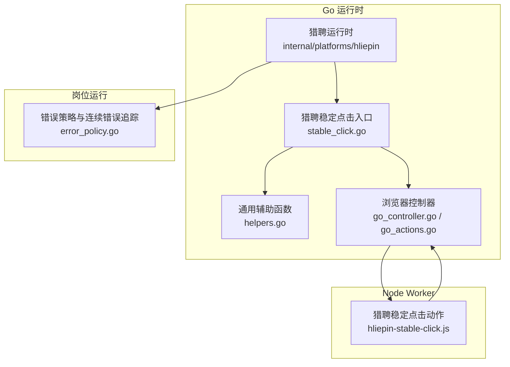
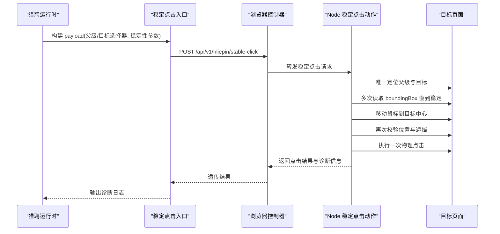
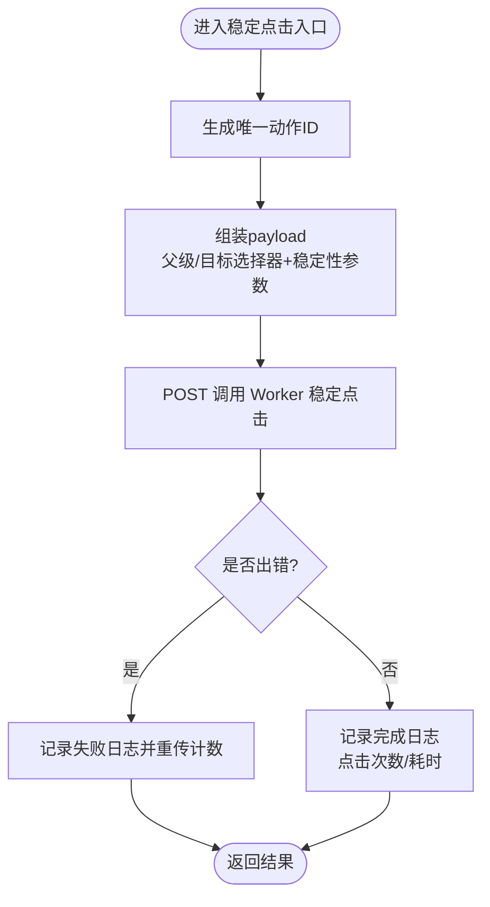
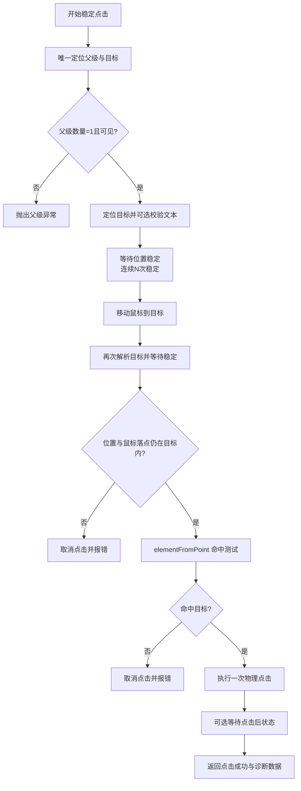
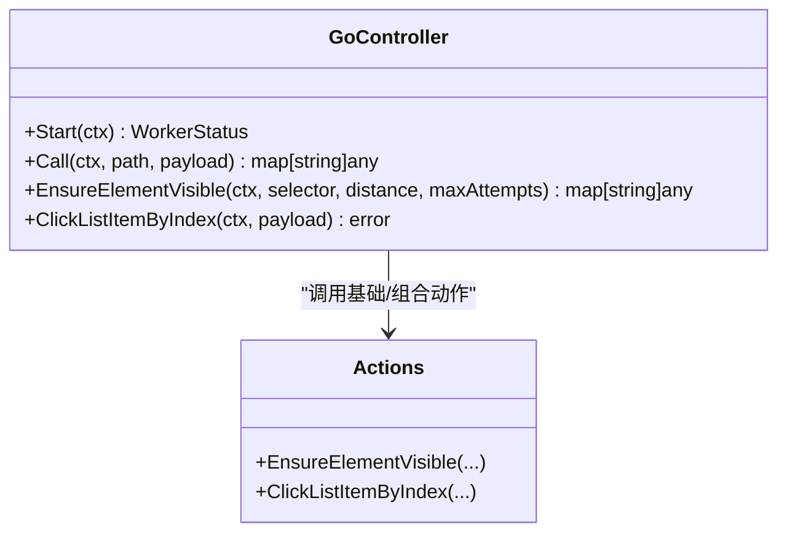
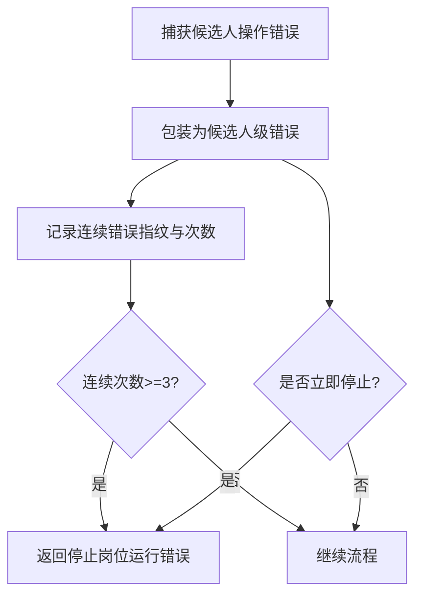
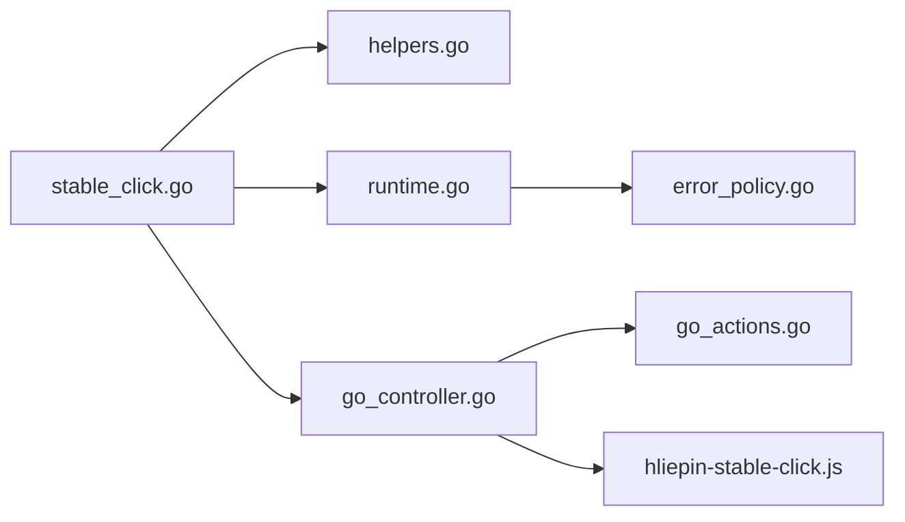

# 稳定点击机制

<cite>
**本文引用的文件**   
- [stable_click.go](file://goodhr5/local-agent-go/internal/platforms/hliepin/stable_click.go)
- [hliepin-stable-click.js](file://goodhr5/local-agent-go/worker-node/src/hliepin-stable-click.js)
- [go_actions.go](file://goodhr5/local-agent-go/internal/browser/go_actions.go)
- [go_controller.go](file://goodhr5/local-agent-go/internal/browser/go_controller.go)
- [runtime.go](file://goodhr5/local-agent-go/internal/platforms/hliepin/runtime.go)
- [helpers.go](file://goodhr5/local-agent-go/internal/platforms/hliepin/helpers.go)
- [error_policy.go](file://goodhr5/local-agent-go/internal/positionrunner/error_policy.go)
</cite>

## 目录
1. [引言](#引言)
2. [项目结构](#项目结构)
3. [核心组件](#核心组件)
4. [架构总览](#架构总览)
5. [详细组件分析](#详细组件分析)
6. [依赖关系分析](#依赖关系分析)
7. [性能与资源控制](#性能与资源控制)
8. [故障排查指南](#故障排查指南)
9. [结论](#结论)

## 引言
本文件面向猎聘平台（含猎聘猎头端）的稳定点击机制，系统性解析其“父子唯一选择器 + 位置稳定复核 + 单次安全点击”的算法设计，覆盖元素可见性检测、动态弹层等待、点击重试与防抖、并发控制、页面状态验证、点击结果确认以及异常恢复策略。同时给出性能优化、资源占用控制和内存管理的技术方案，帮助读者在复杂动态页面中实现高可靠、低误触的自动化点击。

## 项目结构
猎聘稳定点击由 Go 侧运行时组装参数并发起调用，Node Worker 侧执行具体 DOM 操作、稳定性校验和物理点击。Go 浏览器控制器提供底层能力封装，岗位运行错误策略提供统一错误处理与停止条件。

**图示来源**
- [stable_click.go:1-82](file://goodhr5/local-agent-go/internal/platforms/hliepin/stable_click.go#L1-L82)
- [hliepin-stable-click.js:1-233](file://goodhr5/local-agent-go/worker-node/src/hliepin-stable-click.js#L1-L233)
- [go_controller.go:253-335](file://goodhr5/local-agent-go/internal/browser/go_controller.go#L253-L335)
- [go_actions.go:10-56](file://goodhr5/local-agent-go/internal/browser/go_actions.go#L10-L56)
- [error_policy.go:1-119](file://goodhr5/local-agent-go/internal/positionrunner/error_policy.go#L1-L119)

**章节来源**
- [stable_click.go:1-82](file://goodhr5/local-agent-go/internal/platforms/hliepin/stable_click.go#L1-L82)
- [hliepin-stable-click.js:1-233](file://goodhr5/local-agent-go/worker-node/src/hliepin-stable-click.js#L1-L233)
- [go_controller.go:253-335](file://goodhr5/local-agent-go/internal/browser/go_controller.go#L253-L335)
- [go_actions.go:10-56](file://goodhr5/local-agent-go/internal/browser/go_actions.go#L10-L56)
- [error_policy.go:1-119](file://goodhr5/local-agent-go/internal/positionrunner/error_policy.go#L1-L119)

## 核心组件
- 猎聘稳定点击入口：负责生成唯一动作 ID、构造 payload、调用 Worker 稳定点击接口，并记录诊断日志。
- Node 侧稳定点击动作：实现父子唯一定位、位置稳定检测、鼠标移动后二次校验、遮挡检测、单次物理点击与可选后置状态等待。
- 浏览器控制器：封装页面、元素、滚动、截图等基础能力，并提供兼容路由。
- 猎聘运行时与辅助函数：提供候选人 ID 规范化、选择器拼装、Worker 响应解析等工具。
- 错误策略：统一候选人级错误包装、连续错误计数与岗位停止条件判断。

**章节来源**
- [stable_click.go:15-82](file://goodhr5/local-agent-go/internal/platforms/hliepin/stable_click.go#L15-L82)
- [hliepin-stable-click.js:39-232](file://goodhr5/local-agent-go/worker-node/src/hliepin-stable-click.js#L39-L232)
- [go_controller.go:109-122](file://goodhr5/local-agent-go/internal/browser/go_controller.go#L109-L122)
- [helpers.go:75-99](file://goodhr5/local-agent-go/internal/platforms/hliepin/helpers.go#L75-L99)
- [error_policy.go:15-99](file://goodhr5/local-agent-go/internal/positionrunner/error_policy.go#L15-L99)

## 架构总览
猎聘稳定点击采用“Go 编排 + Node 执行”的双端协作模式：
- Go 侧将猎聘特有的父子唯一选择器与稳定性参数打包为 payload，通过内部 API 路由下发到 Node Worker。
- Node Worker 在真实页面环境中完成 DOM 定位、动画稳定等待、鼠标移动与命中测试，最终触发一次人类化点击。
- 浏览器控制器作为底层能力提供者，屏蔽不同 Worker 模式的差异，向上暴露统一方法。
- 岗位运行错误策略对候选人级错误进行归一化与连续错误统计，达到阈值时自动停止岗位运行，避免持续失败。

**图示来源**
- [stable_click.go:46-82](file://goodhr5/local-agent-go/internal/platforms/hliepin/stable_click.go#L46-L82)
- [hliepin-stable-click.js:124-229](file://goodhr5/local-agent-go/worker-node/src/hliepin-stable-click.js#L124-L229)
- [go_controller.go:259-335](file://goodhr5/local-agent-go/internal/browser/go_controller.go#L259-L335)

## 详细组件分析

### 猎聘稳定点击入口（Go）
- 唯一动作 ID：基于时间戳与原子计数器生成贯穿重发的诊断 ID，便于跨层追踪。
- 父子唯一选择器：使用猎聘候选人平台 ID 生成唯一父行选择器，禁止回退到全局按钮选择器，降低误命中风险。
- 稳定性参数：默认三次稳定检查、120ms 间隔、5s 超时、2px 位置容差、最多 3 次位移重试。
- 诊断日志：记录开始、失败、完成及实际点击次数、传输重发次数与耗时。

**图示来源**
- [stable_click.go:32-82](file://goodhr5/local-agent-go/internal/platforms/hliepin/stable_click.go#L32-L82)

**章节来源**
- [stable_click.go:15-82](file://goodhr5/local-agent-go/internal/platforms/hliepin/stable_click.go#L15-L82)
- [helpers.go:75-99](file://goodhr5/local-agent-go/internal/platforms/hliepin/helpers.go#L75-L99)

### Node 侧稳定点击动作
- 唯一定位：先校验父级数量为 1 且可见，再在父级内定位目标；支持嵌套选择器与索引选择。
- 文本校验：可选按包含或精确匹配目标文字，忽略空白或严格比较。
- 位置稳定：循环读取 boundingBox，要求连续 N 次位置变化小于容差，否则抛出“未稳定”错误。
- 移动与二次校验：移动鼠标后重新解析目标与稳定框，若发生位移超过容差则取消点击。
- 遮挡检测：使用 elementFromPoint 验证落点仍属于目标元素，防止弹层或抽屉遮挡导致误点。
- 单次点击：仅执行一次人类化点击，并记录 hold_ms 等诊断字段。
- 后置状态等待：可选等待新元素出现或旧元素隐藏，确保点击后的页面状态符合预期。

**图示来源**
- [hliepin-stable-click.js:51-97](file://goodhr5/local-agent-go/worker-node/src/hliepin-stable-click.js#L51-L97)
- [hliepin-stable-click.js:99-122](file://goodhr5/local-agent-go/worker-node/src/hliepin-stable-click.js#L99-L122)
- [hliepin-stable-click.js:124-229](file://goodhr5/local-agent-go/worker-node/src/hliepin-stable-click.js#L124-L229)

**章节来源**
- [hliepin-stable-click.js:1-233](file://goodhr5/local-agent-go/worker-node/src/hliepin-stable-click.js#L1-L233)

### 浏览器控制器与可见性保障
- 元素可见性：提供 EnsureElementVisible，使用真实滚轮将元素滚动至视口，并返回尝试次数与最终视图信息。
- 列表点击：提供 ClickListItemByIndex，组合 FindAll、ScrollElement、ClickElement 完成列表项点击。
- 路由兼容：Go 控制器通过 Call 方法将 Node Worker 风格路由映射到底层能力，保证上层调用一致性。

**图示来源**
- [go_controller.go:109-122](file://goodhr5/local-agent-go/internal/browser/go_controller.go#L109-L122)
- [go_actions.go:10-56](file://goodhr5/local-agent-go/internal/browser/go_actions.go#L10-L56)
- [go_actions.go:58-80](file://goodhr5/local-agent-go/internal/browser/go_actions.go#L58-L80)

**章节来源**
- [go_controller.go:253-335](file://goodhr5/local-agent-go/internal/browser/go_controller.go#L253-L335)
- [go_actions.go:10-80](file://goodhr5/local-agent-go/internal/browser/go_actions.go#L10-L80)

### 猎聘运行时与辅助函数
- 运行时：维护平台标识、当前岗位名称、开聊弹窗是否需要选择岗位等上下文。
- 辅助函数：提供 Worker 响应 data 字段解析、map 转换、候选人名提取、文本规范化等工具，支撑稳定点击的参数构造与日志输出。

**章节来源**
- [runtime.go:10-51](file://goodhr5/local-agent-go/internal/platforms/hliepin/runtime.go#L10-L51)
- [helpers.go:9-110](file://goodhr5/local-agent-go/internal/platforms/hliepin/helpers.go#L9-L110)
- [helpers.go:112-207](file://goodhr5/local-agent-go/internal/platforms/hliepin/helpers.go#L112-L207)

### 错误策略与异常恢复
- 候选人级错误包装：将平台操作错误包装为 candidateOperationError，保留原始错误以便 Unwrap。
- 连续错误追踪：按平台环节指纹统计连续相同错误次数，达到阈值（默认 3）时返回停止岗位运行的错误。
- 立即停止条件：当错误属于 AI 岗位停止错误或浏览器关闭导致的岗位错误时，立即停止。
- OCR 致命错误识别：针对 OCR 组件未配置、未安装、模型不完整等场景快速识别并上报。

**图示来源**
- [error_policy.go:15-99](file://goodhr5/local-agent-go/internal/positionrunner/error_policy.go#L15-L99)
- [error_policy.go:101-119](file://goodhr5/local-agent-go/internal/positionrunner/error_policy.go#L101-L119)

**章节来源**
- [error_policy.go:1-119](file://goodhr5/local-agent-go/internal/positionrunner/error_policy.go#L1-L119)

## 依赖关系分析
- 猎聘稳定点击入口依赖运行时与辅助函数以构造 payload，并通过浏览器控制器调用 Node Worker。
- Node 稳定点击动作依赖页面定位、滚动、鼠标移动与点击能力，这些能力由浏览器控制器提供。
- 岗位运行错误策略独立于点击流程，但会消费点击过程中产生的候选人级错误，决定是否继续运行。

**图示来源**
- [stable_click.go:1-82](file://goodhr5/local-agent-go/internal/platforms/hliepin/stable_click.go#L1-L82)
- [helpers.go:75-99](file://goodhr5/local-agent-go/internal/platforms/hliepin/helpers.go#L75-L99)
- [runtime.go:10-51](file://goodhr5/local-agent-go/internal/platforms/hliepin/runtime.go#L10-L51)
- [go_controller.go:253-335](file://goodhr5/local-agent-go/internal/browser/go_controller.go#L253-L335)
- [go_actions.go:10-80](file://goodhr5/local-agent-go/internal/browser/go_actions.go#L10-L80)
- [hliepin-stable-click.js:1-233](file://goodhr5/local-agent-go/worker-node/src/hliepin-stable-click.js#L1-L233)
- [error_policy.go:1-119](file://goodhr5/local-agent-go/internal/positionrunner/error_policy.go#L1-L119)

**章节来源**
- [stable_click.go:1-82](file://goodhr5/local-agent-go/internal/platforms/hliepin/stable_click.go#L1-L82)
- [hliepin-stable-click.js:1-233](file://goodhr5/local-agent-go/worker-node/src/hliepin-stable-click.js#L1-L233)
- [go_controller.go:253-335](file://goodhr5/local-agent-go/internal/browser/go_controller.go#L253-L335)
- [go_actions.go:10-80](file://goodhr5/local-agent-go/internal/browser/go_actions.go#L10-L80)
- [error_policy.go:1-119](file://goodhr5/local-agent-go/internal/positionrunner/error_policy.go#L1-L119)

## 性能与资源控制
- 稳定性检测节流：通过 stability_interval 控制读取频率，避免频繁 DOM 查询造成渲染抖动与 CPU 占用过高。
- 超时与重试上限：stability_timeout 与 max_move_attempts 限制最长等待与位移重试次数，防止无限阻塞。
- 位置容差：position_tolerance 控制稳定判定阈值，兼顾动画结束与布局抖动，减少无效重试。
- 单次点击：确保只触发一次 humanMouseClick，避免重复点击导致的 UI 状态混乱与额外开销。
- 后置等待最小化：仅在配置 wait_for_selector 或 wait_for_hidden_selector 时执行等待，避免不必要的页面交互。
- 滚动可见性优化：使用 EnsureElementVisible 的真实滚轮方式将元素滚动至视口，减少因视口外元素不可见导致的点击失败。
- 内存与引用管理：Go 控制器维护元素引用缓存，配合 ClearElementRefs 清理不再使用的引用，降低内存增长风险。
- 日志诊断精简：仅输出必要诊断字段（动作 ID、阶段、坐标、点击次数），避免大量字符串拼接造成的 GC 压力。

[本节为通用性能建议，不直接分析具体文件]

## 故障排查指南
- 父级或目标选择器为空：检查 payload 中的 parent_selector 与 target_selector 是否正确传入。
- 父级数量异常：确认猎聘候选人平台 ID 是否有效，确保唯一父行选择器能匹配到且仅匹配到一个可见父级。
- 目标数量异常或不可见：检查 nested_selector 与 target_index 配置，确认目标在当前弹层或抽屉中可见。
- 目标文字不匹配：核对 expected_text 与 exact_text 配置，必要时启用 normalize_text_whitespace 以忽略空白差异。
- 位置未稳定：增大 stability_checks 或 stability_interval，或提高 stability_timeout；检查页面是否存在持续动画。
- 鼠标移动后位移：适当增大 position_tolerance 或 max_move_attempts；确认弹层动画已结束。
- 目标被遮挡：检查是否有聊天框、抽屉或其他弹层遮挡；必要时调整页面层级或等待弹层关闭。
- 点击后状态未满足：检查 wait_for_selector 或 wait_for_hidden_selector 配置是否正确，必要时延长 wait_timeout。
- 连续错误导致岗位停止：查看 error_policy 的连续错误计数，定位具体平台环节的错误指纹，修复根因后重置计数。

**章节来源**
- [hliepin-stable-click.js:51-97](file://goodhr5/local-agent-go/worker-node/src/hliepin-stable-click.js#L51-L97)
- [hliepin-stable-click.js:99-122](file://goodhr5/local-agent-go/worker-node/src/hliepin-stable-click.js#L99-L122)
- [hliepin-stable-click.js:124-229](file://goodhr5/local-agent-go/worker-node/src/hliepin-stable-click.js#L124-L229)
- [error_policy.go:37-99](file://goodhr5/local-agent-go/internal/positionrunner/error_policy.go#L37-L99)

## 结论
猎聘平台的稳定点击机制通过“父子唯一选择器 + 位置稳定复核 + 单次安全点击”的组合策略，有效应对弹层动画、抽屉遮挡与动态布局带来的点击不稳定问题。Go 侧负责参数编排与诊断日志，Node 侧负责 DOM 精确定位与物理点击，浏览器控制器提供底层能力抽象，岗位运行错误策略提供统一的异常恢复与停止保护。该架构在保证高可靠性的同时，兼顾了性能与资源控制，适合在复杂招聘平台场景中规模化应用。