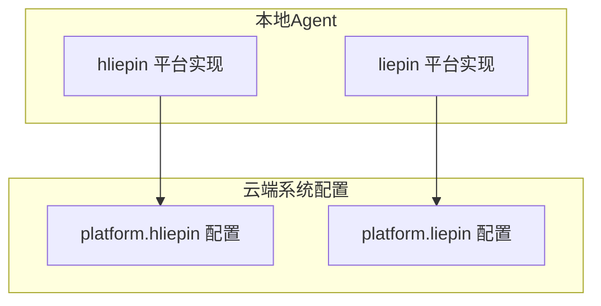
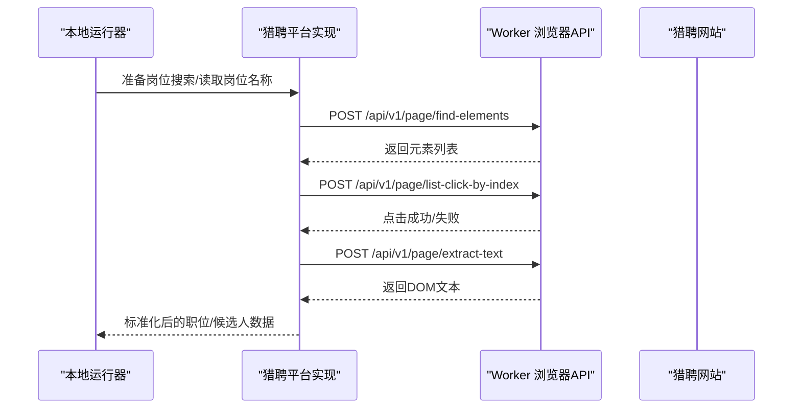
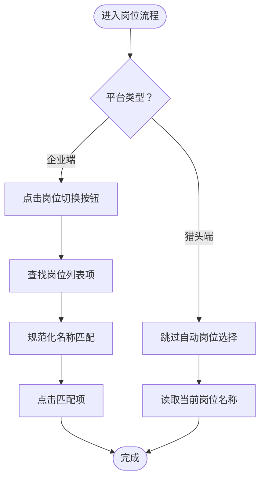
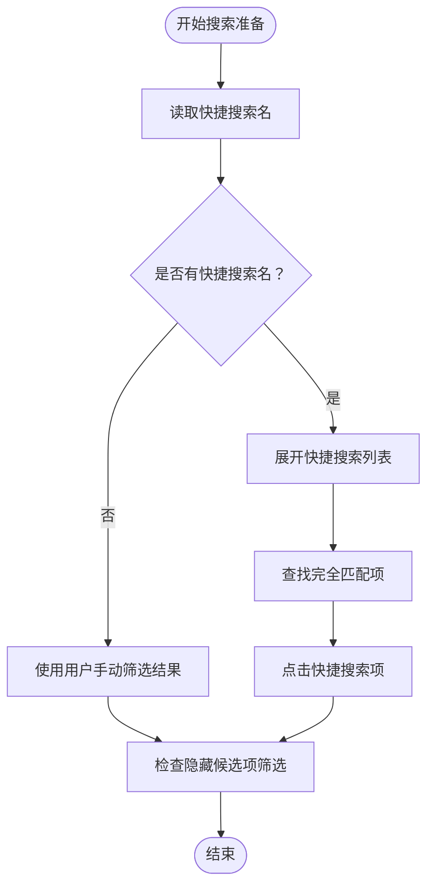
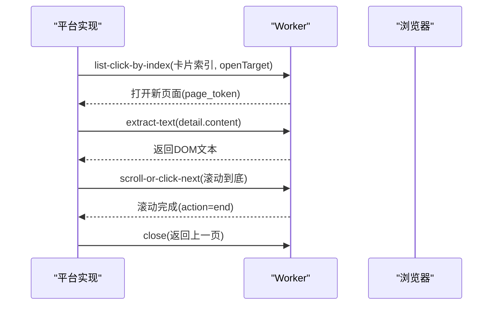
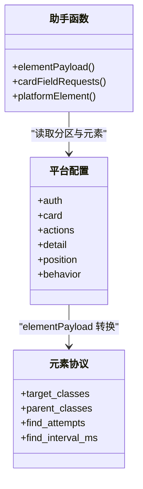
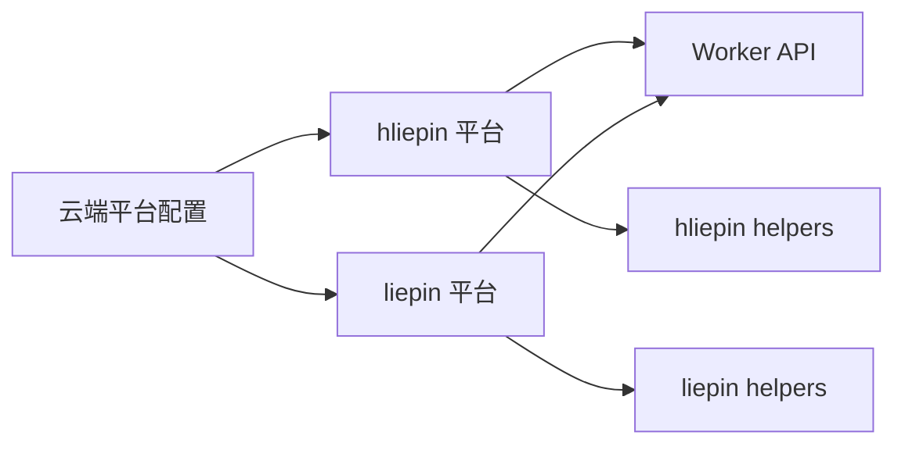

# 职位管理

<cite>
**本文引用的文件**   
- [position.go](file://goodhr5/local-agent-go/internal/platforms/hliepin/position.go)
- [search.go](file://goodhr5/local-agent-go/internal/platforms/hliepin/search.go)
- [detail.go](file://goodhr5/local-agent-go/internal/platforms/hliepin/detail.go)
- [helpers.go](file://goodhr5/local-agent-go/internal/platforms/hliepin/helpers.go)
- [position.go](file://goodhr5/local-agent-go/internal/platforms/liepin/position.go)
- [detail.go](file://goodhr5/local-agent-go/internal/platforms/liepin/detail.go)
- [helpers.go](file://goodhr5/local-agent-go/internal/platforms/liepin/helpers.go)
- [0051_hliepin_platform_config.sql](file://goodhr5/cloud/backend/db/migrations/0051_hliepin_platform_config.sql)
- [0052_liepin_zhaopin_dom_platforms.sql](file://goodhr5/cloud/backend/db/migrations/0052_liepin_zhaopin_dom_platforms.sql)
</cite>

## 目录
1. [引言](#引言)
2. [项目结构](#项目结构)
3. [核心组件](#核心组件)
4. [架构总览](#架构总览)
5. [详细组件分析](#详细组件分析)
6. [依赖关系分析](#依赖关系分析)
7. [性能与稳定性考虑](#性能与稳定性考虑)
8. [故障排查指南](#故障排查指南)
9. [结论](#结论)
10. [附录：数据模型与字段映射](#附录数据模型与字段映射)

## 引言
本文件面向猎聘平台（含猎聘企业端与猎聘猎头端）的“职位管理”能力，聚焦以下目标：
- 职位信息提取算法：候选人卡片与详情页 DOM 文本抽取、规范化与清洗。
- 职位状态同步机制：岗位名称读取、岗位切换、开聊弹窗中的岗位选择策略。
- 职位数据格式转换逻辑：云端平台配置到本地 Worker 元素协议的统一映射。
- 猎聘网站页面 DOM 特征：卡片、详情、分页、筛选等关键节点定位。
- 动态加载处理与分页获取：滚动到底触发加载、下一页按钮检测与点击。
- 搜索条件构建与筛选规则应用：快捷搜索、发布职位、隐藏候选项筛选。
- 职位数据模型定义、字段映射关系与验证规则：候选人卡片字段、详情页文本、岗位上下文。

## 项目结构
本项目在本地 Agent Go 中为不同招聘平台提供运行时实现。与猎聘相关的代码主要分布在两个平台包：
- 猎聘猎头端：internal/platforms/hliepin
- 猎聘企业端：internal/platforms/liepin

每个平台包包含：
- position.go：岗位上下文与岗位切换
- search.go（仅猎头端）：搜索入口与筛选策略
- detail.go：候选人详情页打开、滚动、关闭与文本提取
- helpers.go：通用工具函数与平台配置解析

图表来源
- [0051_hliepin_platform_config.sql:1-103](file://goodhr5/cloud/backend/db/migrations/0051_hliepin_platform_config.sql#L1-L103)
- [0052_liepin_zhaopin_dom_platforms.sql:1-187](file://goodhr5/cloud/backend/db/migrations/0052_liepin_zhaopin_dom_platforms.sql#L1-L187)

章节来源
- [position.go:1-41](file://goodhr5/local-agent-go/internal/platforms/hliepin/position.go#L1-L41)
- [search.go:1-247](file://goodhr5/local-agent-go/internal/platforms/hliepin/search.go#L1-L247)
- [detail.go:1-96](file://goodhr5/local-agent-go/internal/platforms/hliepin/detail.go#L1-L96)
- [helpers.go:1-207](file://goodhr5/local-agent-go/internal/platforms/hliepin/helpers.go#L1-L207)
- [position.go:1-65](file://goodhr5/local-agent-go/internal/platforms/liepin/position.go#L1-L65)
- [detail.go:1-62](file://goodhr5/local-agent-go/internal/platforms/liepin/detail.go#L1-L62)
- [helpers.go:1-207](file://goodhr5/local-agent-go/internal/platforms/liepin/helpers.go#L1-L207)

## 核心组件
- 岗位上下文与切换
  - 猎聘猎头端：跳过自动岗位选择，直接读取当前页面岗位名称；开聊弹窗时根据配置决定是否再次选择岗位。
  - 猎聘企业端：支持从下拉列表中选择岗位，按名称匹配并点击对应选项。
- 搜索与筛选
  - 猎聘猎头端：支持快捷搜索与“正在发布的职位”，但默认停用自动选择，改为使用用户手动筛选结果；同时支持勾选“隐藏已查看/已沟通/已获取联系方式”。
- 详情页处理
  - 猎聘猎头端与企业端均只支持 DOM 模式详情识别；通过新开页面或模态框打开详情，提取正文文本，并按需滚动至底部模拟浏览。
- 平台配置与元素协议
  - 云端以 JSON 配置 DOM 选择器；本地 helpers 将云端配置转换为 Worker 统一的元素协议，包括 target_classes、parent_classes、find_attempts 等。

章节来源
- [position.go:11-40](file://goodhr5/local-agent-go/internal/platforms/hliepin/position.go#L11-L40)
- [position.go:12-64](file://goodhr5/local-agent-go/internal/platforms/liepin/position.go#L12-L64)
- [search.go:22-54](file://goodhr5/local-agent-go/internal/platforms/hliepin/search.go#L22-L54)
- [detail.go:14-56](file://goodhr5/local-agent-go/internal/platforms/hliepin/detail.go#L14-L56)
- [detail.go:12-43](file://goodhr5/local-agent-go/internal/platforms/liepin/detail.go#L12-L43)
- [helpers.go:112-160](file://goodhr5/local-agent-go/internal/platforms/hliepin/helpers.go#L112-L160)
- [helpers.go:112-160](file://goodhr5/local-agent-go/internal/platforms/liepin/helpers.go#L112-L160)

## 架构总览
猎聘平台的职位管理由“云端配置 + 本地运行时 + Worker 浏览器控制”三部分构成：
- 云端系统配置：维护 platform.hliepin 与 platform.liepin 的配置，包含 DOM 选择器、行为开关（是否需要详情页、是否支持分页）、岗位相关选择器等。
- 本地运行时：平台包实现岗位、搜索、详情等流程，调用 Worker API 进行页面操作与数据提取。
- Worker 浏览器控制：执行 find-elements、extract-text、list-click-by-index、scroll-or-click-next、close 等操作。

图表来源
- [search.go:56-123](file://goodhr5/local-agent-go/internal/platforms/hliepin/search.go#L56-L123)
- [detail.go:14-56](file://goodhr5/local-agent-go/internal/platforms/hliepin/detail.go#L14-L56)
- [position.go:30-64](file://goodhr5/local-agent-go/internal/platforms/liepin/position.go#L30-L64)

## 详细组件分析

### 岗位上下文与岗位切换
- 猎聘猎头端
  - ShouldSkipPositionSelection：始终返回 true，表示不自动切换岗位。
  - CurrentPositionName：从平台配置的 position.current 选择器中提取当前岗位名称；若为空则报错。
  - SelectPosition：保留接口但不执行实际切换，因为主流程跳过岗位切换。
- 猎聘企业端
  - CurrentPositionName：同上，从 position.current 提取当前岗位名称。
  - SelectPosition：点击岗位切换按钮，展开下拉列表，遍历岗位项文本，按规范化后的名称匹配并点击。

图表来源
- [position.go:11-40](file://goodhr5/local-agent-go/internal/platforms/hliepin/position.go#L11-L40)
- [position.go:30-64](file://goodhr5/local-agent-go/internal/platforms/liepin/position.go#L30-L64)

章节来源
- [position.go:11-40](file://goodhr5/local-agent-go/internal/platforms/hliepin/position.go#L11-L40)
- [position.go:12-64](file://goodhr5/local-agent-go/internal/platforms/liepin/position.go#L12-L64)

### 搜索条件构建与筛选规则
- 快捷搜索与发布职位
  - PreparePositionSearch：读取岗位快照中的 common_config.hliepin_shortcut_search_name；若无快捷搜索名，则标记 shouldSelectGreetJob=true，并提示后续开聊弹框仍需选择岗位。
  - selectShortcutSearch：展开快捷搜索列表，查找与配置名称完全一致的项目并点击。
  - selectPublishedPosition：展开“正在发布的职位”，按岗位名称完整匹配或前缀匹配（去除省略号）。
- 隐藏候选项筛选
  - ensureHiddenCandidateFilters：依次滚动到顶部，使用 ensure-checked-by-text 勾选“隐藏已查看/已沟通/已获取联系方式”。
  - configuredHiddenCandidateFilters：根据 common_config 中的三个布尔字段决定需要勾选的标签。

图表来源
- [search.go:22-54](file://goodhr5/local-agent-go/internal/platforms/hliepin/search.go#L22-L54)
- [search.go:56-123](file://goodhr5/local-agent-go/internal/platforms/hliepin/search.go#L56-L123)
- [search.go:146-183](file://goodhr5/local-agent-go/internal/platforms/hliepin/search.go#L146-L183)

章节来源
- [search.go:22-54](file://goodhr5/local-agent-go/internal/platforms/hliepin/search.go#L22-L54)
- [search.go:56-123](file://goodhr5/local-agent-go/internal/platforms/hliepin/search.go#L56-L123)
- [search.go:146-183](file://goodhr5/local-agent-go/internal/platforms/hliepin/search.go#L146-L183)

### 详情页数据提取与滚动
- 猎聘猎头端
  - FetchCandidateDetail：校验 Mode=dom；通过 candidate.card_index 与 card.item 定位卡片，点击 openTarget 打开新页面；等待详情页加载后，从 detail.content 提取文本；返回 DetailResult{Text, Source="dom"}。
  - ScrollCandidateDetail：使用 scroll-or-click-next 连续滚轮滚动到底部，随机时长 2~5 秒，避免鼠标移动。
  - CloseCandidateDetail：通过 page_token 与 URL 片段判断回到搜索结果页。
- 猎聘企业端
  - FetchCandidateDetail：类似猎头端，但使用 liepin 的 card.item 与 openTarget。
  - CloseCandidateDetail：优先尝试 detail.closeBtn，失败则按 Escape 键关闭。

图表来源
- [detail.go:14-56](file://goodhr5/local-agent-go/internal/platforms/hliepin/detail.go#L14-L56)
- [detail.go:58-75](file://goodhr5/local-agent-go/internal/platforms/hliepin/detail.go#L58-L75)
- [detail.go:77-90](file://goodhr5/local-agent-go/internal/platforms/hliepin/detail.go#L77-L90)
- [detail.go:12-43](file://goodhr5/local-agent-go/internal/platforms/liepin/detail.go#L12-L43)
- [detail.go:45-56](file://goodhr5/local-agent-go/internal/platforms/liepin/detail.go#L45-L56)

章节来源
- [detail.go:14-56](file://goodhr5/local-agent-go/internal/platforms/hliepin/detail.go#L14-L56)
- [detail.go:58-75](file://goodhr5/local-agent-go/internal/platforms/hliepin/detail.go#L58-L75)
- [detail.go:77-90](file://goodhr5/local-agent-go/internal/platforms/hliepin/detail.go#L77-L90)
- [detail.go:12-43](file://goodhr5/local-agent-go/internal/platforms/liepin/detail.go#L12-L43)
- [detail.go:45-56](file://goodhr5/local-agent-go/internal/platforms/liepin/detail.go#L45-L56)

### 平台配置与元素协议映射
- 云端配置结构
  - auth.pages：登录入口与已登录判定
  - card.item/fields/scroll：候选人卡片定位、字段定位、滚动容器
  - actions.greetBtn/continueBtn/phoneBtn/resumeBtn/confirmBtn：交互按钮
  - detail.openTarget/content/closeBtn：详情页打开目标、内容区域、关闭按钮
  - position.current/switchBtn/list/item/itemText：岗位相关选择器
  - behavior.needsDetailPage/supportsPaging/nextPageBtn/nextPageDisabledClass：行为开关与分页
- 本地映射
  - elementPayload：将云端 target_classes/targetClasses 等字段转换为 Worker 统一协议 target_classes、parent_classes、find_attempts、find_interval_ms。
  - cardFieldRequests：将 card.fields 转为字段请求数组，供批量提取。

图表来源
- [0051_hliepin_platform_config.sql:30-93](file://goodhr5/cloud/backend/db/migrations/0051_hliepin_platform_config.sql#L30-L93)
- [0052_liepin_zhaopin_dom_platforms.sql:27-96](file://goodhr5/cloud/backend/db/migrations/0052_liepin_zhaopin_dom_platforms.sql#L27-L96)
- [helpers.go:112-160](file://goodhr5/local-agent-go/internal/platforms/hliepin/helpers.go#L112-L160)
- [helpers.go:112-160](file://goodhr5/local-agent-go/internal/platforms/liepin/helpers.go#L112-L160)

章节来源
- [0051_hliepin_platform_config.sql:30-93](file://goodhr5/cloud/backend/db/migrations/0051_hliepin_platform_config.sql#L30-L93)
- [0052_liepin_zhaopin_dom_platforms.sql:27-96](file://goodhr5/cloud/backend/db/migrations/0052_liepin_zhaopin_dom_platforms.sql#L27-L96)
- [helpers.go:112-160](file://goodhr5/local-agent-go/internal/platforms/hliepin/helpers.go#L112-L160)
- [helpers.go:112-160](file://goodhr5/local-agent-go/internal/platforms/liepin/helpers.go#L112-L160)

## 依赖关系分析
- 平台实现依赖云端配置：所有 DOM 选择器均来自 system_configs 中的 platform.hliepin 与 platform.liepin。
- 平台实现依赖 Worker API：find-elements、extract-text、list-click-by-index、scroll-or-click-next、close、press-key 等。
- 平台实现内部依赖 helpers：统一的数据解析、元素协议转换、日志摘要生成。

图表来源
- [0051_hliepin_platform_config.sql:1-103](file://goodhr5/cloud/backend/db/migrations/0051_hliepin_platform_config.sql#L1-L103)
- [0052_liepin_zhaopin_dom_platforms.sql:1-187](file://goodhr5/cloud/backend/db/migrations/0052_liepin_zhaopin_dom_platforms.sql#L1-L187)
- [helpers.go:1-207](file://goodhr5/local-agent-go/internal/platforms/hliepin/helpers.go#L1-L207)
- [helpers.go:1-207](file://goodhr5/local-agent-go/internal/platforms/liepin/helpers.go#L1-L207)

章节来源
- [helpers.go:1-207](file://goodhr5/local-agent-go/internal/platforms/hliepin/helpers.go#L1-L207)
- [helpers.go:1-207](file://goodhr5/local-agent-go/internal/platforms/liepin/helpers.go#L1-L207)

## 性能与稳定性考虑
- 动态加载处理
  - 详情页滚动：使用 scroll-or-click-next 并在 2~5 秒内滚动到底，减少鼠标移动，提升拟人化与稳定性。
  - 列表展开与等待：展开快捷搜索或发布职位后，显式 Delay 等待结果刷新。
- 分页获取策略
  - 猎聘猎头端 behavior.supportsPaging=true，nextPageBtn=".ant-pagination-next"，nextPageDisabledClass="ant-pagination-disabled"；可通过检测禁用类判断是否还有下一页。
  - 猎聘企业端 behavior.supportsPaging=false，不支持分页。
- 错误恢复
  - 详情页关闭失败时回退到 Escape 键关闭。
  - 岗位名称为空或未找到时返回明确错误信息，便于定位配置问题。

章节来源
- [detail.go:58-75](file://goodhr5/local-agent-go/internal/platforms/hliepin/detail.go#L58-L75)
- [search.go:85-88](file://goodhr5/local-agent-go/internal/platforms/hliepin/search.go#L85-L88)
- [0051_hliepin_platform_config.sql:88-93](file://goodhr5/cloud/backend/db/migrations/0051_hliepin_platform_config.sql#L88-L93)
- [0052_liepin_zhaopin_dom_platforms.sql:91-96](file://goodhr5/cloud/backend/db/migrations/0052_liepin_zhaopin_dom_platforms.sql#L91-L96)
- [detail.go:45-56](file://goodhr5/local-agent-go/internal/platforms/liepin/detail.go#L45-L56)

## 故障排查指南
- 岗位名称为空
  - 现象：CurrentPositionName 返回“页面当前岗位为空”。
  - 排查：确认 platform.position.current 选择器是否正确，页面是否存在该元素。
- 未找到快捷搜索或发布职位
  - 现象：selectShortcutSearch/selectPublishedPosition 返回未找到匹配项。
  - 排查：确认快捷搜索名是否与页面显示完全一致；发布职位名称是否被省略号截断，注意 normalizePublishedJobName 的前缀匹配逻辑。
- 详情页无法读取文本
  - 现象：FetchCandidateDetail 返回“详情页未读取到 DOM 文本”。
  - 排查：确认 detail.content 选择器是否有效；确保 Mode=dom；检查详情页是否成功打开。
- 详情页关闭失败
  - 现象：CloseCandidateDetail 失败。
  - 排查：确认 detail.closeBtn 是否存在；如不存在，系统将尝试 Escape 键关闭。

章节来源
- [position.go:16-33](file://goodhr5/local-agent-go/internal/platforms/hliepin/position.go#L16-L33)
- [position.go:13-27](file://goodhr5/local-agent-go/internal/platforms/liepin/position.go#L13-L27)
- [search.go:56-123](file://goodhr5/local-agent-go/internal/platforms/hliepin/search.go#L56-L123)
- [detail.go:14-56](file://goodhr5/local-agent-go/internal/platforms/hliepin/detail.go#L14-L56)
- [detail.go:45-56](file://goodhr5/local-agent-go/internal/platforms/liepin/detail.go#L45-L56)

## 结论
猎聘平台的职位管理通过云端配置驱动本地运行时，结合 Worker 浏览器控制，实现了稳定的岗位上下文管理、搜索筛选、详情页文本提取与滚动模拟。猎聘猎头端支持分页与更丰富的筛选能力，而猎聘企业端专注于 DOM 详情识别与简洁的岗位切换流程。整体设计强调可配置性与容错性，便于在不同页面结构与业务场景下保持稳定运行。

## 附录：数据模型与字段映射
- 候选人卡片字段（猎聘猎头端）
  - name：候选人姓名
  - basic_info：基本信息（年龄等）
  - education：学历
  - university：学校
  - description：期望/技能描述
- 候选人卡片字段（猎聘企业端）
  - name：候选人姓名
  - basic_info：基本信息
  - education：学历
  - university：学校
  - description：描述/技能/期望
- 详情页文本
  - Source="dom"，Text 为从 detail.content 提取并清理后的正文文本。
- 岗位上下文
  - CurrentPositionName：当前页面岗位名称
  - SelectPosition：按名称匹配并点击岗位列表项（企业端）
- 行为配置
  - needsDetailPage：是否需要详情页
  - supportsPaging：是否支持分页
  - nextPageBtn：下一页按钮选择器
  - nextPageDisabledClass：下一页禁用类名

章节来源
- [0051_hliepin_platform_config.sql:30-93](file://goodhr5/cloud/backend/db/migrations/0051_hliepin_platform_config.sql#L30-L93)
- [0052_liepin_zhaopin_dom_platforms.sql:27-96](file://goodhr5/cloud/backend/db/migrations/0052_liepin_zhaopin_dom_platforms.sql#L27-L96)
- [detail.go:14-56](file://goodhr5/local-agent-go/internal/platforms/hliepin/detail.go#L14-L56)
- [detail.go:12-43](file://goodhr5/local-agent-go/internal/platforms/liepin/detail.go#L12-L43)
- [position.go:30-64](file://goodhr5/local-agent-go/internal/platforms/liepin/position.go#L30-L64)