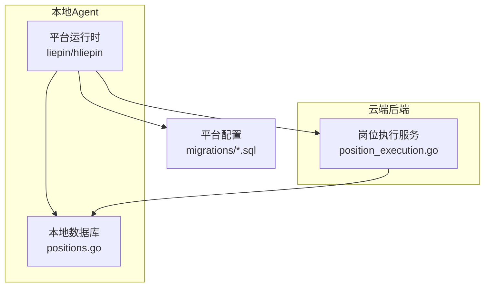
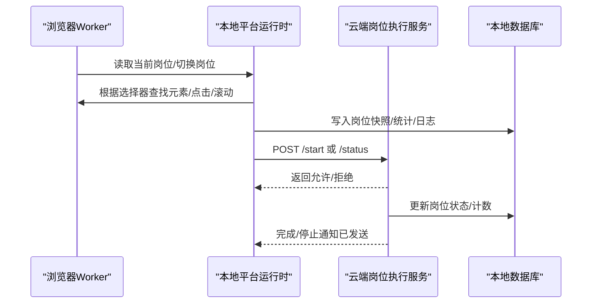
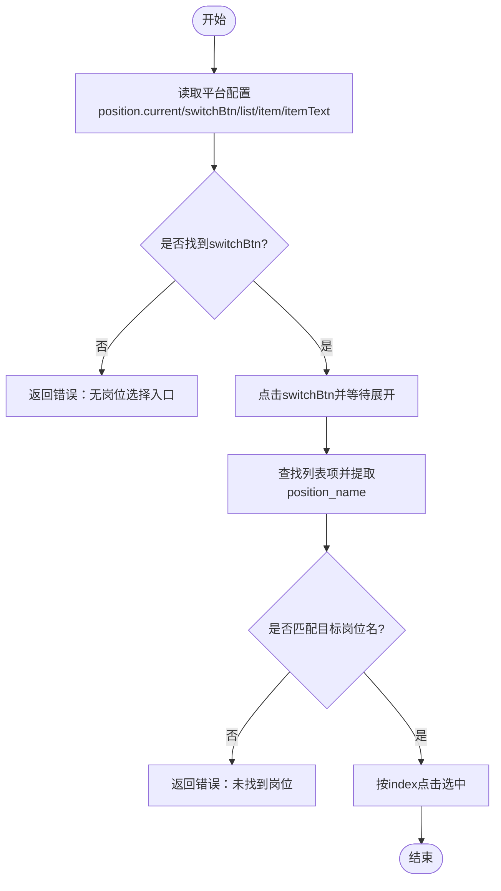
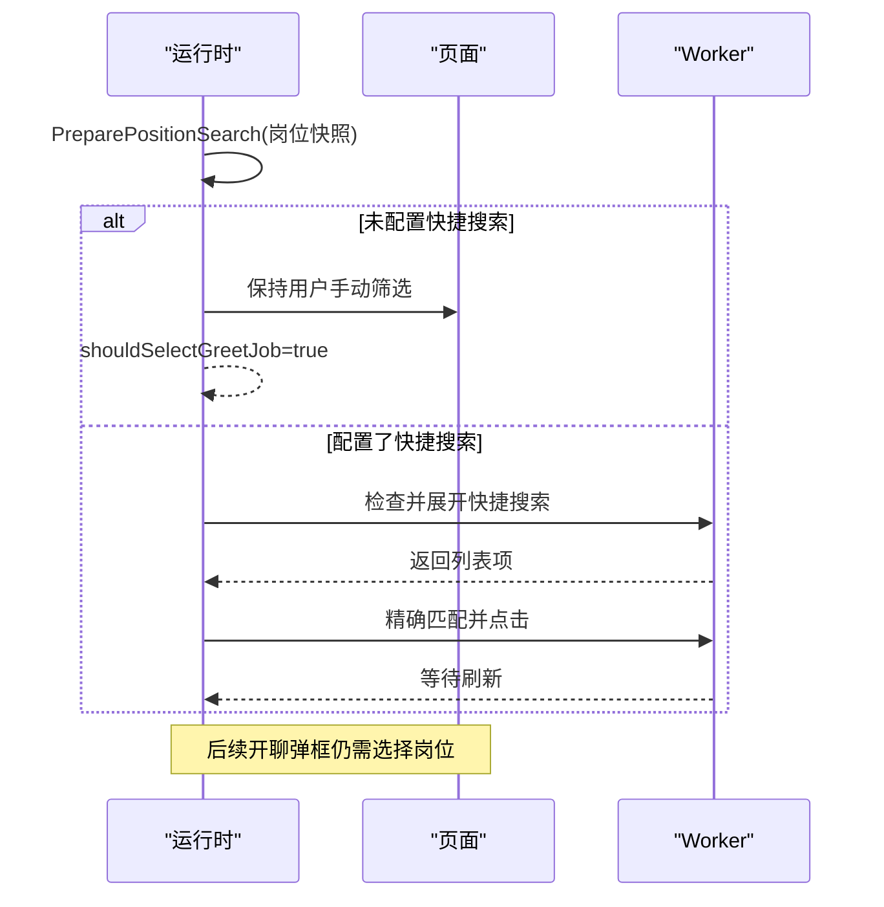
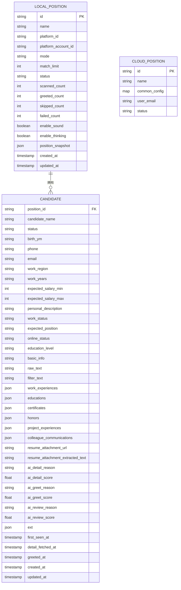
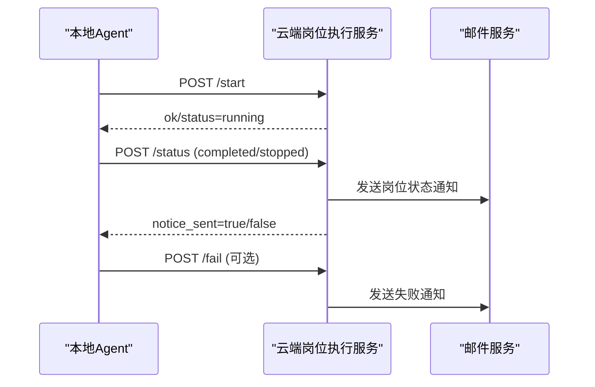
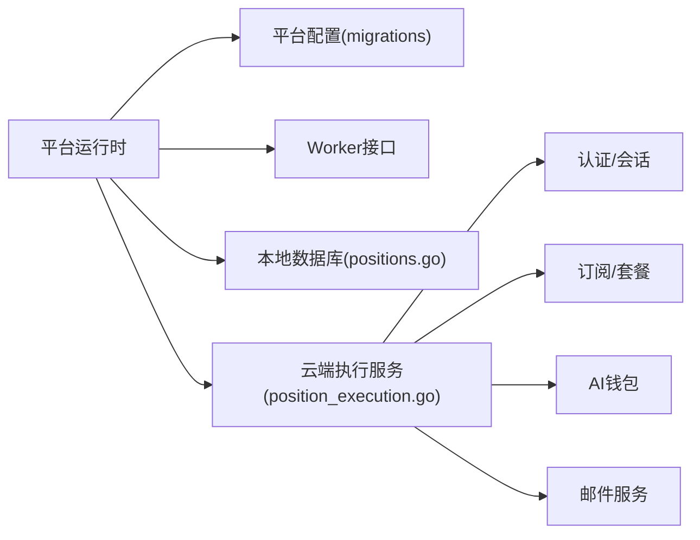

# 职位管理

<cite>
**本文引用的文件**
- [position_execution.go](file://cloud/backend/internal/httpapi/position_execution.go)
- [positions.go](file://local-agent-go/internal/localdb/positions.go)
- [runtime.go（猎聘企业端）](file://local-agent-go/internal/platforms/liepin/runtime.go)
- [position.go（猎聘企业端）](file://local-agent-go/internal/platforms/liepin/position.go)
- [helpers.go（猎聘企业端）](file://local-agent-go/internal/platforms/liepin/helpers.go)
- [runtime.go（猎聘猎头端）](file://local-agent-go/internal/platforms/hliepin/runtime.go)
- [position.go（猎聘猎头端）](file://local-agent-go/internal/platforms/hliepin/position.go)
- [search.go（猎聘猎头端）](file://local-agent-go/internal/platforms/hliepin/search.go)
- [0051_hliepin_platform_config.sql](file://cloud/backend/db/migrations/0051_hliepin_platform_config.sql)
- [0052_liepin_zhaopin_dom_platforms.sql](file://cloud/backend/db/migrations/0052_liepin_zhaopin_dom_platforms.sql)
- [0059_refresh_liepin_zhaopin_platform_configs.sql](file://cloud/backend/db/migrations/0059_refresh_liepin_zhaopin_platform_configs.sql)
</cite>

## 目录
1. [简介](#简介)
2. [项目结构](#项目结构)
3. [核心组件](#核心组件)
4. [架构总览](#架构总览)
5. [详细组件分析](#详细组件分析)
6. [依赖关系分析](#依赖关系分析)
7. [性能考虑](#性能考虑)
8. [故障排查指南](#故障排查指南)
9. [结论](#结论)
10. [附录](#附录)

## 简介
本文件面向猎聘平台（含猎聘企业端与猎聘猎头端）的“职位管理”能力，系统性说明：
- 职位信息提取算法：如何从页面读取当前岗位、切换岗位、解析列表项。
- 职位状态同步机制：本地运行态与云端状态的同步、冲突处理、完成/停止通知。
- 数据格式转换逻辑：平台 DOM 文本到统一候选人与职位快照的规范化流程。
- DOM 结构与动态加载：选择器策略、展开/等待刷新、分页与滚动策略。
- 搜索条件构建与筛选：快捷搜索、发布职位匹配、隐藏候选人过滤。
- 数据模型与字段映射：本地数据库模型、云端存储模型、AI 评分字段。
- 验证规则：启动前置校验、设备绑定、会员与 AI 余额限制等。

## 项目结构
围绕职位管理的代码主要分布在三层：
- 本地 Agent（Go）：平台运行时实现（DOM 操作、元素定位、搜索与切换）、本地持久化（SQLite）。
- 云端后端（Go HTTP API）：接收本地状态上报、执行权限校验、更新岗位状态并发送邮件通知。
- 平台配置（SQL 迁移）：定义猎聘相关 DOM 选择器与元素定位协议。

图表来源
- [position_execution.go:21-47](file://cloud/backend/internal/httpapi/position_execution.go#L21-L47)
- [positions.go:15-33](file://local-agent-go/internal/localdb/positions.go#L15-L33)
- [0051_hliepin_platform_config.sql:76](file://cloud/backend/db/migrations/0051_hliepin_platform_config.sql#L76)
- [0052_liepin_zhaopin_dom_platforms.sql:79](file://cloud/backend/db/migrations/0052_liepin_zhaopin_dom_platforms.sql#L79)
- [0059_refresh_liepin_zhaopin_platform_configs.sql:48](file://cloud/backend/db/migrations/0059_refresh_liepin_zhaopin_platform_configs.sql#L48)

章节来源
- [position_execution.go:21-47](file://cloud/backend/internal/httpapi/position_execution.go#L21-L47)
- [positions.go:15-33](file://local-agent-go/internal/localdb/positions.go#L15-L33)

## 核心组件
- 平台运行时（猎聘企业端/猎头端）：负责读取当前岗位、切换岗位、准备搜索、处理动态加载与筛选。
- 本地数据库层：维护岗位运行记录、统计计数、日志、候选人结构化数据及筛选查询。
- 云端执行服务：校验启动条件（设备绑定、会员、AI 余额）、原子占用名额、同步状态、发送通知。

章节来源
- [runtime.go（猎聘企业端）:10-17](file://local-agent-go/internal/platforms/liepin/runtime.go#L10-L17)
- [runtime.go（猎聘猎头端）:10-19](file://local-agent-go/internal/platforms/hliepin/runtime.go#L10-L19)
- [position_execution.go:21-47](file://cloud/backend/internal/httpapi/position_execution.go#L21-L47)
- [positions.go:15-33](file://local-agent-go/internal/localdb/positions.go#L15-L33)

## 架构总览
本地 Agent 通过平台运行时与浏览器 Worker 交互，按平台配置中的选择器定位 DOM，完成岗位切换与搜索；随后将运行结果与状态上报云端。云端进行权限与配额校验后更新岗位状态，并在完成或失败时发送邮件通知。

图表来源
- [position.go（猎聘企业端）:13-28](file://local-agent-go/internal/platforms/liepin/position.go#L13-L28)
- [position.go（猎聘猎头端）:15-33](file://local-agent-go/internal/platforms/hliepin/position.go#L15-L33)
- [search.go（猎聘猎头端）:22-54](file://local-agent-go/internal/platforms/hliepin/search.go#L22-L54)
- [position_execution.go:49-91](file://cloud/backend/internal/httpapi/position_execution.go#L49-L91)
- [position_execution.go:125-213](file://cloud/backend/internal/httpapi/position_execution.go#L125-L213)
- [positions.go:52-86](file://local-agent-go/internal/localdb/positions.go#L52-L86)

## 详细组件分析

### 职位信息提取与岗位切换（猎聘企业端）
- 读取当前岗位名称：通过平台配置的“position.current”选择器，调用 Worker 接口提取文本，并进行规范化处理后返回。
- 切换岗位：点击“switchBtn”，等待列表展开，遍历列表项匹配目标岗位名，使用索引点击选中。
- 错误处理：缺失选择器、未找到岗位、网络异常均返回明确错误。

图表来源
- [position.go（猎聘企业端）:13-64](file://local-agent-go/internal/platforms/liepin/position.go#L13-L64)
- [helpers.go（猎聘企业端）:112-160](file://local-agent-go/internal/platforms/liepin/helpers.go#L112-L160)

章节来源
- [position.go（猎聘企业端）:13-64](file://local-agent-go/internal/platforms/liepin/position.go#L13-L64)
- [helpers.go（猎聘企业端）:112-160](file://local-agent-go/internal/platforms/liepin/helpers.go#L112-L160)

### 职位信息提取与岗位切换（猎聘猎头端）
- 跳过自动切换：猎头端由主流程控制，ShouldSkipPositionSelection 返回 true，避免重复选择。
- 读取当前岗位：优先使用内存中 currentPos，否则回退到页面提取。
- 保留统一接口：SelectPosition 为空实现，便于上层统一调用。

章节来源
- [position.go（猎聘猎头端）:11-39](file://local-agent-go/internal/platforms/hliepin/position.go#L11-L39)
- [runtime.go（猎聘猎头端）:10-19](file://local-agent-go/internal/platforms/hliepin/runtime.go#L10-L19)

### 搜索条件构建与筛选（猎聘猎头端）
- 准备搜索：保留岗位上下文，默认停用自动选择“发布职位/快捷搜索/三项隐藏条件”，以用户手动筛选为准；若配置了快捷搜索名，则尝试展开并精确匹配。
- 快捷搜索匹配：展开快捷搜索列表，查找完全匹配的项并点击，等待刷新。
- 发布职位匹配：展开“正在发布的职位”，支持完整匹配与截断前缀匹配（去除省略号与末尾英文句点）。
- 隐藏候选人筛选：按配置勾选“隐藏已查看/已沟通/已获取联系方式”，滚动至顶部确保可见后勾选。

图表来源
- [search.go（猎聘猎头端）:22-54](file://local-agent-go/internal/platforms/hliepin/search.go#L22-L54)
- [search.go（猎聘猎头端）:56-89](file://local-agent-go/internal/platforms/hliepin/search.go#L56-L89)
- [search.go（猎聘猎头端）:91-123](file://local-agent-go/internal/platforms/hliepin/search.go#L91-L123)
- [search.go（猎聘猎头端）:125-162](file://local-agent-go/internal/platforms/hliepin/search.go#L125-L162)

章节来源
- [search.go（猎聘猎头端）:22-162](file://local-agent-go/internal/platforms/hliepin/search.go#L22-L162)

### DOM 结构特征与动态加载处理
- 选择器策略：使用 target_classes 数组组合多个可能类名，提升鲁棒性；支持 parent_classes、find_attempts、find_interval_ms 等增强定位。
- 动态加载：在点击/展开后增加 Delay 等待刷新；对需要滚动的筛选项先滚动至顶部再勾选。
- 分页与滚动：通过 Worker 的 scroll 与 ensure-checked-by-text 配合 viewport_margin 保证可见区域稳定。

章节来源
- [helpers.go（猎聘企业端）:132-160](file://local-agent-go/internal/platforms/liepin/helpers.go#L132-L160)
- [search.go（猎聘猎头端）:125-162](file://local-agent-go/internal/platforms/hliepin/search.go#L125-L162)
- [0059_refresh_liepin_zhaopin_platform_configs.sql:48](file://cloud/backend/db/migrations/0059_refresh_liepin_zhaopin_platform_configs.sql#L48)
- [0059_refresh_liepin_zhaopin_platform_configs.sql:110](file://cloud/backend/db/migrations/0059_refresh_liepin_zhaopin_platform_configs.sql#L110)
- [0059_refresh_liepin_zhaopin_platform_configs.sql:167](file://cloud/backend/db/migrations/0059_refresh_liepin_zhaopin_platform_configs.sql#L167)

### 职位数据模型与字段映射
- 本地岗位模型：包含 ID、名称、平台标识、账户、模式、匹配上限、状态、扫描/开聊/跳过/失败计数、声音与思考开关、岗位快照、时间戳。
- 候选人模型：结构化字段包括姓名、状态、出生年月、电话、邮箱、工作地区、工作年限、期望薪资、个人描述、工作状态、期望职位、在线状态、教育程度、基础信息、原始文本、筛选文本、工作经历、教育经历、证书、荣誉、项目经验、同事沟通、简历附件链接与提取文本、AI 详情/开聊/复核原因与分数、扩展字段、首次发现/详情抓取/开聊时间、创建/更新时间。
- 云端岗位模型：用于执行服务的岗位对象，包含公共配置、状态、用户邮箱等。

图表来源
- [positions.go:15-33](file://local-agent-go/internal/localdb/positions.go#L15-L33)
- [positions.go:317-418](file://local-agent-go/internal/localdb/positions.go#L317-L418)
- [position_execution.go:277-298](file://cloud/backend/internal/httpapi/position_execution.go#L277-L298)

章节来源
- [positions.go:15-33](file://local-agent-go/internal/localdb/positions.go#L15-L33)
- [positions.go:317-418](file://local-agent-go/internal/localdb/positions.go#L317-L418)
- [position_execution.go:277-298](file://cloud/backend/internal/httpapi/position_execution.go#L277-L298)

### 数据验证规则与启动前置检查
- 设备绑定：仅允许来自已绑定且活跃设备的请求。
- 会员与功能权限：若岗位使用 AI 或自动回复，需校验会员套餐与自动回复权限。
- AI 余额：最低余额要求，不足则拒绝启动。
- 并发控制：同一账号只能有一个岗位处于运行占用状态。

章节来源
- [position_execution.go:215-275](file://cloud/backend/internal/httpapi/position_execution.go#L215-L275)

### 职位状态同步机制
- 启动许可：本地调用 /start 进行预检，通过后云端记录“running”。
- 状态上报：/status 支持 running/completed/stopped，云端更新状态、计数并发送邮件通知。
- 失败通知：/fail 接收错误消息，归因分类并发送邮件。

图表来源
- [position_execution.go:49-91](file://cloud/backend/internal/httpapi/position_execution.go#L49-L91)
- [position_execution.go:125-213](file://cloud/backend/internal/httpapi/position_execution.go#L125-L213)
- [position_execution.go:311-371](file://cloud/backend/internal/httpapi/position_execution.go#L311-L371)

章节来源
- [position_execution.go:49-91](file://cloud/backend/internal/httpapi/position_execution.go#L49-L91)
- [position_execution.go:125-213](file://cloud/backend/internal/httpapi/position_execution.go#L125-L213)
- [position_execution.go:311-371](file://cloud/backend/internal/httpapi/position_execution.go#L311-L371)

## 依赖关系分析
- 平台运行时依赖云端配置中的 DOM 选择器，通过 Worker 统一协议进行元素定位与交互。
- 本地数据库为运行时提供岗位快照、统计与日志持久化。
- 云端执行服务依赖认证、租户、订阅、AI 钱包、邮件等服务进行权限校验与通知。

图表来源
- [helpers.go（猎聘企业端）:132-160](file://local-agent-go/internal/platforms/liepin/helpers.go#L132-L160)
- [position_execution.go:21-47](file://cloud/backend/internal/httpapi/position_execution.go#L21-L47)
- [positions.go:52-86](file://local-agent-go/internal/localdb/positions.go#L52-L86)

章节来源
- [helpers.go（猎聘企业端）:132-160](file://local-agent-go/internal/platforms/liepin/helpers.go#L132-L160)
- [position_execution.go:21-47](file://cloud/backend/internal/httpapi/position_execution.go#L21-L47)
- [positions.go:52-86](file://local-agent-go/internal/localdb/positions.go#L52-L86)

## 性能考虑
- 选择器优化：使用 target_classes 多候选类名减少误判；必要时设置 find_attempts/find_interval_ms 提高稳定性。
- 动态加载等待：在点击/展开后增加合理延迟，避免竞态导致元素不可见。
- 滚动与可见性：对筛选项先滚动至顶部，结合 viewport_margin 确保可点击区域稳定。
- 批量操作：尽量合并 Worker 调用，减少往返次数。
- 本地缓存：岗位快照与统计计数落库，降低重复计算与网络开销。

[本节为通用指导，不直接分析具体文件]

## 故障排查指南
- 启动失败
  - 设备未绑定：提示“设备绑定要求”，需刷新后台并完成绑定。
  - 会员/自动回复权限不足：提示“需要会员/Max全能版”，需续费或升级。
  - AI 余额不足：提示“AI余额不足”，需充值。
  - 并发冲突：提示“已有岗位运行”，需停止当前任务。
- 岗位切换失败
  - 未找到岗位：检查岗位模板名称是否与页面一致；确认快捷搜索或发布职位列表存在。
  - 选择器缺失：检查平台配置中 position.current/switchBtn/list/item/itemText 是否配置正确。
- 筛选失败
  - 隐藏条件未生效：确认页面已滚动至顶部，并确保勾选超时与轮询间隔配置合理。
- 状态不同步
  - 云端未收到状态：检查 /status 调用是否成功；核对 notice_sent 返回值。
  - 邮件未发送：检查 mailer 配置与用户邮箱是否为空。

章节来源
- [position_execution.go:215-275](file://cloud/backend/internal/httpapi/position_execution.go#L215-L275)
- [position_execution.go:311-371](file://cloud/backend/internal/httpapi/position_execution.go#L311-L371)
- [position.go（猎聘企业端）:30-64](file://local-agent-go/internal/platforms/liepin/position.go#L30-L64)
- [search.go（猎聘猎头端）:125-162](file://local-agent-go/internal/platforms/hliepin/search.go#L125-L162)

## 结论
本项目在猎聘平台的职位管理中，通过“平台运行时 + 本地持久化 + 云端执行服务”的分层架构，实现了稳健的岗位切换、搜索筛选、状态同步与通知机制。选择器策略与动态加载处理提升了跨版本页面的兼容性；严格的启动前置校验保障了资源与权限安全；完善的本地数据模型与云端状态同步确保了可观测性与可追溯性。建议在生产环境中持续监控选择器稳定性、优化等待策略，并结合业务需求调整筛选与匹配规则。

[本节为总结性内容，不直接分析具体文件]

## 附录
- 平台配置示例（节选）
  - 猎聘企业端/猎头端岗位切换按钮与列表选择器：target_classes 多候选类名组合，支持父级类名与重试参数。
  - 快捷搜索与发布职位选择器：用于快速定位与点击。
- 关键常量与超时
  - 刷新等待超时与轮询间隔：用于 ensure-checked-by-text 等需要等待页面变化的操作。

章节来源
- [0051_hliepin_platform_config.sql:76](file://cloud/backend/db/migrations/0051_hliepin_platform_config.sql#L76)
- [0052_liepin_zhaopin_dom_platforms.sql:79](file://cloud/backend/db/migrations/0052_liepin_zhaopin_dom_platforms.sql#L79)
- [0059_refresh_liepin_zhaopin_platform_configs.sql:48](file://cloud/backend/db/migrations/0059_refresh_liepin_zhaopin_platform_configs.sql#L48)
- [search.go（猎聘猎头端）:13-20](file://local-agent-go/internal/platforms/hliepin/search.go#L13-L20)