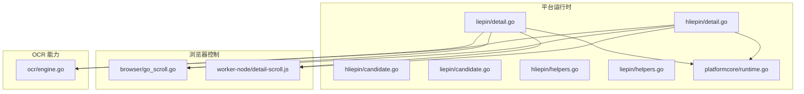
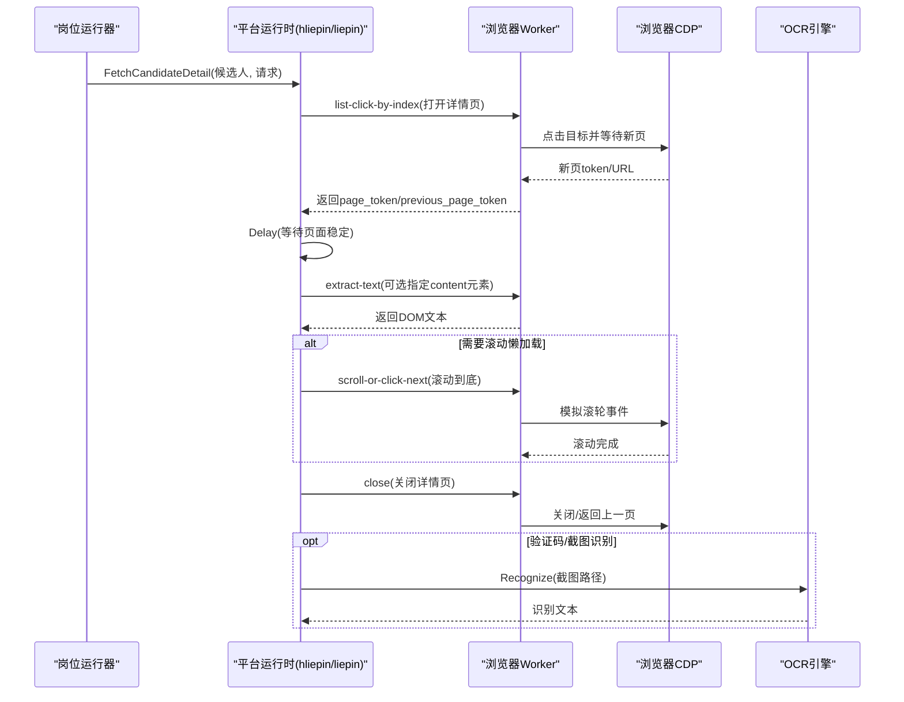
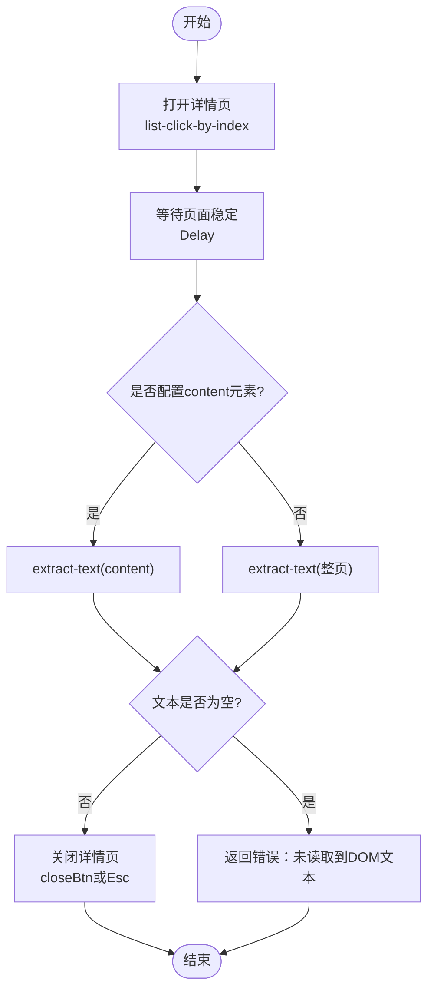
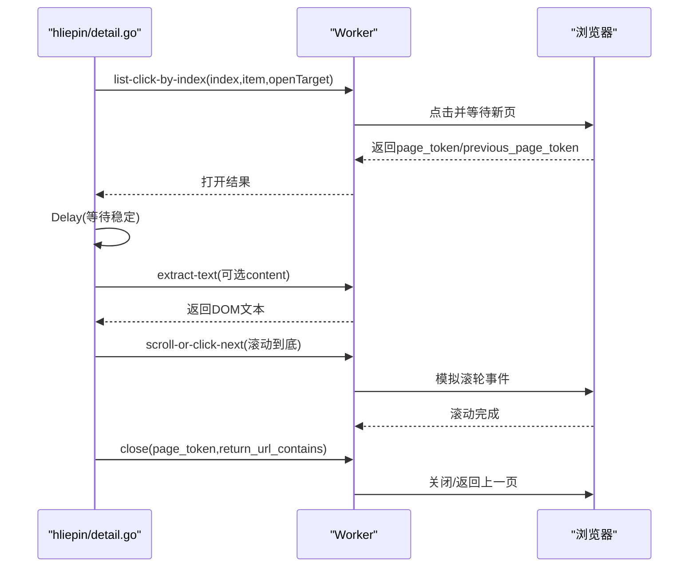
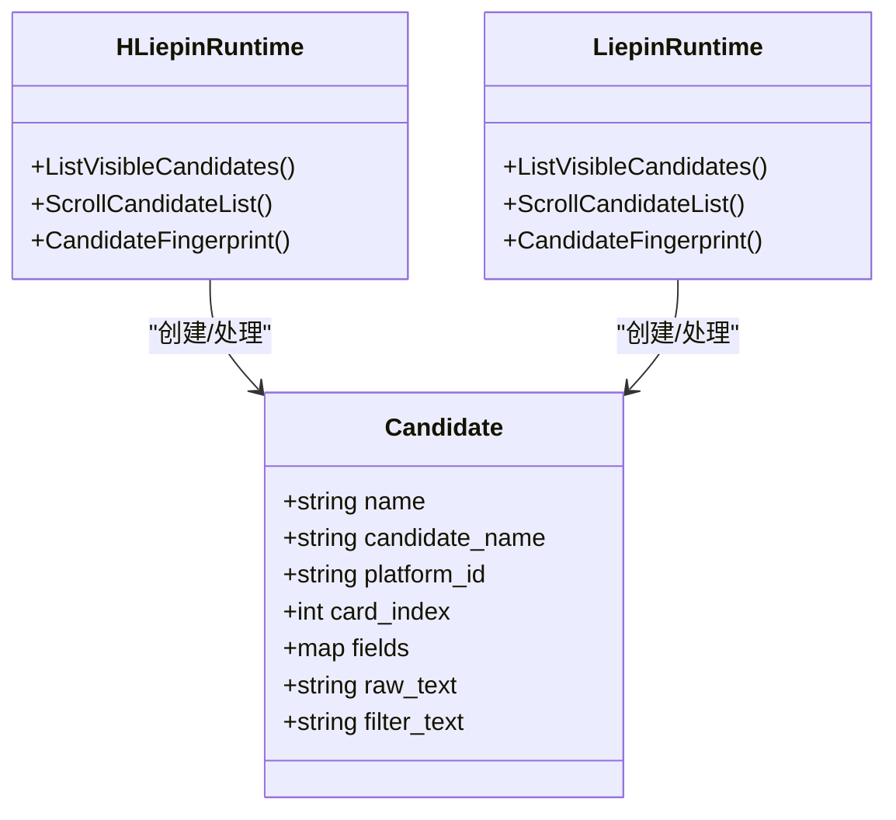
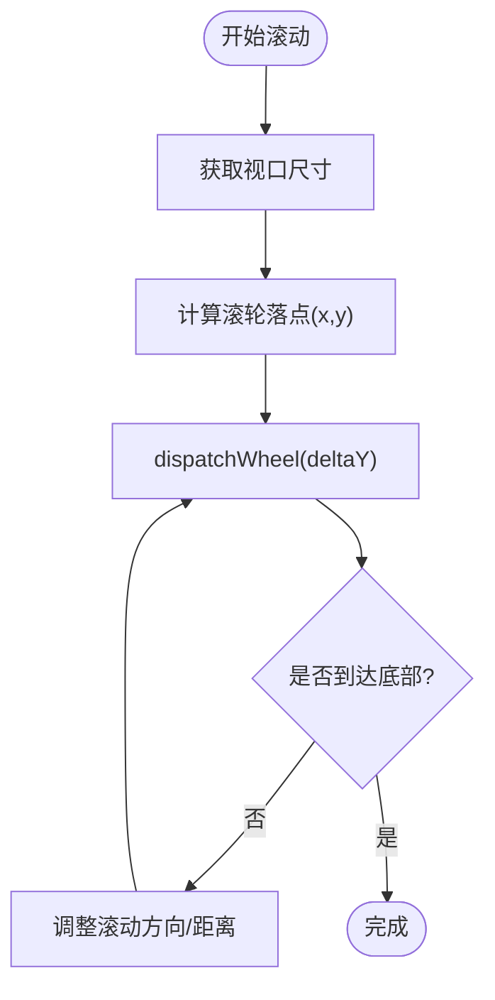
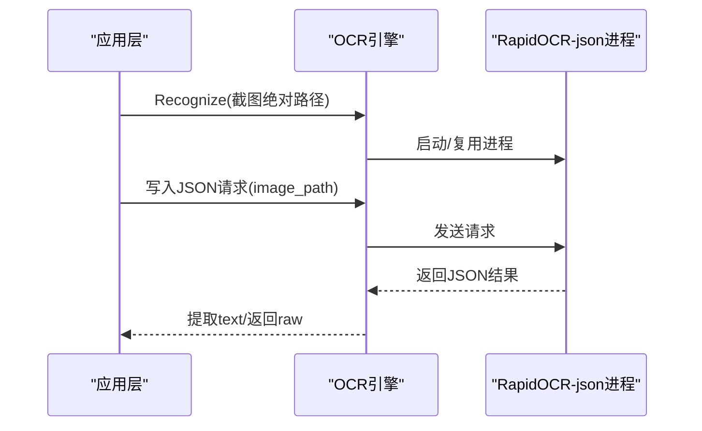
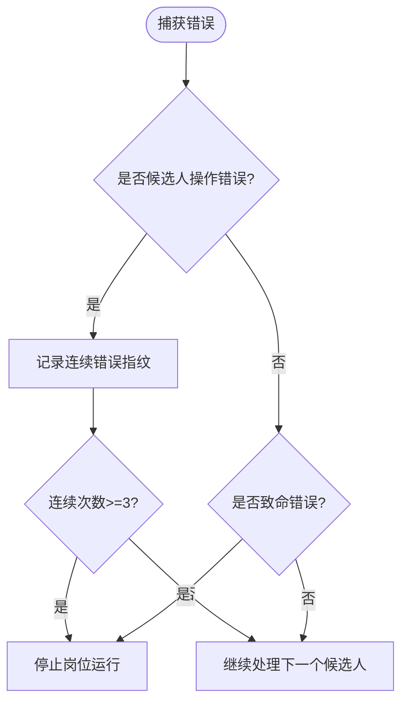
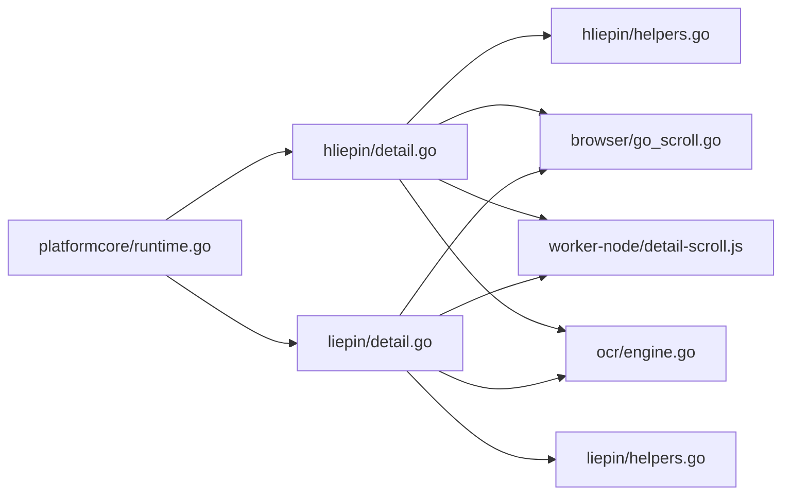

# 详情页面处理

<cite>
**本文引用的文件**
- [hliepin/detail.go](file://goodhr5/local-agent-go/internal/platforms/hliepin/detail.go)
- [liepin/detail.go](file://goodhr5/local-agent-go/internal/platforms/liepin/detail.go)
- [hliepin/candidate.go](file://goodhr5/local-agent-go/internal/platforms/hliepin/candidate.go)
- [liepin/candidate.go](file://goodhr5/local-agent-go/internal/platforms/liepin/candidate.go)
- [hliepin/helpers.go](file://goodhr5/local-agent-go/internal/platforms/hliepin/helpers.go)
- [liepin/helpers.go](file://goodhr5/local-agent-go/internal/platforms/liepin/helpers.go)
- [platformcore/runtime.go](file://goodhr5/local-agent-go/internal/platformcore/runtime.go)
- [browser/go_scroll.go](file://goodhr5/local-agent-go/internal/browser/go_scroll.go)
- [worker-node/detail-scroll.js](file://goodhr5/local-agent-go/worker-node/src/detail-scroll.js)
- [positionrunner/error_policy.go](file://goodhr5/local-agent-go/internal/positionrunner/error_policy.go)
- [ocr/engine.go](file://goodhr5/local-agent-go/internal/ocr/engine.go)
</cite>

## 目录
1. [简介](#简介)
2. [项目结构](#项目结构)
3. [核心组件](#核心组件)
4. [架构总览](#架构总览)
5. [详细组件分析](#详细组件分析)
6. [依赖关系分析](#依赖关系分析)
7. [性能考量](#性能考量)
8. [故障排查指南](#故障排查指南)
9. [结论](#结论)
10. [附录](#附录)

## 简介
本文件聚焦猎聘平台（含企业端与猎头端）详情页处理的完整实现，覆盖以下方面：
- DOM 结构与动态内容加载机制
- 页面元素定位策略与配置化选择器
- 简历内容提取算法、个人信息解析逻辑、联系方式识别方法
- 页面滚动处理、懒加载内容获取、验证码识别策略
- 详情页数据缓存机制、页面状态管理、异常处理方案

该文档面向不同技术背景的读者，提供从高层架构到代码级实现的逐步深入说明。

## 项目结构
本项目采用“平台运行时 + 浏览器 Worker + OCR”的分层设计：
- 平台运行时负责编排具体平台的详情页流程（打开、滚动、提取、关闭等）
- 浏览器 Worker 通过统一 API 执行页面操作（点击、滚动、文本提取、截图等）
- OCR 引擎用于图片文字识别（如验证码或截图转文本）

图表来源
- [hliepin/detail.go:15-55](file://goodhr5/local-agent-go/internal/platforms/hliepin/detail.go#L15-L55)
- [liepin/detail.go:13-43](file://goodhr5/local-agent-go/internal/platforms/liepin/detail.go#L13-L43)
- [platformcore/runtime.go:10-74](file://goodhr5/local-agent-go/internal/platformcore/runtime.go#L10-L74)
- [browser/go_scroll.go:8-51](file://goodhr5/local-agent-go/internal/browser/go_scroll.go#L8-L51)
- [worker-node/detail-scroll.js:16-38](file://goodhr5/local-agent-go/worker-node/src/detail-scroll.js#L16-L38)
- [ocr/engine.go:59-97](file://goodhr5/local-agent-go/internal/ocr/engine.go#L59-L97)

章节来源
- [hliepin/detail.go:15-55](file://goodhr5/local-agent-go/internal/platforms/hliepin/detail.go#L15-L55)
- [liepin/detail.go:13-43](file://goodhr5/local-agent-go/internal/platforms/liepin/detail.go#L13-L43)
- [platformcore/runtime.go:10-74](file://goodhr5/local-agent-go/internal/platformcore/runtime.go#L10-L74)

## 核心组件
- 平台运行时接口：定义统一的详情页读取、滚动、关闭等能力，供上层岗位运行器调用
- 猎聘企业端/猎头端实现：分别实现详情页打开、DOM 文本提取、滚动到底、关闭等流程
- 浏览器滚动控制：通过 CDP 滚轮事件模拟真实滚动，避免注入脚本带来的不稳定
- Worker 滚动等待策略：为长图/懒加载场景提供稳定的滚动节奏与方向判定
- OCR 引擎：启动本地 RapidOCR-json 进程，对截图进行文字识别（可用于验证码识别）

章节来源
- [platformcore/runtime.go:46-110](file://goodhr5/local-agent-go/internal/platformcore/runtime.go#L46-L110)
- [hliepin/detail.go:15-75](file://goodhr5/local-agent-go/internal/platforms/hliepin/detail.go#L15-L75)
- [liepin/detail.go:13-56](file://goodhr5/local-agent-go/internal/platforms/liepin/detail.go#L13-L56)
- [browser/go_scroll.go:8-51](file://goodhr5/local-agent-go/internal/browser/go_scroll.go#L8-L51)
- [worker-node/detail-scroll.js:16-38](file://goodhr5/local-agent-go/worker-node/src/detail-scroll.js#L16-L38)
- [ocr/engine.go:59-97](file://goodhr5/local-agent-go/internal/ocr/engine.go#L59-L97)

## 架构总览
详情页处理的核心链路如下：
- 平台运行时根据候选人卡片信息，调用 Worker 的“列表点击并打开新页”接口
- 等待新页稳定后，按配置提取 DOM 文本；若未配置内容区域则提取整页
- 如需滚动以触发懒加载，使用统一滚动接口在随机时长内滚动到底
- 关闭详情页时优先尝试配置化的关闭按钮，否则回退到键盘快捷键
- 错误处理采用连续错误追踪，达到阈值自动停止岗位运行

图表来源
- [hliepin/detail.go:15-55](file://goodhr5/local-agent-go/internal/platforms/hliepin/detail.go#L15-L55)
- [liepin/detail.go:13-43](file://goodhr5/local-agent-go/internal/platforms/liepin/detail.go#L13-L43)
- [browser/go_scroll.go:38-51](file://goodhr5/local-agent-go/internal/browser/go_scroll.go#L38-L51)
- [worker-node/detail-scroll.js:16-38](file://goodhr5/local-agent-go/worker-node/src/detail-scroll.js#L16-L38)
- [ocr/engine.go:59-97](file://goodhr5/local-agent-go/internal/ocr/engine.go#L59-L97)

## 详细组件分析

### 猎聘企业端详情页（liepin）
- 打开详情页：基于候选人卡片索引与配置中的 openTarget 选择器，调用 Worker 列表点击接口打开新页
- 等待稳定：固定延迟等待页面渲染完成
- 提取文本：支持通过配置指定 content 元素，否则提取整页文本；校验非空后返回
- 关闭详情页：优先尝试配置中的 closeBtn，失败则回退到按下 Escape 键
- 文本清理：仅做空白字符修剪

图表来源
- [liepin/detail.go:13-43](file://goodhr5/local-agent-go/internal/platforms/liepin/detail.go#L13-L43)
- [liepin/detail.go:45-56](file://goodhr5/local-agent-go/internal/platforms/liepin/detail.go#L45-L56)

章节来源
- [liepin/detail.go:13-56](file://goodhr5/local-agent-go/internal/platforms/liepin/detail.go#L13-L56)

### 猎聘猎头端详情页（hliepin）
- 打开详情页：使用候选人的 card_index 与 item 选择器，配合 openTarget 打开新页，并记录 page_token 与 previous_page_token
- 等待稳定：固定延迟等待页面渲染完成
- 提取文本：支持通过配置指定 content 元素，否则提取整页文本；校验非空后返回
- 滚动到底：使用 scroll-or-click-next 在随机时长内滚动到底，确保懒加载内容加载完成
- 关闭详情页：通过 page_token 与 URL 匹配规则安全关闭

图表来源
- [hliepin/detail.go:15-55](file://goodhr5/local-agent-go/internal/platforms/hliepin/detail.go#L15-L55)
- [hliepin/detail.go:58-75](file://goodhr5/local-agent-go/internal/platforms/hliepin/detail.go#L58-L75)
- [hliepin/detail.go:77-90](file://goodhr5/local-agent-go/internal/platforms/hliepin/detail.go#L77-L90)

章节来源
- [hliepin/detail.go:15-90](file://goodhr5/local-agent-go/internal/platforms/hliepin/detail.go#L15-L90)

### 候选人列表与指纹去重（hliepin/liepin）
- 列表提取：通过配置的 card.item 选择器与 fields 定位字段；猎聘猎头端在首次为空时回退到表格行并轮询等待筛选刷新
- 姓名与年龄提取：从 raw_text 或 fields 中解析姓名与年龄，用于生成去重指纹
- 指纹策略：
  - 猎头端：优先使用平台候选人ID；否则组合姓名、年龄与稳定文本哈希
  - 企业端：组合平台ID、姓名与年龄

图表来源
- [hliepin/candidate.go:15-79](file://goodhr5/local-agent-go/internal/platforms/hliepin/candidate.go#L15-L79)
- [hliepin/candidate.go:105-119](file://goodhr5/local-agent-go/internal/platforms/hliepin/candidate.go#L105-L119)
- [liepin/candidate.go:14-44](file://goodhr5/local-agent-go/internal/platforms/liepin/candidate.go#L14-L44)
- [liepin/candidate.go:62-71](file://goodhr5/local-agent-go/internal/platforms/liepin/candidate.go#L62-L71)

章节来源
- [hliepin/candidate.go:15-119](file://goodhr5/local-agent-go/internal/platforms/hliepin/candidate.go#L15-L119)
- [liepin/candidate.go:14-71](file://goodhr5/local-agent-go/internal/platforms/liepin/candidate.go#L14-L71)

### 页面滚动与懒加载
- 浏览器滚动：通过 CDP 的 Input.dispatchMouseEvent 发送 mouseWheel 事件，不注入页面脚本，提升稳定性
- 滚动位置计算：先获取视口尺寸，将滚轮落点限制在视口范围内，避免越界
- Worker 滚动等待：为详情长图提供 captureWaitMs 与 initialCaptureWaitMs，保证截图前内容稳定
- 有效滚动方向：根据 can_scroll_up/can_scroll_down 状态决定正负滚动距离，避免无效滚动

图表来源
- [browser/go_scroll.go:8-51](file://goodhr5/local-agent-go/internal/browser/go_scroll.go#L8-L51)
- [worker-node/detail-scroll.js:16-38](file://goodhr5/local-agent-go/worker-node/src/detail-scroll.js#L16-L38)

章节来源
- [browser/go_scroll.go:8-81](file://goodhr5/local-agent-go/internal/browser/go_scroll.go#L8-L81)
- [worker-node/detail-scroll.js:16-38](file://goodhr5/local-agent-go/worker-node/src/detail-scroll.js#L16-L38)

### 验证码识别策略
- 当详情页出现验证码或需截图识别的场景，可调用 OCR 引擎对截图进行文字识别
- OCR 引擎启动本地 RapidOCR-json 进程，通过标准输入输出进行 JSON 协议通信
- 识别结果包含纯文本与原始 JSON；若未识别到文字则返回错误
- 错误处理包括进程退出、模型不完整、管道读写失败等情形

图表来源
- [ocr/engine.go:59-97](file://goodhr5/local-agent-go/internal/ocr/engine.go#L59-L97)
- [ocr/engine.go:101-146](file://goodhr5/local-agent-go/internal/ocr/engine.go#L101-L146)
- [ocr/engine.go:148-179](file://goodhr5/local-agent-go/internal/ocr/engine.go#L148-L179)

章节来源
- [ocr/engine.go:59-179](file://goodhr5/local-agent-go/internal/ocr/engine.go#L59-L179)

### 页面状态管理与数据缓存
- 页面状态：通过 page_token 与 previous_page_token 跟踪详情页与返回列表页，确保正确关闭与返回
- URL 匹配：使用 only_url_contains 与 return_url_contains 精确匹配详情页与返回页，避免误关
- 数据缓存：当前实现以 DOM 文本为主，未引入持久化缓存；如需缓存可在上层岗位运行器中基于候选人指纹与时间窗口实现
- 滚动状态：Worker 滚动等待策略保证懒加载内容加载完成后再提取文本或截图

章节来源
- [hliepin/detail.go:26-37](file://goodhr5/local-agent-go/internal/platforms/hliepin/detail.go#L26-L37)
- [hliepin/detail.go:77-90](file://goodhr5/local-agent-go/internal/platforms/hliepin/detail.go#L77-L90)
- [worker-node/detail-scroll.js:16-38](file://goodhr5/local-agent-go/worker-node/src/detail-scroll.js#L16-L38)

### 异常处理方案
- 连续错误追踪：同一平台环节连续出现相同错误达到阈值时，自动停止岗位运行，避免无限重试
- 立即停止条件：浏览器关闭、AI 服务报错等致命错误会立即停止
- OCR 致命错误：组件未安装、模型不完整、进程退出等错误会被识别并提示查看日志
- 候选人操作错误：包装为 candidateOperationError，便于上层统计与决策

图表来源
- [positionrunner/error_policy.go:37-99](file://goodhr5/local-agent-go/internal/positionrunner/error_policy.go#L37-L99)
- [positionrunner/error_policy.go:101-118](file://goodhr5/local-agent-go/internal/positionrunner/error_policy.go#L101-L118)

章节来源
- [positionrunner/error_policy.go:37-118](file://goodhr5/local-agent-go/internal/positionrunner/error_policy.go#L37-L118)

## 依赖关系分析
- 平台运行时依赖 platformcore 接口，解耦具体平台实现
- 猎聘企业端/猎头端实现均依赖 helpers 工具函数，统一元素定位与响应解析
- 浏览器滚动控制依赖 CDP 协议，Worker 滚动等待策略提供跨平台一致的滚动节奏
- OCR 引擎独立于平台运行时，通过进程间通信提供服务

图表来源
- [platformcore/runtime.go:10-74](file://goodhr5/local-agent-go/internal/platformcore/runtime.go#L10-L74)
- [hliepin/detail.go:15-55](file://goodhr5/local-agent-go/internal/platforms/hliepin/detail.go#L15-L55)
- [liepin/detail.go:13-43](file://goodhr5/local-agent-go/internal/platforms/liepin/detail.go#L13-L43)
- [hliepin/helpers.go:118-160](file://goodhr5/local-agent-go/internal/platforms/hliepin/helpers.go#L118-L160)
- [liepin/helpers.go:118-160](file://goodhr5/local-agent-go/internal/platforms/liepin/helpers.go#L118-L160)
- [browser/go_scroll.go:8-51](file://goodhr5/local-agent-go/internal/browser/go_scroll.go#L8-L51)
- [worker-node/detail-scroll.js:16-38](file://goodhr5/local-agent-go/worker-node/src/detail-scroll.js#L16-L38)
- [ocr/engine.go:59-97](file://goodhr5/local-agent-go/internal/ocr/engine.go#L59-L97)

章节来源
- [platformcore/runtime.go:10-74](file://goodhr5/local-agent-go/internal/platformcore/runtime.go#L10-L74)
- [hliepin/helpers.go:118-160](file://goodhr5/local-agent-go/internal/platforms/hliepin/helpers.go#L118-L160)
- [liepin/helpers.go:118-160](file://goodhr5/local-agent-go/internal/platforms/liepin/helpers.go#L118-L160)

## 性能考量
- 滚动效率：使用 CDP 滚轮事件直接驱动浏览器，避免注入脚本的性能开销
- 等待策略：详情页打开后固定延迟等待，结合 Worker 滚动等待策略，减少重复滚动与无效操作
- 文本提取：支持指定 content 元素，缩小提取范围，降低解析成本
- OCR 性能：复用常驻进程，避免每次识别都启动进程；日志记录便于问题定位

[本节为通用指导，不直接分析具体文件]

## 故障排查指南
- 详情页未读取到 DOM 文本：检查 content 配置是否正确，确认页面已稳定且无动态遮挡
- 滚动未完成：检查 scroll-or-click-next 返回 action 是否为 end，必要时增加等待时间
- 验证码识别失败：确认截图路径为绝对路径，OCR 组件已安装且模型文件完整，查看 OCR 日志
- 连续错误导致停止：查看错误指纹与连续次数，定位平台页面变化或网络异常

章节来源
- [liepin/detail.go:33-43](file://goodhr5/local-agent-go/internal/platforms/liepin/detail.go#L33-L43)
- [hliepin/detail.go:62-75](file://goodhr5/local-agent-go/internal/platforms/hliepin/detail.go#L62-L75)
- [ocr/engine.go:59-97](file://goodhr5/local-agent-go/internal/ocr/engine.go#L59-L97)
- [positionrunner/error_policy.go:37-99](file://goodhr5/local-agent-go/internal/positionrunner/error_policy.go#L37-L99)

## 结论
本项目通过平台运行时、浏览器 Worker 与 OCR 引擎的协作，实现了猎聘平台详情页的稳定处理。其核心优势在于：
- 配置化元素定位，适配多版本页面结构
- 基于 CDP 的滚动控制，提升稳定性与性能
- 统一的错误处理与日志记录，便于问题定位
- OCR 能力扩展，支持验证码与截图识别

建议在后续迭代中：
- 增加详情页数据缓存机制，基于候选人指纹与时间窗口减少重复提取
- 完善懒加载检测逻辑，结合滚动状态与内容变化判断加载完成
- 增强验证码识别策略，结合图像预处理与多模型融合提高准确率

[本节为总结性内容，不直接分析具体文件]

## 附录
- 平台配置建议：
  - detail.openTarget：详情页打开目标选择器
  - detail.content：详情页内容区域选择器（可选）
  - detail.closeBtn：详情页关闭按钮选择器（可选）
  - behavior.nextPageBtn：下一页按钮选择器（列表滚动）
- 关键 API：
  - /api/v1/page/list-click-by-index：列表项点击并打开新页
  - /api/v1/page/extract-text：提取 DOM 文本
  - /api/v1/page/scroll-or-click-next：滚动或点击下一页
  - /api/v1/page/close：关闭详情页

[本节为补充信息，不直接分析具体文件]