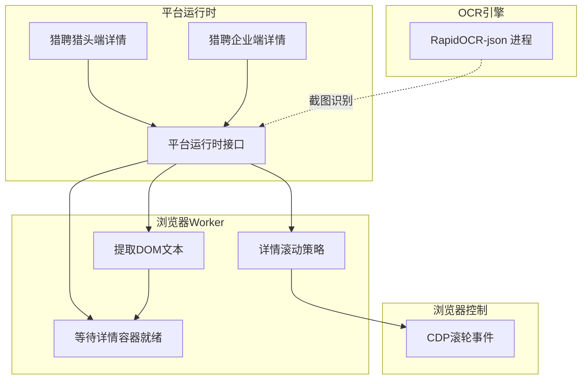
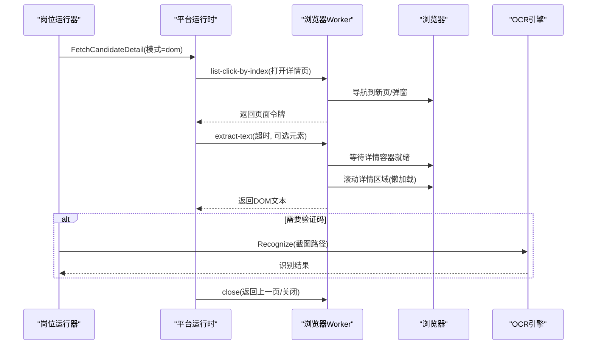
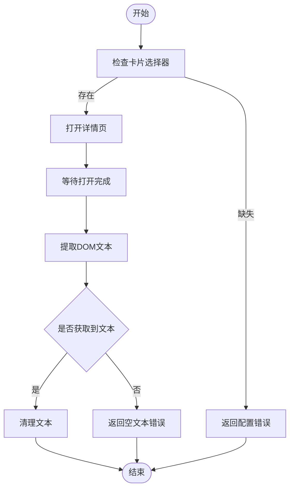
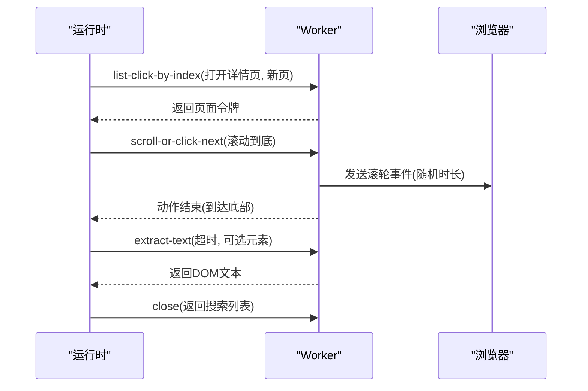
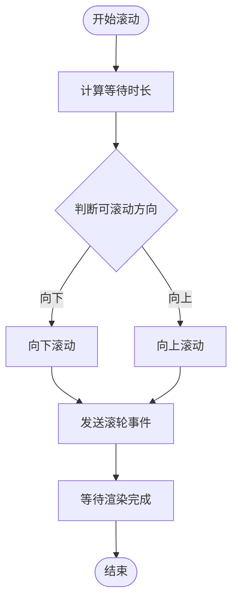
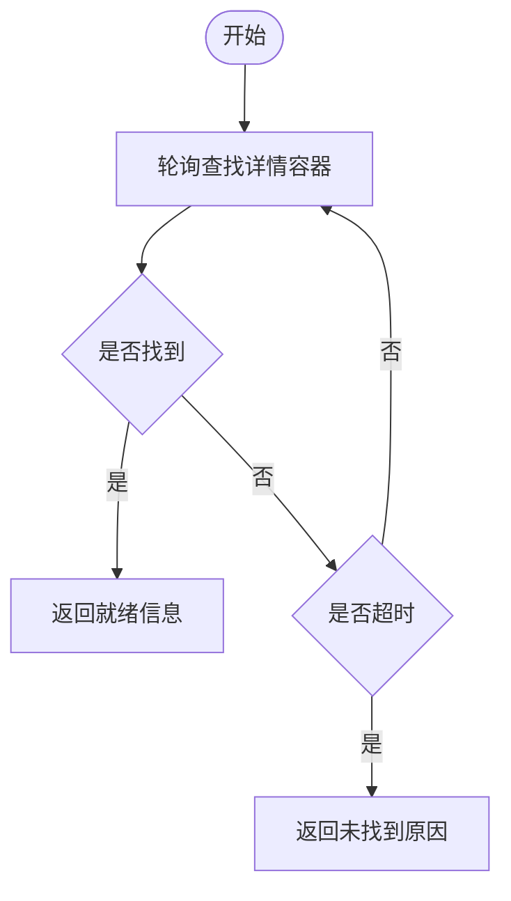
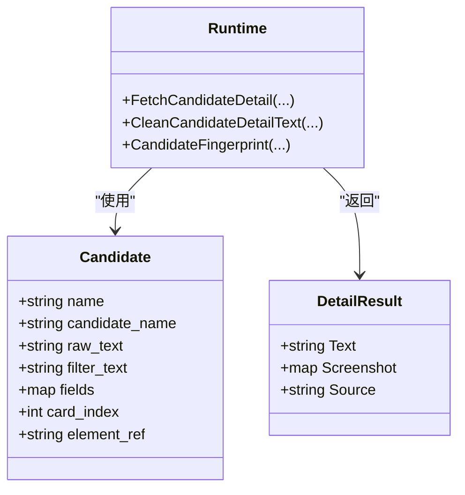
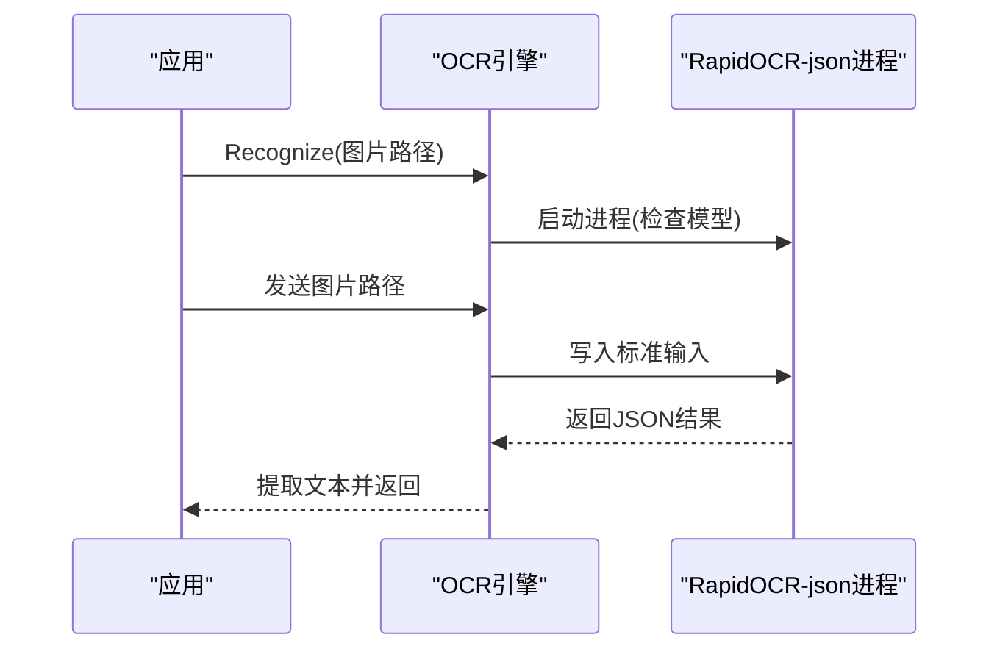
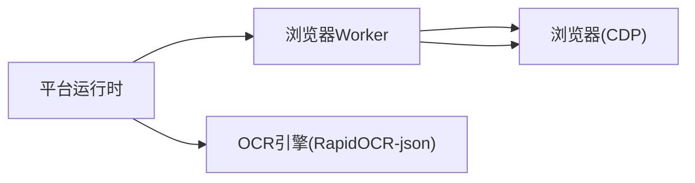

# 详情页面处理

<cite>
**本文引用的文件**
- [detail.go](file://goodhr5/local-agent-go/internal/platforms/hliepin/detail.go)
- [candidate.go](file://goodhr5/local-agent-go/internal/platforms/hliepin/candidate.go)
- [helpers.go](file://goodhr5/local-agent-go/internal/platforms/hliepin/helpers.go)
- [detail.go](file://goodhr5/local-agent-go/internal/platforms/liepin/detail.go)
- [candidate.go](file://goodhr5/local-agent-go/internal/platforms/liepin/candidate.go)
- [helpers.go](file://goodhr5/local-agent-go/internal/platforms/liepin/helpers.go)
- [runtime.go](file://goodhr5/local-agent-go/internal/platformcore/runtime.go)
- [detail-scroll.js](file://goodhr5/local-agent-go/worker-node/src/detail-scroll.js)
- [detail-ready.js](file://goodhr5/local-agent-go/worker-node/src/detail-ready.js)
- [engine.go](file://goodhr5/local-agent-go/internal/ocr/engine.go)
- [go_scroll.go](file://goodhr5/local-agent-go/internal/browser/go_scroll.go)
</cite>

## 目录
1. [简介](#简介)
2. [项目结构](#项目结构)
3. [核心组件](#核心组件)
4. [架构总览](#架构总览)
5. [详细组件分析](#详细组件分析)
6. [依赖关系分析](#依赖关系分析)
7. [性能考虑](#性能考虑)
8. [故障排查指南](#故障排查指南)
9. [结论](#结论)
10. [附录](#附录)

## 简介
本文件聚焦猎聘平台（含企业端与猎头端）详情页处理的完整实现，覆盖以下关键主题：
- DOM 结构特征与元素定位策略
- 动态内容加载机制与滚动、懒加载处理
- 简历内容提取算法、个人信息解析逻辑、联系方式识别方法
- 验证码识别策略（OCR 集成）
- 详情页数据缓存机制、页面状态管理、异常处理方案

该文档面向不同技术背景的读者，提供从高层架构到代码级实现的渐进式说明，并辅以流程图、时序图与类图帮助理解。

## 项目结构
本项目采用“平台运行时 + Worker 浏览器控制 + OCR 引擎”的分层设计：
- 平台运行时（Go）：封装各平台（猎聘企业端、猎聘猎头端）的详情页打开、文本提取、滚动、关闭等能力，并通过统一接口对外暴露。
- Worker（Node.js）：在浏览器中执行具体操作，如等待详情容器就绪、滚动细节区域、提取文本等。
- OCR 引擎（Go）：调用本地 RapidOCR-json 进程进行截图文字识别，用于验证码等场景。
- 浏览器控制（Go）：通过 CDP 发送滚轮事件，模拟真实滚动行为。

图表来源
- [runtime.go:54-82](file://goodhr5/local-agent-go/internal/platformcore/runtime.go#L54-L82)
- [detail-scroll.js:15-37](file://goodhr5/local-agent-go/worker-node/src/detail-scroll.js#L15-L37)
- [detail-ready.js:9-51](file://goodhr5/local-agent-go/worker-node/src/detail-ready.js#L9-L51)
- [engine.go:59-97](file://goodhr5/local-agent-go/internal/ocr/engine.go#L59-L97)
- [go_scroll.go:8-51](file://goodhr5/local-agent-go/internal/browser/go_scroll.go#L8-L51)

章节来源
- [runtime.go:54-82](file://goodhr5/local-agent-go/internal/platformcore/runtime.go#L54-L82)

## 核心组件
- 平台运行时接口（Runtime/Executor）：定义统一的详情页读取、滚动、关闭等能力，屏蔽平台差异。
- 猎聘企业端详情实现：负责打开详情页、提取DOM文本、关闭详情页。
- 猎聘猎头端详情实现：负责打开新页、记录页面令牌、滚动到底、提取DOM文本、关闭详情页。
- Worker 详情滚动与就绪检测：提供等待详情容器、计算滚动等待时长、决定有效滚动方向。
- OCR 引擎：启动本地 OCR 进程，接收图片路径，返回识别文本，用于验证码识别。
- 浏览器滚动控制：通过 CDP 发送滚轮事件，支持页面或元素滚动。

章节来源
- [runtime.go:10-82](file://goodhr5/local-agent-go/internal/platformcore/runtime.go#L10-L82)
- [detail.go](file://goodhr5/local-agent-go/internal/platforms/liepin/detail.go)
- [detail.go](file://goodhr5/local-agent-go/internal/platforms/hliepin/detail.go)
- [detail-scroll.js:15-37](file://goodhr5/local-agent-go/worker-node/src/detail-scroll.js#L15-L37)
- [detail-ready.js:9-51](file://goodhr5/local-agent-go/worker-node/src/detail-ready.js#L9-L51)
- [engine.go:59-97](file://goodhr5/local-agent-go/internal/ocr/engine.go#L59-L97)
- [go_scroll.go:8-51](file://goodhr5/local-agent-go/internal/browser/go_scroll.go#L8-L51)

## 架构总览
下图展示详情页处理的端到端流程：平台运行时调用 Worker 打开详情页并等待就绪，随后滚动以触发懒加载，再提取文本；必要时使用 OCR 识别验证码。

图表来源
- [detail.go](file://goodhr5/local-agent-go/internal/platforms/hliepin/detail.go)
- [detail.go](file://goodhr5/local-agent-go/internal/platforms/liepin/detail.go)
- [detail-ready.js:9-51](file://goodhr5/local-agent-go/worker-node/src/detail-ready.js#L9-L51)
- [detail-scroll.js:15-37](file://goodhr5/local-agent-go/worker-node/src/detail-scroll.js#L15-L37)
- [engine.go:59-97](file://goodhr5/local-agent-go/internal/ocr/engine.go#L59-L97)

## 详细组件分析

### 猎聘企业端详情页处理
- DOM 结构与定位：
  - 候选人卡片选择器来自平台配置，若缺失则报错。
  - 详情页打开目标与关闭按钮均可通过配置指定，未配置时回退为通用选择器或键盘快捷键。
- 动态内容与懒加载：
  - 打开详情页后短暂等待，再通过 Worker 的 extract-text 接口提取文本；可传入元素限定范围以提升准确性。
- 文本清理：
  - 对提取的文本进行空白字符清理，去除平台附加内容。
- 异常处理：
  - 未找到卡片选择器或未读取到DOM文本时返回错误，便于上层重试或告警。

图表来源
- [detail.go](file://goodhr5/local-agent-go/internal/platforms/liepin/detail.go)
- [helpers.go](file://goodhr5/local-agent-go/internal/platforms/liepin/helpers.go)

章节来源
- [detail.go:13-43](file://goodhr5/local-agent-go/internal/platforms/liepin/detail.go#L13-L43)
- [detail.go:45-56](file://goodhr5/local-agent-go/internal/platforms/liepin/detail.go#L45-L56)
- [detail.go:58-61](file://goodhr5/local-agent-go/internal/platforms/liepin/detail.go#L58-L61)
- [helpers.go:118-160](file://goodhr5/local-agent-go/internal/platforms/liepin/helpers.go#L118-L160)

### 猎聘猎头端详情页处理
- DOM 结构与定位：
  - 候选人行选择器优先使用列表抓取时的 item，否则回退到表格行选择器。
  - 详情页打开目标默认包含 a 标签，确保点击稳定。
- 页面状态管理：
  - 打开详情页后记录当前页令牌与返回页令牌，用于后续关闭与返回。
- 滚动与懒加载：
  - 使用连续滚轮在随机时长内滚动到底部，避免被检测为自动化行为；滚动完成后校验是否到达底部。
- 文本提取与清理：
  - 通过 extract-text 接口获取文本，支持指定内容区域；对文本进行空白清理。
- 异常处理：
  - 未读取到DOM文本或滚动未完成时返回错误，便于上层重试或降级。

图表来源
- [detail.go](file://goodhr5/local-agent-go/internal/platforms/hliepin/detail.go)
- [candidate.go](file://goodhr5/local-agent-go/internal/platforms/hliepin/candidate.go)
- [go_scroll.go:38-51](file://goodhr5/local-agent-go/internal/browser/go_scroll.go#L38-L51)

章节来源
- [detail.go:15-56](file://goodhr5/local-agent-go/internal/platforms/hliepin/detail.go#L15-L56)
- [detail.go:58-75](file://goodhr5/local-agent-go/internal/platforms/hliepin/detail.go#L58-L75)
- [detail.go:77-90](file://goodhr5/local-agent-go/internal/platforms/hliepin/detail.go#L77-L90)
- [candidate.go:161-170](file://goodhr5/local-agent-go/internal/platforms/hliepin/candidate.go#L161-L170)
- [go_scroll.go:38-51](file://goodhr5/local-agent-go/internal/browser/go_scroll.go#L38-L51)

### 详情页滚动与懒加载策略
- 滚动时机与节奏：
  - 使用 detailScrollWaits 计算截图与滚动后的等待时长，保证内容渲染完成。
  - effectiveDetailWheelDistance 根据上下滚动能力选择有效方向，避免无效滚动。
- 滚动方式：
  - 通过 CDP 发送鼠标滚轮事件，不注入页面脚本，降低被检测风险。
- 滚动目标：
  - 支持页面滚动与元素滚动，依据选择器或引用定位目标区域。

图表来源
- [detail-scroll.js:15-37](file://goodhr5/local-agent-go/worker-node/src/detail-scroll.js#L15-L37)
- [go_scroll.go:8-51](file://goodhr5/local-agent-go/internal/browser/go_scroll.go#L8-L51)

章节来源
- [detail-scroll.js:15-37](file://goodhr5/local-agent-go/worker-node/src/detail-scroll.js#L15-L37)
- [go_scroll.go:8-51](file://goodhr5/local-agent-go/internal/browser/go_scroll.go#L8-L51)

### 详情页就绪检测
- 轮询机制：
  - 按固定间隔查找详情容器，直到找到或超时。
- 参数控制：
  - 可配置查找可见性函数与等待函数，支持测试与诊断。
- 结果信息：
  - 返回是否就绪、尝试次数、耗时、匹配选择器等，便于问题定位。

图表来源
- [detail-ready.js:9-51](file://goodhr5/local-agent-go/worker-node/src/detail-ready.js#L9-L51)

章节来源
- [detail-ready.js:9-51](file://goodhr5/local-agent-go/worker-node/src/detail-ready.js#L9-L51)

### 简历内容提取算法与个人信息解析
- 提取入口：
  - 通过 Worker 的 extract-text 接口获取DOM文本，支持指定元素范围与超时。
- 文本清洗：
  - 对文本进行空白清理，去除平台附加内容；企业端与猎头端均提供清理函数。
- 个人信息解析：
  - 候选人姓名、年龄等字段通过列表抓取时的 fields 与 raw_text 解析；指纹生成基于姓名与年龄的稳定化文本。
- 联系方式识别：
  - 列表项中包含“获取联系方式”等标记，用于筛选与过滤；实际联系方式需在详情页或消息交互中进一步确认。

图表来源
- [runtime.go:20-36](file://goodhr5/local-agent-go/internal/platformcore/runtime.go#L20-L36)
- [candidate.go](file://goodhr5/local-agent-go/internal/platforms/hliepin/candidate.go)
- [candidate.go](file://goodhr5/local-agent-go/internal/platforms/liepin/candidate.go)

章节来源
- [detail.go](file://goodhr5/local-agent-go/internal/platforms/liepin/detail.go)
- [detail.go](file://goodhr5/local-agent-go/internal/platforms/hliepin/detail.go)
- [candidate.go](file://goodhr5/local-agent-go/internal/platforms/hliepin/candidate.go)
- [candidate.go](file://goodhr5/local-agent-go/internal/platforms/liepin/candidate.go)

### 验证码识别策略（OCR）
- 引擎启动：
  - 首次识别时启动本地 RapidOCR-json 进程，检查模型文件完整性。
- 识别流程：
  - 接收图片绝对路径，写入标准输入，读取一行JSON结果，提取文本字段。
- 异常处理：
  - 图片路径为空、不存在、OCR进程退出或无输出时返回明确错误，附带日志路径。
- 环境变量：
  - 支持通过环境变量指定可执行文件路径与额外参数，便于部署与调试。

图表来源
- [engine.go:59-97](file://goodhr5/local-agent-go/internal/ocr/engine.go#L59-L97)
- [engine.go:99-146](file://goodhr5/local-agent-go/internal/ocr/engine.go#L99-L146)
- [engine.go:240-296](file://goodhr5/local-agent-go/internal/ocr/engine.go#L240-L296)

章节来源
- [engine.go:59-97](file://goodhr5/local-agent-go/internal/ocr/engine.go#L59-L97)
- [engine.go:99-146](file://goodhr5/local-agent-go/internal/ocr/engine.go#L99-L146)
- [engine.go:240-296](file://goodhr5/local-agent-go/internal/ocr/engine.go#L240-L296)

## 依赖关系分析
- 平台运行时依赖 Worker 提供的页面操作接口（打开、滚动、提取、关闭）。
- Worker 依赖浏览器环境，通过 CDP 或页面脚本执行具体动作。
- OCR 引擎作为独立进程，通过标准输入输出与应用通信。
- 浏览器控制库通过 CDP 直接发送滚轮事件，避免注入脚本带来的稳定性问题。

图表来源
- [runtime.go:10-82](file://goodhr5/local-agent-go/internal/platformcore/runtime.go#L10-L82)
- [go_scroll.go:38-51](file://goodhr5/local-agent-go/internal/browser/go_scroll.go#L38-L51)
- [engine.go:59-97](file://goodhr5/local-agent-go/internal/ocr/engine.go#L59-L97)

章节来源
- [runtime.go:10-82](file://goodhr5/local-agent-go/internal/platformcore/runtime.go#L10-L82)
- [go_scroll.go:38-51](file://goodhr5/local-agent-go/internal/browser/go_scroll.go#L38-L51)
- [engine.go:59-97](file://goodhr5/local-agent-go/internal/ocr/engine.go#L59-L97)

## 性能考虑
- 滚动优化：
  - 使用随机时长滚动，减少被检测概率；根据滚动能力选择有效方向，避免无效操作。
- 等待策略：
  - 详情容器就绪检测采用轮询与超时控制，平衡响应速度与稳定性。
- 文本提取：
  - 通过指定元素范围缩小提取范围，提升准确率与速度。
- OCR 性能：
  - 常驻进程减少启动开销；模型文件完整性检查避免重复失败。

[本节为通用指导，不直接分析具体文件]

## 故障排查指南
- 详情页未打开：
  - 检查候选人卡片选择器与打开目标配置是否正确。
  - 查看 Worker 返回的页面令牌与错误信息。
- 文本为空：
  - 确认详情页已完全加载；调整超时与元素范围；检查滚动是否完成。
- 滚动无效：
  - 检查滚动方向与可用空间；确认目标元素是否存在。
- OCR 失败：
  - 检查图片路径是否为绝对路径且存在；查看 OCR 日志路径；确认模型文件完整。

章节来源
- [detail.go](file://goodhr5/local-agent-go/internal/platforms/liepin/detail.go)
- [detail.go](file://goodhr5/local-agent-go/internal/platforms/hliepin/detail.go)
- [engine.go:218-238](file://goodhr5/local-agent-go/internal/ocr/engine.go#L218-L238)

## 结论
本项目通过平台运行时、Worker 与 OCR 引擎的协作，实现了猎聘平台详情页的稳定处理。其核心优势包括：
- 明确的 DOM 定位与配置驱动，便于适配平台变更。
- 智能滚动与就绪检测，保障懒加载内容的完整获取。
- OCR 集成提供验证码识别能力，增强自动化鲁棒性。
- 完善的异常处理与日志记录，便于问题定位与优化。

[本节为总结性内容，不直接分析具体文件]

## 附录
- 平台配置建议：
  - 为详情页打开目标、关闭按钮、内容区域配置稳定的选择器或类名。
  - 为候选人卡片字段配置稳定的定位规则，提升解析准确性。
- 监控与诊断：
  - 利用 Worker 返回的动作与原因信息，监控详情页处理状态。
  - 结合 OCR 日志与页面截图，辅助定位验证码与渲染问题。

[本节为补充说明，不直接分析具体文件]