# 运行时管理

<cite>
**本文引用的文件**
- [runtime.go](file://goodhr5/local-agent-go/internal/platformcore/runtime.go)
- [registry.go](file://goodhr5/local-agent-go/internal/platforms/registry.go)
- [hliepin_runtime.go](file://goodhr5/local-agent-go/internal/platforms/hliepin/runtime.go)
- [hliepin_entry.go](file://goodhr5/local-agent-go/internal/platforms/hliepin/entry.go)
- [hliepin_candidate.go](file://goodhr5/local-agent-go/internal/platforms/hliepin/candidate.go)
- [hliepin_helpers.go](file://goodhr5/local-agent-go/internal/platforms/hliepin/helpers.go)
- [manager.go](file://goodhr5/local-agent-go/internal/runtime/manager.go)
- [config.go](file://goodhr5/local-agent-go/internal/config/config.go)
- [runtime_config.go](file://goodhr5/cloud/backend/internal/httpapi/runtime_config.go)
</cite>

## 目录
1. [简介](#简介)
2. [项目结构](#项目结构)
3. [核心组件](#核心组件)
4. [架构总览](#架构总览)
5. [详细组件分析](#详细组件分析)
6. [依赖关系分析](#依赖关系分析)
7. [性能考虑](#性能考虑)
8. [故障排查指南](#故障排查指南)
9. [结论](#结论)
10. [附录](#附录)

## 简介
本文件面向猎聘平台（含猎头端）的“运行时管理”主题，系统性说明：
- Runtime 结构体的设计模式与职责边界
- 平台标识符管理与运行时注册分发机制
- 当前职位跟踪与页面入口判断流程
- 候选人原始文本组装算法、年龄提取正则匹配逻辑、候选人 ID 规范化策略
- 猎聘平台的初始化流程、状态管理机制、与浏览器 Worker 的交互接口
- 运行时配置选项、性能监控指标、错误处理策略的实现细节

## 项目结构
围绕本地 Agent 的运行时管理，代码按“平台抽象层 + 平台实现 + 运行组件管理 + 配置服务”组织：
- 平台抽象层：定义统一的 Runtime 接口与执行器协议，屏蔽不同招聘平台的差异。
- 平台实现：以 hliepin 为例，提供猎聘猎头端的页面操作、候选人抓取、指纹计算等能力。
- 运行组件管理：负责 Node、CloakBrowser、OCR 等运行组件的路径发现、安装状态检查与进度上报。
- 配置服务：向已登录用户提供本地程序与运行组件的配置信息，驱动前端引导安装。

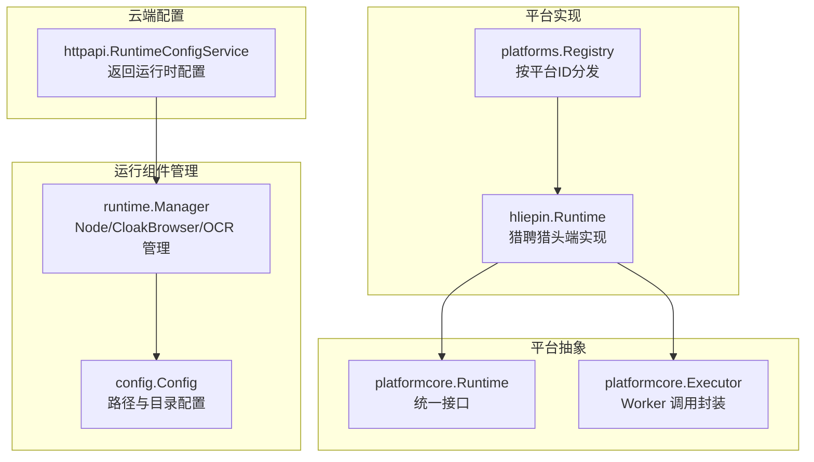

图表来源
- [runtime.go:46-110](file://goodhr5/local-agent-go/internal/platformcore/runtime.go#L46-L110)
- [registry.go:15-34](file://goodhr5/local-agent-go/internal/platforms/registry.go#L15-L34)
- [manager.go:34-90](file://goodhr5/local-agent-go/internal/runtime/manager.go#L34-L90)
- [config.go:26-88](file://goodhr5/local-agent-go/internal/config/config.go#L26-L88)
- [runtime_config.go:20-38](file://goodhr5/cloud/backend/internal/httpapi/runtime_config.go#L20-L38)

章节来源
- [runtime.go:46-110](file://goodhr5/local-agent-go/internal/platformcore/runtime.go#L46-L110)
- [registry.go:15-34](file://goodhr5/local-agent-go/internal/platforms/registry.go#L15-L34)
- [manager.go:34-90](file://goodhr5/local-agent-go/internal/runtime/manager.go#L34-L90)
- [config.go:26-88](file://goodhr5/local-agent-go/internal/config/config.go#L26-L88)
- [runtime_config.go:20-38](file://goodhr5/cloud/backend/internal/httpapi/runtime_config.go#L20-L38)

## 核心组件
- 平台运行时接口（Runtime）：定义打开入口页、准备入口页、判断是否仍在岗位入口页、读取/切换岗位、列表滚动、候选人抓取与详情处理、打招呼、筛选文本、去重指纹、详情文本清理等能力。
- 执行器（Executor）：封装对浏览器 Worker 的 Post 调用、日志写入、业务延时等待。
- 平台注册表（Registry）：按平台 ID 返回具体 Runtime 实现，未实现时返回错误提示。
- 猎聘运行时（hliepin.Runtime）：实现猎聘猎头端的具体行为，包括候选人卡片抓取、滚动翻页、姓名/年龄提取、指纹生成、ID 规范化等。
- 运行组件管理器（Manager）：管理 Node、CloakBrowser、OCR 的安装状态、路径解析、版本记录与安装进度。
- 配置（Config）：集中管理数据目录、运行时目录、日志目录、OCR 目录、控制台目录、下载目录、截图目录、云端 API 地址等。
- 运行时配置服务（RuntimeConfigService）：为已登录用户返回本地程序与运行组件的配置项，用于引导安装与展示。

章节来源
- [runtime.go:46-110](file://goodhr5/local-agent-go/internal/platformcore/runtime.go#L46-L110)
- [registry.go:15-34](file://goodhr5/local-agent-go/internal/platforms/registry.go#L15-L34)
- [hliepin_runtime.go:10-51](file://goodhr5/local-agent-go/internal/platforms/hliepin/runtime.go#L10-L51)
- [manager.go:34-90](file://goodhr5/local-agent-go/internal/runtime/manager.go#L34-L90)
- [config.go:26-88](file://goodhr5/local-agent-go/internal/config/config.go#L26-L88)
- [runtime_config.go:20-38](file://goodhr5/cloud/backend/internal/httpapi/runtime_config.go#L20-L38)

## 架构总览
下图展示了从云端配置到本地运行时、再到浏览器 Worker 的完整调用链，以及猎聘平台在其中的角色。

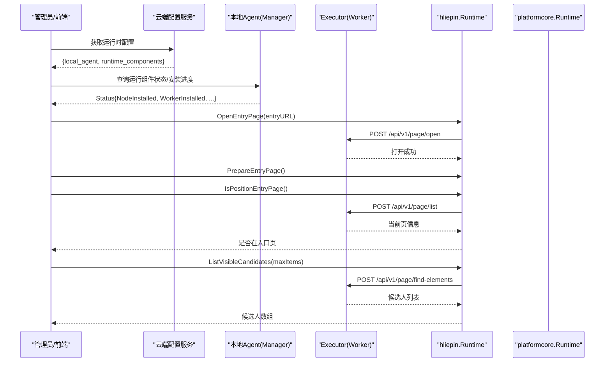

图表来源
- [runtime_config.go:20-38](file://goodhr5/cloud/backend/internal/httpapi/runtime_config.go#L20-L38)
- [manager.go:68-90](file://goodhr5/local-agent-go/internal/runtime/manager.go#L68-L90)
- [hliepin_entry.go:12-44](file://goodhr5/local-agent-go/internal/platforms/hliepin/entry.go#L12-L44)
- [hliepin_candidate.go:14-79](file://goodhr5/local-agent-go/internal/platforms/hliepin/candidate.go#L14-L79)
- [runtime.go:46-74](file://goodhr5/local-agent-go/internal/platformcore/runtime.go#L46-L74)

## 详细组件分析

### 猎聘运行时（hliepin.Runtime）
- 设计要点
  - 通过 NewRuntime 创建实例并注入平台标识符与名称，便于后续指纹与日志输出。
  - 遵循 platformcore.Runtime 接口，将平台差异收敛到具体方法中。
- 关键能力
  - 打开入口页、准备入口页、判断是否仍在入口页。
  - 抓取可见候选人列表，支持首次为空时的轮询等待与回退选择器。
  - 滚动候选人列表，支持下一页按钮与禁用类名控制。
  - 候选人筛选文本、指纹计算、详情文本清理等。

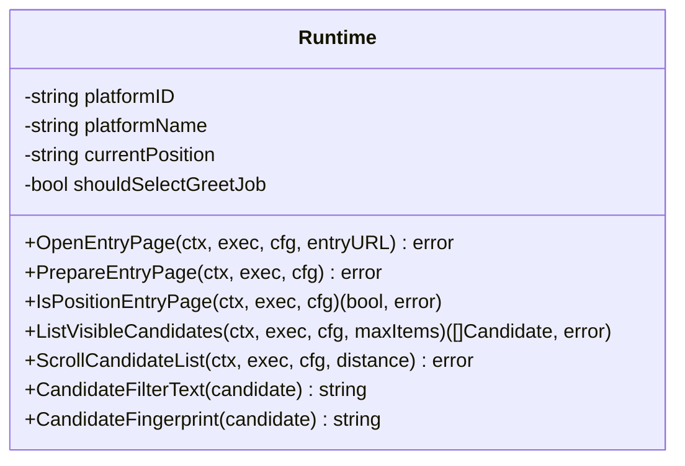

图表来源
- [hliepin_runtime.go:10-51](file://goodhr5/local-agent-go/internal/platforms/hliepin/runtime.go#L10-L51)
- [runtime.go:46-74](file://goodhr5/local-agent-go/internal/platformcore/runtime.go#L46-L74)

章节来源
- [hliepin_runtime.go:10-51](file://goodhr5/local-agent-go/internal/platforms/hliepin/runtime.go#L10-L51)
- [hliepin_entry.go:12-44](file://goodhr5/local-agent-go/internal/platforms/hliepin/entry.go#L12-L44)
- [hliepin_candidate.go:14-79](file://goodhr5/local-agent-go/internal/platforms/hliepin/candidate.go#L14-L79)

### 平台标识符管理与注册分发
- 平台 ID 来源
  - 由 Registry 根据传入的平台 ID 字符串进行小写与空白处理，默认回退到 boss。
  - hliepin.Runtime 内部维护 platformID 与 platformName，用于指纹与日志。
- 分发机制
  - 通过 registry 映射表返回对应 Runtime；若未实现则返回错误提示。

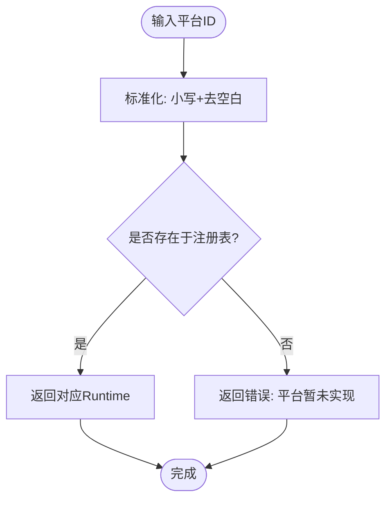

图表来源
- [registry.go:15-34](file://goodhr5/local-agent-go/internal/platforms/registry.go#L15-L34)
- [hliepin_runtime.go:18-19](file://goodhr5/local-agent-go/internal/platforms/hliepin/runtime.go#L18-L19)

章节来源
- [registry.go:15-34](file://goodhr5/local-agent-go/internal/platforms/registry.go#L15-L34)
- [hliepin_runtime.go:18-19](file://goodhr5/local-agent-go/internal/platforms/hliepin/runtime.go#L18-L19)

### 当前职位跟踪机制
- 入口页判断
  - 通过 Executor 获取当前页列表，取默认页并与配置的入口 URL 比对，决定是否仍在入口页。
- 岗位选择
  - 接口层提供 SelectPosition 能力；hliepin 实现聚焦于入口页与候选人列表操作，岗位切换由上层流程或平台特定逻辑驱动。
- 直接选择策略
  - 平台可通过 DirectPositionSelector 或 PositionSelectionSkipper 声明跳过当前岗位读取或直接切换的策略。

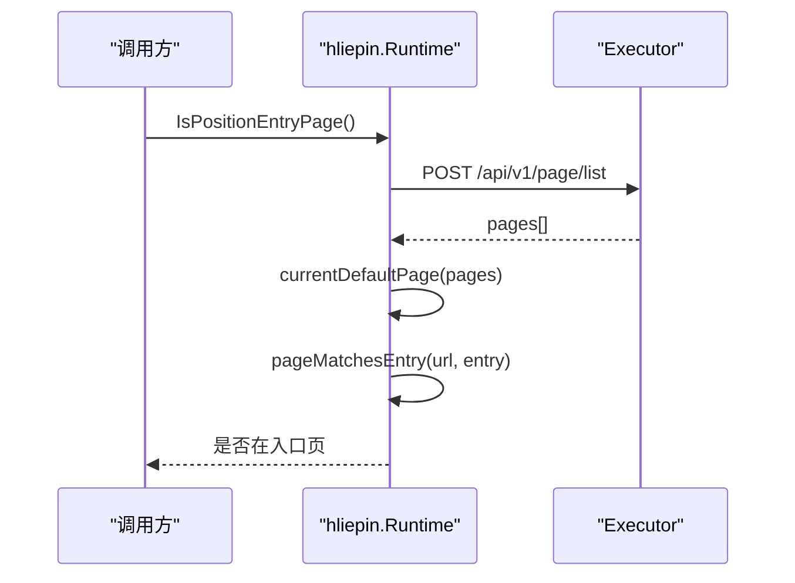

图表来源
- [hliepin_entry.go:28-44](file://goodhr5/local-agent-go/internal/platforms/hliepin/entry.go#L28-L44)
- [runtime.go:52-57](file://goodhr5/local-agent-go/internal/platformcore/runtime.go#L52-L57)
- [runtime.go:94-103](file://goodhr5/local-agent-go/internal/platformcore/runtime.go#L94-L103)

章节来源
- [hliepin_entry.go:28-44](file://goodhr5/local-agent-go/internal/platforms/hliepin/entry.go#L28-L44)
- [runtime.go:52-57](file://goodhr5/local-agent-go/internal/platformcore/runtime.go#L52-L57)
- [runtime.go:94-103](file://goodhr5/local-agent-go/internal/platformcore/runtime.go#L94-L103)

### 候选人原始文本组装算法
- 字段顺序
  - 按 name → basic_info → education → university → description 的顺序拼接，空值跳过。
- 兜底策略
  - 若 fields 为空或未命中，使用 worker 返回的 text 作为 raw_text。
- 过滤条件
  - 仅保留包含“立即沟通”的候选人条目，确保可操作。

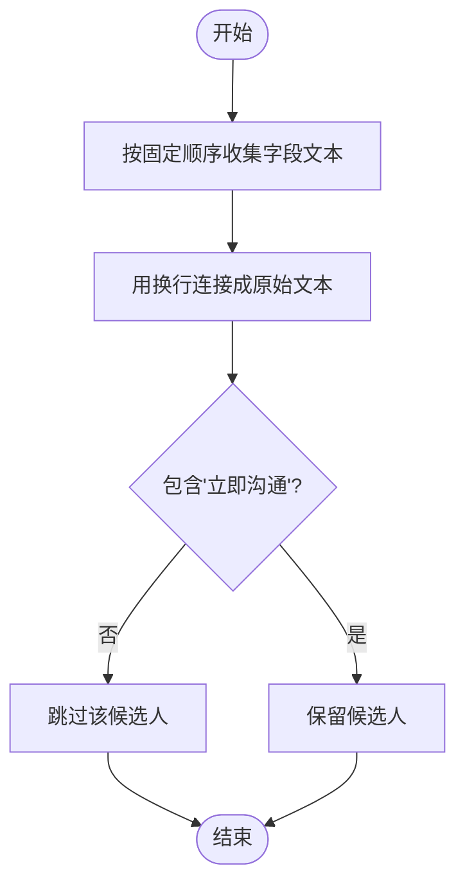

图表来源
- [hliepin_runtime.go:21-30](file://goodhr5/local-agent-go/internal/platforms/hliepin/runtime.go#L21-L30)
- [hliepin_candidate.go:48-79](file://goodhr5/local-agent-go/internal/platforms/hliepin/candidate.go#L48-L79)

章节来源
- [hliepin_runtime.go:21-30](file://goodhr5/local-agent-go/internal/platforms/hliepin/runtime.go#L21-L30)
- [hliepin_candidate.go:48-79](file://goodhr5/local-agent-go/internal/platforms/hliepin/candidate.go#L48-L79)

### 年龄提取正则表达式匹配逻辑
- 优先级
  - 优先从 candidate.age、candidate.candidate_age、fields.age、fields.candidate_age 中取非空值。
- 正则回退
  - 若上述字段为空，则从 raw_text/filter_text/basic_info 中匹配“数字+岁”的模式，提取年龄数字。
- 结果
  - 返回纯年龄字符串，供指纹与筛选使用。

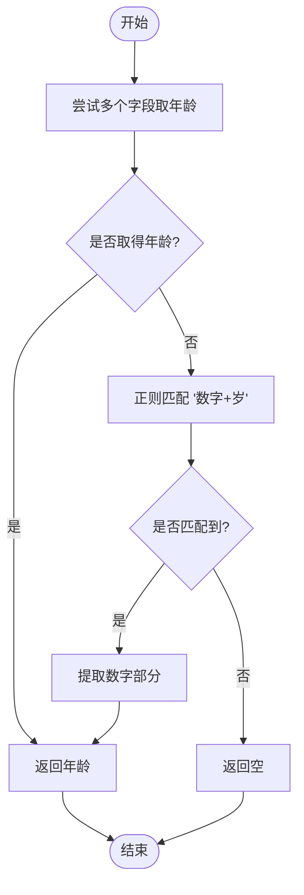

图表来源
- [hliepin_runtime.go:32-45](file://goodhr5/local-agent-go/internal/platforms/hliepin/runtime.go#L32-L45)

章节来源
- [hliepin_runtime.go:32-45](file://goodhr5/local-agent-go/internal/platforms/hliepin/runtime.go#L32-L45)

### 候选人 ID 规范化处理策略
- 首选稳定 ID
  - 若存在 platform_candidate_id，先做规范化（去除空白与多余分隔），再与平台 ID 组合形成唯一 ID。
- 次选指纹
  - 若无稳定 ID，则基于姓名、年龄与稳定化的候选文本计算哈希，组合平台 ID、姓名、年龄与哈希前缀作为 ID。
- 文本稳定化
  - 移除活跃状态、已查看标记、操作按钮等易变文本，保证指纹稳定性。

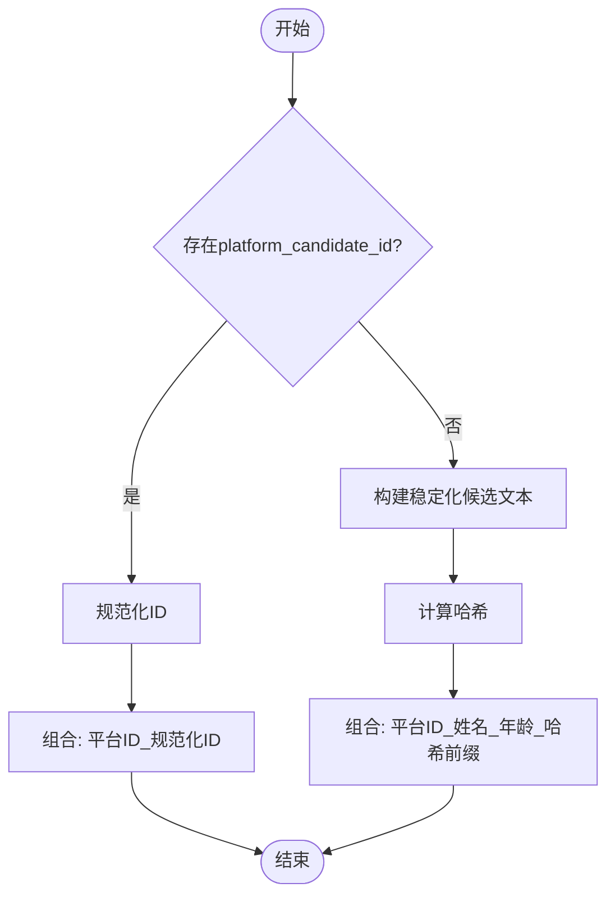

图表来源
- [hliepin_candidate.go:105-119](file://goodhr5/local-agent-go/internal/platforms/hliepin/candidate.go#L105-L119)
- [hliepin_candidate.go:121-127](file://goodhr5/local-agent-go/internal/platforms/hliepin/candidate.go#L121-L127)
- [hliepin_candidate.go:129-154](file://goodhr5/local-agent-go/internal/platforms/hliepin/candidate.go#L129-L154)
- [hliepin_runtime.go:47-51](file://goodhr5/local-agent-go/internal/platforms/hliepin/runtime.go#L47-L51)

章节来源
- [hliepin_candidate.go:105-119](file://goodhr5/local-agent-go/internal/platforms/hliepin/candidate.go#L105-L119)
- [hliepin_candidate.go:121-127](file://goodhr5/local-agent-go/internal/platforms/hliepin/candidate.go#L121-L127)
- [hliepin_candidate.go:129-154](file://goodhr5/local-agent-go/internal/platforms/hliepin/candidate.go#L129-L154)
- [hliepin_runtime.go:47-51](file://goodhr5/local-agent-go/internal/platforms/hliepin/runtime.go#L47-L51)

### 猎聘平台初始化流程
- 打开入口页
  - 校验入口 URL 非空，调用 Worker 打开页面并记录日志。
- 准备入口页
  - 搜索会刷新候选人条件；岗位选择和隐藏筛选统一在搜索完成后执行，因此此处无需额外动作。
- 判断是否仍在入口页
  - 获取当前页列表，取默认页并与配置的入口 URL 比对。

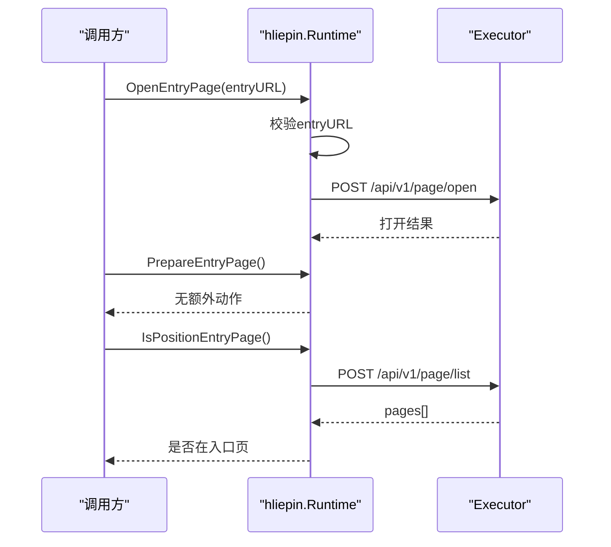

图表来源
- [hliepin_entry.go:12-44](file://goodhr5/local-agent-go/internal/platforms/hliepin/entry.go#L12-L44)

章节来源
- [hliepin_entry.go:12-44](file://goodhr5/local-agent-go/internal/platforms/hliepin/entry.go#L12-L44)

### 状态管理机制
- 运行组件状态
  - Manager.Status 汇总 Node、Worker、CloakBrowser、OCR 的安装状态、路径与版本信息，供前端展示与初始化流程判断。
- 安装进度
  - Progress 提供 running、component、stage、message、percent、received、total、updated_at 等字段，支持前端轮询展示。
- 版本记录
  - 通过 installed-components.json 持久化各组件的版本、下载地址、SHA256 与安装时间。

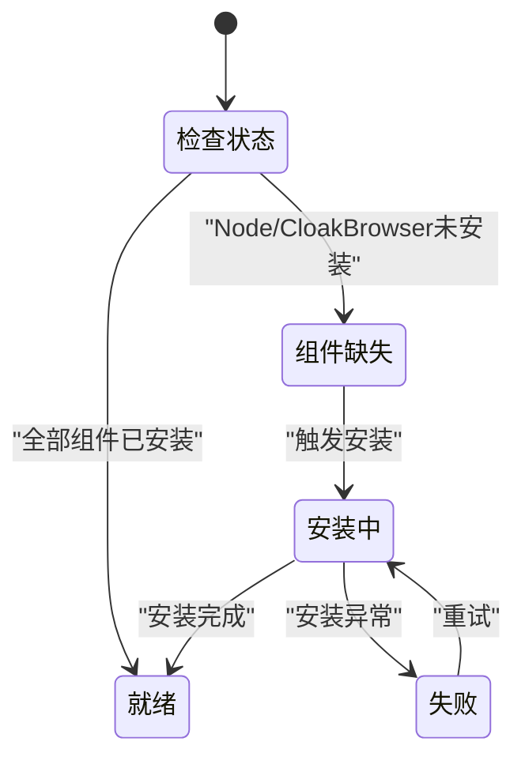

图表来源
- [manager.go:18-60](file://goodhr5/local-agent-go/internal/runtime/manager.go#L18-L60)
- [manager.go:68-90](file://goodhr5/local-agent-go/internal/runtime/manager.go#L68-L90)
- [manager.go:127-179](file://goodhr5/local-agent-go/internal/runtime/manager.go#L127-L179)

章节来源
- [manager.go:18-60](file://goodhr5/local-agent-go/internal/runtime/manager.go#L18-L60)
- [manager.go:68-90](file://goodhr5/local-agent-go/internal/runtime/manager.go#L68-L90)
- [manager.go:127-179](file://goodhr5/local-agent-go/internal/runtime/manager.go#L127-L179)

### 与其他组件的交互接口
- 与 Worker 的交互
  - 通过 Executor.Post 调用 /api/v1/page/* 系列接口，如 open、list、find-elements、scroll-or-click-next 等。
- 与云端配置服务的交互
  - 通过 RuntimeConfigService.Current 获取 local_agent 与 runtime_components 配置，驱动本地安装与引导。

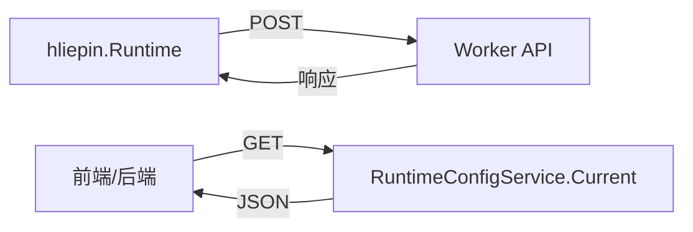

图表来源
- [hliepin_candidate.go:14-79](file://goodhr5/local-agent-go/internal/platforms/hliepin/candidate.go#L14-L79)
- [hliepin_entry.go:12-44](file://goodhr5/local-agent-go/internal/platforms/hliepin/entry.go#L12-L44)
- [runtime_config.go:20-38](file://goodhr5/cloud/backend/internal/httpapi/runtime_config.go#L20-L38)

章节来源
- [hliepin_candidate.go:14-79](file://goodhr5/local-agent-go/internal/platforms/hliepin/candidate.go#L14-L79)
- [hliepin_entry.go:12-44](file://goodhr5/local-agent-go/internal/platforms/hliepin/entry.go#L12-L44)
- [runtime_config.go:20-38](file://goodhr5/cloud/backend/internal/httpapi/runtime_config.go#L20-L38)

## 依赖关系分析
- 耦合与内聚
  - hliepin.Runtime 高度内聚于平台特定逻辑，通过 platformcore 接口解耦主流程。
  - Manager 与 Config 低耦合，专注于路径与状态管理。
- 外部依赖
  - Worker API（/api/v1/page/*）为强依赖，需保证可用。
  - 云端配置服务为可选依赖，用于引导安装与展示。

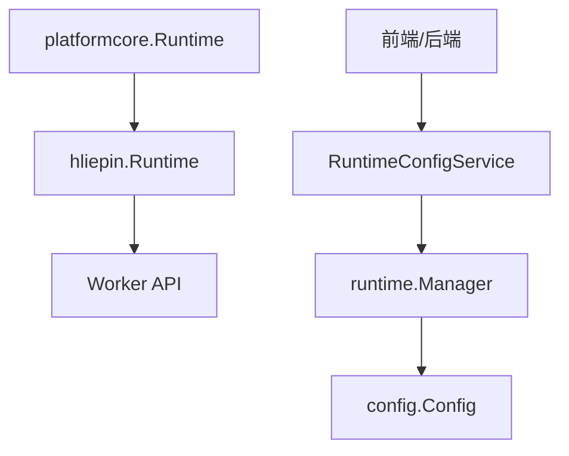

图表来源
- [runtime.go:46-110](file://goodhr5/local-agent-go/internal/platformcore/runtime.go#L46-L110)
- [hliepin_candidate.go:14-79](file://goodhr5/local-agent-go/internal/platforms/hliepin/candidate.go#L14-L79)
- [manager.go:34-90](file://goodhr5/local-agent-go/internal/runtime/manager.go#L34-L90)
- [config.go:26-88](file://goodhr5/local-agent-go/internal/config/config.go#L26-L88)
- [runtime_config.go:20-38](file://goodhr5/cloud/backend/internal/httpapi/runtime_config.go#L20-L38)

章节来源
- [runtime.go:46-110](file://goodhr5/local-agent-go/internal/platformcore/runtime.go#L46-L110)
- [hliepin_candidate.go:14-79](file://goodhr5/local-agent-go/internal/platforms/hliepin/candidate.go#L14-L79)
- [manager.go:34-90](file://goodhr5/local-agent-go/internal/runtime/manager.go#L34-L90)
- [config.go:26-88](file://goodhr5/local-agent-go/internal/config/config.go#L26-L88)
- [runtime_config.go:20-38](file://goodhr5/cloud/backend/internal/httpapi/runtime_config.go#L20-L38)

## 性能考虑
- 列表抓取优化
  - 首次为空时采用轮询等待与 required_text 条件，避免频繁无效请求。
  - 使用 visible_only 与 max_items 限制抓取范围，减少网络与解析开销。
- 滚动翻页
  - 通过 next_element 与 disabled_class 控制翻页，避免重复点击与无效滚动。
- 日志与耗时
  - 使用 formatElapsedMS 格式化耗时，便于定位瓶颈。
- 组件路径查找
  - 多候选路径与递归查找，提升在不同部署环境下的可用性。

[本节为通用指导，不直接分析具体文件]

## 故障排查指南
- 入口页相关
  - 若入口 URL 为空，将返回错误；请检查云端平台配置是否包含入口页面地址。
- 候选人列表为空
  - 当列表为空时，会记录警告日志并包含页面 URL 与选择器信息，便于定位选择器失效或页面结构变化。
- 运行组件未安装
  - Ensure 会检查 Node 与 CloakBrowser 是否安装，未安装时返回明确错误提示。
- OCR 完整性
  - ocrInstalled 检查可执行文件与模型文件是否齐全，缺失将导致 OCR 不可用。

章节来源
- [hliepin_entry.go:12-44](file://goodhr5/local-agent-go/internal/platforms/hliepin/entry.go#L12-L44)
- [hliepin_candidate.go:27-47](file://goodhr5/local-agent-go/internal/platforms/hliepin/candidate.go#L27-L47)
- [manager.go:181-192](file://goodhr5/local-agent-go/internal/runtime/manager.go#L181-L192)
- [manager.go:111-125](file://goodhr5/local-agent-go/internal/runtime/manager.go#L111-L125)

## 结论
本运行时管理方案通过统一的平台接口与具体的猎聘实现，实现了跨平台可扩展的自动化流程。结合运行组件管理与云端配置服务，提供了完整的安装引导、状态监控与错误处理能力。候选人数据处理采用稳定的文本清洗与指纹算法，确保去重与追踪的可靠性。整体架构清晰、职责分明，便于后续扩展更多平台与增强功能。

## 附录
- 运行时配置选项
  - 本地程序监听地址与端口、数据目录、运行时目录、日志目录、OCR 目录、控制台目录、下载目录、截图目录、云端 API 地址、是否自动打开控制台等。
- 性能监控指标
  - 候选人提取耗时、翻页动作原因、页面 URL、选择器、最大抓取数量等日志信息。
- 错误处理策略
  - 参数校验（如入口 URL）、组件缺失提示、列表为空告警、OCR 完整性检查等。

章节来源
- [config.go:26-88](file://goodhr5/local-agent-go/internal/config/config.go#L26-L88)
- [hliepin_candidate.go:41-47](file://goodhr5/local-agent-go/internal/platforms/hliepin/candidate.go#L41-L47)
- [manager.go:111-125](file://goodhr5/local-agent-go/internal/runtime/manager.go#L111-L125)