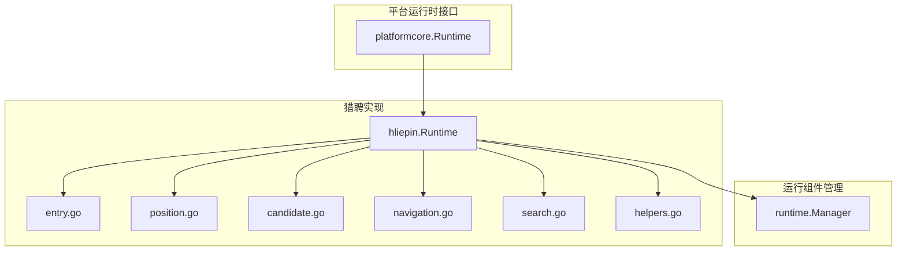
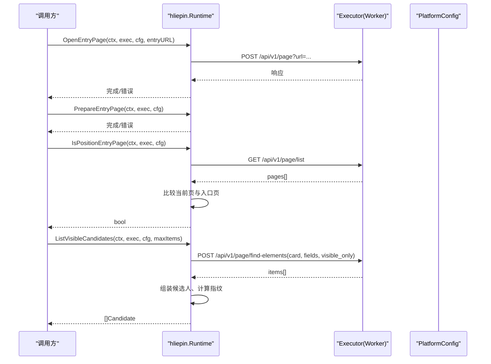
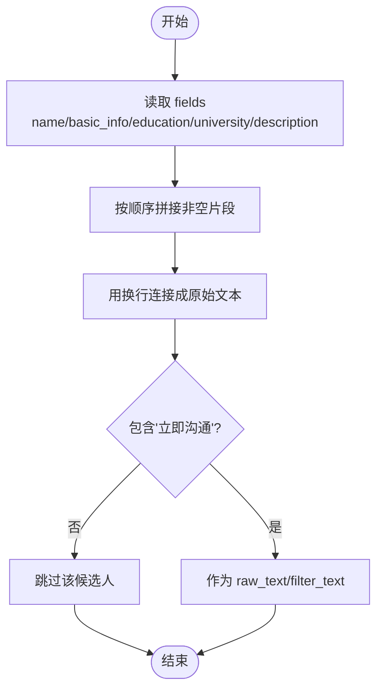
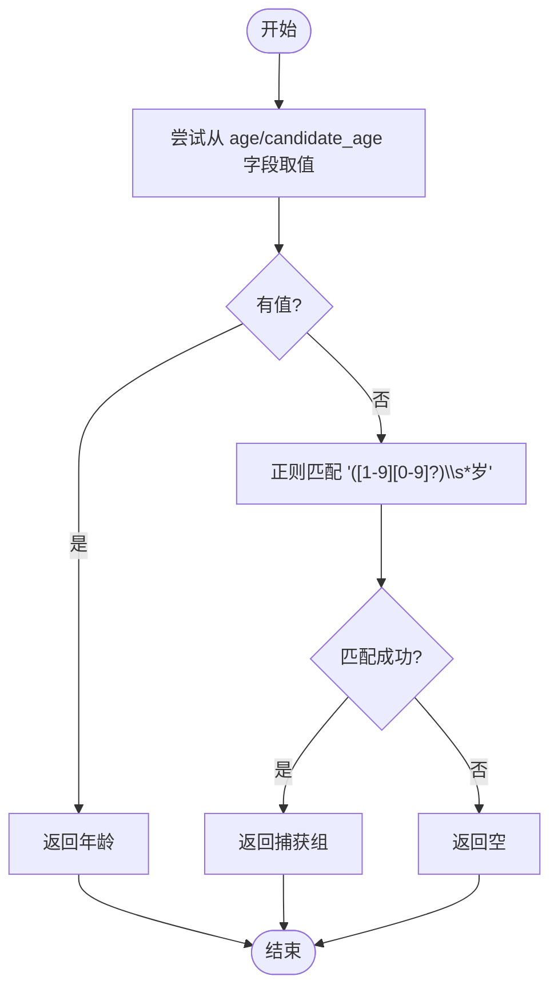
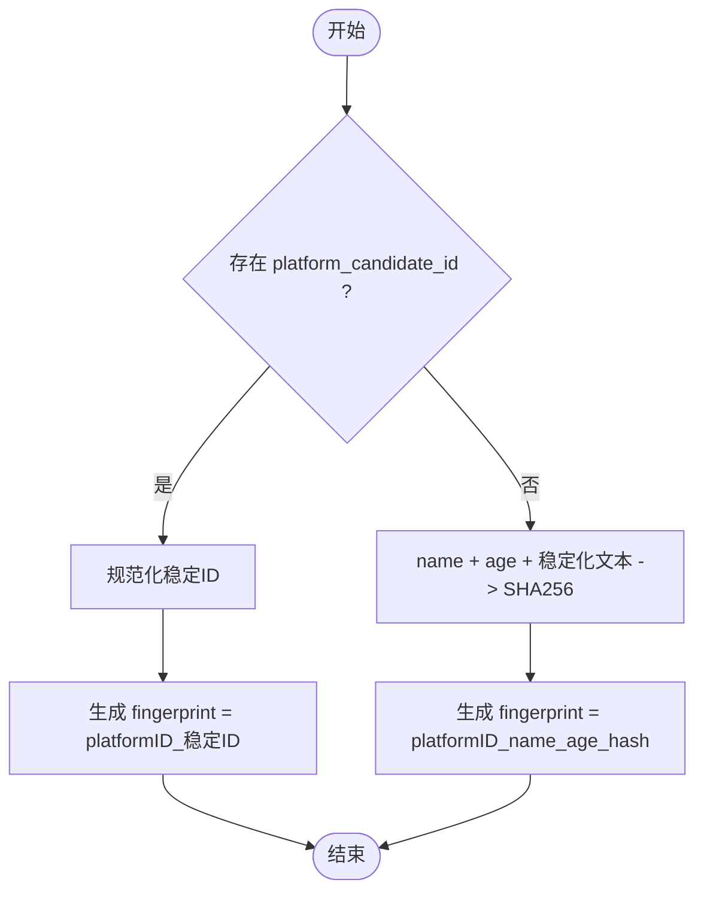
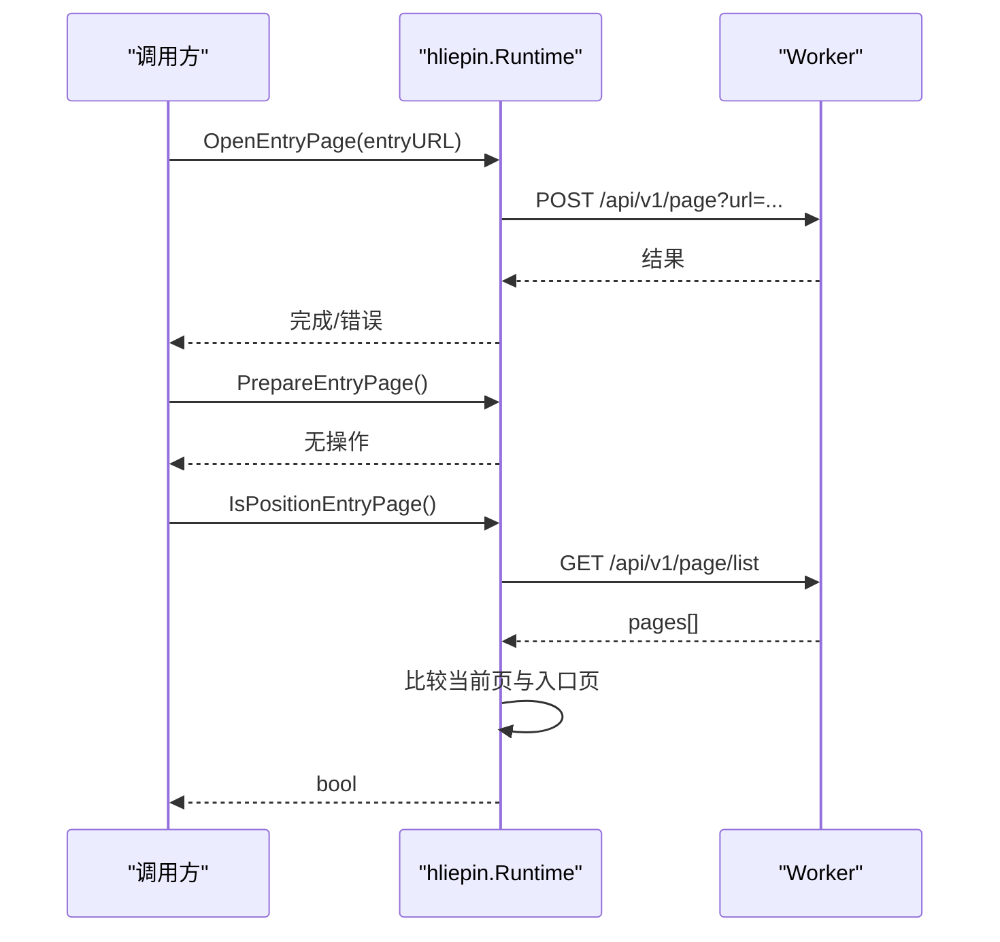
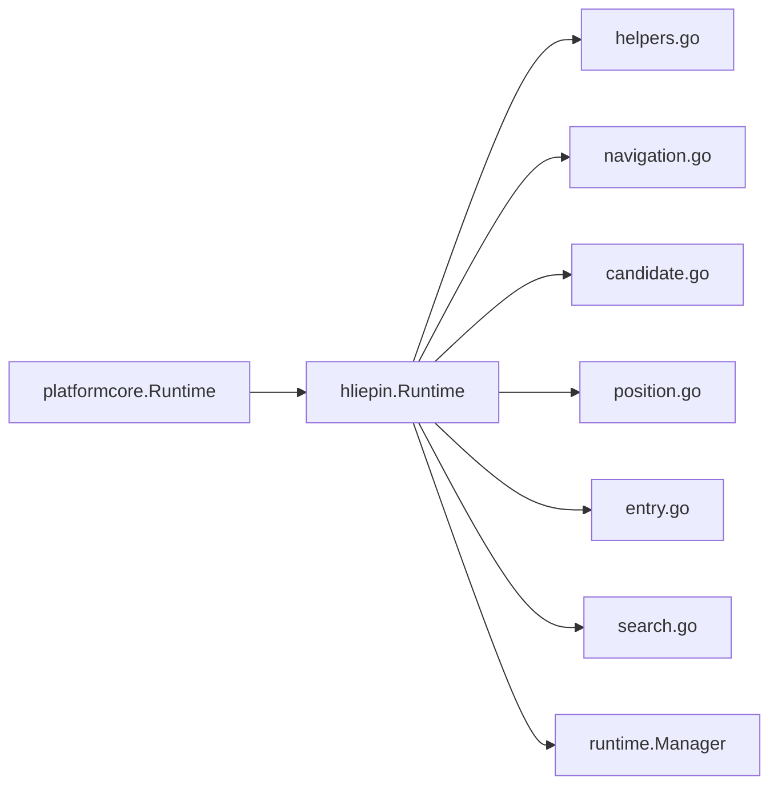

# 运行时管理

<cite>
**本文引用的文件**
- [runtime.go](file://goodhr5/local-agent-go/internal/platformcore/runtime.go)
- [runtime.go](file://goodhr5/local-agent-go/internal/platforms/hliepin/runtime.go)
- [candidate.go](file://goodhr5/local-agent-go/internal/platforms/hliepin/candidate.go)
- [entry.go](file://goodhr5/local-agent-go/internal/platforms/hliepin/entry.go)
- [position.go](file://goodhr5/local-agent-go/internal/platforms/hliepin/position.go)
- [navigation.go](file://goodhr5/local-agent-go/internal/platforms/hliepin/navigation.go)
- [search.go](file://goodhr5/local-agent-go/internal/platforms/hliepin/search.go)
- [helpers.go](file://goodhr5/local-agent-go/internal/platforms/hliepin/helpers.go)
- [manager.go](file://goodhr5/local-agent-go/internal/runtime/manager.go)
</cite>

## 目录
1. [简介](#简介)
2. [项目结构](#项目结构)
3. [核心组件](#核心组件)
4. [架构总览](#架构总览)
5. [详细组件分析](#详细组件分析)
6. [依赖关系分析](#依赖关系分析)
7. [性能考虑](#性能考虑)
8. [故障排查指南](#故障排查指南)
9. [结论](#结论)
10. [附录](#附录)

## 简介
本文件聚焦猎聘平台（猎头端）的运行时管理，围绕以下目标展开：
- Runtime 结构体的设计模式与职责边界
- 平台标识符管理与当前职位跟踪机制
- 候选人原始文本组装算法、年龄提取正则匹配逻辑、候选人 ID 规范化策略
- 猎聘平台的初始化流程、状态管理机制、与浏览器 Worker 的交互接口
- 运行时配置选项、性能监控指标、错误处理策略的实现细节

## 项目结构
本地 Agent 将“平台运行时能力”抽象为统一接口，并由各平台实现具体行为。猎聘猎头端的运行时位于 hliepin 包中，通过 platformcore 暴露统一能力；运行组件（Node、CloakBrowser、OCR）由 runtime manager 统一管理路径与安装状态。

图表来源
- [runtime.go:54-127](file://goodhr5/local-agent-go/internal/platformcore/runtime.go#L54-L127)
- [runtime.go:10-19](file://goodhr5/local-agent-go/internal/platforms/hliepin/runtime.go#L10-L19)
- [entry.go:12-45](file://goodhr5/local-agent-go/internal/platforms/hliepin/entry.go#L12-L45)
- [position.go:11-41](file://goodhr5/local-agent-go/internal/platforms/hliepin/position.go#L11-L41)
- [candidate.go:14-189](file://goodhr5/local-agent-go/internal/platforms/hliepin/candidate.go#L14-L189)
- [navigation.go:6-140](file://goodhr5/local-agent-go/internal/platforms/hliepin/navigation.go#L6-L140)
- [search.go:22-247](file://goodhr5/local-agent-go/internal/platforms/hliepin/search.go#L22-L247)
- [helpers.go:9-207](file://goodhr5/local-agent-go/internal/platforms/hliepin/helpers.go#L9-L207)
- [manager.go:18-343](file://goodhr5/local-agent-go/internal/runtime/manager.go#L18-L343)

章节来源
- [runtime.go:54-127](file://goodhr5/local-agent-go/internal/platformcore/runtime.go#L54-L127)
- [runtime.go:10-19](file://goodhr5/local-agent-go/internal/platforms/hliepin/runtime.go#L10-L19)
- [manager.go:18-90](file://goodhr5/local-agent-go/internal/runtime/manager.go#L18-L90)

## 核心组件
- 平台运行时接口（platformcore.Runtime）：定义打开入口页、准备入口页、判断是否仍在岗位入口页、读取/切换岗位、列出可见候选人、滚动列表、抓取详情、关闭详情、打招呼、筛选文本、指纹去重、清理详情文本等统一能力。
- 猎聘运行时（hliepin.Runtime）：实现上述接口，维护平台标识符、平台名称、当前岗位名以及开聊弹框是否需要选择岗位的标记。
- 运行组件管理器（runtime.Manager）：负责 Node、CloakBrowser、OCR 的路径解析、存在性检查、版本记录与安装进度。

章节来源
- [runtime.go:54-127](file://goodhr5/local-agent-go/internal/platformcore/runtime.go#L54-L127)
- [runtime.go:10-19](file://goodhr5/local-agent-go/internal/platforms/hliepin/runtime.go#L10-L19)
- [manager.go:18-90](file://goodhr5/local-agent-go/internal/runtime/manager.go#L18-L90)

## 架构总览
猎聘运行时通过 Executor 与浏览器 Worker 通信，使用统一的 HTTP API 进行页面操作、元素定位、文本提取、滚动与点击。平台配置以 map 形式传入，包含 auth/pages、card、behavior、position 等分区。

图表来源
- [entry.go:12-45](file://goodhr5/local-agent-go/internal/platforms/hliepin/entry.go#L12-L45)
- [candidate.go:14-79](file://goodhr5/local-agent-go/internal/platforms/hliepin/candidate.go#L14-L79)
- [navigation.go:6-65](file://goodhr5/local-agent-go/internal/platforms/hliepin/navigation.go#L6-L65)
- [runtime.go:54-82](file://goodhr5/local-agent-go/internal/platformcore/runtime.go#L54-L82)

## 详细组件分析

### Runtime 结构体与平台标识符管理
- 字段说明
  - platformID：平台唯一标识，用于候选人与日志区分平台来源。
  - platformName：人类可读的平台名称。
  - currentPosition：当前岗位名称缓存，避免重复读取。
  - shouldSelectGreetJob：控制开聊弹框是否需要选择岗位。
- 设计要点
  - 通过 NewRuntime 构造时固定 platformID 与 platformName，保证一致性。
  - 当前岗位名在搜索准备阶段写入，供 CurrentPositionName 快速返回。

章节来源
- [runtime.go:10-19](file://goodhr5/local-agent-go/internal/platforms/hliepin/runtime.go#L10-L19)
- [search.go:22-54](file://goodhr5/local-agent-go/internal/platforms/hliepin/search.go#L22-L54)
- [position.go:15-34](file://goodhr5/local-agent-go/internal/platforms/hliepin/position.go#L15-L34)

### 当前职位跟踪机制
- 搜索准备阶段会记录 positionSnapshot.name 到 currentPosition，并决定是否需要在开聊弹框中选择岗位。
- CurrentPositionName 优先返回缓存的 normalized 岗位名，否则从页面提取并标准化后返回。
- SelectPosition 对猎聘猎头端为空实现，因为主流程跳过岗位切换。

章节来源
- [search.go:22-54](file://goodhr5/local-agent-go/internal/platforms/hliepin/search.go#L22-L54)
- [position.go:11-41](file://goodhr5/local-agent-go/internal/platforms/hliepin/position.go#L11-L41)

### 候选人原始文本组装算法
- 字段拼接顺序：name → basic_info → education → university → description。
- 若卡片未提供 fields，则回退到行级 raw_text。
- 过滤掉不含“立即沟通”的行，确保仅处理可沟通候选人。
- 最终 raw_text/filter_text 用于后续筛选与指纹生成。

图表来源
- [runtime.go:21-30](file://goodhr5/local-agent-go/internal/platforms/hliepin/runtime.go#L21-L30)
- [candidate.go:48-79](file://goodhr5/local-agent-go/internal/platforms/hliepin/candidate.go#L48-L79)

章节来源
- [runtime.go:21-30](file://goodhr5/local-agent-go/internal/platforms/hliepin/runtime.go#L21-L30)
- [candidate.go:48-79](file://goodhr5/local-agent-go/internal/platforms/hliepin/candidate.go#L48-L79)

### 年龄提取正则表达式匹配逻辑
- 优先级：优先从 candidate.age/candidate.candidate_age/fields.age/fields.candidate_age 取直接值。
- 若为空，则从 raw_text/filter_text/basic_info 中用正则匹配“数字+岁”的模式提取年龄。
- 未匹配到则返回空字符串。

图表来源
- [runtime.go:32-45](file://goodhr5/local-agent-go/internal/platforms/hliepin/runtime.go#L32-L45)

章节来源
- [runtime.go:32-45](file://goodhr5/local-agent-go/internal/platforms/hliepin/runtime.go#L32-L45)

### 候选人 ID 规范化与去重指纹
- 首选稳定 ID：若存在 platform_candidate_id，则去除空白与多余字符后，组合 platformID + "_" + 规范化后的 ID。
- 回退方案：若无稳定 ID，则基于 name + age + 稳定化后的 raw/filter 文本计算 SHA256，再组合 platformID + "_" + 规范化 name + "_" + 规范化 age + "_" + 摘要前缀。
- 规范化函数会移除多余空白，保证稳定性。

图表来源
- [candidate.go:105-119](file://goodhr5/local-agent-go/internal/platforms/hliepin/candidate.go#L105-L119)
- [runtime.go:47-50](file://goodhr5/local-agent-go/internal/platforms/hliepin/runtime.go#L47-L50)

章节来源
- [candidate.go:105-119](file://goodhr5/local-agent-go/internal/platforms/hliepin/candidate.go#L105-L119)
- [runtime.go:47-50](file://goodhr5/local-agent-go/internal/platforms/hliepin/runtime.go#L47-L50)

### 猎聘平台初始化流程
- 打开入口页：校验 entryURL 非空，调用 Worker 打开页面并记录日志。
- 准备入口页：猎聘猎头端无需额外动作。
- 判断是否在入口页：获取当前页面列表，选择默认页并与入口配置 URL 匹配（支持 prefix/contains/精确匹配）。

图表来源
- [entry.go:12-45](file://goodhr5/local-agent-go/internal/platforms/hliepin/entry.go#L12-L45)
- [navigation.go:6-65](file://goodhr5/local-agent-go/internal/platforms/hliepin/navigation.go#L6-L65)

章节来源
- [entry.go:12-45](file://goodhr5/local-agent-go/internal/platforms/hliepin/entry.go#L12-L45)
- [navigation.go:6-65](file://goodhr5/local-agent-go/internal/platforms/hliepin/navigation.go#L6-L65)

### 状态管理机制
- 当前岗位名：在搜索准备阶段写入，CurrentPositionName 优先返回缓存。
- 开聊弹框选择标记：根据是否启用快捷搜索决定是否需要选择岗位。
- 运行组件状态：Manager.Status 汇总 Node/CloakBrowser/OCR 的安装情况与路径，便于前端展示与流程判断。

章节来源
- [search.go:22-54](file://goodhr5/local-agent-go/internal/platforms/hliepin/search.go#L22-L54)
- [position.go:15-34](file://goodhr5/local-agent-go/internal/platforms/hliepin/position.go#L15-L34)
- [manager.go:68-90](file://goodhr5/local-agent-go/internal/runtime/manager.go#L68-L90)

### 与其他组件的交互接口
- 通过 platformcore.Executor 统一调用 Worker 的 HTTP API：
  - /api/v1/page/open：打开页面
  - /api/v1/page/list：获取页面列表
  - /api/v1/page/find-elements：查找元素并提取字段
  - /api/v1/page/scroll-or-click-next：滚动或翻页
  - /api/v1/page/extract-text：提取文本
  - /api/v1/page/url：获取当前 URL
- 这些接口被猎聘运行时广泛使用，屏蔽了底层浏览器差异。

章节来源
- [runtime.go:10-18](file://goodhr5/local-agent-go/internal/platformcore/runtime.go#L10-L18)
- [candidate.go:14-98](file://goodhr5/local-agent-go/internal/platforms/hliepin/candidate.go#L14-L98)
- [entry.go:12-45](file://goodhr5/local-agent-go/internal/platforms/hliepin/entry.go#L12-L45)
- [position.go:15-34](file://goodhr5/local-agent-go/internal/platforms/hliepin/position.go#L15-L34)

### 运行时配置选项
- 入口页配置：auth.pages 或 cfg.url，支持 match 类型（prefix/contains/精确）。
- 候选人卡片字段：card.fields 定义字段定位器，会被转换为 Worker 的元素协议。
- 行为配置：behavior.nextPageBtn、behavior.nextPageDisabledClass 控制翻页。
- 岗位配置：position.current 用于读取当前岗位名称。

章节来源
- [navigation.go:6-65](file://goodhr5/local-agent-go/internal/platforms/hliepin/navigation.go#L6-L65)
- [helpers.go:112-180](file://goodhr5/local-agent-go/internal/platforms/hliepin/helpers.go#L112-L180)
- [candidate.go:81-98](file://goodhr5/local-agent-go/internal/platforms/hliepin/candidate.go#L81-L98)
- [position.go:15-34](file://goodhr5/local-agent-go/internal/platforms/hliepin/position.go#L15-L34)

### 性能监控指标
- 耗时统计：候选人提取过程记录 elapsed 时间并以 ms/s 格式化输出。
- 轮询等待：首次为空时采用短间隔轮询等待加载完成，避免阻塞。
- 日志级别：info/warning/error 分级输出，便于问题定位。

章节来源
- [candidate.go:14-79](file://goodhr5/local-agent-go/internal/platforms/hliepin/candidate.go#L14-L79)
- [helpers.go:38-48](file://goodhr5/local-agent-go/internal/platforms/hliepin/helpers.go#L38-L48)

### 错误处理策略
- 入口页缺少 URL：直接返回错误，阻止后续流程。
- 页面为空：记录 warning 并附带 URL、selector、max_items，便于诊断。
- 搜索项未找到：返回明确错误信息，包含当前页面项列表，帮助快速定位配置问题。
- 运行组件缺失：Ensure 检查 Node/CloakBrowser 是否存在，缺失时返回错误提示。

章节来源
- [entry.go:12-45](file://goodhr5/local-agent-go/internal/platforms/hliepin/entry.go#L12-L45)
- [candidate.go:27-47](file://goodhr5/local-agent-go/internal/platforms/hliepin/candidate.go#L27-L47)
- [search.go:56-123](file://goodhr5/local-agent-go/internal/platforms/hliepin/search.go#L56-L123)
- [manager.go:181-192](file://goodhr5/local-agent-go/internal/runtime/manager.go#L181-L192)

## 依赖关系分析
- 猎聘运行时依赖 platformcore 提供的统一接口，解耦了平台差异。
- 通过 helpers 工具函数统一处理 map/any 转换、元素定位器转换、日志格式化等。
- 运行组件管理器独立于平台运行时，负责环境就绪性检查。

图表来源
- [runtime.go:54-127](file://goodhr5/local-agent-go/internal/platformcore/runtime.go#L54-L127)
- [helpers.go:9-207](file://goodhr5/local-agent-go/internal/platforms/hliepin/helpers.go#L9-L207)
- [navigation.go:6-140](file://goodhr5/local-agent-go/internal/platforms/hliepin/navigation.go#L6-L140)
- [candidate.go:14-189](file://goodhr5/local-agent-go/internal/platforms/hliepin/candidate.go#L14-L189)
- [position.go:11-41](file://goodhr5/local-agent-go/internal/platforms/hliepin/position.go#L11-L41)
- [entry.go:12-45](file://goodhr5/local-agent-go/internal/platforms/hliepin/entry.go#L12-L45)
- [search.go:22-247](file://goodhr5/local-agent-go/internal/platforms/hliepin/search.go#L22-L247)
- [manager.go:18-343](file://goodhr5/local-agent-go/internal/runtime/manager.go#L18-L343)

章节来源
- [runtime.go:54-127](file://goodhr5/local-agent-go/internal/platformcore/runtime.go#L54-L127)
- [helpers.go:9-207](file://goodhr5/local-agent-go/internal/platforms/hliepin/helpers.go#L9-L207)
- [manager.go:18-343](file://goodhr5/local-agent-go/internal/runtime/manager.go#L18-L343)

## 性能考虑
- 减少不必要的页面跳转：猎聘猎头端跳过岗位切换，降低交互开销。
- 智能回退与轮询：首次为空时自动轮询等待加载，提高鲁棒性。
- 文本稳定化：去除易变标记（活跃、已查看等），提升指纹稳定性，减少重复处理。
- 日志与耗时：关键步骤记录耗时与上下文，便于性能分析与优化。

[本节为通用指导，不直接分析具体文件]

## 故障排查指南
- 入口页无法打开：检查云端配置中的入口 URL 是否正确。
- 候选人列表为空：确认页面是否处于正确入口页，核对 card 选择器与字段配置。
- 快捷搜索/发布职位未命中：核对配置名称与页面显示名称是否完全一致，必要时调整匹配策略。
- 运行组件缺失：使用 Manager.Status 检查 Node/CloakBrowser/OCR 是否安装完整。

章节来源
- [entry.go:12-45](file://goodhr5/local-agent-go/internal/platforms/hliepin/entry.go#L12-L45)
- [candidate.go:27-47](file://goodhr5/local-agent-go/internal/platforms/hliepin/candidate.go#L27-L47)
- [search.go:56-123](file://goodhr5/local-agent-go/internal/platforms/hliepin/search.go#L56-L123)
- [manager.go:68-90](file://goodhr5/local-agent-go/internal/runtime/manager.go#L68-L90)

## 结论
猎聘猎头端运行时通过清晰的接口抽象与稳定的数据组装、指纹生成策略，实现了跨平台一致的自动化流程。结合运行组件管理器的环境就绪检查与完善的错误处理，整体具备高鲁棒性与可维护性。建议在后续迭代中继续强化配置校验、增加更多性能埋点，并完善异常恢复策略。

[本节为总结，不直接分析具体文件]

## 附录
- 关键常量与选择器：快捷搜索、发布职位、展开按钮、轮询超时与间隔等。
- 文本稳定化规则：移除活跃状态、已查看、在线等易变标记。
- 配置分区说明：auth/pages、card、behavior、position 的作用与用法。

章节来源
- [search.go:13-20](file://goodhr5/local-agent-go/internal/platforms/hliepin/search.go#L13-L20)
- [candidate.go:129-159](file://goodhr5/local-agent-go/internal/platforms/hliepin/candidate.go#L129-L159)
- [navigation.go:6-65](file://goodhr5/local-agent-go/internal/platforms/hliepin/navigation.go#L6-L65)
- [helpers.go:112-180](file://goodhr5/local-agent-go/internal/platforms/hliepin/helpers.go#L112-L180)