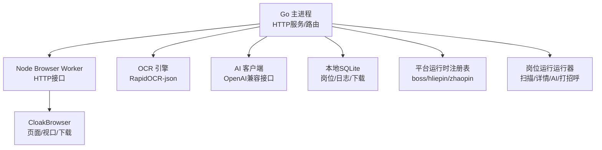
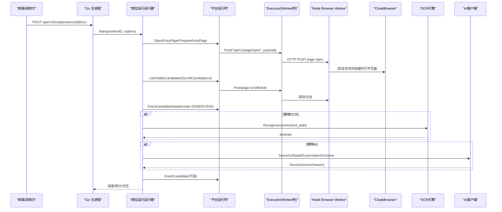
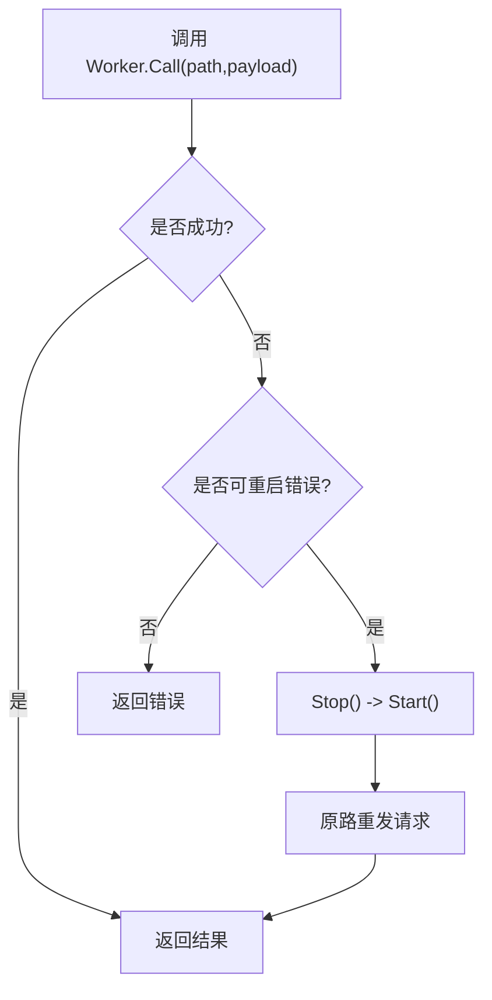
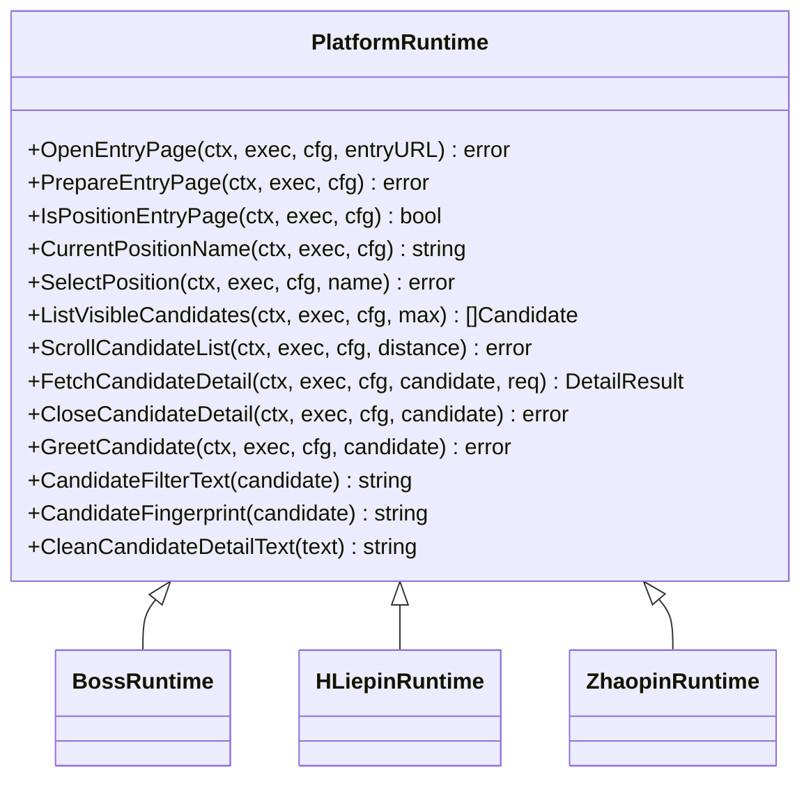
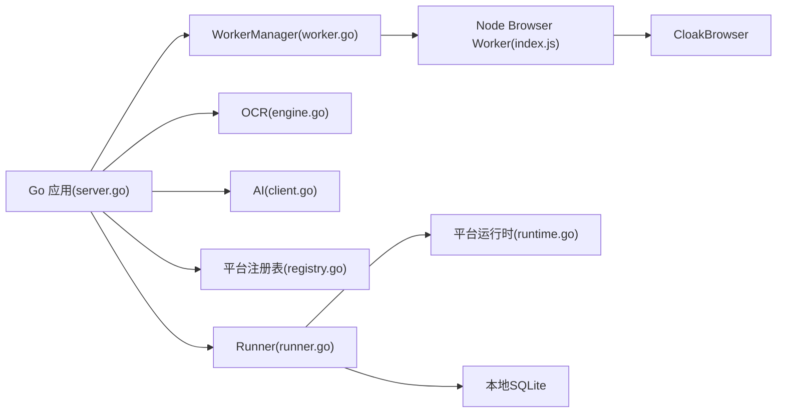

# 本地执行器

<cite>
**本文引用的文件**
- [main.go](file://goodhr5/local-agent-go/cmd/goodhr-local-agent/main.go)
- [server.go](file://goodhr5/local-agent-go/internal/app/server.go)
- [worker.go](file://goodhr5/local-agent-go/internal/browser/worker.go)
- [go_cdp.go](file://goodhr5/local-agent-go/internal/browser/go_cdp.go)
- [engine.go](file://goodhr5/local-agent-go/internal/ocr/engine.go)
- [client.go](file://goodhr5/local-agent-go/internal/localai/client.go)
- [runtime.go](file://goodhr5/local-agent-go/internal/platformcore/runtime.go)
- [registry.go](file://goodhr5/local-agent-go/internal/platforms/registry.go)
- [boss_runtime.go](file://goodhr5/local-agent-go/internal/platforms/boss/runtime.go)
- [hliepin_runtime.go](file://goodhr5/local-agent-go/internal/platforms/hliepin/runtime.go)
- [zhaopin_runtime.go](file://goodhr5/local-agent-go/internal/platforms/zhaopin/runtime.go)
- [runner.go](file://goodhr5/local-agent-go/internal/positionrunner/runner.go)
- [index.js](file://goodhr5/local-agent-go/worker-node/src/index.js)
</cite>

## 目录
1. [简介](#简介)
2. [项目结构](#项目结构)
3. [核心组件](#核心组件)
4. [架构总览](#架构总览)
5. [详细组件分析](#详细组件分析)
6. [依赖关系分析](#依赖关系分析)
7. [性能与稳定性](#性能与稳定性)
8. [故障排查指南](#故障排查指南)
9. [结论](#结论)
10. [附录：平台适配与扩展指南](#附录：平台适配与扩展指南)

## 简介
本文件面向“本地执行器”（GoodHR 5 Go 版本本地程序），系统性说明其架构设计、任务调度机制、浏览器自动化引擎、多平台适配器（Boss直聘、猎聘猎头端、智联招聘）、Node.js Worker 进程职责、CDP/HTTP 通信方式、页面操作封装、AI 集成、OCR 识别、截图处理，以及平台适配开发指南、自定义操作扩展方法、调试工具、日志分析与性能监控等运维内容。目标是让具备不同技术背景的读者都能理解并高效使用或扩展该系统。

## 项目结构
本地执行器采用“Go 主进程 + Node.js Worker 子进程”的混合架构：
- Go 主进程负责 HTTP API、运行组件管理、岗位运行编排、OCR/AI 调用、数据库与配置、平台运行时分发。
- Node.js Worker 负责启动 CloakBrowser、维护页面上下文、提供页面操作 API（打开页、点击、输入、滚动、截图、Cookie、下载记录等）。
- 平台运行时按平台 ID 注册与分发，统一抽象出打开入口、切换岗位、提取候选人、读取详情、打招呼等能力。
- 岗位运行运行器负责扫描、筛选、详情读取、AI 评分、打招呼、统计与持久化。

图表来源
- [server.go:117-168](file://goodhr5/local-agent-go/internal/app/server.go#L117-L168)
- [worker.go:78-142](file://goodhr5/local-agent-go/internal/browser/worker.go#L78-L142)
- [engine.go:59-97](file://goodhr5/local-agent-go/internal/ocr/engine.go#L59-L97)
- [client.go:258-326](file://goodhr5/local-agent-go/internal/localai/client.go#L258-L326)
- [registry.go:15-34](file://goodhr5/local-agent-go/internal/platforms/registry.go#L15-L34)
- [runner.go:71-86](file://goodhr5/local-agent-go/internal/positionrunner/runner.go#L71-L86)

章节来源
- [main.go:18-62](file://goodhr5/local-agent-go/cmd/goodhr-local-agent/main.go#L18-L62)
- [server.go:117-168](file://goodhr5/local-agent-go/internal/app/server.go#L117-L168)

## 核心组件
- 本地 HTTP 服务与路由：统一暴露健康检查、诊断、运行组件安装、Worker 控制、页面操作、OCR、岗位运行等接口。
- Node Browser Worker 管理器：启动/停止/重启 Worker，自动清理旧进程，端口探测与兼容性校验，失败自动重试。
- OCR 引擎：常驻进程模式调用 RapidOCR-json，支持环境变量覆盖可执行文件与参数，模型完整性检查。
- AI 客户端：OpenAI 兼容聊天接口，支持流式响应、提前评分、视觉输入（图片+文本）打分、重试退避与错误分类。
- 平台运行时：统一 Runtime 接口，按平台 ID 分发 Boss、猎聘猎头端、智联招聘实现。
- 岗位运行运行器：后台异步运行，支持轮次、滚动距离、详情页打开概率、随机延时、摸鱼休息、统计持久化与云端同步。

章节来源
- [server.go:35-63](file://goodhr5/local-agent-go/internal/app/server.go#L35-L63)
- [worker.go:27-54](file://goodhr5/local-agent-go/internal/browser/worker.go#L27-L54)
- [engine.go:21-57](file://goodhr5/local-agent-go/internal/ocr/engine.go#L21-L57)
- [client.go:33-115](file://goodhr5/local-agent-go/internal/localai/client.go#L33-L115)
- [runtime.go:10-111](file://goodhr5/local-agent-go/internal/platformcore/runtime.go#L10-L111)
- [runner.go:71-216](file://goodhr5/local-agent-go/internal/positionrunner/runner.go#L71-L216)

## 架构总览
整体数据与控制流如下：
- 前端/外部系统通过 Go 主进程 HTTP 接口触发任务。
- 岗位运行由运行器编排，调用平台运行时完成页面导航、列表滚动、候选人提取、详情读取、AI 评分、打招呼等操作。
- 平台运行时通过 Executor 接口调用 Node Worker 的页面操作 API。
- Node Worker 基于 CloakBrowser 驱动浏览器，提供稳定的页面操作能力。
- OCR 与 AI 作为可选增强能力，在详情读取与评分阶段按需启用。

图表来源
- [server.go:408-451](file://goodhr5/local-agent-go/internal/app/server.go#L408-L451)
- [runner.go:145-171](file://goodhr5/local-agent-go/internal/positionrunner/runner.go#L145-L171)
- [runtime.go:46-74](file://goodhr5/local-agent-go/internal/platformcore/runtime.go#L46-L74)
- [worker.go:254-332](file://goodhr5/local-agent-go/internal/browser/worker.go#L254-L332)
- [engine.go:59-97](file://goodhr5/local-agent-go/internal/ocr/engine.go#L59-L97)
- [client.go:164-256](file://goodhr5/local-agent-go/internal/localai/client.go#L164-L256)

## 详细组件分析

### Go 主进程与服务路由
- 启动流程：解析参数、初始化配置、文件日志、浏览器 Profile 默认项、创建 Server 并运行。
- 路由注册：健康检查、诊断、运行组件状态/安装、Worker 控制、页面操作、OCR、岗位运行、下载/截图、云端配置与订阅状态等。
- 关键特性：固定监听地址与端口、自动打开控制台、旧实例检测与复用、Worker 端口清理与就绪等待。

章节来源
- [main.go:18-62](file://goodhr5/local-agent-go/cmd/goodhr-local-agent/main.go#L18-L62)
- [server.go:87-168](file://goodhr5/local-agent-go/internal/app/server.go#L87-L168)

### Node Browser Worker 管理
- 生命周期：Start/Stop/Restart；自动清理固定端口上的旧 Worker；启动时注入环境变量（Node路径、CloakBrowser路径、运行时目录、Agent回调地址）。
- 健康检查：轮询 /health，验证 worker 类型与版本兼容性；发现不匹配则提示重新安装。
- 调用转发：Call/CallGet 将请求发送至 Worker，失败时自动重启并重试一次；错误归一化为中文提示。
- 日志：独立日志文件，退出时附带最近日志摘要，便于定位崩溃原因。

图表来源
- [worker.go:254-332](file://goodhr5/local-agent-go/internal/browser/worker.go#L254-L332)
- [worker.go:287-292](file://goodhr5/local-agent-go/internal/browser/worker.go#L287-L292)
- [worker.go:334-364](file://goodhr5/local-agent-go/internal/browser/worker.go#L334-L364)

章节来源
- [worker.go:78-142](file://goodhr5/local-agent-go/internal/browser/worker.go#L78-L142)
- [worker.go:241-332](file://goodhr5/local-agent-go/internal/browser/worker.go#L241-L332)
- [worker.go:404-462](file://goodhr5/local-agent-go/internal/browser/worker.go#L404-L462)

### CDP/页面控制与通信
- Go 侧实验性 CDP 客户端：通过 WebSocket 直接连接浏览器 DevTools，发送/接收 JSON 消息，支持超时与关闭语义。
- 页面脚本执行：Runtime.evaluate 支持 await Promise 与返回值提取。
- 注意：当前主要使用 Node Worker 提供的 HTTP API 进行页面操作；CDP 模块为底层能力预留。

章节来源
- [go_cdp.go:48-119](file://goodhr5/local-agent-go/internal/browser/go_cdp.go#L48-L119)
- [go_cdp.go:148-195](file://goodhr5/local-agent-go/internal/browser/go_cdp.go#L148-L195)

### OCR 引擎
- 启动与复用：首次识别时启动常驻进程，后续复用 stdin/stdout 管道交互；异常退出后自动重建。
- 可执行文件查找：优先环境变量 GOODHR_OCR_EXECUTABLE，其次运行目录与 PATH；支持多种可执行名。
- 模型校验：要求 models 目录下存在 ch_PP-OCRv3_det_infer.onnx。
- 输出处理：递归收集 text/txt/label/data/result 字段拼接为可读文本。

章节来源
- [engine.go:59-97](file://goodhr5/local-agent-go/internal/ocr/engine.go#L59-L97)
- [engine.go:101-146](file://goodhr5/local-agent-go/internal/ocr/engine.go#L101-L146)
- [engine.go:240-286](file://goodhr5/local-agent-go/internal/ocr/engine.go#L240-L286)
- [engine.go:298-326](file://goodhr5/local-agent-go/internal/ocr/engine.go#L298-L326)

### AI 集成
- 通用聊天：OpenAI 兼容接口，默认流式输出，支持 temperature、extra 字段透传。
- 提前评分：从流式文本中尽早提取包含 score 与 reason 的完整 JSON，触发 EarlyDecision 回调。
- 视觉打分：支持 base64 图片与文本组合，返回结构化简历片段与评分。
- 重试策略：根据 HTTP 状态码与 Retry-After 头进行退避重试；区分可重试与致命错误。
- 思考模式：当 enable_thinking=true 或未设置时，不向服务端传递该字段；显式 false 时才发送。

章节来源
- [client.go:258-326](file://goodhr5/local-agent-go/internal/localai/client.go#L258-L326)
- [client.go:470-554](file://goodhr5/local-agent-go/internal/localai/client.go#L470-L554)
- [client.go:219-256](file://goodhr5/local-agent-go/internal/localai/client.go#L219-L256)
- [client.go:378-420](file://goodhr5/local-agent-go/internal/localai/client.go#L378-L420)

### 平台运行时与多平台适配
- 统一接口：Runtime 定义打开入口、准备页面、判断入口页、读取岗位名、切换岗位、提取候选人、滚动列表、读取详情、关闭详情、打招呼、筛选文本、指纹去重、详情文本清洗等。
- 可选能力：基础筛选应用、打招呼后索要信息、搜索准备、直接选择岗位、跳过岗位选择、详情滚动。
- 注册表：按平台 ID 分发 boss、hliepin、liepin、zhaopin。
- 平台差异：
  - Boss：构造可见定位负载，年龄正则提取，ID 规范化。
  - 猎聘猎头端：候选卡片原始文本组装，年龄正则提取，ID 规范化。
  - 智联招聘：直接切换岗位策略，候选匹配文本构造，年龄正则提取，ID 规范化。

图表来源
- [runtime.go:46-111](file://goodhr5/local-agent-go/internal/platformcore/runtime.go#L46-L111)
- [boss_runtime.go:11-62](file://goodhr5/local-agent-go/internal/platforms/boss/runtime.go#L11-L62)
- [hliepin_runtime.go:10-51](file://goodhr5/local-agent-go/internal/platforms/hliepin/runtime.go#L10-L51)
- [zhaopin_runtime.go:11-69](file://goodhr5/local-agent-go/internal/platforms/zhaopin/runtime.go#L11-L69)

章节来源
- [registry.go:15-34](file://goodhr5/local-agent-go/internal/platforms/registry.go#L15-L34)
- [boss_runtime.go:19-62](file://goodhr5/local-agent-go/internal/platforms/boss/runtime.go#L19-L62)
- [hliepin_runtime.go:21-51](file://goodhr5/local-agent-go/internal/platforms/hliepin/runtime.go#L21-L51)
- [zhaopin_runtime.go:24-69](file://goodhr5/local-agent-go/internal/platforms/zhaopin/runtime.go#L24-L69)

### 岗位运行运行器
- 启动选项：云 API 基址、Token、AI 配置、是否开启打招呼、扫描轮数、每轮数量、滚动距离、页面稳定等待、各类随机延时、详情页打开概率、摸鱼休息策略、提示音与通知邮箱。
- 执行流程：打开入口页→准备页面→读取/切换岗位→滚动候选人列表→提取可见候选人→读取详情（DOM/OCR/AI）→AI 评分→决定是否打开详情/打招呼→统计与持久化→云端同步。
- 人工模拟：随机延时、随机滚动抖动、详情页打开概率、摸鱼休息次数与时长。
- 并发与超时：候选人流水线并发度、AI/OCR/详情/打招呼等阶段超时控制。

章节来源
- [runner.go:71-216](file://goodhr5/local-agent-go/internal/positionrunner/runner.go#L71-L216)
- [runner.go:329-400](file://goodhr5/local-agent-go/internal/positionrunner/runner.go#L329-L400)
- [runner.go:420-456](file://goodhr5/local-agent-go/internal/positionrunner/runner.go#L420-L456)

### Node.js Worker 页面操作与 CloakBrowser
- 浏览器生命周期：startBrowser/stopBrowser/disposeBrowserState；支持持久化上下文与普通模式；自动清理占用账号目录的残留进程与锁文件。
- 页面管理：ensurePage/usePage/listPages；复用已有标签页以保留筛选条件；新页面创建与切换。
- 页面操作：openPage、click、type、scroll、extract-text、find-elements、ensure-visible、list-click-by-index、click-by-text、press-key、screenshot、url、cookies。
- 诊断与日志：详情截图阶段诊断字段、内存/系统/浏览器页面快照、滚动与视口诊断、元素位置压缩日志。
- 下载处理：downloadsPath 配置，下载记录维护，下载处理器版本标识。

章节来源
- [index.js:384-530](file://goodhr5/local-agent-go/worker-node/src/index.js#L384-L530)
- [index.js:532-672](file://goodhr5/local-agent-go/worker-node/src/index.js#L532-L672)
- [index.js:674-741](file://goodhr5/local-agent-go/worker-node/src/index.js#L674-L741)
- [index.js:743-757](file://goodhr5/local-agent-go/worker-node/src/index.js#L743-L757)
- [index.js:759-795](file://goodhr5/local-agent-go/worker-node/src/index.js#L759-L795)

## 依赖关系分析
- 组件耦合：
  - Go 主进程依赖 WorkerManager、OCR Engine、AI Client、Platform Registry、Runner。
  - Runner 依赖 BrowserWorker 与 OCRRecognizer 抽象，降低与具体实现的耦合。
  - 平台运行时通过 Executor 抽象与 Worker 解耦，便于替换或扩展。
- 外部依赖：
  - CloakBrowser（Node SDK）用于浏览器自动化。
  - RapidOCR-json 用于本地 OCR。
  - OpenAI 兼容接口用于 AI 评分与视觉分析。
  - SQLite 用于本地数据存储。

图表来源
- [server.go:35-63](file://goodhr5/local-agent-go/internal/app/server.go#L35-L63)
- [worker.go:35-54](file://goodhr5/local-agent-go/internal/browser/worker.go#L35-L54)
- [engine.go:21-57](file://goodhr5/local-agent-go/internal/ocr/engine.go#L21-L57)
- [client.go:33-115](file://goodhr5/local-agent-go/internal/localai/client.go#L33-L115)
- [registry.go:15-34](file://goodhr5/local-agent-go/internal/platforms/registry.go#L15-L34)
- [runner.go:71-86](file://goodhr5/local-agent-go/internal/positionrunner/runner.go#L71-L86)

章节来源
- [server.go:35-63](file://goodhr5/local-agent-go/internal/app/server.go#L35-L63)
- [worker.go:35-54](file://goodhr5/local-agent-go/internal/browser/worker.go#L35-L54)
- [registry.go:15-34](file://goodhr5/local-agent-go/internal/platforms/registry.go#L15-L34)

## 性能与稳定性
- Worker 自恢复：调用失败自动重启并重试一次，减少偶发网络/进程问题影响。
- 端口与进程清理：启动前清理固定端口上的旧 Worker，避免端口占用导致启动失败。
- 超时与重试：AI 请求支持 Retry-After 退避与最大重试次数；OCR/Worker 均有超时保护。
- 资源监控：Worker 健康检查返回内存、系统内存、浏览器页面数等快照，便于评估资源压力。
- 人工模拟：随机延时与滚动抖动降低被反爬检测风险，同时提升稳定性。

[本节为通用指导，无需特定文件引用]

## 故障排查指南
- 健康检查与诊断：
  - /health 返回版本、端口、数据目录、运行组件状态、OCR 状态。
  - /api/v1/diagnostics 检查端口、目录、运行组件、Worker、Profile 锁文件。
- 日志定位：
  - 主进程日志：local-agent.log。
  - Worker 日志：browser-worker.log（含最近退出摘要）。
  - OCR 日志：ocr.log（含退出信息与最近输出）。
- 常见问题：
  - Worker 未启动：检查端口占用、Node/CloakBrowser 安装、环境变量。
  - OCR 未识别：确认模型文件存在、可执行文件路径正确、图片路径位于数据目录。
  - AI 请求失败：检查 BaseURL、API Key、Model、温度与流式响应格式；关注 Retry-After。
  - 平台页面不稳定：查看 Worker 滚动与视口诊断日志，调整滚动距离与等待时间。

章节来源
- [server.go:170-191](file://goodhr5/local-agent-go/internal/app/server.go#L170-L191)
- [worker.go:658-700](file://goodhr5/local-agent-go/internal/browser/worker.go#L658-L700)
- [engine.go:202-238](file://goodhr5/local-agent-go/internal/ocr/engine.go#L202-L238)
- [client.go:378-420](file://goodhr5/local-agent-go/internal/localai/client.go#L378-L420)

## 结论
本地执行器通过 Go 主进程与 Node.js Worker 的清晰分工，实现了高内聚、低耦合的浏览器自动化与岗位运行体系。平台运行时抽象使多平台适配易于扩展；OCR 与 AI 的模块化集成提升了详情读取与决策质量；完善的日志、诊断与自恢复机制保障了生产环境的稳定性。建议在生产环境中结合监控指标与日志分析持续优化滚动策略、延时配置与资源使用。

[本节为总结，无需特定文件引用]

## 附录：平台适配与扩展指南

### 新增平台适配步骤
- 实现 platformcore.Runtime 接口，至少提供打开入口、准备页面、提取候选人、读取详情、关闭详情、打招呼等核心能力。
- 在 platforms/registry.go 中注册新平台 ID 与 NewRuntime 工厂函数。
- 若平台需要特殊滚动或点击行为，可在 Node Worker 中新增专用路由并通过 Go 路由转发。

章节来源
- [runtime.go:46-111](file://goodhr5/local-agent-go/internal/platformcore/runtime.go#L46-L111)
- [registry.go:15-34](file://goodhr5/local-agent-go/internal/platforms/registry.go#L15-L34)

### 自定义页面操作扩展
- 在 Node Worker 中新增 HTTP 路由处理自定义动作（如复杂表单、弹窗处理）。
- 在 Go server.go 中增加对应路由转发至 Worker，保持接口一致性。
- 在平台运行时中封装业务语义，例如“确保候选人卡片可见并点击”。

章节来源
- [server.go:649-741](file://goodhr5/local-agent-go/internal/app/server.go#L649-L741)
- [index.js:674-741](file://goodhr5/local-agent-go/worker-node/src/index.js#L674-L741)

### 调试与测试建议
- 使用 /api/v1/diagnostics 快速检查环境状态。
- 观察 Worker 与 OCR 日志，定位页面加载、滚动、截图与识别问题。
- 利用 Worker 的诊断字段（trace_id、position_id、candidate_name、内存/页面快照）关联岗位运行日志。
- 对滚动与点击场景，结合视口与元素位置日志分析定位失败原因。

章节来源
- [server.go:117-168](file://goodhr5/local-agent-go/internal/app/server.go#L117-L168)
- [index.js:101-199](file://goodhr5/local-agent-go/worker-node/src/index.js#L101-L199)