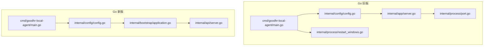
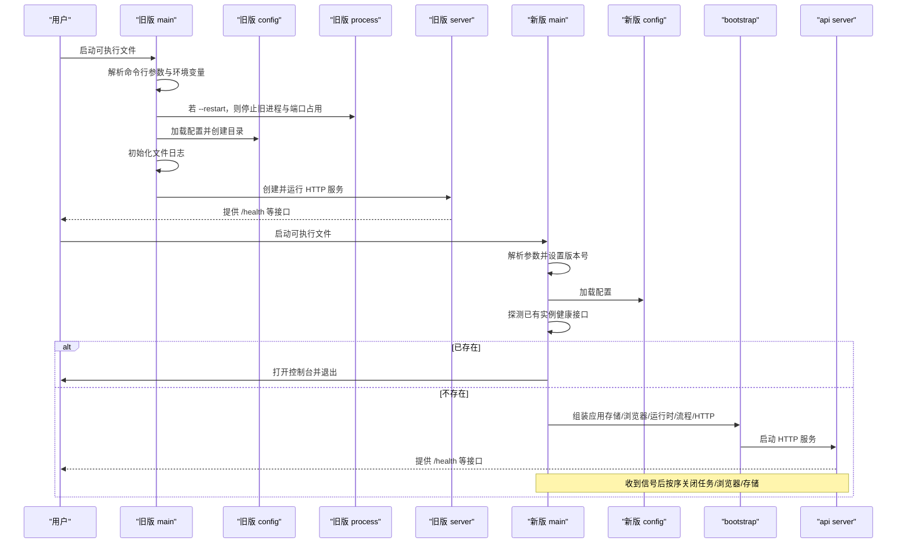
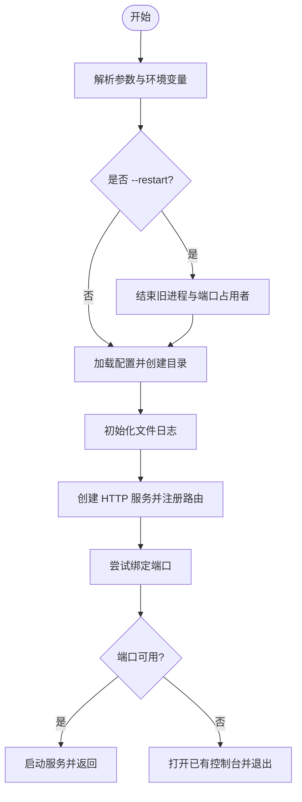
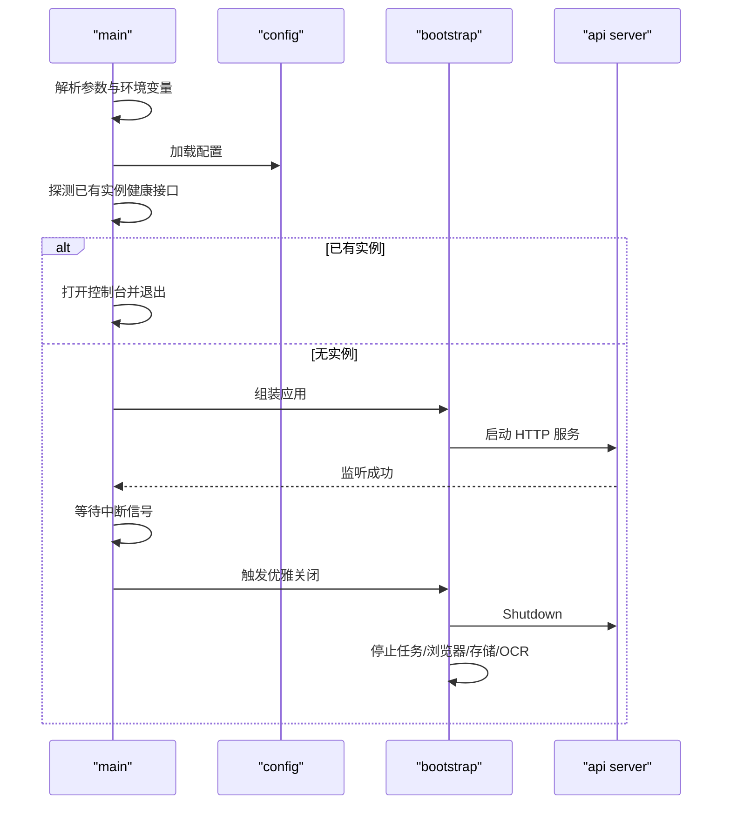
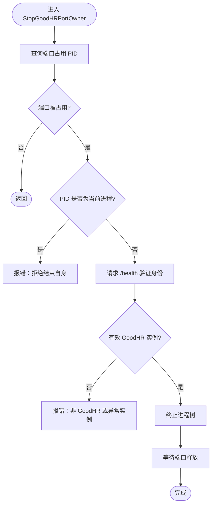
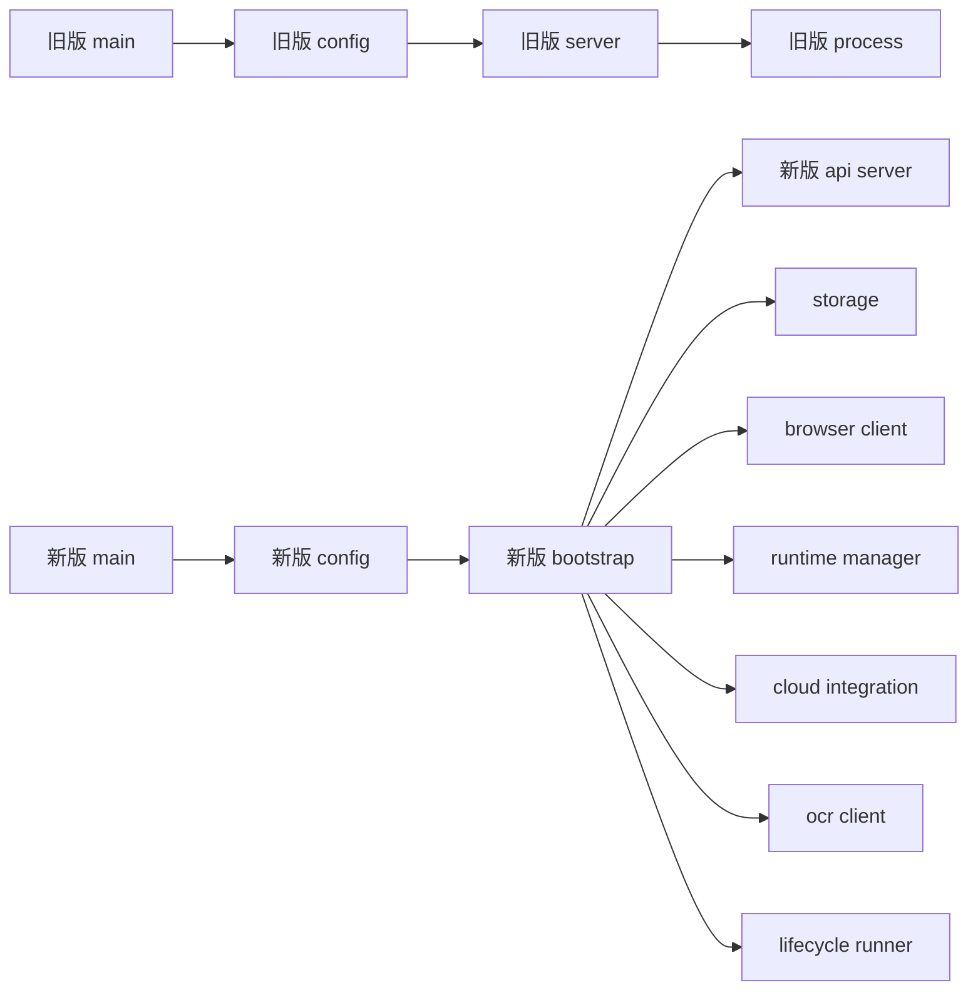

# 启动流程

<cite>
**本文引用的文件**
- [main.go](file://goodhr5/local-agent-go/cmd/goodhr-local-agent/main.go)
- [config.go](file://goodhr5/local-agent-go/internal/config/config.go)
- [server.go](file://goodhr5/local-agent-go/internal/app/server.go)
- [port.go](file://goodhr5/local-agent-go/internal/process/port.go)
- [restart_windows.go](file://goodhr5/local-agent-go/internal/process/restart_windows.go)
- [terminate_other.go](file://goodhr5/local-agent-go/internal/process/terminate_other.go)
- [restart_other.go](file://goodhr5/local-agent-go/internal/process/restart_other.go)
- [main.go](file://goodhr5/local-agent-go/cmd/goodhr-local-agent/main.go)
- [config.go](file://goodhr5/local-agent-go/internal/config/config.go)
- [application.go](file://goodhr5/local-agent-go/internal/bootstrap/application.go)
- [server.go](file://goodhr5/local-agent-go/internal/api/server.go)
</cite>

## 目录
1. [简介](#简介)
2. [项目结构](#项目结构)
3. [核心组件](#核心组件)
4. [架构总览](#架构总览)
5. [详细组件分析](#详细组件分析)
6. [依赖关系分析](#依赖关系分析)
7. [性能考虑](#性能考虑)
8. [故障排查指南](#故障排查指南)
9. [结论](#结论)
10. [附录](#附录)

## 简介
本文面向本地执行器（Local Agent）的启动流程，覆盖两个实现版本：
- Go 旧版本地程序：以固定端口优先监听、重启时清理旧进程与端口占用。
- Go 新版本地程序：以“单实例复用”为核心，先检测已有实例，再按依赖顺序组装应用并优雅关闭。

重点包括：
- main 函数执行逻辑、命令行参数解析、环境变量配置。
- 进程启动顺序、服务初始化步骤、日志系统启动。
- restart 机制原理：旧进程检测、端口占用清理、优雅关闭。
- 跨平台差异：Windows 与非 Windows 的行为区别。
- 调试模式与常见问题定位方法。

## 项目结构
本地执行器由“入口 main -> 配置加载 -> 服务/应用组装 -> HTTP 服务启动 -> 资源清理”构成。新版本将浏览器工作进程、运行时管理、存储、流程编排等解耦为独立模块，通过 bootstrap 统一装配。

**图表来源**
- [main.go:18-62](file://goodhr5/local-agent-go/cmd/goodhr-local-agent/main.go#L18-L62)
- [config.go:49-88](file://goodhr5/local-agent-go/internal/config/config.go#L49-L88)
- [server.go:87-115](file://goodhr5/local-agent-go/internal/app/server.go#L87-L115)
- [port.go:9-31](file://goodhr5/local-agent-go/internal/process/port.go#L9-L31)
- [restart_windows.go:30-50](file://goodhr5/local-agent-go/internal/process/restart_windows.go#L30-L50)
- [main.go:21-63](file://goodhr5/local-agent-go/cmd/goodhr-local-agent/main.go#L21-L63)
- [config.go:52-90](file://goodhr5/local-agent-go/internal/config/config.go#L52-L90)
- [application.go:48-109](file://goodhr5/local-agent-go/internal/bootstrap/application.go#L48-L109)
- [server.go:67-135](file://goodhr5/local-agent-go/internal/api/server.go#L67-L135)

**章节来源**
- [main.go:18-62](file://goodhr5/local-agent-go/cmd/goodhr-local-agent/main.go#L18-L62)
- [main.go:21-63](file://goodhr5/local-agent-go/cmd/goodhr-local-agent/main.go#L21-L63)

## 核心组件
- 配置加载：从命令行参数与环境变量解析 host、port、data-dir、自动打开控制台开关等，并创建必要目录。
- 服务/应用组装：
  - 旧版：创建 HTTP Server，注册路由，启动 Node Worker、OCR、数据库、岗位运行器等。
  - 新版：bootstrap 按依赖顺序创建存储、浏览器客户端、运行时管理器、云端/OCR/AI 集成、流程编排、HTTP 服务。
- 进程与端口管理：
  - 旧版：支持 restart 参数，在 Windows 上结束同名进程与端口占用者；非 Windows 不处理旧进程。
  - 新版：启动前探测健康接口，若已有实例则仅打开控制台并退出，避免重复启动。
- 日志系统：
  - 旧版：根据平台选择输出到文件或 stderr+文件。
  - 新版：默认输出到标准错误，便于容器或守护进程收集。

**章节来源**
- [config.go:49-88](file://goodhr5/local-agent-go/internal/config/config.go#L49-L88)
- [config.go:52-90](file://goodhr5/local-agent-go/internal/config/config.go#L52-L90)
- [server.go:87-115](file://goodhr5/local-agent-go/internal/app/server.go#L87-L115)
- [application.go:48-109](file://goodhr5/local-agent-go/internal/bootstrap/application.go#L48-L109)
- [restart_windows.go:30-50](file://goodhr5/local-agent-go/internal/process/restart_windows.go#L30-L50)
- [restart_other.go:6-16](file://goodhr5/local-agent-go/internal/process/restart_other.go#L6-L16)

## 架构总览
下图展示新旧版本的启动主流程与关键交互。

**图表来源**
- [main.go:18-62](file://goodhr5/local-agent-go/cmd/goodhr-local-agent/main.go#L18-L62)
- [main.go:21-63](file://goodhr5/local-agent-go/cmd/goodhr-local-agent/main.go#L21-L63)
- [server.go:87-115](file://goodhr5/local-agent-go/internal/app/server.go#L87-L115)
- [application.go:128-181](file://goodhr5/local-agent-go/internal/bootstrap/application.go#L128-L181)

## 详细组件分析

### 旧版 Local Agent 启动流程
- 参数与环境变量
  - 命令行：host、port、data-dir、open-console、restart。
  - 环境变量：GOODHR_AUTO_OPEN_CONSOLE、GOODHR_DATA_DIR、GOODHR_CONSOLE_MANIFEST_URL、GOODHR_CLOUD_API_BASE。
- 启动顺序
  1) 解析参数与环境变量。
  2) 若 --restart，调用进程管理模块结束同名进程与端口占用者。
  3) 加载配置，创建数据/日志/运行时目录。
  4) 初始化文件日志（Windows 写文件，其他平台同时输出到 stderr）。
  5) 创建 HTTP Server，注册路由，启动服务。
  6) 端口冲突时尝试复用已有实例并打开控制台。
- 端口与重启
  - 使用 ListenFirstAvailable 在指定范围内查找可用端口。
  - Windows 下通过 netstat/tasklist 查询 PID，校验 /health 身份后终止进程树，等待端口释放。
  - 非 Windows 下不主动结束旧进程。

**图表来源**
- [main.go:18-62](file://goodhr5/local-agent-go/cmd/goodhr-local-agent/main.go#L18-L62)
- [server.go:87-115](file://goodhr5/local-agent-go/internal/app/server.go#L87-L115)
- [port.go:9-31](file://goodhr5/local-agent-go/internal/process/port.go#L9-L31)
- [restart_windows.go:30-50](file://goodhr5/local-agent-go/internal/process/restart_windows.go#L30-L50)

**章节来源**
- [main.go:18-62](file://goodhr5/local-agent-go/cmd/goodhr-local-agent/main.go#L18-L62)
- [config.go:49-88](file://goodhr5/local-agent-go/internal/config/config.go#L49-L88)
- [server.go:87-115](file://goodhr5/local-agent-go/internal/app/server.go#L87-L115)
- [port.go:9-31](file://goodhr5/local-agent-go/internal/process/port.go#L9-L31)
- [restart_windows.go:30-50](file://goodhr5/local-agent-go/internal/process/restart_windows.go#L30-L50)
- [restart_other.go:6-16](file://goodhr5/local-agent-go/internal/process/restart_other.go#L6-L16)

### 新版 Local Agent 启动流程
- 参数与环境变量
  - 命令行：host、port、data-dir、version。
  - 环境变量：GOODHR_WORKER_PORT、GOODHR_CLOUD_API_BASE、GOODHR_CONSOLE_URL、GOODHR_NODE_PATH、GOODHR_OCR_EXECUTABLE、GOODHR_AUTO_OPEN_CONSOLE、GOODHR_DATA_DIR。
- 启动顺序
  1) 解析参数并设置版本号。
  2) 加载配置，确保目录存在。
  3) 探测已有实例健康接口，若存在则仅打开控制台并退出。
  4) 初始化日志到标准错误。
  5) bootstrap 按依赖顺序创建存储、浏览器客户端、运行时管理器、云端/OCR/AI 集成、流程编排、HTTP 服务。
  6) 启动下载监控、HTTP 服务，可选自动打开控制台。
  7) 接收中断信号后按序关闭任务、浏览器、存储等。
- 优雅关闭
  - 停止所有任务、关闭 HTTP 服务、停止浏览器、同步下载记录、停止 Worker、关闭 OCR、关闭数据库。

**图表来源**
- [main.go:21-63](file://goodhr5/local-agent-go/cmd/goodhr-local-agent/main.go#L21-L63)
- [config.go:52-90](file://goodhr5/local-agent-go/internal/config/config.go#L52-L90)
- [application.go:48-109](file://goodhr5/local-agent-go/internal/bootstrap/application.go#L48-L109)
- [application.go:128-181](file://goodhr5/local-agent-go/internal/bootstrap/application.go#L128-L181)
- [server.go:67-135](file://goodhr5/local-agent-go/internal/api/server.go#L67-L135)

**章节来源**
- [main.go:21-63](file://goodhr5/local-agent-go/cmd/goodhr-local-agent/main.go#L21-L63)
- [config.go:52-90](file://goodhr5/local-agent-go/internal/config/config.go#L52-L90)
- [application.go:48-109](file://goodhr5/local-agent-go/internal/bootstrap/application.go#L48-L109)
- [application.go:128-181](file://goodhr5/local-agent-go/internal/bootstrap/application.go#L128-L181)
- [server.go:67-135](file://goodhr5/local-agent-go/internal/api/server.go#L67-L135)

### restart 机制详解（旧版）
- 旧进程检测
  - Windows：通过 tasklist 查找同名进程镜像，排除当前进程 ID。
  - 非 Windows：不处理旧进程。
- 端口占用清理
  - 通过 netstat 查找监听端口的 PID。
  - 访问 /health 验证是否为 GoodHR 旧实例，且包含必要身份字段。
  - 终止进程树，等待端口释放。
- 安全保护
  - 拒绝结束自身进程。
  - 对非 GoodHR 或异常旧实例禁止自动结束。

**图表来源**
- [restart_windows.go:30-50](file://goodhr5/local-agent-go/internal/process/restart_windows.go#L30-L50)
- [restart_windows.go:52-124](file://goodhr5/local-agent-go/internal/process/restart_windows.go#L52-L124)
- [restart_windows.go:126-192](file://goodhr5/local-agent-go/internal/process/restart_windows.go#L126-L192)
- [terminate_other.go:8-19](file://goodhr5/local-agent-go/internal/process/terminate_other.go#L8-L19)

**章节来源**
- [restart_windows.go:30-50](file://goodhr5/local-agent-go/internal/process/restart_windows.go#L30-L50)
- [restart_windows.go:52-124](file://goodhr5/local-agent-go/internal/process/restart_windows.go#L52-L124)
- [restart_windows.go:126-192](file://goodhr5/local-agent-go/internal/process/restart_windows.go#L126-L192)
- [terminate_other.go:8-19](file://goodhr5/local-agent-go/internal/process/terminate_other.go#L8-L19)
- [restart_other.go:6-16](file://goodhr5/local-agent-go/internal/process/restart_other.go#L6-L16)

### 服务初始化步骤与配置加载
- 旧版
  - 配置：默认主机与端口、数据目录、运行时/日志/截图/下载/配置文件路径、控制台清单地址、云端 API 基址。
  - 目录：确保数据、运行时、日志、OCR、前端、配置文件、下载、截图目录存在。
  - 服务：创建运行时管理器、数据库、浏览器 Worker 管理器、OCR、岗位运行器，注册大量路由。
- 新版
  - 配置：新增 worker 端口、扩展目录、Node 路径、OCR 可执行路径、数据库路径等。
  - 目录：确保数据、配置、扩展、下载、截图、日志、运行时目录存在。
  - 服务：创建存储、浏览器客户端、运行时管理器、云端/OCR/AI 集成、流程编排、HTTP 服务。

**章节来源**
- [config.go:49-88](file://goodhr5/local-agent-go/internal/config/config.go#L49-L88)
- [config.go:52-90](file://goodhr5/local-agent-go/internal/config/config.go#L52-L90)
- [server.go:45-63](file://goodhr5/local-agent-go/internal/app/server.go#L45-L63)
- [application.go:48-109](file://goodhr5/local-agent-go/internal/bootstrap/application.go#L48-L109)

### 日志系统启动
- 旧版
  - 根据平台决定日志输出：Windows 写入文件；其他平台同时输出到 stderr 和文件。
  - 日志路径位于数据目录下的 runtime/logs。
- 新版
  - 默认输出到标准错误，便于容器或系统日志收集。

**章节来源**
- [main.go:64-86](file://goodhr5/local-agent-go/cmd/goodhr-local-agent/main.go#L64-L86)
- [main.go:52-53](file://goodhr5/local-agent-go/cmd/goodhr-local-agent/main.go#L52-L53)

### 启动参数说明与环境变量
- 通用参数
  - host：本地监听地址。
  - port：本地监听端口。
  - data-dir：本地数据目录。
  - version（新版）：本地程序版本号。
- 旧版特有
  - open-console：是否自动打开控制台。
  - restart：启动前先关闭旧实例。
- 常用环境变量
  - GOODHR_DATA_DIR：覆盖数据目录。
  - GOODHR_AUTO_OPEN_CONSOLE：控制是否自动打开控制台。
  - GOODHR_CONSOLE_MANIFEST_URL（旧版）：控制台前端清单地址。
  - GOODHR_CLOUD_API_BASE：云端 API 基址。
  - GOODHR_WORKER_PORT（新版）：Worker 端口。
  - GOODHR_CONSOLE_URL（新版）：控制台地址。
  - GOODHR_NODE_PATH（新版）：Node 可执行路径。
  - GOODHR_OCR_EXECUTABLE（新版）：OCR 可执行路径。

**章节来源**
- [main.go:18-27](file://goodhr5/local-agent-go/cmd/goodhr-local-agent/main.go#L18-L27)
- [main.go:21-28](file://goodhr5/local-agent-go/cmd/goodhr-local-agent/main.go#L21-L28)
- [config.go:49-88](file://goodhr5/local-agent-go/internal/config/config.go#L49-L88)
- [config.go:52-90](file://goodhr5/local-agent-go/internal/config/config.go#L52-L90)

### 跨平台启动差异
- 旧版
  - Windows：支持通过系统命令结束旧进程与端口占用者；日志直接写入文件。
  - 非 Windows：不结束旧进程；日志同时输出到 stderr 与文件。
- 新版
  - 统一行为：启动前探测健康接口，避免重复启动；日志输出到 stderr。
  - 通过条件编译与路径解析适配不同平台的 Node/Worker 入口。

**章节来源**
- [restart_windows.go:30-50](file://goodhr5/local-agent-go/internal/process/restart_windows.go#L30-L50)
- [restart_other.go:6-16](file://goodhr5/local-agent-go/internal/process/restart_other.go#L6-L16)
- [terminate_other.go:8-19](file://goodhr5/local-agent-go/internal/process/terminate_other.go#L8-L19)
- [config.go:92-135](file://goodhr5/local-agent-go/internal/config/config.go#L92-L135)

## 依赖关系分析
- 旧版依赖链
  - main -> config -> app.server -> process.port/process.restart_*
- 新版依赖链
  - main -> config -> bootstrap.application -> api.server
  - bootstrap 内部依赖 storage、browser client、runtime manager、cloud/ocr/ai 集成、lifecycle runner、download monitor、updater、device、power、notification。

**图表来源**
- [main.go:18-62](file://goodhr5/local-agent-go/cmd/goodhr-local-agent/main.go#L18-L62)
- [server.go:45-63](file://goodhr5/local-agent-go/internal/app/server.go#L45-L63)
- [application.go:48-109](file://goodhr5/local-agent-go/internal/bootstrap/application.go#L48-L109)
- [server.go:67-135](file://goodhr5/local-agent-go/internal/api/server.go#L67-L135)

**章节来源**
- [main.go:18-62](file://goodhr5/local-agent-go/cmd/goodhr-local-agent/main.go#L18-L62)
- [application.go:48-109](file://goodhr5/local-agent-go/internal/bootstrap/application.go#L48-L109)

## 性能考虑
- 端口绑定策略：旧版在固定端口失败时尝试复用已有实例，减少启动失败概率。
- 健康检查：新版通过 /health 快速判断是否有实例在运行，避免重复启动开销。
- 日志输出：新版默认输出到 stderr，降低磁盘 I/O 压力，适合容器化部署。
- 资源清理：新版优雅关闭分阶段进行，避免长时间阻塞。

[本节为通用指导，无需特定文件引用]

## 故障排查指南
- 端口占用
  - 现象：启动时报端口不可用。
  - 排查：确认是否有旧实例占用端口；必要时使用 --restart 或在 Windows 下手动结束占用进程。
- 健康检查失败
  - 现象：/health 不可达或返回非 GoodHR 身份信息。
  - 排查：检查端口是否正确、是否存在异常旧实例；确认健康接口响应格式。
- 无法结束旧进程
  - 现象：restart 后旧进程仍在运行。
  - 排查：确认权限、进程树关系；在非 Windows 平台需手动处理。
- 控制台未自动打开
  - 现象：启动后未弹出控制台页面。
  - 排查：检查 GOODHR_AUTO_OPEN_CONSOLE 与网络可达性；查看日志中打开控制台相关提示。
- 日志位置
  - 旧版：数据目录下的 runtime/logs/local-agent.log。
  - 新版：标准错误输出，可通过容器或系统日志工具收集。

**章节来源**
- [restart_windows.go:30-50](file://goodhr5/local-agent-go/internal/process/restart_windows.go#L30-L50)
- [restart_windows.go:84-124](file://goodhr5/local-agent-go/internal/process/restart_windows.go#L84-L124)
- [main.go:64-86](file://goodhr5/local-agent-go/cmd/goodhr-local-agent/main.go#L64-L86)
- [main.go:21-63](file://goodhr5/local-agent-go/cmd/goodhr-local-agent/main.go#L21-L63)

## 结论
- 旧版 Local Agent 强调“固定端口 + 强制重启”，适合需要严格独占端口的场景。
- 新版 Local Agent 强调“单实例复用 + 优雅关闭”，更适合现代部署环境，具备更好的可观测性与可维护性。
- 两者均提供完善的配置与环境变量能力，便于在不同平台与环境中灵活部署。

[本节为总结，无需特定文件引用]

## 附录
- 建议的启动方式
  - 开发调试：设置 GOODHR_AUTO_OPEN_CONSOLE=true，关注控制台与日志输出。
  - 生产部署：使用新版，结合容器日志收集与健康检查探针。
- 常见环境变量组合
  - 自定义数据目录：GOODHR_DATA_DIR=/path/to/data
  - 自定义云端地址：GOODHR_CLOUD_API_BASE=https://your-api
  - 自定义控制台地址：GOODHR_CONSOLE_URL=http://localhost:5173
  - 自定义 Worker 端口：GOODHR_WORKER_PORT=39881

[本节为补充信息，无需特定文件引用]