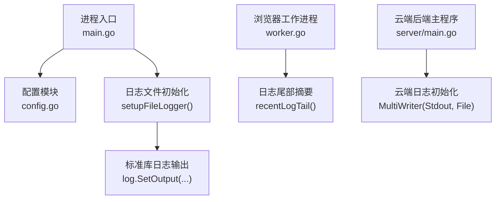
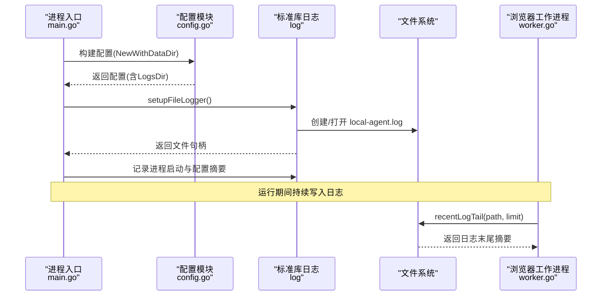
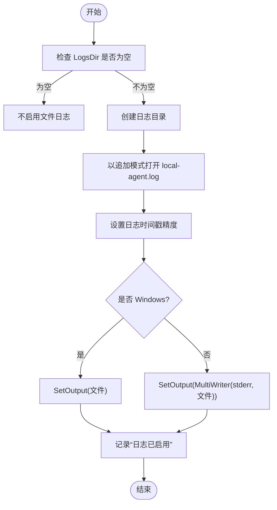
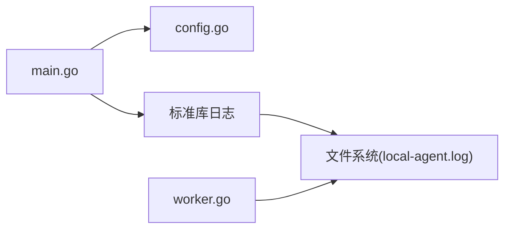

# 日志系统

<cite>
**本文引用的文件**   
- [main.go](file://goodhr5/local-agent-go/cmd/goodhr-local-agent/main.go)
- [config.go](file://goodhr5/local-agent-go/internal/config/config.go)
- [worker.go](file://goodhr5/local-agent-go/internal/browser/worker.go)
- [server main.go](file://goodhr5/cloud/backend/cmd/server/main.go)
</cite>

## 目录
1. [简介](#简介)
2. [项目结构](#项目结构)
3. [核心组件](#核心组件)
4. [架构总览](#架构总览)
5. [详细组件分析](#详细组件分析)
6. [依赖关系分析](#依赖关系分析)
7. [性能与容量规划](#性能与容量规划)
8. [故障排查指南](#故障排查指南)
9. [结论](#结论)
10. [附录](#附录)

## 简介
本文件聚焦本地执行器（GoodHR 5 Go 版本本地程序）的日志系统，覆盖以下主题：
- 日志文件初始化流程、输出目标与跨平台差异
- 日志级别控制与结构化日志展示
- 日志轮转机制与磁盘空间监控、清理策略
- JSON 输出格式建议与过滤规则
- 日志文件路径管理、控制台与文件输出的协调
- 日志分析方法、错误追踪技巧与性能监控指标

## 项目结构
本地执行器的日志相关代码主要分布在以下位置：
- 进程入口与日志初始化：local-agent-go/cmd/goodhr-local-agent/main.go
- 配置与默认路径：local-agent-go/internal/config/config.go
- 浏览器工作进程日志尾部读取：local-agent-go/internal/browser/worker.go
- 云端后端日志初始化（用于对比与参考）：cloud/backend/cmd/server/main.go

图示来源
- [main.go:20-77](file://goodhr5/local-agent-go/cmd/goodhr-local-agent/main.go#L20-L77)
- [main.go:79-101](file://goodhr5/local-agent-go/cmd/goodhr-local-agent/main.go#L79-L101)
- [config.go:23-95](file://goodhr5/local-agent-go/internal/config/config.go#L23-L95)
- [worker.go:682-705](file://goodhr5/local-agent-go/internal/browser/worker.go#L682-L705)
- [server main.go:17-28](file://goodhr5/cloud/backend/cmd/server/main.go#L17-L28)

章节来源
- [main.go:20-77](file://goodhr5/local-agent-go/cmd/goodhr-local-agent/main.go#L20-L77)
- [config.go:23-95](file://goodhr5/local-agent-go/internal/config/config.go#L23-L95)

## 核心组件
- 进程入口与日志初始化
  - 解析启动参数、加载配置、创建服务。
  - 调用 setupFileLogger 初始化本地程序的文件日志，并在非 Windows 平台将日志同时输出到标准错误和文件。
- 配置与路径管理
  - 定义 Config 结构体，包含 LogsDir 等关键路径字段。
  - 通过 NewWithDataDir 构建运行时目录、日志目录、前端目录等。
  - EnsureDirs 确保所有必要目录存在。
- 浏览器工作进程日志尾部读取
  - recentLogTail 提供按字符数截取的日志末尾摘要能力，便于诊断与展示。
- 云端后端日志初始化（参考）
  - 使用 MultiWriter 同时输出到标准输出与文件，便于容器或守护进程捕获。

章节来源
- [main.go:20-77](file://goodhr5/local-agent-go/cmd/goodhr-local-agent/main.go#L20-L77)
- [main.go:79-101](file://goodhr5/local-agent-go/cmd/goodhr-local-agent/main.go#L79-L101)
- [config.go:23-95](file://goodhr5/local-agent-go/internal/config/config.go#L23-L95)
- [worker.go:682-705](file://goodhr5/local-agent-go/internal/browser/worker.go#L682-L705)
- [server main.go:17-28](file://goodhr5/cloud/backend/cmd/server/main.go#L17-L28)

## 架构总览
本地执行器日志系统的整体流程如下：
- 启动阶段：解析参数、加载配置、初始化日志文件、输出进程启动信息。
- 运行阶段：业务逻辑通过标准库 log 写入日志；在非 Windows 平台，日志同时进入控制台与文件。
- 诊断阶段：通过 recentLogTail 读取日志末尾摘要，辅助问题定位。

图示来源
- [main.go:20-77](file://goodhr5/local-agent-go/cmd/goodhr-local-agent/main.go#L20-L77)
- [main.go:79-101](file://goodhr5/local-agent-go/cmd/goodhr-local-agent/main.go#L79-L101)
- [config.go:50-95](file://goodhr5/local-agent-go/internal/config/config.go#L50-L95)
- [worker.go:682-705](file://goodhr5/local-agent-go/internal/browser/worker.go#L682-L705)

## 详细组件分析

### 日志文件初始化与跨平台输出
- 初始化步骤
  - 检查 LogsDir 是否为空；若为空则不启用文件日志。
  - 创建日志目录并打开日志文件（追加模式）。
  - 设置日志时间戳精度（包含微秒）。
  - 根据操作系统选择输出目标：
    - Windows：仅输出到文件。
    - 其他平台：同时输出到标准错误与文件。
- 设计要点
  - 使用标准库 log 进行统一日志输出。
  - 通过 io.MultiWriter 实现多目的地输出。
  - 在进程入口处记录关键启动信息与配置摘要，便于回溯。

图示来源
- [main.go:79-101](file://goodhr5/local-agent-go/cmd/goodhr-local-agent/main.go#L79-L101)

章节来源
- [main.go:79-101](file://goodhr5/local-agent-go/cmd/goodhr-local-agent/main.go#L79-L101)

### 日志级别控制与结构化日志展示
- 当前实现
  - 本地执行器未内置自定义日志级别过滤器；日志级别由上层业务决定。
  - 云端后端的岗位日志展示层对 level 字段进行中文映射（错误、警告、调试、信息），可作为结构化日志展示的参考。
- 建议实践
  - 在业务日志中统一包含 level、time、component、message 等字段。
  - 在控制台或前端界面按 level 进行样式与过滤。

章节来源
- [position_log.go:2540-2621](file://goodhr5/cloud/frontend-next/app/admin/positions/page.tsx#L2540-L2621)

### 日志轮转机制与磁盘空间监控
- 现状
  - 本地执行器未实现自动日志轮转；日志文件为单一 local-agent.log 并持续追加。
- 建议方案
  - 基于文件大小或时间周期进行轮转（例如按天或按大小）。
  - 保留最近 N 个历史文件，删除过期文件。
  - 在轮转前关闭文件句柄，避免写入中断。
- 磁盘空间监控
  - 定期检测 LogsDir 所在分区的可用空间。
  - 当可用空间低于阈值时触发告警或强制清理策略。

[本节为通用建议，不直接分析具体源码文件]

### JSON 输出格式与日志过滤规则
- 现状
  - 当前本地执行器使用标准库 log 输出文本日志，未采用 JSON 格式。
- 建议格式
  - 每条日志为单行 JSON，包含字段：timestamp、level、component、msg、trace_id、pid、args。
  - 示例字段说明：
    - timestamp：ISO 8601 时间戳
    - level：info/warn/error/debug
    - component：模块名
    - msg：消息内容
    - trace_id：请求或任务追踪 ID
    - pid：进程 ID
    - args：可选的参数摘要
- 过滤规则
  - 支持按 level、component、trace_id 过滤。
  - 支持关键字匹配与正则表达式。
  - 支持时间范围过滤。

[本节为通用建议，不直接分析具体源码文件]

### 日志文件路径管理与控制台输出协调
- 路径管理
  - LogsDir 由配置模块计算得出，位于 dataDir/runtime/logs。
  - EnsureDirs 保证 LogsDir 与其他目录存在。
- 控制台与文件输出
  - 非 Windows 平台：同时输出到标准错误与文件，便于终端查看与文件归档。
  - Windows 平台：仅输出到文件，避免控制台编码或权限问题。

章节来源
- [config.go:50-95](file://goodhr5/local-agent-go/internal/config/config.go#L50-L95)
- [config.go:107-118](file://goodhr5/local-agent-go/internal/config/config.go#L107-L118)
- [main.go:79-101](file://goodhr5/local-agent-go/cmd/goodhr-local-agent/main.go#L79-L101)

### 日志尾部摘要与诊断辅助
- recentLogTail
  - 读取指定路径的日志文件末尾摘要。
  - 支持限制返回的最大字符数，默认 2000。
  - 对空路径、空文件或空内容进行安全处理。
- 用途
  - 快速定位最近错误与异常堆栈。
  - 在前端或诊断页面展示最新日志片段。

章节来源
- [worker.go:682-705](file://goodhr5/local-agent-go/internal/browser/worker.go#L682-L705)

### 云端后端日志初始化（参考）
- 云端后端同样使用 MultiWriter 将日志输出到标准输出与文件，便于容器化部署与日志采集。
- 可借鉴其输出策略，保持本地与云端日志行为一致。

章节来源
- [server main.go:17-28](file://goodhr5/cloud/backend/cmd/server/main.go#L17-L28)

## 依赖关系分析
本地执行器日志系统与配置、文件系统、标准库日志之间的依赖关系如下：

图示来源
- [main.go:20-77](file://goodhr5/local-agent-go/cmd/goodhr-local-agent/main.go#L20-L77)
- [main.go:79-101](file://goodhr5/local-agent-go/cmd/goodhr-local-agent/main.go#L79-L101)
- [config.go:50-95](file://goodhr5/local-agent-go/internal/config/config.go#L50-L95)
- [worker.go:682-705](file://goodhr5/local-agent-go/internal/browser/worker.go#L682-L705)

章节来源
- [main.go:20-77](file://goodhr5/local-agent-go/cmd/goodhr-local-agent/main.go#L20-L77)
- [config.go:50-95](file://goodhr5/local-agent-go/internal/config/config.go#L50-L95)
- [worker.go:682-705](file://goodhr5/local-agent-go/internal/browser/worker.go#L682-L705)

## 性能与容量规划
- I/O 影响
  - 频繁写入大日志会影响性能；建议合理设置日志级别与采样率。
  - 在高并发场景下，考虑异步日志写入或缓冲队列。
- 容量规划
  - 预估每日日志量，结合磁盘容量制定保留策略。
  - 对高噪声模块降低日志级别或增加采样。
- 监控指标
  - 日志文件大小与增长速率
  - 磁盘可用空间与使用率
  - 日志写入延迟与错误率

[本节为通用建议，不直接分析具体源码文件]

## 故障排查指南
- 常见问题
  - 日志目录不存在：EnsureDirs 会创建目录；若失败需检查权限与路径。
  - 无法写入日志文件：检查文件权限与磁盘空间。
  - 控制台无输出：Windows 平台仅输出到文件；非 Windows 平台同时输出到 stderr。
- 诊断步骤
  - 确认 LogsDir 与 local-agent.log 是否存在且可写。
  - 使用 recentLogTail 获取日志末尾摘要，快速定位最近错误。
  - 检查进程启动日志，确认配置与端口等信息。
- 云端参考
  - 云端后端日志初始化策略可作为对照，确保本地与云端行为一致。

章节来源
- [config.go:107-118](file://goodhr5/local-agent-go/internal/config/config.go#L107-L118)
- [main.go:79-101](file://goodhr5/local-agent-go/cmd/goodhr-local-agent/main.go#L79-L101)
- [worker.go:682-705](file://goodhr5/local-agent-go/internal/browser/worker.go#L682-L705)
- [server main.go:17-28](file://goodhr5/cloud/backend/cmd/server/main.go#L17-L28)

## 结论
本地执行器日志系统当前以标准库日志为核心，实现了基础的日志文件初始化与跨平台输出协调。未来可在以下方面增强：
- 引入结构化 JSON 日志与统一字段规范
- 实现日志轮转与磁盘空间监控
- 提供灵活的日志过滤与查询能力
- 统一本地与云端的日志行为与工具链

[本节为总结性内容，不直接分析具体源码文件]

## 附录
- 关键路径
  - 日志目录：dataDir/runtime/logs
  - 日志文件：local-agent.log
- 环境变量
  - GOODHR_DATA_DIR：自定义数据目录
  - GOODHR_AUTO_OPEN_CONSOLE：是否自动打开控制台

[本节为补充信息，不直接分析具体源码文件]