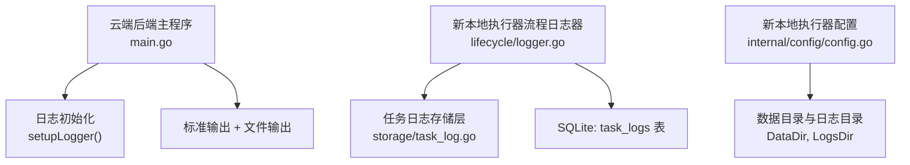
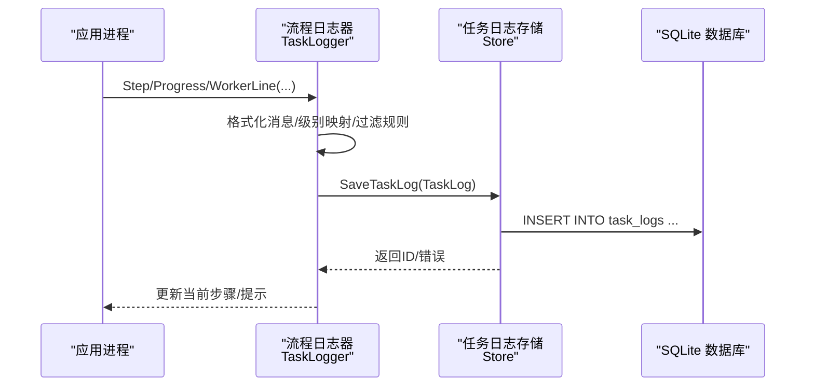
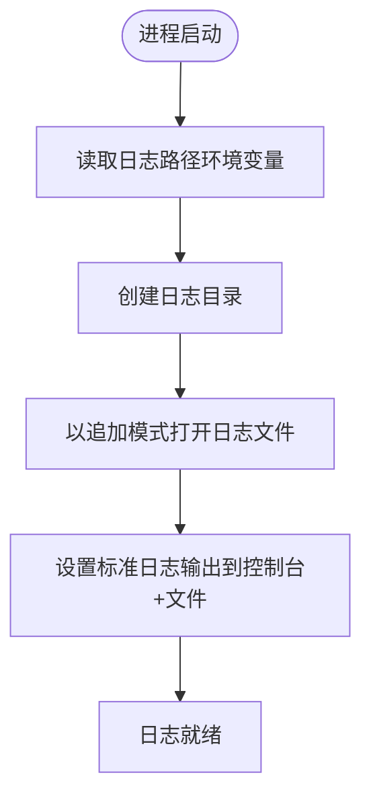
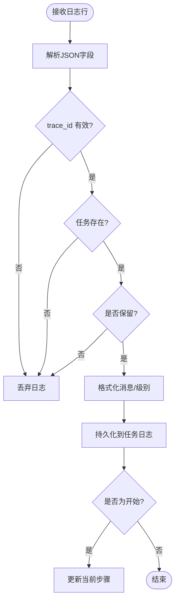
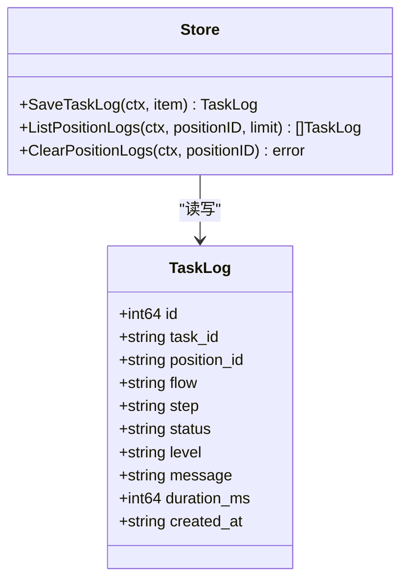
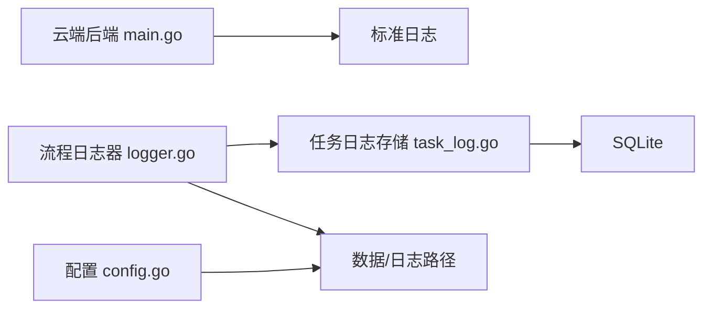

# 日志系统

<cite>
**本文引用的文件**
- [main.go](file://goodhr5/cloud/backend/cmd/server/main.go)
- [logger.go](file://goodhr5/local-agent-go/internal/flow/lifecycle/logger.go)
- [task_log.go](file://goodhr5/local-agent-go/internal/storage/task_log.go)
- [config.go](file://goodhr5/local-agent-go/internal/config/config.go)
</cite>

## 目录
1. [简介](#简介)
2. [项目结构](#项目结构)
3. [核心组件](#核心组件)
4. [架构总览](#架构总览)
5. [详细组件分析](#详细组件分析)
6. [依赖关系分析](#依赖关系分析)
7. [性能与容量管理](#性能与容量管理)
8. [故障排查指南](#故障排查指南)
9. [结论](#结论)
10. [附录：配置与环境变量](#附录配置与环境变量)

## 简介
本文件面向本地执行器的日志子系统，系统性说明日志初始化、级别控制、轮转与清理策略、结构化日志格式、JSON 输出、过滤规则、路径管理、磁盘空间监控、分析方法、错误追踪技巧、性能指标、跨平台兼容性与控制台/文件输出协调。内容基于仓库中云端后端启动器、新本地执行器流程日志器与任务日志存储实现进行归纳。

## 项目结构
本地执行器日志相关代码主要分布在以下位置：
- 云端后端服务入口负责全局日志文件初始化与标准输出合并
- 新本地执行器通过流程日志器将步骤日志写入 SQLite 并维护当前步骤状态
- 任务日志存储层提供持久化、查询、裁剪与清理能力
- 配置模块统一生成数据目录与日志目录路径

图表来源
- [main.go:40-51](file://goodhr5/cloud/backend/cmd/server/main.go#L40-L51)
- [logger.go:105-152](file://goodhr5/local-agent-go/internal/flow/lifecycle/logger.go#L105-L152)
- [task_log.go:28-82](file://goodhr5/local-agent-go/internal/storage/task_log.go#L28-L82)
- [config.go:52-90](file://goodhr5/local-agent-go/internal/config/config.go#L52-L90)

章节来源
- [main.go:14-51](file://goodhr5/cloud/backend/cmd/server/main.go#L14-L51)
- [logger.go:1-152](file://goodhr5/local-agent-go/internal/flow/lifecycle/logger.go#L1-L152)
- [task_log.go:1-82](file://goodhr5/local-agent-go/internal/storage/task_log.go#L1-L82)
- [config.go:30-90](file://goodhr5/local-agent-go/internal/config/config.go#L30-L90)

## 核心组件
- 云端后端日志初始化：创建日志目录、打开日志文件、将标准日志同时输出到控制台与文件，并设置时间戳精度。
- 新本地执行器流程日志器：将流程步骤与进度信息转换为中文用户文案，更新当前任务步骤，并持久化为任务日志；解析 Worker 的 JSON 行日志，按 trace_id 归集到对应任务。
- 任务日志存储层：保存任务日志、按岗位读取最近日志、清空岗位日志、自动裁剪每个岗位保留最近固定条数；将步骤状态映射为日志级别。
- 配置模块：统一计算数据目录、日志目录、数据库路径等，确保运行所需目录存在。

章节来源
- [main.go:40-51](file://goodhr5/cloud/backend/cmd/server/main.go#L40-L51)
- [logger.go:105-210](file://goodhr5/local-agent-go/internal/flow/lifecycle/logger.go#L105-L210)
- [task_log.go:28-205](file://goodhr5/local-agent-go/internal/storage/task_log.go#L28-L205)
- [config.go:52-90](file://goodhr5/local-agent-go/internal/config/config.go#L52-L90)

## 架构总览
本地执行器日志体系由“流程日志器”和“任务日志存储”构成，前者负责格式化、过滤与聚合，后者负责持久化与容量治理。云端后端在启动时完成全局日志文件初始化，便于统一收集进程级日志。

图表来源
- [logger.go:110-210](file://goodhr5/local-agent-go/internal/flow/lifecycle/logger.go#L110-L210)
- [task_log.go:28-82](file://goodhr5/local-agent-go/internal/storage/task_log.go#L28-L82)

## 详细组件分析

### 云端后端日志初始化（控制台与文件输出）
- 日志文件路径：通过环境变量或默认值确定，自动创建目录并以追加模式打开。
- 输出目标：使用多路复用将标准日志同时写入控制台与文件。
- 时间精度：启用微秒级时间戳，便于定位问题。
- 启动阶段：在主函数早期调用，失败则直接终止启动。

图表来源
- [main.go:40-51](file://goodhr5/cloud/backend/cmd/server/main.go#L40-L51)

章节来源
- [main.go:14-51](file://goodhr5/cloud/backend/cmd/server/main.go#L14-L51)

### 新本地执行器流程日志器（结构化日志与过滤）
- 结构化字段：包含时间戳、级别、跟踪ID、动作、步骤、状态、耗时、页面URL、目标描述、错误码、错误信息等。
- 级别映射：根据步骤状态推断日志级别（成功/警告/失败）。
- 过滤规则：仅保留关键操作的首尾日志与所有失败，屏蔽重复的内部查找/滚动等过程。
- 归集方式：按 trace_id 将 Worker 的 JSON 行日志归入对应任务；若任务不存在则丢弃。
- 用户可见文案：将内部步骤与状态翻译为友好中文提示，用于悬浮窗与日志展示。

图表来源
- [logger.go:154-210](file://goodhr5/local-agent-go/internal/flow/lifecycle/logger.go#L154-L210)
- [logger.go:340-364](file://goodhr5/local-agent-go/internal/flow/lifecycle/logger.go#L340-L364)

章节来源
- [logger.go:154-210](file://goodhr5/local-agent-go/internal/flow/lifecycle/logger.go#L154-L210)
- [logger.go:340-364](file://goodhr5/local-agent-go/internal/flow/lifecycle/logger.go#L340-L364)

### 任务日志存储层（持久化、查询与清理）
- 保存逻辑：补全岗位编号、规范化字段、推断级别、记录创建时间，事务写入 task_logs。
- 查询接口：按岗位读取最近 N 条日志，限制最大条数以保护性能。
- 清理策略：每个岗位只保留最近固定条数，超出部分删除；支持清空某岗位全部日志并清除历史错误。
- 级别映射：将步骤状态映射为 info/warning/error 三级。

图表来源
- [task_log.go:14-26](file://goodhr5/local-agent-go/internal/storage/task_log.go#L14-L26)
- [task_log.go:28-82](file://goodhr5/local-agent-go/internal/storage/task_log.go#L28-L82)
- [task_log.go:84-164](file://goodhr5/local-agent-go/internal/storage/task_log.go#L84-L164)
- [task_log.go:187-205](file://goodhr5/local-agent-go/internal/storage/task_log.go#L187-L205)
- [task_log.go:207-217](file://goodhr5/local-agent-go/internal/storage/task_log.go#L207-L217)

章节来源
- [task_log.go:28-217](file://goodhr5/local-agent-go/internal/storage/task_log.go#L28-L217)

### 配置与路径管理（数据目录、日志目录）
- 数据目录：优先从参数或环境变量解析，否则回退到用户配置目录下的固定路径。
- 日志目录：位于数据目录下的 logs 子目录，启动时确保存在。
- 其他目录：profiles、extensions、downloads、screenshots、runtime 等同步创建。
- 运行时路径：Node 可执行文件与 Worker 入口按环境变量、打包目录与系统 PATH 智能选择。

章节来源
- [config.go:52-90](file://goodhr5/local-agent-go/internal/config/config.go#L52-L90)
- [config.go:137-157](file://goodhr5/local-agent-go/internal/config/config.go#L137-L157)
- [config.go:207-229](file://goodhr5/local-agent-go/internal/config/config.go#L207-L229)

## 依赖关系分析
- 云端后端主程序依赖标准库 log 与 io.MultiWriter，实现控制台与文件双写。
- 流程日志器依赖存储层与共享日志接口，负责格式化、过滤与状态同步。
- 存储层依赖 SQLite，通过事务保证写入一致性，并在写入后执行容量裁剪。
- 配置模块为日志与数据路径提供统一来源，避免分散的路径拼接逻辑。

图表来源
- [main.go:40-51](file://goodhr5/cloud/backend/cmd/server/main.go#L40-L51)
- [logger.go:105-210](file://goodhr5/local-agent-go/internal/flow/lifecycle/logger.go#L105-L210)
- [task_log.go:28-82](file://goodhr5/local-agent-go/internal/storage/task_log.go#L28-L82)
- [config.go:52-90](file://goodhr5/local-agent-go/internal/config/config.go#L52-L90)

章节来源
- [main.go:40-51](file://goodhr5/cloud/backend/cmd/server/main.go#L40-L51)
- [logger.go:105-210](file://goodhr5/local-agent-go/internal/flow/lifecycle/logger.go#L105-L210)
- [task_log.go:28-82](file://goodhr5/local-agent-go/internal/storage/task_log.go#L28-L82)
- [config.go:52-90](file://goodhr5/local-agent-go/internal/config/config.go#L52-L90)

## 性能与容量管理
- 写入性能：日志写入采用事务包裹，减少多次落盘开销；批量插入前会裁剪旧日志，避免单岗位数据膨胀。
- 查询性能：按岗位分页读取，限制最大条数，防止大结果集拖慢前端渲染。
- 容量策略：每个岗位最多保留固定条数日志，超出即删除最早记录；支持一键清空岗位日志与历史错误。
- 磁盘监控建议：结合操作系统工具定期扫描日志目录大小，结合告警阈值触发清理或归档。
- 轮转机制：当前实现未内置按时间或大小的自动轮转；可通过外部脚本或运维工具按天/大小切分并压缩归档。

章节来源
- [task_log.go:28-82](file://goodhr5/local-agent-go/internal/storage/task_log.go#L28-L82)
- [task_log.go:84-164](file://goodhr5/local-agent-go/internal/storage/task_log.go#L84-L164)
- [task_log.go:187-205](file://goodhr5/local-agent-go/internal/storage/task_log.go#L187-L205)

## 故障排查指南
- 日志不可见：检查日志目录是否存在、权限是否正确；确认主程序已正确设置输出目标。
- 日志缺失：确认 trace_id 有效且任务已存在；检查过滤规则是否丢弃了该日志。
- 级别异常：核对步骤状态与级别映射是否符合预期；必要时调整业务状态语义。
- 磁盘增长过快：核查单岗位日志数量是否超过上限；评估是否需要缩短保留周期或增加清理频率。
- 跨平台差异：日志路径与 Node/OCR 可执行文件路径在不同平台可能不同，需通过配置与环境变量统一。

章节来源
- [main.go:40-51](file://goodhr5/cloud/backend/cmd/server/main.go#L40-L51)
- [logger.go:174-210](file://goodhr5/local-agent-go/internal/flow/lifecycle/logger.go#L174-L210)
- [task_log.go:207-217](file://goodhr5/local-agent-go/internal/storage/task_log.go#L207-L217)
- [config.go:122-135](file://goodhr5/local-agent-go/internal/config/config.go#L122-L135)

## 结论
本地执行器日志系统通过“流程日志器 + 任务日志存储”的组合，实现了结构化、可过滤、可持久化的任务级日志能力；云端后端在启动阶段完成全局日志文件初始化，便于集中采集。配合统一的目录管理与容量裁剪策略，可在多平台上稳定运行并提供良好的可观测性。未来可考虑引入按时间/大小的自动轮转与更细粒度的磁盘监控告警。

## 附录：配置与环境变量
- 云端后端日志文件路径：通过环境变量指定，未设置时使用默认路径；目录会自动创建。
- 新本地执行器数据与日志目录：通过参数或环境变量解析，默认位于用户配置目录下；logs 子目录用于存放任务日志。
- Worker 与 Node 路径：优先使用环境变量覆盖，其次尝试打包目录与系统 PATH。
- 控制台与文件输出：云端后端将标准日志同时输出到控制台与文件；本地执行器通过流程日志器将结构化日志持久化到 SQLite，供前端与管理界面查看。

章节来源
- [main.go:40-51](file://goodhr5/cloud/backend/cmd/server/main.go#L40-L51)
- [config.go:52-90](file://goodhr5/local-agent-go/internal/config/config.go#L52-L90)
- [config.go:122-135](file://goodhr5/local-agent-go/internal/config/config.go#L122-L135)
- [config.go:207-229](file://goodhr5/local-agent-go/internal/config/config.go#L207-L229)