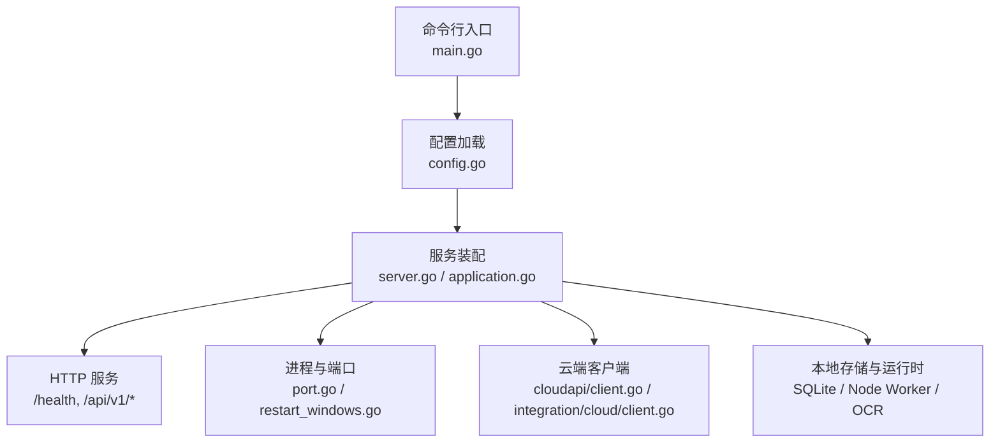
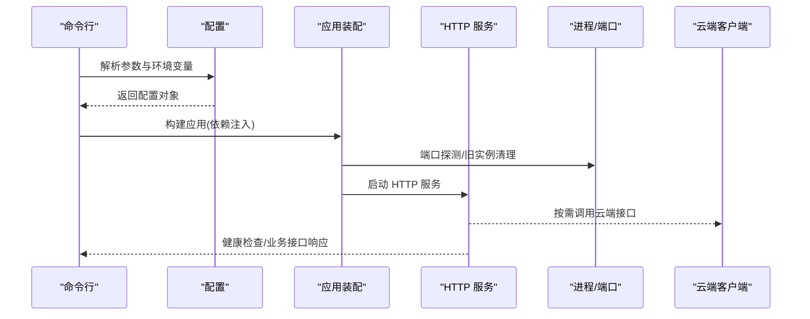
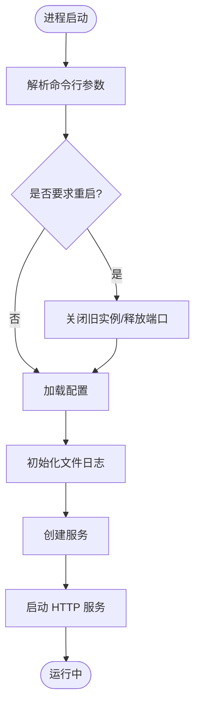
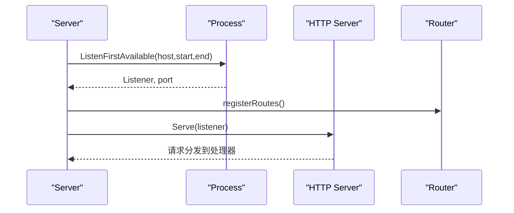
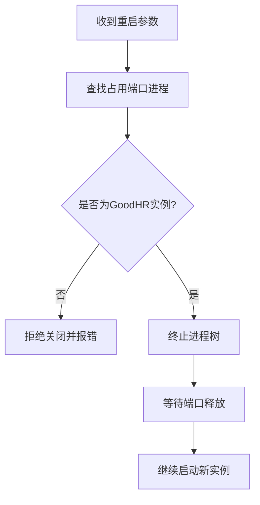
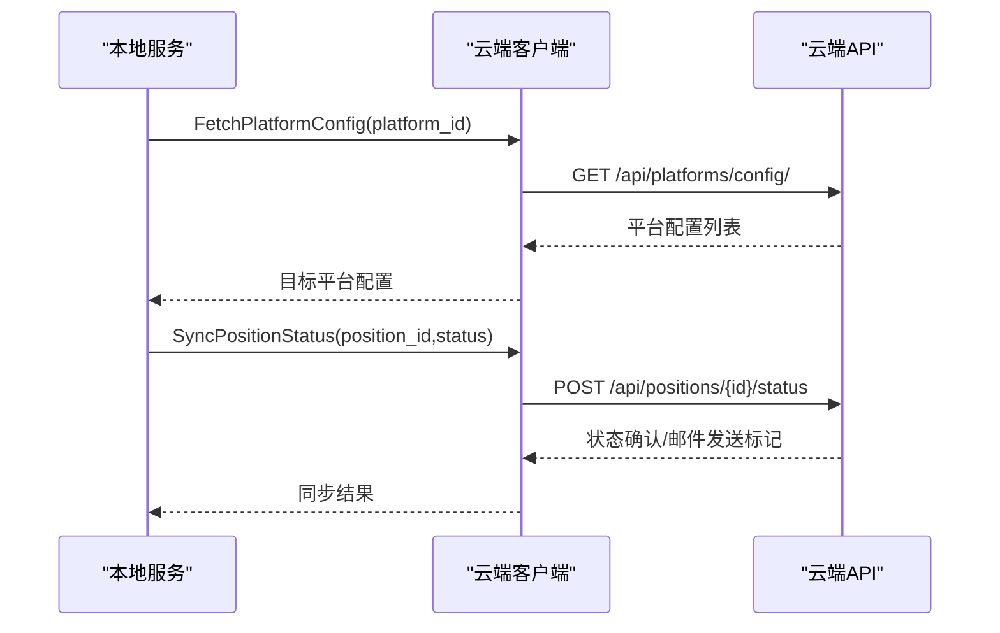
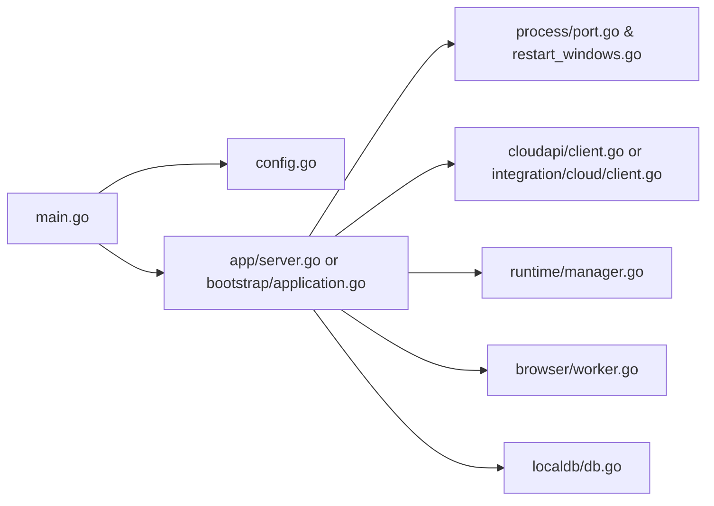

# 核心架构

<cite>
**本文引用的文件**
- [goodhr5/local-agent-go/cmd/goodhr-local-agent/main.go](file://goodhr5/local-agent-go/cmd/goodhr-local-agent/main.go)
- [goodhr5/local-agent-go/internal/config/config.go](file://goodhr5/local-agent-go/internal/config/config.go)
- [goodhr5/local-agent-go/internal/app/server.go](file://goodhr5/local-agent-go/internal/app/server.go)
- [goodhr5/local-agent-go/internal/process/port.go](file://goodhr5/local-agent-go/internal/process/port.go)
- [goodhr5/local-agent-go/internal/process/restart_windows.go](file://goodhr5/local-agent-go/internal/process/restart_windows.go)
- [goodhr5/local-agent-go/internal/cloudapi/client.go](file://goodhr5/local-agent-go/internal/cloudapi/client.go)
- [goodhr5/local-agent-go-new/cmd/goodhr-local-agent/main.go](file://goodhr5/local-agent-go-new/cmd/goodhr-local-agent/main.go)
- [goodhr5/local-agent-go-new/internal/config/config.go](file://goodhr5/local-agent-go-new/internal/config/config.go)
- [goodhr5/local-agent-go-new/internal/bootstrap/application.go](file://goodhr5/local-agent-go-new/internal/bootstrap/application.go)
- [goodhr5/local-agent-go-new/internal/integration/cloud/client.go](file://goodhr5/local-agent-go-new/internal/integration/cloud/client.go)
</cite>

## 目录
1. [简介](#简介)
2. [项目结构](#项目结构)
3. [核心组件](#核心组件)
4. [架构总览](#架构总览)
5. [详细组件分析](#详细组件分析)
6. [依赖关系分析](#依赖关系分析)
7. [性能与可靠性](#性能与可靠性)
8. [故障排查指南](#故障排查指南)
9. [结论](#结论)
10. [附录：开发环境与调试](#附录：开发环境与调试)

## 简介
本文件聚焦 GoodHR 本地执行器的核心架构，覆盖 Go 主程序启动流程、配置管理、进程控制机制、命令行参数解析、配置文件结构、日志系统实现、服务初始化、端口监听、进程重启逻辑、与云端通信机制、数据同步策略、错误处理与异常恢复、健康检查等。仓库包含两个版本的本地代理实现：
- local-agent-go：早期版本，Go 直接驱动浏览器工作进程（Node Worker）并暴露 HTTP API。
- local-agent-go-new：新版本，采用更清晰的引导装配、生命周期管理与强类型云端客户端。

## 项目结构
- 入口层
  - local-agent-go/cmd/.../main.go：解析命令行参数、加载配置、初始化日志、创建服务并启动。
  - local-agent-go-new/cmd/.../main.go：解析参数、检测已有实例、引导应用、信号处理与优雅退出。
- 配置层
  - local-agent-go/internal/config/config.go：基础路径、端口、目录、环境变量与默认值。
  - local-agent-go-new/internal/config/config.go：扩展配置项（Worker、Node、OCR、数据库路径、控制台地址等）。
- 服务层
  - local-agent-go/internal/app/server.go：HTTP 路由注册、健康检查、岗位运行、浏览器转发、云端接口桥接。
  - local-agent-go-new/internal/bootstrap/application.go：组装依赖、启动服务、下载监控、资源清理。
- 进程与端口
  - local-agent-go/internal/process/port.go：端口探测与监听。
  - local-agent-go/internal/process/restart_windows.go：Windows 下旧实例关闭与端口释放。
- 云端通信
  - local-agent-go/internal/cloudapi/client.go：通用 JSON 云端客户端。
  - local-agent-go-new/internal/integration/cloud/client.go：强类型云端客户端。

图表来源
- [goodhr5/local-agent-go/cmd/goodhr-local-agent/main.go:18-62](file://goodhr5/local-agent-go/cmd/goodhr-local-agent/main.go#L18-L62)
- [goodhr5/local-agent-go-new/cmd/goodhr-local-agent/main.go:21-63](file://goodhr5/local-agent-go-new/cmd/goodhr-local-agent/main.go#L21-L63)
- [goodhr5/local-agent-go/internal/config/config.go:43-88](file://goodhr5/local-agent-go/internal/config/config.go#L43-L88)
- [goodhr5/local-agent-go-new/internal/config/config.go:52-90](file://goodhr5/local-agent-go-new/internal/config/config.go#L52-L90)
- [goodhr5/local-agent-go/internal/app/server.go:87-115](file://goodhr5/local-agent-go/internal/app/server.go#L87-L115)
- [goodhr5/local-agent-go-new/internal/bootstrap/application.go:48-108](file://goodhr5/local-agent-go-new/internal/bootstrap/application.go#L48-L108)

章节来源
- [goodhr5/local-agent-go/cmd/goodhr-local-agent/main.go:18-62](file://goodhr5/local-agent-go/cmd/goodhr-local-agent/main.go#L18-L62)
- [goodhr5/local-agent-go-new/cmd/goodhr-local-agent/main.go:21-63](file://goodhr5/local-agent-go-new/cmd/goodhr-local-agent/main.go#L21-L63)

## 核心组件
- 配置管理
  - 支持通过命令行参数与环境变量覆盖默认值；自动创建必要目录；提供统一地址构造方法。
- 服务与路由
  - 提供健康检查、诊断、运行时状态、岗位运行、浏览器控制、截图、下载记录、云端配置读取等接口。
- 进程控制
  - 端口优先探测、旧实例终止、端口释放等待、跨平台进程树终止。
- 云端通信
  - 统一的 HTTP 客户端封装，支持鉴权、错误翻译、重试与超时控制。
- 日志系统
  - 文件日志与标准输出合并；在 Windows 与非 Windows 平台差异化处理。

章节来源
- [goodhr5/local-agent-go/internal/config/config.go:43-141](file://goodhr5/local-agent-go/internal/config/config.go#L43-L141)
- [goodhr5/local-agent-go/internal/app/server.go:117-168](file://goodhr5/local-agent-go/internal/app/server.go#L117-L168)
- [goodhr5/local-agent-go/internal/process/port.go:9-31](file://goodhr5/local-agent-go/internal/process/port.go#L9-L31)
- [goodhr5/local-agent-go/internal/process/restart_windows.go:30-124](file://goodhr5/local-agent-go/internal/process/restart_windows.go#L30-L124)
- [goodhr5/local-agent-go/internal/cloudapi/client.go:46-55](file://goodhr5/local-agent-go/internal/cloudapi/client.go#L46-L55)

## 架构总览
本地执行器由“入口 -> 配置 -> 服务 -> 子系统”的层次组成。新版本的引导模块将各子系统按依赖顺序装配，并在退出时按序清理资源。

图表来源
- [goodhr5/local-agent-go-new/internal/bootstrap/application.go:48-108](file://goodhr5/local-agent-go-new/internal/bootstrap/application.go#L48-L108)
- [goodhr5/local-agent-go/internal/app/server.go:87-115](file://goodhr5/local-agent-go/internal/app/server.go#L87-L115)
- [goodhr5/local-agent-go/internal/process/port.go:9-31](file://goodhr5/local-agent-go/internal/process/port.go#L9-L31)
- [goodhr5/local-agent-go/internal/cloudapi/client.go:399-423](file://goodhr5/local-agent-go/internal/cloudapi/client.go#L399-L423)

## 详细组件分析

### 启动流程与命令行参数解析
- 旧版 main
  - 解析 host、port、data-dir、open-console、restart 等参数。
  - 若指定 restart，则先关闭同名旧进程并清理占用端口的旧实例。
  - 加载配置、初始化文件日志、确保浏览器配置默认项、创建服务并运行。
- 新版 main
  - 解析 host、port、data-dir、version 等参数。
  - 通过健康检查判断是否已有实例运行；若存在则仅打开控制台后退出。
  - 设置日志输出到标准错误，构建应用并监听中断信号，优雅退出。

图表来源
- [goodhr5/local-agent-go/cmd/goodhr-local-agent/main.go:18-62](file://goodhr5/local-agent-go/cmd/goodhr-local-agent/main.go#L18-L62)
- [goodhr5/local-agent-go-new/cmd/goodhr-local-agent/main.go:21-63](file://goodhr5/local-agent-go-new/cmd/goodhr-local-agent/main.go#L21-L63)

章节来源
- [goodhr5/local-agent-go/cmd/goodhr-local-agent/main.go:18-62](file://goodhr5/local-agent-go/cmd/goodhr-local-agent/main.go#L18-L62)
- [goodhr5/local-agent-go-new/cmd/goodhr-local-agent/main.go:21-63](file://goodhr5/local-agent-go-new/cmd/goodhr-local-agent/main.go#L21-L63)

### 配置管理
- 旧版配置
  - 默认监听地址与端口、最大端口范围、应用名、控制台清单 URL、云端 API Base。
  - 从命令行、环境变量或用户配置目录推导数据目录，并创建必要子目录。
  - 提供 Address(port) 构造监听地址。
- 新版配置
  - 新增 Worker 端口、Node 路径、OCR 可执行路径、数据库路径、控制台 URL、扩展目录等。
  - 智能查找 Worker 入口与 Node 可执行文件，支持开发/打包多场景。
  - 提供 ExtensionPaths() 扫描有效浏览器扩展。

章节来源
- [goodhr5/local-agent-go/internal/config/config.go:11-141](file://goodhr5/local-agent-go/internal/config/config.go#L11-L141)
- [goodhr5/local-agent-go-new/internal/config/config.go:15-259](file://goodhr5/local-agent-go-new/internal/config/config.go#L15-L259)

### 服务初始化与端口监听
- 旧版服务
  - 使用 ListenFirstAvailable 在端口范围内寻找可用端口。
  - 注册大量 /api/v1/* 路由，包括运行时、岗位运行、浏览器控制、截图、下载、云端配置等。
  - 启动前清理固定端口 Worker，启动后自动打开控制台。
- 新版服务
  - 通过 bootstrap.Application 装配所有依赖，启动 HTTP 服务，后台监控下载，退出时有序停止任务与服务。

图表来源
- [goodhr5/local-agent-go/internal/app/server.go:87-115](file://goodhr5/local-agent-go/internal/app/server.go#L87-L115)
- [goodhr5/local-agent-go/internal/process/port.go:9-31](file://goodhr5/local-agent-go/internal/process/port.go#L9-L31)

章节来源
- [goodhr5/local-agent-go/internal/app/server.go:87-168](file://goodhr5/local-agent-go/internal/app/server.go#L87-L168)
- [goodhr5/local-agent-go-new/internal/bootstrap/application.go:128-181](file://goodhr5/local-agent-go-new/internal/bootstrap/application.go#L128-L181)

### 进程控制与重启逻辑
- 端口探测
  - 从起始端口到结束端口尝试绑定，返回第一个可用端口。
- Windows 旧实例关闭
  - 通过 netstat/tasklist 查询占用进程与健康检查确认是否为 GoodHR 实例。
  - 安全终止进程树并等待端口释放，避免新进程抢占失败。

图表来源
- [goodhr5/local-agent-go/internal/process/restart_windows.go:30-124](file://goodhr5/local-agent-go/internal/process/restart_windows.go#L30-L124)
- [goodhr5/local-agent-go/internal/process/port.go:9-31](file://goodhr5/local-agent-go/internal/process/port.go#L9-L31)

章节来源
- [goodhr5/local-agent-go/internal/process/restart_windows.go:30-124](file://goodhr5/local-agent-go/internal/process/restart_windows.go#L30-L124)
- [goodhr5/local-agent-go/internal/process/port.go:9-31](file://goodhr5/local-agent-go/internal/process/port.go#L9-L31)

### 日志系统实现
- 文件日志
  - 根据配置创建 logs 目录，写入 local-agent.log。
  - Windows 下直接输出到文件；非 Windows 下同时输出到标准错误与文件。
- 控制台自动打开
  - 根据配置决定是否在服务就绪后自动打开前端控制台页面。

章节来源
- [goodhr5/local-agent-go/cmd/goodhr-local-agent/main.go:64-86](file://goodhr5/local-agent-go/cmd/goodhr-local-agent/main.go#L64-L86)
- [goodhr5/local-agent-go-new/internal/bootstrap/application.go:140-147](file://goodhr5/local-agent-go-new/internal/bootstrap/application.go#L140-L147)

### 云端通信机制与数据同步策略
- 旧版云端客户端
  - 提供平台配置、会员状态、岗位详情、AI 配置、个人偏好、候选人保存、统计同步、停止通知、失败邮件等能力。
  - 统一 doJSON 处理响应体限制、错误消息提取与翻译。
- 新版云端客户端
  - 强类型响应模型，会话校验、设备绑定、岗位快照、完成状态同步（带重试）、失败通知等。
  - 对区间类配置进行归一化，保证数值合法。

图表来源
- [goodhr5/local-agent-go/internal/cloudapi/client.go:79-126](file://goodhr5/local-agent-go/internal/cloudapi/client.go#L79-L126)
- [goodhr5/local-agent-go/internal/cloudapi/client.go:309-340](file://goodhr5/local-agent-go/internal/cloudapi/client.go#L309-L340)
- [goodhr5/local-agent-go-new/internal/integration/cloud/client.go:172-286](file://goodhr5/local-agent-go-new/internal/integration/cloud/client.go#L172-L286)

章节来源
- [goodhr5/local-agent-go/internal/cloudapi/client.go:46-542](file://goodhr5/local-agent-go/internal/cloudapi/client.go#L46-L542)
- [goodhr5/local-agent-go-new/internal/integration/cloud/client.go:17-468](file://goodhr5/local-agent-go-new/internal/integration/cloud/client.go#L17-L468)

### 健康检查与可靠性设计
- 健康检查
  - /health 返回服务状态、版本、端口、数据目录、日志路径、数据库路径、运行时与 OCR 状态。
- 错误处理
  - 云端错误消息提取与常见英文错误翻译为中文。
  - 登录态失效识别与提示。
- 异常恢复
  - 启动前清理过期临时文件，避免崩溃残留影响。
  - 退出时按序停止任务、关闭浏览器、同步下载记录、停止 Worker、关闭 OCR 与数据库。

章节来源
- [goodhr5/local-agent-go/internal/app/server.go:170-191](file://goodhr5/local-agent-go/internal/app/server.go#L170-L191)
- [goodhr5/local-agent-go/internal/cloudapi/client.go:458-496](file://goodhr5/local-agent-go/internal/cloudapi/client.go#L458-L496)
- [goodhr5/local-agent-go-new/internal/bootstrap/application.go:111-126](file://goodhr5/local-agent-go-new/internal/bootstrap/application.go#L111-L126)
- [goodhr5/local-agent-go-new/internal/bootstrap/application.go:128-181](file://goodhr5/local-agent-go-new/internal/bootstrap/application.go#L128-L181)

## 依赖关系分析
- 低耦合高内聚
  - 配置独立于服务；服务通过依赖注入装配运行时、浏览器、OCR、存储、云端客户端等。
- 直接依赖
  - main 依赖 config 与 app/bootstrap。
  - server 依赖 process、runtime、browser、ocr、localdb、positionrunner、cloudapi。
  - bootstrap 聚合 api、browser、flow、integration、profile、runtime、storage、system、updater。
- 外部集成点
  - 云端 API（HTTP/JSON）、Node Worker（浏览器自动化）、OCR 引擎、SQLite 数据库。

图表来源
- [goodhr5/local-agent-go/internal/app/server.go:35-63](file://goodhr5/local-agent-go/internal/app/server.go#L35-L63)
- [goodhr5/local-agent-go-new/internal/bootstrap/application.go:48-108](file://goodhr5/local-agent-go-new/internal/bootstrap/application.go#L48-L108)

章节来源
- [goodhr5/local-agent-go/internal/app/server.go:35-63](file://goodhr5/local-agent-go/internal/app/server.go#L35-L63)
- [goodhr5/local-agent-go-new/internal/bootstrap/application.go:48-108](file://goodhr5/local-agent-go-new/internal/bootstrap/application.go#L48-L108)

## 性能与可靠性
- 性能
  - 端口快速探测减少启动阻塞；Worker 与 Node 分离提升并发能力；云端请求限制响应体大小防止内存膨胀。
- 可靠性
  - 健康检查用于实例复用与自动打开控制台；旧实例安全终止保障端口独占；退出时有序清理避免资源泄漏；云端错误翻译提升可观测性。

[本节为通用指导，不直接分析具体文件]

## 故障排查指南
- 启动失败
  - 检查端口是否被占用；查看健康检查返回；确认数据目录权限。
- 无法连接云端
  - 检查云端地址与网络连通；查看错误消息翻译；确认登录态是否有效。
- 浏览器控制异常
  - 确认 Worker 已启动；查看截图与日志；必要时重启实例。
- 日志定位
  - 查看 local-agent.log；结合 /health 与 /api/v1/diagnostics 获取运行时信息。

章节来源
- [goodhr5/local-agent-go/internal/app/server.go:170-191](file://goodhr5/local-agent-go/internal/app/server.go#L170-L191)
- [goodhr5/local-agent-go/internal/cloudapi/client.go:458-496](file://goodhr5/local-agent-go/internal/cloudapi/client.go#L458-L496)

## 结论
GoodHR 本地执行器通过清晰的入口、配置、服务与子系统分层，实现了稳定的进程控制、端口管理、云端通信与数据同步。新版本进一步增强了引导装配、生命周期管理与强类型云端交互，提升了可维护性与可靠性。建议在生产环境启用健康检查与自动控制台打开，并结合日志与诊断接口进行监控与排障。

[本节为总结，不直接分析具体文件]

## 附录：开发环境与调试
- 开发环境搭建
  - 准备 Node.js 与 TypeScript Worker 编译产物；配置 GOODHR_WORKER_ENTRY 与 GOODHR_NODE_PATH 指向本地路径。
  - 设置 GOODHR_CLOUD_API_BASE 与 GOODHR_CONSOLE_URL 指向开发后端与前端。
- 调试方法
  - 使用 /health 验证服务状态；通过 /api/v1/diagnostics 获取运行时信息；查看 local-agent.log。
- 性能监控方案
  - 关注端口占用与 Worker 状态；监控云端接口调用成功率与延迟；定期清理过期临时文件。

[本节为通用指导，不直接分析具体文件]