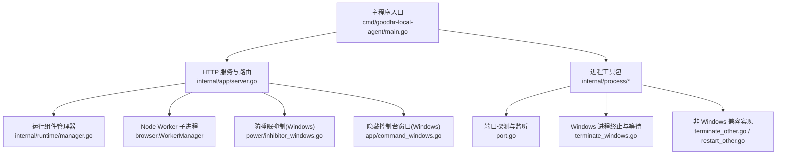
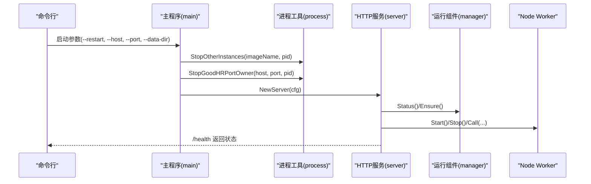
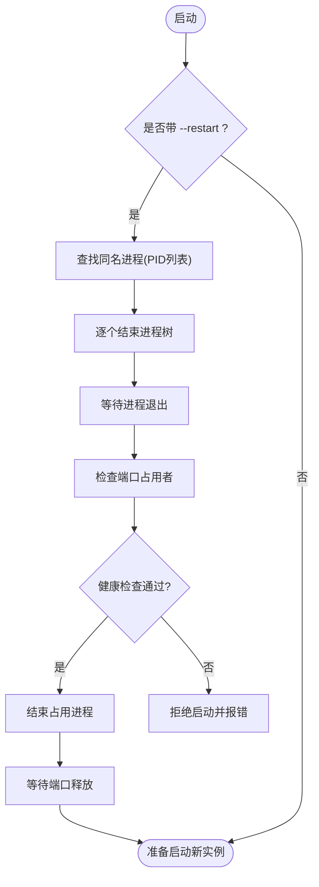
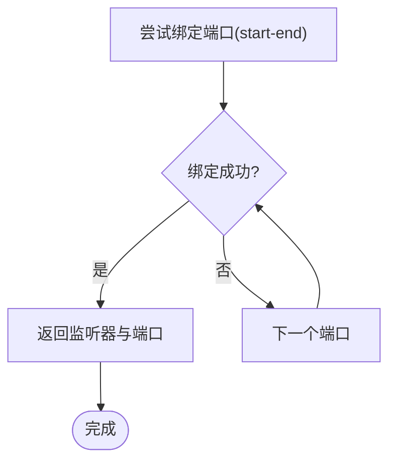
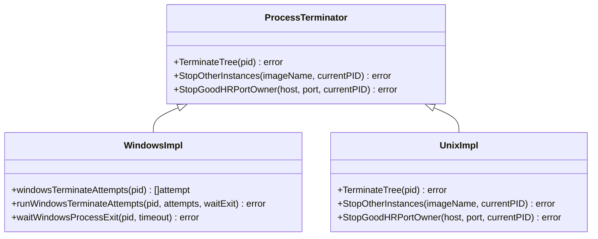
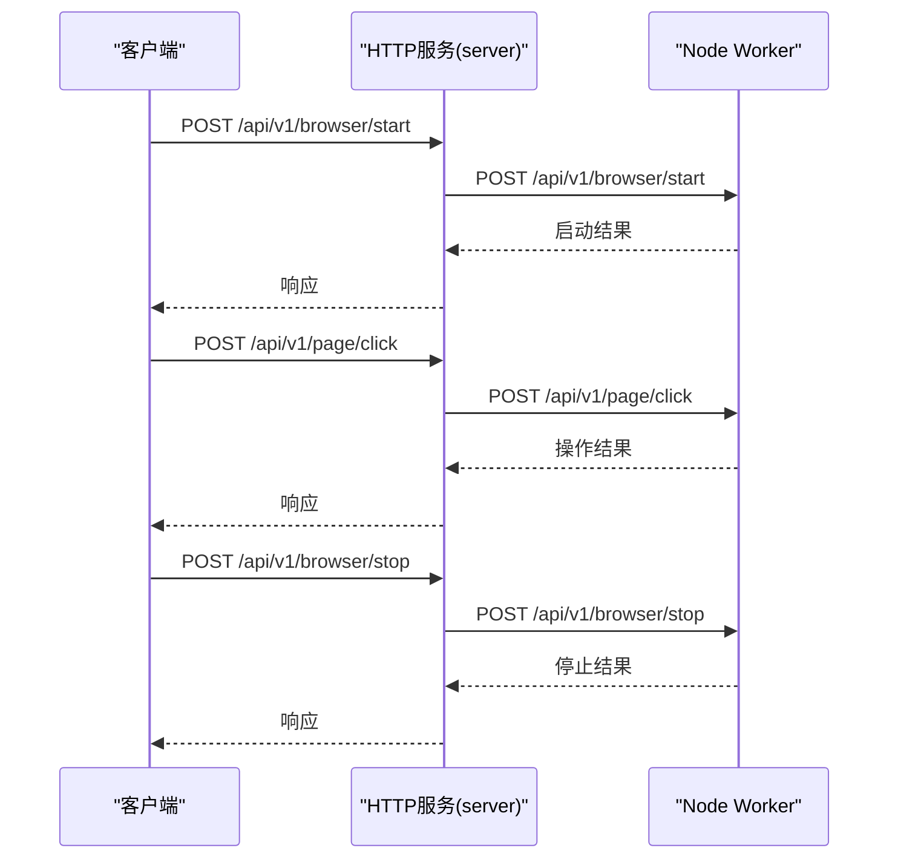
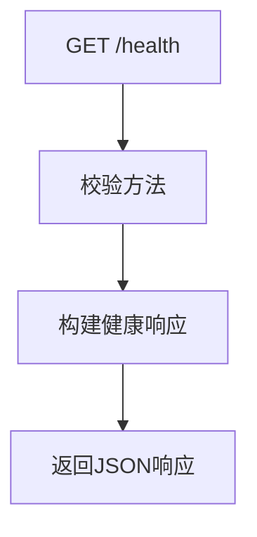
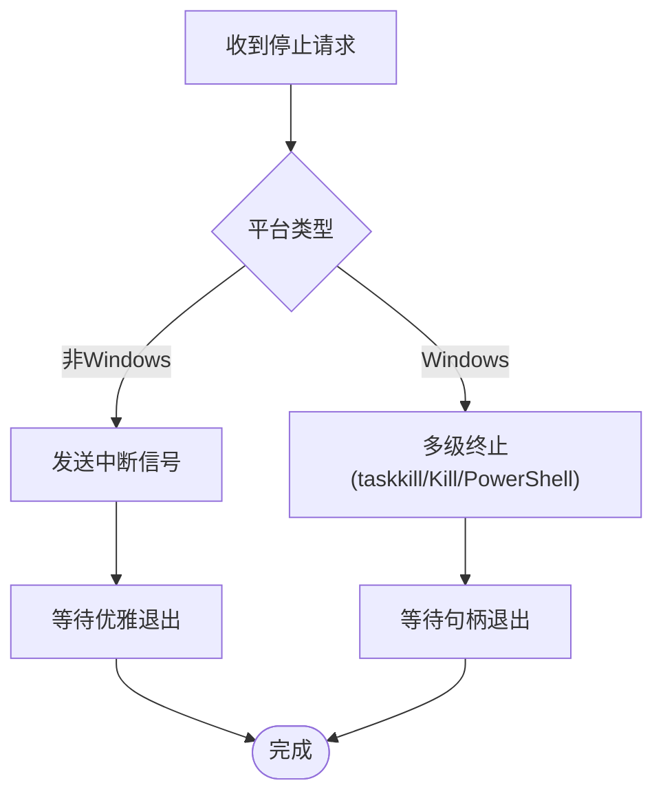
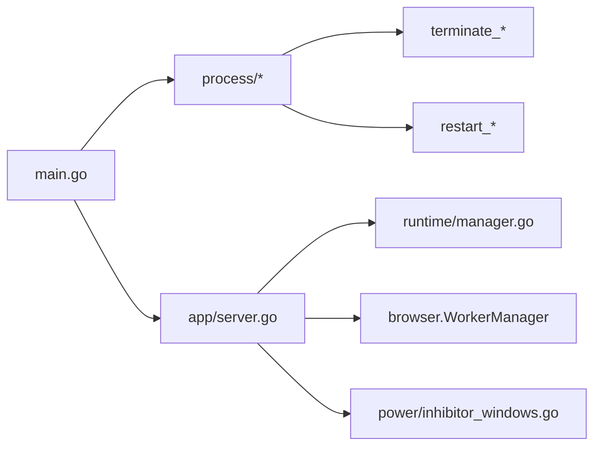

# 进程控制

<cite>
**本文引用的文件**
- [main.go](file://goodhr5/local-agent-go/cmd/goodhr-local-agent/main.go)
- [server.go](file://goodhr5/local-agent-go/internal/app/server.go)
- [restart_windows.go](file://goodhr5/local-agent-go/internal/process/restart_windows.go)
- [restart_other.go](file://goodhr5/local-agent-go/internal/process/restart_other.go)
- [terminate_windows.go](file://goodhr5/local-agent-go/internal/process/terminate_windows.go)
- [terminate_other.go](file://goodhr5/local-agent-go/internal/process/terminate_other.go)
- [port.go](file://goodhr5/local-agent-go/internal/process/port.go)
- [manager.go](file://goodhr5/local-agent-go/internal/runtime/manager.go)
- [process_alive_windows.go](file://goodhr5/local-agent-go-new/internal/profile/process_alive_windows.go)
- [process_alive_unix.go](file://goodhr5/local-agent-go-new/internal/profile/process_alive_unix.go)
- [inhibitor_windows.go](file://goodhr5/local-agent-go/internal/power/inhibitor_windows.go)
- [command_windows.go](file://goodhr5/local-agent-go/internal/app/command_windows.go)
- [command_other.go](file://goodhr5/local-agent-go/internal/app/command_other.go)
</cite>

## 目录
1. [简介](#简介)
2. [项目结构](#项目结构)
3. [核心组件](#核心组件)
4. [架构总览](#架构总览)
5. [详细组件分析](#详细组件分析)
6. [依赖关系分析](#依赖关系分析)
7. [性能考虑](#性能考虑)
8. [故障排查指南](#故障排查指南)
9. [结论](#结论)
10. [附录](#附录)

## 简介
本文件聚焦本地执行器（GoodHR 本地 Agent）的进程控制能力，覆盖进程重启、端口占用检测与清理、多实例管理、跨平台差异处理、进程间通信、信号处理、优雅退出、健康检查、故障恢复、资源管理与异常崩溃处理等主题。文档基于仓库中 Go 版本本地 Agent 的实现进行梳理，重点围绕进程生命周期、端口与进程树终止、以及 Node Worker 子进程的启动与停止策略展开。

## 项目结构
本地 Agent 的进程控制相关代码主要分布在以下模块：
- 入口与启动流程：命令行参数解析、旧实例清理、服务启动
- 进程工具：端口探测、端口占用者识别与结束、多实例关闭、跨平台进程终止
- 运行组件管理：Node、CloakBrowser、OCR 等运行时组件的安装与状态查询
- 控制台与 HTTP API：健康检查、诊断、浏览器 Worker 转发、岗位运行控制
- 防睡眠抑制：Windows 下防止系统休眠以保证长时间任务稳定
- 跨平台命令隐藏：Windows 下隐藏控制台窗口

**图示来源**
- [main.go:18-61](file://goodhr5/local-agent-go/cmd/goodhr-local-agent/main.go#L18-L61)
- [server.go:87-168](file://goodhr5/local-agent-go/internal/app/server.go#L87-L168)
- [port.go:9-31](file://goodhr5/local-agent-go/internal/process/port.go#L9-L31)
- [terminate_windows.go:27-96](file://goodhr5/local-agent-go/internal/process/terminate_windows.go#L27-L96)
- [terminate_other.go:8-19](file://goodhr5/local-agent-go/internal/process/terminate_other.go#L8-L19)
- [restart_other.go:6-16](file://goodhr5/local-agent-go/internal/process/restart_other.go#L6-L16)
- [manager.go:68-90](file://goodhr5/local-agent-go/internal/runtime/manager.go#L68-L90)
- [inhibitor_windows.go:25-50](file://goodhr5/local-agent-go/internal/power/inhibitor_windows.go#L25-L50)
- [command_windows.go:11-21](file://goodhr5/local-agent-go/internal/app/command_windows.go#L11-L21)

**章节来源**
- [main.go:18-61](file://goodhr5/local-agent-go/cmd/goodhr-local-agent/main.go#L18-L61)
- [server.go:87-168](file://goodhr5/local-agent-go/internal/app/server.go#L87-L168)

## 核心组件
- 进程重启与多实例管理
  - 通过命令行参数触发旧实例关闭，并在 Windows 上按镜像名查找并结束其他同名进程
  - 对固定端口占用者进行健康检查确认后再结束，避免误杀第三方程序
- 端口占用检测与监听
  - 在指定范围内尝试绑定 TCP 端口，返回可用监听器与实际端口
  - 使用系统命令解析监听表以定位占用端口的 PID
- 跨平台进程终止
  - Windows：多级终止策略（taskkill、Go Kill、PowerShell），每次尝试后等待句柄退出确认
  - 非 Windows：直接调用系统 Kill 信号
- 健康检查与诊断
  - 提供 /health 接口，返回版本、端口、数据目录、运行组件状态等
- 子进程通信与优雅退出
  - 通过 HTTP 将浏览器操作请求转发到 Node Worker
  - 非 Windows 向子进程发送中断信号以实现优雅退出
- 防睡眠抑制
  - Windows 下设置线程执行状态阻止系统自动睡眠，保证长时间任务不中断

**章节来源**
- [main.go:28-37](file://goodhr5/local-agent-go/cmd/goodhr-local-agent/main.go#L28-L37)
- [restart_windows.go:30-50](file://goodhr5/local-agent-go/internal/process/restart_windows.go#L30-L50)
- [port.go:9-31](file://goodhr5/local-agent-go/internal/process/port.go#L9-L31)
- [terminate_windows.go:27-96](file://goodhr5/local-agent-go/internal/process/terminate_windows.go#L27-L96)
- [terminate_other.go:8-19](file://goodhr5/local-agent-go/internal/process/terminate_other.go#L8-L19)
- [server.go:170-191](file://goodhr5/local-agent-go/internal/app/server.go#L170-L191)
- [inhibitor_windows.go:25-50](file://goodhr5/local-agent-go/internal/power/inhibitor_windows.go#L25-L50)

## 架构总览
本地 Agent 作为 HTTP 服务暴露统一接口，负责：
- 启动时清理旧实例与端口占用
- 管理运行组件（Node、CloakBrowser、OCR）安装与状态
- 启动/停止 Node Worker 子进程，并通过 HTTP 转发页面操作
- 提供健康检查与诊断接口，便于外部监控与运维

**图示来源**
- [main.go:18-61](file://goodhr5/local-agent-go/cmd/goodhr-local-agent/main.go#L18-L61)
- [server.go:87-168](file://goodhr5/local-agent-go/internal/app/server.go#L87-L168)
- [manager.go:68-90](file://goodhr5/local-agent-go/internal/runtime/manager.go#L68-L90)

## 详细组件分析

### 进程重启机制与多实例管理
- 启动参数支持 --restart，触发旧实例关闭流程
- Windows 上根据镜像名查找所有同名进程，排除当前进程后逐一结束
- 非 Windows 系统默认不处理旧进程（兼容策略）
- 端口占用者识别：解析 netstat 输出获取 PID，再访问 /health 验证是否为 GoodHR 旧实例，确认后结束进程树并等待端口释放

**图示来源**
- [main.go:28-37](file://goodhr5/local-agent-go/cmd/goodhr-local-agent/main.go#L28-L37)
- [restart_windows.go:126-142](file://goodhr5/local-agent-go/internal/process/restart_windows.go#L126-L142)
- [restart_windows.go:30-50](file://goodhr5/local-agent-go/internal/process/restart_windows.go#L30-L50)
- [restart_other.go:6-16](file://goodhr5/local-agent-go/internal/process/restart_other.go#L6-L16)

**章节来源**
- [main.go:28-37](file://goodhr5/local-agent-go/cmd/goodhr-local-agent/main.go#L28-L37)
- [restart_windows.go:30-50](file://goodhr5/local-agent-go/internal/process/restart_windows.go#L30-L50)
- [restart_windows.go:126-142](file://goodhr5/local-agent-go/internal/process/restart_windows.go#L126-L142)
- [restart_other.go:6-16](file://goodhr5/local-agent-go/internal/process/restart_other.go#L6-L16)

### 端口占用检测与监听
- 监听优先端口范围：从配置端口开始尝试绑定，若失败则继续尝试直到找到可用端口
- 端口占用者定位：在 Windows 上使用 netstat 解析监听表，提取 PID；在非 Windows 上由终止逻辑直接调用系统 Kill
- 端口释放等待：结束进程后轮询检查端口是否真正释放，超时则报错

**图示来源**
- [port.go:9-31](file://goodhr5/local-agent-go/internal/process/port.go#L9-L31)
- [restart_windows.go:52-82](file://goodhr5/local-agent-go/internal/process/restart_windows.go#L52-L82)
- [restart_windows.go:107-124](file://goodhr5/local-agent-go/internal/process/restart_windows.go#L107-L124)

**章节来源**
- [port.go:9-31](file://goodhr5/local-agent-go/internal/process/port.go#L9-L31)
- [restart_windows.go:52-82](file://goodhr5/local-agent-go/internal/process/restart_windows.go#L52-L82)
- [restart_windows.go:107-124](file://goodhr5/local-agent-go/internal/process/restart_windows.go#L107-L124)

### 跨平台进程操作实现
- Windows 多级终止策略：
  - 首选 taskkill 结束进程树
  - 其次 Go 原生 Kill
  - 最后 PowerShell 强制结束
  - 每次尝试后通过句柄等待确认进程已退出
- 非 Windows 简单终止：
  - 直接调用 Kill 信号
- Chromium 单例锁存活判断：
  - Windows：通过 OpenProcess 与 GetExitCodeProcess 判断进程是否仍活跃
  - 非 Windows：通过 Kill(pid, 0) 判断是否存在或权限不足

**图示来源**
- [terminate_windows.go:27-96](file://goodhr5/local-agent-go/internal/process/terminate_windows.go#L27-L96)
- [terminate_other.go:8-19](file://goodhr5/local-agent-go/internal/process/terminate_other.go#L8-L19)
- [restart_windows.go:30-50](file://goodhr5/local-agent-go/internal/process/restart_windows.go#L30-L50)
- [restart_other.go:6-16](file://goodhr5/local-agent-go/internal/process/restart_other.go#L6-L16)
- [process_alive_windows.go:13-28](file://goodhr5/local-agent-go-new/internal/profile/process_alive_windows.go#L13-L28)
- [process_alive_unix.go:11-15](file://goodhr5/local-agent-go-new/internal/profile/process_alive_unix.go#L11-L15)

**章节来源**
- [terminate_windows.go:27-96](file://goodhr5/local-agent-go/internal/process/terminate_windows.go#L27-L96)
- [terminate_other.go:8-19](file://goodhr5/local-agent-go/internal/process/terminate_other.go#L8-L19)
- [process_alive_windows.go:13-28](file://goodhr5/local-agent-go-new/internal/profile/process_alive_windows.go#L13-L28)
- [process_alive_unix.go:11-15](file://goodhr5/local-agent-go-new/internal/profile/process_alive_unix.go#L11-L15)

### 进程间通信与 Node Worker 管理
- HTTP 转发：浏览器相关操作通过 HTTP POST 转发到 Node Worker 的对应路径
- 启动/停止：提供 /api/v1/worker/start、/api/v1/worker/stop、/api/v1/worker/status
- 优雅退出：非 Windows 向子进程发送中断信号，使其能自行清理资源后退出
- 固定端口清理：启动时尝试清理固定端口上的旧 Worker，避免冲突

**图示来源**
- [server.go:288-321](file://goodhr5/local-agent-go/internal/app/server.go#L288-L321)
- [server.go:649-783](file://goodhr5/local-agent-go/internal/app/server.go#L649-L783)

**章节来源**
- [server.go:288-321](file://goodhr5/local-agent-go/internal/app/server.go#L288-L321)
- [server.go:649-783](file://goodhr5/local-agent-go/internal/app/server.go#L649-L783)

### 健康检查与诊断
- /health 返回本地程序状态，包括版本、端口、数据目录、日志路径、运行组件状态等
- /api/v1/diagnostics 提供诊断信息
- 运行组件状态：Node、CloakBrowser、OCR 是否安装及路径

**图示来源**
- [server.go:170-191](file://goodhr5/local-agent-go/internal/app/server.go#L170-L191)
- [manager.go:68-90](file://goodhr5/local-agent-go/internal/runtime/manager.go#L68-L90)

**章节来源**
- [server.go:170-191](file://goodhr5/local-agent-go/internal/app/server.go#L170-L191)
- [manager.go:68-90](file://goodhr5/local-agent-go/internal/runtime/manager.go#L68-L90)

### 信号处理与优雅退出
- 非 Windows 系统：向子进程发送中断信号，允许其自行清理资源
- Windows 系统：通过多级终止策略确保进程结束，并在每次尝试后等待句柄退出确认
- 防睡眠抑制：Windows 下设置线程执行状态阻止系统休眠，避免长时间任务被中断

**图示来源**
- [terminate_windows.go:76-96](file://goodhr5/local-agent-go/internal/process/terminate_windows.go#L76-L96)
- [terminate_other.go:8-19](file://goodhr5/local-agent-go/internal/process/terminate_other.go#L8-L19)
- [inhibitor_windows.go:25-50](file://goodhr5/local-agent-go/internal/power/inhibitor_windows.go#L25-L50)

**章节来源**
- [terminate_windows.go:76-96](file://goodhr5/local-agent-go/internal/process/terminate_windows.go#L76-L96)
- [terminate_other.go:8-19](file://goodhr5/local-agent-go/internal/process/terminate_other.go#L8-L19)
- [inhibitor_windows.go:25-50](file://goodhr5/local-agent-go/internal/power/inhibitor_windows.go#L25-L50)

### 故障恢复策略
- 端口占用恢复：结束占用进程后轮询等待端口释放，超时则报错提示
- 进程终止失败恢复：多级终止策略依次尝试，记录失败原因并汇总错误
- 运行组件缺失恢复：Ensure 检查 Node 与 CloakBrowser 是否安装，未安装则提示先下载
- 控制台前端包更新：下载清单、校验 SHA256、解压并替换旧目录，写入版本信息

**章节来源**
- [restart_windows.go:107-124](file://goodhr5/local-agent-go/internal/process/restart_windows.go#L107-L124)
- [terminate_windows.go:76-96](file://goodhr5/local-agent-go/internal/process/terminate_windows.go#L76-L96)
- [manager.go:181-192](file://goodhr5/local-agent-go/internal/runtime/manager.go#L181-L192)

### 进程资源管理与内存泄漏防护
- 资源清理：
  - 启动时清理固定端口上的旧 Worker，避免资源冲突
  - 停止浏览器前结束所有运行的岗位任务，释放浏览器与页面资源
- 内存泄漏防护建议：
  - 在 Node Worker 中合理管理浏览器实例与页面生命周期
  - 定期截图与日志归档，避免磁盘空间耗尽导致 OOM
  - 使用健康检查与诊断接口监控资源使用情况

**章节来源**
- [server.go:87-115](file://goodhr5/local-agent-go/internal/app/server.go#L87-L115)
- [server.go:649-662](file://goodhr5/local-agent-go/internal/app/server.go#L649-L662)

## 依赖关系分析
- 主程序依赖进程工具进行旧实例清理与端口占用处理
- HTTP 服务依赖运行组件管理器检查 Node、CloakBrowser、OCR 状态
- Node Worker 通过 HTTP 与主程序通信，执行浏览器操作
- 防睡眠抑制仅在 Windows 生效，用于保障长时间任务稳定性

**图示来源**
- [main.go:18-61](file://goodhr5/local-agent-go/cmd/goodhr-local-agent/main.go#L18-L61)
- [server.go:87-168](file://goodhr5/local-agent-go/internal/app/server.go#L87-L168)
- [manager.go:68-90](file://goodhr5/local-agent-go/internal/runtime/manager.go#L68-L90)

**章节来源**
- [main.go:18-61](file://goodhr5/local-agent-go/cmd/goodhr-local-agent/main.go#L18-L61)
- [server.go:87-168](file://goodhr5/local-agent-go/internal/app/server.go#L87-L168)
- [manager.go:68-90](file://goodhr5/local-agent-go/internal/runtime/manager.go#L68-L90)

## 性能考虑
- 端口扫描范围应合理设置，避免过宽导致启动延迟
- 进程终止等待时间需平衡响应速度与可靠性
- Node Worker 并发控制应避免过多浏览器实例导致资源竞争
- 健康检查与健康探针频率需适中，避免频繁请求影响性能

## 故障排查指南
- 端口占用问题：
  - 检查 /health 返回的端口是否与预期一致
  - 查看端口占用者是否为 GoodHR 旧实例，若非则手动处理
- 进程无法结束：
  - 查看多级终止策略的失败日志，确认权限与环境
  - 在 Windows 上检查 taskkill 与 PowerShell 是否可用
- 运行组件缺失：
  - 通过 /api/v1/runtime/status 检查 Node、CloakBrowser、OCR 状态
  - 使用 /api/v1/runtime/install 安装缺失组件
- 控制台前端包更新失败：
  - 检查清单地址与下载链接是否有效
  - 校验 SHA256 是否匹配

**章节来源**
- [server.go:170-191](file://goodhr5/local-agent-go/internal/app/server.go#L170-L191)
- [restart_windows.go:30-50](file://goodhr5/local-agent-go/internal/process/restart_windows.go#L30-L50)
- [terminate_windows.go:76-96](file://goodhr5/local-agent-go/internal/process/terminate_windows.go#L76-L96)
- [manager.go:68-90](file://goodhr5/local-agent-go/internal/runtime/manager.go#L68-L90)

## 结论
本地 Agent 的进程控制实现了稳健的进程重启、端口占用检测与清理、多实例管理、跨平台差异处理、健康检查与诊断、以及 Node Worker 的启动与停止。通过多级终止策略与端口释放等待，提升了进程管理的可靠性；通过健康检查与运行组件状态查询，提供了良好的可观测性。建议在 Node Worker 中加强资源管理与内存泄漏防护，并结合健康检查与日志进行持续监控。

## 附录
- 命令行参数说明：
  - --host：本地监听地址
  - --port：本地优先监听端口
  - --data-dir：本地数据目录
  - --open-console：启动后自动打开控制台
  - --restart：启动前先关闭旧的本地程序
- 关键接口：
  - /health：健康检查
  - /api/v1/diagnostics：诊断信息
  - /api/v1/runtime/status：运行组件状态
  - /api/v1/runtime/install：安装运行组件
  - /api/v1/worker/start、/api/v1/worker/stop、/api/v1/worker/status：Node Worker 控制

**章节来源**
- [main.go:18-61](file://goodhr5/local-agent-go/cmd/goodhr-local-agent/main.go#L18-L61)
- [server.go:117-168](file://goodhr5/local-agent-go/internal/app/server.go#L117-L168)