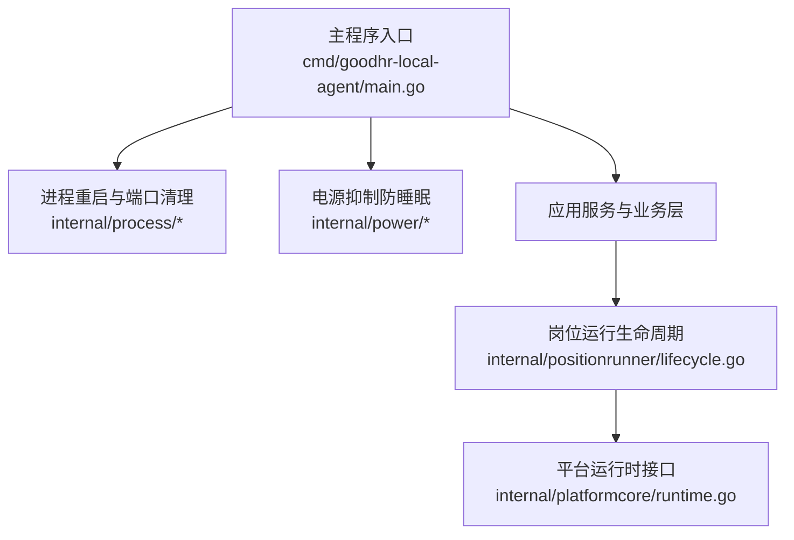
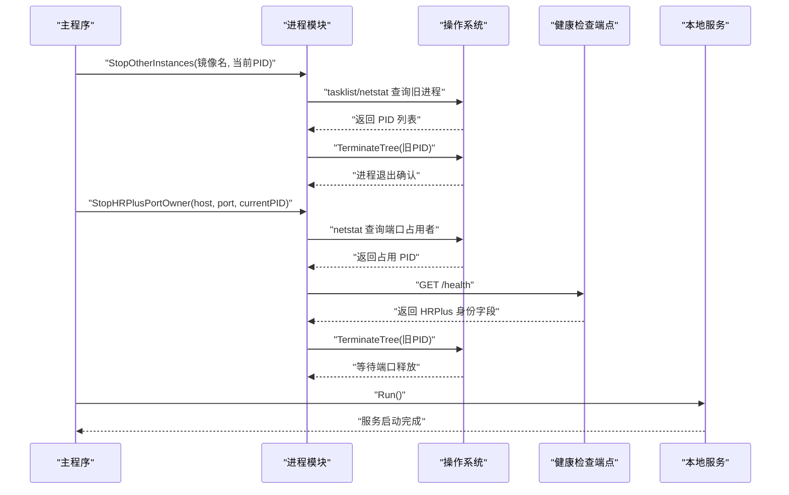
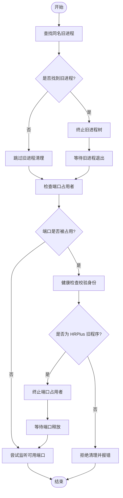
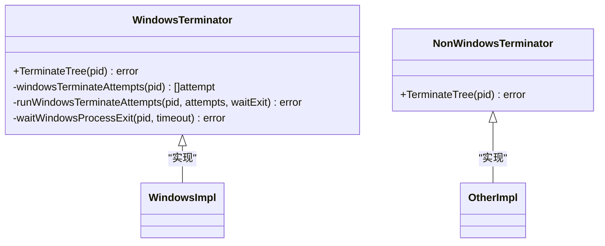
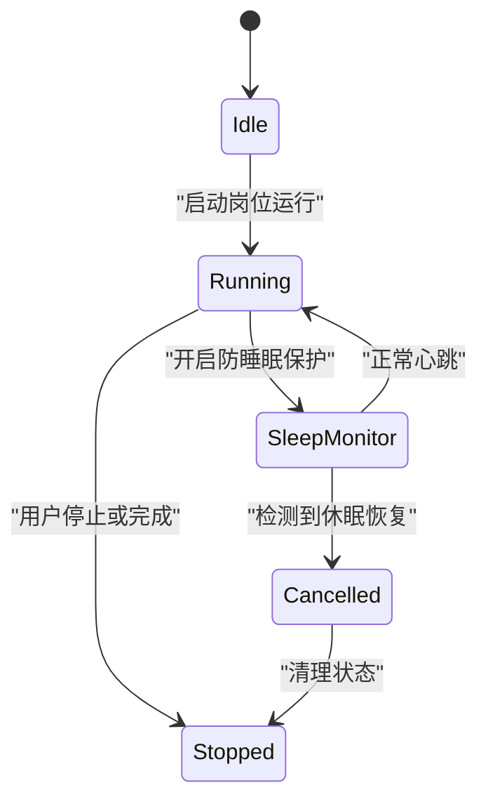
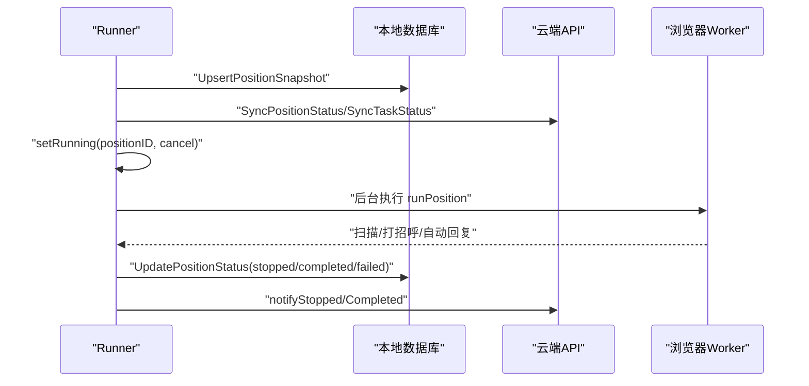
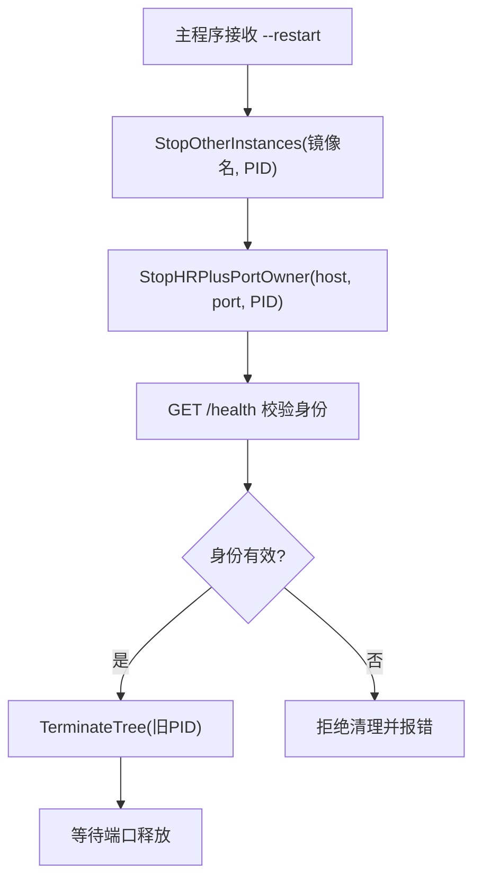
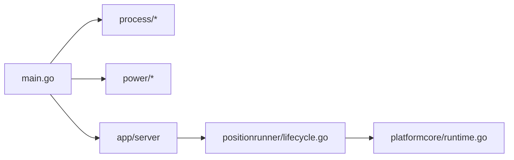

# 进程控制

<cite>
**本文引用的文件**   
- [main.go](file://goodhr5/local-agent-go/cmd/goodhr-local-agent/main.go)
- [restart_windows.go](file://goodhr5/local-agent-go/internal/process/restart_windows.go)
- [restart_other.go](file://goodhr5/local-agent-go/internal/process/restart_other.go)
- [port.go](file://goodhr5/local-agent-go/internal/process/port.go)
- [terminate_windows.go](file://goodhr5/local-agent-go/internal/process/terminate_windows.go)
- [terminate_other.go](file://goodhr5/local-agent-go/internal/process/terminate_other.go)
- [inhibitor_windows.go](file://goodhr5/local-agent-go/internal/power/inhibitor_windows.go)
- [inhibitor_darwin.go](file://goodhr5/local-agent-go/internal/power/inhibitor_darwin.go)
- [inhibitor_other.go](file://goodhr5/local-agent-go/internal/power/inhibitor_other.go)
- [lifecycle.go](file://goodhr5/local-agent-go/internal/positionrunner/lifecycle.go)
- [runtime.go](file://goodhr5/local-agent-go/internal/platformcore/runtime.go)
</cite>

## 目录
1. [引言](#引言)
2. [项目结构](#项目结构)
3. [核心组件](#核心组件)
4. [架构总览](#架构总览)
5. [详细组件分析](#详细组件分析)
6. [依赖关系分析](#依赖关系分析)
7. [性能与资源管理](#性能与资源管理)
8. [故障排查指南](#故障排查指南)
9. [结论](#结论)

## 引言
本文聚焦本地执行器进程控制，围绕以下目标展开：
- 进程重启机制：启动前清理旧实例、端口占用检测与释放。
- 多实例管理：同一程序名的旧进程识别与终止策略。
- 跨平台实现：Windows 与 Unix/macOS 的差异处理。
- 进程间通信与健康检查：通过 HTTP 健康端点验证端口归属。
- 信号处理与优雅退出：岗位运行生命周期中的停止、等待与强制取消。
- 监控与健康检查：运行状态、进度、日志与云端同步。
- 故障恢复策略：浏览器关闭、认证过期、系统休眠恢复等异常路径。
- 资源管理与健壮性：防睡眠保护、端口监听、进程树结束与超时确认。

## 项目结构
本地执行器由 Go 主程序入口、进程辅助模块、电源抑制模块以及岗位运行生命周期模块组成。关键路径如下：
- 主程序入口负责参数解析、旧进程清理、配置初始化与服务启动。
- 进程模块提供端口探测、旧实例终止、端口释放等待与跨平台差异实现。
- 电源模块提供防睡眠能力，避免长时间自动化任务被系统中断。
- 岗位运行生命周期模块负责任务编排、状态机、停止与恢复逻辑。

**图表来源**
- [main.go:20-76](file://goodhr5/local-agent-go/cmd/goodhr-local-agent/main.go#L20-L76)
- [restart_windows.go:30-50](file://goodhr5/local-agent-go/internal/process/restart_windows.go#L30-L50)
- [lifecycle.go:17-123](file://goodhr5/local-agent-go/internal/positionrunner/lifecycle.go#L17-L123)
- [runtime.go:10-18](file://goodhr5/local-agent-go/internal/platformcore/runtime.go#L10-L18)

**章节来源**
- [main.go:20-76](file://goodhr5/local-agent-go/cmd/goodhr-local-agent/main.go#L20-L76)

## 核心组件
- 进程重启与端口清理
  - Windows 下通过系统命令查询端口占用者、健康检查校验身份、安全终止进程树并等待端口释放。
  - 非 Windows 平台提供空实现，不主动清理旧进程。
- 端口监听与可用端口查找
  - 在指定范围内尝试 TCP 监听，返回首个可用端口与监听器。
- 进程终止
  - Windows 多级终止策略：taskkill、Go 原生 Kill、PowerShell Stop-Process，并等待句柄退出。
  - 非 Windows 使用标准库终止进程。
- 电源抑制
  - Windows 调用内核 API 阻止系统睡眠；macOS 启动 caffeinate；其他平台空实现。
- 岗位运行生命周期
  - 启动、后台运行、停止、停止全部、状态与进度查询；防睡眠保护与休眠恢复检测；错误分类与通知。

**章节来源**
- [restart_windows.go:30-105](file://goodhr5/local-agent-go/internal/process/restart_windows.go#L30-L105)
- [restart_other.go:6-16](file://goodhr5/local-agent-go/internal/process/restart_other.go#L6-L16)
- [port.go:9-31](file://goodhr5/local-agent-go/internal/process/port.go#L9-L31)
- [terminate_windows.go:27-96](file://goodhr5/local-agent-go/internal/process/terminate_windows.go#L27-L96)
- [terminate_other.go:8-19](file://goodhr5/local-agent-go/internal/process/terminate_other.go#L8-L19)
- [inhibitor_windows.go:25-57](file://goodhr5/local-agent-go/internal/power/inhibitor_windows.go#L25-L57)
- [inhibitor_darwin.go:16-36](file://goodhr5/local-agent-go/internal/power/inhibitor_darwin.go#L16-L36)
- [inhibitor_other.go:6-10](file://goodhr5/local-agent-go/internal/power/inhibitor_other.go#L6-L10)
- [lifecycle.go:17-123](file://goodhr5/local-agent-go/internal/positionrunner/lifecycle.go#L17-L123)

## 架构总览
本地执行器的进程控制架构以“主程序入口”为统一入口，协调进程清理、端口分配、服务启动与岗位运行生命周期。进程清理在 Windows 上具备强约束：必须确认端口占用者为旧 HRPlus 程序，否则拒绝自动结束，防止误杀第三方进程。

**图表来源**
- [main.go:43-52](file://goodhr5/local-agent-go/cmd/goodhr-local-agent/main.go#L43-L52)
- [restart_windows.go:30-105](file://goodhr5/local-agent-go/internal/process/restart_windows.go#L30-L105)
- [terminate_windows.go:27-96](file://goodhr5/local-agent-go/internal/process/terminate_windows.go#L27-L96)

## 详细组件分析

### 进程重启与端口占用检测
- 旧实例关闭
  - Windows：通过 tasklist 获取同名进程 PID 列表，排除当前进程后逐一终止，并等待退出。
  - 非 Windows：空实现，不做任何操作。
- 端口占用者清理
  - Windows：通过 netstat 找到监听端口的 PID，调用 /health 健康检查校验是否为 HRPlus 旧程序；若合法则终止进程树并等待端口释放。
  - 非 Windows：空实现。
- 端口可用查找
  - 在起始到结束端口范围内尝试 TCP 监听，返回第一个成功监听地址与实际端口。

**图表来源**
- [restart_windows.go:30-105](file://goodhr5/local-agent-go/internal/process/restart_windows.go#L30-L105)
- [restart_windows.go:126-142](file://goodhr5/local-agent-go/internal/process/restart_windows.go#L126-L142)
- [port.go:9-31](file://goodhr5/local-agent-go/internal/process/port.go#L9-L31)

**章节来源**
- [restart_windows.go:30-105](file://goodhr5/local-agent-go/internal/process/restart_windows.go#L30-L105)
- [restart_windows.go:126-142](file://goodhr5/local-agent-go/internal/process/restart_windows.go#L126-L142)
- [restart_other.go:6-16](file://goodhr5/local-agent-go/internal/process/restart_other.go#L6-L16)
- [port.go:9-31](file://goodhr5/local-agent-go/internal/process/port.go#L9-L31)

### 跨平台进程终止实现
- Windows
  - 多级终止策略：
    - taskkill /T /F 强制结束进程树。
    - Go 原生 os.FindProcess(pid).Kill()。
    - PowerShell Stop-Process -Force。
  - 每次尝试后使用 WaitForSingleObject 等待进程句柄退出，失败则记录原因并继续下一方案。
- 非 Windows
  - 直接调用 os.FindProcess(pid).Kill()，无多级兜底。

**图表来源**
- [terminate_windows.go:27-96](file://goodhr5/local-agent-go/internal/process/terminate_windows.go#L27-L96)
- [terminate_other.go:8-19](file://goodhr5/local-agent-go/internal/process/terminate_other.go#L8-L19)

**章节来源**
- [terminate_windows.go:27-121](file://goodhr5/local-agent-go/internal/process/terminate_windows.go#L27-L121)
- [terminate_other.go:8-19](file://goodhr5/local-agent-go/internal/process/terminate_other.go#L8-L19)

### 电源抑制与系统休眠恢复
- 防睡眠能力
  - Windows：调用 SetThreadExecutionState 设置连续系统/显示/远程模式标志，阻止系统自动睡眠。
  - macOS：启动 caffeinate -dimsu 进程保持系统唤醒。
  - 其他平台：空实现，不影响功能。
- 休眠恢复检测
  - 周期性检测时间断层，超过阈值视为可能休眠恢复，取消正在运行的岗位运行并触发失败通知。

**图表来源**
- [inhibitor_windows.go:25-57](file://goodhr5/local-agent-go/internal/power/inhibitor_windows.go#L25-L57)
- [inhibitor_darwin.go:16-36](file://goodhr5/local-agent-go/internal/power/inhibitor_darwin.go#L16-L36)
- [lifecycle.go:442-531](file://goodhr5/local-agent-go/internal/positionrunner/lifecycle.go#L442-L531)

**章节来源**
- [inhibitor_windows.go:25-57](file://goodhr5/local-agent-go/internal/power/inhibitor_windows.go#L25-L57)
- [inhibitor_darwin.go:16-36](file://goodhr5/local-agent-go/internal/power/inhibitor_darwin.go#L16-L36)
- [inhibitor_other.go:6-10](file://goodhr5/local-agent-go/internal/power/inhibitor_other.go#L6-L10)
- [lifecycle.go:442-531](file://goodhr5/local-agent-go/internal/positionrunner/lifecycle.go#L442-L531)

### 岗位运行生命周期与优雅退出
- 启动流程
  - 校验岗位 ID、令牌、任务类型；创建运行锁；启动防睡眠保护；构建运行时快照；同步云端状态；后台执行 runPosition。
- 运行流程
  - 根据任务类型选择自动回复或扫描流程；更新进度；完成后收尾并异步检查候选人回复。
- 停止流程
  - 标记用户停止；若自动回复中立即取消；否则等待当前候选人处理完成；超时则强制取消；数据库状态置为 stopped。
- 停止全部
  - 遍历所有运行项，调用 cancel；批量更新进度与数据库状态。
- 状态与进度
  - 提供 Status、Progress、IsRunning 等方法；合并数据库状态与内存运行状态。

**图表来源**
- [lifecycle.go:17-123](file://goodhr5/local-agent-go/internal/positionrunner/lifecycle.go#L17-L123)
- [lifecycle.go:205-262](file://goodhr5/local-agent-go/internal/positionrunner/lifecycle.go#L205-L262)
- [lifecycle.go:264-314](file://goodhr5/local-agent-go/internal/positionrunner/lifecycle.go#L264-L314)

**章节来源**
- [lifecycle.go:17-123](file://goodhr5/local-agent-go/internal/positionrunner/lifecycle.go#L17-L123)
- [lifecycle.go:205-262](file://goodhr5/local-agent-go/internal/positionrunner/lifecycle.go#L205-L262)
- [lifecycle.go:264-314](file://goodhr5/local-agent-go/internal/positionrunner/lifecycle.go#L264-L314)

### 进程间通信与健康检查
- 健康检查端点
  - 通过 HTTP GET /health 返回包含 ok、status、version、port、dataDir 的结构体，用于确认端口占用者为 HRPlus 旧程序。
- 主程序参数
  - --host、--port、--data-dir、--open-console、--restart、--print-config。
  - --restart 时先按镜像名关闭旧实例，再清理端口占用者。

**图表来源**
- [main.go:43-52](file://goodhr5/local-agent-go/cmd/goodhr-local-agent/main.go#L43-L52)
- [restart_windows.go:84-105](file://goodhr5/local-agent-go/internal/process/restart_windows.go#L84-L105)

**章节来源**
- [main.go:20-76](file://goodhr5/local-agent-go/cmd/goodhr-local-agent/main.go#L20-L76)
- [restart_windows.go:84-105](file://goodhr5/local-agent-go/internal/process/restart_windows.go#L84-L105)

## 依赖关系分析
- 主程序依赖进程模块进行旧实例清理与端口释放。
- 进程模块依赖操作系统命令与网络栈进行端口探测与健康检查。
- 岗位运行生命周期依赖电源抑制模块确保系统不休眠。
- 平台运行时接口定义浏览器 Worker 的统一执行器，供各平台实现调用。

**图表来源**
- [main.go:14-18](file://goodhr5/local-agent-go/cmd/goodhr-local-agent/main.go#L14-L18)
- [lifecycle.go:4-15](file://goodhr5/local-agent-go/internal/positionrunner/lifecycle.go#L4-L15)
- [runtime.go:4-18](file://goodhr5/local-agent-go/internal/platformcore/runtime.go#L4-L18)

**章节来源**
- [main.go:14-18](file://goodhr5/local-agent-go/cmd/goodhr-local-agent/main.go#L14-L18)
- [lifecycle.go:4-15](file://goodhr5/local-agent-go/internal/positionrunner/lifecycle.go#L4-L15)
- [runtime.go:4-18](file://goodhr5/local-agent-go/internal/platformcore/runtime.go#L4-L18)

## 性能与资源管理
- 端口监听范围
  - 默认起始端口 55271，若 end < start 则回退到 start；逐个尝试直到成功或耗尽范围。
- 进程终止超时
  - Windows 使用 1500ms 等待句柄退出；多次尝试失败会累积错误信息。
- 防睡眠保护
  - 仅在运行岗位运行时启用；空闲时释放，避免长期占用系统电源状态。
- 内存与资源泄漏防护
  - 运行状态使用互斥锁保护；协程结束后清理 done channel、browser lease 与 power guard。
  - 日志输出在 Windows 与非 Windows 平台分别处理，避免控制台闪烁与重复写入。

[本节为通用指导，不直接分析具体文件]

## 故障排查指南
- 端口无法释放
  - 现象：旧进程已结束但端口仍占用。
  - 排查：检查端口占用者 PID 是否仍存在；确认健康检查是否返回 HRPlus 身份字段。
  - 参考：端口释放等待函数与 netstat 解析逻辑。
- 旧进程未终止
  - 现象：taskkill 或 PowerShell 未能结束进程。
  - 排查：查看多级终止尝试的错误日志；确认权限与进程树关系。
  - 参考：Windows 终止尝试列表与句柄等待逻辑。
- 岗位运行被意外停止
  - 现象：任务中途停止并提示“电脑可能已休眠或息屏”。
  - 排查：检查时间断层检测阈值与心跳间隔；确认防睡眠保护是否生效。
  - 参考：sleep monitor 与 cancelRunningPositionsAfterSleep。
- 浏览器关闭导致任务失败
  - 现象：扫描过程中出现“浏览器已关闭”相关错误。
  - 排查：确认浏览器 Worker 是否正常启动；检查错误关键词匹配逻辑。
  - 参考：isBrowserClosedPositionError。

**章节来源**
- [restart_windows.go:107-124](file://goodhr5/local-agent-go/internal/process/restart_windows.go#L107-L124)
- [terminate_windows.go:76-96](file://goodhr5/local-agent-go/internal/process/terminate_windows.go#L76-L96)
- [lifecycle.go:491-531](file://goodhr5/local-agent-go/internal/positionrunner/lifecycle.go#L491-L531)
- [lifecycle.go:410-431](file://goodhr5/local-agent-go/internal/positionrunner/lifecycle.go#L410-L431)

## 结论
本地执行器的进程控制以“安全优先”为原则：在 Windows 上严格校验端口占用者身份后再终止，避免误杀第三方进程；在非 Windows 平台上提供最小化兼容实现。岗位运行生命周期通过防睡眠保护、休眠恢复检测与优雅退出机制，确保长时间自动化任务的稳定性与可观测性。结合端口监听、进程树终止与超时确认，系统在复杂环境下具备较强的鲁棒性与可维护性。