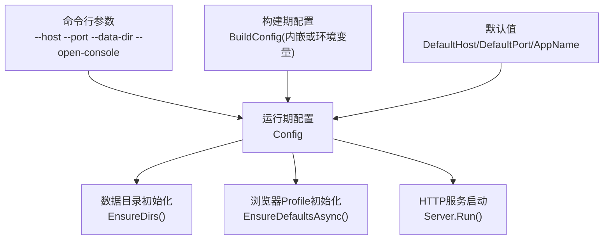
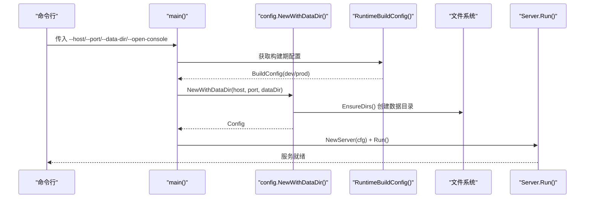
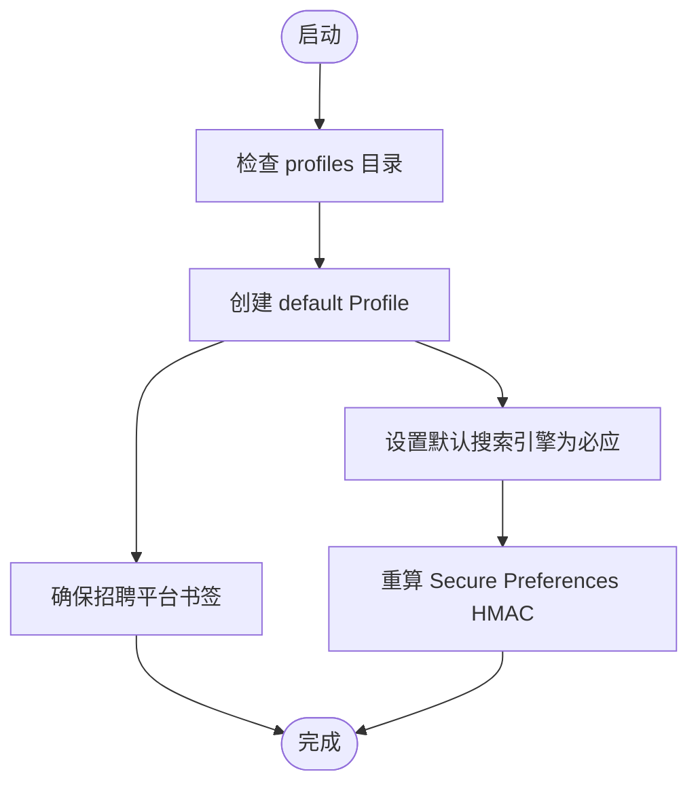
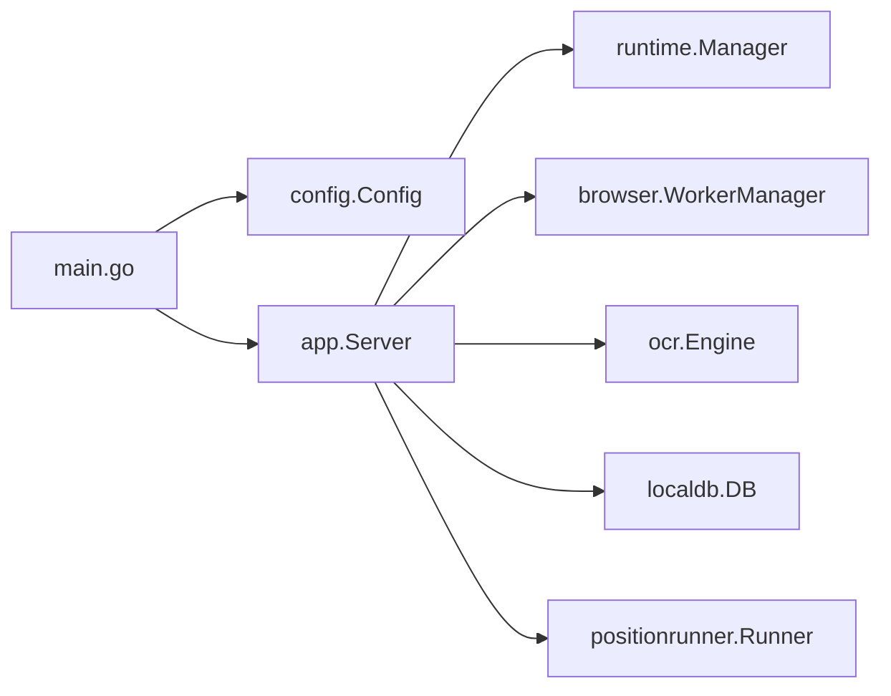

# 配置管理

<cite>
**本文引用的文件**
- [config.go](file://goodhr5/local-agent-go/internal/config/config.go)
- [build_config.go](file://goodhr5/local-agent-go/internal/config/build_config.go)
- [main.go](file://goodhr5/local-agent-go/cmd/goodhr-local-agent/main.go)
- [defaults.go](file://goodhr5/local-agent-go/internal/browserprofile/defaults.go)
- [server.go](file://goodhr5/local-agent-go/internal/app/server.go)
- [dev.json](file://goodhr5/local-agent-go/packaging/environments/dev.json)
- [prod.json](file://goodhr5/local-agent-go/packaging/environments/prod.json)
</cite>

## 目录
1. [简介](#简介)
2. [项目结构](#项目结构)
3. [核心组件](#核心组件)
4. [架构总览](#架构总览)
5. [详细组件分析](#详细组件分析)
6. [依赖关系分析](#依赖关系分析)
7. [性能与可靠性](#性能与可靠性)
8. [故障排查指南](#故障排查指南)
9. [结论](#结论)
10. [附录：配置项与环境对照表](#附录配置项与环境对照表)

## 简介
本文件面向本地执行器（Go 版本 Local Agent）的配置管理，系统性说明 Config 结构体设计、构建期环境配置、运行时配置来源与优先级、数据目录与浏览器配置文件管理、日志配置、配置校验规则、热重载机制以及开发与生产环境的差异策略。目标是帮助开发者快速理解并安全地调整本地执行器的运行行为。

## 项目结构
本地执行器配置由“构建期配置”和“运行期配置”两部分组成：
- 构建期配置：通过打包脚本将 dev 或 prod 的公开地址以 Base64 形式嵌入二进制；运行时优先读取该内嵌配置，未打包时回退到进程环境变量。
- 运行期配置：包括监听地址、端口、数据目录、自动打开控制台开关等，来源于命令行参数、环境变量与默认值。

图示来源
- [config.go:24-95](file://goodhr5/local-agent-go/internal/config/config.go#L24-L95)
- [build_config.go:46-62](file://goodhr5/local-agent-go/internal/config/build_config.go#L46-L62)
- [main.go:21-76](file://goodhr5/local-agent-go/cmd/goodhr-local-agent/main.go#L21-L76)

章节来源
- [config.go:24-95](file://goodhr5/local-agent-go/internal/config/config.go#L24-L95)
- [build_config.go:46-62](file://goodhr5/local-agent-go/internal/config/build_config.go#L46-L62)
- [main.go:21-76](file://goodhr5/local-agent-go/cmd/goodhr-local-agent/main.go#L21-L76)

## 核心组件
- Config 结构体：保存本地程序运行所需的全部路径与开关，如 Environment、ConsoleURL、Host、Port、DataDir、RuntimeDir、LogsDir、OCRDir、FrontendDir、ProfilesDir、DownloadsDir、ScreenshotsDir、ConsoleManifestURL、CloudAPIBase、AutoOpenConsole、DevScanLimit。
- BuildConfig：保存所选环境的公开地址（console_url、cloud_api_base、console_manifest_url），用于本地程序连接控制台与云端 API。
- 入口 main：解析命令行参数，初始化配置与日志，启动 HTTP 服务，异步初始化浏览器 Profile。

章节来源
- [config.go:24-95](file://goodhr5/local-agent-go/internal/config/config.go#L24-L95)
- [build_config.go:19-28](file://goodhr5/local-agent-go/internal/config/build_config.go#L19-L28)
- [main.go:21-76](file://goodhr5/local-agent-go/cmd/goodhr-local-agent/main.go#L21-L76)

## 架构总览
本地执行器在启动时按以下顺序确定最终配置：
1. 构建期配置来源
   - 已打包产物：从内嵌的 Base64 解码得到 BuildConfig。
   - 源码直接运行：从进程环境变量 GOODHR_APP_ENV、GOODHR_CONSOLE_URL、GOODHR_CLOUD_API_BASE、GOODHR_CONSOLE_MANIFEST_URL 读取。
2. 运行期配置来源
   - 命令行参数：--host、--port、--data-dir、--open-console。
   - 环境变量：GOODHR_DATA_DIR、GOODHR_AUTO_OPEN_CONSOLE。
   - 默认值：DefaultHost、DefaultPort、AppName、默认下载目录等。
3. 目录与资源初始化
   - EnsureDirs 创建 DataDir、RuntimeDir、LogsDir、OCRDir、FrontendDir、ProfilesDir、DownloadsDir、ScreenshotsDir。
   - EnsureDefaultsAsync 异步初始化 Chromium Profile 书签与搜索引擎。
4. 服务启动
   - Server.Run 绑定端口、注册路由、可选打开控制台。

图示来源
- [main.go:21-76](file://goodhr5/local-agent-go/cmd/goodhr-local-agent/main.go#L21-L76)
- [config.go:46-95](file://goodhr5/local-agent-go/internal/config/config.go#L46-L95)
- [build_config.go:46-62](file://goodhr5/local-agent-go/internal/config/build_config.go#L46-L62)

## 详细组件分析

### Config 结构体与默认值
- 字段职责
  - Environment/ConsoleURL/CloudAPIBase/ConsoleManifestURL：来自构建期配置，决定控制台与云端 API 地址。
  - Host/Port：监听地址与端口，支持端口自动探测。
  - DataDir/RuntimeDir/LogsDir/OCRDir/FrontendDir/ProfilesDir/DownloadsDir/ScreenshotsDir：数据与资源目录，基于 DataDir 派生。
  - AutoOpenConsole：是否启动后自动打开控制台，受命令行与环境影响。
  - DevScanLimit：仅开发环境生效，限制单次扫描候选人总数。
- 默认值与派生
  - DefaultHost=127.0.0.1，DefaultPort=55271，MaxPort=55279。
  - AppName="HRPlus"，默认数据目录位于用户配置目录下 HRPlus。
  - DownloadsDir 优先使用系统下载目录，失败则回退到临时目录下的 HRPlus/Downloads。
- 目录创建
  - EnsureDirs 会创建所有必要目录，若任一目录为空或创建失败返回错误。

章节来源
- [config.go:11-21](file://goodhr5/local-agent-go/internal/config/config.go#L11-L21)
- [config.go:24-95](file://goodhr5/local-agent-go/internal/config/config.go#L24-L95)
- [config.go:107-149](file://goodhr5/local-agent-go/internal/config/config.go#L107-L149)

### 构建期配置与校验
- 来源优先级
  - 已打包产物：EmbeddedBuildConfig 为 Base64 编码 JSON，优先使用。
  - 源码运行：从 GOODHR_APP_ENV、GOODHR_CONSOLE_URL、GOODHR_CLOUD_API_BASE、GOODHR_CONSOLE_MANIFEST_URL 读取。
- 校验规则
  - environment 必须为 dev 或 prod。
  - console_url/cloud_api_base/console_manifest_url 必须为不含账号密码的完整 http/https 地址。
  - cloud_api_base 不允许包含查询参数或锚点。
  - 构建时 LoadBuildConfig 要求配置文件中的 environment 与选择的环境一致。
- 环境与地址隔离
  - 不同环境对应 packaging/environments/dev.json 与 prod.json，发布前核对地址。

章节来源
- [build_config.go:19-28](file://goodhr5/local-agent-go/internal/config/build_config.go#L19-L28)
- [build_config.go:30-62](file://goodhr5/local-agent-go/internal/config/build_config.go#L30-L62)
- [build_config.go:64-104](file://goodhr5/local-agent-go/internal/config/build_config.go#L64-L104)
- [dev.json:1-8](file://goodhr5/local-agent-go/packaging/environments/dev.json#L1-L8)
- [prod.json:1-8](file://goodhr5/local-agent-go/packaging/environments/prod.json#L1-L8)

### 环境变量与命令行覆盖机制
- 环境变量
  - GOODHR_DATA_DIR：覆盖默认数据目录。
  - GOODHR_AUTO_OPEN_CONSOLE：控制是否自动打开控制台，默认 true，设置为 false 关闭。
  - GOODHR_APP_ENV、GOODHR_CONSOLE_URL、GOODHR_CLOUD_API_BASE、GOODHR_CONSOLE_MANIFEST_URL：源码运行时提供构建期配置。
- 命令行参数
  - --host：覆盖监听地址。
  - --port：覆盖优先监听端口。
  - --data-dir：覆盖数据目录。
  - --open-console：覆盖自动打开控制台开关。
  - --restart：启动前先关闭旧实例并释放端口。
  - --print-config：输出构建期配置后退出，便于诊断。
- 优先级
  - 命令行 > 环境变量 > 默认值。
  - 构建期配置优先于源码环境变量；已打包产物的地址不会被用户电脑中旧环境变量覆盖。

章节来源
- [config.go:46-95](file://goodhr5/local-agent-go/internal/config/config.go#L46-L95)
- [main.go:21-76](file://goodhr5/local-agent-go/cmd/goodhr-local-agent/main.go#L21-L76)
- [build_config.go:46-62](file://goodhr5/local-agent-go/internal/config/build_config.go#L46-L62)

### 数据目录结构与浏览器配置文件管理
- 数据目录
  - DataDir：根目录，固定名称 HRPlus，位于用户配置目录。
  - RuntimeDir：runtime 子目录，存放运行组件与日志。
  - LogsDir：runtime/logs，写入 local-agent.log。
  - OCRDir：runtime/ocr，OCR 相关资源。
  - FrontendDir：console，前端控制台静态资源。
  - ProfilesDir：profiles，Chromium Profile 目录。
  - DownloadsDir：系统下载目录或临时目录兜底。
  - ScreenshotsDir：screenshots，截图存储。
- 浏览器 Profile 初始化
  - EnsureDefaultsAsync 异步检查并修复已知 Profile 的默认配置。
  - ensureBookmarks：确保招聘平台书签存在并按固定顺序排在书签栏前面。
  - ensureBingSearch：设置默认搜索引擎为必应，更新 Preferences、Secure Preferences 与 Web Data 数据库。
  - 设备 ID：macOS 使用 IOPlatformUUID，Windows 使用计算机名对应的 SID，用于 Secure Preferences HMAC 计算。

图示来源
- [defaults.go:56-123](file://goodhr5/local-agent-go/internal/browserprofile/defaults.go#L56-L123)
- [defaults.go:125-180](file://goodhr5/local-agent-go/internal/browserprofile/defaults.go#L125-L180)
- [defaults.go:217-320](file://goodhr5/local-agent-go/internal/browserprofile/defaults.go#L217-L320)
- [defaults.go:448-501](file://goodhr5/local-agent-go/internal/browserprofile/defaults.go#L448-L501)

章节来源
- [config.go:74-95](file://goodhr5/local-agent-go/internal/config/config.go#L74-L95)
- [defaults.go:56-123](file://goodhr5/local-agent-go/internal/browserprofile/defaults.go#L56-L123)
- [defaults.go:125-180](file://goodhr5/local-agent-go/internal/browserprofile/defaults.go#L125-L180)
- [defaults.go:217-320](file://goodhr5/local-agent-go/internal/browserprofile/defaults.go#L217-L320)
- [defaults.go:448-501](file://goodhr5/local-agent-go/internal/browserprofile/defaults.go#L448-L501)

### 日志配置选项
- 日志文件
  - 路径：LogsDir/local-agent.log。
  - 非 Windows 平台同时输出到标准错误与文件。
  - 启用标志：当 cfg.LogsDir 非空时创建并写入。
- 日志内容
  - 启动参数、PID、配置摘要、服务状态等。

章节来源
- [main.go:79-101](file://goodhr5/local-agent-go/cmd/goodhr-local-agent/main.go#L79-L101)

### 配置验证规则
- 构建期配置
  - environment 必须为 dev 或 prod。
  - console_url/cloud_api_base/console_manifest_url 必须为合法 http/https 地址，且不含账号密码。
  - cloud_api_base 不允许包含查询参数或锚点。
  - 构建时配置文件中的 environment 必须与选择的环境一致。
- 运行期配置
  - 数据目录不能为空，EnsureDirs 会校验并创建。
  - 图片识别路径必须在数据目录或截图目录内，防止越权访问。

章节来源
- [build_config.go:64-104](file://goodhr5/local-agent-go/internal/config/build_config.go#L64-L104)
- [config.go:107-118](file://goodhr5/local-agent-go/internal/config/config.go#L107-L118)
- [server.go:621-637](file://goodhr5/local-agent-go/internal/app/server.go#L621-L637)

### 热重载机制
- 当前实现
  - 本地执行器未在运行期实现配置热重载；配置在启动时加载，变更需重启服务。
  - 可通过 --restart 参数先关闭旧实例再启动新实例，达到“重启式重载”。
- 建议
  - 如需动态切换控制台或云端地址，可在部署层通过环境变量注入并在容器/进程重启时生效。

章节来源
- [main.go:43-52](file://goodhr5/local-agent-go/cmd/goodhr-local-agent/main.go#L43-L52)

### 配置迁移方案
- 构建期配置迁移
  - 新增字段需在 BuildConfig 中声明并更新 validate 逻辑。
  - 构建脚本需兼容新旧字段，避免破坏已有产物。
- 运行期配置迁移
  - 新增目录或文件应在 EnsureDirs 中统一创建，保证向后兼容。
  - 对浏览器 Profile 的修改需保持 HMAC 校验与书签格式兼容。

章节来源
- [build_config.go:19-28](file://goodhr5/local-agent-go/internal/config/build_config.go#L19-L28)
- [build_config.go:64-104](file://goodhr5/local-agent-go/internal/config/build_config.go#L64-L104)
- [config.go:107-118](file://goodhr5/local-agent-go/internal/config/config.go#L107-L118)
- [defaults.go:125-180](file://goodhr5/local-agent-go/internal/browserprofile/defaults.go#L125-L180)

### 不同环境下的配置策略
- 开发环境（dev）
  - console_url 指向本地控制台地址。
  - cloud_api_base 指向本地后端地址。
  - dev_scan_limit 可限制单次扫描候选人数量，便于调试。
- 生产环境（prod）
  - console_url 指向线上控制台地址。
  - cloud_api_base 指向线上后端地址。
  - console_manifest_url 指定控制台清单下载地址。
- 差异要点
  - 生产环境禁止包含查询参数或锚点的 cloud_api_base。
  - 生产环境需严格核对地址，避免误用测试地址。

章节来源
- [dev.json:1-8](file://goodhr5/local-agent-go/packaging/environments/dev.json#L1-L8)
- [prod.json:1-8](file://goodhr5/local-agent-go/packaging/environments/prod.json#L1-L8)
- [build_config.go:78-104](file://goodhr5/local-agent-go/internal/config/build_config.go#L78-L104)

## 依赖关系分析
- main 依赖 config 与 app：
  - 解析命令行参数，调用 config.NewWithDataDir 生成配置。
  - 初始化日志与浏览器 Profile，然后创建并启动 Server。
- Server 依赖 runtime、browser、ocr、localdb、positionrunner：
  - 使用配置中的 CloudAPIBase、ProfilesDir、DownloadsDir、ScreenshotsDir 等。
  - 暴露大量 /api/v1/* 接口，转发或处理浏览器、岗位运行、OCR、下载、截图等请求。

图示来源
- [main.go:21-76](file://goodhr5/local-agent-go/cmd/goodhr-local-agent/main.go#L21-L76)
- [server.go:37-65](file://goodhr5/local-agent-go/internal/app/server.go#L37-L65)

章节来源
- [main.go:21-76](file://goodhr5/local-agent-go/cmd/goodhr-local-agent/main.go#L21-L76)
- [server.go:37-65](file://goodhr5/local-agent-go/internal/app/server.go#L37-L65)

## 性能与可靠性
- 端口占用与重启
  - ListenFirstAvailable 尝试绑定端口，若已被占用则尝试打开已有控制台并退出，避免重复启动。
  - --restart 会先关闭旧实例并释放端口，提高重启成功率。
- 目录与文件操作
  - EnsureDirs 批量创建目录，失败立即返回错误，避免部分缺失导致后续异常。
  - 日志文件在非 Windows 平台同时输出到 stderr 与文件，便于调试。
- 浏览器 Profile 初始化
  - 异步执行，不阻塞主流程；失败仅记录日志，不影响启动。
  - 对 Secure Preferences 的 HMAC 重算确保配置完整性。

章节来源
- [server.go:89-117](file://goodhr5/local-agent-go/internal/app/server.go#L89-L117)
- [main.go:43-52](file://goodhr5/local-agent-go/cmd/goodhr-local-agent/main.go#L43-L52)
- [config.go:107-118](file://goodhr5/local-agent-go/internal/config/config.go#L107-L118)
- [defaults.go:56-82](file://goodhr5/local-agent-go/internal/browserprofile/defaults.go#L56-L82)

## 故障排查指南
- 启动失败
  - 检查 --host/--port 是否正确，端口是否被占用。
  - 检查 GOODHR_DATA_DIR 是否存在并可写。
  - 查看 LogsDir/local-agent.log 获取详细错误。
- 浏览器配置异常
  - 确认 ProfilesDir 下 default 目录存在。
  - 检查 Bookmarks 与 Preferences 是否被正确写入。
  - 若 Secure Preferences HMAC 校验失败，检查设备 ID 读取是否正常。
- 云端地址错误
  - 使用 --print-config 输出构建期配置，确认 console_url 与 cloud_api_base。
  - 确保 cloud_api_base 不包含查询参数或锚点。

章节来源
- [main.go:79-101](file://goodhr5/local-agent-go/cmd/goodhr-local-agent/main.go#L79-L101)
- [defaults.go:217-320](file://goodhr5/local-agent-go/internal/browserprofile/defaults.go#L217-L320)
- [build_config.go:64-104](file://goodhr5/local-agent-go/internal/config/build_config.go#L64-L104)

## 结论
本地执行器的配置管理采用“构建期配置 + 运行期配置”的双层设计，既保证了发布时的地址隔离与安全，又提供了灵活的运行时覆盖能力。通过严格的校验规则与完善的目录初始化、浏览器 Profile 管理，系统在多环境下具备较高的稳定性与可维护性。建议在开发与生产环境中分别使用 dev.json 与 prod.json 明确地址，并通过环境变量与命令行参数进行精细化控制。

## 附录：配置项与环境对照表
- 构建期配置（BuildConfig）
  - environment：dev 或 prod。
  - console_url：控制台地址。
  - cloud_api_base：云端 API 基址。
  - console_manifest_url：控制台清单下载地址（可选）。
  - dev_scan_limit：开发环境扫描限制（可选）。
- 运行期配置（Config）
  - host/port：监听地址与端口。
  - data_dir：数据目录。
  - auto_open_console：是否自动打开控制台。
  - 派生目录：runtime/logs、runtime/ocr、console、profiles、downloads、screenshots。
- 环境变量
  - GOODHR_DATA_DIR：数据目录。
  - GOODHR_AUTO_OPEN_CONSOLE：自动打开控制台开关。
  - GOODHR_APP_ENV、GOODHR_CONSOLE_URL、GOODHR_CLOUD_API_BASE、GOODHR_CONSOLE_MANIFEST_URL：源码运行时构建期配置。

章节来源
- [build_config.go:19-28](file://goodhr5/local-agent-go/internal/config/build_config.go#L19-L28)
- [config.go:24-95](file://goodhr5/local-agent-go/internal/config/config.go#L24-L95)
- [dev.json:1-8](file://goodhr5/local-agent-go/packaging/environments/dev.json#L1-L8)
- [prod.json:1-8](file://goodhr5/local-agent-go/packaging/environments/prod.json#L1-L8)