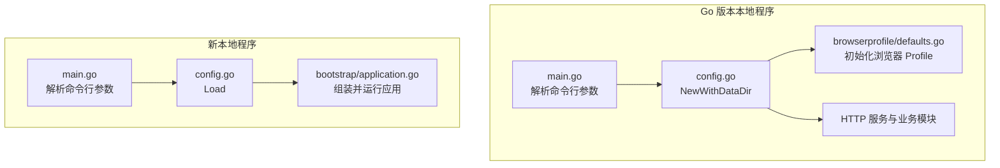
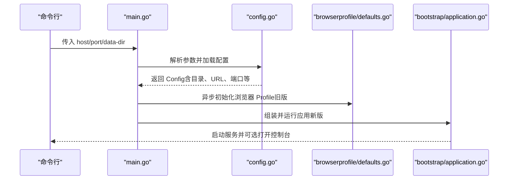
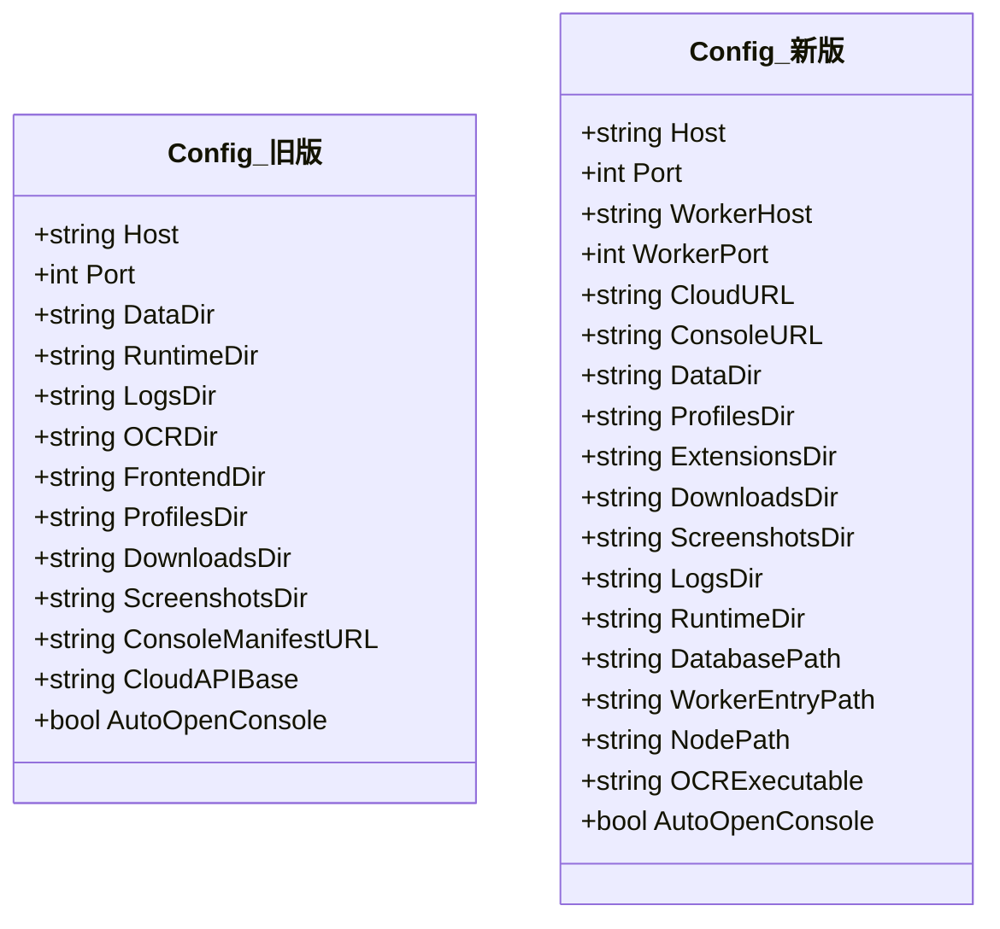
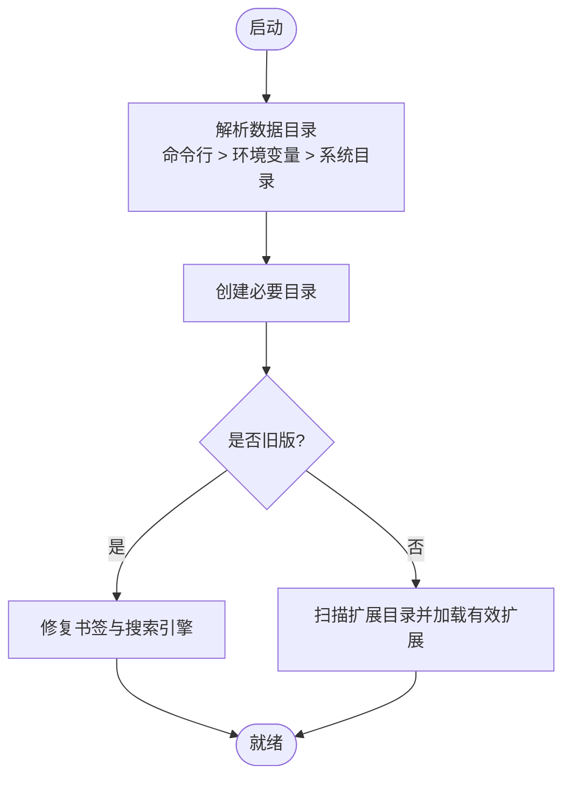
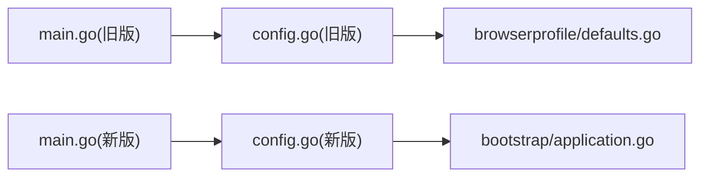

# 配置管理

<cite>
**本文引用的文件**
- [local-agent-go/internal/config/config.go](file://goodhr5/local-agent-go/internal/config/config.go)
- [local-agent-go/cmd/goodhr-local-agent/main.go](file://goodhr5/local-agent-go/cmd/goodhr-local-agent/main.go)
- [local-agent-go/internal/browserprofile/defaults.go](file://goodhr5/local-agent-go/internal/browserprofile/defaults.go)
- [local-agent-go/internal/config/config.go](file://goodhr5/local-agent-go/internal/config/config.go)
- [local-agent-go/cmd/goodhr-local-agent/main.go](file://goodhr5/local-agent-go/cmd/goodhr-local-agent/main.go)
- [local-agent-go/internal/bootstrap/application.go](file://goodhr5/local-agent-go/internal/bootstrap/application.go)
- [local-agent-go/internal/config/config_test.go](file://goodhr5/local-agent-go/internal/config/config_test.go)
</cite>

## 目录
1. [简介](#简介)
2. [项目结构](#项目结构)
3. [核心组件](#核心组件)
4. [架构总览](#架构总览)
5. [详细组件分析](#详细组件分析)
6. [依赖关系分析](#依赖关系分析)
7. [性能考虑](#性能考虑)
8. [故障排查指南](#故障排查指南)
9. [结论](#结论)
10. [附录](#附录)

## 简介
本文件聚焦本地执行器的配置管理，覆盖两套实现：
- Go 版本本地程序（local-agent-go）：面向历史与兼容场景，提供基础数据目录、浏览器 Profile 初始化、日志输出等。
- 新本地程序（local-agent-go）：面向未来演进，提供更完善的配置项、扩展加载、运行时路径解析、健康检查与进程复用机制。

重点说明：
- Config 结构体设计、配置项定义与默认值来源。
- 配置文件格式与环境变量优先级。
- 命令行参数覆盖机制。
- 数据目录结构与浏览器配置文件管理。
- 日志配置选项。
- 配置验证规则、热重载机制与配置迁移方案。
- 不同环境下的配置策略与开发/生产差异。

## 项目结构
本地执行器配置相关代码主要分布在两个子项目中：
- local-agent-go：旧版 Go 本地程序，配置入口在 main 中解析参数并调用 config.NewWithDataDir，随后初始化浏览器默认配置与 HTTP 服务。
- local-agent-go：新版 Go 本地程序，配置入口在 main 中解析参数后调用 config.Load，并通过 bootstrap 组装应用、启动服务与资源清理。

**图表来源**
- [local-agent-go/cmd/goodhr-local-agent/main.go:18-62](file://goodhr5/local-agent-go/cmd/goodhr-local-agent/main.go#L18-L62)
- [local-agent-go/internal/config/config.go:43-88](file://goodhr5/local-agent-go/internal/config/config.go#L43-L88)
- [local-agent-go/internal/browserprofile/defaults.go:56-82](file://goodhr5/local-agent-go/internal/browserprofile/defaults.go#L56-L82)
- [local-agent-go/cmd/goodhr-local-agent/main.go:21-63](file://goodhr5/local-agent-go/cmd/goodhr-local-agent/main.go#L21-L63)
- [local-agent-go/internal/config/config.go:52-90](file://goodhr5/local-agent-go/internal/config/config.go#L52-L90)
- [local-agent-go/internal/bootstrap/application.go:48-109](file://goodhr5/local-agent-go/internal/bootstrap/application.go#L48-L109)

**章节来源**
- [local-agent-go/cmd/goodhr-local-agent/main.go:18-62](file://goodhr5/local-agent-go/cmd/goodhr-local-agent/main.go#L18-L62)
- [local-agent-go/internal/config/config.go:43-88](file://goodhr5/local-agent-go/internal/config/config.go#L43-L88)
- [local-agent-go/cmd/goodhr-local-agent/main.go:21-63](file://goodhr5/local-agent-go/cmd/goodhr-local-agent/main.go#L21-L63)
- [local-agent-go/internal/config/config.go:52-90](file://goodhr5/local-agent-go/internal/config/config.go#L52-L90)
- [local-agent-go/internal/bootstrap/application.go:48-109](file://goodhr5/local-agent-go/internal/bootstrap/application.go#L48-L109)

## 核心组件
- 配置结构体与默认值
  - 旧版 Config：包含监听地址、端口、数据目录、运行时目录、日志目录、OCR 目录、前端目录、浏览器 Profiles 目录、下载目录、截图目录、控制台清单 URL、云端 API Base、是否自动打开控制台等。
  - 新版 Config：在旧版基础上增加 Worker 主机与端口、云端与前端 URL、扩展目录、数据库路径、Worker 入口、Node 可执行路径、OCR 可执行路径等。
- 配置加载与目录创建
  - 旧版通过 NewWithDataDir 解析 host/port/data-dir，读取环境变量 GOODHR_DATA_DIR，计算默认数据目录，并创建必要目录。
  - 新版通过 Load 解析 host/port/data-dir，读取多个环境变量（如 GOODHR_WORKER_PORT、GOODHR_CLOUD_API_BASE、GOODHR_CONSOLE_URL、GOODHR_AUTO_OPEN_CONSOLE、GOODHR_OCR_EXECUTABLE、GOODHR_NODE_PATH、GOODHR_WORKER_ENTRY），并创建必要目录。
- 浏览器 Profile 初始化
  - 旧版在启动时异步确保浏览器默认书签与搜索引擎为必应，写入 Chromium 的 Bookmarks、Preferences、Secure Preferences 及 Web Data。
- 日志与文件输出
  - 旧版将标准日志输出到文件与 stderr（Windows 仅文件），日志路径位于 data_dir/runtime/logs/local-agent.log。
  - 新版将标准日志输出到 stderr，并在健康检查接口暴露日志路径等信息。

**章节来源**
- [local-agent-go/internal/config/config.go:26-88](file://goodhr5/local-agent-go/internal/config/config.go#L26-L88)
- [local-agent-go/internal/config/config.go:30-90](file://goodhr5/local-agent-go/internal/config/config.go#L30-L90)
- [local-agent-go/internal/browserprofile/defaults.go:56-123](file://goodhr5/local-agent-go/internal/browserprofile/defaults.go#L56-L123)
- [local-agent-go/cmd/goodhr-local-agent/main.go:64-86](file://goodhr5/local-agent-go/cmd/goodhr-local-agent/main.go#L64-L86)

## 架构总览
本地执行器配置管理的整体流程如下：
- 命令行参数优先：host、port、data-dir 由 flag 解析。
- 环境变量覆盖：GOODHR_* 系列环境变量用于覆盖默认值或指定外部资源路径。
- 默认值兜底：当未设置参数或环境变量时，使用内置默认值与系统目录。
- 目录创建与校验：确保数据目录、运行时目录、日志目录、Profiles 目录等存在且有效。
- 浏览器配置初始化：旧版在启动时异步修复书签与搜索引擎；新版通过扩展目录加载受支持的扩展。
- 应用启动与健康检查：新版支持检测已有实例并复用，暴露 /health 接口返回配置与状态。

**图表来源**
- [local-agent-go/cmd/goodhr-local-agent/main.go:18-62](file://goodhr5/local-agent-go/cmd/goodhr-local-agent/main.go#L18-L62)
- [local-agent-go/internal/config/config.go:43-88](file://goodhr5/local-agent-go/internal/config/config.go#L43-L88)
- [local-agent-go/internal/browserprofile/defaults.go:56-82](file://goodhr5/local-agent-go/internal/browserprofile/defaults.go#L56-L82)
- [local-agent-go/cmd/goodhr-local-agent/main.go:21-63](file://goodhr5/local-agent-go/cmd/goodhr-local-agent/main.go#L21-L63)
- [local-agent-go/internal/config/config.go:52-90](file://goodhr5/local-agent-go/internal/config/config.go#L52-L90)
- [local-agent-go/internal/bootstrap/application.go:48-109](file://goodhr5/local-agent-go/internal/bootstrap/application.go#L48-L109)

## 详细组件分析

### 配置结构体与默认值
- 旧版 Config
  - 字段包括 Host、Port、DataDir、RuntimeDir、LogsDir、OCRDir、FrontendDir、ProfilesDir、DownloadsDir、ScreenshotsDir、ConsoleManifestURL、CloudAPIBase、AutoOpenConsole。
  - 默认值来源于常量与系统目录：DefaultHost、DefaultPort、MaxPort、AppName、DefaultConsoleManifestURL、DefaultCloudAPIBase。
  - 数据目录解析顺序：命令行 data-dir > 环境变量 GOODHR_DATA_DIR > 用户配置目录下的 GoodHR。
  - 下载目录优先使用系统 Downloads，失败则回退到临时目录。
- 新版 Config
  - 字段包括 Host、Port、WorkerHost、WorkerPort、CloudURL、ConsoleURL、DataDir、ProfilesDir、ExtensionsDir、DownloadsDir、ScreenshotsDir、LogsDir、RuntimeDir、DatabasePath、WorkerEntryPath、NodePath、OCRExecutable、AutoOpenConsole。
  - 默认值来源于常量与函数：DefaultHost、DefaultPort、DefaultWorkerPort、DefaultCloudURL、DefaultConsoleURL。
  - 数据目录解析顺序：命令行 data-dir > 环境变量 GOODHR_DATA_DIR > 用户配置目录下的 GoodHR/local-agent-new。
  - Worker 入口与 Node 路径按环境变量、安装目录、源码目录、工作目录依次查找。
  - OCR 可执行路径可通过 GOODHR_OCR_EXECUTABLE 覆盖。

**图表来源**
- [local-agent-go/internal/config/config.go:26-41](file://goodhr5/local-agent-go/internal/config/config.go#L26-L41)
- [local-agent-go/internal/config/config.go:30-50](file://goodhr5/local-agent-go/internal/config/config.go#L30-L50)

**章节来源**
- [local-agent-go/internal/config/config.go:26-88](file://goodhr5/local-agent-go/internal/config/config.go#L26-L88)
- [local-agent-go/internal/config/config.go:30-90](file://goodhr5/local-agent-go/internal/config/config.go#L30-L90)

### 配置项定义与优先级
- 命令行参数
  - 旧版：-host、-port、-data-dir、-open-console、-restart。
  - 新版：-host、-port、-data-dir、-version。
- 环境变量
  - 通用：GOODHR_DATA_DIR、GOODHR_AUTO_OPEN_CONSOLE。
  - 新版专用：GOODHR_WORKER_PORT、GOODHR_CLOUD_API_BASE、GOODHR_CONSOLE_URL、GOODHR_OCR_EXECUTABLE、GOODHR_NODE_PATH、GOODHR_WORKER_ENTRY。
- 默认值
  - 旧版：DefaultHost、DefaultPort、DefaultConsoleManifestURL、DefaultCloudAPIBase。
  - 新版：DefaultHost、DefaultPort、DefaultWorkerPort、DefaultCloudURL、DefaultConsoleURL。

优先级顺序（从高到低）：
1. 命令行参数
2. 环境变量
3. 内置默认值与系统目录

**章节来源**
- [local-agent-go/cmd/goodhr-local-agent/main.go:18-25](file://goodhr5/local-agent-go/cmd/goodhr-local-agent/main.go#L18-L25)
- [local-agent-go/internal/config/config.go:51-83](file://goodhr5/local-agent-go/internal/config/config.go#L51-L83)
- [local-agent-go/cmd/goodhr-local-agent/main.go:21-28](file://goodhr5/local-agent-go/cmd/goodhr-local-agent/main.go#L21-L28)
- [local-agent-go/internal/config/config.go:52-85](file://goodhr5/local-agent-go/internal/config/config.go#L52-L85)

### 数据目录结构与浏览器配置文件管理
- 数据目录
  - 旧版：data_dir、runtime、runtime/logs、runtime/ocr、console、profiles、downloads、screenshots。
  - 新版：data_dir、profiles、extensions、downloads、screenshots、logs、runtime、goodhr-local.db。
- 浏览器配置文件
  - 旧版在 profiles/default/Default 下维护 Bookmarks、Preferences、Secure Preferences、Web Data。
  - 新增招聘平台书签，并确保搜索引擎为必应；对 Secure Preferences 进行 HMAC 重算以通过保护校验。
  - 新版通过 extensions 目录加载受支持的扩展（需包含有效的 manifest.json）。

**图表来源**
- [local-agent-go/internal/config/config.go:99-111](file://goodhr5/local-agent-go/internal/config/config.go#L99-L111)
- [local-agent-go/internal/browserprofile/defaults.go:109-123](file://goodhr5/local-agent-go/internal/browserprofile/defaults.go#L109-L123)
- [local-agent-go/internal/config/config.go:137-190](file://goodhr5/local-agent-go/internal/config/config.go#L137-L190)

**章节来源**
- [local-agent-go/internal/config/config.go:99-111](file://goodhr5/local-agent-go/internal/config/config.go#L99-L111)
- [local-agent-go/internal/browserprofile/defaults.go:109-123](file://goodhr5/local-agent-go/internal/browserprofile/defaults.go#L109-L123)
- [local-agent-go/internal/config/config.go:137-190](file://goodhr5/local-agent-go/internal/config/config.go#L137-L190)

### 日志配置选项
- 旧版
  - 日志目录：data_dir/runtime/logs。
  - 日志文件：local-agent.log。
  - 输出策略：非 Windows 同时输出到 stderr 与文件；Windows 仅输出到文件。
- 新版
  - 日志目录：data_dir/logs。
  - 输出策略：标准日志输出到 stderr；健康检查接口返回日志路径以便定位。

**章节来源**
- [local-agent-go/cmd/goodhr-local-agent/main.go:64-86](file://goodhr5/local-agent-go/cmd/goodhr-local-agent/main.go#L64-L86)
- [local-agent-go/cmd/goodhr-local-agent/main.go:52-54](file://goodhr5/local-agent-go/cmd/goodhr-local-agent/main.go#L52-L54)

### 配置验证规则
- 目录有效性
  - 所有关键目录必须非空且可创建；否则返回错误。
- 端口合法性
  - 端口必须为正整数且在合法范围；非法值回退到默认端口。
- 布尔开关
  - 支持常见真假字符串（true/false/yes/no/on/off/1/0）。
- 扩展有效性
  - 仅加载一级子目录且包含有效 manifest.json（name、version、manifest_version 为 2 或 3）。

**章节来源**
- [local-agent-go/internal/config/config.go:99-111](file://goodhr5/local-agent-go/internal/config/config.go#L99-L111)
- [local-agent-go/internal/config/config.go:137-190](file://goodhr5/local-agent-go/internal/config/config.go#L137-L190)
- [local-agent-go/internal/config/config.go:239-258](file://goodhr5/local-agent-go/internal/config/config.go#L239-L258)

### 热重载机制
- 当前实现未提供运行时热重载配置的能力。
- 建议方案：
  - 引入配置监听器（如文件系统事件或定时轮询）监控配置文件变化。
  - 在安全边界内更新内存中的配置对象，并通知相关组件重新初始化（如 Worker 端口、OCR 路径、扩展目录）。
  - 对于浏览器 Profile 与扩展，建议在重启时生效以避免状态不一致。

[本节为概念性内容，不直接分析具体文件]

### 配置迁移方案
- 从旧版到新版的迁移要点：
  - 数据目录位置变化：旧版使用 ~/Library/Application Support/GoodHR；新版使用 ~/Library/Application Support/GoodHR/local-agent-new。
  - 环境变量映射：
    - GOODHR_DATA_DIR 保持不变。
    - GOODHR_AUTO_OPEN_CONSOLE 保持不变。
    - 新增 GOODHR_WORKER_PORT、GOODHR_CLOUD_API_BASE、GOODHR_CONSOLE_URL、GOODHR_OCR_EXECUTABLE、GOODHR_NODE_PATH、GOODHR_WORKER_ENTRY。
  - 浏览器 Profile：旧版已处理书签与搜索引擎；新版不再直接修改 Chromium 配置，而是通过扩展机制增强能力。
  - 日志目录：旧版 runtime/logs；新版 logs。
- 迁移步骤建议：
  - 备份旧版数据目录。
  - 设置 GOODHR_DATA_DIR 指向新目录或保留旧目录并调整路径。
  - 逐步启用新环境变量并验证功能。
  - 清理过期临时文件（截图、压缩包、旧更新包）。

**章节来源**
- [local-agent-go/internal/config/config.go:122-140](file://goodhr5/local-agent-go/internal/config/config.go#L122-L140)
- [local-agent-go/internal/config/config.go:207-229](file://goodhr5/local-agent-go/internal/config/config.go#L207-L229)
- [local-agent-go/internal/bootstrap/application.go:111-126](file://goodhr5/local-agent-go/internal/bootstrap/application.go#L111-L126)

### 不同环境下的配置策略
- 开发环境
  - 使用默认云端地址 http://127.0.0.1:8084 与前端地址 http://localhost:5173。
  - 可通过环境变量分别覆盖 GOODHR_CLOUD_API_BASE 与 GOODHR_CONSOLE_URL。
  - 测试用例验证两者独立覆盖互不干扰。
- 生产环境
  - 通过构建参数固定云端与前端地址。
  - 使用 GOODHR_DATA_DIR 指定持久化目录。
  - 关闭自动打开控制台以减少交互。
  - 配置 OCR 可执行路径与 Node 路径以确保稳定运行。

**章节来源**
- [local-agent-go/internal/config/config.go:24-28](file://goodhr5/local-agent-go/internal/config/config.go#L24-L28)
- [local-agent-go/internal/config/config_test.go:11-44](file://goodhr5/local-agent-go/internal/config/config_test.go#L11-L44)

## 依赖关系分析
配置模块与其他组件的依赖关系如下：
- main 依赖 config 解析参数与生成配置。
- 旧版 main 依赖 browserprofile 初始化浏览器配置。
- 新版 bootstrap 依赖 config 提供的路径与 URL，并组装运行时管理器、浏览器客户端、存储、流程与 HTTP 服务。

**图表来源**
- [local-agent-go/cmd/goodhr-local-agent/main.go:18-62](file://goodhr5/local-agent-go/cmd/goodhr-local-agent/main.go#L18-L62)
- [local-agent-go/internal/config/config.go:43-88](file://goodhr5/local-agent-go/internal/config/config.go#L43-L88)
- [local-agent-go/internal/browserprofile/defaults.go:56-82](file://goodhr5/local-agent-go/internal/browserprofile/defaults.go#L56-L82)
- [local-agent-go/cmd/goodhr-local-agent/main.go:21-63](file://goodhr5/local-agent-go/cmd/goodhr-local-agent/main.go#L21-L63)
- [local-agent-go/internal/config/config.go:52-90](file://goodhr5/local-agent-go/internal/config/config.go#L52-L90)
- [local-agent-go/internal/bootstrap/application.go:48-109](file://goodhr5/local-agent-go/internal/bootstrap/application.go#L48-L109)

**章节来源**
- [local-agent-go/cmd/goodhr-local-agent/main.go:18-62](file://goodhr5/local-agent-go/cmd/goodhr-local-agent/main.go#L18-L62)
- [local-agent-go/internal/config/config.go:43-88](file://goodhr5/local-agent-go/internal/config/config.go#L43-L88)
- [local-agent-go/internal/browserprofile/defaults.go:56-82](file://goodhr5/local-agent-go/internal/browserprofile/defaults.go#L56-L82)
- [local-agent-go/cmd/goodhr-local-agent/main.go:21-63](file://goodhr5/local-agent-go/cmd/goodhr-local-agent/main.go#L21-L63)
- [local-agent-go/internal/config/config.go:52-90](file://goodhr5/local-agent-go/internal/config/config.go#L52-L90)
- [local-agent-go/internal/bootstrap/application.go:48-109](file://goodhr5/local-agent-go/internal/bootstrap/application.go#L48-L109)

## 性能考虑
- 目录创建与校验应在启动阶段完成，避免运行时阻塞。
- 浏览器 Profile 初始化采用异步方式，减少启动延迟。
- 扩展加载仅扫描一级子目录并校验 manifest，避免深层遍历带来的开销。
- 日志输出在非 Windows 环境下同时写入文件与 stderr，便于调试但需注意 I/O 性能。

[本节为一般性指导，不直接分析具体文件]

## 故障排查指南
- 目录无效
  - 现象：启动时报“本地目录为空”或“创建目录失败”。
  - 排查：检查 data-dir 是否为空或不可写；确认权限与磁盘空间。
- 端口冲突
  - 现象：无法绑定端口或检测到已有实例。
  - 排查：使用 -restart 参数清理旧实例；检查端口占用情况。
- 浏览器配置异常
  - 现象：书签未更新或搜索引擎未设置为必应。
  - 排查：查看日志中浏览器 Profile 初始化错误；确认 Profiles 目录存在且可写。
- 扩展加载失败
  - 现象：扩展未生效。
  - 排查：检查 extensions 目录下是否存在有效的 manifest.json；确保 name、version、manifest_version 正确。
- 环境变量覆盖无效
  - 现象：云端或前端地址未按预期覆盖。
  - 排查：确认环境变量名与大小写；参考测试用例验证覆盖逻辑。

**章节来源**
- [local-agent-go/internal/config/config.go:99-111](file://goodhr5/local-agent-go/internal/config/config.go#L99-L111)
- [local-agent-go/cmd/goodhr-local-agent/main.go:28-37](file://goodhr5/local-agent-go/cmd/goodhr-local-agent/main.go#L28-L37)
- [local-agent-go/internal/browserprofile/defaults.go:56-82](file://goodhr5/local-agent-go/internal/browserprofile/defaults.go#L56-L82)
- [local-agent-go/internal/config/config.go:137-190](file://goodhr5/local-agent-go/internal/config/config.go#L137-L190)
- [local-agent-go/internal/config/config_test.go:11-44](file://goodhr5/local-agent-go/internal/config/config_test.go#L11-L44)

## 结论
本地执行器配置管理通过命令行参数、环境变量与默认值的组合，提供了灵活且可靠的配置机制。旧版侧重浏览器 Profile 的自动化初始化，新版增强了扩展加载、运行时路径解析与健康检查能力。建议在生产环境中明确数据目录、关闭自动打开控制台，并通过环境变量精确控制云端与前端地址。对于热重载与配置迁移，可按建议方案逐步实施，确保稳定性与可维护性。

[本节为总结性内容，不直接分析具体文件]

## 附录
- 常用环境变量
  - GOODHR_DATA_DIR：指定数据目录。
  - GOODHR_AUTO_OPEN_CONSOLE：是否自动打开控制台。
  - GOODHR_WORKER_PORT：Worker 端口。
  - GOODHR_CLOUD_API_BASE：云端 API 地址。
  - GOODHR_CONSOLE_URL：前端控制台地址。
  - GOODHR_OCR_EXECUTABLE：OCR 可执行路径。
  - GOODHR_NODE_PATH：Node 可执行路径。
  - GOODHR_WORKER_ENTRY：Worker 入口路径。
- 常用命令行参数
  - -host：监听地址。
  - -port：监听端口。
  - -data-dir：数据目录。
  - -restart：启动前关闭旧实例（旧版）。
  - -version：版本号（新版）。

[本节为参考信息，不直接分析具体文件]