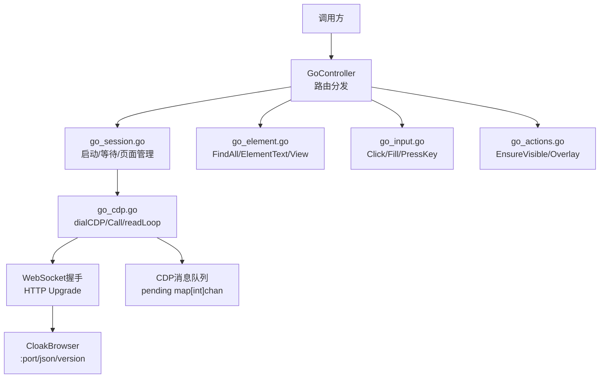
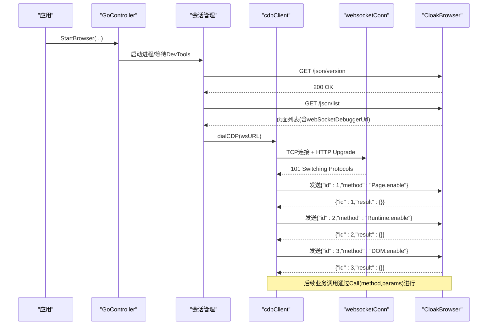
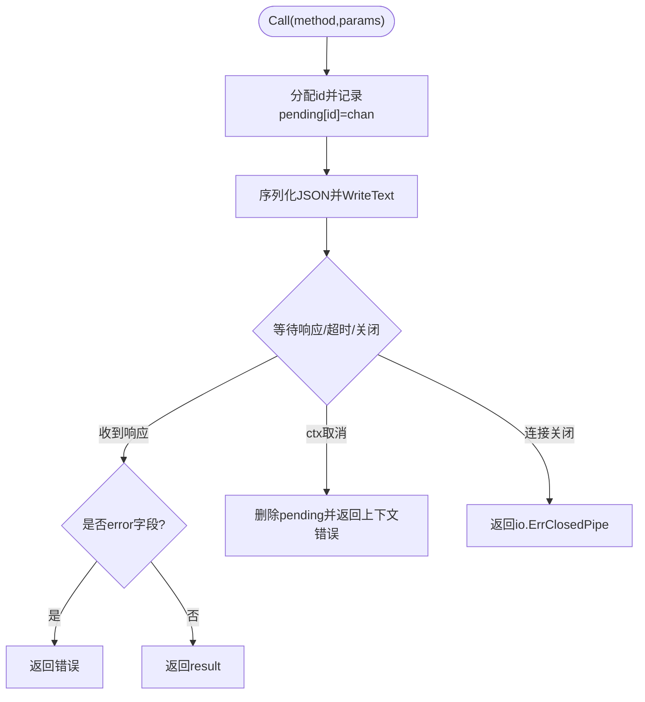
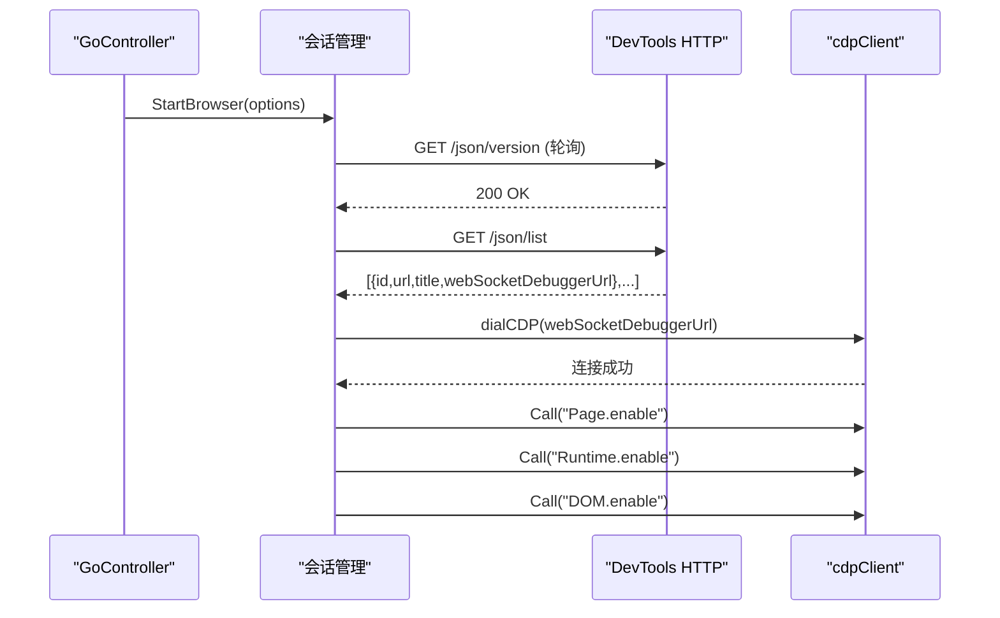
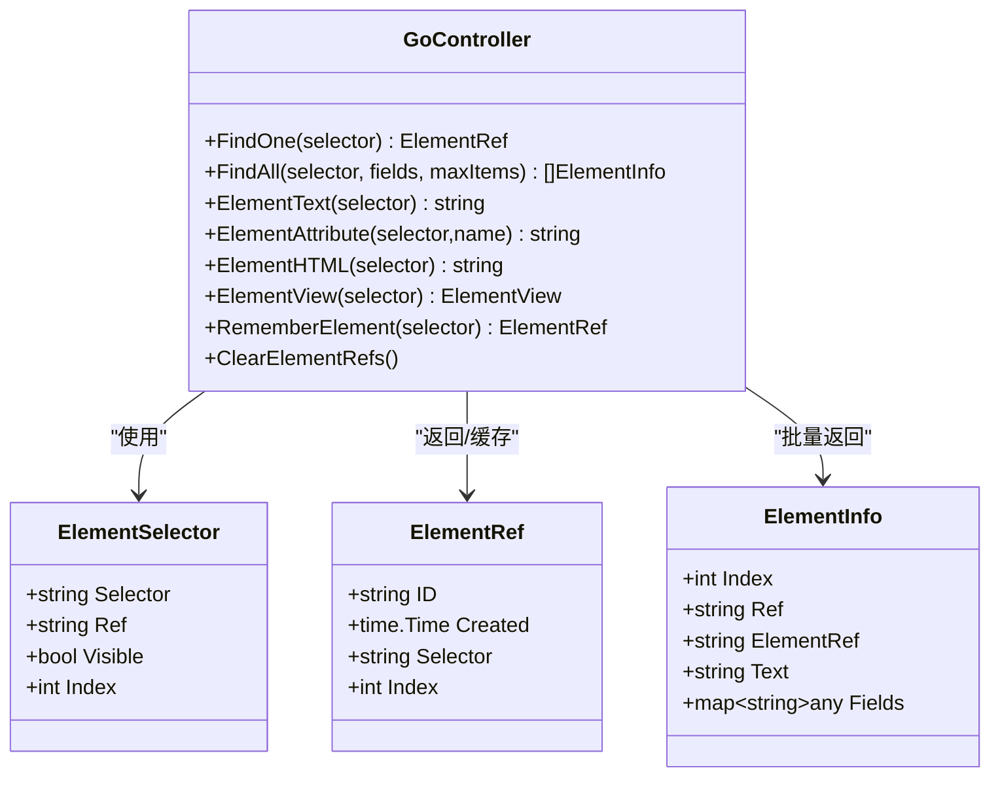
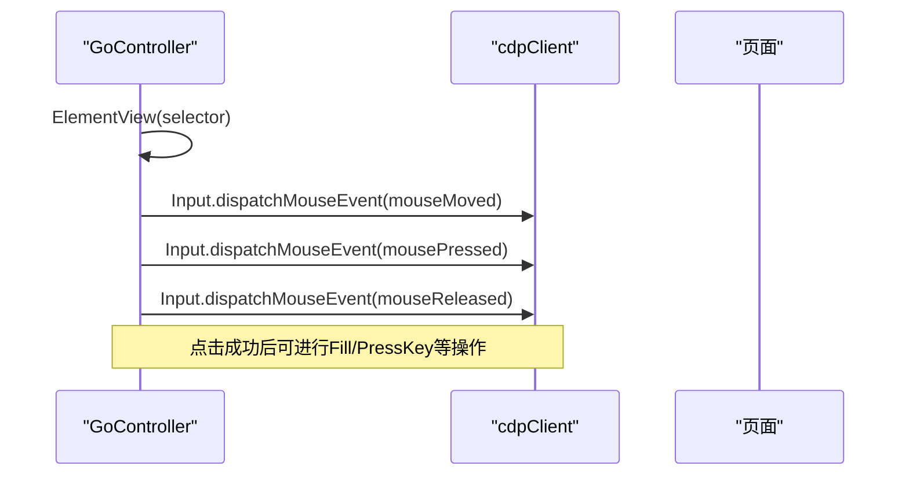
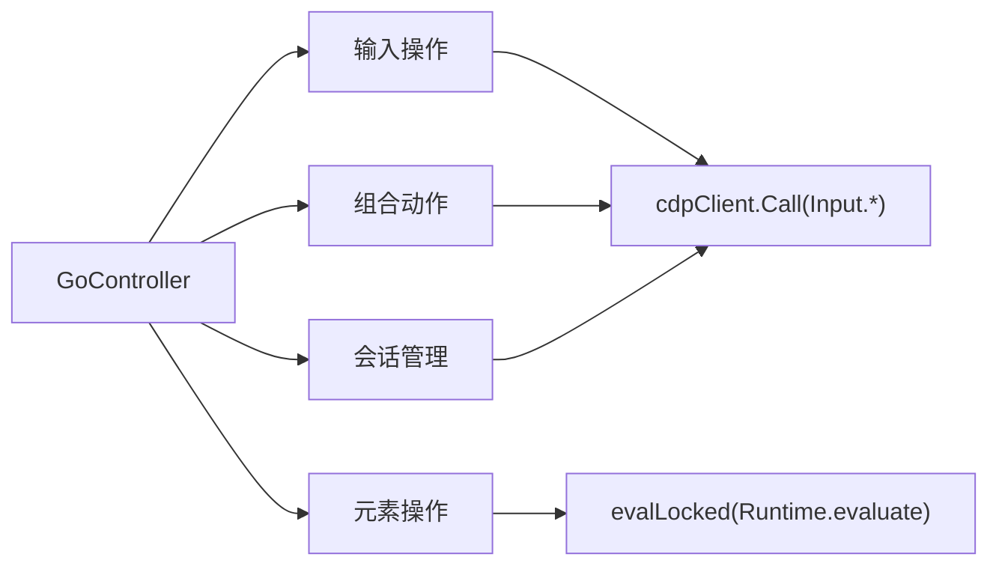

# CDP协议通信

<cite>
**本文引用的文件**
- [go_cdp.go](file://goodhr5/local-agent-go/internal/browser/go_cdp.go)
- [go_session.go](file://goodhr5/local-agent-go/internal/browser/go_session.go)
- [go_controller.go](file://goodhr5/local-agent-go/internal/browser/go_controller.go)
- [go_element.go](file://goodhr5/local-agent-go/internal/browser/go_element.go)
- [go_input.go](file://goodhr5/local-agent-go/internal/browser/go_input.go)
- [go_actions.go](file://goodhr5/local-agent-go/internal/browser/go_actions.go)
- [go_helpers.go](file://goodhr5/local-agent-go/internal/browser/go_helpers.go)
</cite>

## 目录
1. [简介](#简介)
2. [项目结构](#项目结构)
3. [核心组件](#核心组件)
4. [架构总览](#架构总览)
5. [详细组件分析](#详细组件分析)
6. [依赖关系分析](#依赖关系分析)
7. [性能与稳定性](#性能与稳定性)
8. [故障排查指南](#故障排查指南)
9. [结论](#结论)
10. [附录：Runtime.evaluate使用示例](#附录runtimeevaluate使用示例)

## 简介
本文件面向Chrome DevTools Protocol（CDP）在本地Agent中的实现，重点说明：
- WebSocket连接建立过程与握手细节
- CDP消息格式规范、请求-响应机制
- CDP客户端实现要点：连接管理、消息队列、错误处理
- Runtime.evaluate等核心方法的使用方式与返回值/异常处理
- 调试技巧、性能优化建议与连接稳定性保障方案

该实现以Go语言编写，直接通过WebSocket与CloakBrowser（基于Chromium的浏览器）的调试端口通信，封装了页面控制、元素操作、输入事件、截图、Cookie管理等能力。

## 项目结构
与本主题相关的代码集中在 local-agent-go/internal/browser 包中，按职责拆分：
- go_cdp.go：CDP客户端、WebSocket底层读写、消息收发与队列
- go_session.go：浏览器进程启动、DevTools HTTP接口发现目标、创建/切换页面、等待就绪
- go_controller.go：对外暴露的控制器API与路由分发
- go_element.go：元素查找、引用缓存、DOM读取、视口信息
- go_input.go：鼠标点击、键盘输入、滚动等交互
- go_actions.go：组合动作（如确保可见、平台相关操作）
- go_helpers.go：通用工具函数（类型转换、JS字符串转义等）

**图表来源**
- [go_controller.go:259-335](file://goodhr5/local-agent-go/internal/browser/go_controller.go#L259-L335)
- [go_session.go:18-103](file://goodhr5/local-agent-go/internal/browser/go_session.go#L18-L103)
- [go_cdp.go:48-146](file://goodhr5/local-agent-go/internal/browser/go_cdp.go#L48-L146)

**章节来源**
- [go_controller.go:15-122](file://goodhr5/local-agent-go/internal/browser/go_controller.go#L15-L122)
- [go_session.go:18-103](file://goodhr5/local-agent-go/internal/browser/go_session.go#L18-L103)
- [go_cdp.go:21-46](file://goodhr5/local-agent-go/internal/browser/go_cdp.go#L21-L46)

## 核心组件
- cdpClient：封装CDP请求-响应、维护pending队列、读循环分发消息、关闭信号
- websocketConn：实现WebSocket帧的发送与接收（文本帧、控制帧、掩码）
- GoController：统一入口，负责浏览器生命周期、页面切换、命令路由
- goPage：表示一个CDP目标页面，持有WebSocketDebuggerURL和cdpClient
- 元素与交互模块：提供元素定位、视图信息、输入事件、截图等高层能力

**章节来源**
- [go_cdp.go:21-46](file://goodhr5/local-agent-go/internal/browser/go_cdp.go#L21-L46)
- [go_controller.go:109-122](file://goodhr5/local-agent-go/internal/browser/go_controller.go#L109-L122)
- [go_session.go:229-235](file://goodhr5/local-agent-go/internal/browser/go_session.go#L229-L235)

## 架构总览
整体流程：
1. 启动浏览器进程并启用远程调试端口
2. 轮询/devtools HTTP接口获取版本与页面列表
3. 为页面建立CDP WebSocket连接
4. 启用必要Domain（Page/Runtime/DOM）
5. 通过cdpClient.Call发送CDP方法，等待对应id的响应
6. readLoop持续解析消息，将响应投递到pending队列
7. 上层封装元素操作、输入事件、截图等业务能力

**图表来源**
- [go_session.go:18-103](file://goodhr5/local-agent-go/internal/browser/go_session.go#L18-L103)
- [go_cdp.go:106-146](file://goodhr5/local-agent-go/internal/browser/go_cdp.go#L106-L146)
- [go_cdp.go:148-195](file://goodhr5/local-agent-go/internal/browser/go_cdp.go#L148-L195)

## 详细组件分析

### CDP客户端与WebSocket通信
- 连接建立：dialWebSocket通过TCP连接并构造HTTP Upgrade请求，校验101状态码后进入文本帧收发
- 消息格式：每条CDP消息为JSON对象，包含id、method、params；响应包含id、result或error
- 请求-响应：Call生成唯一id，写入pending[id]=chan，阻塞等待readLoop投递响应
- 读循环：readLoop不断ReadText，解析JSON，若msg.ID!=0则投递至对应channel
- 关闭与清理：Close触发closed通道，readLoop退出时再次close保证幂等；removePending及时释放资源

**图表来源**
- [go_cdp.go:48-81](file://goodhr5/local-agent-go/internal/browser/go_cdp.go#L48-L81)
- [go_cdp.go:127-146](file://goodhr5/local-agent-go/internal/browser/go_cdp.go#L127-L146)

**章节来源**
- [go_cdp.go:48-81](file://goodhr5/local-agent-go/internal/browser/go_cdp.go#L48-L81)
- [go_cdp.go:106-146](file://goodhr5/local-agent-go/internal/browser/go_cdp.go#L106-L146)
- [go_cdp.go:148-195](file://goodhr5/local-agent-go/internal/browser/go_cdp.go#L148-L195)
- [go_cdp.go:197-289](file://goodhr5/local-agent-go/internal/browser/go_cdp.go#L197-L289)

### 浏览器会话与页面管理
- 启动浏览器：StartBrowser根据配置启动CloakBrowser，启用远程调试端口，等待/devtools可用
- 发现页面：listPages通过GET /json/list获取目标，过滤出有WebSocketDebuggerURL的页面
- 建立CDP：createOrFirstPage选择首个页面或新建about:blank页面，dialCDP建立连接
- 启用Domain：初始化时调用Page.enable、Runtime.enable、DOM.enable
- 切换页面：UsePage可切换当前页并重建CDP连接，清空元素引用缓存

**图表来源**
- [go_session.go:18-103](file://goodhr5/local-agent-go/internal/browser/go_session.go#L18-L103)
- [go_session.go:310-373](file://goodhr5/local-agent-go/internal/browser/go_session.go#L310-L373)

**章节来源**
- [go_session.go:18-103](file://goodhr5/local-agent-go/internal/browser/go_session.go#L18-L103)
- [go_session.go:150-177](file://goodhr5/local-agent-go/internal/browser/go_session.go#L150-L177)
- [go_session.go:310-373](file://goodhr5/local-agent-go/internal/browser/go_session.go#L310-L373)

### 元素定位与视图信息
- FindAll：注入JS查询DOM，支持visible过滤、字段提取、限制数量，并缓存ElementRef
- ElementText/Attribute/HTML：通过elementExprLocked构造表达式，调用evalLocked执行并返回结果
- ElementView：计算元素位置、尺寸、可见性、是否在视口内，供点击/滚动决策
- RememberElement/ClearElementRefs：管理元素引用生命周期，避免频繁DOM查询

**图表来源**
- [go_element.go:11-105](file://goodhr5/local-agent-go/internal/browser/go_element.go#L11-L105)
- [go_element.go:141-216](file://goodhr5/local-agent-go/internal/browser/go_element.go#L141-L216)
- [go_element.go:107-139](file://goodhr5/local-agent-go/internal/browser/go_element.go#L107-L139)

**章节来源**
- [go_element.go:11-105](file://goodhr5/local-agent-go/internal/browser/go_element.go#L11-L105)
- [go_element.go:141-216](file://goodhr5/local-agent-go/internal/browser/go_element.go#L141-L216)
- [go_element.go:218-238](file://goodhr5/local-agent-go/internal/browser/go_element.go#L218-L238)

### 输入与交互
- ClickElement：先检查元素可见且在视口内，再派发mouseMoved/mousePressed/mouseReleased
- FillElement：选中并清空后insertText，并通过eval验证输入值
- PressKey：解析跨平台组合键，派发keyDown/keyUp
- Scroll：通过Input.dispatchMouseEvent滚轮事件滚动页面或元素

**图表来源**
- [go_input.go:11-41](file://goodhr5/local-agent-go/internal/browser/go_input.go#L11-L41)
- [go_input.go:43-81](file://goodhr5/local-agent-go/internal/browser/go_input.go#L43-L81)
- [go_input.go:83-114](file://goodhr5/local-agent-go/internal/browser/go_input.go#L83-L114)

**章节来源**
- [go_input.go:11-41](file://goodhr5/local-agent-go/internal/browser/go_input.go#L11-L41)
- [go_input.go:43-81](file://goodhr5/local-agent-go/internal/browser/go_input.go#L43-L81)
- [go_input.go:83-114](file://goodhr5/local-agent-go/internal/browser/go_input.go#L83-L114)

### 组合动作与平台适配
- EnsureElementVisible：循环检测元素视图，必要时滚动直至进入视口
- MarkOverlay：注入JS在页面添加临时标签用于调试
- ExtractPlatformCandidates/Greet等：兼容平台特定流程的简化实现

**章节来源**
- [go_actions.go:10-56](file://goodhr5/local-agent-go/internal/browser/go_actions.go#L10-L56)
- [go_actions.go:82-101](file://goodhr5/local-agent-go/internal/browser/go_actions.go#L82-L101)
- [go_actions.go:103-183](file://goodhr5/local-agent-go/internal/browser/go_actions.go#L103-L183)

## 依赖关系分析
- GoController依赖go_session完成浏览器生命周期与页面管理
- 所有高层操作最终通过cdpClient.Call调用具体CDP Domain方法
- 元素与输入操作依赖evalLocked（Runtime.evaluate）与Input/ DOM/ Page等Domain
- 工具函数集中位于go_helpers，用于参数转换与JS安全注入

**图表来源**
- [go_controller.go:259-335](file://goodhr5/local-agent-go/internal/browser/go_controller.go#L259-L335)
- [go_element.go:218-238](file://goodhr5/local-agent-go/internal/browser/go_element.go#L218-L238)
- [go_input.go:90-114](file://goodhr5/local-agent-go/internal/browser/go_input.go#L90-L114)

**章节来源**
- [go_controller.go:259-335](file://goodhr5/local-agent-go/internal/browser/go_controller.go#L259-L335)
- [go_element.go:218-238](file://goodhr5/local-agent-go/internal/browser/go_element.go#L218-L238)
- [go_input.go:90-114](file://goodhr5/local-agent-go/internal/browser/go_input.go#L90-L114)

## 性能与稳定性
- 连接复用：每个页面维持一个cdpClient，避免重复握手开销
- 消息队列：pending map+channel实现有序响应匹配，避免竞态
- 超时与取消：Call支持context超时，readLoop在连接关闭时快速退出
- 页面就绪：waitReadyLocked轮询document.readyState，减少无效操作
- 元素可见性：EnsureElementVisible减少因不可见导致的点击失败
- 输入校验：FillElement后通过eval验证实际值，提高鲁棒性
- 建议优化：
  - 对高频调用增加重试与退避策略（网络抖动、页面未就绪）
  - 批量操作合并为单次脚本执行，减少往返次数
  - 合理设置超时时间，避免长时间阻塞
  - 监控pending队列大小，防止内存泄漏

[本节为通用指导，不直接分析具体文件]

## 故障排查指南
- WebSocket握手失败：检查/devtools端口是否可达、防火墙、浏览器是否已启动
- 页面为空：确认listPages返回非空且包含WebSocketDebuggerURL
- Runtime.evaluate失败：检查expression语法、awaitPromise设置、exceptionDetails
- 元素不可点击：先调用EnsureElementVisible，再执行点击
- 输入校验失败：检查目标元素是否为input/textarea，或是否需要focus
- 连接断开：检查readLoop是否退出，必要时重建CDP连接

**章节来源**
- [go_cdp.go:148-195](file://goodhr5/local-agent-go/internal/browser/go_cdp.go#L148-L195)
- [go_cdp.go:48-81](file://goodhr5/local-agent-go/internal/browser/go_cdp.go#L48-L81)
- [go_session.go:310-373](file://goodhr5/local-agent-go/internal/browser/go_session.go#L310-L373)
- [go_element.go:184-216](file://goodhr5/local-agent-go/internal/browser/go_element.go#L184-L216)
- [go_input.go:43-81](file://goodhr5/local-agent-go/internal/browser/go_input.go#L43-L81)

## 结论
该实现以轻量级方式实现了CDP通信，具备完整的连接管理、消息队列与错误处理能力。通过高层封装，提供了稳定的页面控制、元素操作与输入能力。结合合理的超时、重试与可见性检查策略，可在复杂页面环境中保持较高的可靠性。建议在大规模自动化场景中引入批量化与监控指标，进一步提升吞吐与可观测性。

[本节为总结，不直接分析具体文件]

## 附录：Runtime.evaluate使用示例
- 基本用法：通过evalLocked调用Runtime.evaluate，设置returnByValue=true与awaitPromise=true，即可在页面上下文中执行JS并返回结果
- 返回值处理：从result.result.value中提取值；若存在exceptionDetails则视为执行失败
- 典型场景：
  - 读取location.href获取当前URL
  - 读取document.readyState判断页面加载状态
  - 执行自定义逻辑并返回结构化数据

**章节来源**
- [go_cdp.go:83-104](file://goodhr5/local-agent-go/internal/browser/go_cdp.go#L83-L104)
- [go_session.go:179-196](file://goodhr5/local-agent-go/internal/browser/go_session.go#L179-L196)
- [go_session.go:291-308](file://goodhr5/local-agent-go/internal/browser/go_session.go#L291-L308)