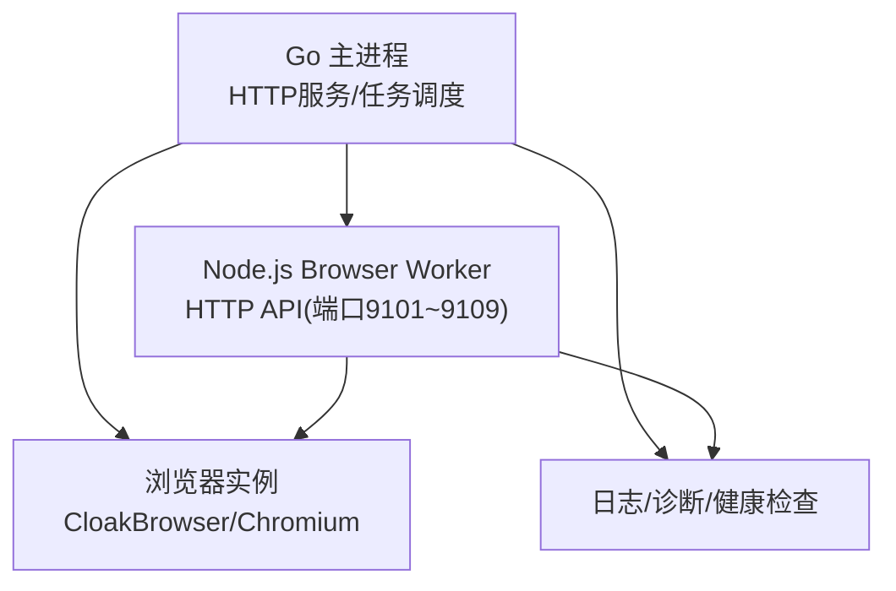
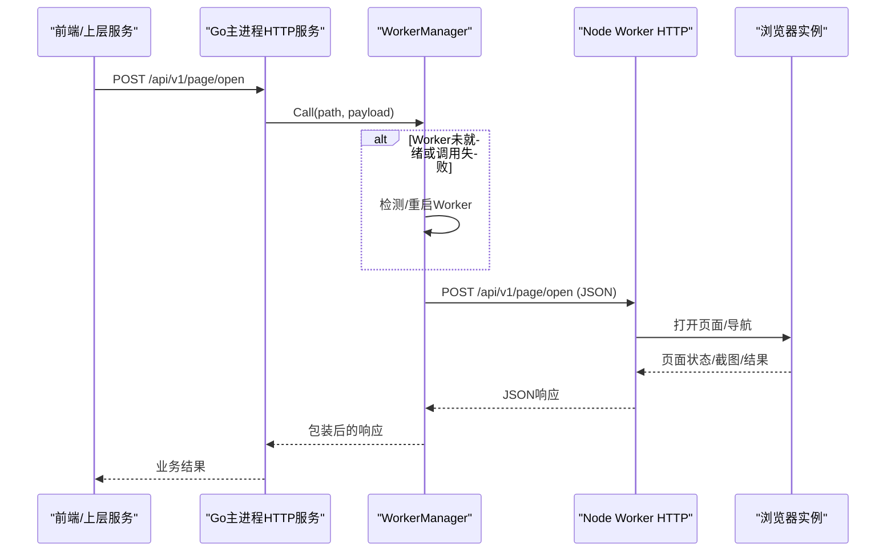
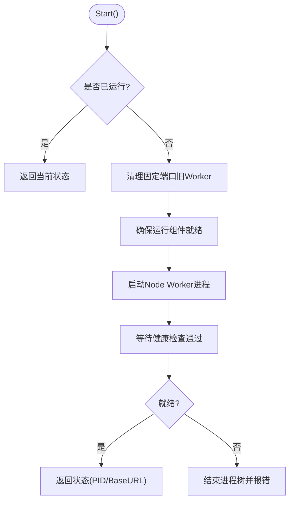
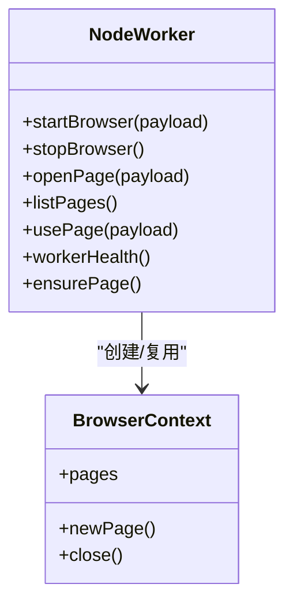
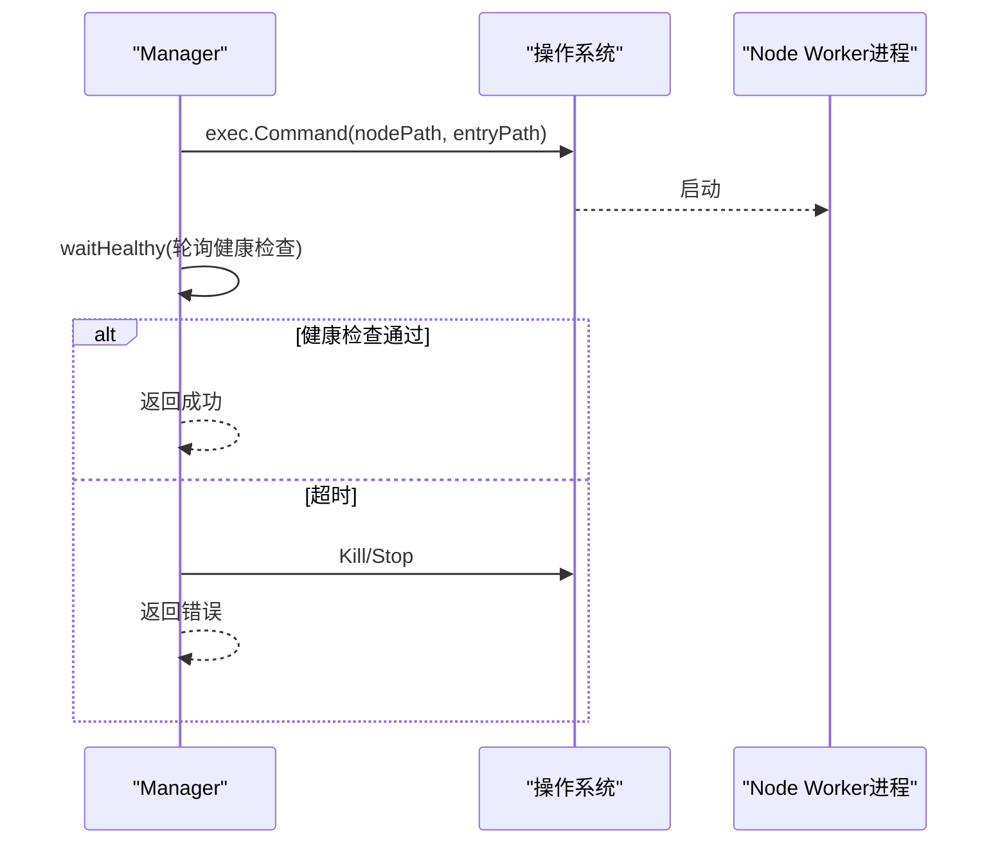
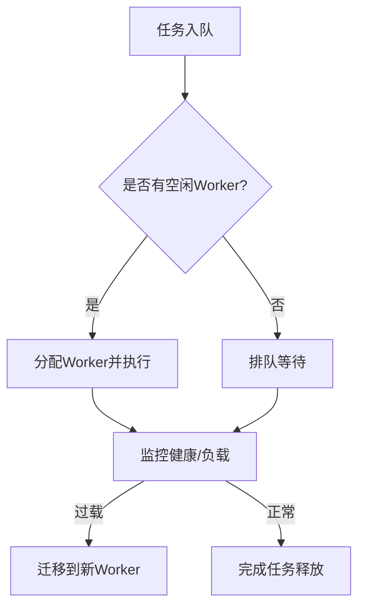
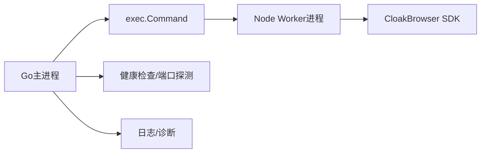

# Worker进程管理

<cite>
**本文引用的文件**
- [worker.go](file://goodhr5/local-agent-go/internal/browser/worker.go)
- [index.js](file://goodhr5/local-agent-go/worker-node/src/index.js)
- [manager.go](file://goodhr5/local-agent-go/internal/browser/process/manager.go)
- [command_windows.go](file://goodhr5/local-agent-go/internal/browser/process/command_windows.go)
- [command_other.go](file://goodhr5/local-agent-go/internal/browser/process/command_other.go)
- [restart_windows.go](file://goodhr5/local-agent-go/internal/process/restart_windows.go)
- [terminate_other.go](file://goodhr5/local-agent-go/internal/process/terminate_other.go)
- [server.go](file://goodhr5/local-agent-go/internal/app/server.go)
- [runner.go](file://goodhr5/local-agent-go/internal/flow/lifecycle/runner.go)
- [diagnostics.go](file://goodhr5/local-agent-go/internal/api/diagnostics.go)
</cite>

## 目录
1. [简介](#简介)
2. [项目结构](#项目结构)
3. [核心组件](#核心组件)
4. [架构总览](#架构总览)
5. [详细组件分析](#详细组件分析)
6. [依赖关系分析](#依赖关系分析)
7. [性能与内存优化](#性能与内存优化)
8. [故障排查指南](#故障排查指南)
9. [结论](#结论)
10. [附录：API与通信约定](#附录api与通信约定)

## 简介
本文件面向GoodHR本地Agent中的Node.js Browser Worker进程管理，系统性说明Worker的作用、启动流程、生命周期管理、进程间通信机制、任务队列与负载均衡策略、跨平台兼容性、进程监控与自动重启、性能调优、内存管理与错误隔离，以及与主进程的协作和数据同步方式。

## 项目结构
GoodHR在本地Agent中采用“Go主进程 + Node.js浏览器Worker”的分离架构：
- Go主进程负责进程管理、HTTP路由、任务编排、日志与健康检查。
- Node.js Worker以独立子进程运行，提供浏览器控制能力（启动/关闭浏览器、打开页面、截图、滚动、下载等）。
- 新版本同时提供TypeScript版Worker进程管理器，用于更细粒度的健康检查与日志聚合。

图表来源
- [worker.go:78-141](file://goodhr5/local-agent-go/internal/browser/worker.go#L78-L141)
- [index.js:6728-6775](file://goodhr5/local-agent-go/worker-node/src/index.js#L6728-L6775)

章节来源
- [worker.go:78-141](file://goodhr5/local-agent-go/internal/browser/worker.go#L78-L141)
- [index.js:6728-6775](file://goodhr5/local-agent-go/worker-node/src/index.js#L6728-L6775)

## 核心组件
- WorkerManager（Go）：负责Node Worker的启动、停止、状态查询、调用转发、自动重启、端口探测与清理。
- Node Worker HTTP服务：暴露健康检查与浏览器操作API，维护浏览器上下文、页面、下载目录等状态。
- 进程管理器（新版TS）：封装子进程生命周期、健康检查、日志行收集与优雅停止。
- 跨平台终止工具：Windows使用taskkill，非Windows使用信号或系统命令结束进程树。
- 任务Runner：将岗位任务分派到具体流程，统一兜住panic并持久化失败状态。

章节来源
- [worker.go:27-65](file://goodhr5/local-agent-go/internal/browser/worker.go#L27-L65)
- [manager.go:20-65](file://goodhr5/local-agent-go/internal/browser/process/manager.go#L20-L65)
- [restart_windows.go:30-50](file://goodhr5/local-agent-go/internal/process/restart_windows.go#L30-L50)
- [terminate_other.go:8-19](file://goodhr5/local-agent-go/internal/process/terminate_other.go#L8-L19)
- [runner.go:80-110](file://goodhr5/local-agent-go/internal/flow/lifecycle/runner.go#L80-L110)

## 架构总览
下图展示从Go主进程到Node Worker再到浏览器的完整调用链，以及健康检查、日志与错误处理路径。

图表来源
- [server.go:945-976](file://goodhr5/local-agent-go/internal/app/server.go#L945-L976)
- [worker.go:254-332](file://goodhr5/local-agent-go/internal/browser/worker.go#L254-L332)
- [index.js:6728-6775](file://goodhr5/local-agent-go/worker-node/src/index.js#L6728-L6775)

## 详细组件分析

### WorkerManager（Go）：启动、生命周期与自动重启
- 启动流程
  - 确保运行组件可用，构造命令行参数与环境变量（Node路径、入口、版本、运行时目录、代理等）。
  - 隐藏控制台窗口（Windows），重定向标准输出到日志文件。
  - 启动子进程，等待健康检查通过（轮询/超时），记录PID与BaseURL。
- 停止流程
  - 先发送中断信号，等待退出；超时则强制结束进程树。
  - 若为附加的旧进程，直接结束其进程树。
- 调用与重试
  - 所有对Worker的调用统一封装，解析JSON响应，4xx/5xx转换为错误。
  - 当检测到“未启动/连接失败”时，自动触发Restart并重试一次原请求。
- 端口与复用
  - 支持固定端口与9101~9109范围扫描，发现已就绪且版本兼容的Worker进行复用。
  - 启动前清理占用固定端口的旧Worker，避免冲突。

图表来源
- [worker.go:78-141](file://goodhr5/local-agent-go/internal/browser/worker.go#L78-L141)
- [worker.go:287-332](file://goodhr5/local-agent-go/internal/browser/worker.go#L287-L332)
- [worker.go:437-518](file://goodhr5/local-agent-go/internal/browser/worker.go#L437-L518)

章节来源
- [worker.go:78-141](file://goodhr5/local-agent-go/internal/browser/worker.go#L78-L141)
- [worker.go:254-332](file://goodhr5/local-agent-go/internal/browser/worker.go#L254-L332)
- [worker.go:437-518](file://goodhr5/local-agent-go/internal/browser/worker.go#L437-L518)

### Node Worker HTTP服务：职责与接口
- 职责
  - 暴露健康检查与浏览器控制API（启动/停止浏览器、打开/切换/关闭页面、列表页、Cookie导出、下载管理等）。
  - 维护浏览器上下文、页面集合、元素引用、下载目录等状态。
  - 输出结构化诊断日志，便于定位滚动、截图、导航等问题。
- 关键行为
  - 启动浏览器时支持持久化上下文与非持久模式，自动清理残留进程与锁文件。
  - 页面复用策略：命中已有标签页则复用，否则新建并导航。
  - 健康检查返回worker类型、版本、PID、浏览器运行状态、下载处理器版本等。

图表来源
- [index.js:383-530](file://goodhr5/local-agent-go/worker-node/src/index.js#L383-L530)
- [index.js:638-741](file://goodhr5/local-agent-go/worker-node/src/index.js#L638-L741)
- [index.js:603-620](file://goodhr5/local-agent-go/worker-node/src/index.js#L603-L620)

章节来源
- [index.js:383-530](file://goodhr5/local-agent-go/worker-node/src/index.js#L383-L530)
- [index.js:638-741](file://goodhr5/local-agent-go/worker-node/src/index.js#L638-L741)
- [index.js:603-620](file://goodhr5/local-agent-go/worker-node/src/index.js#L603-L620)

### 进程管理器（新版TS）：健康检查与日志聚合
- 功能
  - 启动唯一Worker子进程，注入环境变量（端口等），配置日志行接收器。
  - 启动后执行健康检查，超时则终止进程并返回错误。
  - 优雅停止：优先发送中断信号，等待退出；超时则强制Kill。
- 跨平台差异
  - Windows：隐藏控制台窗口，使用taskkill结束进程树。
  - 非Windows：默认子进程设置，发送中断信号。

图表来源
- [manager.go:67-101](file://goodhr5/local-agent-go/internal/browser/process/manager.go#L67-L101)
- [command_windows.go:14-36](file://goodhr5/local-agent-go/internal/browser/process/command_windows.go#L14-L36)
- [command_other.go:11-20](file://goodhr5/local-agent-go/internal/browser/process/command_other.go#L11-L20)

章节来源
- [manager.go:67-101](file://goodhr5/local-agent-go/internal/browser/process/manager.go#L67-L101)
- [command_windows.go:14-36](file://goodhr5/local-agent-go/internal/browser/process/command_windows.go#L14-L36)
- [command_other.go:11-20](file://goodhr5/local-agent-go/internal/browser/process/command_other.go#L11-L20)

### 跨平台兼容性：进程终止与端口清理
- Windows
  - 使用taskkill /T /F结束进程树，隐藏控制台窗口。
  - 通过netstat查找监听端口PID，验证健康信息后安全结束旧实例。
- 非Windows
  - 使用pgrep获取子进程ID递归结束，或直接Kill目标进程。
  - 通过信号优雅停止，必要时强制结束。

章节来源
- [restart_windows.go:30-50](file://goodhr5/local-agent-go/internal/process/restart_windows.go#L30-L50)
- [restart_windows.go:126-142](file://goodhr5/local-agent-go/internal/process/restart_windows.go#L126-L142)
- [terminate_other.go:8-19](file://goodhr5/local-agent-go/internal/process/terminate_other.go#L8-L19)
- [worker.go:202-239](file://goodhr5/local-agent-go/internal/browser/worker.go#L202-L239)

### 任务队列与负载均衡策略
- 任务队列
  - Runner维护active任务集，按TaskID去重，防止并发重复执行。
  - 每个任务有独立的上下文、取消通道与完成通道，统一收尾释放资源。
- 负载均衡
  - 当前实现为单实例Worker，通过端口范围扫描复用已就绪Worker，避免重复启动。
  - 未来可扩展多Worker池+任务分发器，基于负载指标（CPU/内存/页面数）动态分配。

图表来源
- [runner.go:80-110](file://goodhr5/local-agent-go/internal/flow/lifecycle/runner.go#L80-L110)
- [worker.go:618-649](file://goodhr5/local-agent-go/internal/browser/worker.go#L618-L649)

章节来源
- [runner.go:80-110](file://goodhr5/local-agent-go/internal/flow/lifecycle/runner.go#L80-L110)
- [worker.go:618-649](file://goodhr5/local-agent-go/internal/browser/worker.go#L618-L649)

### 进程监控、自动重启与错误隔离
- 监控
  - 健康检查接口返回worker类型、版本、PID、浏览器运行状态等。
  - 主进程定期探测Worker可用性，异常时触发重启。
- 自动重启
  - 调用失败且判定为“未启动/连接失败”时，自动Restart并重试原请求。
  - 启动期退出会附带最近日志摘要，便于定位崩溃原因。
- 错误隔离
  - Node Worker捕获未捕获异常与未处理拒绝，避免影响主进程。
  - Runner统一兜住panic，保存失败状态并释放任务。

章节来源
- [index.js:319-325](file://goodhr5/local-agent-go/worker-node/src/index.js#L319-L325)
- [worker.go:254-332](file://goodhr5/local-agent-go/internal/browser/worker.go#L254-L332)
- [worker.go:658-675](file://goodhr5/local-agent-go/internal/browser/worker.go#L658-L675)
- [runner.go:221-273](file://goodhr5/local-agent-go/internal/flow/lifecycle/runner.go#L221-L273)

### 与主进程的协作模式与数据同步
- 协作模式
  - Go主进程作为HTTP网关，将浏览器相关请求转发至Node Worker。
  - 通过环境变量传递Agent回调地址、版本、运行时目录等信息。
- 数据同步
  - Worker内部维护页面令牌映射，保证页面切换与复用一致性。
  - 下载目录、用户数据目录、代理、时区、语言等通过请求参数与环境变量同步。
  - 诊断字段包含trace_id、position_id、candidate_name等，便于跨日志关联。

章节来源
- [server.go:945-976](file://goodhr5/local-agent-go/internal/app/server.go#L945-L976)
- [worker.go:101-118](file://goodhr5/local-agent-go/internal/browser/worker.go#L101-L118)
- [index.js:638-741](file://goodhr5/local-agent-go/worker-node/src/index.js#L638-L741)

## 依赖关系分析
- Go主进程依赖Node可执行文件与Worker入口脚本，通过exec启动并管理生命周期。
- Node Worker依赖CloakBrowser SDK进行浏览器控制，并通过HTTP与主进程交互。
- 进程管理器依赖操作系统命令（taskkill/pgrep）与信号机制实现跨平台终止。
- Runner依赖存储与Profile管理，确保任务状态与资源释放的一致性。

图表来源
- [worker.go:78-141](file://goodhr5/local-agent-go/internal/browser/worker.go#L78-L141)
- [restart_windows.go:30-50](file://goodhr5/local-agent-go/internal/process/restart_windows.go#L30-L50)
- [index.js:383-530](file://goodhr5/local-agent-go/worker-node/src/index.js#L383-L530)

章节来源
- [worker.go:78-141](file://goodhr5/local-agent-go/internal/browser/worker.go#L78-L141)
- [restart_windows.go:30-50](file://goodhr5/local-agent-go/internal/process/restart_windows.go#L30-L50)
- [index.js:383-530](file://goodhr5/local-agent-go/worker-node/src/index.js#L383-L530)

## 性能与内存优化
- 浏览器上下文复用
  - 同一账号目录复用持久化上下文，减少启动开销。
  - 页面复用策略避免重复导航，降低网络与渲染成本。
- 内存管理
  - 定期读取Node内存快照（RSS、堆使用、外部内存、数组缓冲区）与系统内存，辅助容量规划。
  - 及时关闭浏览器上下文与页面，释放资源。
- 性能调优建议
  - 合理设置超时与重试次数，避免长时间阻塞。
  - 限制并发页面数量，避免过多标签页导致内存膨胀。
  - 使用诊断日志定位滚动失效、视口异常等瓶颈。

章节来源
- [index.js:129-151](file://goodhr5/local-agent-go/worker-node/src/index.js#L129-L151)
- [index.js:545-564](file://goodhr5/local-agent-go/worker-node/src/index.js#L545-L564)
- [index.js:638-741](file://goodhr5/local-agent-go/worker-node/src/index.js#L638-L741)

## 故障排查指南
- 常见症状
  - Worker未启动：检查端口占用、健康检查接口、最近日志摘要。
  - 浏览器无法启动：确认CloakBrowser路径、用户数据目录锁文件、残留进程。
  - 页面滚动/截图失败：查看诊断日志中的滚动阶段、视口检测结果、目标不可见原因。
- 排查步骤
  - 使用健康检查接口确认Worker状态与版本兼容性。
  - 检查端口占用情况，必要时结束旧实例。
  - 查看Worker日志与最近日志摘要，定位崩溃点。
  - 清理浏览器Profile锁文件，重启本地程序。

章节来源
- [worker.go:437-518](file://goodhr5/local-agent-go/internal/browser/worker.go#L437-L518)
- [diagnostics.go:157-191](file://goodhr5/local-agent-go/internal/api/diagnostics.go#L157-L191)
- [worker.go:658-675](file://goodhr5/local-agent-go/internal/browser/worker.go#L658-L675)

## 结论
GoodHR的Worker进程管理通过Go主进程与Node Worker解耦，实现了浏览器控制的稳定与可观测性。通过健康检查、自动重启、跨平台终止、诊断日志与内存快照等手段，保障了高可用性与易维护性。未来可在任务队列与负载均衡方面引入多Worker池与动态调度，进一步提升吞吐与弹性。

## 附录：API与通信约定
- 健康检查
  - GET /health：返回worker类型、版本、PID、浏览器运行状态等。
- 浏览器控制
  - POST /api/v1/browser/start：启动浏览器（支持持久化上下文）。
  - POST /api/v1/browser/stop：停止浏览器。
  - GET /api/v1/browser/status：查询浏览器状态。
- 页面操作
  - POST /api/v1/page/open：打开页面（支持新标签页/复用）。
  - GET /api/v1/page/list：列出页面。
  - POST /api/v1/page/use：切换当前页面。
  - POST /api/v1/page/close：关闭页面。
- Cookie与下载
  - GET /api/v1/page/cookies：导出Cookie。
  - GET /api/v1/downloads：列出下载项。

章节来源
- [index.js:6728-6775](file://goodhr5/local-agent-go/worker-node/src/index.js#L6728-L6775)
- [server.go:288-320](file://goodhr5/local-agent-go/internal/app/server.go#L288-L320)