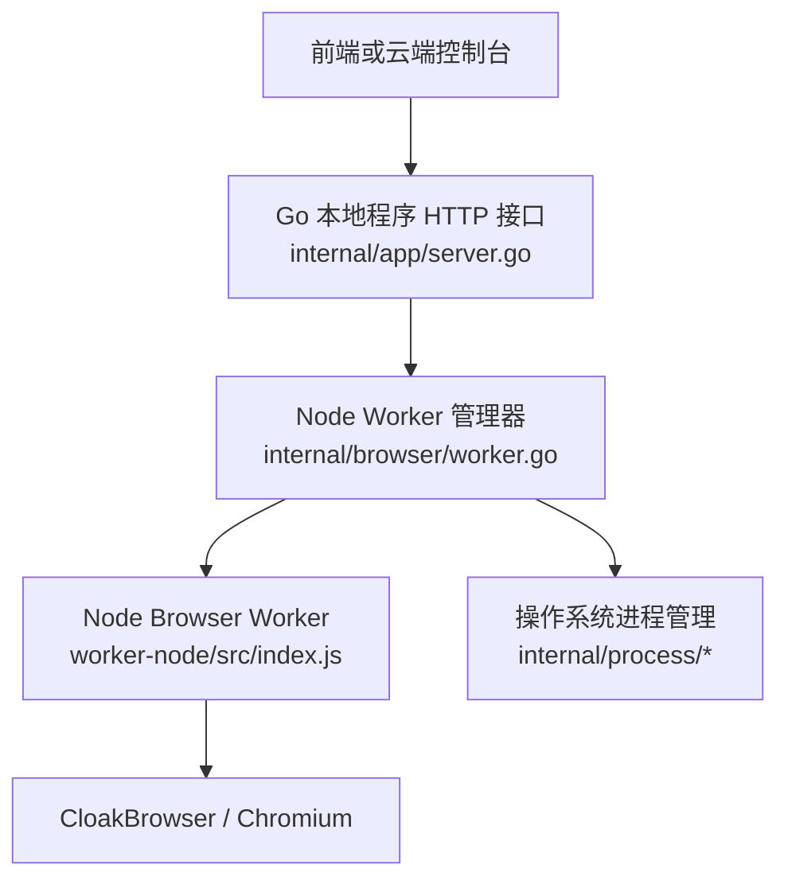
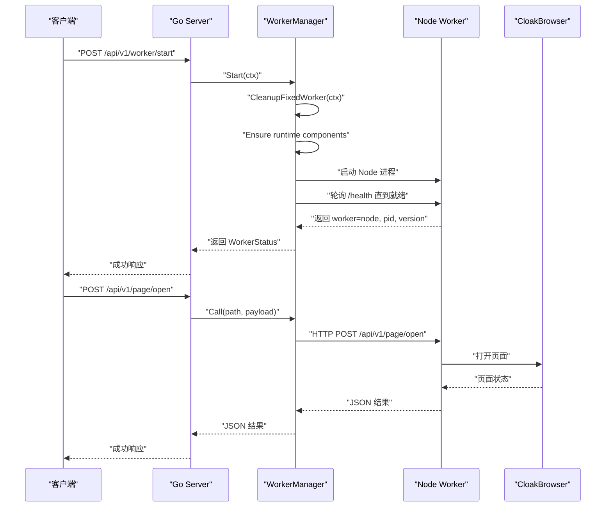
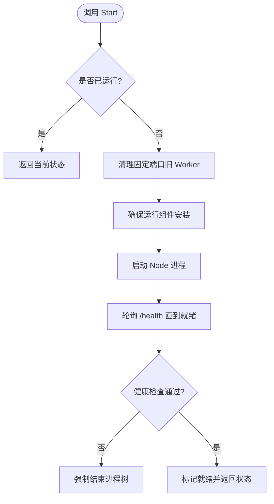
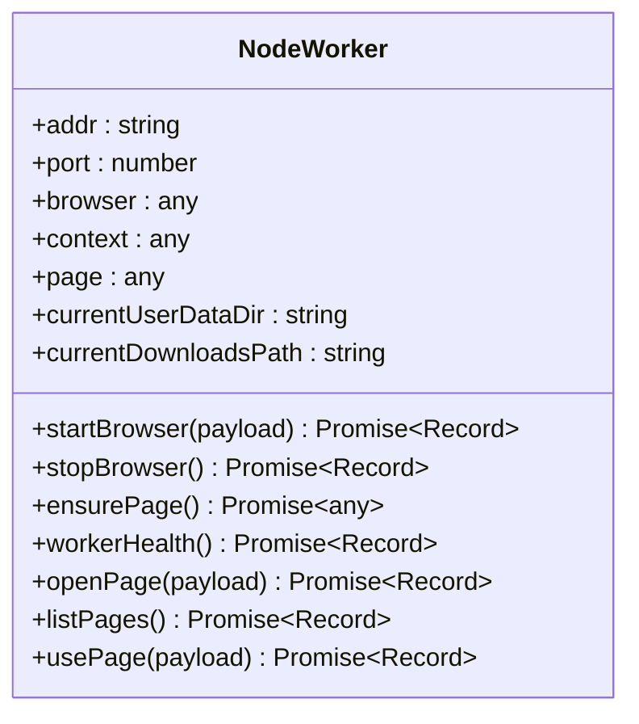
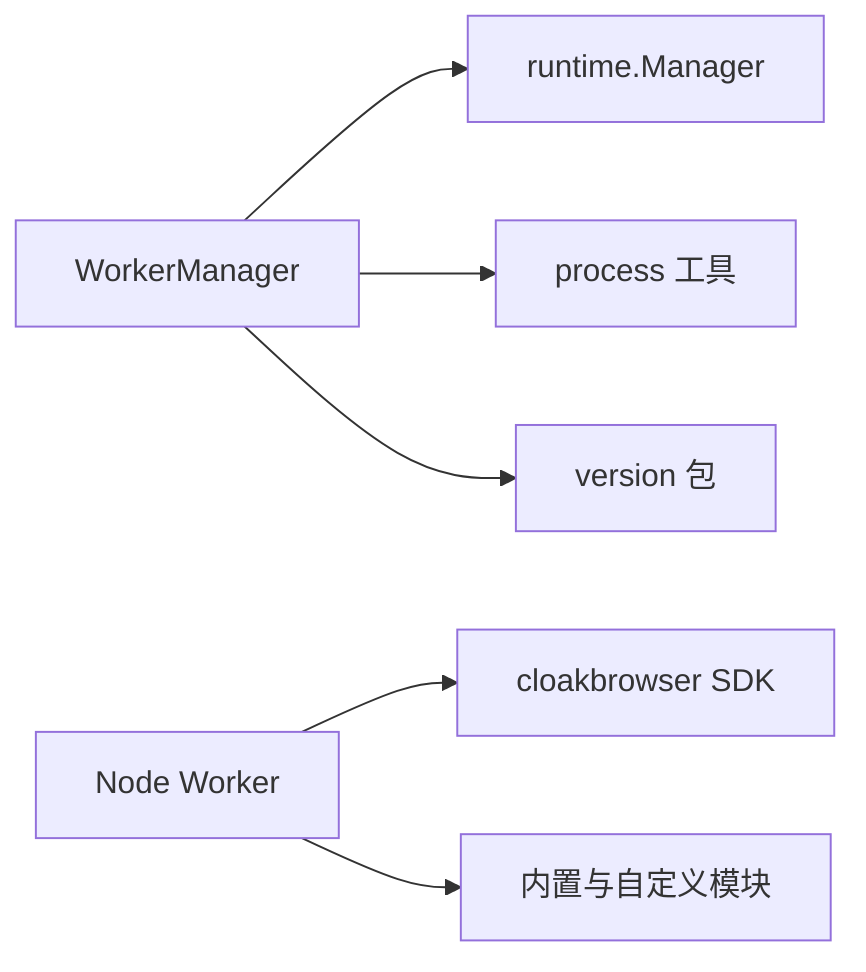
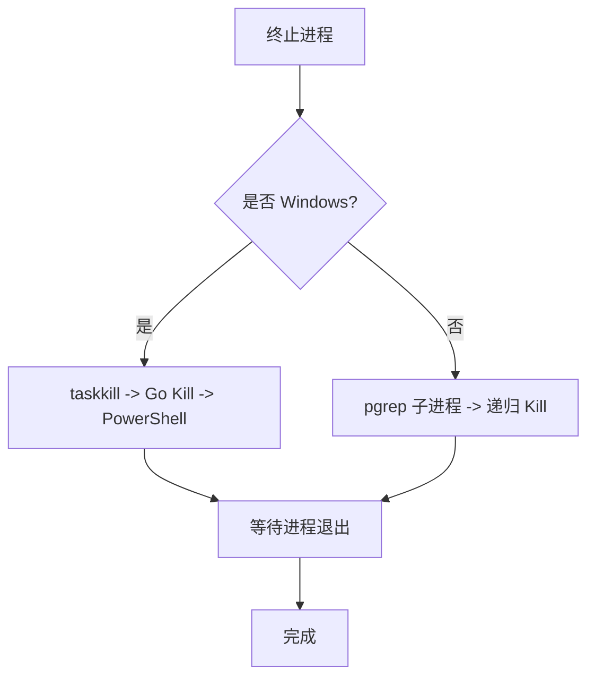

# Worker进程管理

<cite>
**本文引用的文件**   
- [worker.go](file://goodhr5/local-agent-go/internal/browser/worker.go)
- [index.js](file://goodhr5/local-agent-go/worker-node/src/index.js)
- [server.go](file://goodhr5/local-agent-go/internal/app/server.go)
- [restart_windows.go](file://goodhr5/local-agent-go/internal/process/restart_windows.go)
- [terminate_windows.go](file://goodhr5/local-agent-go/internal/process/terminate_windows.go)
- [restart_other.go](file://goodhr5/local-agent-go/internal/process/restart_other.go)
</cite>

## 目录
1. [引言](#引言)
2. [项目结构](#项目结构)
3. [核心组件](#核心组件)
4. [架构总览](#架构总览)
5. [详细组件分析](#详细组件分析)
6. [依赖关系分析](#依赖关系分析)
7. [性能与内存管理](#性能与内存管理)
8. [跨平台兼容性](#跨平台兼容性)
9. [故障排查指南](#故障排查指南)
10. [结论](#结论)

## 引言
本文围绕 HRPlus 本地代理中的 Node.js Worker 进程管理机制展开，重点说明：
- Node.js Worker 的作用：作为浏览器自动化控制子进程，提供稳定的 HTTP API。
- 启动流程：Go 主进程负责发现、清理旧进程、启动 Node 进程、等待就绪并复用已有实例。
- 生命周期管理：健康检查、端口探测、优雅停止、强制终止、进程树清理。
- 进程间通信：基于 HTTP JSON 的调用封装、自动重试与失败重启。
- 任务队列与负载均衡：当前实现为单 Worker 模型；通过端口回退和固定端口策略提升可用性。
- 跨平台兼容：Windows 与非 Windows 的差异处理、进程树结束策略。
- 监控与自动重启：健康接口、版本校验、调用失败时自动重启并重发请求。
- 性能调优与错误隔离：浏览器上下文复用、页面 Token 管理、诊断日志、异常捕获。

## 项目结构
HRPlus 本地代理将“控制面”放在 Go 主进程中，“执行面”放在独立的 Node.js Worker 中。关键路径如下：
- Go 侧 Worker 管理器：`goodhr5/local-agent-go/internal/browser/worker.go`
- Node 侧 Worker HTTP 服务：`goodhr5/local-agent-go/worker-node/src/index.js`
- Go 侧对外暴露的 Worker 控制接口：`goodhr5/local-agent-go/internal/app/server.go`
- 进程管理与跨平台工具：`internal/process/*`

**图表来源**
- [server.go:380-410](file://goodhr5/local-agent-go/internal/app/server.go#L380-L410)
- [worker.go:35-141](file://goodhr5/local-agent-go/internal/browser/worker.go#L35-L141)
- [index.js:51-72](file://goodhr5/local-agent-go/worker-node/src/index.js#L51-L72)

**章节来源**
- [worker.go:1-54](file://goodhr5/local-agent-go/internal/browser/worker.go#L1-L54)
- [index.js:1-72](file://goodhr5/local-agent-go/worker-node/src/index.js#L1-L72)
- [server.go:380-410](file://goodhr5/local-agent-go/internal/app/server.go#L380-L410)

## 核心组件
- **WorkerManager（Go）**：负责 Node Worker 的启动、停止、状态查询、HTTP 调用封装、自动重启、端口清理、日志输出。
- **Node Worker（JavaScript）**：提供 HTTP API，管理 CloakBrowser 会话、页面、下载、Cookie、截图、滚动、点击等浏览器操作。
- **Server（Go）**：对外暴露 Worker 控制接口，如启动、停止、状态查询。
- **Process 工具（Go）**：跨平台进程树结束、端口占用检测、旧进程清理。

**章节来源**
- [worker.go:27-54](file://goodhr5/local-agent-go/internal/browser/worker.go#L27-L54)
- [index.js:51-72](file://goodhr5/local-agent-go/worker-node/src/index.js#L51-L72)
- [server.go:380-410](file://goodhr5/local-agent-go/internal/app/server.go#L380-L410)
- [restart_windows.go:30-50](file://goodhr5/local-agent-go/internal/process/restart_windows.go#L30-L50)

## 架构总览
Go 主进程通过 `WorkerManager` 管理 Node Worker 的生命周期，并通过 HTTP 与 Node Worker 通信。Node Worker 内部维护浏览器上下文和页面，对外暴露 `/health` 及业务路由。

**图表来源**
- [server.go:380-410](file://goodhr5/local-agent-go/internal/app/server.go#L380-L410)
- [worker.go:78-141](file://goodhr5/local-agent-go/internal/browser/worker.go#L78-L141)
- [index.js:6932-6970](file://goodhr5/local-agent-go/worker-node/src/index.js#L6932-L6970)

## 详细组件分析

### Node Worker 管理器（Go）
- **职责**：
  - 启动 Node Worker 进程，设置环境变量，重定向日志。
  - 等待 Worker 就绪，进行版本兼容性校验。
  - 复用已有 Worker 或清理固定端口上的旧进程。
  - 封装 HTTP 调用，支持自动重启与重试。
  - 提供 Status、Stop、Restart 等生命周期方法。
- **关键行为**：
  - `Start`：确保运行组件存在，启动 Node 进程，等待 `/health` 就绪。
  - `Stop`：先发送中断信号，超时后强制结束进程树。
  - `Call`：若调用失败且可重启，则重启并重发原请求。
  - `probeWorkerAt`：健康检查，确认 Worker 类型与版本。
  - `cleanupFixedWorkerLocked`：清理固定端口上的旧 Worker，等待端口释放。
  - `findReadyWorkerLocked`：扫描 9101-9109 端口，复用已就绪 Worker。

**图表来源**
- [worker.go:78-141](file://goodhr5/local-agent-go/internal/browser/worker.go#L78-L141)
- [worker.go:442-489](file://goodhr5/local-agent-go/internal/browser/worker.go#L442-L489)
- [worker.go:594-654](file://goodhr5/local-agent-go/internal/browser/worker.go#L594-L654)

**章节来源**
- [worker.go:78-141](file://goodhr5/local-agent-go/internal/browser/worker.go#L78-L141)
- [worker.go:160-220](file://goodhr5/local-agent-go/internal/browser/worker.go#L160-L220)
- [worker.go:254-337](file://goodhr5/local-agent-go/internal/browser/worker.go#L254-L337)
- [worker.go:442-489](file://goodhr5/local-agent-go/internal/browser/worker.go#L442-L489)
- [worker.go:594-654](file://goodhr5/local-agent-go/internal/browser/worker.go#L594-L654)

### Node Worker（JavaScript）
- **职责**：
  - 提供 HTTP API，包括健康检查、页面操作、Cookie 导出、下载列表等。
  - 管理 CloakBrowser 会话、上下文、页面、元素引用。
  - 记录诊断日志，输出内存、系统资源、页面数量等信息。
  - 处理未捕获异常与未处理 Promise 拒绝。
- **关键行为**：
  - `/health`：返回 worker 类型、版本、PID、浏览器状态、用户数据目录等。
  - `listenWithFallback`：端口回退机制，避免端口占用导致启动失败。
  - `startBrowser`：启动持久化或非持久化浏览器，复用已有上下文。
  - `ensurePage`：确保当前页面存在，必要时创建新页面。
  - `workerHealth`：健康检查逻辑，包含浏览器会话有效性判断。

**图表来源**
- [index.js:51-72](file://goodhr5/local-agent-go/worker-node/src/index.js#L51-L72)
- [index.js:390-532](file://goodhr5/local-agent-go/worker-node/src/index.js#L390-L532)
- [index.js:605-622](file://goodhr5/local-agent-go/worker-node/src/index.js#L605-L622)
- [index.js:640-674](file://goodhr5/local-agent-go/worker-node/src/index.js#L640-L674)

**章节来源**
- [index.js:51-72](file://goodhr5/local-agent-go/worker-node/src/index.js#L51-L72)
- [index.js:390-532](file://goodhr5/local-agent-go/worker-node/src/index.js#L390-L532)
- [index.js:605-622](file://goodhr5/local-agent-go/worker-node/src/index.js#L605-L622)
- [index.js:640-674](file://goodhr5/local-agent-go/worker-node/src/index.js#L640-L674)
- [index.js:6932-6970](file://goodhr5/local-agent-go/worker-node/src/index.js#L6932-L6970)

### Go 对外接口（Server）
- **职责**：
  - 暴露 Worker 控制接口：启动、停止、状态查询。
  - 接收前端或云端控制台请求，转发到 WorkerManager。
- **关键行为**：
  - `handleWorkerStart`：调用 `worker.Start`，返回 WorkerStatus。
  - `handleWorkerStop`：调用 `worker.Stop`，返回最新状态。
  - `handleWorkerStatus`：调用 `worker.Status`，返回运行状态。

**章节来源**
- [server.go:380-410](file://goodhr5/local-agent-go/internal/app/server.go#L380-L410)

## 依赖关系分析
- **WorkerManager 依赖**：
  - `runtime.Manager`：确保 Node、CloakBrowser 等运行组件已安装。
  - `process` 包：跨平台进程树结束、端口占用检测。
  - `version` 包：Worker 版本校验。
- **Node Worker 依赖**：
  - `cloakbrowser`：浏览器 SDK。
  - 内置模块：`fs/promises`、`crypto`、`http`、`os`、`path`、`zlib`。
  - 自定义模块：`browser-display.js`、`candidate-match.js`、`detail-ready.js` 等。

**图表来源**
- [worker.go:22-25](file://goodhr5/local-agent-go/internal/browser/worker.go#L22-L25)
- [index.js:1-18](file://goodhr5/local-agent-go/worker-node/src/index.js#L1-L18)

**章节来源**
- [worker.go:22-25](file://goodhr5/local-agent-go/internal/browser/worker.go#L22-L25)
- [index.js:1-18](file://goodhr5/local-agent-go/worker-node/src/index.js#L1-L18)

## 性能与内存管理
- **浏览器上下文复用**：Node Worker 优先复用已有上下文和页面，减少重复启动开销。
- **页面 Token 管理**：通过 `WeakMap` 和 `pagesByToken` 跟踪页面生命周期，避免悬空引用。
- **诊断日志**：记录 Node 内存、系统内存、浏览器页面数量，便于定位内存泄漏。
- **异常捕获**：监听 `uncaughtException` 和 `unhandledRejection`，防止进程意外退出。
- **端口回退**：Node Worker 在端口占用时自动尝试下一个端口，提升启动成功率。

**章节来源**
- [index.js:131-153](file://goodhr5/local-agent-go/worker-node/src/index.js#L131-L153)
- [index.js:321-327](file://goodhr5/local-agent-go/worker-node/src/index.js#L321-L327)
- [index.js:7045-7065](file://goodhr5/local-agent-go/worker-node/src/index.js#L7045-L7065)

## 跨平台兼容性
- **Windows**：
  - 使用 `taskkill`、Go 原生 `Kill`、PowerShell `Stop-Process` 多级终止进程。
  - 通过 `netstat` 查找端口占用进程，验证是否为旧 HRPlus 实例。
  - 隐藏命令行窗口，避免弹出终端。
- **非 Windows**：
  - 使用 `pgrep` 获取子进程 ID，递归终止进程树。
  - 不处理旧进程清理，由上层逻辑负责。

**图表来源**
- [terminate_windows.go:27-96](file://goodhr5/local-agent-go/internal/process/terminate_windows.go#L27-L96)
- [worker.go:202-239](file://goodhr5/local-agent-go/internal/browser/worker.go#L202-L239)

**章节来源**
- [terminate_windows.go:27-96](file://goodhr5/local-agent-go/internal/process/terminate_windows.go#L27-L96)
- [restart_windows.go:30-50](file://goodhr5/local-agent-go/internal/process/restart_windows.go#L30-L50)
- [restart_other.go:6-16](file://goodhr5/local-agent-go/internal/process/restart_other.go#L6-L16)
- [worker.go:202-239](file://goodhr5/local-agent-go/internal/browser/worker.go#L202-L239)

## 故障排查指南
- **Worker 未启动**：
  - 检查 Go 主进程是否正确调用 `Start`。
  - 查看 `browser-worker.log` 日志末尾摘要。
  - 确认 Node 运行组件和 CloakBrowser 已安装。
- **端口占用**：
  - 使用 `ensureWorkerPortAvailable` 检查端口可用性。
  - 清理固定端口上的旧 Worker，等待端口释放。
- **版本不匹配**：
  - 比较 Go 主程序版本与 Worker 版本，提示重新安装包。
- **浏览器会话失效**：
  - 检查 `hasLiveBrowserSession` 返回值，必要时重启浏览器。
- **调用失败自动重启**：
  - `Call` 方法在检测到“Worker 未启动”或“调用失败”时自动重启并重发请求。

**章节来源**
- [worker.go:339-369](file://goodhr5/local-agent-go/internal/browser/worker.go#L339-L369)
- [worker.go:663-705](file://goodhr5/local-agent-go/internal/browser/worker.go#L663-L705)
- [index.js:605-622](file://goodhr5/local-agent-go/worker-node/src/index.js#L605-L622)

## 结论
HRPlus 的 Node.js Worker 进程管理采用 Go 主进程控制、Node 子进程执行的分离架构。Go 侧负责进程生命周期、端口管理、健康检查和自动重启；Node 侧专注浏览器自动化操作，提供稳定 HTTP API。通过端口回退、版本校验、诊断日志和跨平台进程清理，系统在复杂环境下具备较高鲁棒性。当前实现为单 Worker 模型，适合单机场景；如需多 Worker 负载均衡，可在现有基础上扩展任务分发与进程池管理。