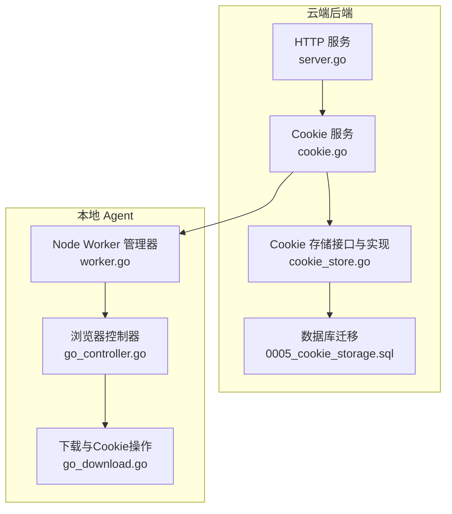
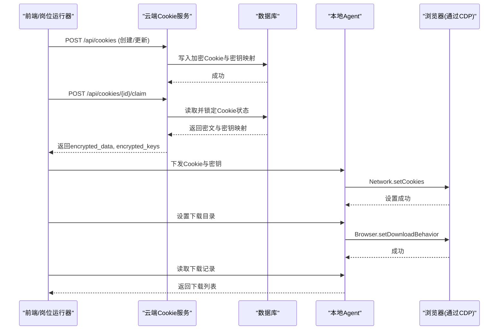
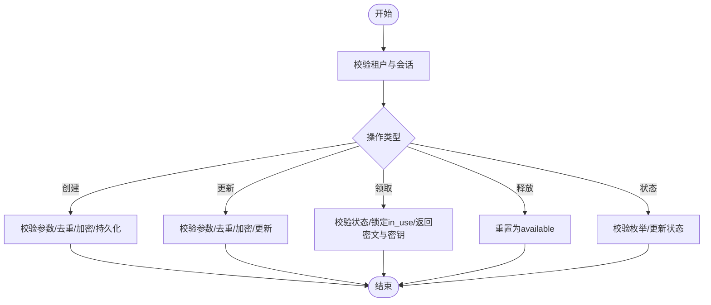
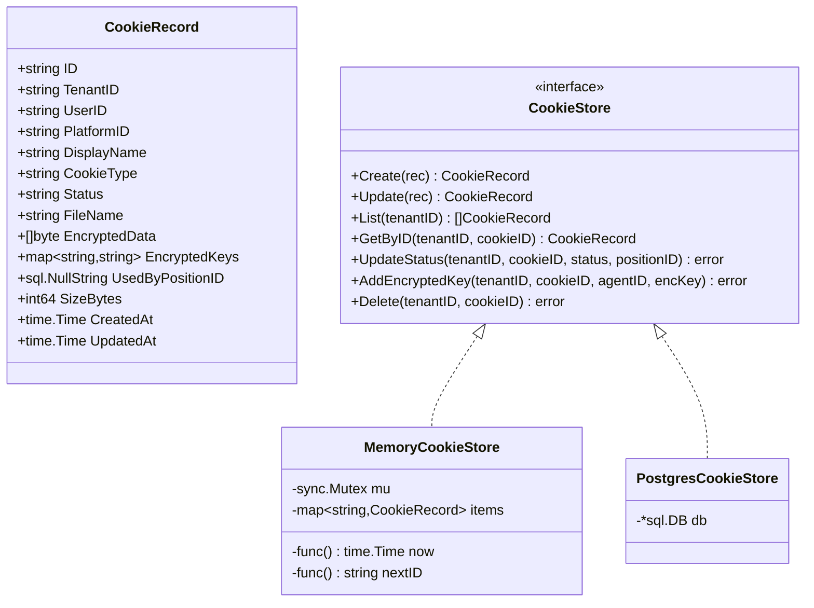
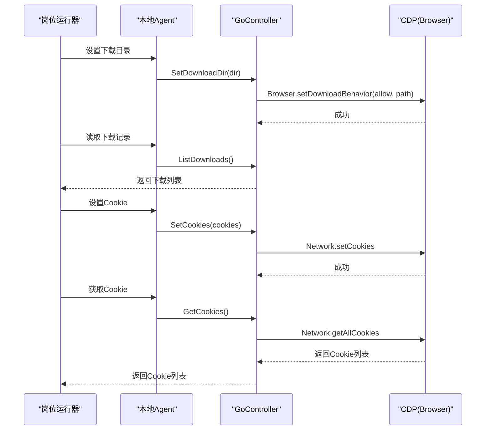
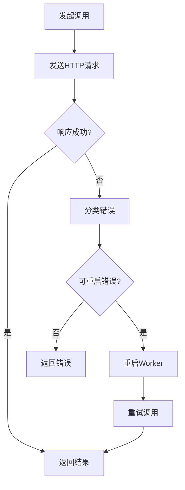
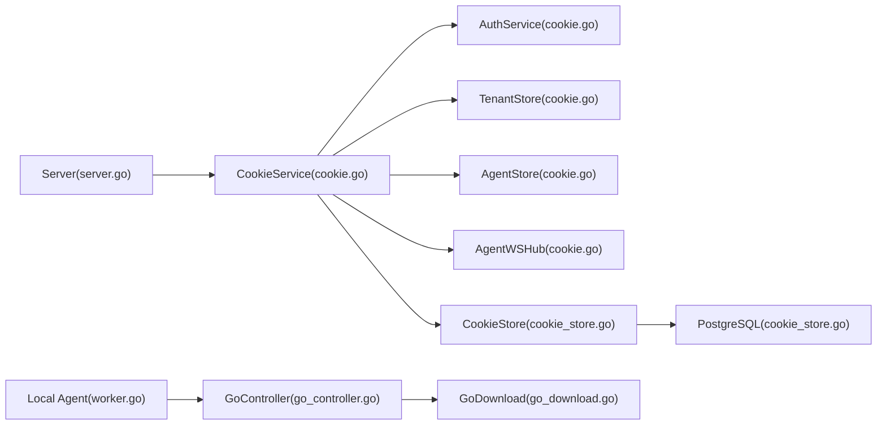

# Cookie与下载管理

<cite>
**本文引用的文件**
- [cookie.go](file://goodhr5/cloud/backend/internal/httpapi/cookie.go)
- [cookie_store.go](file://goodhr5/cloud/backend/internal/httpapi/cookie_store.go)
- [0005_cookie_storage.sql](file://goodhr5/cloud/backend/db/migrations/0005_cookie_storage.sql)
- [server.go](file://goodhr5/cloud/backend/internal/httpapi/server.go)
- [go_download.go](file://goodhr5/local-agent-go/internal/browser/go_download.go)
- [go_controller.go](file://goodhr5/local-agent-go/internal/browser/go_controller.go)
- [worker.go](file://goodhr5/local-agent-go/internal/browser/worker.go)
</cite>

## 目录
1. [简介](#简介)
2. [项目结构](#项目结构)
3. [核心组件](#核心组件)
4. [架构总览](#架构总览)
5. [详细组件分析](#详细组件分析)
6. [依赖关系分析](#依赖关系分析)
7. [性能考虑](#性能考虑)
8. [故障排查指南](#故障排查指南)
9. [结论](#结论)
10. [附录](#附录)

## 简介
本文件聚焦于系统中的“Cookie 与下载管理”能力，覆盖以下方面：
- Cookie 获取、设置、导入导出、加密存储、状态流转（可用/使用中/过期）与并发占用控制。
- 下载管理：下载目录配置、下载记录查询、下载状态监控。
- Cookie 持久化策略：会话保持、登录态维护、租户隔离与多设备共享。
- 下载文件处理：冲突解决、存储空间管理与异常恢复机制。
- 安全与健壮性：Cookie 数据加密、密钥分发、Worker 重启与重试、错误提示与可观测性。

## 项目结构
与 Cookie 和下载相关的代码分布在云端后端与本地 Agent 两端：
- 云端后端负责 Cookie 的 HTTP API、加密存储、状态机与租户/Agent 绑定。
- 本地 Agent 提供浏览器控制能力，包括 Cookie 获取/设置、下载目录设置与下载记录读取。
- 数据库迁移定义 Cookie 表结构与字段。

**图表来源**
- [server.go:16-45](file://goodhr5/cloud/backend/internal/httpapi/server.go#L16-L45)
- [cookie.go:15-27](file://goodhr5/cloud/backend/internal/httpapi/cookie.go#L15-L27)
- [cookie_store.go:14-31](file://goodhr5/cloud/backend/internal/httpapi/cookie_store.go#L14-L31)
- [0005_cookie_storage.sql:1-2](file://goodhr5/cloud/backend/db/migrations/0005_cookie_storage.sql#L1-L2)
- [go_controller.go:109-122](file://goodhr5/local-agent-go/internal/browser/go_controller.go#L109-L122)
- [go_download.go:9-105](file://goodhr5/local-agent-go/internal/browser/go_download.go#L9-L105)
- [worker.go:254-337](file://goodhr5/local-agent-go/internal/browser/worker.go#L254-L337)

**章节来源**
- [server.go:16-45](file://goodhr5/cloud/backend/internal/httpapi/server.go#L16-L45)
- [cookie.go:15-27](file://goodhr5/cloud/backend/internal/httpapi/cookie.go#L15-L27)
- [cookie_store.go:14-31](file://goodhr5/cloud/backend/internal/httpapi/cookie_store.go#L14-L31)
- [0005_cookie_storage.sql:1-2](file://goodhr5/cloud/backend/db/migrations/0005_cookie_storage.sql#L1-L2)
- [go_controller.go:109-122](file://goodhr5/local-agent-go/internal/browser/go_controller.go#L109-L122)
- [go_download.go:9-105](file://goodhr5/local-agent-go/internal/browser/go_download.go#L9-L105)
- [worker.go:254-337](file://goodhr5/local-agent-go/internal/browser/worker.go#L254-L337)

## 核心组件
- CookieService：提供 Cookie 的创建、更新、列表、删除、领取（Claim）、释放（Release）、状态更新等 HTTP 接口；负责加密与多 Agent 密钥分发。
- CookieStore：抽象 Cookie 持久化接口，包含内存与 PostgreSQL 两种实现。
- GoController/GoDownload：本地浏览器控制器的 Cookie 获取/设置、下载目录设置与下载记录读取。
- WorkerManager：Node Browser Worker 的生命周期管理、健康检查、自动重启与调用重试。

**章节来源**
- [cookie.go:15-27](file://goodhr5/cloud/backend/internal/httpapi/cookie.go#L15-L27)
- [cookie_store.go:14-31](file://goodhr5/cloud/backend/internal/httpapi/cookie_store.go#L14-L31)
- [go_download.go:9-105](file://goodhr5/local-agent-go/internal/browser/go_download.go#L9-L105)
- [go_controller.go:109-122](file://goodhr5/local-agent-go/internal/browser/go_controller.go#L109-L122)
- [worker.go:254-337](file://goodhr5/local-agent-go/internal/browser/worker.go#L254-L337)

## 架构总览
Cookie 与下载管理的整体流程如下：
- 前端或岗位运行器通过云端 HTTP API 管理 Cookie（创建/更新/删除/领取/释放/状态）。
- Cookie 数据在云端以密文形式持久化，并为每个已绑定的 Agent 生成加密的数据密钥。
- 岗位运行器在需要时向云端 Claim Cookie，获得密文与对应 Agent 的解密密钥后，下发到本地 Agent。
- 本地 Agent 通过浏览器控制接口设置 Cookie，并配置下载目录、读取下载记录。
- 若本地 Node Worker 不可用，WorkerManager 会尝试自动重启并重试调用。

**图表来源**
- [cookie.go:62-128](file://goodhr5/cloud/backend/internal/httpapi/cookie.go#L62-L128)
- [cookie.go:286-327](file://goodhr5/cloud/backend/internal/httpapi/cookie.go#L286-L327)
- [cookie_store.go:149-177](file://goodhr5/cloud/backend/internal/httpapi/cookie_store.go#L149-L177)
- [go_download.go:39-105](file://goodhr5/local-agent-go/internal/browser/go_download.go#L39-L105)
- [worker.go:254-337](file://goodhr5/local-agent-go/internal/browser/worker.go#L254-L337)

## 详细组件分析

### Cookie 服务（云端）
- 功能要点
  - 列表/创建/更新/删除：校验租户与用户身份，重复名称检测，JSON 序列化与大小统计。
  - 加密与密钥分发：为租户内所有已绑定且具备公钥的 Agent 生成加密的数据密钥，仅保存密文与密钥映射。
  - 状态机：available/in_use/expired，支持按岗位 ID 占用与释放。
  - 状态更新：允许前端标记登录过期或重新可用。
- 关键路径
  - 创建：请求体校验 -> 去重 -> 加密 -> 持久化 -> 返回记录。
  - 领取：校验状态 -> 锁定为 in_use -> 返回密文与密钥。
  - 释放：将状态重置为 available。
  - 状态更新：校验枚举值 -> 更新状态。

**图表来源**
- [cookie.go:62-128](file://goodhr5/cloud/backend/internal/httpapi/cookie.go#L62-L128)
- [cookie.go:154-237](file://goodhr5/cloud/backend/internal/httpapi/cookie.go#L154-L237)
- [cookie.go:286-327](file://goodhr5/cloud/backend/internal/httpapi/cookie.go#L286-L327)
- [cookie.go:328-374](file://goodhr5/cloud/backend/internal/httpapi/cookie.go#L328-L374)

**章节来源**
- [cookie.go:62-128](file://goodhr5/cloud/backend/internal/httpapi/cookie.go#L62-L128)
- [cookie.go:154-237](file://goodhr5/cloud/backend/internal/httpapi/cookie.go#L154-L237)
- [cookie.go:286-327](file://goodhr5/cloud/backend/internal/httpapi/cookie.go#L286-L327)
- [cookie.go:328-374](file://goodhr5/cloud/backend/internal/httpapi/cookie.go#L328-L374)

### Cookie 存储（云端）
- 数据结构
  - CookieRecord：包含租户、用户、平台、显示名、类型、状态、文件名、大小、密文、密钥映射、使用岗位ID、时间戳等。
- 实现
  - MemoryCookieStore：线程安全的内存实现，适合测试与临时场景。
  - PostgresCookieStore：PostgreSQL 持久化，支持 JSONB 存储密钥映射，索引优化查询。
- 复杂度
  - List/GetByID/UpdateStatus：O(n) 或 O(log n)（取决于索引），通常较小规模。
  - 加解密与 JSON 编解码：线性于 Cookie 数据大小。

**图表来源**
- [cookie_store.go:14-31](file://goodhr5/cloud/backend/internal/httpapi/cookie_store.go#L14-L31)
- [cookie_store.go:36-143](file://goodhr5/cloud/backend/internal/httpapi/cookie_store.go#L36-L143)
- [cookie_store.go:146-303](file://goodhr5/cloud/backend/internal/httpapi/cookie_store.go#L146-L303)

**章节来源**
- [cookie_store.go:14-31](file://goodhr5/cloud/backend/internal/httpapi/cookie_store.go#L14-L31)
- [cookie_store.go:36-143](file://goodhr5/cloud/backend/internal/httpapi/cookie_store.go#L36-L143)
- [cookie_store.go:146-303](file://goodhr5/cloud/backend/internal/httpapi/cookie_store.go#L146-L303)

### 数据库模式（云端）
- 表与字段
  - cookie_data：主键 UUID、租户、用户、平台、显示名、类型、密文、密钥映射、状态、使用岗位ID、文件名、大小、时间戳。
  - 索引：tenant_id 索引用于快速查询。
  - 租户开关：cookie_sharing_enabled 控制是否允许 Cookie 共享。
- 设计要点
  - 密文存储：encrypted_data 保存加密后的 Cookie JSON。
  - 密钥映射：encrypted_keys 为 JSONB，键为 Agent 机器ID，值为加密的数据密钥。
  - 状态与占用：status 与 used_by_position_id 共同实现并发占用控制。

**章节来源**
- [0005_cookie_storage.sql:1-2](file://goodhr5/cloud/backend/db/migrations/0005_cookie_storage.sql#L1-L2)

### 浏览器 Cookie 与下载（本地 Agent）
- Cookie 获取/设置
  - GetCookies：通过 CDP 的 Network.getAllCookies 获取当前页面 Cookie。
  - SetCookies：通过 CDP 的 Network.setCookies 设置 Cookie，支持 domain/path/expires/httpOnly/secure。
- 下载管理
  - SetDownloadDir：创建目录并通过 CDP 的 Browser.setDownloadBehavior 设置行为为 allow 与目标路径。
  - ListDownloads：返回内存中的下载记录列表（由浏览器事件驱动填充）。
- 控制器集成
  - GoController 暴露统一路由，兼容 Node Worker 的调用形态，便于上层复用。

**图表来源**
- [go_download.go:9-105](file://goodhr5/local-agent-go/internal/browser/go_download.go#L9-L105)
- [go_controller.go:310-349](file://goodhr5/local-agent-go/internal/browser/go_controller.go#L310-L349)

**章节来源**
- [go_download.go:9-105](file://goodhr5/local-agent-go/internal/browser/go_download.go#L9-L105)
- [go_controller.go:310-349](file://goodhr5/local-agent-go/internal/browser/go_controller.go#L310-L349)

### Worker 管理与异常恢复
- 生命周期
  - Start/Stop/Restart：启动 Node Browser Worker，监听端口，等待就绪，停止与清理进程树。
  - Call/CallOnce：封装 HTTP 调用，失败时根据错误类型决定是否重启并重试。
- 健康检查与兼容性
  - probeWorker/probeWorkerAt：定期探测 Worker 健康与版本兼容性。
  - workerHealthReusable：确保 Worker 版本与本地程序一致。
- 错误处理
  - normalizeCallError：将连接拒绝等网络错误转换为可读中文提示。
  - isRestartableCallError：判断是否需要自动重启。

**图表来源**
- [worker.go:254-337](file://goodhr5/local-agent-go/internal/browser/worker.go#L254-L337)
- [worker.go:339-369](file://goodhr5/local-agent-go/internal/browser/worker.go#L339-L369)
- [worker.go:409-467](file://goodhr5/local-agent-go/internal/browser/worker.go#L409-L467)

**章节来源**
- [worker.go:254-337](file://goodhr5/local-agent-go/internal/browser/worker.go#L254-L337)
- [worker.go:339-369](file://goodhr5/local-agent-go/internal/browser/worker.go#L339-L369)
- [worker.go:409-467](file://goodhr5/local-agent-go/internal/browser/worker.go#L409-L467)

## 依赖关系分析
- 云端服务装配
  - Server 组装各服务，注入 CookieService 与 CookieStore。
- CookieService 依赖
  - AuthService：会话解析与鉴权。
  - TenantStore/AgentStore：租户成员与 Agent 绑定信息。
  - CookieStore：持久化与状态管理。
  - AgentWSHub：用于向在线 Local Agent 下发指令（如扫码登录、捕获 Cookie）。
- 本地 Agent 依赖
  - GoController：统一浏览器控制入口。
  - WorkerManager：Node Worker 的管理与重试。

**图表来源**
- [server.go:16-45](file://goodhr5/cloud/backend/internal/httpapi/server.go#L16-L45)
- [cookie.go:15-27](file://goodhr5/cloud/backend/internal/httpapi/cookie.go#L15-L27)
- [cookie_store.go:146-303](file://goodhr5/cloud/backend/internal/httpapi/cookie_store.go#L146-L303)
- [go_controller.go:109-122](file://goodhr5/local-agent-go/internal/browser/go_controller.go#L109-L122)
- [go_download.go:9-105](file://goodhr5/local-agent-go/internal/browser/go_download.go#L9-L105)
- [worker.go:254-337](file://goodhr5/local-agent-go/internal/browser/worker.go#L254-L337)

**章节来源**
- [server.go:16-45](file://goodhr5/cloud/backend/internal/httpapi/server.go#L16-L45)
- [cookie.go:15-27](file://goodhr5/cloud/backend/internal/httpapi/cookie.go#L15-L27)
- [cookie_store.go:146-303](file://goodhr5/cloud/backend/internal/httpapi/cookie_store.go#L146-L303)
- [go_controller.go:109-122](file://goodhr5/local-agent-go/internal/browser/go_controller.go#L109-L122)
- [go_download.go:9-105](file://goodhr5/local-agent-go/internal/browser/go_download.go#L9-L105)
- [worker.go:254-337](file://goodhr5/local-agent-go/internal/browser/worker.go#L254-L337)

## 性能考虑
- Cookie 加密与密钥分发
  - 每次创建/更新都会生成新的数据密钥并加密，同时为每个已绑定 Agent 生成加密密钥，开销随 Agent 数量线性增长。
  - 建议限制租户内活跃 Agent 数量，避免频繁加密操作。
- 数据库访问
  - 使用 tenant_id 索引加速列表与状态更新；避免大事务与长连接。
- 下载记录
  - 下载记录保存在内存中，注意进程重启后丢失；如需持久化可在上层扩展。
- Worker 调用
  - 自动重启与重试适用于网络抖动或 Worker 崩溃场景，但需避免高频重试造成资源浪费。

[本节为通用指导，不直接分析具体文件]

## 故障排查指南
- Cookie 相关
  - 无本地 Agent 公钥：创建/更新时返回“no local agent public key registered”，需先完成 Agent 绑定并登记公钥。
  - 名称重复：同一租户下 display_name 重复会被拒绝，需调整名称。
  - Cookie 过期或被占用：Claim 时若状态为 expired 或 in_use，分别返回相应错误；可通过 Release 释放占用。
  - 状态非法：Status 更新仅接受 available/in_use/expired。
- 下载相关
  - 下载目录无效：SetDownloadDir 无法创建目录时会返回错误；请检查权限与路径。
  - 下载记录为空：ListDownloads 返回空列表可能表示尚未触发下载或记录未刷新。
- Worker 相关
  - 调用失败：若检测到“Worker 未启动”或网络错误，会自动重启并重试；查看最近日志定位问题。
  - 版本不匹配：Worker 版本与本地程序不一致会导致兼容错误，需完整安装或升级。

**章节来源**
- [cookie.go:86-128](file://goodhr5/cloud/backend/internal/httpapi/cookie.go#L86-L128)
- [cookie.go:286-327](file://goodhr5/cloud/backend/internal/httpapi/cookie.go#L286-L327)
- [cookie.go:342-374](file://goodhr5/cloud/backend/internal/httpapi/cookie.go#L342-L374)
- [go_download.go:71-105](file://goodhr5/local-agent-go/internal/browser/go_download.go#L71-L105)
- [worker.go:339-369](file://goodhr5/local-agent-go/internal/browser/worker.go#L339-L369)
- [worker.go:525-552](file://goodhr5/local-agent-go/internal/browser/worker.go#L525-L552)

## 结论
本系统通过云端 Cookie 服务与本地浏览器控制的协同，实现了安全的 Cookie 管理与便捷的下载能力：
- Cookie 以密文存储，结合租户与 Agent 绑定实现细粒度共享与并发控制。
- 下载管理通过 CDP 设置行为与目录，配合内存记录提供快速查询。
- Worker 管理提供健壮的重启与重试机制，提升整体可用性。
建议在部署时关注 Agent 绑定、权限与磁盘空间，并结合日志进行持续监控与排障。

[本节为总结，不直接分析具体文件]

## 附录
- 常用接口参考（基于源码路径）
  - Cookie 列表/创建/更新/删除：[cookie.go:43-128](file://goodhr5/cloud/backend/internal/httpapi/cookie.go#L43-L128), [cookie.go:154-237](file://goodhr5/cloud/backend/internal/httpapi/cookie.go#L154-L237), [cookie.go:376-397](file://goodhr5/cloud/backend/internal/httpapi/cookie.go#L376-L397)
  - Cookie 领取/释放/状态：[cookie.go:286-340](file://goodhr5/cloud/backend/internal/httpapi/cookie.go#L286-L340), [cookie.go:342-374](file://goodhr5/cloud/backend/internal/httpapi/cookie.go#L342-L374)
  - Cookie 存储接口与实现：[cookie_store.go:14-31](file://goodhr5/cloud/backend/internal/httpapi/cookie_store.go#L14-L31), [cookie_store.go:36-143](file://goodhr5/cloud/backend/internal/httpapi/cookie_store.go#L36-L143), [cookie_store.go:146-303](file://goodhr5/cloud/backend/internal/httpapi/cookie_store.go#L146-L303)
  - 数据库迁移：[0005_cookie_storage.sql:1-2](file://goodhr5/cloud/backend/db/migrations/0005_cookie_storage.sql#L1-L2)
  - 浏览器 Cookie/下载：[go_download.go:9-105](file://goodhr5/local-agent-go/internal/browser/go_download.go#L9-L105)
  - 控制器路由与数据模型：[go_controller.go:109-122](file://goodhr5/local-agent-go/internal/browser/go_controller.go#L109-L122), [go_controller.go:310-349](file://goodhr5/local-agent-go/internal/browser/go_controller.go#L310-L349)
  - Worker 管理与重试：[worker.go:254-337](file://goodhr5/local-agent-go/internal/browser/worker.go#L254-L337), [worker.go:339-369](file://goodhr5/local-agent-go/internal/browser/worker.go#L339-L369), [worker.go:409-467](file://goodhr5/local-agent-go/internal/browser/worker.go#L409-L467)

[本节为附录，不直接分析具体文件]