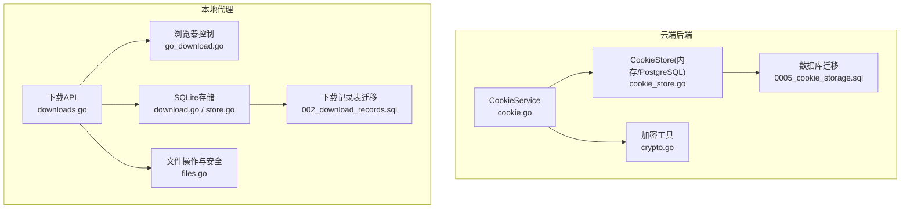
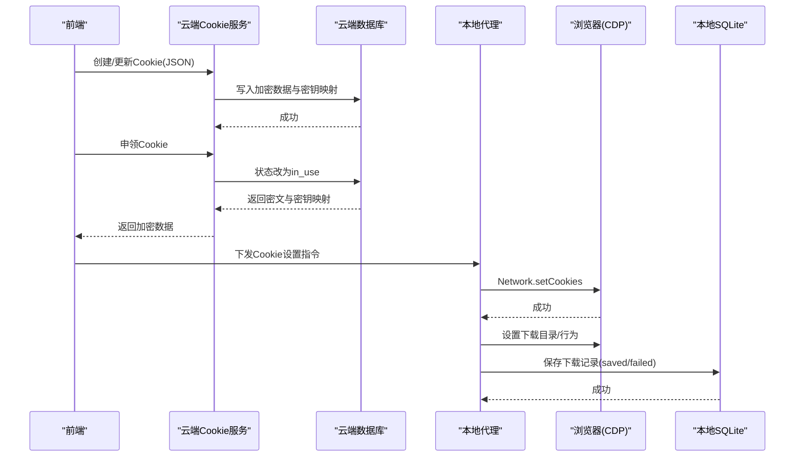
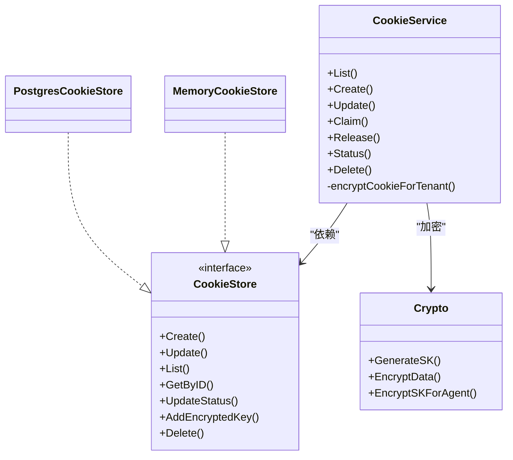
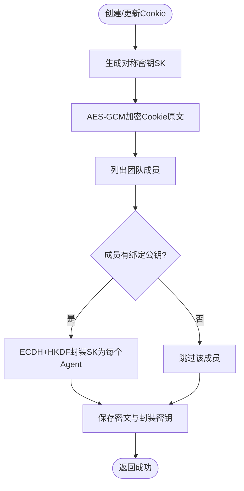
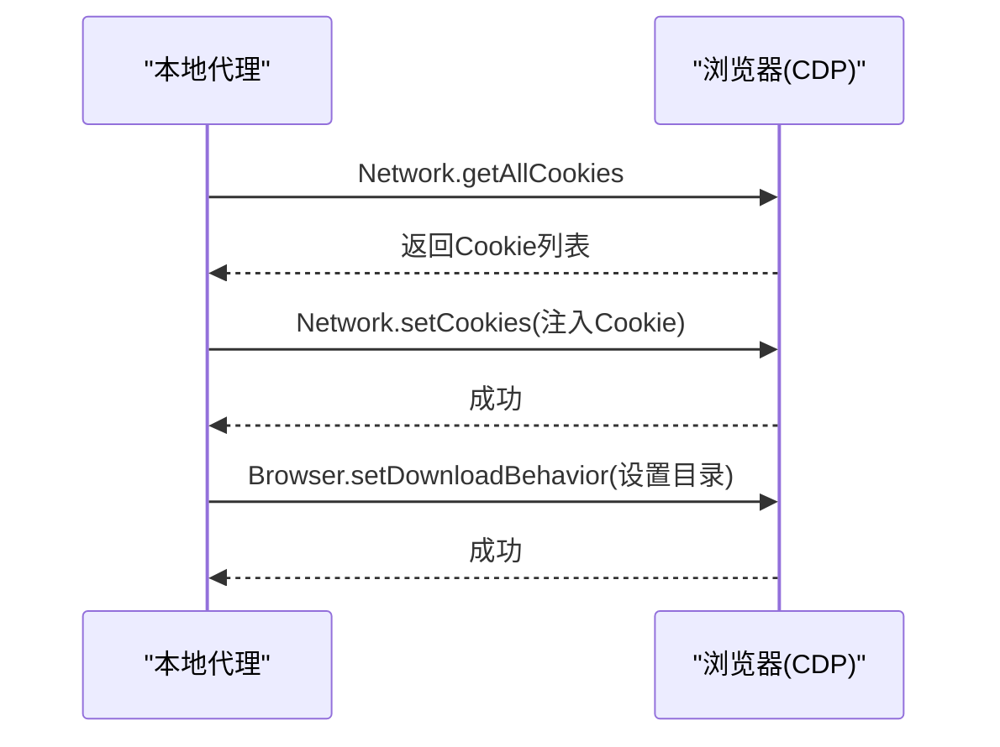
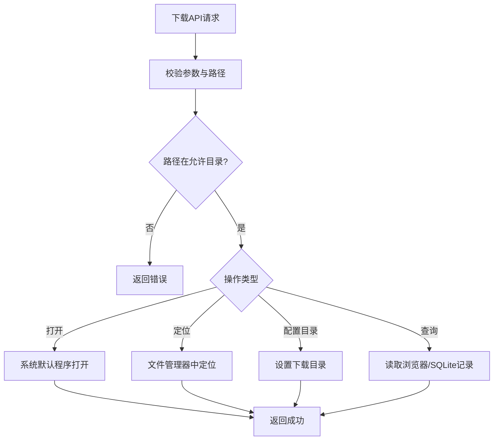
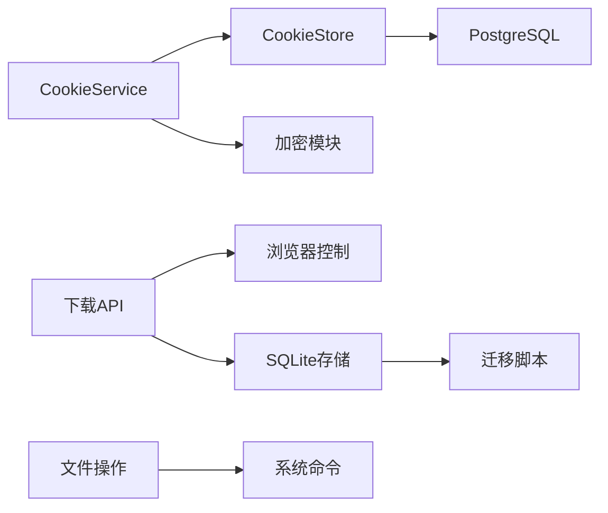

# Cookie与下载管理

<cite>
**本文引用的文件**
- [cookie.go](file://goodhr5/cloud/backend/internal/httpapi/cookie.go)
- [cookie_store.go](file://goodhr5/cloud/backend/internal/httpapi/cookie_store.go)
- [crypto.go](file://goodhr5/cloud/backend/internal/httpapi/crypto.go)
- [0005_cookie_storage.sql](file://goodhr5/cloud/backend/db/migrations/0005_cookie_storage.sql)
- [downloads.go](file://goodhr5/local-agent-go-new/internal/api/downloads.go)
- [download.go](file://goodhr5/local-agent-go-new/internal/storage/download.go)
- [store.go](file://goodhr5/local-agent-go-new/internal/storage/store.go)
- [go_download.go](file://goodhr5/local-agent-go/internal/browser/go_download.go)
- [files.go](file://goodhr5/local-agent-go/internal/app/files.go)
- [types.go](file://goodhr5/local-agent-go-new/internal/browser/contract/types.go)
- [002_download_records.sql](file://goodhr5/local-agent-go-new/migrations/002_download_records.sql)
</cite>

## 目录
1. [简介](#简介)
2. [项目结构](#项目结构)
3. [核心组件](#核心组件)
4. [架构总览](#架构总览)
5. [详细组件分析](#详细组件分析)
6. [依赖关系分析](#依赖关系分析)
7. [性能考虑](#性能考虑)
8. [故障排查指南](#故障排查指南)
9. [结论](#结论)
10. [附录](#附录)

## 简介
本文件聚焦于系统中的“Cookie 管理与下载管理”能力，覆盖以下目标：
- Cookie 获取、设置、导入导出、加密存储、共享与状态流转。
- 下载目录配置、下载记录查询、下载状态监控、文件打开与定位。
- Cookie 持久化策略（会话保持、登录态维护）与下载异常恢复机制。
- 下载文件处理、冲突解决、存储空间清理策略。
- Cookie 安全处理与下载路径安全校验。

## 项目结构
系统由云端后端与本地代理两部分组成：
- 云端后端负责 Cookie 的创建、更新、申领/释放、状态更新与加密存储。
- 本地代理负责浏览器 Cookie 的获取/设置、下载目录配置、下载记录持久化与文件操作。

图表来源
- [cookie.go:15-21](file://goodhr5/cloud/backend/internal/httpapi/cookie.go#L15-L21)
- [cookie_store.go:14-31](file://goodhr5/cloud/backend/internal/httpapi/cookie_store.go#L14-L31)
- [crypto.go:28-114](file://goodhr5/cloud/backend/internal/httpapi/crypto.go#L28-L114)
- [0005_cookie_storage.sql:1-2](file://goodhr5/cloud/backend/db/migrations/0005_cookie_storage.sql#L1-L2)
- [go_download.go:9-105](file://goodhr5/local-agent-go/internal/browser/go_download.go#L9-L105)
- [downloads.go:17-177](file://goodhr5/local-agent-go-new/internal/api/downloads.go#L17-L177)
- [download.go:11-108](file://goodhr5/local-agent-go-new/internal/storage/download.go#L11-L108)
- [store.go:63-109](file://goodhr5/local-agent-go-new/internal/storage/store.go#L63-L109)
- [files.go:19-357](file://goodhr5/local-agent-go/internal/app/files.go#L19-L357)
- [002_download_records.sql:1-20](file://goodhr5/local-agent-go-new/migrations/002_download_records.sql#L1-L20)

章节来源
- [cookie.go:15-21](file://goodhr5/cloud/backend/internal/httpapi/cookie.go#L15-L21)
- [cookie_store.go:14-31](file://goodhr5/cloud/backend/internal/httpapi/cookie_store.go#L14-L31)
- [crypto.go:28-114](file://goodhr5/cloud/backend/internal/httpapi/crypto.go#L28-L114)
- [go_download.go:9-105](file://goodhr5/local-agent-go/internal/browser/go_download.go#L9-L105)
- [downloads.go:17-177](file://goodhr5/local-agent-go-new/internal/api/downloads.go#L17-L177)
- [download.go:11-108](file://goodhr5/local-agent-go-new/internal/storage/download.go#L11-L108)
- [store.go:63-109](file://goodhr5/local-agent-go-new/internal/storage/store.go#L63-L109)
- [files.go:19-357](file://goodhr5/local-agent-go/internal/app/files.go#L19-L357)
- [0005_cookie_storage.sql:1-2](file://goodhr5/cloud/backend/db/migrations/0005_cookie_storage.sql#L1-L2)
- [002_download_records.sql:1-20](file://goodhr5/local-agent-go-new/migrations/002_download_records.sql#L1-L20)

## 核心组件
- Cookie 服务：提供 Cookie 的列表、创建、更新、申领、释放、状态更新与删除；负责租户隔离、名称去重、并发占用控制与加密存储。
- Cookie 存储：提供内存与 PostgreSQL 两种实现，支持状态机（available/in_use/expired）、按租户过滤、加密数据与密钥映射持久化。
- 加密模块：生成对称密钥、AES-GCM 加密 Cookie 原文、使用 ECDH+HKDF 为每台 Agent 封装数据密钥，仅目标设备可解密。
- 下载 API：提供下载记录查询、历史查询、下载目录切换、清空记录、文件打开/定位等接口，并对路径进行严格白名单校验。
- 下载存储：SQLite 持久化下载结果（不含页面正文），支持去重保存、倒序查询、过期清理。
- 浏览器控制：通过 CDP 获取/设置 Cookie、设置下载行为与目录、读取下载记录。
- 文件操作：跨平台打开/定位文件，弹出提示窗并执行用户选择动作，路径安全校验限制在允许目录内。

章节来源
- [cookie.go:43-397](file://goodhr5/cloud/backend/internal/httpapi/cookie.go#L43-L397)
- [cookie_store.go:14-303](file://goodhr5/cloud/backend/internal/httpapi/cookie_store.go#L14-L303)
- [crypto.go:28-114](file://goodhr5/cloud/backend/internal/httpapi/crypto.go#L28-L114)
- [downloads.go:17-177](file://goodhr5/local-agent-go-new/internal/api/downloads.go#L17-L177)
- [download.go:11-108](file://goodhr5/local-agent-go-new/internal/storage/download.go#L11-L108)
- [store.go:63-109](file://goodhr5/local-agent-go-new/internal/storage/store.go#L63-L109)
- [go_download.go:9-105](file://goodhr5/local-agent-go/internal/browser/go_download.go#L9-L105)
- [files.go:19-357](file://goodhr5/local-agent-go/internal/app/files.go#L19-L357)

## 架构总览
Cookie 与下载管理的端到端流程如下：
- Cookie 创建/更新：前端提交 JSON Cookie，云端后端校验、加密、为团队内已绑定公钥的 Agent 封装密钥，写入数据库。
- Cookie 申领/释放：岗位运行前申领 Cookie，状态从 available 转为 in_use；完成后释放回 available。
- Cookie 获取/设置：本地代理通过 CDP 获取当前页面 Cookie 或注入 Cookie，用于维持登录态。
- 下载管理：本地代理配置下载目录，捕获下载事件，持久化到 SQLite；云端/前端可查询历史记录与状态。
- 文件操作：对下载文件进行打开或定位，路径必须位于允许的下载目录内。

图表来源
- [cookie.go:62-128](file://goodhr5/cloud/backend/internal/httpapi/cookie.go#L62-L128)
- [cookie.go:286-340](file://goodhr5/cloud/backend/internal/httpapi/cookie.go#L286-L340)
- [cookie_store.go:149-298](file://goodhr5/cloud/backend/internal/httpapi/cookie_store.go#L149-L298)
- [crypto.go:28-114](file://goodhr5/cloud/backend/internal/httpapi/crypto.go#L28-L114)
- [go_download.go:9-105](file://goodhr5/local-agent-go/internal/browser/go_download.go#L9-L105)
- [downloads.go:17-177](file://goodhr5/local-agent-go-new/internal/api/downloads.go#L17-L177)
- [download.go:26-108](file://goodhr5/local-agent-go-new/internal/storage/download.go#L26-L108)

## 详细组件分析

### Cookie 服务与存储
- 功能要点
  - 列表/创建/更新：校验租户与用户、名称去重、序列化 JSON、加密存储、为团队成员的 Agent 公钥封装密钥。
  - 申领/释放：状态机控制 available/in_use/expired，避免并发冲突；支持无岗位ID时的自动释放。
  - 状态更新：前端检测到平台登录过期时标记 expired。
  - 删除：按租户与ID删除记录。
- 数据结构
  - CookieRecord：包含租户、用户、平台、显示名、类型、状态、加密数据、加密密钥映射、关联岗位ID、文件大小、时间戳。
- 存储实现
  - 内存实现：线程安全、默认状态 available。
  - PostgreSQL 实现：JSONB 存储密钥映射，索引优化查询。

图表来源
- [cookie.go:15-21](file://goodhr5/cloud/backend/internal/httpapi/cookie.go#L15-L21)
- [cookie_store.go:14-31](file://goodhr5/cloud/backend/internal/httpapi/cookie_store.go#L14-L31)
- [crypto.go:28-114](file://goodhr5/cloud/backend/internal/httpapi/crypto.go#L28-L114)

章节来源
- [cookie.go:43-397](file://goodhr5/cloud/backend/internal/httpapi/cookie.go#L43-L397)
- [cookie_store.go:14-303](file://goodhr5/cloud/backend/internal/httpapi/cookie_store.go#L14-L303)
- [crypto.go:28-114](file://goodhr5/cloud/backend/internal/httpapi/crypto.go#L28-L114)

### Cookie 加密与共享
- 加密方案
  - 对称加密：AES-256-GCM 加密 Cookie 原文，nonce 与密文一起保存。
  - 密钥封装：ECDH P-256 与 HKDF 派生包装密钥，使用 Local Agent 公钥加密对称密钥，仅目标设备可解密。
  - 数据库只保存密文与每台设备的加密密钥，降低泄露风险。
- 流程说明
  - 创建/更新时生成随机 SK，加密 Cookie 原文，列出团队成员并为其 Agent 公钥封装 SK，保存 encrypted_data 与 encrypted_keys。
  - 申领时返回 base64 编码的密文与密钥映射，供本地代理解密后设置到浏览器。

图表来源
- [cookie.go:62-128](file://goodhr5/cloud/backend/internal/httpapi/cookie.go#L62-L128)
- [cookie.go:244-284](file://goodhr5/cloud/backend/internal/httpapi/cookie.go#L244-L284)
- [crypto.go:28-114](file://goodhr5/cloud/backend/internal/httpapi/crypto.go#L28-L114)

章节来源
- [cookie.go:62-128](file://goodhr5/cloud/backend/internal/httpapi/cookie.go#L62-L128)
- [cookie.go:244-284](file://goodhr5/cloud/backend/internal/httpapi/cookie.go#L244-L284)
- [crypto.go:28-114](file://goodhr5/cloud/backend/internal/httpapi/crypto.go#L28-L114)

### Cookie 获取与设置（本地代理）
- 获取 Cookie：通过 CDP 的 Network.getAllCookies 获取当前页面 Cookie，转换为内部结构。
- 设置 Cookie：通过 Network.setCookies 注入 Cookie，支持 domain/path/expires/httpOnly/secure 等字段。
- 设置下载目录：通过 Browser.setDownloadBehavior 指定下载路径并允许下载。

图表来源
- [go_download.go:9-105](file://goodhr5/local-agent-go/internal/browser/go_download.go#L9-L105)

章节来源
- [go_download.go:9-105](file://goodhr5/local-agent-go/internal/browser/go_download.go#L9-L105)

### 下载管理（API、存储与文件操作）
- 下载 API
  - 查询当前下载记录：调用浏览器层获取实时下载列表。
  - 查询历史下载记录：从 SQLite 读取已结束下载。
  - 配置下载目录：校验并切换 Worker 后续下载保存目录，记住已配置目录。
  - 清空下载记录：仅清空记录，不删除用户文件。
  - 文件打开/定位：限制路径在允许的下载目录内，跨平台打开或定位。
- 下载存储
  - 保存下载记录：验证 ID、状态、文件路径，首次保存返回 true，否则忽略重复。
  - 查询历史：按 created_at 倒序读取。
  - 过期清理：启动时清理超过保留期的任务、候选人、会话、下载和步骤日志摘要。
- 文件安全
  - 路径白名单：解析真实路径并判断是否在任一已配置下载目录内。
  - 跨平台打开/定位：macOS/Linux 使用系统命令，Windows 多方式尝试打开或定位。

图表来源
- [downloads.go:17-177](file://goodhr5/local-agent-go-new/internal/api/downloads.go#L17-L177)
- [download.go:26-108](file://goodhr5/local-agent-go-new/internal/storage/download.go#L26-L108)
- [store.go:292-323](file://goodhr5/local-agent-go-new/internal/storage/store.go#L292-L323)
- [files.go:19-357](file://goodhr5/local-agent-go/internal/app/files.go#L19-L357)

章节来源
- [downloads.go:17-177](file://goodhr5/local-agent-go-new/internal/api/downloads.go#L17-L177)
- [download.go:26-108](file://goodhr5/local-agent-go-new/internal/storage/download.go#L26-L108)
- [store.go:292-323](file://goodhr5/local-agent-go-new/internal/storage/store.go#L292-L323)
- [files.go:19-357](file://goodhr5/local-agent-go/internal/app/files.go#L19-L357)

### Cookie 持久化策略与登录态维护
- 持久化策略
  - 云端：加密存储 Cookie 原文与每台 Agent 的封装密钥，支持租户隔离与共享开关。
  - 本地：通过 CDP 设置 Cookie，维持浏览器会话；下载记录持久化到 SQLite，便于去重与审计。
- 登录态维护
  - Cookie 状态机：available/in_use/expired，前端检测平台登录过期时标记 expired。
  - 申领/释放：岗位运行前申领，完成后释放，避免并发冲突。
  - 团队共享：为团队成员的 Agent 公钥封装密钥，无需手动分享密钥。

章节来源
- [cookie.go:62-128](file://goodhr5/cloud/backend/internal/httpapi/cookie.go#L62-L128)
- [cookie.go:286-340](file://goodhr5/cloud/backend/internal/httpapi/cookie.go#L286-L340)
- [cookie_store.go:149-298](file://goodhr5/cloud/backend/internal/httpapi/cookie_store.go#L149-L298)
- [0005_cookie_storage.sql:1-2](file://goodhr5/cloud/backend/db/migrations/0005_cookie_storage.sql#L1-L2)

### 下载文件处理、冲突解决与存储空间管理
- 文件处理
  - 下载目录配置：校验绝对路径并切换到新目录，后续下载保存到该目录。
  - 文件打开/定位：限制路径在允许目录内，跨平台打开或定位。
- 冲突解决
  - Cookie 名称去重：创建/更新时检查同租户下显示名是否重复。
  - 下载记录去重：SQLite 使用 INSERT OR IGNORE，避免重复保存相同 ID 的记录。
- 存储空间管理
  - 过期清理：启动时清理超过保留期（90天）的任务、候选人、会话、下载和步骤日志摘要。
  - 下载记录清空：仅清空记录，不删除用户文件，避免误删。

章节来源
- [cookie.go:91-95](file://goodhr5/cloud/backend/internal/httpapi/cookie.go#L91-L95)
- [cookie.go:196-199](file://goodhr5/cloud/backend/internal/httpapi/cookie.go#L196-L199)
- [download.go:26-69](file://goodhr5/local-agent-go-new/internal/storage/download.go#L26-L69)
- [store.go:292-323](file://goodhr5/local-agent-go-new/internal/storage/store.go#L292-L323)
- [downloads.go:64-74](file://goodhr5/local-agent-go-new/internal/api/downloads.go#L64-L74)

### Cookie 安全处理与下载异常恢复机制
- Cookie 安全
  - AES-256-GCM 加密 Cookie 原文，nonce 与密文一起保存。
  - ECDH+HKDF 封装数据密钥，仅目标 Agent 可解密。
  - 数据库只保存密文与密钥映射，降低泄露风险。
- 下载异常恢复
  - 下载失败记录：保存 error 字段，便于审计与重试。
  - 中断任务恢复：启动时将 running 任务收尾为 failed，避免悬挂状态。
  - 路径安全校验：限制文件操作在允许目录内，防止越权访问。

章节来源
- [crypto.go:28-114](file://goodhr5/cloud/backend/internal/httpapi/crypto.go#L28-L114)
- [download.go:26-69](file://goodhr5/local-agent-go-new/internal/storage/download.go#L26-L69)
- [store.go:270-290](file://goodhr5/local-agent-go-new/internal/storage/store.go#L270-L290)
- [downloads.go:109-164](file://goodhr5/local-agent-go-new/internal/api/downloads.go#L109-L164)

## 依赖关系分析
- 云端后端
  - CookieService 依赖 CookieStore（内存/PostgreSQL）与加密模块。
  - 数据库迁移定义 cookie_data 表结构与租户共享开关。
- 本地代理
  - 下载 API 依赖浏览器控制层与 SQLite 存储。
  - 文件操作依赖系统命令与路径安全校验。
  - 下载记录表迁移定义 download_records 表结构与索引。

图表来源
- [cookie.go:15-21](file://goodhr5/cloud/backend/internal/httpapi/cookie.go#L15-L21)
- [cookie_store.go:14-31](file://goodhr5/cloud/backend/internal/httpapi/cookie_store.go#L14-L31)
- [crypto.go:28-114](file://goodhr5/cloud/backend/internal/httpapi/crypto.go#L28-L114)
- [0005_cookie_storage.sql:1-2](file://goodhr5/cloud/backend/db/migrations/0005_cookie_storage.sql#L1-L2)
- [downloads.go:17-177](file://goodhr5/local-agent-go-new/internal/api/downloads.go#L17-L177)
- [download.go:11-108](file://goodhr5/local-agent-go-new/internal/storage/download.go#L11-L108)
- [store.go:63-109](file://goodhr5/local-agent-go-new/internal/storage/store.go#L63-L109)
- [files.go:19-357](file://goodhr5/local-agent-go/internal/app/files.go#L19-L357)
- [002_download_records.sql:1-20](file://goodhr5/local-agent-go-new/migrations/002_download_records.sql#L1-L20)

章节来源
- [cookie.go:15-21](file://goodhr5/cloud/backend/internal/httpapi/cookie.go#L15-L21)
- [cookie_store.go:14-31](file://goodhr5/cloud/backend/internal/httpapi/cookie_store.go#L14-L31)
- [crypto.go:28-114](file://goodhr5/cloud/backend/internal/httpapi/crypto.go#L28-L114)
- [0005_cookie_storage.sql:1-2](file://goodhr5/cloud/backend/db/migrations/0005_cookie_storage.sql#L1-L2)
- [downloads.go:17-177](file://goodhr5/local-agent-go-new/internal/api/downloads.go#L17-L177)
- [download.go:11-108](file://goodhr5/local-agent-go-new/internal/storage/download.go#L11-L108)
- [store.go:63-109](file://goodhr5/local-agent-go-new/internal/storage/store.go#L63-L109)
- [files.go:19-357](file://goodhr5/local-agent-go/internal/app/files.go#L19-L357)
- [002_download_records.sql:1-20](file://goodhr5/local-agent-go-new/migrations/002_download_records.sql#L1-L20)

## 性能考虑
- Cookie 加密：AES-GCM 与 ECDH 计算开销较小，适合高频创建/更新场景。
- 数据库查询：PostgreSQL 使用索引优化租户过滤与排序；SQLite 使用单连接与 busy_timeout 提升并发稳定性。
- 下载记录：INSERT OR IGNORE 避免重复写入；倒序查询使用索引提升性能。
- 文件操作：路径校验与系统命令调用开销较低，但需避免频繁弹窗影响用户体验。

[本节提供一般性指导，无需特定文件分析]

## 故障排查指南
- Cookie 创建失败
  - 检查租户是否已登记 Agent 公钥；若无公钥则返回冲突错误。
  - 检查 Cookie JSON 是否有效；无效则返回参数错误。
- Cookie 申领失败
  - 检查 Cookie 状态是否为 available；若 expired 或 in_use 则返回冲突。
  - 检查岗位ID是否为空；为空时自动释放占用。
- 下载目录配置失败
  - 检查路径是否为绝对路径；非绝对路径则返回参数错误。
  - 检查目录是否存在；不存在则创建失败。
- 文件打开/定位失败
  - 检查路径是否在允许目录内；不在则返回错误。
  - 检查文件是否存在；不存在则返回错误。
- 下载记录查询失败
  - 检查 SQLite 是否可读写；不可用则返回错误。
  - 检查迁移是否执行；未执行则创建表失败。

章节来源
- [cookie.go:62-128](file://goodhr5/cloud/backend/internal/httpapi/cookie.go#L62-L128)
- [cookie.go:286-340](file://goodhr5/cloud/backend/internal/httpapi/cookie.go#L286-L340)
- [downloads.go:40-74](file://goodhr5/local-agent-go-new/internal/api/downloads.go#L40-L74)
- [downloads.go:109-164](file://goodhr5/local-agent-go-new/internal/api/downloads.go#L109-L164)
- [download.go:26-69](file://goodhr5/local-agent-go-new/internal/storage/download.go#L26-L69)
- [store.go:63-109](file://goodhr5/local-agent-go-new/internal/storage/store.go#L63-L109)

## 结论
本系统通过云端后端的 Cookie 加密存储与本地代理的浏览器控制，实现了安全的 Cookie 共享与会话保持；通过下载目录配置、记录持久化与文件操作，提供了完整的下载管理能力。Cookie 状态机与下载记录去重确保了并发一致性与数据完整性；路径安全校验与过期清理保障了系统安全性与存储空间健康。

[本节总结内容，无需特定文件分析]

## 附录
- 数据库表结构
  - cookie_data：存储加密 Cookie 与密钥映射，支持租户隔离与共享开关。
  - download_records：存储下载结果，支持去重与历史查询。

章节来源
- [0005_cookie_storage.sql:1-2](file://goodhr5/cloud/backend/db/migrations/0005_cookie_storage.sql#L1-L2)
- [002_download_records.sql:1-20](file://goodhr5/local-agent-go-new/migrations/002_download_records.sql#L1-L20)