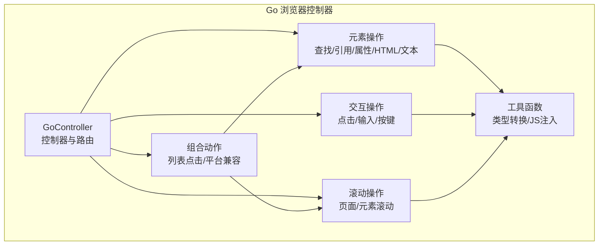
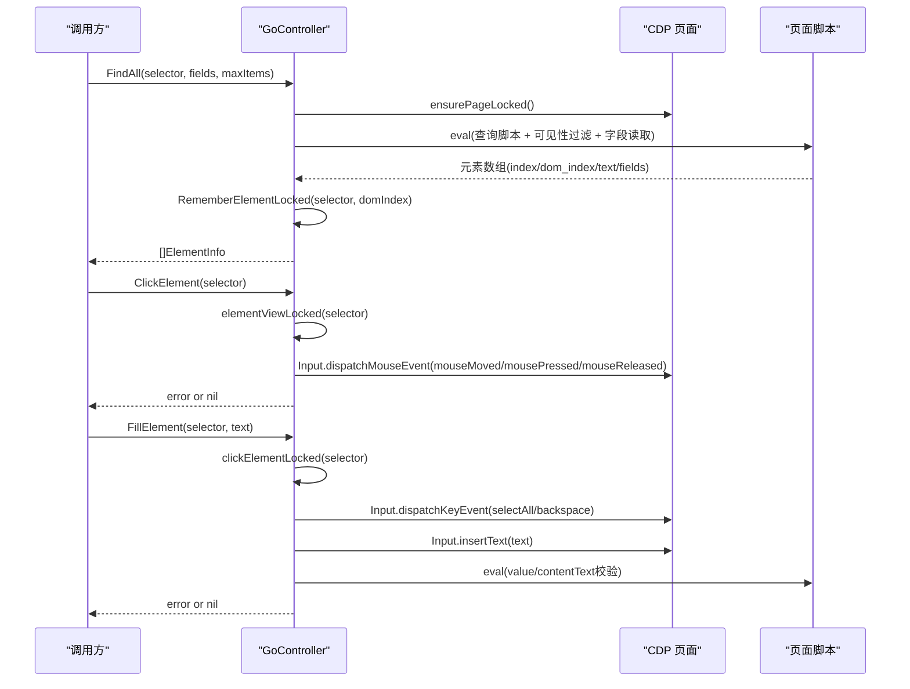
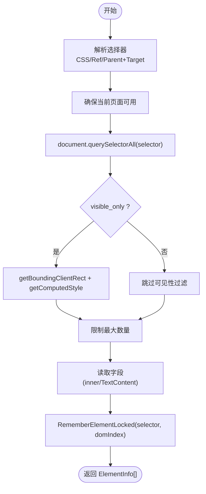
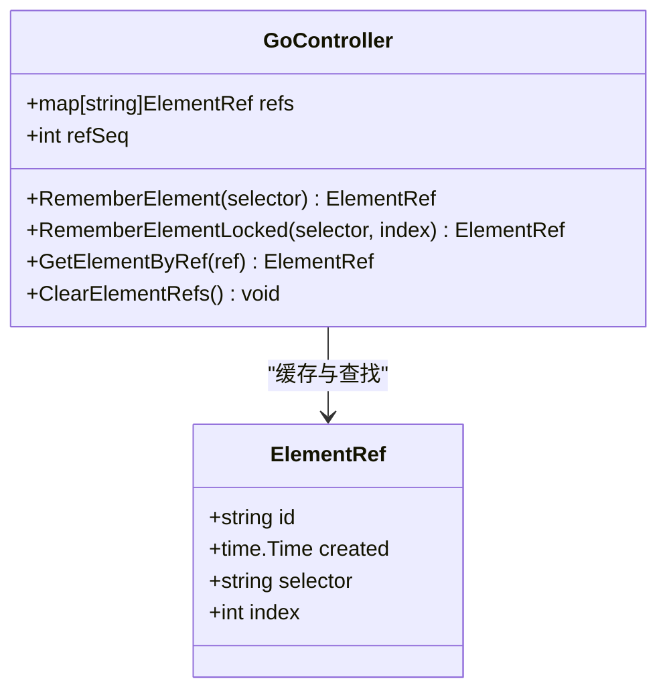
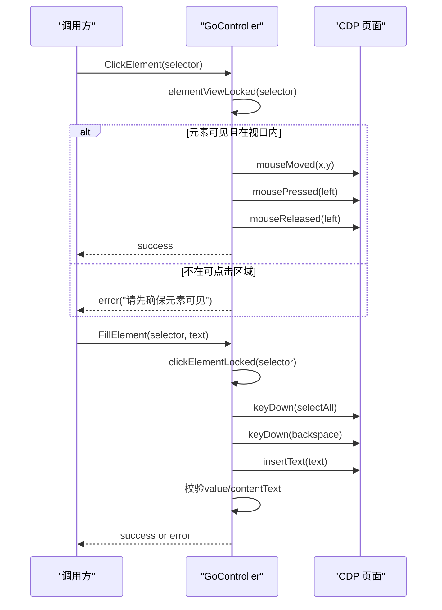
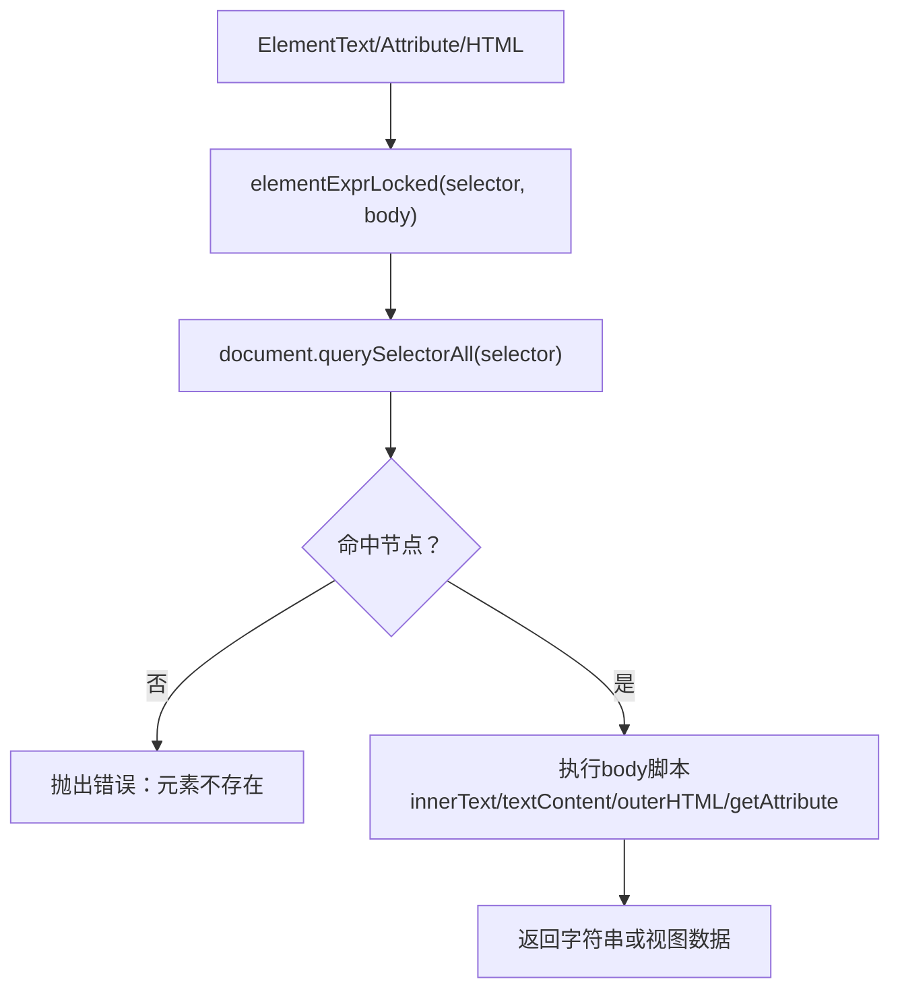
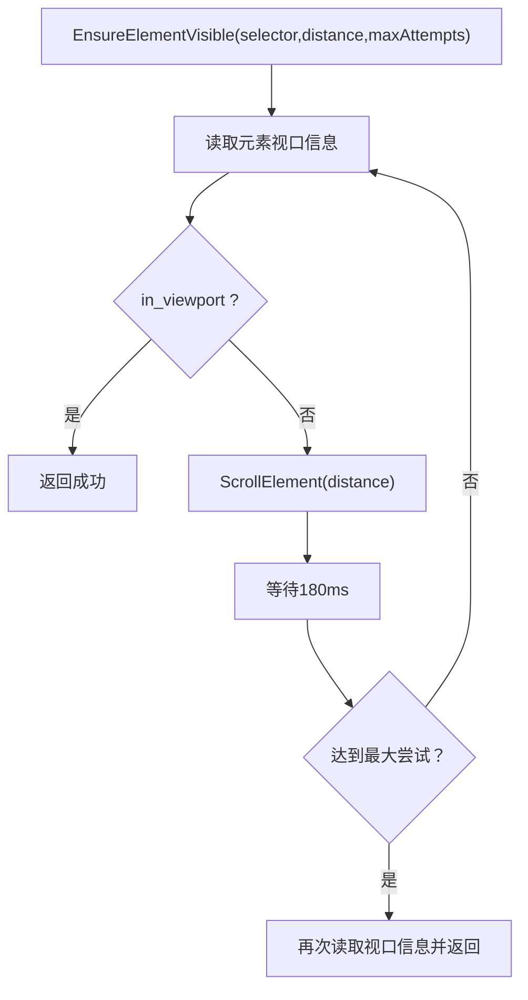
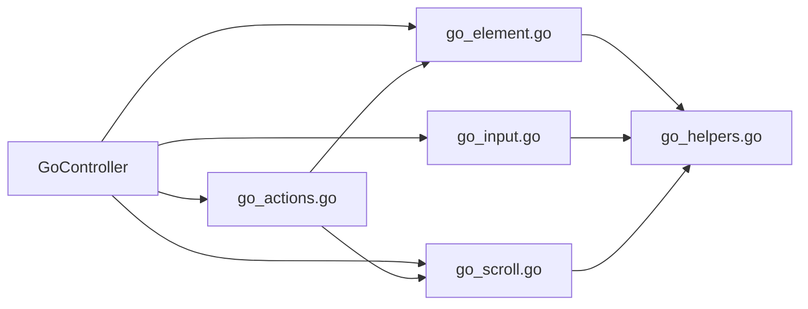

# 元素操作封装

<cite>
**本文引用的文件**   
- [go_controller.go](file://goodhr5/local-agent-go/internal/browser/go_controller.go)
- [go_element.go](file://goodhr5/local-agent-go/internal/browser/go_element.go)
- [go_input.go](file://goodhr5/local-agent-go/internal/browser/go_input.go)
- [go_actions.go](file://goodhr5/local-agent-go/internal/browser/go_actions.go)
- [go_scroll.go](file://goodhr5/local-agent-go/internal/browser/go_scroll.go)
- [go_helpers.go](file://goodhr5/local-agent-go/internal/browser/go_helpers.go)
</cite>

## 目录
1. [引言](#引言)
2. [项目结构](#项目结构)
3. [核心组件](#核心组件)
4. [架构总览](#架构总览)
5. [详细组件分析](#详细组件分析)
6. [依赖关系分析](#依赖关系分析)
7. [性能与稳定性考虑](#性能与稳定性考虑)
8. [故障排查指南](#故障排查指南)
9. [结论](#结论)

## 引言
本文件面向“元素操作封装”的完整技术说明，聚焦 Go 浏览器控制器在本地 Agent 中的实现。文档覆盖以下关键主题：
- 元素查找机制：选择器语法、可见性判断、索引定位、字段提取。
- 元素引用缓存系统：元素 ID 生成、引用存储、清空策略。
- 用户交互模拟：点击、输入、键盘事件的具体实现。
- 元素属性读取、HTML 提取、文本获取。
- 元素状态检查与兼容性处理方案。

该封装通过 CDP（Chrome DevTools Protocol）与 CloakBrowser 通信，提供与 Node Worker 兼容的调用形态，同时支持实验性的 Go 模式。

## 项目结构
与元素操作直接相关的代码集中在 local-agent-go 的 browser 包中，按职责拆分为多个文件：
- go_controller.go：控制器入口、类型定义、路由分发、基础能力清单。
- go_element.go：元素查找、引用缓存、属性/HTML/文本读取、视口信息。
- go_input.go：点击、输入、键盘事件。
- go_actions.go：组合动作与平台兼容方法。
- go_scroll.go：页面与元素滚动。
- go_helpers.go：通用工具函数。

图示来源
- [go_controller.go:109-122](file://goodhr5/local-agent-go/internal/browser/go_controller.go#L109-L122)
- [go_element.go:11-105](file://goodhr5/local-agent-go/internal/browser/go_element.go#L11-L105)
- [go_input.go:11-88](file://goodhr5/local-agent-go/internal/browser/go_input.go#L11-L88)
- [go_scroll.go:8-36](file://goodhr5/local-agent-go/internal/browser/go_scroll.go#L8-L36)
- [go_actions.go:10-80](file://goodhr5/local-agent-go/internal/browser/go_actions.go#L10-L80)
- [go_helpers.go:11-134](file://goodhr5/local-agent-go/internal/browser/go_helpers.go#L11-L134)

章节来源
- [go_controller.go:109-122](file://goodhr5/local-agent-go/internal/browser/go_controller.go#L109-L122)

## 核心组件
- GoController：统一入口，维护浏览器进程、当前页、元素引用缓存、下载记录等上下文。
- ElementSelector：选择器配置，支持 CSS 选择器、元素引用、可见性过滤、索引定位。
- ElementRef：已缓存的元素引用，包含 ID、创建时间、原始选择器、DOM 索引。
- ElementInfo：查找结果，包含序号、引用、文本、字段映射。
- ElementView：元素位置与可见性、是否在视口内等信息。

这些类型与方法共同构成元素操作的底层能力，并通过 Call/ClearElementRefs 等方法对外暴露。

章节来源
- [go_controller.go:159-194](file://goodhr5/local-agent-go/internal/browser/go_controller.go#L159-L194)
- [go_element.go:11-105](file://goodhr5/local-agent-go/internal/browser/go_element.go#L11-L105)

## 架构总览
Go 浏览器控制器通过 CDP 与 CloakBrowser 通信，所有 DOM 操作以脚本注入或 CDP 事件方式执行。元素查找使用 document.querySelectorAll，可见性与视口判定基于 getBoundingClientRect 与样式计算；点击与滚动通过 Input.dispatchMouseEvent，输入通过 Input.insertText 与键盘事件派发。

图示来源
- [go_element.go:24-105](file://goodhr5/local-agent-go/internal/browser/go_element.go#L24-L105)
- [go_input.go:11-88](file://goodhr5/local-agent-go/internal/browser/go_input.go#L11-L88)
- [go_controller.go:259-335](file://goodhr5/local-agent-go/internal/browser/go_controller.go#L259-L335)

## 详细组件分析

### 元素查找机制
- 选择器语法
  - 支持标准 CSS 选择器字符串。
  - 支持纯 class 名称自动转换为 .class 形式。
  - 支持从多种键名中提取选择器：selector/css/path/selectors/target_classes/classes/element。
  - 支持父级类名与目标选择器拼接为 parent target 的组合选择器。
- 可见性判断
  - 默认启用 visible_only=true，过滤条件包括宽高大于零、display 非 none、visibility 非 hidden。
  - 可在 ElementSelector.Visible 控制是否强制可见。
- 索引定位
  - 支持 index 参数定位第 N 个匹配节点；若未命中则回退到第一个。
  - 返回 ElementInfo.Index 与 dom_index，便于后续精确定位。
- 字段提取
  - 支持 fields 配置，对每个字段内的子选择器进行 querySelector，并读取 innerText/textContent 作为字段值。
  - 字段配置支持对象嵌套与多键名解析。

图示来源
- [go_element.go:24-105](file://goodhr5/local-agent-go/internal/browser/go_element.go#L24-L105)
- [go_element.go:257-329](file://goodhr5/local-agent-go/internal/browser/go_element.go#L257-L329)

章节来源
- [go_element.go:24-105](file://goodhr5/local-agent-go/internal/browser/go_element.go#L24-L105)
- [go_element.go:257-329](file://goodhr5/local-agent-go/internal/browser/go_element.go#L257-L329)

### 元素引用缓存系统
- ID 生成
  - 使用自增序列 refSeq 生成唯一 ID，格式为 go-el-{seq}。
- 引用存储
  - 内存 map[string]ElementRef 保存 selector 与 index，避免重复查询。
  - RememberElement/RememberElementLocked 将选择器与 DOM 索引持久化到缓存。
- 引用读取
  - GetElementByRef 根据 ref 反查 ElementRef，用于后续精确操作。
- 过期清理
  - ClearElementRefs 清空全部引用；建议在页面切换或刷新后调用。
- 生命周期建议
  - 页面导航、刷新、关闭时清理引用，防止 stale selector/index 导致错误。

图示来源
- [go_controller.go:109-122](file://goodhr5/local-agent-go/internal/browser/go_controller.go#L109-L122)
- [go_element.go:107-139](file://goodhr5/local-agent-go/internal/browser/go_element.go#L107-L139)

章节来源
- [go_element.go:107-139](file://goodhr5/local-agent-go/internal/browser/go_element.go#L107-L139)

### 用户交互模拟
- 点击元素
  - 先读取元素视口位置，要求元素可见且在视口内。
  - 通过 CDP Input.dispatchMouseEvent 发送 mouseMoved/mousePressed/mouseReleased。
  - 若不可见或未进入视口，需先调用 EnsureElementVisible。
- 输入文本
  - 先点击元素聚焦。
  - 使用 Control+A/Meta+A 全选，Backspace 删除旧内容。
  - 通过 Input.insertText 插入新文本。
  - 最后校验 value 或 contentText 是否与期望一致。
- 键盘事件
  - PressKey 支持组合键如 ControlOrMeta+A、Shift、Alt、Meta 等。
  - 通过 parseKeyStroke 解析修饰符与按键码，再派发 keyDown/keyUp。

图示来源
- [go_input.go:11-88](file://goodhr5/local-agent-go/internal/browser/go_input.go#L11-L88)
- [go_input.go:83-173](file://goodhr5/local-agent-go/internal/browser/go_input.go#L83-L173)

章节来源
- [go_input.go:11-88](file://goodhr5/local-agent-go/internal/browser/go_input.go#L11-L88)
- [go_input.go:83-173](file://goodhr5/local-agent-go/internal/browser/go_input.go#L83-L173)

### 元素属性读取、HTML 提取、文本获取
- 文本读取
  - ElementText 优先读取 innerText，其次 textContent，并 trim。
  - 当 selector/ref 为空时，读取 body 的文本。
- 属性读取
  - ElementAttribute 优先访问 el[name]，否则回退到 getAttribute(name)。
- HTML 提取
  - ElementHTML 返回 outerHTML。
- 视口信息
  - ElementView 返回 x/y/width/height、viewport_width/viewport_height、visible/in_viewport。

图示来源
- [go_element.go:141-216](file://goodhr5/local-agent-go/internal/browser/go_element.go#L141-L216)
- [go_element.go:218-238](file://goodhr5/local-agent-go/internal/browser/go_element.go#L218-L238)

章节来源
- [go_element.go:141-216](file://goodhr5/local-agent-go/internal/browser/go_element.go#L141-L216)
- [go_element.go:218-238](file://goodhr5/local-agent-go/internal/browser/go_element.go#L218-L238)

### 滚动与可见性保证
- 页面滚动
  - ScrollPage 使用 CDP mouseWheel 在视口中点滚动。
- 元素滚动
  - ScrollElement 计算元素中心坐标，并在视口范围内 clamp 后滚动。
- 确保可见
  - EnsureElementVisible 循环滚动直到元素进入视口，返回尝试次数与最终视口信息。
  - 支持负距离向上滚动，以及超时与上下文取消。

图示来源
- [go_actions.go:10-56](file://goodhr5/local-agent-go/internal/browser/go_actions.go#L10-L56)
- [go_scroll.go:8-36](file://goodhr5/local-agent-go/internal/browser/go_scroll.go#L8-L36)

章节来源
- [go_actions.go:10-56](file://goodhr5/local-agent-go/internal/browser/go_actions.go#L10-L56)
- [go_scroll.go:8-36](file://goodhr5/local-agent-go/internal/browser/go_scroll.go#L8-L36)

### 组合动作与平台兼容
- 列表点击
  - ClickListItemByIndex 支持 item/click_target/clickTarget 等键名，构造复合选择器后点击。
- 平台候选者提取
  - ExtractPlatformCandidates 复用 FindAll 与 fields 配置，返回候选者卡片信息。
- 平台候选者滚动
  - ScrollPlatformCandidateList 优先滚动候选容器，否则滚动整页。
- 打招呼与详情
  - GreetPlatformCandidate 支持 element_ref 与 greet_button 组合点击。
  - ExtractPlatformCandidateDetail 提取详情文本与截图。
  - ClosePlatformCandidateDetail 默认按 Escape 关闭。

章节来源
- [go_actions.go:58-184](file://goodhr5/local-agent-go/internal/browser/go_actions.go#L58-L184)

## 依赖关系分析
- 控制器与元素操作
  - GoController 持有 refs 缓存与 page 上下文，FindAll/ElementText/ClickElement 等均依赖其内部锁与 CDP 客户端。
- 工具函数
  - go_helpers.go 提供 mapFromAny/stringFromAny/goIntFromAny/jsString/jsJSON 等工具，贯穿各模块。
- 路由分发
  - Call/ClearElementRefs 等通过路径分派到具体方法，保持与 Node Worker 兼容。

图示来源
- [go_controller.go:259-335](file://goodhr5/local-agent-go/internal/browser/go_controller.go#L259-L335)
- [go_element.go:24-105](file://goodhr5/local-agent-go/internal/browser/go_element.go#L24-L105)
- [go_input.go:11-88](file://goodhr5/local-agent-go/internal/browser/go_input.go#L11-L88)
- [go_scroll.go:8-36](file://goodhr5/local-agent-go/internal/browser/go_scroll.go#L8-L36)
- [go_actions.go:10-80](file://goodhr5/local-agent-go/internal/browser/go_actions.go#L10-L80)
- [go_helpers.go:11-134](file://goodhr5/local-agent-go/internal/browser/go_helpers.go#L11-L134)

章节来源
- [go_controller.go:259-335](file://goodhr5/local-agent-go/internal/browser/go_controller.go#L259-L335)

## 性能与稳定性考虑
- 选择器优化
  - 尽量使用稳定的 class 选择器，避免复杂 XPath。
  - 合理使用 parent_classes 与 target_classes 缩小范围。
- 可见性与视口
  - 频繁滚动会影响性能，应结合 EnsureElementVisible 的最小尝试次数与距离参数。
- 引用缓存
  - 合理管理 refs 生命周期，避免长时间持有失效引用。
- CDP 事件
  - 点击与滚动使用真实 CDP 事件，减少脚本注入带来的副作用。
- 并发安全
  - 所有方法均加互斥锁，避免竞态条件。

[本节为通用指导，不直接分析具体文件]

## 故障排查指南
- 未找到元素
  - 检查 selector/ref 是否正确，必要时打印 ElementView 确认可见性与视口。
  - 若使用 Ref，请确认引用未被 ClearElementRefs 清理。
- 元素不可点击
  - 先调用 EnsureElementVisible，确保元素进入视口且可见。
- 输入校验失败
  - 检查 FillElement 后的 value/contentText 校验逻辑，确认目标元素是否为 input/textarea 或可编辑区域。
- 滚动无效
  - 检查 ScrollElement 的 distance 符号与方向，必要时改为 ScrollPage。
- 组合动作报错
  - 检查 payload 中的 item/click_target/clickTarget/greet_button 等键名是否存在。

章节来源
- [go_element.go:11-105](file://goodhr5/local-agent-go/internal/browser/go_element.go#L11-L105)
- [go_input.go:11-88](file://goodhr5/local-agent-go/internal/browser/go_input.go#L11-L88)
- [go_actions.go:58-184](file://goodhr5/local-agent-go/internal/browser/go_actions.go#L58-L184)

## 结论
该元素操作封装通过 Go 浏览器控制器提供了稳定、可测试、可扩展的 DOM 操作能力。它支持丰富的选择器语法、严格的可见性与视口判断、可靠的元素引用缓存、真实的用户交互模拟，以及与 Node Worker 兼容的路由形态。在实际使用中，建议遵循选择器优化、引用生命周期管理与滚动最小化等最佳实践，以获得更高的稳定性与性能。