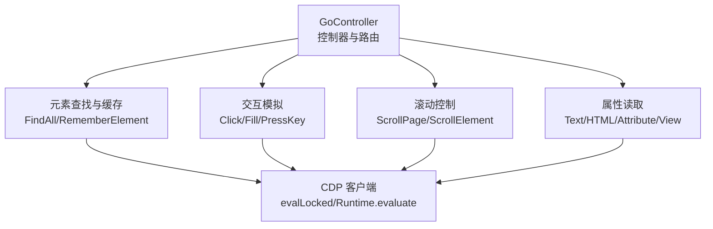
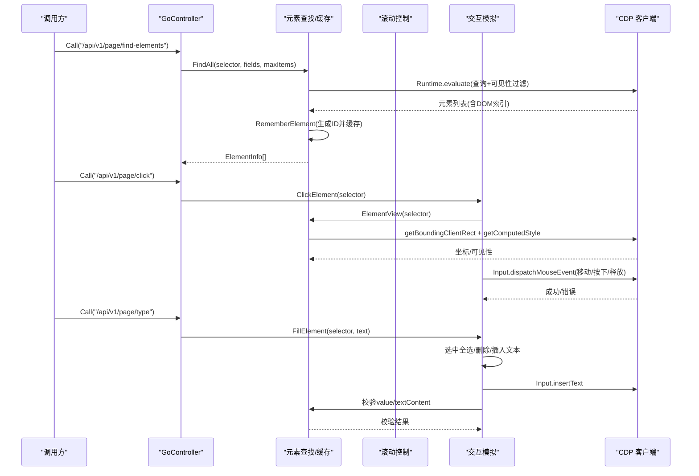
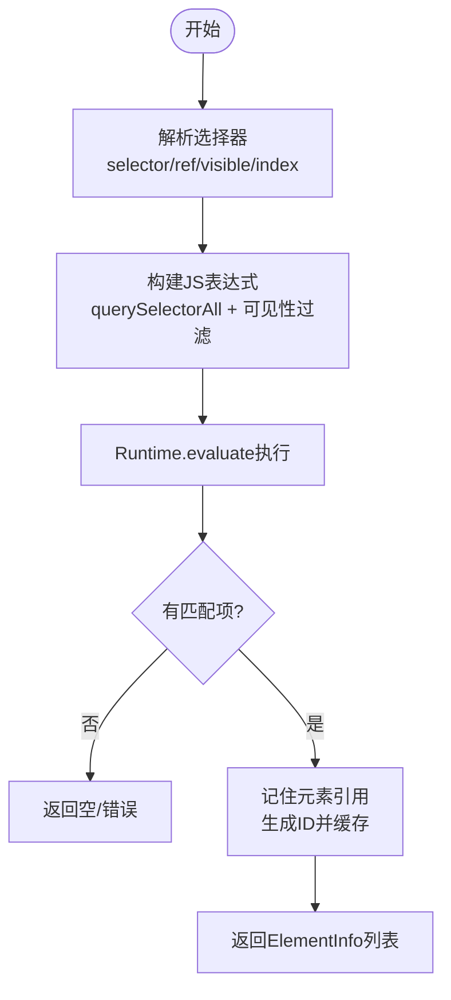
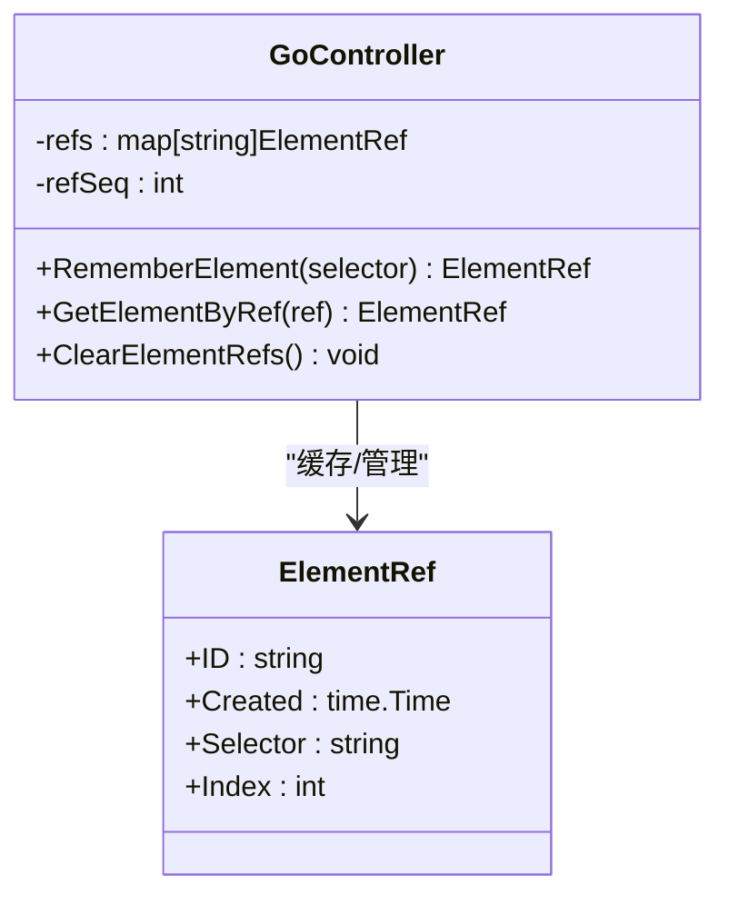
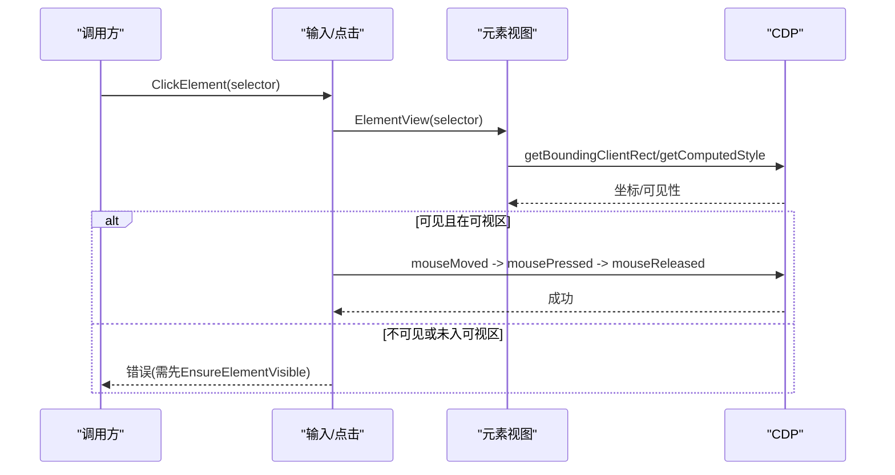
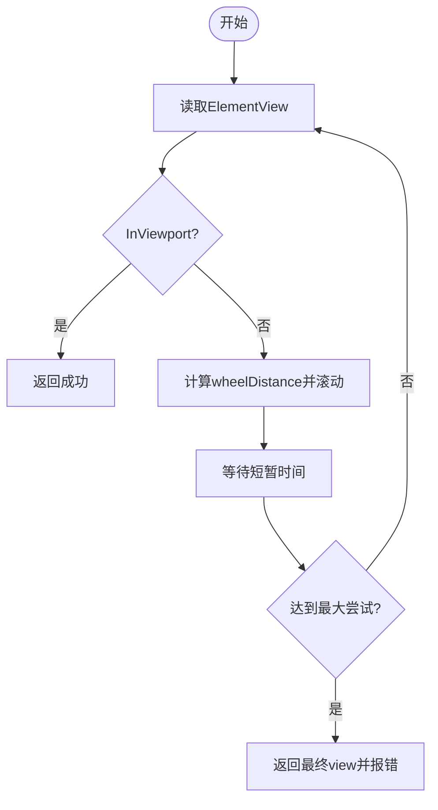
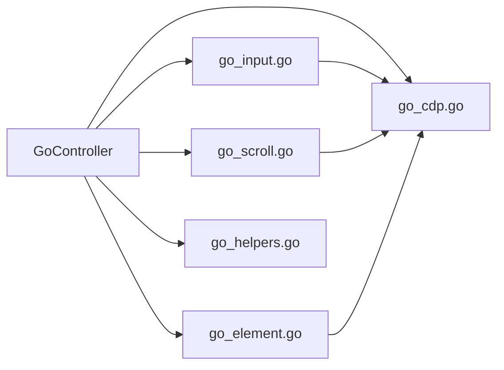

# 元素操作封装

<cite>
**本文引用的文件**
- [go_controller.go](file://goodhr5/local-agent-go/internal/browser/go_controller.go)
- [go_element.go](file://goodhr5/local-agent-go/internal/browser/go_element.go)
- [go_actions.go](file://goodhr5/local-agent-go/internal/browser/go_actions.go)
- [go_input.go](file://goodhr5/local-agent-go/internal/browser/go_input.go)
- [go_scroll.go](file://goodhr5/local-agent-go/internal/browser/go_scroll.go)
- [go_cdp.go](file://goodhr5/local-agent-go/internal/browser/go_cdp.go)
- [go_helpers.go](file://goodhr5/local-agent-go/internal/browser/go_helpers.go)
</cite>

## 目录
1. [简介](#简介)
2. [项目结构](#项目结构)
3. [核心组件](#核心组件)
4. [架构总览](#架构总览)
5. [详细组件分析](#详细组件分析)
6. [依赖关系分析](#依赖关系分析)
7. [性能考量](#性能考量)
8. [故障排查指南](#故障排查指南)
9. [结论](#结论)
10. [附录](#附录)

## 简介
本文件面向“元素操作封装”的完整说明，聚焦以下能力：
- 元素查找机制：选择器语法、可见性判断、索引定位与批量提取。
- 元素引用缓存系统：元素ID生成、引用存储、过期清理策略。
- 用户交互模拟：点击、输入、键盘事件的具体实现。
- 元素属性读取：文本获取、HTML提取、属性读取、视口位置信息。
- 状态检查与兼容性：可见性与可视区域判定、跨平台组合键、滚动到可视区等。

该封装基于 Go 浏览器控制器，通过 CDP（Chrome DevTools Protocol）直接驱动页面，提供稳定、可观测且可复用的底层能力，并在上层暴露兼容 Node Worker 的路由接口，便于现有流程无缝迁移或并行运行。

## 项目结构
围绕元素操作的代码集中在 internal/browser 包内，按职责拆分为多个文件：
- go_controller.go：控制器主体、路由分发、类型定义、操作清单。
- go_element.go：元素查找、引用缓存、文本/HTML/属性读取、视口信息。
- go_actions.go：通用组合动作与平台兼容动作。
- go_input.go：点击、输入、键盘事件。
- go_scroll.go：页面与元素滚动。
- go_cdp.go：CDP WebSocket 客户端与脚本执行。
- go_helpers.go：通用工具函数。

图表来源
- [go_controller.go:109-374](file://goodhr5/local-agent-go/internal/browser/go_controller.go#L109-L374)
- [go_element.go:11-139](file://goodhr5/local-agent-go/internal/browser/go_element.go#L11-L139)
- [go_input.go:11-173](file://goodhr5/local-agent-go/internal/browser/go_input.go#L11-L173)
- [go_scroll.go:8-81](file://goodhr5/local-agent-go/internal/browser/go_scroll.go#L8-L81)
- [go_cdp.go:48-104](file://goodhr5/local-agent-go/internal/browser/go_cdp.go#L48-L104)

章节来源
- [go_controller.go:109-374](file://goodhr5/local-agent-go/internal/browser/go_controller.go#L109-L374)
- [go_element.go:11-139](file://goodhr5/local-agent-go/internal/browser/go_element.go#L11-L139)
- [go_input.go:11-173](file://goodhr5/local-agent-go/internal/browser/go_input.go#L11-L173)
- [go_scroll.go:8-81](file://goodhr5/local-agent-go/internal/browser/go_scroll.go#L8-L81)
- [go_cdp.go:48-104](file://goodhr5/local-agent-go/internal/browser/go_cdp.go#L48-L104)
- [go_helpers.go:11-134](file://goodhr5/local-agent-go/internal/browser/go_helpers.go#L11-L134)

## 核心组件
- 控制器与路由：GoController 提供统一入口，将 Node Worker 风格路由映射到具体方法，并注入 worker 标识。
- 元素查找与缓存：支持 CSS/类名/路径等多种选择器表达；支持 visible_only 过滤；支持 index 定位；自动为匹配项生成引用 ID 并缓存。
- 交互模拟：使用 CDP 鼠标/键盘事件进行真实点击、输入、按键；输入后做值校验。
- 滚动控制：通过真实滚轮事件滚动页面或元素，确保目标进入可视区域。
- 属性读取：文本、HTML、属性、视口坐标与可见性；支持 body 级文本快速读取。
- 辅助工具：类型转换、JSON 转义、选择器规范化、参数解析。

章节来源
- [go_controller.go:159-227](file://goodhr5/local-agent-go/internal/browser/go_controller.go#L159-L227)
- [go_element.go:11-139](file://goodhr5/local-agent-go/internal/browser/go_element.go#L11-L139)
- [go_input.go:11-173](file://goodhr5/local-agent-go/internal/browser/go_input.go#L11-L173)
- [go_scroll.go:8-81](file://goodhr5/local-agent-go/internal/browser/go_scroll.go#L8-L81)
- [go_helpers.go:11-134](file://goodhr5/local-agent-go/internal/browser/go_helpers.go#L11-L134)

## 架构总览
下图展示了从调用方到 CDP 的完整链路，以及各模块的职责边界。

图表来源
- [go_controller.go:259-335](file://goodhr5/local-agent-go/internal/browser/go_controller.go#L259-L335)
- [go_element.go:24-105](file://goodhr5/local-agent-go/internal/browser/go_element.go#L24-L105)
- [go_input.go:11-81](file://goodhr5/local-agent-go/internal/browser/go_input.go#L11-L81)
- [go_cdp.go:48-104](file://goodhr5/local-agent-go/internal/browser/go_cdp.go#L48-L104)

## 详细组件分析

### 元素查找机制
- 选择器语法
  - 支持 CSS 选择器、纯 class 名称（自动转换为 .class）、path 字段、selectors 数组、target_classes/classes 等别名。
  - 支持 parent_classes 与 target 组合，形成父级上下文下的子选择器。
  - 选择器为空时返回错误，保证健壮性。
- 可见性判断
  - 在页面侧计算 getBoundingClientRect 与 getComputedStyle，综合 width/height/display/visibility 判定 visible。
  - 可选 visible_only 过滤，仅保留可见元素。
- 索引定位
  - 支持 index 指定第 N 个匹配项；未指定时默认取第一个。
  - 返回 DOM 索引 dom_index，便于精确定位。
- 批量提取
  - FindAll 支持 fields 配置，对每个元素按字段规则提取 innerText/textContent 并 trim。
  - 返回 ElementInfo 列表，包含 index、ref、element_ref、text、fields。

图表来源
- [go_element.go:24-105](file://goodhr5/local-agent-go/internal/browser/go_element.go#L24-L105)
- [go_element.go:271-329](file://goodhr5/local-agent-go/internal/browser/go_element.go#L271-L329)
- [go_helpers.go:11-134](file://goodhr5/local-agent-go/internal/browser/go_helpers.go#L11-L134)

章节来源
- [go_element.go:24-105](file://goodhr5/local-agent-go/internal/browser/go_element.go#L24-L105)
- [go_element.go:271-329](file://goodhr5/local-agent-go/internal/browser/go_element.go#L271-L329)
- [go_helpers.go:11-134](file://goodhr5/local-agent-go/internal/browser/go_helpers.go#L11-L134)

### 元素引用缓存系统
- 元素ID生成
  - 使用自增序列生成唯一ID，格式为 go-el-{seq}。
- 引用存储
  - 内存 map[string]ElementRef，保存 selector、index、创建时间。
  - 支持通过 ref 反查原始选择器与索引，用于后续操作。
- 过期清理
  - 提供 ClearElementRefs 清空所有引用。
  - 当前无定时过期策略；建议在页面切换或任务结束时主动清理，避免内存增长。

图表来源
- [go_controller.go:109-122](file://goodhr5/local-agent-go/internal/browser/go_controller.go#L109-L122)
- [go_controller.go:167-173](file://goodhr5/local-agent-go/internal/browser/go_controller.go#L167-L173)
- [go_element.go:107-139](file://goodhr5/local-agent-go/internal/browser/go_element.go#L107-L139)

章节来源
- [go_controller.go:109-122](file://goodhr5/local-agent-go/internal/browser/go_controller.go#L109-L122)
- [go_controller.go:167-173](file://goodhr5/local-agent-go/internal/browser/go_controller.go#L167-L173)
- [go_element.go:107-139](file://goodhr5/local-agent-go/internal/browser/go_element.go#L107-L139)

### 用户交互模拟
- 点击元素
  - 先读取元素视口信息，若不可见或不在可视区域则拒绝点击，提示先调用 EnsureElementVisible。
  - 通过 CDP 发送 mouseMoved/mousePressed/mouseReleased 完成一次真实点击。
- 输入文本
  - 先点击目标元素，再发送 Control+A/Meta+A 全选，Backspace 清空，最后 insertText 写入。
  - 写入后读取 value/textContent 并与期望值比较，不一致时报错。
- 键盘事件
  - PressKey 支持组合键（如 ControlOrMeta+A），跨平台自动适配 macOS 与 Windows。
  - 通过 keyDown/keyUp 派发真实按键事件。

图表来源
- [go_input.go:11-41](file://goodhr5/local-agent-go/internal/browser/go_input.go#L11-L41)
- [go_element.go:184-216](file://goodhr5/local-agent-go/internal/browser/go_element.go#L184-L216)

章节来源
- [go_input.go:11-81](file://goodhr5/local-agent-go/internal/browser/go_input.go#L11-L81)
- [go_input.go:83-173](file://goodhr5/local-agent-go/internal/browser/go_input.go#L83-L173)
- [go_element.go:184-216](file://goodhr5/local-agent-go/internal/browser/go_element.go#L184-L216)

### 元素属性读取、HTML 提取、文本获取
- 文本获取
  - ElementText 支持 body 级快速读取；否则构造 JS 表达式读取 innerText/textContent 并 trim。
- HTML 提取
  - ElementHTML 读取 outerHTML。
- 属性读取
  - ElementAttribute 优先读取对象属性，回退到 getAttribute。
- 视口信息
  - ElementView 返回 x/y/width/height、viewport 尺寸、visible、in_viewport。

章节来源
- [go_element.go:141-216](file://goodhr5/local-agent-go/internal/browser/go_element.go#L141-L216)

### 滚动与可视区保障
- 滚动页面/元素
  - ScrollPage 以视口中心为落点发送滚轮事件；ScrollElement 以元素中心为落点。
  - 距离默认 700，负值表示向上滚动。
- 可视区保障
  - EnsureElementVisible 循环尝试滚动，直到元素 in_viewport 或达到最大次数。
  - 每次尝试记录 view 快照，便于调试。

图表来源
- [go_actions.go:10-56](file://goodhr5/local-agent-go/internal/browser/go_actions.go#L10-L56)
- [go_scroll.go:8-51](file://goodhr5/local-agent-go/internal/browser/go_scroll.go#L8-L51)
- [go_element.go:184-216](file://goodhr5/local-agent-go/internal/browser/go_element.go#L184-L216)

章节来源
- [go_actions.go:10-56](file://goodhr5/local-agent-go/internal/browser/go_actions.go#L10-L56)
- [go_scroll.go:8-51](file://goodhr5/local-agent-go/internal/browser/go_scroll.go#L8-L51)

### 平台兼容与组合动作
- 列表点击
  - ClickListItemByIndex 支持 item/element/click_target 等多源选择器合并。
- 候选人相关
  - ExtractPlatformCandidates/ScrollPlatformCandidateList/GreetPlatformCandidate/ExtractPlatformCandidateDetail/ClosePlatformCandidateDetail 提供平台兼容封装。
- 标注覆盖层
  - MarkOverlay 在页面右下角显示临时标签，便于调试。

章节来源
- [go_actions.go:58-184](file://goodhr5/local-agent-go/internal/browser/go_actions.go#L58-L184)

## 依赖关系分析
- 控制器依赖
  - 元素查找/缓存：go_element.go
  - 交互模拟：go_input.go
  - 滚动控制：go_scroll.go
  - CDP 通信：go_cdp.go
  - 工具函数：go_helpers.go
- 外部依赖
  - Chrome DevTools Protocol（Runtime.evaluate、Input.dispatch*）
  - 操作系统差异（macOS/Windows 组合键处理）

图表来源
- [go_controller.go:259-335](file://goodhr5/local-agent-go/internal/browser/go_controller.go#L259-L335)
- [go_element.go:24-105](file://goodhr5/local-agent-go/internal/browser/go_element.go#L24-L105)
- [go_input.go:11-173](file://goodhr5/local-agent-go/internal/browser/go_input.go#L11-L173)
- [go_scroll.go:8-81](file://goodhr5/local-agent-go/internal/browser/go_scroll.go#L8-L81)
- [go_cdp.go:48-104](file://goodhr5/local-agent-go/internal/browser/go_cdp.go#L48-L104)

章节来源
- [go_controller.go:259-335](file://goodhr5/local-agent-go/internal/browser/go_controller.go#L259-L335)
- [go_element.go:24-105](file://goodhr5/local-agent-go/internal/browser/go_element.go#L24-L105)
- [go_input.go:11-173](file://goodhr5/local-agent-go/internal/browser/go_input.go#L11-L173)
- [go_scroll.go:8-81](file://goodhr5/local-agent-go/internal/browser/go_scroll.go#L8-L81)
- [go_cdp.go:48-104](file://goodhr5/local-agent-go/internal/browser/go_cdp.go#L48-L104)

## 性能考量
- 减少重复查找
  - 使用 RememberElement 缓存元素引用，避免多次 querySelectorAll。
- 可见性预检
  - 点击前通过 ElementView 检查 in_viewport，避免无效点击。
- 批量提取
  - 使用 FindAll 的 fields 一次性提取多字段，减少往返。
- 滚动优化
  - EnsureElementVisible 限制最大尝试次数，避免无限滚动。
- 脚本执行
  - evalLocked 使用 awaitPromise，确保异步脚本完成后再返回结果。

[本节为通用指导，不直接分析具体文件]

## 故障排查指南
- 选择器为空或缺少
  - 现象：返回“选择器不能为空”或“缺少选择器”。
  - 处理：确认传入 selector/ref 至少一个有效；ref 指向已缓存元素。
- 元素不可见或未入可视区
  - 现象：点击失败，提示需先调用 EnsureElementVisible。
  - 处理：调用 EnsureElementVisible 滚动至可视区，再执行点击。
- 输入校验失败
  - 现象：FillElement 后 value/textContent 与期望不一致。
  - 处理：检查目标是否为输入框；确认文本是否被框架拦截或重写。
- CDP 执行失败
  - 现象：页面执行失败异常。
  - 处理：检查页面是否加载完成；查看 evalLocked 返回的异常详情。
- 组合键不生效
  - 现象：ControlOrMeta+A 在不同平台行为不同。
  - 处理：确认 parseKeyStroke 的平台分支逻辑；必要时显式传入 Control+A 或 Meta+A。

章节来源
- [go_element.go:218-238](file://goodhr5/local-agent-go/internal/browser/go_element.go#L218-L238)
- [go_input.go:11-81](file://goodhr5/local-agent-go/internal/browser/go_input.go#L11-L81)
- [go_cdp.go:83-104](file://goodhr5/local-agent-go/internal/browser/go_cdp.go#L83-L104)

## 结论
该元素操作封装通过统一的 Go 控制器与 CDP 直连方式，提供了稳定的元素查找、引用缓存、交互模拟、属性读取与滚动能力。其设计强调：
- 明确的选择器与可见性语义，降低误判。
- 元素引用缓存提升复用效率。
- 真实鼠标/键盘事件提高兼容性。
- 丰富的组合动作与平台兼容封装，便于快速落地。

建议在生产中结合页面生命周期主动清理引用、合理设置滚动重试上限，并结合日志与截图进行问题定位。

[本节为总结，不直接分析具体文件]

## 附录
- 常用路由示例（Node Worker 兼容）
  - /api/v1/page/find-elements：查找元素
  - /api/v1/page/click：点击元素
  - /api/v1/page/type：输入文本
  - /api/v1/page/press-key：按键
  - /api/v1/page/scroll：滚动
  - /api/v1/page/ensure-visible：滚动到可视区
  - /api/v1/page/extract-text：提取文本
  - /api/v1/page/screenshot：截图
- 关键数据结构
  - ElementSelector：selector/ref/visible/index
  - ElementRef：id/created/selector/index
  - ElementInfo：index/ref/element_ref/text/fields
  - ElementView：x/y/width/height/viewport_width/viewport_height/visible/in_viewport

章节来源
- [go_controller.go:159-227](file://goodhr5/local-agent-go/internal/browser/go_controller.go#L159-L227)
- [go_controller.go:259-335](file://goodhr5/local-agent-go/internal/browser/go_controller.go#L259-L335)