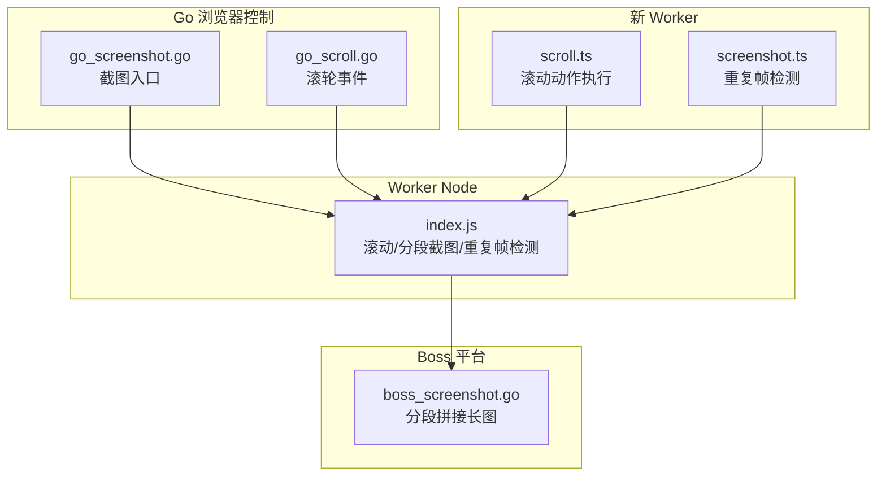
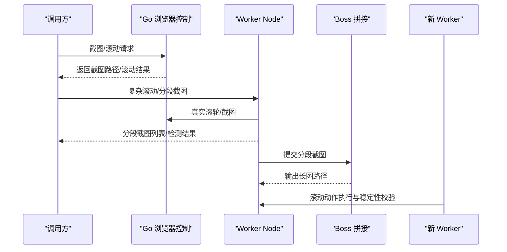
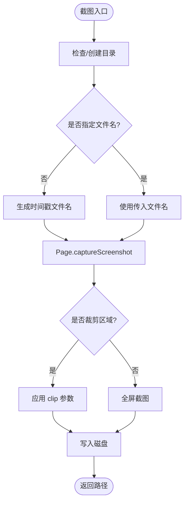
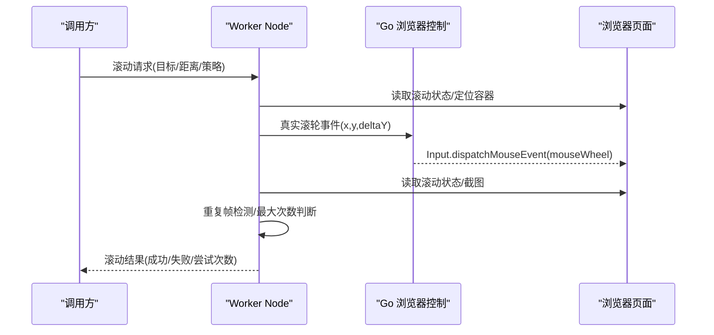
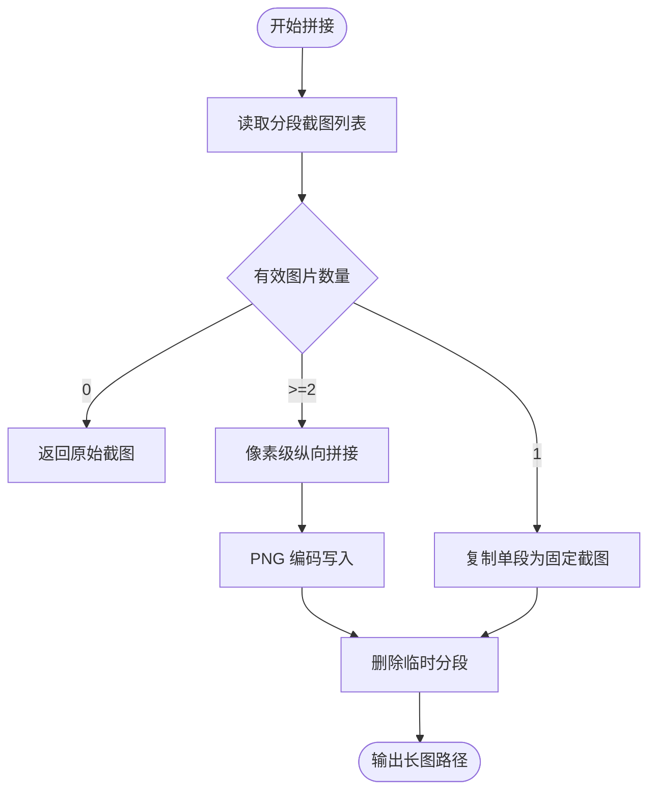
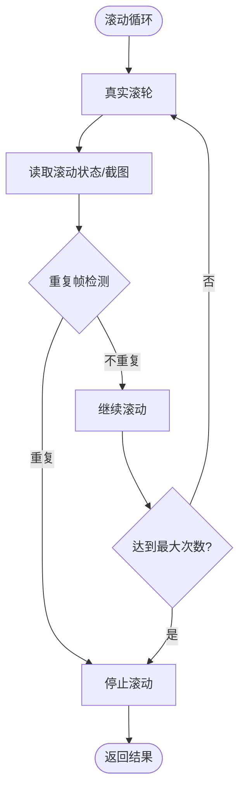

# 截图与滚动控制

<cite>
**本文引用的文件**
- [go_screenshot.go](file://goodhr5/local-agent-go/internal/browser/go_screenshot.go)
- [go_scroll.go](file://goodhr5/local-agent-go/internal/browser/go_scroll.go)
- [index.js](file://goodhr5/local-agent-go/worker-node/src/index.js)
- [screenshot.ts](file://goodhr5/local-agent-go/worker/src/browser/actions/screenshot.ts)
- [scroll.ts](file://goodhr5/local-agent-go/worker/src/browser/actions/scroll.ts)
- [boss_screenshot.go](file://goodhr5/local-agent-go/internal/platforms/boss/screenshot.go)
- [download-manager.ts](file://goodhr5/local-agent-go/worker/src/browser/session/download-manager.ts)
</cite>

## 目录
1. [简介](#简介)
2. [项目结构](#项目结构)
3. [核心组件](#核心组件)
4. [架构总览](#架构总览)
5. [详细组件分析](#详细组件分析)
6. [依赖关系分析](#依赖关系分析)
7. [性能考虑](#性能考虑)
8. [故障排查指南](#故障排查指南)
9. [结论](#结论)
10. [附录](#附录)

## 简介
本文件聚焦于 GoodHR 本地代理中的“截图与滚动控制”能力，覆盖以下主题：
- 页面截图：全屏截图、元素截图、自定义区域截图的实现原理与流程。
- 滚动控制：页面滚动、元素滚动、智能滚动策略（含稳定性检测与自动优化）。
- 截图文件管理：目录设置、文件名生成、格式转换与长图拼接。
- 质量与参数：截图质量配置、滚动参数调整方法。
- 性能调优：重复帧检测、分段截图合并、内存与 I/O 优化建议。

## 项目结构
截图与滚动控制涉及 Go 层浏览器控制库、Worker Node 层的滚动与截图逻辑、平台侧 Boss 的长图拼接，以及新 Worker 的滚动动作实现。关键路径如下：
- Go 浏览器控制库：提供基础截图与滚轮事件能力。
- Worker Node：封装复杂滚动策略、分段截图、重复帧检测、诊断日志。
- Boss 平台：负责将分段截图拼接为一张长图并落盘。
- 新 Worker：提供更清晰的滚动动作执行与稳定性判断。

图表来源
- [go_screenshot.go:14-85](file://goodhr5/local-agent-go/internal/browser/go_screenshot.go#L14-L85)
- [go_scroll.go:8-50](file://goodhr5/local-agent-go/internal/browser/go_scroll.go#L8-L50)
- [index.js:911-957](file://goodhr5/local-agent-go/worker-node/src/index.js#L911-L957)
- [boss_screenshot.go:19-167](file://goodhr5/local-agent-go/internal/platforms/boss/screenshot.go#L19-L167)
- [scroll.ts:54-206](file://goodhr5/local-agent-go/worker/src/browser/actions/scroll.ts#L54-L206)
- [screenshot.ts:209-283](file://goodhr5/local-agent-go/worker/src/browser/actions/screenshot.ts#L209-L283)

章节来源
- [go_screenshot.go:14-85](file://goodhr5/local-agent-go/internal/browser/go_screenshot.go#L14-L85)
- [go_scroll.go:8-50](file://goodhr5/local-agent-go/internal/browser/go_scroll.go#L8-L50)
- [index.js:911-957](file://goodhr5/local-agent-go/worker-node/src/index.js#L911-L957)
- [boss_screenshot.go:19-167](file://goodhr5/local-agent-go/internal/platforms/boss/screenshot.go#L19-L167)
- [scroll.ts:54-206](file://goodhr5/local-agent-go/worker/src/browser/actions/scroll.ts#L54-L206)
- [screenshot.ts:209-283](file://goodhr5/local-agent-go/worker/src/browser/actions/screenshot.ts#L209-L283)

## 核心组件
- 截图入口（Go）：支持全屏、元素、自定义区域截图；默认 PNG；可指定目录与文件名；未指定时生成带时间戳的文件名。
- 滚动入口（Go）：通过 CDP 鼠标滚轮事件驱动页面或元素滚动；支持计算视口中心点作为滚轮落点。
- 滚动与分段截图（Worker Node）：智能选择目标容器、真实滚轮滚动、读取滚动状态、分段截图、重复帧检测、最大滚动次数限制。
- Boss 长图拼接（Go）：将分段截图按重叠区域纵向拼接，输出固定路径的长图，清理临时分段文件。
- 新 Worker 滚动动作：查找目标、移动鼠标、真实滚轮、验证可见性、无进展错误策略。
- 下载扩展补全（新 Worker）：根据文件头为无后缀文件补充常见扩展名。

章节来源
- [go_screenshot.go:14-85](file://goodhr5/local-agent-go/internal/browser/go_screenshot.go#L14-L85)
- [go_scroll.go:8-50](file://goodhr5/local-agent-go/internal/browser/go_scroll.go#L8-L50)
- [index.js:911-957](file://goodhr5/local-agent-go/worker-node/src/index.js#L911-L957)
- [boss_screenshot.go:19-167](file://goodhr5/local-agent-go/internal/platforms/boss/screenshot.go#L19-L167)
- [scroll.ts:54-206](file://goodhr5/local-agent-go/worker/src/browser/actions/scroll.ts#L54-L206)
- [download-manager.ts:214-239](file://goodhr5/local-agent-go/worker/src/browser/session/download-manager.ts#L214-L239)

## 架构总览
截图与滚动控制的端到端流程如下：
- 上层调用触发截图或滚动请求。
- Go 层通过 CDP 完成底层截图与滚轮事件。
- Worker Node 层进行智能滚动、分段截图、重复帧检测与结果聚合。
- Boss 平台对分段截图进行像素级拼接，输出最终长图。
- 新 Worker 提供滚动动作的标准化执行与稳定性判定。

图表来源
- [go_screenshot.go:14-85](file://goodhr5/local-agent-go/internal/browser/go_screenshot.go#L14-L85)
- [go_scroll.go:8-50](file://goodhr5/local-agent-go/internal/browser/go_scroll.go#L8-L50)
- [index.js:911-957](file://goodhr5/local-agent-go/worker-node/src/index.js#L911-L957)
- [boss_screenshot.go:19-167](file://goodhr5/local-agent-go/internal/platforms/boss/screenshot.go#L19-L167)
- [scroll.ts:54-206](file://goodhr5/local-agent-go/worker/src/browser/actions/scroll.ts#L54-L206)

## 详细组件分析

### 截图子系统
- 全屏截图：通过 Page.captureScreenshot 获取整页图像，默认 PNG，写入指定目录或默认临时目录。
- 元素截图：先定位元素边界，再使用 clip 参数截取元素区域。
- 自定义区域截图：传入 clip 参数指定矩形区域进行截图。
- 文件名与目录：
  - 目录：若未指定则使用系统临时目录下的 goodhr-screenshots。
  - 文件名：若未指定则生成 go-screenshot-毫秒时间戳.png；同时提供安全文件名处理函数。
- 格式：当前实现为 PNG；如需其他格式可在上层进行转换。

图表来源
- [go_screenshot.go:14-85](file://goodhr5/local-agent-go/internal/browser/go_screenshot.go#L14-L85)

章节来源
- [go_screenshot.go:14-85](file://goodhr5/local-agent-go/internal/browser/go_screenshot.go#L14-L85)

### 滚动控制子系统
- 页面滚动：在视口中心点发送滚轮事件，距离默认值由参数决定。
- 元素滚动：定位元素中心点，确保坐标在视口范围内，再发送滚轮事件。
- 智能滚动策略（Worker Node）：
  - 选择最近的可滚动容器，避免误滚父容器。
  - 读取滚动状态（scrollTop、maxTop、可滚动方向），动态调整距离。
  - 支持 force_scroll / scroll_full 强制分段截图。
  - 重复帧检测：比较相邻截图像素差异，停止无效滚动。
  - 最大滚动次数限制：防止无限滚动。
- 新 Worker 滚动动作：
  - 查找目标、移动到可视区域、真实滚轮、验证可见性。
  - 无进展错误策略：连续多次滚动后目标仍未靠近可操作区域则抛出 SCROLL_NO_PROGRESS。

图表来源
- [go_scroll.go:8-50](file://goodhr5/local-agent-go/internal/browser/go_scroll.go#L8-L50)
- [index.js:911-957](file://goodhr5/local-agent-go/worker-node/src/index.js#L911-L957)
- [scroll.ts:54-206](file://goodhr5/local-agent-go/worker/src/browser/actions/scroll.ts#L54-L206)

章节来源
- [go_scroll.go:8-50](file://goodhr5/local-agent-go/internal/browser/go_scroll.go#L8-L50)
- [index.js:911-957](file://goodhr5/local-agent-go/worker-node/src/index.js#L911-L957)
- [scroll.ts:54-206](file://goodhr5/local-agent-go/worker/src/browser/actions/scroll.ts#L54-L206)

### 分段截图与长图拼接（Boss）
- 分段截图：Worker Node 根据元素边界与视口高度计算滚动步长与重叠区域，循环滚动并截图，记录分段信息。
- 长图拼接：Boss 层读取分段图片，按重叠区域像素匹配纵向拼接，输出 detail-latest.png，并清理临时分段文件。
- 降级策略：若仅一段或解码失败不足两张，则复制单段为固定截图。

图表来源
- [boss_screenshot.go:19-167](file://goodhr5/local-agent-go/internal/platforms/boss/screenshot.go#L19-L167)

章节来源
- [boss_screenshot.go:19-167](file://goodhr5/local-agent-go/internal/platforms/boss/screenshot.go#L19-L167)

### 重复帧检测与滚动稳定性
- 重复帧检测：对比相邻截图像素差异，阈值用于判断画面是否稳定；当连续多帧无明显变化时停止滚动。
- 滚动稳定性：
  - 读取滚动状态，判断是否可继续滚动。
  - 无进展错误：多次滚动后目标仍未进入可视范围，抛出 SCROLL_NO_PROGRESS。
  - 方向振荡与重试距离不足等诊断码用于定位问题。

图表来源
- [index.js:4269-4340](file://goodhr5/local-agent-go/worker-node/src/index.js#L4269-L4340)
- [scroll.ts:163-178](file://goodhr5/local-agent-go/worker/src/browser/actions/scroll.ts#L163-L178)

章节来源
- [index.js:4269-4340](file://goodhr5/local-agent-go/worker-node/src/index.js#L4269-L4340)
- [scroll.ts:163-178](file://goodhr5/local-agent-go/worker/src/browser/actions/scroll.ts#L163-L178)

### 文件管理与格式转换
- 目录设置：截图默认写入系统临时目录下的 goodhr-screenshots；Boss 拼接输出到岗位运行级目录。
- 文件名生成：未指定时使用时间戳命名；Boss 层提供安全文件名处理，过滤危险字符并截断长度。
- 格式转换：
  - 截图默认 PNG；如需其他格式可在上层进行转换。
  - 下载文件若无扩展名，根据文件头补充常见扩展名。

章节来源
- [go_screenshot.go:58-85](file://goodhr5/local-agent-go/internal/browser/go_screenshot.go#L58-L85)
- [boss_screenshot.go:351-373](file://goodhr5/local-agent-go/internal/platforms/boss/screenshot.go#L351-L373)
- [download-manager.ts:214-239](file://goodhr5/local-agent-go/worker/src/browser/session/download-manager.ts#L214-L239)

## 依赖关系分析
- Go 浏览器控制库被 Worker Node 与新 Worker 共同依赖，提供底层截图与滚轮事件能力。
- Worker Node 依赖 Go 控制库，并向上层提供智能滚动与分段截图服务。
- Boss 平台依赖 Worker Node 的分段截图结果，进行像素级拼接。
- 新 Worker 提供标准化的滚动动作执行与稳定性判断，可与 Worker Node 协同工作。

图表来源
- [go_screenshot.go:14-85](file://goodhr5/local-agent-go/internal/browser/go_screenshot.go#L14-L85)
- [go_scroll.go:8-50](file://goodhr5/local-agent-go/internal/browser/go_scroll.go#L8-L50)
- [index.js:911-957](file://goodhr5/local-agent-go/worker-node/src/index.js#L911-L957)
- [boss_screenshot.go:19-167](file://goodhr5/local-agent-go/internal/platforms/boss/screenshot.go#L19-L167)
- [scroll.ts:54-206](file://goodhr5/local-agent-go/worker/src/browser/actions/scroll.ts#L54-L206)

章节来源
- [go_screenshot.go:14-85](file://goodhr5/local-agent-go/internal/browser/go_screenshot.go#L14-L85)
- [go_scroll.go:8-50](file://goodhr5/local-agent-go/internal/browser/go_scroll.go#L8-L50)
- [index.js:911-957](file://goodhr5/local-agent-go/worker-node/src/index.js#L911-L957)
- [boss_screenshot.go:19-167](file://goodhr5/local-agent-go/internal/platforms/boss/screenshot.go#L19-L167)
- [scroll.ts:54-206](file://goodhr5/local-agent-go/worker/src/browser/actions/scroll.ts#L54-L206)

## 性能考虑
- 重复帧检测：通过像素采样与压缩字节兜底，减少无效滚动与截图开销。
- 分段截图合并：Boss 层按重叠区域拼接，降低长图上传与分析成本。
- 内存与 I/O：Boss 层记录内存与耗时，及时关闭文件流，避免资源泄漏。
- 滚动步长与重叠：根据视口高度与元素边界动态计算，平衡速度与完整性。
- 超时与重试：滚动循环包含最大次数限制，避免长时间阻塞。

[本节为通用性能讨论，不直接分析具体文件]

## 故障排查指南
- 滚动无效：
  - 检查滚动状态读取是否正确，确认目标容器可滚动。
  - 查看重复帧检测结果，判断是否画面已稳定。
  - 关注 SCROLL_NO_PROGRESS 错误，调整距离或目标选择。
- 分段截图缺失：
  - 检查分段文件路径是否存在，确认 Boss 拼接输入完整。
  - 查看解码与写入日志，定位 IO 或编码错误。
- 文件名异常：
  - 使用安全文件名处理函数，避免非法字符。
  - 确认目录权限与空间充足。

章节来源
- [index.js:4269-4340](file://goodhr5/local-agent-go/worker-node/src/index.js#L4269-L4340)
- [scroll.ts:163-178](file://goodhr5/local-agent-go/worker/src/browser/actions/scroll.ts#L163-L178)
- [boss_screenshot.go:19-167](file://goodhr5/local-agent-go/internal/platforms/boss/screenshot.go#L19-L167)
- [boss_screenshot.go:351-373](file://goodhr5/local-agent-go/internal/platforms/boss/screenshot.go#L351-L373)

## 结论
GoodHR 的截图与滚动控制通过 Go 层底层能力与 Worker Node 的智能策略相结合，实现了高效稳定的页面与元素截图、智能滚动与分段长图拼接。配合重复帧检测、最大次数限制与安全文件名处理，系统在复杂场景下仍保持良好性能与可靠性。后续可在此基础上扩展更多格式支持与更精细的质量配置。

[本节为总结性内容，不直接分析具体文件]

## 附录
- 截图质量配置：
  - 当前实现为 PNG；如需更高压缩比或不同格式，可在上层进行转换。
  - 可通过 clip 参数控制截图区域，减少无关内容。
- 滚动参数调整：
  - distance：滚轮距离，影响单次滚动幅度。
  - max_scrolls：最大滚动次数，防止无限滚动。
  - force_scroll / scroll_full：强制分段截图，适用于复杂容器。
  - wait_ms：滚动等待时间，确保页面渲染完成。
- 目录与命名：
  - 目录：默认系统临时目录下的 goodhr-screenshots；Boss 输出到岗位运行级目录。
  - 命名：时间戳 + 扩展名；Boss 层提供安全文件名处理。

章节来源
- [go_screenshot.go:58-85](file://goodhr5/local-agent-go/internal/browser/go_screenshot.go#L58-L85)
- [index.js:3763-3804](file://goodhr5/local-agent-go/worker-node/src/index.js#L3763-L3804)
- [boss_screenshot.go:351-373](file://goodhr5/local-agent-go/internal/platforms/boss/screenshot.go#L351-L373)