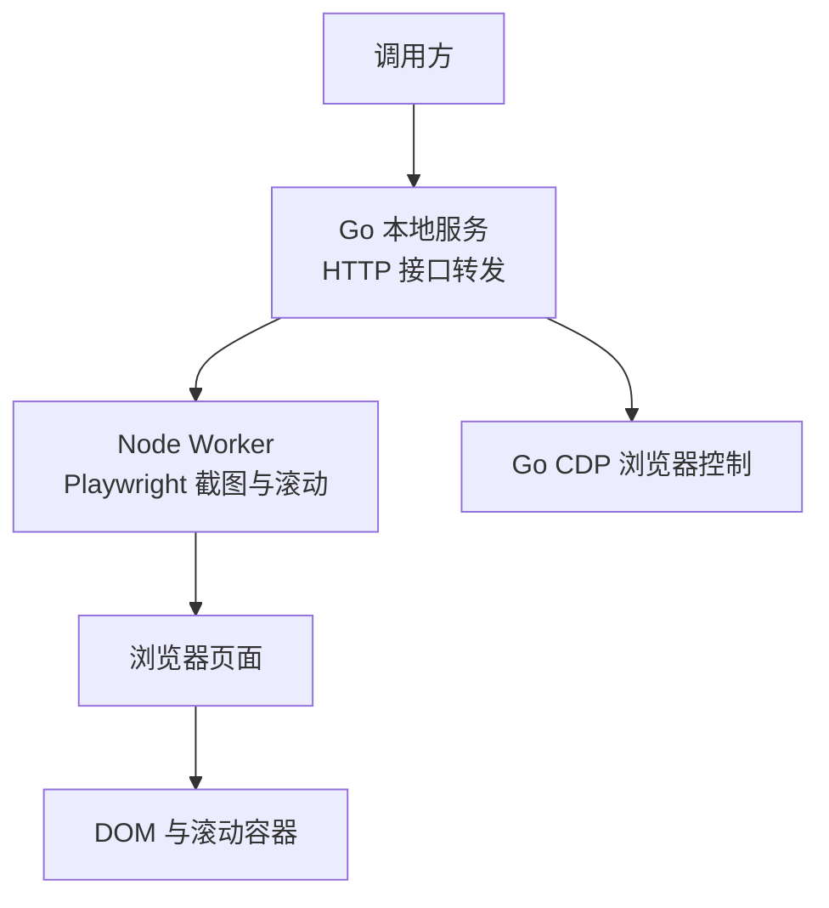
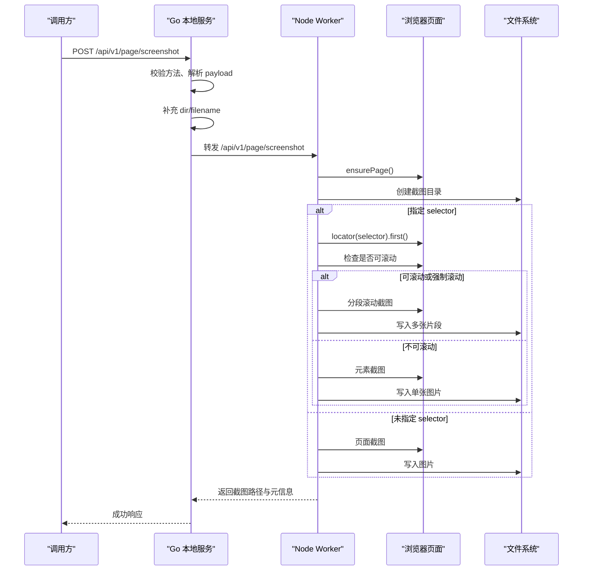
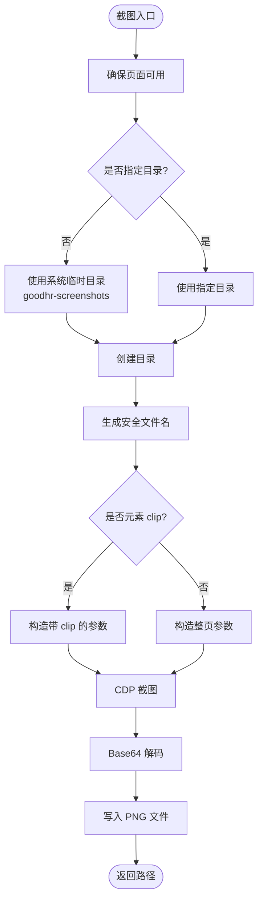
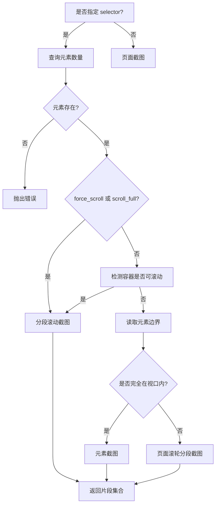
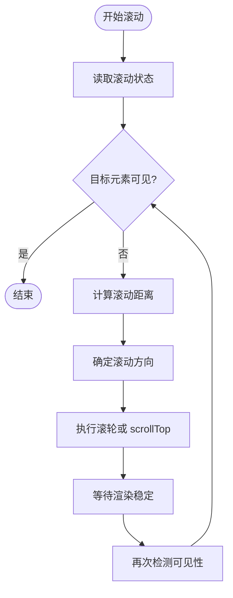
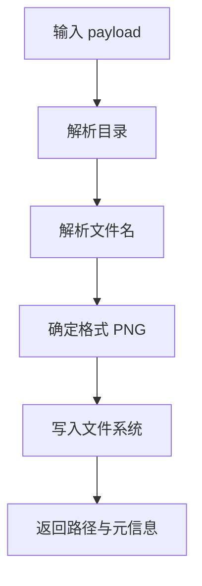
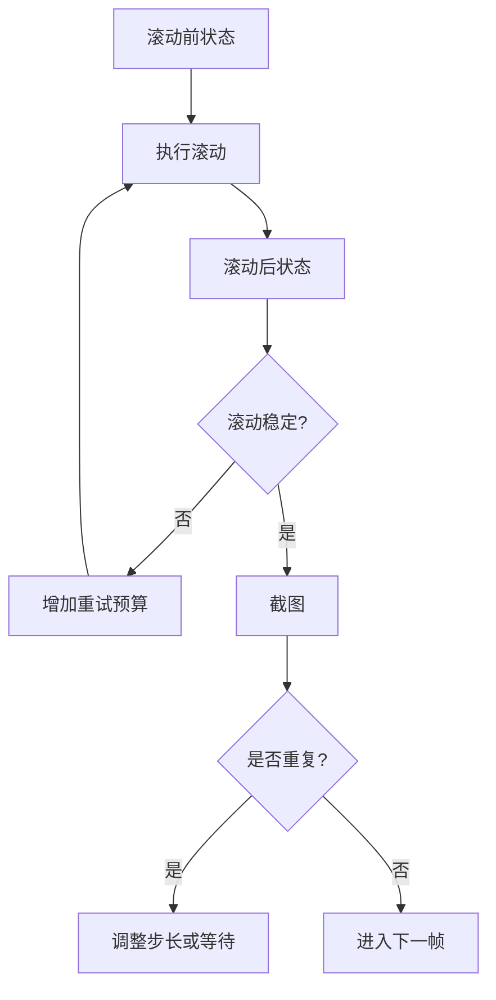
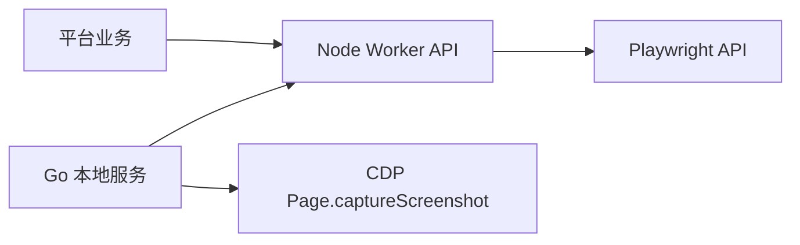

# 截图与滚动控制

<cite>
**本文引用的文件**   
- [go_screenshot.go](file://goodhr5/local-agent-go/internal/browser/go_screenshot.go)
- [server.go](file://goodhr5/local-agent-go/internal/app/server.go)
- [index.js](file://goodhr5/local-agent-go/worker-node/src/index.js)
- [boss-scroll-anchor.test.js](file://goodhr5/local-agent-go/worker-node/src/boss-scroll-anchor.test.js)
- [boss-scroll-diagnostic.test.js](file://goodhr5/local-agent-go/worker-node/src/boss-scroll-diagnostic.test.js)
- [test-screenshot.js](file://goodhr5/local-agent-go/worker-node/src/test-screenshot.js)
</cite>

## 目录
1. [简介](#简介)
2. [项目结构定位](#项目结构定位)
3. [核心能力总览](#核心能力总览)
4. [架构总览](#架构总览)
5. [页面截图实现](#页面截图实现)
6. [元素截图与自定义区域截图](#元素截图与自定义区域截图)
7. [滚动控制机制](#滚动控制机制)
8. [截图文件管理](#截图文件管理)
9. [滚动稳定性检测与自动优化](#滚动稳定性检测与自动优化)
10. [截图质量配置与滚动参数调整](#截图质量配置与滚动参数调整)
11. [依赖关系分析](#依赖关系分析)
12. [性能调优建议](#性能调优建议)
13. [故障排查指南](#故障排查指南)
14. [结论](#结论)

## 简介
本文围绕 GoodHR 本地 Agent 的截图与滚动控制能力，系统性说明以下主题：
- 页面截图、元素截图、自定义区域截图的实现原理。
- 页面滚动、元素滚动、智能滚动策略。
- 截图文件目录设置、文件名生成、格式处理。
- 滚动稳定性检测、自动滚动优化、性能调优方案。
- 截图质量配置与滚动参数调整方法。

该文档面向开发者、测试人员与平台运营人员，既提供代码级依据，也给出可操作的配置与排错建议。

## 项目结构定位
截图与滚动控制主要涉及三层：
- Go 本地服务层：负责接收外部请求、转发到 Node Worker、兜底使用 Go CDP 截图。
- Node Worker 层：基于 Playwright 完成页面与元素截图、分段滚动截图、滚动状态诊断。
- 平台业务层：Boss、猎聘等平台在候选人列表、详情页等场景中使用滚动与截图能力。

**图表来源**
- [server.go:845-870](file://goodhr5/local-agent-go/internal/app/server.go#L845-L870)
- [go_screenshot.go:14-85](file://goodhr5/local-agent-go/internal/browser/go_screenshot.go#L14-L85)
- [index.js:4836-4999](file://goodhr5/local-agent-go/worker-node/src/index.js#L4836-L4999)

**章节来源**
- [server.go:845-870](file://goodhr5/local-agent-go/internal/app/server.go#L845-L870)
- [go_screenshot.go:14-85](file://goodhr5/local-agent-go/internal/browser/go_screenshot.go#L14-L85)
- [index.js:4836-4999](file://goodhr5/local-agent-go/worker-node/src/index.js#L4836-L4999)

## 核心能力总览
- 页面截图：支持全屏截图、视口截图、从表面捕获、超出视口捕获。
- 元素截图：通过选择器定位元素后截图；若元素所在容器可滚动，则自动分段滚动截图。
- 自定义区域截图：通过 clip 或视口裁剪方式截取指定区域。
- 滚动控制：支持页面滚轮滚动、元素 scrollTop 滚动、智能滚动距离与稳定性判断。
- 文件管理：统一截图目录、安全文件名、PNG 输出、可选分段截图结果聚合。
- 稳定性与优化：滚动重试预算、自适应步长、等待时间、去重检测、诊断日志。

**章节来源**
- [go_screenshot.go:14-85](file://goodhr5/local-agent-go/internal/browser/go_screenshot.go#L14-L85)
- [index.js:4836-4999](file://goodhr5/local-agent-go/worker-node/src/index.js#L4836-L4999)
- [index.js:3260-3955](file://goodhr5/local-agent-go/worker-node/src/index.js#L3260-L3955)

## 架构总览
截图与滚动控制的端到端流程如下：

**图表来源**
- [server.go:845-870](file://goodhr5/local-agent-go/internal/app/server.go#L845-L870)
- [index.js:4836-4999](file://goodhr5/local-agent-go/worker-node/src/index.js#L4836-L4999)

## 页面截图实现
Go 侧提供两种截图入口：
- ScreenshotPage：对当前页面进行截图。
- ScreenshotElement：先计算元素 clip，再调用内部锁定截图逻辑。

关键实现要点：
- 默认截图目录为系统临时目录下的 goodhr-screenshots。
- 默认文件名包含毫秒时间戳，避免覆盖。
- 使用 CDP Page.captureScreenshot，参数包括 PNG 格式、fromSurface、captureBeyondViewport。
- 若传入 clip，则按区域截图；否则整页截图。

**图表来源**
- [go_screenshot.go:14-85](file://goodhr5/local-agent-go/internal/browser/go_screenshot.go#L14-L85)

**章节来源**
- [go_screenshot.go:14-85](file://goodhr5/local-agent-go/internal/browser/go_screenshot.go#L14-L85)

## 元素截图与自定义区域截图
Node Worker 的元素截图流程更复杂，因为需要考虑容器是否可滚动：
- 如果指定 selector，先查询元素数量，不存在则报错。
- 如果 force_scroll 或 scroll_full 为真，直接走分段滚动截图。
- 否则读取元素的滚动信息 detailScrollInfo，若容器可滚动，则走分段滚动截图。
- 若容器不可滚动且元素完全在视口内，则直接元素截图。
- 若元素部分超出视口或强制滚动，则走页面滚轮分段截图。

分段截图会返回多个片段，并附带 overlap、parts_count、_scroll_debug 等元信息。

**图表来源**
- [index.js:4836-4999](file://goodhr5/local-agent-go/worker-node/src/index.js#L4836-L4999)
- [index.js:3260-3955](file://goodhr5/local-agent-go/worker-node/src/index.js#L3260-L3955)

**章节来源**
- [index.js:4836-4999](file://goodhr5/local-agent-go/worker-node/src/index.js#L4836-L4999)
- [index.js:3260-3955](file://goodhr5/local-agent-go/worker-node/src/index.js#L3260-L3955)

## 滚动控制机制
滚动控制分为三类：
- 页面滚动：通过鼠标滚轮逐步滚动到页面底部，支持时长限制、缓动函数、阈值判断。
- 元素滚动：通过元素 scrollTop 滚动，适用于详情容器、列表容器。
- 智能滚动策略：根据目标元素位置、容器滚动状态、可见性检测结果动态决定滚动方向与步长。

关键实现要点：
- 页面滚动到底部函数会在指定时长内逐步滚动，使用缓动进度和随机等待，模拟真实用户行为。
- 页面滚动状态检测会识别 document.scrollingElement 或具体可滚动节点，并判断是否还能继续滚动。
- 滚轮直到元素可见函数会多次尝试滚动，记录 before/after 视图与滚动状态，用于诊断。
- Boss 平台的滚动锚点与安全区判断，会根据候选卡片与视口距离自适应滚轮步长，扩大重试预算。

**图表来源**
- [index.js:1401-1430](file://goodhr5/local-agent-go/worker-node/src/index.js#L1401-L1430)
- [index.js:4269-4290](file://goodhr5/local-agent-go/worker-node/src/index.js#L4269-L4290)
- [index.js:6369-6480](file://goodhr5/local-agent-go/worker-node/src/index.js#L6369-L6480)

**章节来源**
- [index.js:1401-1430](file://goodhr5/local-agent-go/worker-node/src/index.js#L1401-L1430)
- [index.js:4269-4290](file://goodhr5/local-agent-go/worker-node/src/index.js#L4269-L4290)
- [index.js:6369-6480](file://goodhr5/local-agent-go/worker-node/src/index.js#L6369-L6480)

## 截图文件管理
截图文件管理包括目录设置、文件名生成、格式处理：
- 目录设置：
  - Go 侧默认目录为系统临时目录下的 goodhr-screenshots。
  - Node Worker 侧优先使用 payload.dir 或 payload.directory，否则同样使用系统临时目录下的 goodhr-screenshots。
  - Go 本地服务在转发截图请求时，若未指定目录，会填充配置中的 ScreenshotsDir。
- 文件名生成：
  - Go 侧 safeFilename 会清理基础文件名，为空则生成 go-screenshot-毫秒.png。
  - Node Worker 侧 safeFilename 会清理文件名，默认 page-screenshot.png。
  - Go 本地服务在未指定 filename 时生成 screenshot-毫秒.png。
- 格式处理：
  - Go 侧使用 PNG 格式，Base64 解码后写入磁盘。
  - Node Worker 侧使用 Playwright 的 type png 截图。

**图表来源**
- [go_screenshot.go:53-94](file://goodhr5/local-agent-go/internal/browser/go_screenshot.go#L53-L94)
- [index.js:4854-4876](file://goodhr5/local-agent-go/worker-node/src/index.js#L4854-L4876)
- [server.go:857-863](file://goodhr5/local-agent-go/internal/app/server.go#L857-L863)

**章节来源**
- [go_screenshot.go:53-94](file://goodhr5/local-agent-go/internal/browser/go_screenshot.go#L53-L94)
- [index.js:4854-4876](file://goodhr5/local-agent-go/worker-node/src/index.js#L4854-L4876)
- [server.go:857-863](file://goodhr5/local-agent-go/internal/app/server.go#L857-L863)

## 滚动稳定性检测与自动优化
滚动稳定性检测与自动优化主要体现在：
- 滚动状态对比：检测滚动容器是否一致，计算滚动增量，避免不同容器导致的误判。
- 重试预算：根据初始距离与步长动态扩展重试次数，防止远目标无法到达。
- 自适应步长：根据目标与视口的垂直差距调整滚轮步长，接近安全区时恢复基础步长。
- 去重检测：比较前后截图缓冲区长度与采样字节，判断是否为重复截图，减少无效滚动。
- 等待时间：首次渲染等待、固定等待、滚动间隔等待，保证页面稳定后再截图。

**图表来源**
- [boss-scroll-diagnostic.test.js:44-87](file://goodhr5/local-agent-go/worker-node/src/boss-scroll-diagnostic.test.js#L44-L87)
- [boss-scroll-anchor.test.js:74-123](file://goodhr5/local-agent-go/worker-node/src/boss-scroll-anchor.test.js#L74-L123)
- [test-screenshot.js:131-158](file://goodhr5/local-agent-go/worker-node/src/test-screenshot.js#L131-L158)

**章节来源**
- [boss-scroll-diagnostic.test.js:44-87](file://goodhr5/local-agent-go/worker-node/src/boss-scroll-diagnostic.test.js#L44-L87)
- [boss-scroll-anchor.test.js:74-123](file://goodhr5/local-agent-go/worker-node/src/boss-scroll-anchor.test.js#L74-L123)
- [test-screenshot.js:131-158](file://goodhr5/local-agent-go/worker-node/src/test-screenshot.js#L131-L158)

## 截图质量配置与滚动参数调整
截图质量与滚动参数可通过 payload 字段调整：
- 截图质量：
  - format：Go 侧固定为 png。
  - fromSurface：Go 侧启用，提升底层渲染质量。
  - captureBeyondViewport：Go 侧启用，支持超出视口截图。
  - type：Node Worker 侧使用 png。
- 滚动参数：
  - max_scrolls 或 screenshot_max_scrolls：控制最大滚动次数。
  - distance 或 y：基础滚动距离。
  - wait_ms：滚动等待时间。
  - viewport_margin 或 margin：视口边距，影响可见性判断。
  - force_scroll 或 scroll_full：强制分段滚动截图。
  - bottom_threshold：滚动到底部的阈值。
  - scroll_to_bottom_duration_ms：滚动到底部的总时长。

建议：
- 对于长列表，适当增大 max_scrolls 与 conservativeDelta，避免漏截。
- 对于动态加载页面，增大 initialCaptureWaitMs 与 captureWaitMs，确保内容渲染完成。
- 对于不稳定滚动容器，启用 diagnostic_trace_id，查看详细 _scroll_debug 信息。

**章节来源**
- [go_screenshot.go:69-73](file://goodhr5/local-agent-go/internal/browser/go_screenshot.go#L69-L73)
- [index.js:3598-3610](file://goodhr5/local-agent-go/worker-node/src/index.js#L3598-L3610)
- [index.js:3946-3955](file://goodhr5/local-agent-go/worker-node/src/index.js#L3946-L3955)
- [index.js:1401-1430](file://goodhr5/local-agent-go/worker-node/src/index.js#L1401-L1430)

## 依赖关系分析
截图与滚动控制的关键依赖关系如下：
- Go 本地服务依赖 Node Worker 的 /api/v1/page/screenshot 接口。
- Node Worker 依赖 Playwright 的 locator、screenshot、mouse.wheel、evaluate 等 API。
- Go CDP 截图依赖 Page.captureScreenshot。
- 平台业务依赖滚动稳定性检测与分段截图结果。

**图表来源**
- [server.go:845-870](file://goodhr5/local-agent-go/internal/app/server.go#L845-L870)
- [go_screenshot.go:73-85](file://goodhr5/local-agent-go/internal/browser/go_screenshot.go#L73-L85)
- [index.js:4836-4999](file://goodhr5/local-agent-go/worker-node/src/index.js#L4836-L4999)

**章节来源**
- [server.go:845-870](file://goodhr5/local-agent-go/internal/app/server.go#L845-L870)
- [go_screenshot.go:73-85](file://goodhr5/local-agent-go/internal/browser/go_screenshot.go#L73-L85)
- [index.js:4836-4999](file://goodhr5/local-agent-go/worker-node/src/index.js#L4836-L4999)

## 性能调优建议
- 减少不必要的滚动：
  - 优先使用元素截图，仅在容器可滚动或元素超出视口时启用分段滚动。
  - 合理设置 viewport_margin，避免频繁触发滚动。
- 控制滚动次数：
  - 根据页面高度估算 estimated，设置合理的 max_scrolls。
  - 使用 conservativeDelta 降低滚动幅度，提高稳定性。
- 优化等待时间：
  - 首次渲染等待 initialCaptureWaitMs 应根据页面复杂度调整。
  - 滚动间隔等待 captureWaitMs 应足够让懒加载内容渲染。
- 利用诊断日志：
  - 启用 diagnostic_trace_id，查看 _scroll_debug 与 detailDiagnostic 日志。
  - 关注 parts_count、overlap、wheel_scroll、scrollable_container 等字段。

[本节为通用指导，不直接分析具体文件]

## 故障排查指南
常见问题与排查步骤：
- 截图元素不存在：
  - 检查 selector 是否正确，确认元素已加载。
  - 查看 Node Worker 的诊断日志，确认 locator_count。
- 滚动无效：
  - 检查滚动容器是否可滚动，确认 overflowY 与 scrollHeight/clientHeight。
  - 查看滚动状态对比，确认 target 是否一致。
- 截图重复：
  - 检查去重逻辑，确认缓冲区长度与采样字节比较。
  - 调整滚动距离与等待时间，避免重复截图。
- 文件路径错误：
  - 确认 dir 与 directory 优先级，检查 ScreenshotsDir 配置。
  - 检查文件名是否被安全清理，避免非法字符。

**章节来源**
- [index.js:4877-4892](file://goodhr5/local-agent-go/worker-node/src/index.js#L4877-L4892)
- [index.js:3575-3587](file://goodhr5/local-agent-go/worker-node/src/index.js#L3575-L3587)
- [test-screenshot.js:131-158](file://goodhr5/local-agent-go/worker-node/src/test-screenshot.js#L131-L158)

## 结论
GoodHR 的截图与滚动控制体系以 Go 本地服务为入口，Node Worker 为核心执行层，结合 Playwright 与 CDP 能力，实现了稳定的页面截图、元素截图与分段滚动截图。通过滚动稳定性检测、自适应步长、重试预算与诊断日志，系统在复杂页面与动态加载场景中仍能保持较高的可靠性。实际使用中，建议根据页面特性调整滚动参数与等待时间，充分利用诊断信息优化性能与稳定性。

[本节为总结性内容，不直接分析具体文件]