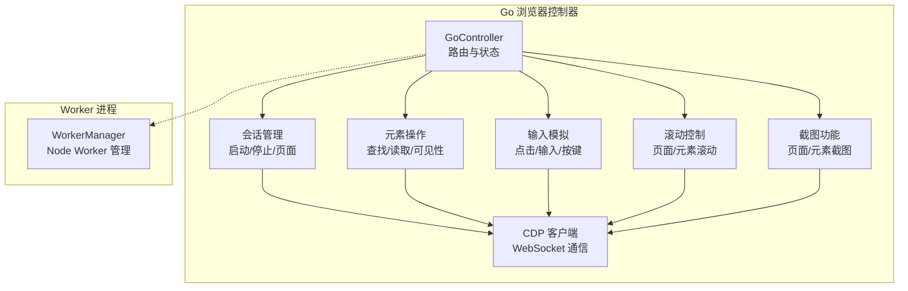
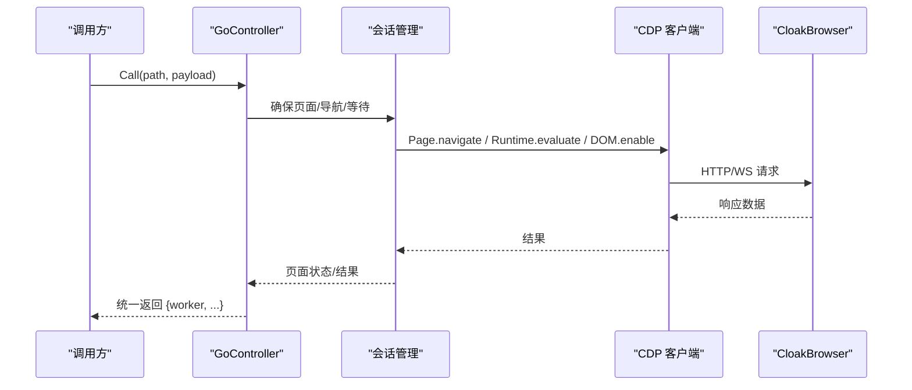
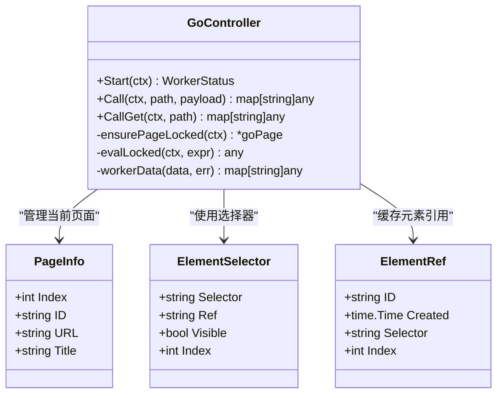
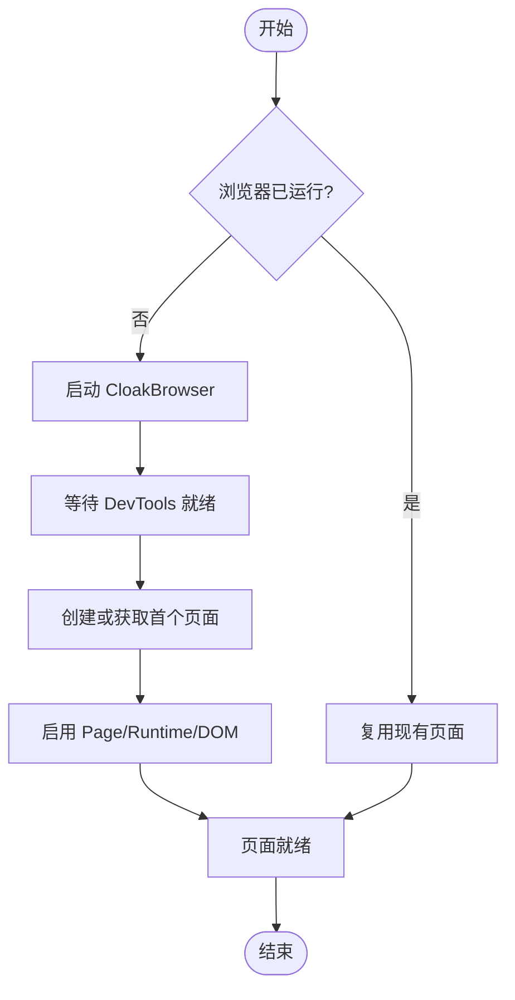
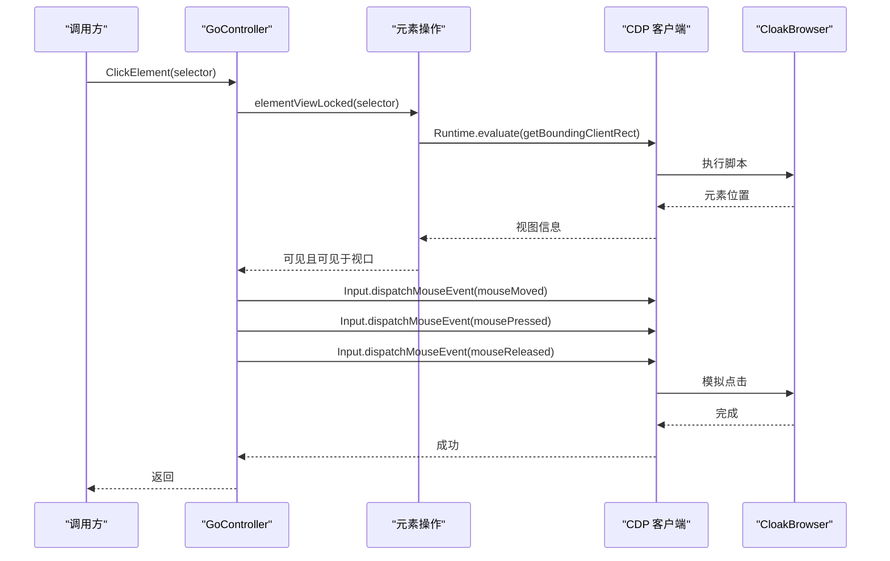
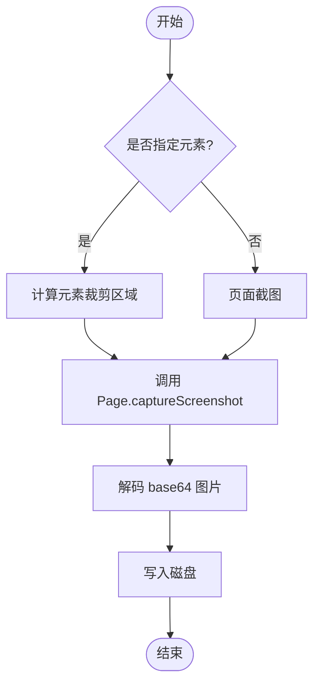
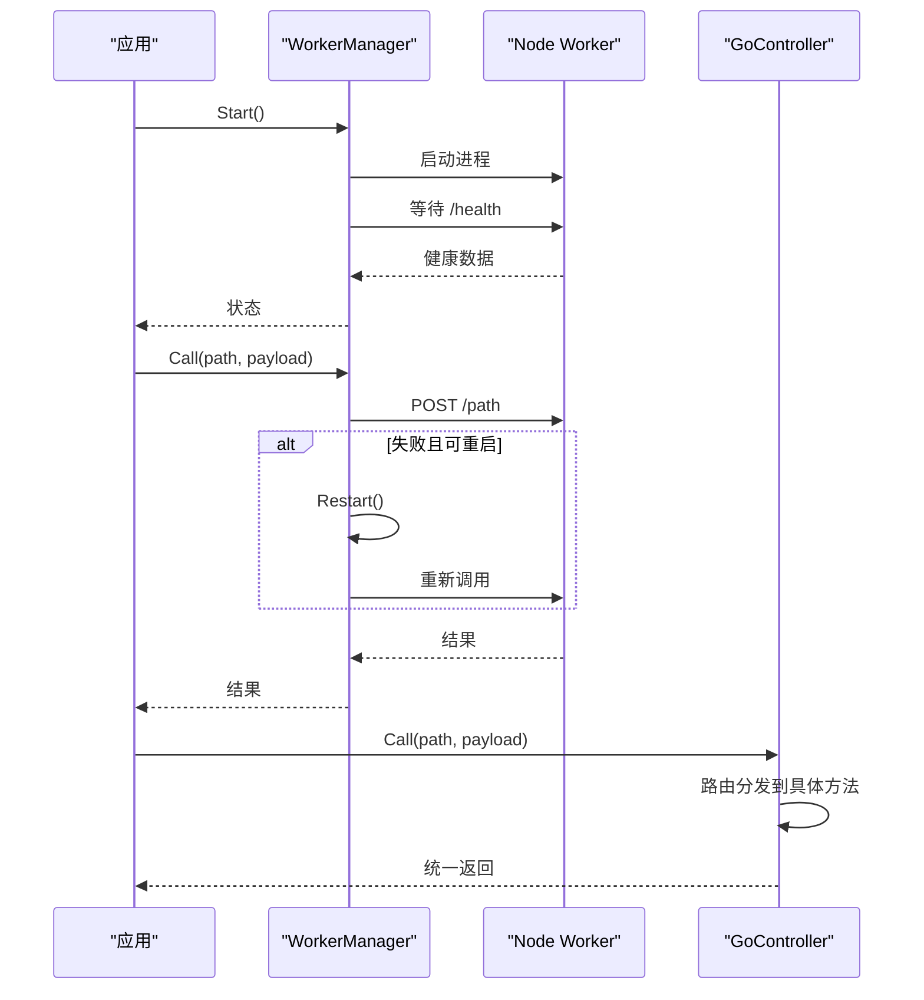
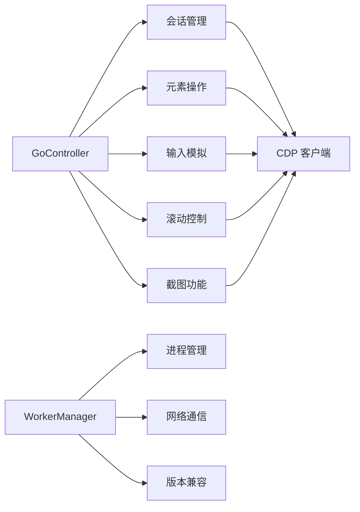

# 浏览器控制器

<cite>
**本文引用的文件**
- [go_controller.go](file://goodhr5/local-agent-go/internal/browser/go_controller.go)
- [worker.go](file://goodhr5/local-agent-go/internal/browser/worker.go)
- [go_session.go](file://goodhr5/local-agent-go/internal/browser/go_session.go)
- [go_element.go](file://goodhr5/local-agent-go/internal/browser/go_element.go)
- [go_actions.go](file://goodhr5/local-agent-go/internal/browser/go_actions.go)
- [go_screenshot.go](file://goodhr5/local-agent-go/internal/browser/go_screenshot.go)
- [go_scroll.go](file://goodhr5/local-agent-go/internal/browser/go_scroll.go)
- [go_input.go](file://goodhr5/local-agent-go/internal/browser/go_input.go)
- [go_cdp.go](file://goodhr5/local-agent-go/internal/browser/go_cdp.go)
- [viewport.go](file://goodhr5/local-agent-go/internal/browser/viewport.go)
</cite>

## 目录
1. [简介](#简介)
2. [项目结构](#项目结构)
3. [核心组件](#核心组件)
4. [架构总览](#架构总览)
5. [详细组件分析](#详细组件分析)
6. [依赖关系分析](#依赖关系分析)
7. [性能考量](#性能考量)
8. [故障排查指南](#故障排查指南)
9. [结论](#结论)

## 简介
本文件面向 GoodHR 本地 Agent 中的“浏览器控制器”子系统，聚焦 Go 直连 CloakBrowser 的实验性实现。文档解释 GoController 的设计模式、页面生命周期管理、多标签页支持；详细说明页面操作封装（导航控制、元素查找、用户交互模拟）；阐述截图、滚动、输入处理的实现原理与使用方法；总结错误处理策略、超时控制、资源清理机制；并说明与 Worker 进程的协作模式和任务分发机制。

## 项目结构
浏览器控制器位于 internal/browser 包，按职责拆分为多个文件：
- go_controller.go：控制器入口、路由分发、操作分类清单、数据结构定义
- go_session.go：浏览器进程启动/停止、页面创建/切换、URL 读取/打开/刷新/等待加载
- go_element.go：元素查找、引用缓存、文本/属性/HTML 读取、可视区域判断
- go_input.go：点击、输入、按键事件模拟
- go_scroll.go：页面/元素滚动，基于 CDP 鼠标滚轮事件
- go_screenshot.go：页面/元素截图，基于 CDP Page.captureScreenshot
- go_cdp.go：自定义 WebSocket 客户端，封装 CDP 调用与消息收发
- worker.go：Node Browser Worker 管理器，负责进程启停、健康检查、重试与日志
- viewport.go：统一固定视口尺寸常量

图表来源
- [go_controller.go:109-374](file://goodhr5/local-agent-go/internal/browser/go_controller.go#L109-L374)
- [go_session.go:18-308](file://goodhr5/local-agent-go/internal/browser/go_session.go#L18-L308)
- [go_element.go:11-330](file://goodhr5/local-agent-go/internal/browser/go_element.go#L11-L330)
- [go_input.go:11-173](file://goodhr5/local-agent-go/internal/browser/go_input.go#L11-L173)
- [go_scroll.go:8-81](file://goodhr5/local-agent-go/internal/browser/go_scroll.go#L8-L81)
- [go_screenshot.go:14-95](file://goodhr5/local-agent-go/internal/browser/go_screenshot.go#L14-L95)
- [go_cdp.go:21-119](file://goodhr5/local-agent-go/internal/browser/go_cdp.go#L21-L119)
- [worker.go:35-701](file://goodhr5/local-agent-go/internal/browser/worker.go#L35-L701)

章节来源
- [go_controller.go:1-108](file://goodhr5/local-agent-go/internal/browser/go_controller.go#L1-L108)
- [viewport.go:1-15](file://goodhr5/local-agent-go/internal/browser/viewport.go#L1-L15)

## 核心组件
- GoController：实验性 Go 浏览器控制器，提供与 Node Worker 兼容的 Call/CALLGet 路由形态，内部维护当前页面、元素引用、下载记录等状态。
- WorkerManager：Node Browser Worker 进程管理器，负责启动/停止/重启 Worker、端口复用、健康检查、错误重试与日志输出。
- CDP 客户端：自实现的轻量 WebSocket 客户端，用于与 CloakBrowser 的调试端口进行 CDP 协议通信。
- 页面与会话：封装浏览器进程生命周期、目标页面列表获取、页面切换、导航与加载等待。
- 元素与交互：封装元素查找、引用缓存、文本/属性/HTML 读取、可视性与视口检测、点击/输入/按键模拟、滚动。
- 截图：支持页面或元素截图，通过 CDP 捕获并落盘。

章节来源
- [go_controller.go:109-374](file://goodhr5/local-agent-go/internal/browser/go_controller.go#L109-L374)
- [worker.go:35-701](file://goodhr5/local-agent-go/internal/browser/worker.go#L35-L701)
- [go_cdp.go:21-119](file://goodhr5/local-agent-go/internal/browser/go_cdp.go#L21-L119)
- [go_session.go:18-308](file://goodhr5/local-agent-go/internal/browser/go_session.go#L18-L308)
- [go_element.go:11-330](file://goodhr5/local-agent-go/internal/browser/go_element.go#L11-L330)
- [go_input.go:11-173](file://goodhr5/local-agent-go/internal/browser/go_input.go#L11-L173)
- [go_scroll.go:8-81](file://goodhr5/local-agent-go/internal/browser/go_scroll.go#L8-L81)
- [go_screenshot.go:14-95](file://goodhr5/local-agent-go/internal/browser/go_screenshot.go#L14-L95)

## 架构总览
Go 控制器通过 CDP 直接控制 CloakBrowser，同时暴露与 Node Worker 一致的 API 路由，便于上层平台逻辑以统一方式调用。WorkerManager 则管理 Node 侧的浏览器控制进程，具备自动重启与兼容性校验能力。

图表来源
- [go_controller.go:259-335](file://goodhr5/local-agent-go/internal/browser/go_controller.go#L259-L335)
- [go_session.go:198-240](file://goodhr5/local-agent-go/internal/browser/go_session.go#L198-L240)
- [go_cdp.go:48-119](file://goodhr5/local-agent-go/internal/browser/go_cdp.go#L48-L119)

## 详细组件分析

### GoController 设计模式与路由分发
- 设计模式
  - 适配器模式：将 Go 控制器的方法映射为 Node Worker 的路由路径，保持上层调用一致。
  - 组合模式：基础原子操作（FindOne/ClickElement/ScrollPage/ScreenshotPage）组合成通用动作（如 EnsureElementVisible、ClickListItemByIndex）。
  - 工厂模式：NewGoController/NewGoControllerWithOptions 构造控制器实例。
- 路由分发
  - Call 方法根据 path 分派到具体方法，如 /api/v1/page/open、/api/v1/page/screenshot、/api/v1/boss/candidates/...。
  - CallGet 提供 GET 路由，如 /health、/api/v1/page/cookies。
- 操作分层
  - OperationBasic：基础操作，放在控制器文件内。
  - OperationComposite：通用组合动作，建议迁移至 actions 层。
  - OperationPlatform：平台个性化动作，建议迁移至平台运行时。

图表来源
- [go_controller.go:109-374](file://goodhr5/local-agent-go/internal/browser/go_controller.go#L109-L374)

章节来源
- [go_controller.go:27-108](file://goodhr5/local-agent-go/internal/browser/go_controller.go#L27-L108)
- [go_controller.go:259-374](file://goodhr5/local-agent-go/internal/browser/go_controller.go#L259-L374)

### 页面生命周期管理
- 启动浏览器
  - StartBrowser 解析可执行文件、分配调试端口、启动进程、等待 DevTools 就绪、创建首个页面、启用 CDP 能力。
- 关闭浏览器
  - StopBrowser 关闭 CDP 连接、终止进程、清理状态。
- 页面管理
  - ListPages 列出所有可用页面（过滤无 WebSocket 的目标）。
  - UsePage 切换到指定索引页面，重建 CDP 连接并重置元素引用。
  - OpenPage 导航到新 URL，等待页面 readyState 为 complete/interactive。
  - ReloadPage 刷新页面并等待就绪。
  - WaitPageLoad 轮询 document.readyState 直到就绪。
- 当前 URL
  - CurrentURL 通过 JS 读取 location.href，更新 page.URL。

图表来源
- [go_session.go:18-103](file://goodhr5/local-agent-go/internal/browser/go_session.go#L18-L103)
- [go_session.go:310-350](file://goodhr5/local-agent-go/internal/browser/go_session.go#L310-L350)

章节来源
- [go_session.go:18-308](file://goodhr5/local-agent-go/internal/browser/go_session.go#L18-L308)

### 多标签页支持
- 多标签页通过浏览器的多目标页面模型实现。ListPages 从 /json/list 获取所有目标，过滤出带 WebSocketDebuggerURL 的有效页面。
- UsePage 根据索引切换当前页面，关闭旧 CDP 连接并建立新连接，同时清空元素引用以避免跨页面污染。
- 每个页面对象包含 ID、URL、Title 和 CDP 客户端，保证操作在正确的上下文中执行。

章节来源
- [go_session.go:134-177](file://goodhr5/local-agent-go/internal/browser/go_session.go#L134-L177)
- [go_session.go:352-373](file://goodhr5/local-agent-go/internal/browser/go_session.go#L352-L373)

### 页面操作封装
- 导航控制
  - OpenPage：导航到指定 URL，等待页面加载完成。
  - ReloadPage：刷新页面并等待就绪。
  - WaitPageLoad：轮询 document.readyState。
- 元素查找
  - FindOne/FindAll：执行 document.querySelectorAll，可选可见性过滤，支持字段提取，返回元素信息并缓存引用。
  - RememberElement/GetElementByRef/ClearElementRefs：元素引用缓存与清理。
- 用户交互模拟
  - ClickElement：先确保元素可见且在视口内，再派发 mouseMoved/mousePressed/mouseReleased。
  - FillElement：选中并清空后插入文本，校验最终值。
  - PressKey：解析跨平台组合键，派发 keyDown/keyUp。
- 滚动控制
  - ScrollPage：计算视口中心点，派发鼠标滚轮事件。
  - ScrollElement：定位元素中心点，限制坐标在视口范围内，派发滚轮事件。
  - EnsureElementVisible：循环滚动直到元素进入视口，记录每次尝试视图信息。

图表来源
- [go_input.go:11-41](file://goodhr5/local-agent-go/internal/browser/go_input.go#L11-L41)
- [go_element.go:184-238](file://goodhr5/local-agent-go/internal/browser/go_element.go#L184-L238)
- [go_cdp.go:48-119](file://goodhr5/local-agent-go/internal/browser/go_cdp.go#L48-L119)

章节来源
- [go_element.go:11-330](file://goodhr5/local-agent-go/internal/browser/go_element.go#L11-L330)
- [go_input.go:11-173](file://goodhr5/local-agent-go/internal/browser/go_input.go#L11-L173)
- [go_scroll.go:8-81](file://goodhr5/local-agent-go/internal/browser/go_scroll.go#L8-L81)
- [go_actions.go:10-184](file://goodhr5/local-agent-go/internal/browser/go_actions.go#L10-L184)

### 截图功能
- ScreenshotPage：捕获整个页面，支持 full_page 参数。
- ScreenshotElement：先计算元素裁剪区域，再调用 Page.captureScreenshot。
- 截图流程：生成安全文件名、创建目录、解码 base64 图片数据、写入磁盘。
- 兜底策略：screenshotFromPayload 优先尝试元素截图，失败回退到页面截图。

图表来源
- [go_screenshot.go:14-95](file://goodhr5/local-agent-go/internal/browser/go_screenshot.go#L14-L95)
- [go_element.go:240-255](file://goodhr5/local-agent-go/internal/browser/go_element.go#L240-L255)

章节来源
- [go_screenshot.go:14-95](file://goodhr5/local-agent-go/internal/browser/go_screenshot.go#L14-L95)

### 滚动控制
- ScrollPage：默认滚动距离 700，计算视口中心点，派发滚轮事件。
- ScrollElement：计算元素中心点并限制在视口范围内，派发滚轮事件。
- dispatchWheelLocked：通过 CDP 的 Input.dispatchMouseEvent 模拟真实滚轮，不注入页面滚动脚本，避免干扰页面行为。

章节来源
- [go_scroll.go:8-81](file://goodhr5/local-agent-go/internal/browser/go_scroll.go#L8-L81)

### 输入处理
- ClickElement：先验证元素可见且在视口内，再派发鼠标移动、按下、释放事件。
- FillElement：选中并清空后插入文本，最后校验输入框实际值。
- PressKey：解析跨平台组合键（Control/Meta/Shift/Alt），派发 keyDown/keyUp。

章节来源
- [go_input.go:11-173](file://goodhr5/local-agent-go/internal/browser/go_input.go#L11-L173)

### 与 Worker 进程的协作与任务分发
- WorkerManager 负责 Node Browser Worker 的生命周期管理：
  - Start：启动 Node 进程，设置环境变量，等待就绪，记录 PID 与日志路径。
  - Stop：发送中断信号，必要时强制结束进程树，清理日志。
  - Restart：先停止再启动。
  - Call/CALLGet：HTTP 调用 Worker API，若失败且为可重启错误，自动重启并重试。
  - 健康检查：探测 /health，校验 worker 类型与版本兼容性。
  - 端口管理：清理固定端口上的旧 Worker，确保端口可用。
- GoController 通过 Call 路由与 Worker 解耦，上层可使用统一的 Worker 接口调用浏览器能力。

图表来源
- [worker.go:78-142](file://goodhr5/local-agent-go/internal/browser/worker.go#L78-L142)
- [worker.go:254-332](file://goodhr5/local-agent-go/internal/browser/worker.go#L254-L332)
- [worker.go:334-364](file://goodhr5/local-agent-go/internal/browser/worker.go#L334-L364)
- [worker.go:404-462](file://goodhr5/local-agent-go/internal/browser/worker.go#L404-L462)
- [go_controller.go:259-335](file://goodhr5/local-agent-go/internal/browser/go_controller.go#L259-L335)

章节来源
- [worker.go:35-701](file://goodhr5/local-agent-go/internal/browser/worker.go#L35-L701)
- [go_controller.go:259-374](file://goodhr5/local-agent-go/internal/browser/go_controller.go#L259-L374)

## 依赖关系分析
- GoController 依赖：
  - 会话管理：启动/停止浏览器、页面切换、导航与等待。
  - 元素操作：查找、引用、文本/属性/HTML 读取、可视性判断。
  - 输入模拟：点击、输入、按键。
  - 滚动控制：页面/元素滚动。
  - 截图功能：页面/元素截图。
  - CDP 客户端：WebSocket 通信与 CDP 调用。
- WorkerManager 依赖：
  - 运行组件管理器：确保 Node 环境可用。
  - 进程管理：启动/停止/重启 Worker，端口清理与日志输出。
  - 网络通信：HTTP 调用 Worker API，健康检查与兼容性校验。

图表来源
- [go_controller.go:109-374](file://goodhr5/local-agent-go/internal/browser/go_controller.go#L109-L374)
- [worker.go:35-701](file://goodhr5/local-agent-go/internal/browser/worker.go#L35-L701)

章节来源
- [go_controller.go:109-374](file://goodhr5/local-agent-go/internal/browser/go_controller.go#L109-L374)
- [worker.go:35-701](file://goodhr5/local-agent-go/internal/browser/worker.go#L35-L701)

## 性能考量
- 滚动与点击使用 CDP 真实事件，避免注入脚本导致的额外开销与不可预测行为。
- 元素查找支持可见性过滤与字段提取，减少后续多次查询。
- 截图优先元素裁剪，降低数据传输与存储成本。
- Worker 自动重启与重试机制提升鲁棒性，但频繁重启可能影响性能，应结合业务场景调整超时与重试策略。
- 固定视口尺寸有助于稳定布局与定位，减少因窗口大小变化带来的不稳定因素。

[本节为一般性指导，无需特定文件来源]

## 故障排查指南
- 浏览器未启动
  - 现象：调用时报“浏览器尚未启动”。
  - 排查：确认 StartBrowser 是否成功，检查 DevTools 端口是否可用，查看进程是否存在。
- Worker 未启动或崩溃
  - 现象：调用 Worker API 失败，提示“Node Browser Worker 未启动”。
  - 排查：检查 Worker 进程是否存活，查看日志文件最近输出，确认端口未被占用。
- 元素不可见或不在视口
  - 现象：点击失败，提示“元素当前不在可点击区域”。
  - 排查：先调用 EnsureElementVisible，或使用 ScrollElement 滚动到可视区域。
- 输入校验失败
  - 现象：FillElement 后返回值不一致。
  - 排查：检查输入框类型与事件绑定，确认文本插入后触发相应事件。
- 截图失败
  - 现象：截图写入失败或区域为空。
  - 排查：检查目录权限、元素裁剪区域是否有效，回退到页面截图。

章节来源
- [go_session.go:279-308](file://goodhr5/local-agent-go/internal/browser/go_session.go#L279-L308)
- [worker.go:334-364](file://goodhr5/local-agent-go/internal/browser/worker.go#L334-L364)
- [go_input.go:18-41](file://goodhr5/local-agent-go/internal/browser/go_input.go#L18-L41)
- [go_screenshot.go:53-95](file://goodhr5/local-agent-go/internal/browser/go_screenshot.go#L53-L95)

## 结论
Go 浏览器控制器通过 CDP 直接控制 CloakBrowser，提供与 Node Worker 兼容的 API 路由，实现了页面生命周期管理、多标签页支持、元素操作、用户交互模拟、截图与滚动等功能。配合 WorkerManager 的进程管理与自动重试机制，整体具备良好的鲁棒性与可扩展性。建议在复杂场景中优先使用基础原子操作组合出稳定的业务流程，并结合固定视口与可见性检查提升稳定性。

[本节为总结性内容，无需特定文件来源]