# 浏览器控制器

<cite>
**本文引用的文件**   
- [go_controller.go](file://goodhr5/local-agent-go/internal/browser/go_controller.go)
- [worker.go](file://goodhr5/local-agent-go/internal/browser/worker.go)
- [go_session.go](file://goodhr5/local-agent-go/internal/browser/go_session.go)
- [go_element.go](file://goodhr5/local-agent-go/internal/browser/go_element.go)
- [go_actions.go](file://goodhr5/local-agent-go/internal/browser/go_actions.go)
- [go_input.go](file://goodhr5/local-agent-go/internal/browser/go_input.go)
- [go_screenshot.go](file://goodhr5/local-agent-go/internal/browser/go_screenshot.go)
- [go_scroll.go](file://goodhr5/local-agent-go/internal/browser/go_scroll.go)
</cite>

## 目录
1. [引言](#引言)
2. [项目结构定位](#项目结构定位)
3. [核心组件总览](#核心组件总览)
4. [架构与协作模式](#架构与协作模式)
5. [GoController 设计模式](#goccontroller-设计模式)
6. [页面生命周期管理](#页面生命周期管理)
7. [多标签页支持](#多标签页支持)
8. [页面操作封装](#页面操作封装)
9. [截图功能实现](#截图功能实现)
10. [滚动控制实现](#滚动控制实现)
11. [输入处理机制](#输入处理机制)
12. [错误处理、超时与资源清理](#错误处理超时与资源清理)
13. [与 Worker 进程的协作和任务分发](#与-worker-进程的协作和任务分发)
14. [性能与稳定性建议](#性能与稳定性建议)
15. [故障排查指南](#故障排查指南)
16. [结论](#结论)

## 引言
本文面向需要理解 HRPlus 本地 Agent Go 版本中“浏览器控制器”的开发者与维护者。重点说明实验性 Go 浏览器控制器 `GoController` 的设计思路、页面生命周期、多标签页切换、元素查找与交互、截图、滚动、输入，以及与 Node Browser Worker 的兼容路由转发机制。文档同时给出架构图、调用时序图、流程图和类关系图，帮助读者从高层到代码层逐步理解实现。

## 项目结构定位
浏览器控制器位于本地 Agent Go 模块的 `internal/browser` 包中，主要职责是：
- 启动、关闭、检测 CloakBrowser 进程。
- 通过 CDP（Chrome DevTools Protocol）连接并控制页面。
- 提供与 Node Worker 路由兼容的 `Call` / `CallGet` 接口。
- 封装导航、元素查找、点击、输入、滚动、截图、Cookie、下载等常用能力。
- 在组合动作与平台个性化动作之间划分职责边界。

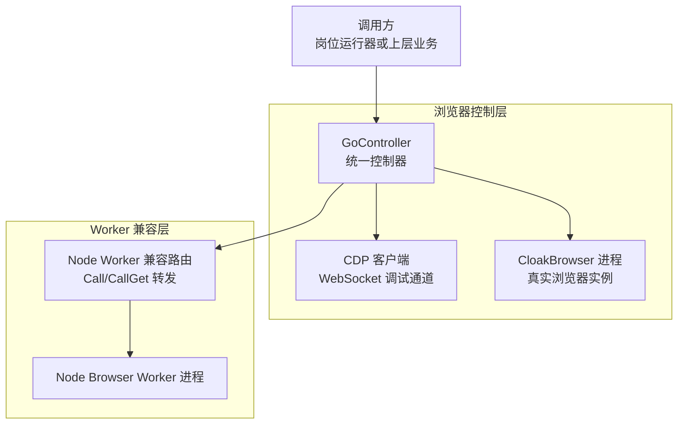

**图表来源**
- [go_controller.go:109-374](file://goodhr5/local-agent-go/internal/browser/go_controller.go#L109-L374)
- [worker.go:27-706](file://goodhr5/local-agent-go/internal/browser/worker.go#L27-L706)
- [go_session.go:18-448](file://goodhr5/local-agent-go/internal/browser/go_session.go#L18-L448)

**章节来源**
- [go_controller.go:1-108](file://goodhr5/local-agent-go/internal/browser/go_controller.go#L1-L108)
- [worker.go:1-54](file://goodhr5/local-agent-go/internal/browser/worker.go#L1-L54)

## 核心组件总览
| 组件 | 职责 | 关键行为 |
|---|---|---|
| `GoController` | 浏览器控制入口 | 启动/停止浏览器、当前页管理、元素引用缓存、路由转发 |
| `goPage` | 单页上下文 | 保存页面 ID、URL、标题、CDP WebSocket 地址及客户端 |
| `ElementSelector` / `ElementRef` / `ElementInfo` | 元素选择与结果模型 | 支持 CSS 选择器、引用、可见性、索引、字段提取 |
| `BrowserStartOptions` / `BrowserStatus` | 浏览器启动参数与状态 | 可执行路径、用户数据目录、下载目录、无头模式、视口尺寸 |
| `ScreenshotOptions` / `ScreenshotResult` | 截图参数与结果 | 元素截图、页面截图、全屏、输出目录、文件名 |
| `WorkerManager` | Node Worker 进程管理 | 启动、停止、重启、健康检查、端口复用、日志收集 |
| `OperationSpec` / 三类目录 | 操作分层规范 | basic、composite、platform 三类操作的归属约定 |

**章节来源**
- [go_controller.go:27-127](file://goodhr5/local-agent-go/internal/browser/go_controller.go#L27-L127)
- [go_controller.go:151-235](file://goodhr5/local-agent-go/internal/browser/go_controller.go#L151-L235)
- [worker.go:27-48](file://goodhr5/local-agent-go/internal/browser/worker.go#L27-L48)

## 架构与协作模式
系统存在两条浏览器控制路径：
1. **Go 直连路径**：`GoController` 直接启动 CloakBrowser，通过 CDP 控制页面。
2. **Node Worker 兼容路径**：`WorkerManager` 管理 Node Browser Worker 进程，并通过 HTTP 调用其 API；`GoController.Call` 会按路由将请求映射到 Go 方法，从而让上层以 Node Worker 路由形态调用 Go 控制器。

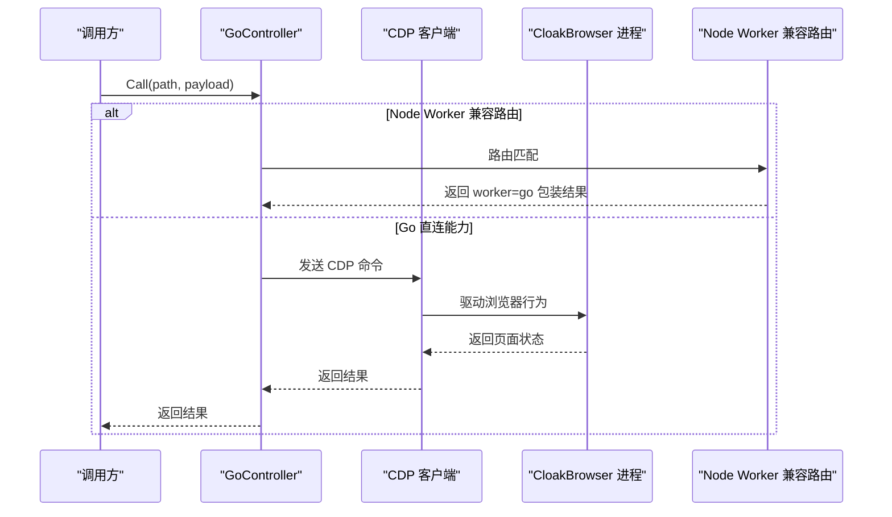

**图表来源**
- [go_controller.go:259-353](file://goodhr5/local-agent-go/internal/browser/go_controller.go#L259-L353)
- [go_session.go:18-103](file://goodhr5/local-agent-go/internal/browser/go_session.go#L18-L103)

**章节来源**
- [go_controller.go:259-353](file://goodhr5/local-agent-go/internal/browser/go_controller.go#L259-L353)
- [worker.go:254-337](file://goodhr5/local-agent-go/internal/browser/worker.go#L254-L337)

## GoController 设计模式
`GoController` 采用以下设计模式：
- **单一入口控制器**：所有浏览器相关能力集中在一个对象上，避免分散调用。
- **路由适配模式**：通过 `Call` / `CallGet` 将 Node Worker 的路由映射到 Go 方法，保持上层调用稳定。
- **锁保护的状态机**：使用互斥锁保护浏览器进程、页面、元素引用等共享状态。
- **组合动作分层**：基础原子操作放在控制器，通用组合动作与平台个性化动作分别归入不同目录。
- **CDP 抽象**：底层通过 CDP 协议驱动浏览器，上层只关心语义化操作。

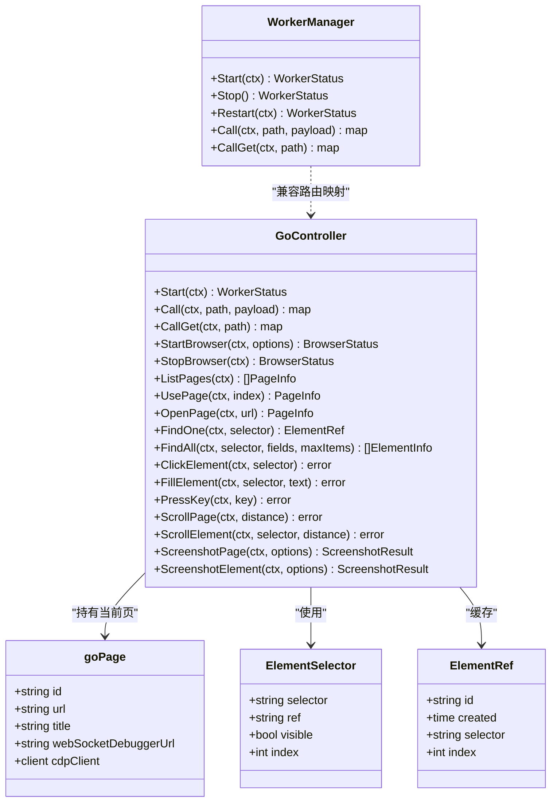

**图表来源**
- [go_controller.go:109-235](file://goodhr5/local-agent-go/internal/browser/go_controller.go#L109-L235)
- [go_session.go:229-235](file://goodhr5/local-agent-go/internal/browser/go_session.go#L229-L235)
- [worker.go:35-48](file://goodhr5/local-agent-go/internal/browser/worker.go#L35-L48)

**章节来源**
- [go_controller.go:109-251](file://goodhr5/local-agent-go/internal/browser/go_controller.go#L109-L251)
- [go_controller.go:259-374](file://goodhr5/local-agent-go/internal/browser/go_controller.go#L259-L374)

## 页面生命周期管理
页面生命周期包括：
1. **启动浏览器**：解析可执行路径、分配调试端口、启动 CloakBrowser、等待 DevTools 就绪、创建第一个页面、建立 CDP 连接。
2. **打开页面**：通过 `Page.navigate` 导航到新 URL，并等待页面加载完成。
3. **刷新页面**：调用 `Page.reload`，然后等待页面就绪。
4. **等待加载**：轮询 `document.readyState`，直到 `complete` 或 `interactive`。
5. **关闭浏览器**：关闭 CDP 客户端、终止进程、清理状态。

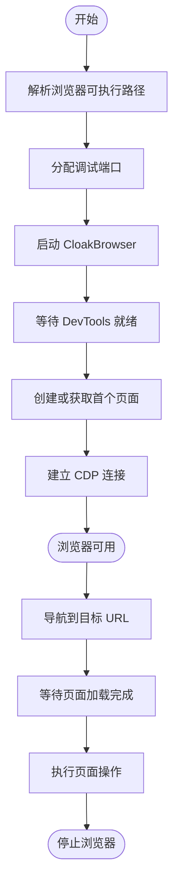

**图表来源**
- [go_session.go:18-103](file://goodhr5/local-agent-go/internal/browser/go_session.go#L18-L103)
- [go_session.go:198-240](file://goodhr5/local-agent-go/internal/browser/go_session.go#L198-L240)
- [go_session.go:291-329](file://goodhr5/local-agent-go/internal/browser/go_session.go#L291-L329)

**章节来源**
- [go_session.go:18-103](file://goodhr5/local-agent-go/internal/browser/go_session.go#L18-L103)
- [go_session.go:198-240](file://goodhr5/local-agent-go/internal/browser/go_session.go#L198-L240)
- [go_session.go:291-329](file://goodhr5/local-agent-go/internal/browser/go_session.go#L291-L329)

## 多标签页支持
`GoController` 支持列出当前浏览器中的所有页面，并切换到指定索引对应的页面：
- `ListPages` 通过 `/json/list` 获取页面列表。
- `UsePage` 根据索引选择页面，关闭旧 CDP 客户端，重新拨号新页面的 WebSocket。
- 切换页面时会清空元素引用，避免跨页引用失效。

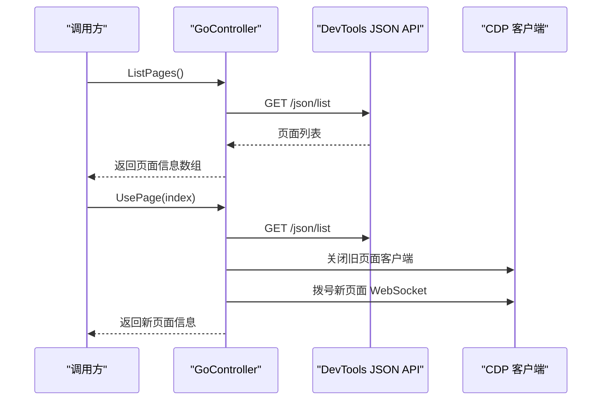

**图表来源**
- [go_session.go:134-177](file://goodhr5/local-agent-go/internal/browser/go_session.go#L134-L177)
- [go_session.go:352-373](file://goodhr5/local-agent-go/internal/browser/go_session.go#L352-L373)

**章节来源**
- [go_session.go:134-177](file://goodhr5/local-agent-go/internal/browser/go_session.go#L134-L177)
- [go_session.go:352-373](file://goodhr5/local-agent-go/internal/browser/go_session.go#L352-L373)

## 页面操作封装
### 导航控制
- `OpenPage`：校验 URL，调用 `Page.navigate`，等待页面就绪。
- `ReloadPage`：调用 `Page.reload`，等待页面就绪。
- `WaitPageLoad`：轮询 `document.readyState`。
- `CurrentURL`：读取 `location.href`，若失败则回退到当前页缓存 URL。

**章节来源**
- [go_session.go:179-240](file://goodhr5/local-agent-go/internal/browser/go_session.go#L179-L240)

### 元素查找
- `FindOne`：基于 `FindAll` 取第一个结果。
- `FindAll`：注入脚本查询 DOM，支持可见性过滤、字段提取、最大数量限制。
- `RememberElement` / `GetElementByRef` / `ClearElementRefs`：维护元素引用缓存。
- `ElementText` / `ElementAttribute` / `ElementHTML`：读取元素文本、属性、HTML。
- `ElementView`：读取元素位置、可见性与是否在当前视口。

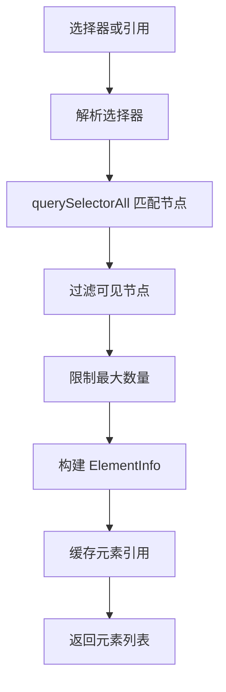

**图表来源**
- [go_element.go:24-105](file://goodhr5/local-agent-go/internal/browser/go_element.go#L24-L105)
- [go_element.go:107-139](file://goodhr5/local-agent-go/internal/browser/go_element.go#L107-L139)
- [go_element.go:141-216](file://goodhr5/local-agent-go/internal/browser/go_element.go#L141-L216)

**章节来源**
- [go_element.go:11-105](file://goodhr5/local-agent-go/internal/browser/go_element.go#L11-L105)
- [go_element.go:107-216](file://goodhr5/local-agent-go/internal/browser/go_element.go#L107-L216)

### 用户交互模拟
- `ClickElement`：先计算元素中心坐标，再派发鼠标移动、按下、释放事件。
- `FillElement`：聚焦后全选、删除、插入文本，并校验最终值。
- `PressKey`：解析按键与修饰键，派发 keyDown 与 keyUp。
- `EnsureElementVisible`：循环滚动直到元素进入视口。

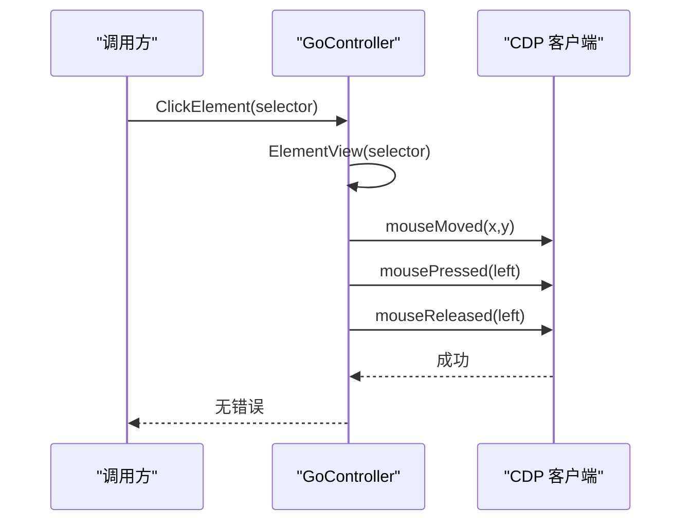

**图表来源**
- [go_input.go:11-41](file://goodhr5/local-agent-go/internal/browser/go_input.go#L11-L41)
- [go_element.go:184-216](file://goodhr5/local-agent-go/internal/browser/go_element.go#L184-L216)

**章节来源**
- [go_input.go:11-173](file://goodhr5/local-agent-go/internal/browser/go_input.go#L11-L173)
- [go_actions.go:10-56](file://goodhr5/local-agent-go/internal/browser/go_actions.go#L10-L56)

## 截图功能实现
截图支持两种模式：
- **页面截图**：使用 `Page.captureScreenshot`，默认 PNG，支持捕获超出视口区域。
- **元素截图**：先计算元素裁剪区域，再传入 `clip` 参数。
- 截图文件写入临时目录或指定目录，文件名支持安全化处理。

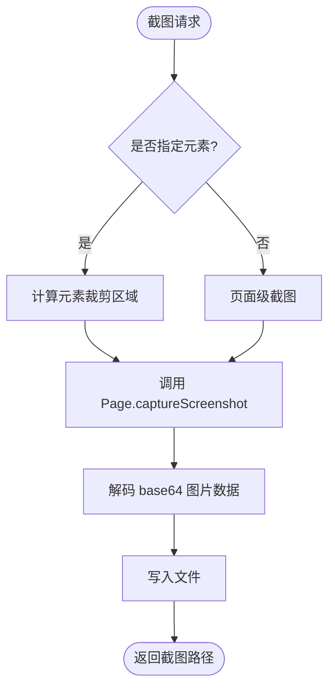

**图表来源**
- [go_screenshot.go:14-86](file://goodhr5/local-agent-go/internal/browser/go_screenshot.go#L14-L86)
- [go_element.go:240-255](file://goodhr5/local-agent-go/internal/browser/go_element.go#L240-L255)

**章节来源**
- [go_screenshot.go:14-95](file://goodhr5/local-agent-go/internal/browser/go_screenshot.go#L14-L95)
- [go_element.go:240-255](file://goodhr5/local-agent-go/internal/browser/go_element.go#L240-L255)

## 滚动控制实现
滚动分为页面滚动与元素滚动：
- `ScrollPage`：以视口中心为滚轮落点，派发鼠标滚轮事件。
- `ScrollElement`：以元素中心为滚轮落点，派发鼠标滚轮事件。
- `dispatchWheelLocked`：通过 CDP 的 `mouseWheel` 事件驱动滚动，不注入页面滚动脚本。
- `EnsureElementVisible`：结合 `ElementView` 与 `ScrollElement`，循环滚动直到元素进入视口。

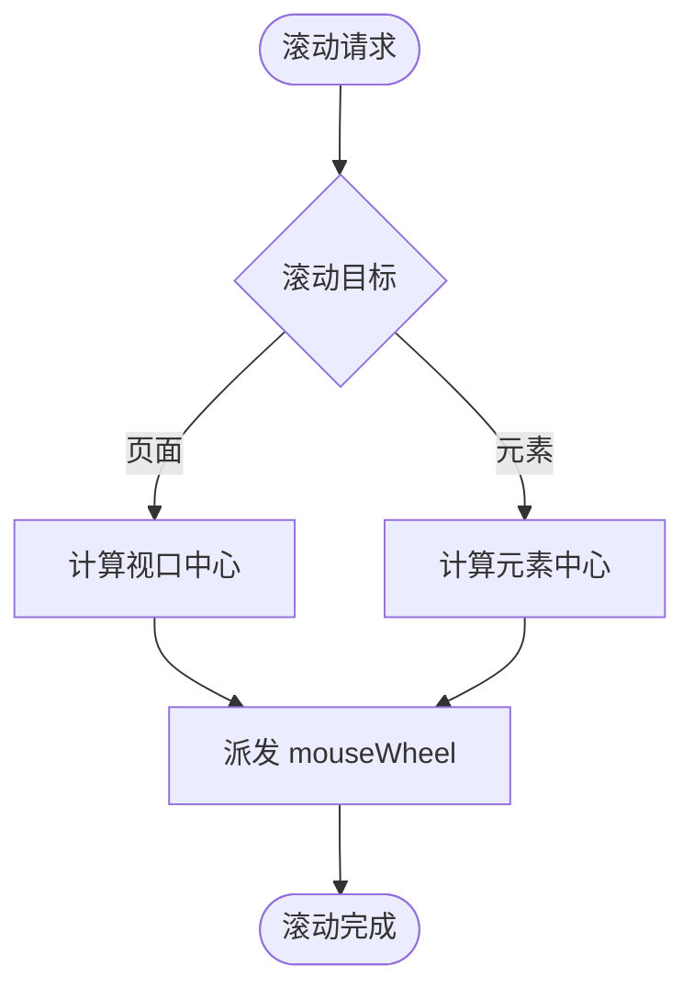

**图表来源**
- [go_scroll.go:8-51](file://goodhr5/local-agent-go/internal/browser/go_scroll.go#L8-L51)
- [go_actions.go:10-56](file://goodhr5/local-agent-go/internal/browser/go_actions.go#L10-L56)

**章节来源**
- [go_scroll.go:8-81](file://goodhr5/local-agent-go/internal/browser/go_scroll.go#L8-L81)
- [go_actions.go:10-56](file://goodhr5/local-agent-go/internal/browser/go_actions.go#L10-L56)

## 输入处理机制
输入处理包含点击、文本输入、键盘按键：
- 点击通过鼠标事件序列模拟。
- 文本输入先聚焦、全选、删除，再插入文本，最后校验输入框值。
- 键盘按键支持修饰键组合，如 Control+A、Meta+A、Shift+Tab 等。

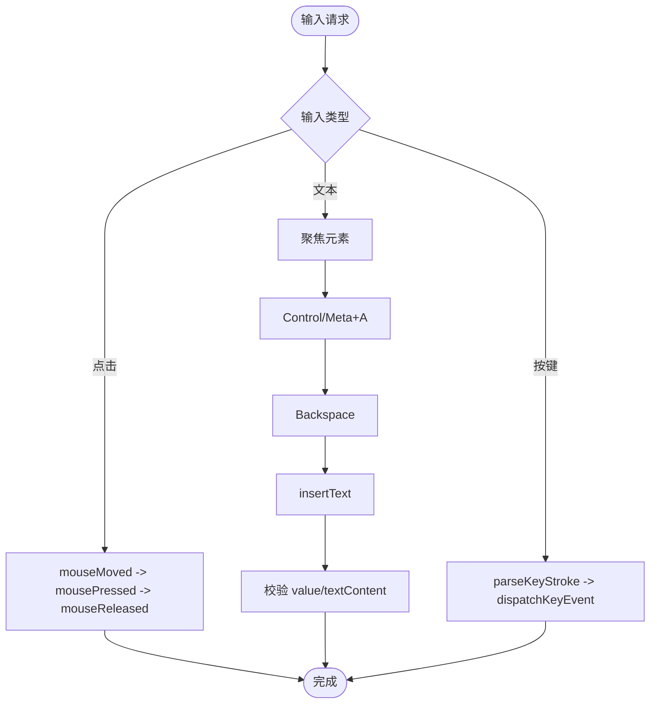

**图表来源**
- [go_input.go:11-173](file://goodhr5/local-agent-go/internal/browser/go_input.go#L11-L173)

**章节来源**
- [go_input.go:11-173](file://goodhr5/local-agent-go/internal/browser/go_input.go#L11-L173)

## 错误处理、超时与资源清理
### 错误处理策略
- 调用 Node Worker 时，网络错误会被标准化为中文提示，例如“未启动”“连接被拒绝”。
- 可重启的错误类型会触发自动重启并重发请求。
- Go 控制器内部对空选择器、不可见元素、找不到引用等场景返回明确错误。

**章节来源**
- [worker.go:339-369](file://goodhr5/local-agent-go/internal/browser/worker.go#L339-L369)
- [go_element.go:11-21](file://goodhr5/local-agent-go/internal/browser/go_element.go#L11-L21)
- [go_input.go:18-41](file://goodhr5/local-agent-go/internal/browser/go_input.go#L18-L41)

### 超时控制
- 等待 DevTools 就绪有固定超时。
- 页面加载等待轮询 `document.readyState`，带超时退出。
- Node Worker 启动等待健康检查，超时后清理进程树。

**章节来源**
- [go_session.go:310-329](file://goodhr5/local-agent-go/internal/browser/go_session.go#L310-L329)
- [go_session.go:291-308](file://goodhr5/local-agent-go/internal/browser/go_session.go#L291-L308)
- [worker.go:594-621](file://goodhr5/local-agent-go/internal/browser/worker.go#L594-L621)

### 资源清理机制
- 停止浏览器时关闭 CDP 客户端、终止进程、清空状态。
- Node Worker 停止时优先发送中断信号，超时后强制结束进程树。
- 日志文件在停止或异常退出时同步并关闭。

**章节来源**
- [go_session.go:257-273](file://goodhr5/local-agent-go/internal/browser/go_session.go#L257-L273)
- [worker.go:160-220](file://goodhr5/local-agent-go/internal/browser/worker.go#L160-L220)
- [worker.go:192-200](file://goodhr5/local-agent-go/internal/browser/worker.go#L192-L200)

## 与 Worker 进程的协作和任务分发
### Node Worker 管理
`WorkerManager` 负责：
- 启动 Node Browser Worker 进程，设置环境变量，重定向日志。
- 等待 Worker 健康检查接口就绪。
- 复用已有 Worker 或清理固定端口上的旧 Worker。
- 自动重启并原样重发请求。

### Go 控制器兼容路由
`GoController.Call` 将 Node Worker 路由映射到 Go 方法，并在返回结果中附加 `worker=go` 标记，使上层无需感知具体实现。

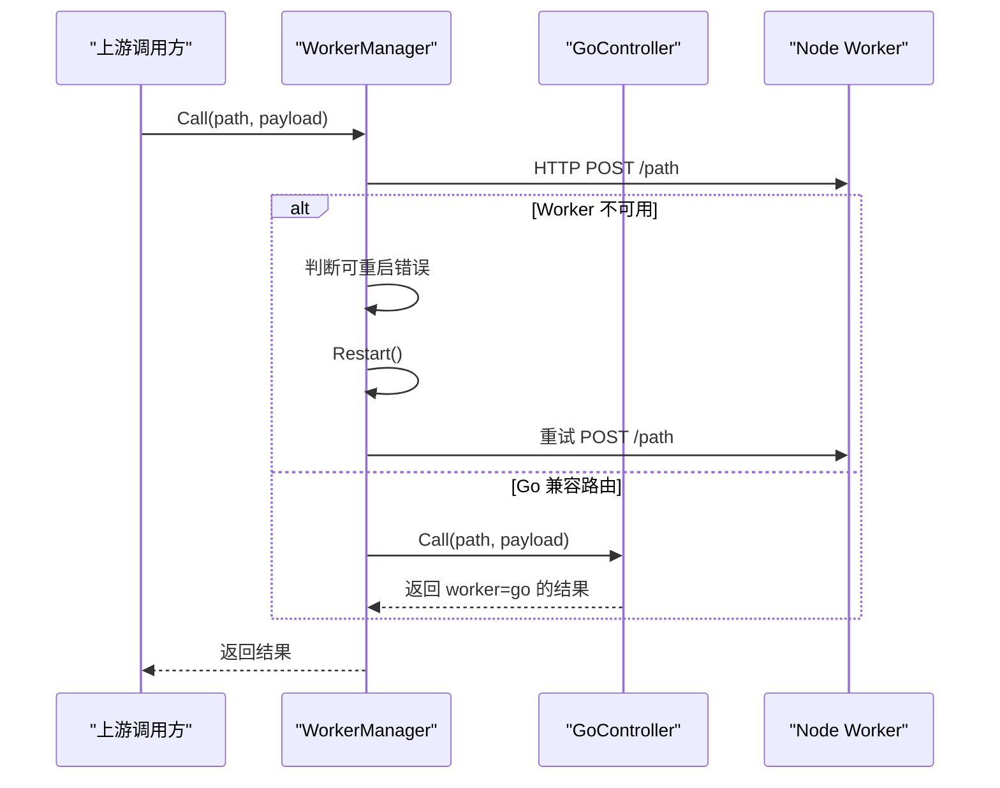

**图表来源**
- [worker.go:254-337](file://goodhr5/local-agent-go/internal/browser/worker.go#L254-L337)
- [go_controller.go:259-353](file://goodhr5/local-agent-go/internal/browser/go_controller.go#L259-L353)

**章节来源**
- [worker.go:78-142](file://goodhr5/local-agent-go/internal/browser/worker.go#L78-L142)
- [worker.go:254-337](file://goodhr5/local-agent-go/internal/browser/worker.go#L254-L337)
- [go_controller.go:259-353](file://goodhr5/local-agent-go/internal/browser/go_controller.go#L259-L353)

## 性能与稳定性建议
- **减少重复选择器查询**：优先使用 `RememberElement` 缓存元素引用，避免频繁 DOM 查询。
- **合理使用可见性过滤**：`FindAll` 的可见性过滤会增加脚本执行开销，仅在必要时开启。
- **避免频繁截图**：截图涉及 base64 编解码与磁盘写入，应控制频率与范围。
- **谨慎使用组合动作**：组合动作可能多次调用基础操作，注意重试与超时配置。
- **合理设置超时**：页面加载、滚动、截图等操作应根据业务场景调整超时时间。
- **复用浏览器会话**：通过 `UserDataDir` 复用登录态，减少重复登录成本。

[本节为通用建议，不直接分析具体文件]

## 故障排查指南
| 现象 | 可能原因 | 排查建议 |
|---|---|---|
| 浏览器无法启动 | 未找到 CloakBrowser 可执行路径 | 检查 `executable_path` 与环境变量 `GOODHR_CLOAKBROWSER_PATH` |
| 等待 DevTools 超时 | 浏览器进程已退出或端口占用 | 查看进程状态与端口占用情况 |
| 页面操作报错“元素不在可点击区域” | 元素不可见或未滚动到视口 | 先调用 `EnsureElementVisible` |
| 输入内容校验失败 | 输入框值与预期不一致 | 检查输入逻辑与页面框架对 value 的处理 |
| Node Worker 调用失败 | Worker 未启动或版本不匹配 | 查看 Worker 日志，确认版本与入口一致 |
| 截图文件为空或路径异常 | 目录权限不足或文件名不安全 | 检查输出目录权限与文件名安全化处理 |

**章节来源**
- [go_session.go:30-36](file://goodhr5/local-agent-go/internal/browser/go_session.go#L30-L36)
- [go_session.go:310-329](file://goodhr5/local-agent-go/internal/browser/go_session.go#L310-L329)
- [go_input.go:43-80](file://goodhr5/local-agent-go/internal/browser/go_input.go#L43-L80)
- [worker.go:339-369](file://goodhr5/local-agent-go/internal/browser/worker.go#L339-L369)
- [go_screenshot.go:53-86](file://goodhr5/local-agent-go/internal/browser/go_screenshot.go#L53-L86)

## 结论
`GoController` 是一个面向 HRPlus 本地 Agent 的实验性浏览器控制器，它既可以直接驱动 CloakBrowser，也可以通过 Node Worker 兼容路由向上层暴露统一接口。其核心优势在于：
- 清晰的页面生命周期管理与多标签页切换。
- 稳定的元素查找、点击、输入、滚动、截图等基础能力。
- 明确的错误处理、超时控制与资源清理机制。
- 与 Node Worker 的良好兼容，便于渐进式迁移与对比测试。

在实际使用中，建议优先使用基础原子操作组合业务逻辑，避免把平台个性化动作混入控制器；同时合理使用元素引用缓存与截图范围控制，提升稳定性和性能。