# 页面生命周期管理

<cite>
**本文引用的文件**   
- [go_controller.go](file://goodhr5/local-agent-go/internal/browser/go_controller.go)
- [go_session.go](file://goodhr5/local-agent-go/internal/browser/go_session.go)
- [worker.go](file://goodhr5/local-agent-go/internal/browser/worker.go)
- [CLOAKBROWSER.md](file://goodhr5/local-agent-go/internal/browser/CLOAKBROWSER.md)
</cite>

## 目录
1. [引言](#引言)
2. [项目结构定位](#项目结构定位)
3. [核心组件总览](#核心组件总览)
4. [架构总览](#架构总览)
5. [GoController 与浏览器实例生命周期](#goccontroller-与浏览器实例生命周期)
6. [多标签页支持机制](#多标签页支持机制)
7. [页面打开、刷新与等待加载完成](#页面打开刷新与等待加载完成)
8. [资源清理、内存管理与错误恢复](#资源清理内存管理与错误恢复)
9. [页面状态监控与调试方法](#页面状态监控与调试方法)
10. [依赖关系分析](#依赖关系分析)
11. [性能与稳定性建议](#性能与稳定性建议)
12. [故障排查指南](#故障排查指南)
13. [结论](#结论)

## 引言
本文聚焦 Go 本地代理中的实验性 Go 浏览器控制器，说明 `GoController` 如何管理 CloakBrowser 浏览器实例的启动、停止与健康检查，并详细解释多标签页支持、页面切换、当前页面状态维护、页面打开、刷新、等待加载完成等生命周期行为。同时补充资源清理、内存管理、错误恢复策略，以及面向运维和开发的页面状态监控与调试方法。

## 项目结构定位
Go 浏览器控制相关代码位于本地代理模块的浏览器包中：
- `internal/browser/go_controller.go`：定义控制器类型、路由分发、操作分类与对外兼容接口。
- `internal/browser/go_session.go`：实现浏览器进程启动、停止、页面列表、页面切换、页面导航、CDP 连接与 DevTools 就绪等待。
- `internal/browser/worker.go`：管理 Node Browser Worker 进程，提供健康检查、自动重启、端口清理等能力，是 GoController 之外的另一条浏览器自动化路径。
- `internal/browser/CLOAKBROWSER.md`：说明 GoController 的定位、拆分文件和当前能力边界。

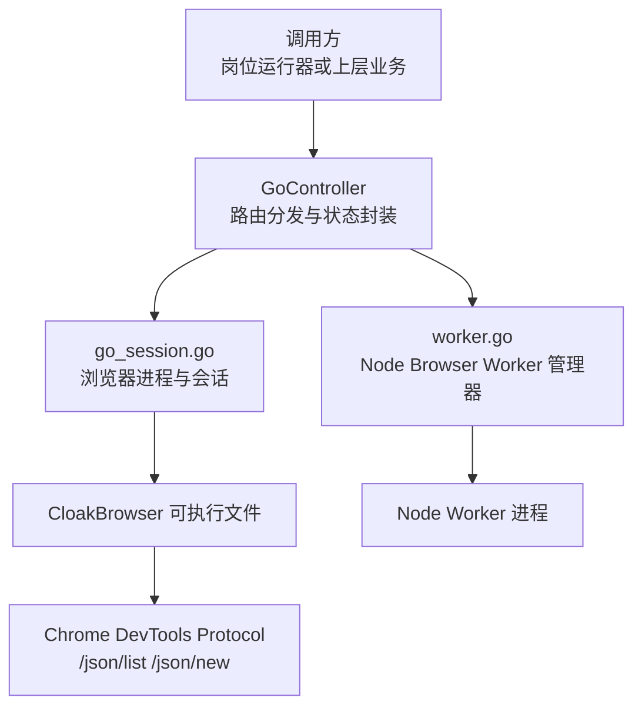

**图表来源**
- [go_controller.go:109-374](file://goodhr5/local-agent-go/internal/browser/go_controller.go#L109-L374)
- [go_session.go:18-373](file://goodhr5/local-agent-go/internal/browser/go_session.go#L18-L373)
- [worker.go:27-706](file://goodhr5/local-agent-go/internal/browser/worker.go#L27-L706)

**章节来源**
- [go_controller.go:1-108](file://goodhr5/local-agent-go/internal/browser/go_controller.go#L1-L108)
- [go_session.go:1-17](file://goodhr5/local-agent-go/internal/browser/go_session.go#L1-L17)
- [worker.go:1-25](file://goodhr5/local-agent-go/internal/browser/worker.go#L1-L25)
- [CLOAKBROWSER.md:113-143](file://goodhr5/local-agent-go/internal/browser/CLOAKBROWSER.md#L113-L143)

## 核心组件总览
- `GoController`：Go 浏览器控制器，负责启动 CloakBrowser、维护当前页面、元素引用、下载记录、用户数据目录等，并通过 `Call` 和 `CallGet` 暴露与 Node Worker 兼容的路由。
- `BrowserStatus`：浏览器运行状态，包含是否运行、Worker 模式、实验标记、用户数据目录、下载目录、当前 URL 等。
- `PageInfo`：页面信息，包含索引、ID、URL、标题。
- `goPage`：内部页面对象，保存页面 ID、URL、标题、WebSocket 调试地址及 CDP 客户端。
- `WorkerManager`：Node Browser Worker 管理器，用于传统 Node Worker 路径的生命周期管理，与 GoController 并行存在。

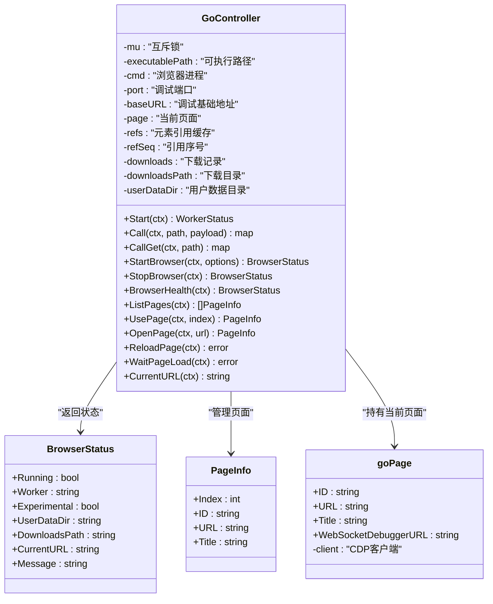

**图表来源**
- [go_controller.go:110-235](file://goodhr5/local-agent-go/internal/browser/go_controller.go#L110-L235)
- [go_session.go:229-235](file://goodhr5/local-agent-go/internal/browser/go_session.go#L229-L235)

**章节来源**
- [go_controller.go:110-235](file://goodhr5/local-agent-go/internal/browser/go_controller.go#L110-L235)
- [go_session.go:229-235](file://goodhr5/local-agent-go/internal/browser/go_session.go#L229-L235)

## 架构总览
GoController 采用“适配器+组合”的设计思路：
- 通过 `Call` 将 Node Worker 路由映射到 Go 控制器方法，保持上层调用一致。
- 通过 `StartBrowser`、`StopBrowser`、`BrowserHealth` 管理浏览器进程。
- 通过 `ListPages`、`UsePage`、`OpenPage`、`ReloadPage`、`WaitPageLoad`、`CurrentURL` 管理页面生命周期。
- 通过 CDP 与 CloakBrowser 通信，使用 `/json/list`、`/json/new` 获取或创建页面。

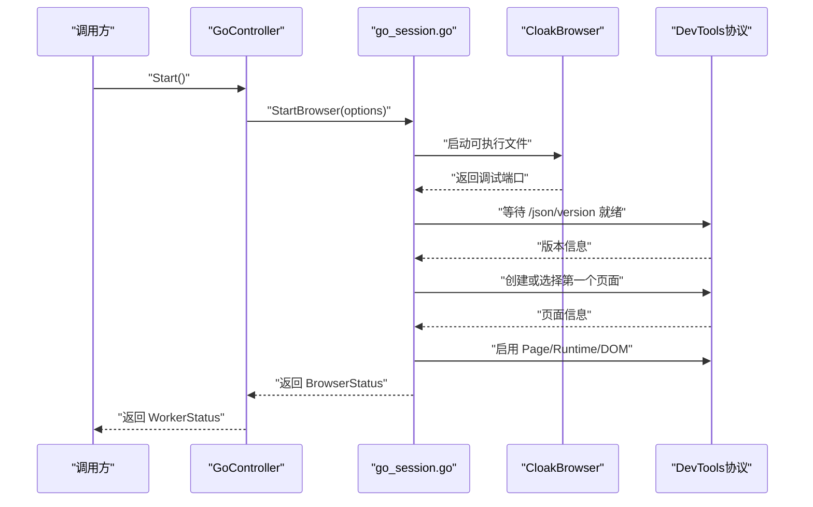

**图表来源**
- [go_controller.go:253-257](file://goodhr5/local-agent-go/internal/browser/go_controller.go#L253-L257)
- [go_session.go:18-103](file://goodhr5/local-agent-go/internal/browser/go_session.go#L18-L103)
- [go_session.go:310-349](file://goodhr5/local-agent-go/internal/browser/go_session.go#L310-L349)

**章节来源**
- [go_controller.go:253-257](file://goodhr5/local-agent-go/internal/browser/go_controller.go#L253-L257)
- [go_session.go:18-103](file://goodhr5/local-agent-go/internal/browser/go_session.go#L18-L103)

## GoController 与浏览器实例生命周期
### 启动流程
- `Start` 调用 `StartBrowser`，并将结果包装为 `WorkerStatus`。
- `StartBrowser` 会：
  - 如果已有运行实例且用户数据目录相同，直接返回当前状态；否则先停止旧实例。
  - 解析 CloakBrowser 可执行路径，优先使用传入参数，其次环境变量，最后按平台常见路径查找。
  - 分配本地调试端口，准备启动参数，包括远程调试地址、端口、无首次运行、禁用后台网络等。
  - 启动进程后等待 DevTools `/json/version` 就绪。
  - 创建或选择第一个页面，建立 CDP WebSocket 连接，启用 Page、Runtime、DOM。
  - 设置用户数据目录、下载目录，并在需要时配置下载目录。

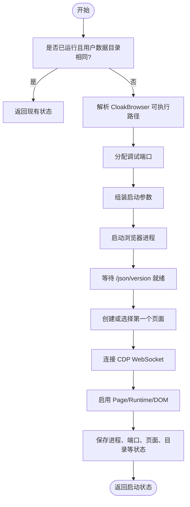

**图表来源**
- [go_session.go:18-103](file://goodhr5/local-agent-go/internal/browser/go_session.go#L18-L103)
- [go_session.go:384-408](file://goodhr5/local-agent-go/internal/browser/go_session.go#L384-L408)

**章节来源**
- [go_controller.go:253-257](file://goodhr5/local-agent-go/internal/browser/go_controller.go#L253-L257)
- [go_session.go:18-103](file://goodhr5/local-agent-go/internal/browser/go_session.go#L18-L103)
- [go_session.go:384-408](file://goodhr5/local-agent-go/internal/browser/go_session.go#L384-L408)

### 停止流程
- `StopBrowser` 在上下文未取消的情况下调用内部停止逻辑。
- 内部停止逻辑会关闭当前页面的 CDP 客户端，终止浏览器进程，等待进程退出，然后清空进程、端口、基础地址、页面、元素引用、用户数据目录、下载目录等状态。

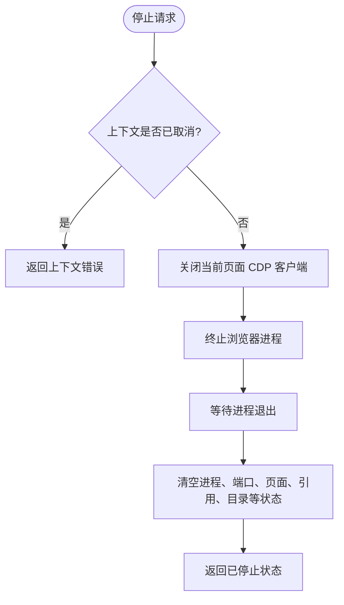

**图表来源**
- [go_session.go:105-116](file://goodhr5/local-agent-go/internal/browser/go_session.go#L105-L116)
- [go_session.go:257-273](file://goodhr5/local-agent-go/internal/browser/go_session.go#L257-L273)

**章节来源**
- [go_session.go:105-116](file://goodhr5/local-agent-go/internal/browser/go_session.go#L105-L116)
- [go_session.go:257-273](file://goodhr5/local-agent-go/internal/browser/go_session.go#L257-L273)

### 健康检查
- `BrowserHealth` 会检查浏览器进程是否已退出，若已退出则清理状态。
- 返回 `BrowserStatus`，其中 `Running` 由内部判断逻辑决定，需同时满足进程存在且未退出、当前页面存在且 CDP 客户端可用。

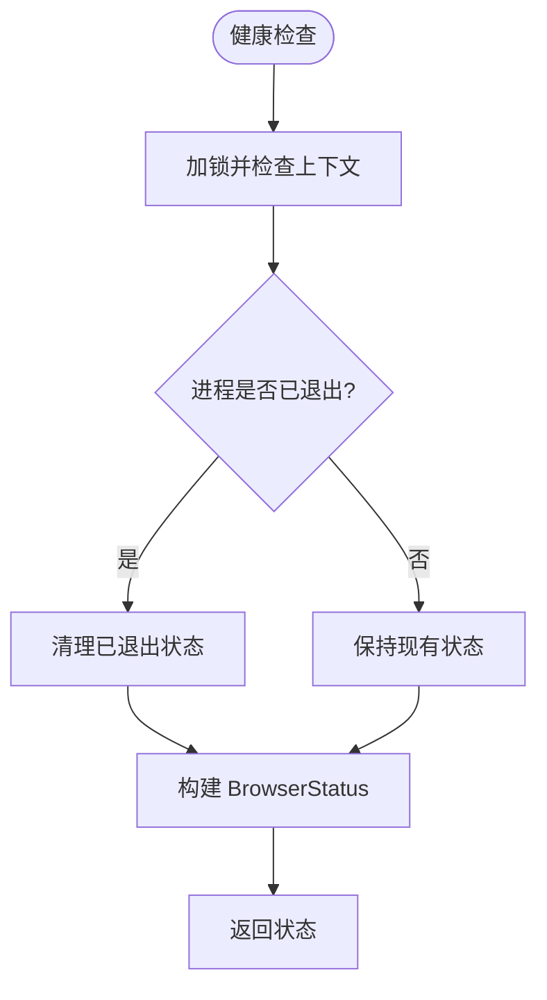

**图表来源**
- [go_session.go:118-132](file://goodhr5/local-agent-go/internal/browser/go_session.go#L118-L132)
- [go_session.go:275-277](file://goodhr5/local-agent-go/internal/browser/go_session.go#L275-L277)

**章节来源**
- [go_session.go:118-132](file://goodhr5/local-agent-go/internal/browser/go_session.go#L118-L132)
- [go_session.go:275-277](file://goodhr5/local-agent-go/internal/browser/go_session.go#L275-L277)

## 多标签页支持机制
### 页面列表获取
- `ListPages` 通过浏览器的调试基础地址调用 `/json/list`，过滤出具有 WebSocket 调试地址的页面，并转换为 `PageInfo` 列表返回。
- 该列表可用于前端展示、自动化脚本选择目标页面。

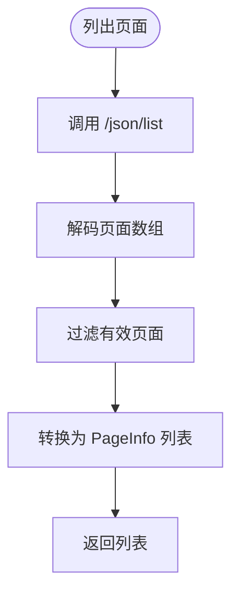

**图表来源**
- [go_session.go:134-148](file://goodhr5/local-agent-go/internal/browser/go_session.go#L134-L148)
- [go_session.go:352-373](file://goodhr5/local-agent-go/internal/browser/go_session.go#L352-L373)

**章节来源**
- [go_session.go:134-148](file://goodhr5/local-agent-go/internal/browser/go_session.go#L134-L148)
- [go_session.go:352-373](file://goodhr5/local-agent-go/internal/browser/go_session.go#L352-L373)

### 页面切换
- `UsePage` 根据索引选择目标页面：
  - 若无可用页面，返回错误。
  - 若索引越界，回退到第一个页面。
  - 关闭当前页面的 CDP 客户端，连接到目标页面的 WebSocket 调试地址。
  - 更新当前页面并清空元素引用缓存。

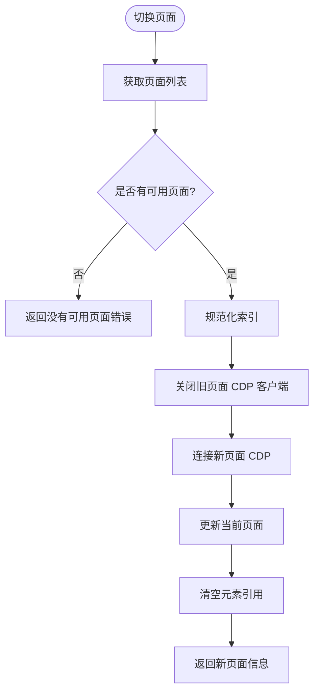

**图表来源**
- [go_session.go:150-177](file://goodhr5/local-agent-go/internal/browser/go_session.go#L150-L177)

**章节来源**
- [go_session.go:150-177](file://goodhr5/local-agent-go/internal/browser/go_session.go#L150-L177)

### 当前页面状态维护
- `GoController` 内部维护一个 `goPage` 指针作为当前页面。
- 所有页面相关操作都会先通过 `ensurePageLocked` 校验浏览器是否已启动且当前页面可用。
- 当前 URL 可通过 `CurrentURL` 读取，优先从页面 JavaScript 环境获取最新值，否则回退到缓存的页面 URL。

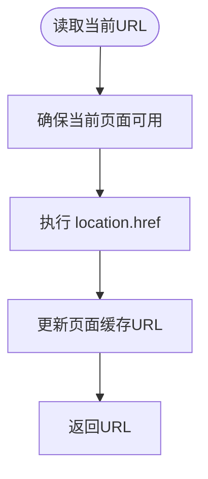

**图表来源**
- [go_session.go:179-196](file://goodhr5/local-agent-go/internal/browser/go_session.go#L179-L196)
- [go_session.go:279-289](file://goodhr5/local-agent-go/internal/browser/go_session.go#L279-L289)

**章节来源**
- [go_session.go:179-196](file://goodhr5/local-agent-go/internal/browser/go_session.go#L179-L196)
- [go_session.go:279-289](file://goodhr5/local-agent-go/internal/browser/go_session.go#L279-L289)

## 页面打开、刷新与等待加载完成
### 打开页面
- `OpenPage` 会校验浏览器是否已启动，校验 URL 是否为空，然后通过 CDP 的 `Page.navigate` 打开目标地址。
- 打开后会等待页面加载完成，并更新页面 URL 与元素引用缓存。

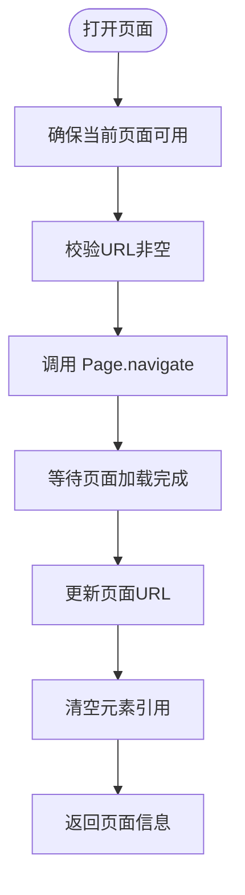

**图表来源**
- [go_session.go:198-218](file://goodhr5/local-agent-go/internal/browser/go_session.go#L198-L218)

**章节来源**
- [go_session.go:198-218](file://goodhr5/local-agent-go/internal/browser/go_session.go#L198-L218)

### 刷新页面
- `ReloadPage` 通过 CDP 的 `Page.reload` 刷新当前页面，忽略缓存选项为 false，随后等待页面加载完成。

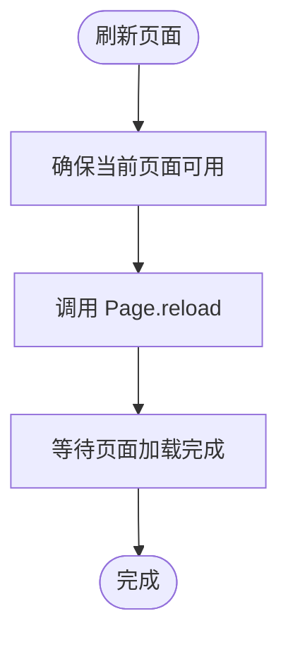

**图表来源**
- [go_session.go:220-233](file://goodhr5/local-agent-go/internal/browser/go_session.go#L220-L233)

**章节来源**
- [go_session.go:220-233](file://goodhr5/local-agent-go/internal/browser/go_session.go#L220-L233)

### 等待加载完成
- `WaitPageLoad` 通过轮询执行 `document.readyState`，直到状态为 `complete` 或 `interactive`，或在超时或上下文取消时返回。
- 每次轮询间隔约 200 毫秒，避免频繁执行 JavaScript。

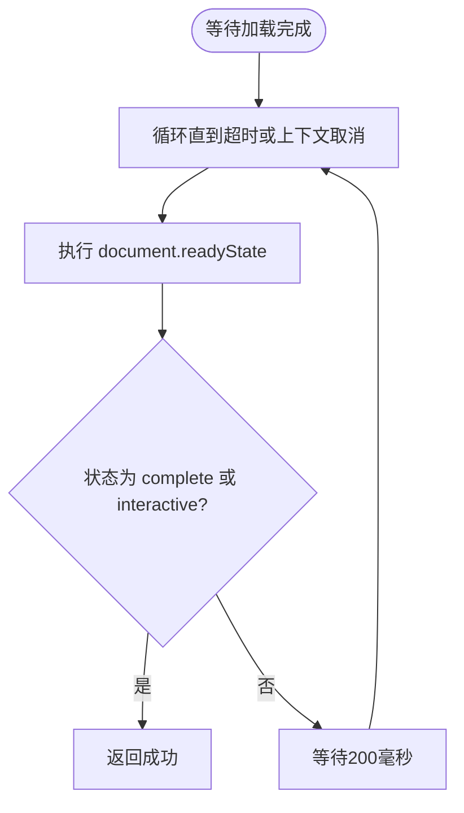

**图表来源**
- [go_session.go:291-308](file://goodhr5/local-agent-go/internal/browser/go_session.go#L291-L308)

**章节来源**
- [go_session.go:235-240](file://goodhr5/local-agent-go/internal/browser/go_session.go#L235-L240)
- [go_session.go:291-308](file://goodhr5/local-agent-go/internal/browser/go_session.go#L291-L308)

## 资源清理、内存管理与错误恢复
### 资源清理
- 停止浏览器时会关闭 CDP 客户端、终止进程、等待进程退出，并清空所有内部状态，包括进程、端口、基础地址、页面、元素引用、用户数据目录、下载目录。
- 切换页面时会关闭旧页面的 CDP 客户端，避免资源泄漏。
- 打开页面或刷新页面后会清空元素引用缓存，防止 stale 引用导致后续操作失败。

**章节来源**
- [go_session.go:257-273](file://goodhr5/local-agent-go/internal/browser/go_session.go#L257-L273)
- [go_session.go:166-176](file://goodhr5/local-agent-go/internal/browser/go_session.go#L166-L176)
- [go_session.go:214-217](file://goodhr5/local-agent-go/internal/browser/go_session.go#L214-L217)

### 内存管理
- 元素引用以 `map[string]ElementRef` 形式缓存，切换页面或打开新页面时清空，避免跨页面引用污染。
- 下载记录、用户数据目录、下载目录等状态随浏览器生命周期管理。
- 当前实现未显式释放大对象或定期 GC 触发，依赖 Go 运行时垃圾回收。

**章节来源**
- [go_controller.go:117-122](file://goodhr5/local-agent-go/internal/browser/go_controller.go#L117-L122)
- [go_session.go:269-271](file://goodhr5/local-agent-go/internal/browser/go_session.go#L269-L271)

### 错误恢复策略
- 健康检查发现进程已退出时会自动清理状态，避免脏状态影响后续操作。
- 启动过程中若 DevTools 就绪失败或页面创建失败，会终止浏览器进程并返回错误。
- Node Worker 路径（非 GoController）具备自动重启与重试机制，但 GoController 本身不内置自动重启，通常由上层调用方处理。

**章节来源**
- [go_session.go:118-132](file://goodhr5/local-agent-go/internal/browser/go_session.go#L118-L132)
- [go_session.go:72-86](file://goodhr5/local-agent-go/internal/browser/go_session.go#L72-L86)
- [worker.go:254-290](file://goodhr5/local-agent-go/internal/browser/worker.go#L254-L290)

## 页面状态监控与调试方法
### 监控指标
- `BrowserStatus.Running`：浏览器是否运行。
- `BrowserStatus.CurrentURL`：当前页面 URL。
- `BrowserStatus.UserDataDir`：用户数据目录，用于持久化登录态。
- `BrowserStatus.DownloadsPath`：下载目录，用于下载文件落盘。
- `PageInfo.Index/ID/URL/Title`：页面标识与基本信息。

**章节来源**
- [go_controller.go:141-157](file://goodhr5/local-agent-go/internal/browser/go_controller.go#L141-L157)
- [go_session.go:242-255](file://goodhr5/local-agent-go/internal/browser/go_session.go#L242-L255)

### 调试手段
- 通过 `ListPages` 获取所有页面，结合 `UsePage` 切换到目标页面进行调试。
- 通过 `CurrentURL` 确认当前页面地址是否与预期一致。
- 通过 `OpenPage` 打开测试页面，配合 `WaitPageLoad` 等待稳定后再执行后续操作。
- 通过 `ReloadPage` 刷新页面，观察页面行为变化。
- 通过 `BrowserHealth` 快速判断浏览器进程是否存活。
- 通过浏览器调试端口 `/json/list`、`/json/new`、`/json/version` 验证 DevTools 是否正常。

**章节来源**
- [go_session.go:134-177](file://goodhr5/local-agent-go/internal/browser/go_session.go#L134-L177)
- [go_session.go:179-240](file://goodhr5/local-agent-go/internal/browser/go_session.go#L179-L240)
- [go_session.go:310-373](file://goodhr5/local-agent-go/internal/browser/go_session.go#L310-L373)

## 依赖关系分析
GoController 与 Node Worker 管理器并存，二者职责不同：
- GoController：直接启动 CloakBrowser，使用 CDP 控制页面，适合实验性 Go 路径。
- WorkerManager：管理 Node Browser Worker 进程，通过 HTTP 调用 Node Worker API，具备自动重启、端口清理、兼容性检查等能力。

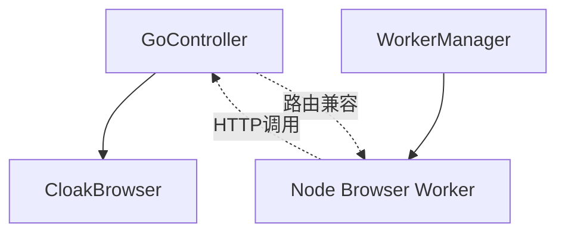

**图表来源**
- [go_controller.go:259-353](file://goodhr5/local-agent-go/internal/browser/go_controller.go#L259-L353)
- [worker.go:27-706](file://goodhr5/local-agent-go/internal/browser/worker.go#L27-L706)

**章节来源**
- [go_controller.go:259-353](file://goodhr5/local-agent-go/internal/browser/go_controller.go#L259-L353)
- [worker.go:27-706](file://goodhr5/local-agent-go/internal/browser/worker.go#L27-L706)

## 性能与稳定性建议
- 避免频繁调用 `WaitPageLoad`，应在页面导航或刷新后统一等待一次。
- 切换页面后应清空元素引用，避免跨页面误用。
- 长时间运行场景下，建议定期调用 `BrowserHealth` 检测进程状态，必要时由上层触发重启。
- 用户数据目录应保持稳定，避免频繁更换导致登录态丢失。
- 下载目录应提前创建并赋予写入权限，避免下载失败。

[本节为通用建议，不直接分析具体文件]

## 故障排查指南
### 常见问题
- 启动失败：检查 CloakBrowser 可执行路径是否正确，环境变量 `GOODHR_CLOAKBROWSER_PATH` 是否设置。
- DevTools 就绪超时：检查防火墙、端口占用、浏览器调试端口是否开放。
- 页面列表为空：确认浏览器已启动且至少有一个页面。
- 切换页面失败：确认索引有效，目标页面 WebSocket 调试地址可用。
- 页面加载卡住：检查 `document.readyState` 是否长期不为 `complete` 或 `interactive`，可能是页面 JS 异常或网络问题。

**章节来源**
- [go_session.go:30-36](file://goodhr5/local-agent-go/internal/browser/go_session.go#L30-L36)
- [go_session.go:72-86](file://goodhr5/local-agent-go/internal/browser/go_session.go#L72-L86)
- [go_session.go:150-177](file://goodhr5/local-agent-go/internal/browser/go_session.go#L150-L177)
- [go_session.go:291-308](file://goodhr5/local-agent-go/internal/browser/go_session.go#L291-L308)

## 结论
GoController 提供了实验性的 Go 浏览器控制能力，能够直接启动 CloakBrowser 并通过 CDP 管理页面生命周期。其核心优势在于与 Node Worker 路由兼容，便于逐步迁移和对比验证。在多标签页场景中，它通过 `/json/list` 获取页面列表，通过 `UsePage` 切换当前页面，并通过 `OpenPage`、`ReloadPage`、`WaitPageLoad` 管理页面打开、刷新与加载完成。资源清理方面，它在停止和切换页面时主动释放 CDP 客户端和元素引用；错误恢复方面，健康检查可识别进程退出并清理状态。对于生产环境，建议结合上层调用方的重启策略、日志监控与页面状态巡检，确保浏览器自动化链路稳定可靠。

[本节为总结性内容，不直接分析具体文件]