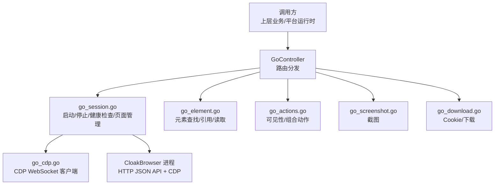
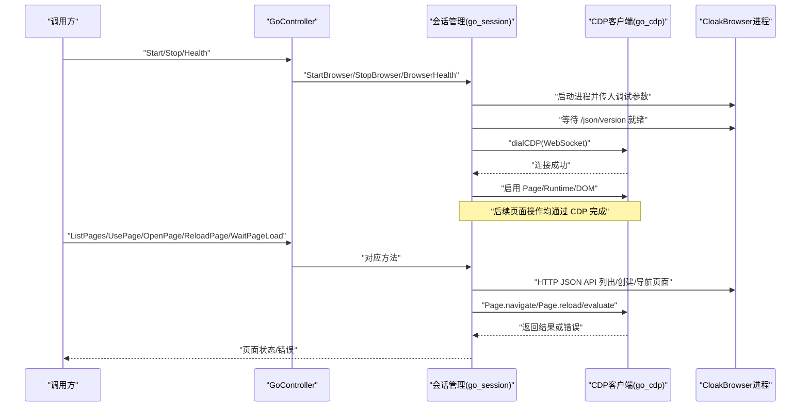
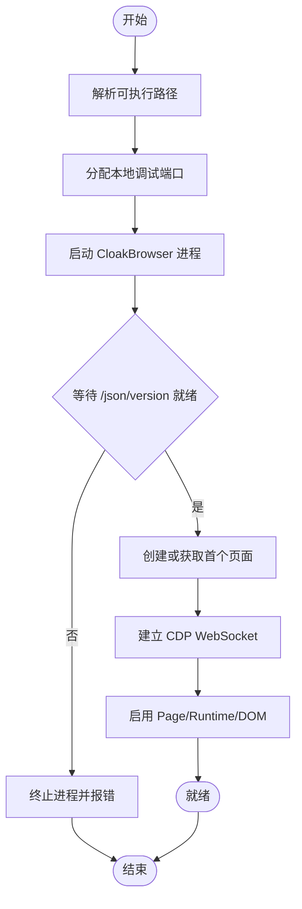
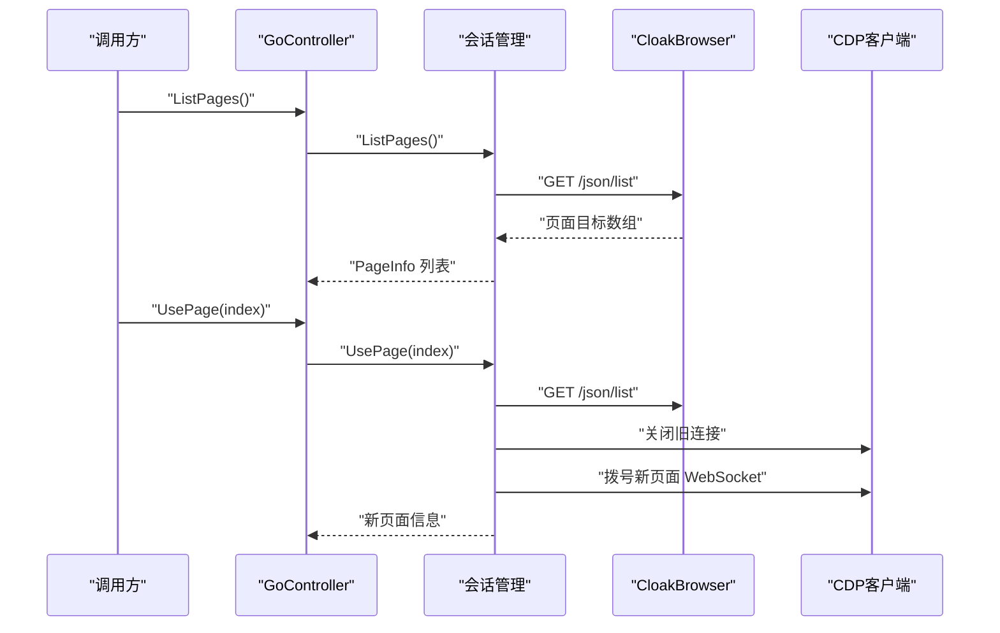
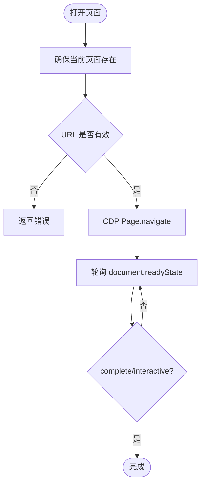
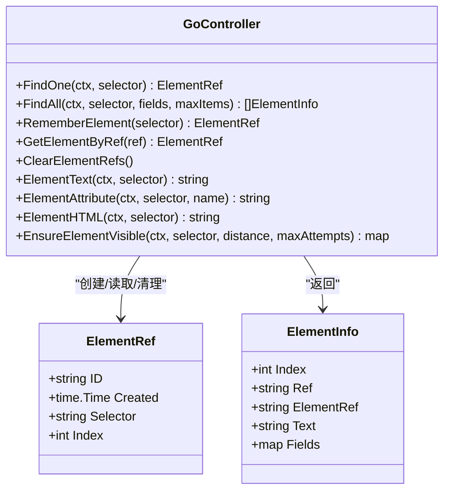
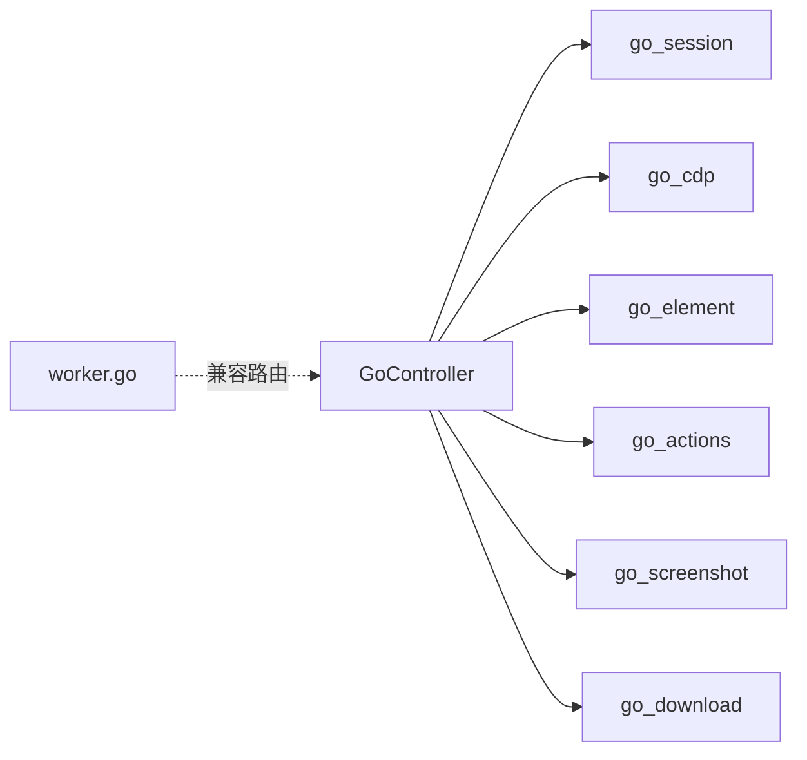

# 页面生命周期管理

<cite>
**本文引用的文件**
- [go_controller.go](file://goodhr5/local-agent-go/internal/browser/go_controller.go)
- [go_session.go](file://goodhr5/local-agent-go/internal/browser/go_session.go)
- [go_cdp.go](file://goodhr5/local-agent-go/internal/browser/go_cdp.go)
- [go_element.go](file://goodhr5/local-agent-go/internal/browser/go_element.go)
- [go_actions.go](file://goodhr5/local-agent-go/internal/browser/go_actions.go)
- [go_screenshot.go](file://goodhr5/local-agent-go/internal/browser/go_screenshot.go)
- [go_download.go](file://goodhr5/local-agent-go/internal/browser/go_download.go)
- [worker.go](file://goodhr5/local-agent-go/internal/browser/worker.go)
</cite>

## 目录
1. [简介](#简介)
2. [项目结构](#项目结构)
3. [核心组件](#核心组件)
4. [架构总览](#架构总览)
5. [详细组件分析](#详细组件分析)
6. [依赖关系分析](#依赖关系分析)
7. [性能考虑](#性能考虑)
8. [故障排查指南](#故障排查指南)
9. [结论](#结论)
10. [附录](#附录)

## 简介
本文聚焦于 Go 浏览器控制器（GoController）的页面生命周期管理，覆盖以下关键主题：
- 浏览器实例的启动、停止与健康检查
- 多标签页支持：页面列表获取、页面切换、当前页面状态维护
- 页面打开、刷新与等待加载完成的具体实现
- 页面资源清理、内存管理与错误恢复策略
- 页面状态监控与调试方法

该能力由实验性 Go 浏览器控制库提供，通过 Chrome DevTools Protocol（CDP）直接操控 CloakBrowser 进程，并以兼容 Node Worker 的路由形态对外暴露。

## 项目结构
与页面生命周期相关的代码集中在 local-agent-go/internal/browser 包中，按职责拆分为多个文件：
- go_controller.go：控制器入口、路由分发、操作清单与数据结构定义
- go_session.go：浏览器进程生命周期、页面列表、页面切换、URL 读取、打开/刷新/等待加载
- go_cdp.go：CDP WebSocket 客户端、消息收发、JS 执行
- go_element.go：元素查找、引用缓存、文本/属性/HTML 读取、视口位置
- go_actions.go：可见性保证、组合动作、平台相关兼容封装
- go_screenshot.go：页面/元素截图
- go_download.go：Cookie 导入导出、下载目录设置与记录
- worker.go：Node Browser Worker 管理器（用于对比与兼容场景）

图表来源
- [go_controller.go:109-374](file://goodhr5/local-agent-go/internal/browser/go_controller.go#L109-L374)
- [go_session.go:18-374](file://goodhr5/local-agent-go/internal/browser/go_session.go#L18-L374)
- [go_cdp.go:21-114](file://goodhr5/local-agent-go/internal/browser/go_cdp.go#L21-L114)

章节来源
- [go_controller.go:1-374](file://goodhr5/local-agent-go/internal/browser/go_controller.go#L1-L374)
- [go_session.go:1-448](file://goodhr5/local-agent-go/internal/browser/go_session.go#L1-L448)
- [go_cdp.go:1-289](file://goodhr5/local-agent-go/internal/browser/go_cdp.go#L1-L289)

## 核心组件
- GoController：统一入口，维护浏览器进程、端口、当前页面、元素引用、下载路径等；提供 Start/Stop/Health 以及一系列页面操作；通过 Call/CALLGet 将 Node Worker 路由映射到具体实现。
- goPage：表示一个已连接的页面，包含 ID、URL、Title、WebSocketDebuggerURL 和 CDP 客户端。
- cdpClient：基于 WebSocket 的 CDP 客户端，负责发送请求、接收响应、处理异步消息循环。
- 辅助模块：元素操作、截图、Cookie/下载、可见性与组合动作等。

章节来源
- [go_controller.go:109-241](file://goodhr5/local-agent-go/internal/browser/go_controller.go#L109-L241)
- [go_session.go:229-235](file://goodhr5/local-agent-go/internal/browser/go_session.go#L229-L235)
- [go_cdp.go:21-114](file://goodhr5/local-agent-go/internal/browser/go_cdp.go#L21-L114)

## 架构总览
下图展示了从调用方到浏览器进程的完整链路，包括启动、健康检查、页面管理与 CDP 通信。

图表来源
- [go_session.go:18-103](file://goodhr5/local-agent-go/internal/browser/go_session.go#L18-L103)
- [go_session.go:134-240](file://goodhr5/local-agent-go/internal/browser/go_session.go#L134-L240)
- [go_cdp.go:48-114](file://goodhr5/local-agent-go/internal/browser/go_cdp.go#L48-L114)

## 详细组件分析

### 浏览器实例生命周期：启动、停止与健康检查
- 启动流程
  - 解析可执行文件路径，优先使用配置或环境变量，其次在常见安装目录查找。
  - 分配本地空闲端口，构造启动参数（远程调试地址、无首次运行提示、禁用后台网络等），必要时指定用户数据目录与下载目录。
  - 启动进程后轮询 HTTP JSON API 的 /json/version，直到浏览器调试接口就绪。
  - 创建或复用首个页面，建立 CDP WebSocket 连接，启用 Page/Runtime/DOM 能力。
  - 初始化控制器状态：进程句柄、端口、baseURL、当前页面、元素引用表、下载路径等。
- 停止流程
  - 关闭当前页面的 CDP 客户端。
  - 终止浏览器进程并等待退出，清理所有内部状态。
- 健康检查
  - 若检测到进程已退出则自动清理并重置状态。
  - 返回运行标志、工作模式、实验模式标记、用户数据目录、下载目录与当前 URL。

图表来源
- [go_session.go:18-103](file://goodhr5/local-agent-go/internal/browser/go_session.go#L18-L103)
- [go_session.go:310-350](file://goodhr5/local-agent-go/internal/browser/go_session.go#L310-L350)

章节来源
- [go_session.go:18-132](file://goodhr5/local-agent-go/internal/browser/go_session.go#L18-L132)
- [go_session.go:257-277](file://goodhr5/local-agent-go/internal/browser/go_session.go#L257-L277)

### 多标签页支持：页面列表、切换与当前页面状态
- 页面列表
  - 通过 HTTP JSON API 的 /json/list 获取所有目标，过滤出具有 WebSocketDebuggerURL 的有效页面，转换为 PageInfo 列表。
- 页面切换
  - 根据索引选择目标页面，关闭旧 CDP 连接，重新拨号到新页面的 WebSocket，更新当前页面与元素引用表。
- 当前页面状态
  - CurrentURL 通过 JS 表达式读取 location.href，失败时回退为上次记录的 URL。
  - statusLocked 汇总运行状态与当前 URL，供健康检查与外部查询。

图表来源
- [go_session.go:134-177](file://goodhr5/local-agent-go/internal/browser/go_session.go#L134-L177)
- [go_session.go:352-373](file://goodhr5/local-agent-go/internal/browser/go_session.go#L352-L373)

章节来源
- [go_session.go:134-196](file://goodhr5/local-agent-go/internal/browser/go_session.go#L134-L196)

### 页面打开、刷新与等待加载完成
- 打开页面
  - 确保当前页面存在，校验 URL 非空，调用 CDP 的 Page.navigate 导航至目标地址，随后等待页面就绪，更新当前 URL 并清空元素引用。
- 刷新页面
  - 调用 CDP 的 Page.reload，忽略缓存选项，等待页面就绪。
- 等待加载完成
  - 轮询 document.readyState，当值为 complete 或 interactive 时认为页面就绪；超时则返回错误。

图表来源
- [go_session.go:198-240](file://goodhr5/local-agent-go/internal/browser/go_session.go#L198-L240)
- [go_session.go:291-308](file://goodhr5/local-agent-go/internal/browser/go_session.go#L291-L308)

章节来源
- [go_session.go:198-240](file://goodhr5/local-agent-go/internal/browser/go_session.go#L198-L240)
- [go_session.go:291-308](file://goodhr5/local-agent-go/internal/browser/go_session.go#L291-L308)

### 页面资源清理、内存管理与错误恢复
- 资源清理
  - 停止时关闭 CDP 客户端、终止进程、清空进程句柄、端口、baseURL、当前页面、元素引用表、用户数据目录与下载路径。
- 内存管理
  - 每次切换页面或打开新页面时清空元素引用表，避免持有失效 DOM 引用导致内存泄漏。
  - 截图输出到临时目录，文件名带时间戳，便于系统回收。
- 错误恢复
  - 健康检查检测到进程退出时自动清理并重设状态。
  - 等待调试端口就绪失败时立即终止进程并返回错误。
  - CDP 调用失败时返回错误，上层可根据错误进行重试或降级。

章节来源
- [go_session.go:257-277](file://goodhr5/local-agent-go/internal/browser/go_session.go#L257-L277)
- [go_session.go:310-350](file://goodhr5/local-agent-go/internal/browser/go_session.go#L310-L350)
- [go_screenshot.go:53-86](file://goodhr5/local-agent-go/internal/browser/go_screenshot.go#L53-L86)

### 页面状态监控与调试方法
- 健康检查
  - 通过 /health GET 路由返回 worker 类型、浏览器运行状态与实验模式标记。
- 页面状态
  - ListPages 返回页面索引、ID、URL、标题；CurrentURL 返回当前地址。
- 调试手段
  - 截图：支持页面截图与元素截图，失败时可回退到页面截图。
  - Cookie 导出：通过 Network.getAllCookies 获取当前 Cookie，便于登录态诊断。
  - 元素视图：ElementView 返回元素坐标、尺寸、可见性与是否在视口内，辅助定位滚动与可见性问题。
  - 可视化标注：MarkOverlay 可在页面注入临时标签，辅助定位交互区域。

章节来源
- [go_controller.go:337-353](file://goodhr5/local-agent-go/internal/browser/go_controller.go#L337-L353)
- [go_session.go:134-196](file://goodhr5/local-agent-go/internal/browser/go_session.go#L134-L196)
- [go_screenshot.go:14-51](file://goodhr5/local-agent-go/internal/browser/go_screenshot.go#L14-L51)
- [go_download.go:9-37](file://goodhr5/local-agent-go/internal/browser/go_download.go#L9-L37)
- [go_actions.go:82-101](file://goodhr5/local-agent-go/internal/browser/go_actions.go#L82-L101)

### 元素操作与可见性保证（与页面加载配合）
- 元素查找与引用
  - FindAll 通过 JS 查询 DOM，支持可见性过滤与字段提取，返回元素索引、文本、字段与引用 ID。
  - RememberElement/GetElementByRef/ClearElementRefs 管理元素引用，避免重复查询。
- 文本/属性/HTML
  - ElementText/ElementAttribute/ElementHTML 通过 JS 表达式读取内容，支持整页或指定元素。
- 可见性保证
  - EnsureElementVisible 循环检测元素是否在视口内，不在则滚动元素或页面，直至满足条件或达到最大尝试次数。

图表来源
- [go_element.go:11-139](file://goodhr5/local-agent-go/internal/browser/go_element.go#L11-L139)
- [go_element.go:141-200](file://goodhr5/local-agent-go/internal/browser/go_element.go#L141-L200)
- [go_actions.go:10-56](file://goodhr5/local-agent-go/internal/browser/go_actions.go#L10-L56)

章节来源
- [go_element.go:11-200](file://goodhr5/local-agent-go/internal/browser/go_element.go#L11-L200)
- [go_actions.go:10-56](file://goodhr5/local-agent-go/internal/browser/go_actions.go#L10-L56)

## 依赖关系分析
- GoController 依赖 go_session 提供的浏览器与页面管理能力，依赖 go_cdp 进行 CDP 通信，依赖 go_element、go_actions、go_screenshot、go_download 提供具体功能。
- Node Worker 管理器（worker.go）用于传统 Node 模式的浏览器控制，Go 控制器以兼容路由形式与之并存，便于平滑迁移。

图表来源
- [go_controller.go:259-335](file://goodhr5/local-agent-go/internal/browser/go_controller.go#L259-L335)
- [worker.go:27-142](file://goodhr5/local-agent-go/internal/browser/worker.go#L27-L142)

章节来源
- [go_controller.go:259-335](file://goodhr5/local-agent-go/internal/browser/go_controller.go#L259-L335)
- [worker.go:27-142](file://goodhr5/local-agent-go/internal/browser/worker.go#L27-L142)

## 性能考虑
- 启动优化
  - 使用最小化启动参数，禁用不必要的网络与检查，减少冷启动开销。
  - 复用已有浏览器实例，避免重复启动。
- 页面操作
  - 等待加载采用短轮询（200ms 间隔），平衡响应速度与 CPU 占用。
  - 元素查找与可见性检测尽量复用引用，减少重复 DOM 查询。
- 截图与下载
  - 截图默认写入临时目录，避免磁盘压力；文件名带时间戳，防止覆盖。
  - 下载目录需提前创建并设置行为，避免默认下载路径不可控。

[本节为通用指导，不直接分析具体文件]

## 故障排查指南
- 无法启动浏览器
  - 检查可执行文件路径与环境变量是否正确；确认调试端口未被占用；查看等待 /json/version 是否超时。
- 页面操作失败
  - 确认当前页面是否存在且 CDP 连接正常；检查选择器是否有效；查看元素是否在视口内，必要时先滚动。
- 登录态异常
  - 使用 Cookie 导出核对当前会话；必要时重新设置 Cookie。
- 资源泄漏
  - 切换页面或打开新页面后应清空元素引用；停止时确认进程已终止且状态已重置。
- 日志与调试
  - 使用截图与可视化工具定位问题；通过健康检查与页面列表确认状态。

章节来源
- [go_session.go:31-103](file://goodhr5/local-agent-go/internal/browser/go_session.go#L31-L103)
- [go_session.go:257-277](file://goodhr5/local-agent-go/internal/browser/go_session.go#L257-L277)
- [go_download.go:9-69](file://goodhr5/local-agent-go/internal/browser/go_download.go#L9-L69)
- [go_screenshot.go:14-86](file://goodhr5/local-agent-go/internal/browser/go_screenshot.go#L14-L86)

## 结论
GoController 通过统一的控制器与 CDP 直连方式，提供了完整的页面生命周期管理能力：稳定的启动/停止/健康检查、可靠的多标签页管理、精确的页面导航与加载等待、完善的资源清理与错误恢复机制，以及丰富的监控与调试手段。结合元素操作与可见性保证，能够支撑复杂平台的自动化任务。建议在正式环境中结合健康检查与日志采集，持续观察浏览器与页面状态，确保稳定性与可维护性。

## 附录
- 常用路由与操作
  - 启动/停止/健康：/api/v1/browser/start、/api/v1/browser/stop、/health
  - 页面管理：/api/v1/page/list、/api/v1/page/use、/api/v1/page/open、/api/v1/page/click、/api/v1/page/type、/api/v1/page/press-key、/api/v1/page/scroll、/api/v1/page/ensure-visible、/api/v1/page/extract-text、/api/v1/page/find-elements、/api/v1/page/screenshot、/api/v1/page/cookies
  - 平台兼容：/api/v1/boss/candidates/*（提取候选人、滚动、打招呼、详情等）

章节来源
- [go_controller.go:259-335](file://goodhr5/local-agent-go/internal/browser/go_controller.go#L259-L335)
- [go_controller.go:337-353](file://goodhr5/local-agent-go/internal/browser/go_controller.go#L337-L353)