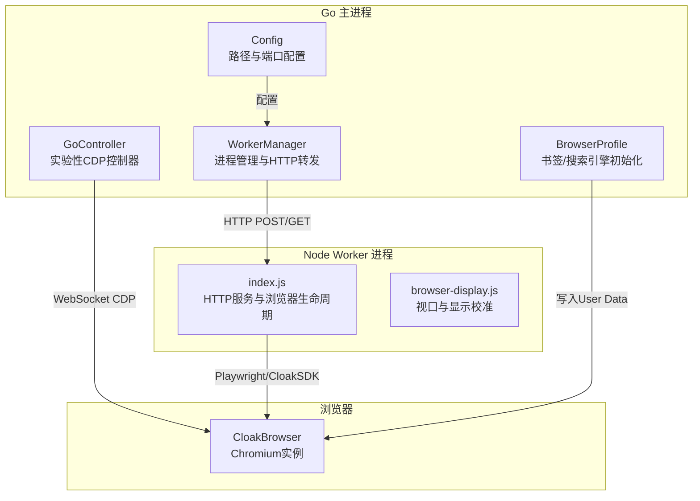
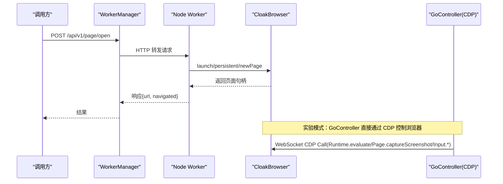
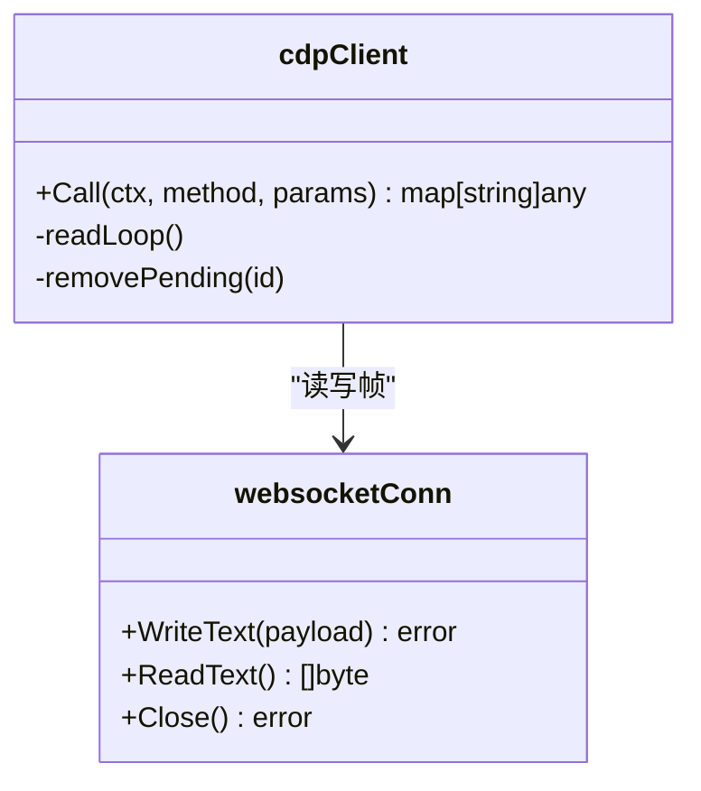
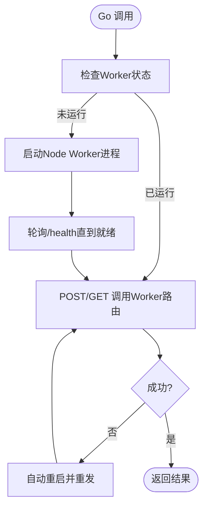
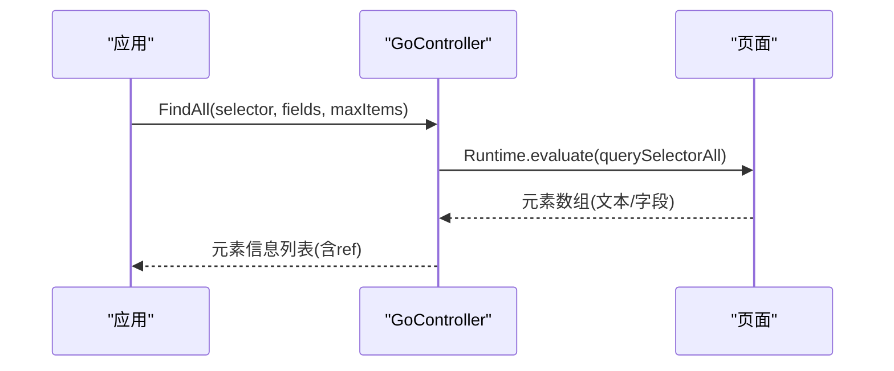
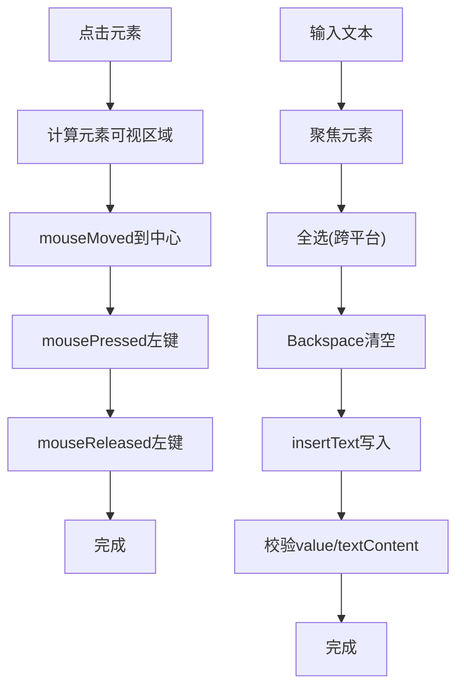
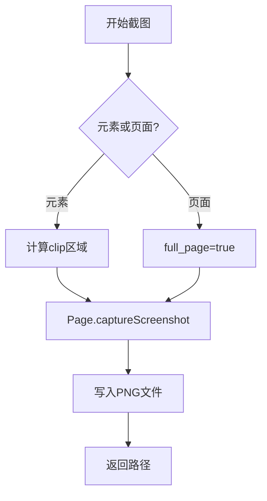
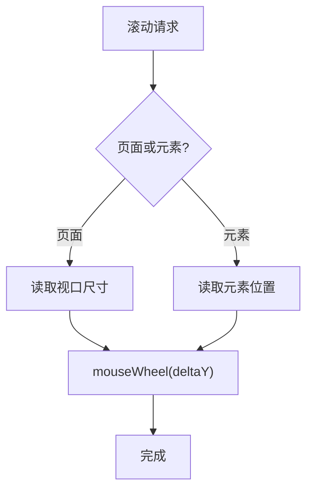
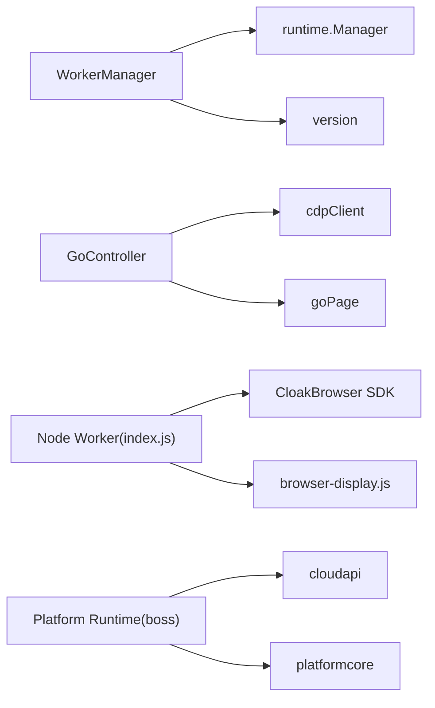

# 浏览器自动化

<cite>
**本文引用的文件**
- [go_controller.go](file://goodhr5/local-agent-go/internal/browser/go_controller.go)
- [worker.go](file://goodhr5/local-agent-go/internal/browser/worker.go)
- [go_cdp.go](file://goodhr5/local-agent-go/internal/browser/go_cdp.go)
- [go_element.go](file://goodhr5/local-agent-go/internal/browser/go_element.go)
- [go_screenshot.go](file://goodhr5/local-agent-go/internal/browser/go_screenshot.go)
- [go_scroll.go](file://goodhr5/local-agent-go/internal/browser/go_scroll.go)
- [go_input.go](file://goodhr5/local-agent-go/internal/browser/go_input.go)
- [index.js](file://goodhr5/local-agent-go/worker-node/src/index.js)
- [browser-display.js](file://goodhr5/local-agent-go/worker-node/src/browser-display.js)
- [browser-api.md](file://goodhr5/local-agent-go/contracts/browser-api.md)
- [defaults.go](file://goodhr5/local-agent-go/internal/browserprofile/defaults.go)
- [config.go](file://goodhr5/local-agent-go/internal/config/config.go)
- [runtime.go](file://goodhr5/local-agent-go/internal/platforms/boss/runtime.go)
</cite>

## 目录
1. [简介](#简介)
2. [项目结构](#项目结构)
3. [核心组件](#核心组件)
4. [架构总览](#架构总览)
5. [详细组件分析](#详细组件分析)
6. [依赖关系分析](#依赖关系分析)
7. [性能与稳定性](#性能与稳定性)
8. [故障排查指南](#故障排查指南)
9. [结论](#结论)
10. [附录：API 契约与配置项](#附录api-契约与配置项)

## 简介
本仓库实现了一个面向招聘平台的本地浏览器自动化引擎。它通过 Go 主进程管理 Node.js Worker 进程，由 Worker 驱动 CloakBrowser（基于 Chromium）完成页面操作、元素定位、用户行为模拟、截图、滚动、输入、Cookie 管理等能力；同时提供实验性的 Go 直连 CDP 的控制器，用于在特定场景下绕过 Node 层直接控制浏览器。系统还包含平台运行时适配（如 Boss 直聘）、浏览器 Profile 初始化（书签、搜索引擎）、配置管理、下载监听与诊断日志等高级能力。

## 项目结构
- Go 主进程负责：
  - 启动/停止/复用 Node Browser Worker 进程
  - 将上层业务调用转发到 Worker HTTP API
  - 提供实验性 Go 浏览器控制器（CDP 直连）
  - 管理浏览器 Profile、配置、下载目录、截图目录等
- Node Worker 负责：
  - 启动/复用 CloakBrowser
  - 暴露统一的 HTTP 路由，封装页面、元素、滚动、输入、截图、Cookie、下载等操作
  - 注入平台相关的滚动、点击、等待策略
- 平台运行时负责：
  - 针对具体招聘平台（Boss、猎聘、智联等）的业务流程编排与选择器策略

图表来源
- [worker.go:78-142](file://goodhr5/local-agent-go/internal/browser/worker.go#L78-L142)
- [go_controller.go:109-374](file://goodhr5/local-agent-go/internal/browser/go_controller.go#L109-L374)
- [index.js:388-530](file://goodhr5/local-agent-go/worker-node/src/index.js#L388-L530)
- [browser-display.js:24-90](file://goodhr5/local-agent-go/worker-node/src/browser-display.js#L24-L90)
- [defaults.go:56-123](file://goodhr5/local-agent-go/internal/browserprofile/defaults.go#L56-L123)
- [config.go:26-88](file://goodhr5/local-agent-go/internal/config/config.go#L26-L88)

章节来源
- [worker.go:78-142](file://goodhr5/local-agent-go/internal/browser/worker.go#L78-L142)
- [go_controller.go:109-374](file://goodhr5/local-agent-go/internal/browser/go_controller.go#L109-L374)
- [index.js:388-530](file://goodhr5/local-agent-go/worker-node/src/index.js#L388-L530)
- [browser-display.js:24-90](file://goodhr5/local-agent-go/worker-node/src/browser-display.js#L24-L90)
- [defaults.go:56-123](file://goodhr5/local-agent-go/internal/browserprofile/defaults.go#L56-L123)
- [config.go:26-88](file://goodhr5/local-agent-go/internal/config/config.go#L26-L88)

## 核心组件
- WorkerManager：管理 Node Browser Worker 的生命周期、健康检查、自动重启、固定端口清理、兼容版本校验、日志收集。
- GoController：实验性 Go 浏览器控制器，按 Node Worker 路由形态对外提供兼容接口，内部使用 CDP 直接控制页面。
- Node Worker（index.js）：基于 CloakBrowser SDK 的 HTTP 服务，封装页面打开、切换、查找、点击、输入、滚动、截图、Cookie、下载等能力。
- 平台运行时（以 Boss 为例）：封装平台特定的可见性判断、滚动参数、候选人提取与交互流程。
- BrowserProfile：初始化 Chromium Profile 默认书签和搜索引擎，确保稳定可复用的浏览器环境。
- Config：集中管理本地程序数据目录、端口、云 API、控制台地址等运行配置。

章节来源
- [worker.go:27-142](file://goodhr5/local-agent-go/internal/browser/worker.go#L27-L142)
- [go_controller.go:109-374](file://goodhr5/local-agent-go/internal/browser/go_controller.go#L109-L374)
- [index.js:388-530](file://goodhr5/local-agent-go/worker-node/src/index.js#L388-L530)
- [runtime.go:11-62](file://goodhr5/local-agent-go/internal/platforms/boss/runtime.go#L11-L62)
- [defaults.go:56-123](file://goodhr5/local-agent-go/internal/browserprofile/defaults.go#L56-L123)
- [config.go:26-88](file://goodhr5/local-agent-go/internal/config/config.go#L26-L88)

## 架构总览
系统采用“Go 主进程 + Node Worker 进程”的双进程架构：
- Go 主进程通过 WorkerManager 启动并维护 Node Worker 进程，统一转发 HTTP 请求到 Worker 的 /health 与各业务路由。
- Node Worker 使用 CloakBrowser SDK 管理浏览器上下文与页面，提供稳定的页面操作能力，并在需要时注入平台相关策略。
- 实验性 GoController 通过 WebSocket 直连 CDP，绕过 Node 层，直接执行 Runtime.evaluate、Page.captureScreenshot、Input.dispatchMouseEvent/KeyEvent 等命令。

图表来源
- [worker.go:254-332](file://goodhr5/local-agent-go/internal/browser/worker.go#L254-L332)
- [index.js:679-741](file://goodhr5/local-agent-go/worker-node/src/index.js#L679-L741)
- [go_cdp.go:48-114](file://goodhr5/local-agent-go/internal/browser/go_cdp.go#L48-L114)

## 详细组件分析

### CDP 协议通信与无头浏览器控制
- GoController 通过自定义 WebSocket 客户端连接 Chrome DevTools Protocol，发送 JSON 消息并等待对应 ID 的响应。
- 支持方法包括 Runtime.evaluate（执行 JS）、Page.captureScreenshot（截图）、Input.dispatchMouseEvent/KeyEvent（鼠标键盘事件）。
- 无头模式由 Node Worker 启动参数 headless 控制；Go 控制器本身不关心 UI 是否可见，仅通过 CDP 下发指令。

图表来源
- [go_cdp.go:21-114](file://goodhr5/local-agent-go/internal/browser/go_cdp.go#L21-L114)
- [go_cdp.go:148-289](file://goodhr5/local-agent-go/internal/browser/go_cdp.go#L148-L289)

章节来源
- [go_cdp.go:48-114](file://goodhr5/local-agent-go/internal/browser/go_cdp.go#L48-L114)
- [go_cdp.go:148-289](file://goodhr5/local-agent-go/internal/browser/go_cdp.go#L148-L289)

### Node.js Worker 进程、进程间通信与任务分发
- WorkerManager 负责：
  - 启动 Node 进程并设置环境变量（Worker 地址、版本、CloakBrowser 路径、Agent 回调地址等）
  - 健康检查与端口占用清理，保证固定端口可用
  - 调用失败自动重启并重发请求，提升鲁棒性
  - 记录 Worker 日志并输出最近尾部日志便于排错
- Node Worker 暴露统一 HTTP 路由，Go 主进程通过 Call/CALLGet 转发请求，Worker 返回标准 JSON 响应。

图表来源
- [worker.go:78-142](file://goodhr5/local-agent-go/internal/browser/worker.go#L78-L142)
- [worker.go:254-332](file://goodhr5/local-agent-go/internal/browser/worker.go#L254-L332)
- [worker.go:437-518](file://goodhr5/local-agent-go/internal/browser/worker.go#L437-L518)

章节来源
- [worker.go:78-142](file://goodhr5/local-agent-go/internal/browser/worker.go#L78-L142)
- [worker.go:254-332](file://goodhr5/local-agent-go/internal/browser/worker.go#L254-L332)
- [worker.go:437-518](file://goodhr5/local-agent-go/internal/browser/worker.go#L437-L518)

### 页面操作封装与元素定位策略
- Node Worker 提供页面打开、切换、列表页复用、当前 URL 读取等基础能力。
- 元素定位支持 CSS、role、text 等多类型选择器，支持父级容器与目标元素组合，支持 index 与可见性过滤。
- GoController 的 FindAll/FindOne 通过 Runtime.evaluate 执行 querySelectorAll，并缓存元素引用以便后续操作。

图表来源
- [go_element.go:23-105](file://goodhr5/local-agent-go/internal/browser/go_element.go#L23-L105)
- [index.js:763-795](file://goodhr5/local-agent-go/worker-node/src/index.js#L763-L795)

章节来源
- [go_element.go:23-105](file://goodhr5/local-agent-go/internal/browser/go_element.go#L23-L105)
- [index.js:763-795](file://goodhr5/local-agent-go/worker-node/src/index.js#L763-L795)

### 用户行为模拟（点击、输入、按键）
- 点击：先计算元素中心坐标，移动鼠标后派发 mousePressed/mouseReleased 事件。
- 输入：先选中并清空，再使用 insertText 插入文本，最后校验 value/textContent 一致。
- 按键：解析跨平台组合键（Control/Meta/Shift/Alt），派发 keyDown/keyUp 事件。

图表来源
- [go_input.go:11-81](file://goodhr5/local-agent-go/internal/browser/go_input.go#L11-L81)
- [go_input.go:83-173](file://goodhr5/local-agent-go/internal/browser/go_input.go#L83-L173)

章节来源
- [go_input.go:11-81](file://goodhr5/local-agent-go/internal/browser/go_input.go#L11-L81)
- [go_input.go:83-173](file://goodhr5/local-agent-go/internal/browser/go_input.go#L83-L173)

### 截图处理与长截图
- 页面截图：通过 Page.captureScreenshot 获取 PNG，保存到指定目录。
- 元素截图：先计算元素裁剪区域，再进行截图。
- 长截图：Worker 提供真实滚轮分段截取能力，确保内容完整。

图表来源
- [go_screenshot.go:14-95](file://goodhr5/local-agent-go/internal/browser/go_screenshot.go#L14-L95)
- [browser-api.md:115-129](file://goodhr5/local-agent-go/contracts/browser-api.md#L115-L129)

章节来源
- [go_screenshot.go:14-95](file://goodhr5/local-agent-go/internal/browser/go_screenshot.go#L14-L95)
- [browser-api.md:115-129](file://goodhr5/local-agent-go/contracts/browser-api.md#L115-L129)

### 滚动控制与可见性保障
- 页面滚动：计算视口中心点，派发 mouseWheel 事件。
- 元素滚动：先获取元素位置，将鼠标移动到元素中心，再派发滚轮事件。
- 可见性保障：结合元素视图信息与平台策略（如 Boss 候选卡片滚动预算、锚点安全距离）确保目标进入可视区。

图表来源
- [go_scroll.go:8-81](file://goodhr5/local-agent-go/internal/browser/go_scroll.go#L8-L81)
- [runtime.go:19-34](file://goodhr5/local-agent-go/internal/platforms/boss/runtime.go#L19-L34)

章节来源
- [go_scroll.go:8-81](file://goodhr5/local-agent-go/internal/browser/go_scroll.go#L8-L81)
- [runtime.go:19-34](file://goodhr5/local-agent-go/internal/platforms/boss/runtime.go#L19-L34)

### Cookie 管理与下载监听
- Cookie：支持导出与导入，Worker 提供 GET/POST 路由。
- 下载监听：Worker 在 Context 创建时注册 download 事件，记录 pending/saved/failed 状态，并提供查询与清空内存记录的接口。

章节来源
- [go_controller.go:310-313](file://goodhr5/local-agent-go/internal/browser/go_controller.go#L310-L313)
- [browser-api.md:62-68](file://goodhr5/local-agent-go/contracts/browser-api.md#L62-L68)
- [browser-api.md:130-138](file://goodhr5/local-agent-go/contracts/browser-api.md#L130-L138)

### 浏览器配置管理、扩展安装与 Profile 初始化
- 配置：集中管理数据目录、运行时目录、日志、OCR、前端、配置文件、云 API、控制台地址等。
- Profile 初始化：为每个浏览器账号目录注入招聘平台书签与必应搜索引擎，修复 Secure Preferences HMAC，确保稳定环境。
- 扩展安装：可通过 CloakBrowser 启动参数或 Context 配置加载扩展（由上层传入 proxy/timezone/locale/userAgent 等）。

章节来源
- [config.go:26-88](file://goodhr5/local-agent-go/internal/config/config.go#L26-L88)
- [defaults.go:56-123](file://goodhr5/local-agent-go/internal/browserprofile/defaults.go#L56-L123)
- [defaults.go:217-310](file://goodhr5/local-agent-go/internal/browserprofile/defaults.go#L217-L310)
- [index.js:438-459](file://goodhr5/local-agent-go/worker-node/src/index.js#L438-L459)

## 依赖关系分析
- WorkerManager 依赖 runtime.Manager 获取 Node/CloakBrowser 路径与环境，依赖 version 进行兼容性校验。
- GoController 依赖 CDP 客户端与页面对象，封装元素、滚动、截图、输入等原子能力。
- Node Worker 依赖 CloakBrowser SDK，并通过 browser-display.js 读取/校准显示参数。
- 平台运行时依赖 cloudapi 与 platformcore，封装平台特定参数与流程。

图表来源
- [worker.go:35-54](file://goodhr5/local-agent-go/internal/browser/worker.go#L35-L54)
- [go_cdp.go:21-114](file://goodhr5/local-agent-go/internal/browser/go_cdp.go#L21-L114)
- [index.js:438-530](file://goodhr5/local-agent-go/worker-node/src/index.js#L438-L530)
- [runtime.go:1-62](file://goodhr5/local-agent-go/internal/platforms/boss/runtime.go#L1-62)

章节来源
- [worker.go:35-54](file://goodhr5/local-agent-go/internal/browser/worker.go#L35-L54)
- [go_cdp.go:21-114](file://goodhr5/local-agent-go/internal/browser/go_cdp.go#L21-L114)
- [index.js:438-530](file://goodhr5/local-agent-go/worker-node/src/index.js#L438-L530)
- [runtime.go:1-62](file://goodhr5/local-agent-go/internal/platforms/boss/runtime.go#L1-62)

## 性能与稳定性
- 进程级隔离：Go 主进程与 Node Worker 分离，避免单点崩溃影响整体。
- 自动重启：Worker 调用失败时检测错误类型并自动重启，重发请求，提高可用性。
- 端口复用与冲突处理：固定端口探测与旧进程清理，避免端口占用导致启动失败。
- 显示校准：读取并提示浏览器缩放与视口异常，避免误判滚动与截图。
- 滚动优化：平台特定的滚动预算、锚点安全距离与诊断日志，减少无效滚动与卡顿。
- 截图优化：元素截图优先，失败回退页面截图；长截图分段采集并去重，确保完整性。

[本节为通用指导，无需具体文件引用]

## 故障排查指南
- Worker 未启动或连接被拒绝：检查端口占用、Worker 进程是否存在、健康检查是否可达。
- 浏览器会话不可用：检查页面是否关闭、Context/Browser 是否存活，必要时重置状态。
- 元素未找到或不可见：确认选择器是否正确、元素是否在可视区、是否需要滚动或等待。
- 输入校验失败：检查输入后 value/textContent 是否与预期一致，必要时重试或调整焦点。
- 截图失败：检查 clip 区域是否有效、目录权限、CDP 命令是否成功。
- 显示比例异常：根据提示恢复 100% 缩放，重新执行任务。

章节来源
- [worker.go:334-364](file://goodhr5/local-agent-go/internal/browser/worker.go#L334-L364)
- [index.js:622-672](file://goodhr5/local-agent-go/worker-node/src/index.js#L622-L672)
- [browser-display.js:10-22](file://goodhr5/local-agent-go/worker-node/src/browser-display.js#L10-L22)

## 结论
该浏览器自动化引擎通过 Go 主进程与 Node Worker 的协作，提供了稳定、可扩展的页面操作能力。实验性 GoController 为高性能场景提供 CDP 直连方案，Node Worker 则提供更丰富的平台适配与调试能力。配合 Profile 初始化、配置管理、下载监听与诊断日志，系统在多平台招聘场景中具备高可用性与可维护性。

[本节为总结，无需具体文件引用]

## 附录：API 契约与配置项
- 统一响应格式：成功包含 ok/data/trace_id；失败包含 ok/error/code/message/action/step/retryable/details。
- 路由清单：/health、/api/v1/browser/start、/api/v1/page/open、/element/find、/element/click、/page/scroll、/page/screenshot、/cookies、/downloads 等。
- SelectorSpec：支持 frames/parents/target/state/timeout_ms/description，支持 read_property/read_attribute。
- 真实滚轮验证：只通过鼠标移动与 mouse.wheel 执行滚动，禁止注入脚本。
- 长截图：必须提供 target/directory/filename，支持 wheel_anchor/distance/max_parts/wait_ms。
- 下载监听：记录 pending/saved/failed，提供查询与清空内存记录接口。

章节来源
- [browser-api.md:9-68](file://goodhr5/local-agent-go/contracts/browser-api.md#L9-L68)
- [browser-api.md:74-108](file://goodhr5/local-agent-go/contracts/browser-api.md#L74-L108)
- [browser-api.md:109-138](file://goodhr5/local-agent-go/contracts/browser-api.md#L109-L138)