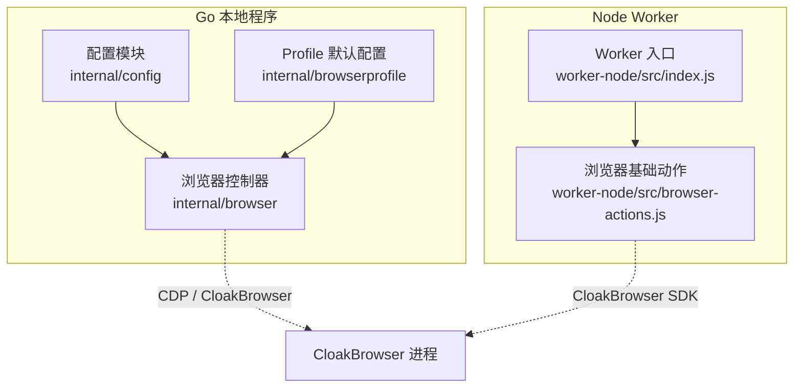
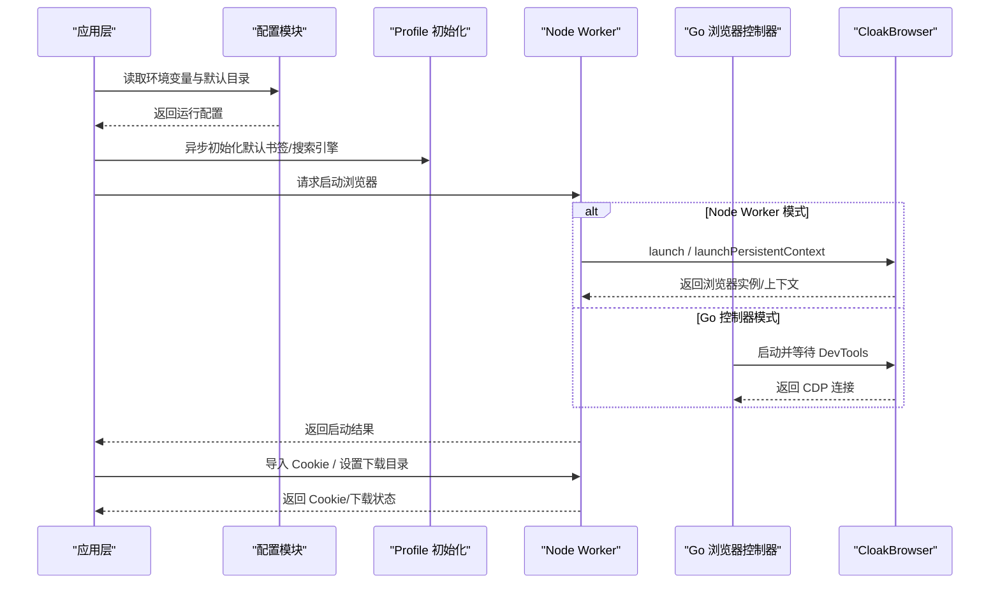
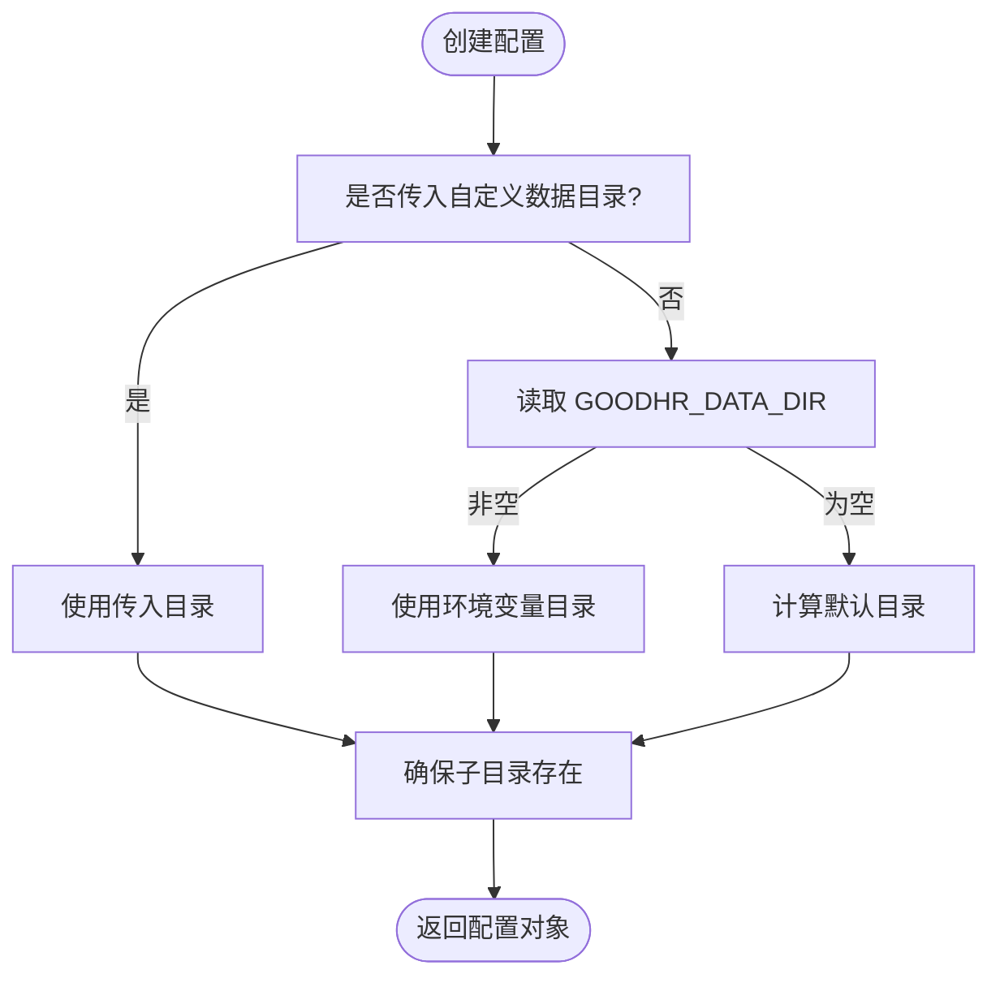
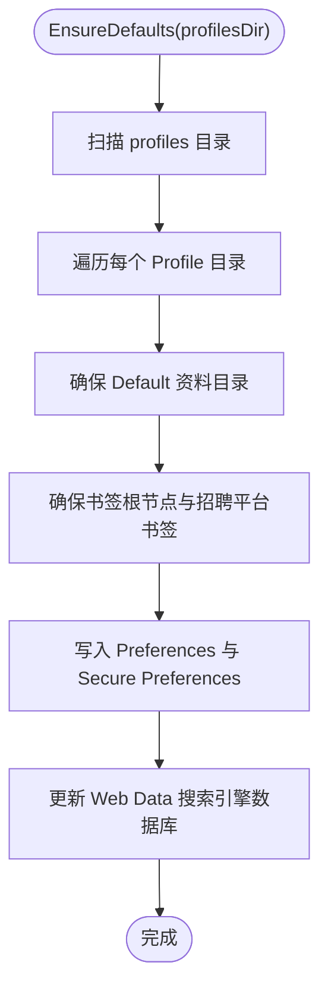
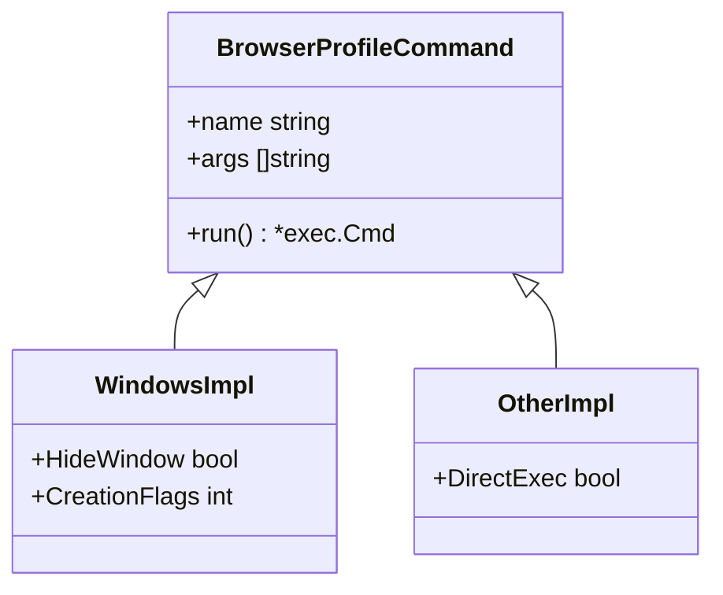
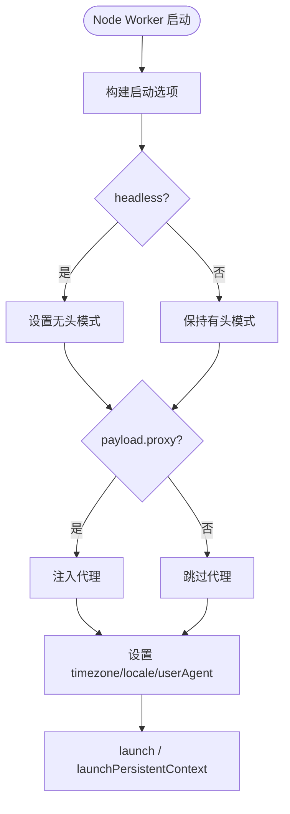
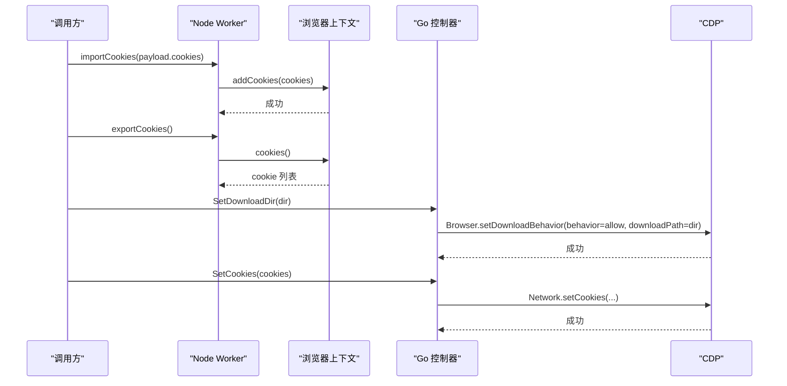
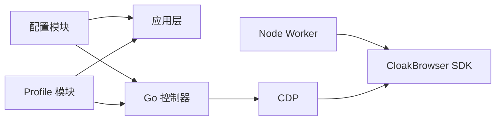

# 浏览器配置管理

<cite>
**本文引用的文件**   
- [config.go](file://goodhr5/local-agent-go/internal/config/config.go)
- [defaults.go](file://goodhr5/local-agent-go/internal/browserprofile/defaults.go)
- [command_windows.go](file://goodhr5/local-agent-go/internal/browserprofile/command_windows.go)
- [command_other.go](file://goodhr5/local-agent-go/internal/browserprofile/command_other.go)
- [go_controller.go](file://goodhr5/local-agent-go/internal/browser/go_controller.go)
- [go_session.go](file://goodhr5/local-agent-go/internal/browser/go_session.go)
- [browser-actions.js](file://goodhr5/local-agent-go/worker-node/src/browser-actions.js)
- [index.js](file://goodhr5/local-agent-go/worker-node/src/index.js)
</cite>

## 目录
1. [引言](#引言)
2. [项目结构](#项目结构)
3. [核心组件](#核心组件)
4. [架构总览](#架构总览)
5. [详细组件分析](#详细组件分析)
6. [依赖关系分析](#依赖关系分析)
7. [性能与优化](#性能与优化)
8. [故障排查指南](#故障排查指南)
9. [结论](#结论)

## 引言
本文件面向 GoodHR 本地 Agent 的浏览器配置管理，覆盖以下主题：
- 浏览器启动参数配置、无头模式、代理设置、安全选项
- Cookie 导入导出、持久化账号目录（User Data Dir）
- 扩展安装与 Profile 默认书签、搜索引擎初始化
- 不同平台（Windows、macOS、Linux）的命令构建与环境变量
- 配置文件管理、默认值管理、动态更新机制
- 性能优化参数、调试工具集成、日志配置方法

## 项目结构
GoodHR 本地 Agent 在 Go 与 Node Worker 两条路径上实现浏览器控制：
- Go 侧提供实验性浏览器控制器，直接通过 CDP 控制 CloakBrowser。
- Node Worker 侧基于 CloakBrowser SDK 封装浏览器基础操作、高级动作和下载能力。
- Browser Profile 模块负责 Chromium Profile 的默认书签、搜索引擎与安全偏好修复。
- 通用配置模块负责本地数据目录、运行时目录、日志目录等环境配置。

**图表来源**
- [go_controller.go:109-150](file://goodhr5/local-agent-go/internal/browser/go_controller.go#L109-L150)
- [browser-actions.js:26-47](file://goodhr5/local-agent-go/worker-node/src/browser-actions.js#L26-L47)
- [index.js:435-531](file://goodhr5/local-agent-go/worker-node/src/index.js#L435-L531)

**章节来源**
- [go_controller.go:109-150](file://goodhr5/local-agent-go/internal/browser/go_controller.go#L109-L150)
- [browser-actions.js:26-47](file://goodhr5/local-agent-go/worker-node/src/browser-actions.js#L26-L47)
- [index.js:435-531](file://goodhr5/local-agent-go/worker-node/src/index.js#L435-L531)

## 核心组件
- 配置模块：定义本地程序运行目录、端口、控制台地址、自动打开控制台开关、开发扫描限制等。
- Browser Profile 模块：初始化 Chromium Profile 的默认书签、搜索引擎、Secure Preferences HMAC。
- Go 浏览器控制器：启动 CloakBrowser、暴露浏览器基础 API、Cookie 管理、下载目录设置。
- Node Worker：封装浏览器启动、上下文复用、页面管理、鼠标键盘输入、截图、Cookie 导入导出。

**章节来源**
- [config.go:23-42](file://goodhr5/local-agent-go/internal/config/config.go#L23-L42)
- [defaults.go:56-123](file://goodhr5/local-agent-go/internal/browserprofile/defaults.go#L56-L123)
- [go_controller.go:109-150](file://goodhr5/local-agent-go/internal/browser/go_controller.go#L109-L150)
- [browser-actions.js:26-47](file://goodhr5/local-agent-go/worker-node/src/browser-actions.js#L26-L47)

## 架构总览
浏览器配置管理贯穿“配置加载 → Profile 初始化 → 浏览器启动 → 会话复用 → Cookie/下载管理”的完整链路。

**图表来源**
- [config.go:44-96](file://goodhr5/local-agent-go/internal/config/config.go#L44-L96)
- [defaults.go:56-123](file://goodhr5/local-agent-go/internal/browserprofile/defaults.go#L56-L123)
- [index.js:435-531](file://goodhr5/local-agent-go/worker-node/src/index.js#L435-L531)
- [go_session.go:47-87](file://goodhr5/local-agent-go/internal/browser/go_session.go#L47-L87)

## 详细组件分析

### 配置模块与环境变量
- 默认监听地址与端口：默认主机为本地回环地址，默认端口为固定值，最大探测端口有上限。
- 数据目录优先级：优先使用调用方传入的数据目录，其次读取环境变量 GOODHR_DATA_DIR，最后使用系统用户配置目录下的固定应用名目录。
- 子目录约定：runtime、logs、ocr、console、profiles、downloads、screenshots 均位于数据目录下。
- 下载目录默认策略：优先使用系统 Downloads 目录，失败时回退到临时目录下的 GoodHR/Downloads。
- 控制台自动打开：可通过环境变量 GOODHR_AUTO_OPEN_CONSOLE 控制。

**图表来源**
- [config.go:44-96](file://goodhr5/local-agent-go/internal/config/config.go#L44-L96)
- [config.go:107-148](file://goodhr5/local-agent-go/internal/config/config.go#L107-L148)

**章节来源**
- [config.go:11-21](file://goodhr5/local-agent-go/internal/config/config.go#L11-L21)
- [config.go:44-96](file://goodhr5/local-agent-go/internal/config/config.go#L44-L96)
- [config.go:98-148](file://goodhr5/local-agent-go/internal/config/config.go#L98-L148)

### Browser Profile 默认配置与搜索引擎
- 默认 Profile 名称与目录：default 与 Default。
- 默认书签：将招聘平台入口固定在书签栏前部，缺失则创建，重复则去重并按固定顺序排列。
- 搜索引擎：强制写入必应模板数据，并在 Web Data SQLite 中插入或替换 keywords 记录。
- Secure Preferences：根据设备 ID 重算保护校验 HMAC，避免 Chromium 拒绝修改后的配置。
- 设备 ID：macOS 使用 IOPlatformUUID，Windows 使用计算机名对应的 SID；其他平台暂不支持。

**图表来源**
- [defaults.go:56-123](file://goodhr5/local-agent-go/internal/browserprofile/defaults.go#L56-L123)
- [defaults.go:125-180](file://goodhr5/local-agent-go/internal/browserprofile/defaults.go#L125-L180)
- [defaults.go:217-310](file://goodhr5/local-agent-go/internal/browserprofile/defaults.go#L217-L310)
- [defaults.go:448-501](file://goodhr5/local-agent-go/internal/browserprofile/defaults.go#L448-L501)

**章节来源**
- [defaults.go:28-48](file://goodhr5/local-agent-go/internal/browserprofile/defaults.go#L28-L48)
- [defaults.go:56-123](file://goodhr5/local-agent-go/internal/browserprofile/defaults.go#L56-L123)
- [defaults.go:125-180](file://goodhr5/local-agent-go/internal/browserprofile/defaults.go#L125-L180)
- [defaults.go:217-310](file://goodhr5/local-agent-go/internal/browserprofile/defaults.go#L217-L310)
- [defaults.go:448-501](file://goodhr5/local-agent-go/internal/browserprofile/defaults.go#L448-L501)

### 不同平台的命令构建
- Windows 下 Profile 初始化命令会隐藏终端窗口，避免弹出黑色控制台。
- 非 Windows 平台直接执行命令，不附加隐藏窗口属性。
- 岗位运行器在非 Windows 下无需隐藏命令窗口，在 Windows 下通过 SysProcAttr 隐藏窗口。

**图表来源**
- [command_windows.go:11-20](file://goodhr5/local-agent-go/internal/browserprofile/command_windows.go#L11-L20)
- [command_other.go:8-12](file://goodhr5/local-agent-go/internal/browserprofile/command_other.go#L8-L12)

**章节来源**
- [command_windows.go:1-21](file://goodhr5/local-agent-go/internal/browserprofile/command_windows.go#L1-L21)
- [command_other.go:1-12](file://goodhr5/local-agent-go/internal/browserprofile/command_other.go#L1-L12)

### 浏览器启动参数与无头模式
- Node Worker 启动选项：
  - headless：布尔值，决定是否无头启动。
  - humanize：是否启用拟人化行为。
  - acceptDownloads：允许下载。
  - downloadsPath：下载目录。
  - windowsHide：Windows 下隐藏窗口。
  - viewport：当前测试阶段取消固定视口，设为 null。
  - args：默认包含 --test-type，用于抑制 Chromium 顶部提示条。
  - proxy：若 payload 提供代理，则注入 options.proxy。
  - timezone/locale/userAgent：可选国际化与 UA 设置。
- Go 控制器启动参数：
  - executable_path/browser_path/cloakbrowser_path：可执行路径。
  - user_data_dir：持久化账号目录。
  - downloads_path：下载目录。
  - headless：无头模式。
  - persistent：是否持久化上下文。
  - viewport_width/viewport_height：视口尺寸（当前 Go 控制器未强制固定窗口）。

**图表来源**
- [index.js:440-531](file://goodhr5/local-agent-go/worker-node/src/index.js#L440-L531)
- [browser-actions.js:192-208](file://goodhr5/local-agent-go/worker-node/src/browser-actions.js#L192-L208)
- [go_session.go:47-87](file://goodhr5/local-agent-go/internal/browser/go_session.go#L47-L87)
- [go_controller.go:129-138](file://goodhr5/local-agent-go/internal/browser/go_controller.go#L129-L138)

**章节来源**
- [index.js:440-531](file://goodhr5/local-agent-go/worker-node/src/index.js#L440-L531)
- [browser-actions.js:192-208](file://goodhr5/local-agent-go/worker-node/src/browser-actions.js#L192-L208)
- [go_session.go:47-87](file://goodhr5/local-agent-go/internal/browser/go_session.go#L47-L87)
- [go_controller.go:129-138](file://goodhr5/local-agent-go/internal/browser/go_controller.go#L129-L138)

### Cookie 管理与持久化账号目录
- Node Worker：
  - importCookies：向当前 context 批量添加 Cookie。
  - exportCookies：从当前 context 读取 Cookie 列表。
  - 持久化账号目录：当 payload.user_data_dir 存在且 launchPersistentContext 可用时，使用持久化上下文，保留登录态与缓存。
- Go 控制器：
  - SetDownloadDir：通过 CDP Browser.setDownloadBehavior 设置下载目录。
  - cookiesFromAny：解析任意类型 Cookie 数组为内部 Cookie 结构。
  - Get/Set Cookies：通过 CDP 接口获取或设置 Cookie。

**图表来源**
- [browser-actions.js:508-528](file://goodhr5/local-agent-go/worker-node/src/browser-actions.js#L508-L528)
- [index.js:467-505](file://goodhr5/local-agent-go/worker-node/src/index.js#L467-L505)
- [go_download.go:94-129](file://goodhr5/local-agent-go/internal/browser/go_download.go#L94-L129)
- [go_controller.go:307-313](file://goodhr5/local-agent-go/internal/browser/go_controller.go#L307-L313)

**章节来源**
- [browser-actions.js:508-528](file://goodhr5/local-agent-go/worker-node/src/browser-actions.js#L508-L528)
- [index.js:467-505](file://goodhr5/local-agent-go/worker-node/src/index.js#L467-L505)
- [go_download.go:94-129](file://goodhr5/local-agent-go/internal/browser/go_download.go#L94-L129)
- [go_controller.go:307-313](file://goodhr5/local-agent-go/internal/browser/go_controller.go#L307-L313)

### 扩展安装与 Profile 管理
- 当前代码库未直接实现扩展安装逻辑。扩展通常通过以下方式之一管理：
  - 使用 Chrome 扩展目录（extensions）并通过启动参数注入。
  - 通过 Playwright/CloakBrowser 的 extensions 配置项注入。
  - 手动安装后由 User Data Dir 持久化。
- Profile 管理重点在于默认书签与搜索引擎初始化，以及 Secure Preferences 的保护校验。

建议实践：
- 如需安装扩展，可在 Node Worker 的 launch 选项中增加 extensions 配置，或在启动参数中添加 --load-extension。
- 若扩展需要特定权限或策略，需同步更新 Preferences 与 Secure Preferences，并重新计算 HMAC。

[本节为概念性说明，不直接分析具体文件]

### 代理设置与安全选项
- 代理：Node Worker 支持通过 payload.proxy 注入代理配置。
- 安全选项：
  - Node Worker 默认 args 包含 --test-type，用于抑制 Chromium 对 --no-sandbox 等参数的顶部提示。
  - Go 控制器启动 CloakBrowser 时禁用后台网络、首次运行检查、默认浏览器检查，并开启远程调试地址与端口。
  - 无头模式：Node Worker 与 Go 控制器均支持 headless。

**章节来源**
- [index.js:440-460](file://goodhr5/local-agent-go/worker-node/src/index.js#L440-L460)
- [go_session.go:47-65](file://goodhr5/local-agent-go/internal/browser/go_session.go#L47-L65)

### 性能优化参数
- 视口与窗口大小：当前测试阶段取消固定视口，让浏览器采用账号保存或系统默认窗口大小，便于用户手动调整。
- 下载行为：通过 CDP 设置 allow 行为与下载目录，减少弹窗与确认交互。
- 资源清理：停止浏览器时关闭 context 与 browser，避免资源泄漏。
- 显示校准：当前测试阶段仅读取显示指标，不再强制重置缩放与固定视口。

**章节来源**
- [browser-actions.js:162-184](file://goodhr5/local-agent-go/worker-node/src/browser-actions.js#L162-L184)
- [browser-actions.js:214-242](file://goodhr5/local-agent-go/worker-node/src/browser-actions.js#L214-L242)
- [index.js:440-531](file://goodhr5/local-agent-go/worker-node/src/index.js#L440-L531)

### 调试工具集成与日志配置
- Node Worker：
  - logWorker：统一日志输出，字段长度限制，时间戳 ISO 格式。
  - 诊断追踪编号：为详情截图等操作生成 traceID，便于跨岗位日志检索。
- Go 控制器：
  - 远程调试：启动时绑定 127.0.0.1 与随机端口，等待 DevTools 就绪后再建立 CDP 连接。
  - 错误处理：启动失败、DevTools 等待超时、CDP 拨号失败均返回错误并终止进程。

**章节来源**
- [index.js:72-111](file://goodhr5/local-agent-go/worker-node/src/index.js#L72-L111)
- [go_session.go:47-87](file://goodhr5/local-agent-go/internal/browser/go_session.go#L47-L87)

## 依赖关系分析
- 配置模块被上层应用与浏览器控制器依赖，用于确定数据目录、运行时目录、日志目录等。
- Browser Profile 模块独立于浏览器启动流程，异步初始化默认配置，失败仅写日志。
- Node Worker 依赖 CloakBrowser SDK，提供浏览器基础操作与高级动作。
- Go 控制器通过 CDP 与 CloakBrowser 通信，提供兼容 Node Worker 的路由接口。

**图表来源**
- [config.go:44-96](file://goodhr5/local-agent-go/internal/config/config.go#L44-L96)
- [defaults.go:56-123](file://goodhr5/local-agent-go/internal/browserprofile/defaults.go#L56-L123)
- [browser-actions.js:74-82](file://goodhr5/local-agent-go/worker-node/src/browser-actions.js#L74-L82)
- [go_controller.go:253-335](file://goodhr5/local-agent-go/internal/browser/go_controller.go#L253-L335)

**章节来源**
- [config.go:44-96](file://goodhr5/local-agent-go/internal/config/config.go#L44-L96)
- [defaults.go:56-123](file://goodhr5/local-agent-go/internal/browserprofile/defaults.go#L56-L123)
- [browser-actions.js:74-82](file://goodhr5/local-agent-go/worker-node/src/browser-actions.js#L74-L82)
- [go_controller.go:253-335](file://goodhr5/local-agent-go/internal/browser/go_controller.go#L253-L335)

## 性能与优化
- 避免固定视口：当前测试阶段取消固定窗口尺寸，减少布局抖动与渲染开销。
- 下载行为优化：通过 CDP 设置 allow 行为，避免下载弹窗影响自动化流程。
- 资源释放：停止浏览器时关闭 context 与 browser，防止内存泄漏。
- 显示指标读取：仅读取显示信息，不进行强制校准，降低启动耗时。

[本节为一般性指导，不直接分析具体文件]

## 故障排查指南
- 浏览器启动失败：
  - Node Worker：检查 CloakBrowser SDK 是否加载成功，proxy 配置是否有效，downloadsPath 是否可写。
  - Go 控制器：检查远程调试端口是否可用，DevTools 是否在规定时间内就绪。
- Cookie 导入失败：
  - Node Worker：确认已启动浏览器上下文，cookies 数组格式正确。
  - Go 控制器：确认 CDP 连接正常，cookie 字段完整。
- Profile 初始化失败：
  - 检查 profiles 目录权限，Preferences/Secure Preferences/Web Data 文件是否可读可写。
  - macOS/Windows 设备 ID 读取失败时，搜索引擎初始化会被跳过，不影响浏览器启动。

**章节来源**
- [index.js:435-531](file://goodhr5/local-agent-go/worker-node/src/index.js#L435-L531)
- [go_session.go:47-87](file://goodhr5/local-agent-go/internal/browser/go_session.go#L47-L87)
- [defaults.go:217-310](file://goodhr5/local-agent-go/internal/browserprofile/defaults.go#L217-L310)

## 结论
GoodHR 本地 Agent 的浏览器配置管理以“配置模块 + Profile 初始化 + 双路径浏览器控制”为核心：
- 配置模块提供稳定的数据目录与环境变量管理。
- Profile 模块确保浏览器默认书签与搜索引擎一致，并维护安全偏好校验。
- Node Worker 与 Go 控制器分别提供灵活的浏览器启动与 CDP 控制能力。
- Cookie 管理、下载目录设置、无头模式、代理与安全选项均具备明确实现路径。
- 当前版本强调稳定性与可维护性，逐步取消固定视口与强制校准，提升用户体验与性能。

[本节为总结性内容，不直接分析具体文件]