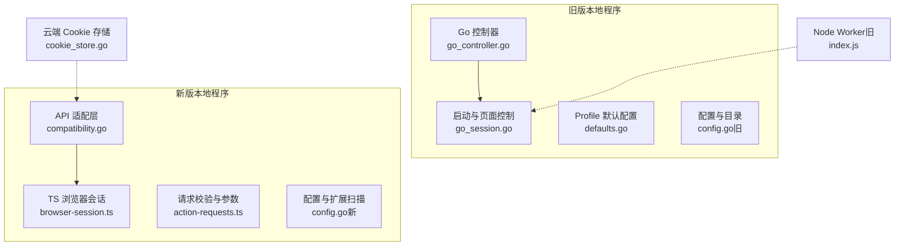
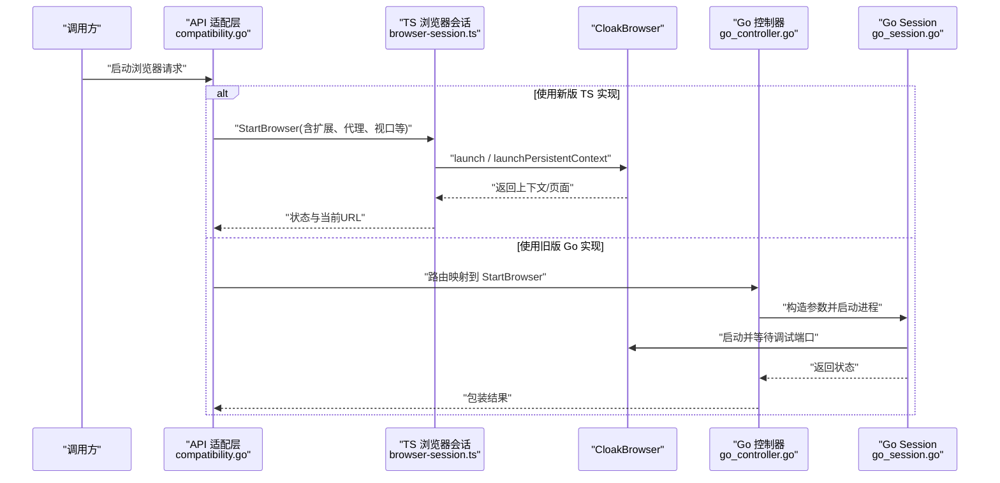
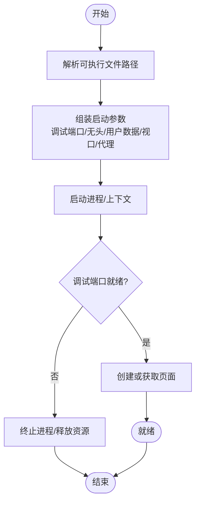
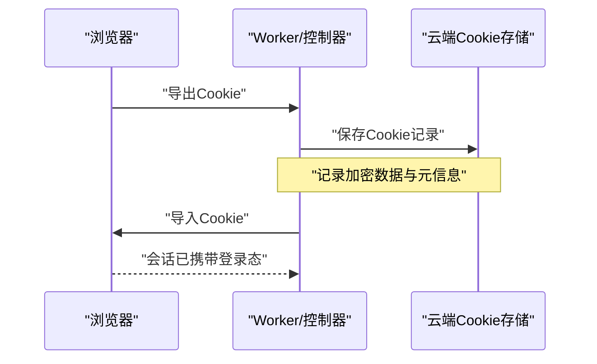
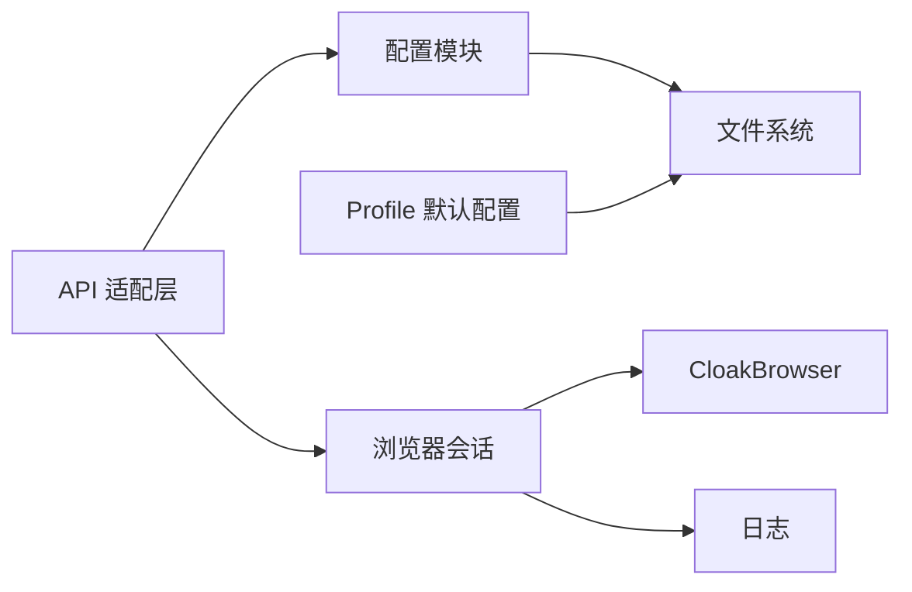

# 浏览器配置管理

<cite>
**本文引用的文件**
- [go_controller.go](file://goodhr5/local-agent-go/internal/browser/go_controller.go)
- [go_session.go](file://goodhr5/local-agent-go/internal/browser/go_session.go)
- [defaults.go](file://goodhr5/local-agent-go/internal/browserprofile/defaults.go)
- [config.go（旧本地程序）](file://goodhr5/local-agent-go/internal/config/config.go)
- [config.go（新本地程序）](file://goodhr5/local-agent-go/internal/config/config.go)
- [browser-session.ts](file://goodhr5/local-agent-go/worker/src/browser/session/browser-session.ts)
- [action-requests.ts](file://goodhr5/local-agent-go/worker/src/validation/action-requests.ts)
- [compatibility.go](file://goodhr5/local-agent-go/internal/api/compatibility.go)
- [index.js（Node Worker）](file://goodhr5/local-agent-go/worker-node/src/index.js)
- [cookie_store.go](file://goodhr5/cloud/backend/internal/httpapi/cookie_store.go)
</cite>

## 目录
1. [简介](#简介)
2. [项目结构](#项目结构)
3. [核心组件](#核心组件)
4. [架构总览](#架构总览)
5. [详细组件分析](#详细组件分析)
6. [依赖关系分析](#依赖关系分析)
7. [性能与优化](#性能与优化)
8. [故障排查指南](#故障排查指南)
9. [结论](#结论)
10. [附录：启动参数与环境变量清单](#附录启动参数与环境变量清单)

## 简介
本文件面向“浏览器配置管理”，覆盖以下主题：
- 浏览器启动参数配置、无头模式、代理设置、安全选项、视口与用户代理
- 扩展安装与验证、Profile 默认书签与搜索引擎初始化
- Cookie 的导出、导入与云端存储
- 不同平台（Windows/macOS/Linux）下的可执行文件发现与启动命令构建
- 环境变量与配置文件管理、默认值与动态更新机制
- 性能优化参数、调试工具集成（CDP）、日志与错误处理

## 项目结构
本项目在两个本地 Agent 实现中提供浏览器管理能力：
- 旧版 Go 本地程序：通过实验性 Go 控制器直接启动 CloakBrowser，并暴露与 Node Worker 兼容的路由。
- 新版 Go 本地程序：通过 TypeScript Worker 封装 CloakBrowser，提供更完善的会话、下载、Cookie、扩展与 Profile 管理。

图表来源
- [go_controller.go:129-149](file://goodhr5/local-agent-go/internal/browser/go_controller.go#L129-L149)
- [go_session.go:18-103](file://goodhr5/local-agent-go/internal/browser/go_session.go#L18-L103)
- [defaults.go:56-123](file://goodhr5/local-agent-go/internal/browserprofile/defaults.go#L56-L123)
- [config.go（旧）:26-88](file://goodhr5/local-agent-go/internal/config/config.go#L26-L88)
- [config.go（新）:30-90](file://goodhr5/local-agent-go/internal/config/config.go#L30-L90)
- [browser-session.ts:50-155](file://goodhr5/local-agent-go/worker/src/browser/session/browser-session.ts#L50-L155)
- [action-requests.ts:60-102](file://goodhr5/local-agent-go/worker/src/validation/action-requests.ts#L60-L102)
- [compatibility.go:99-132](file://goodhr5/local-agent-go/internal/api/compatibility.go#L99-L132)
- [index.js（Node Worker）:452-485](file://goodhr5/local-agent-go/worker-node/src/index.js#L452-L485)
- [cookie_store.go:43-86](file://goodhr5/cloud/backend/internal/httpapi/cookie_store.go#L43-L86)

章节来源
- [go_controller.go:129-149](file://goodhr5/local-agent-go/internal/browser/go_controller.go#L129-L149)
- [go_session.go:18-103](file://goodhr5/local-agent-go/internal/browser/go_session.go#L18-L103)
- [defaults.go:56-123](file://goodhr5/local-agent-go/internal/browserprofile/defaults.go#L56-L123)
- [config.go（旧）:26-88](file://goodhr5/local-agent-go/internal/config/config.go#L26-L88)
- [config.go（新）:30-90](file://goodhr5/local-agent-go/internal/config/config.go#L30-L90)
- [browser-session.ts:50-155](file://goodhr5/local-agent-go/worker/src/browser/session/browser-session.ts#L50-L155)
- [action-requests.ts:60-102](file://goodhr5/local-agent-go/worker/src/validation/action-requests.ts#L60-L102)
- [compatibility.go:99-132](file://goodhr5/local-agent-go/internal/api/compatibility.go#L99-L132)
- [index.js（Node Worker）:452-485](file://goodhr5/local-agent-go/worker-node/src/index.js#L452-L485)
- [cookie_store.go:43-86](file://goodhr5/cloud/backend/internal/httpapi/cookie_store.go#L43-L86)

## 核心组件
- 浏览器控制器与会话
  - 旧版：Go 控制器负责进程级启动、CDP 连接、页面生命周期；Session 负责启动参数拼装与调试端口等待。
  - 新版：TS BrowserSession 封装 CloakBrowser，支持持久化上下文、扩展加载、下载管理与 Cookie 操作。
- 配置与目录
  - 旧版：集中式 Config 管理数据目录、运行时目录、控制台地址等。
  - 新版：Config 管理 Profiles、Extensions、Downloads、Logs、Runtime、Database 等路径，并提供扩展扫描。
- Profile 与默认配置
  - 自动创建/修复 Chromium Profile，注入招聘平台书签，设置默认搜索引擎为必应，并维护 Secure Preferences 保护校验。
- 启动参数与校验
  - 统一入口将请求参数转换为底层启动选项，包含 headless、proxy、viewport、user_agent、locale/timezone、args、extension_paths 等。
- Cookie 管理
  - 浏览器侧导出/导入 Cookie；云端内存存储用于跨任务共享与状态同步。

章节来源
- [go_controller.go:109-149](file://goodhr5/local-agent-go/internal/browser/go_controller.go#L109-L149)
- [go_session.go:18-103](file://goodhr5/local-agent-go/internal/browser/go_session.go#L18-L103)
- [browser-session.ts:33-155](file://goodhr5/local-agent-go/worker/src/browser/session/browser-session.ts#L33-L155)
- [config.go（旧）:26-88](file://goodhr5/local-agent-go/internal/config/config.go#L26-L88)
- [config.go（新）:30-90](file://goodhr5/local-agent-go/internal/config/config.go#L30-L90)
- [defaults.go:56-123](file://goodhr5/local-agent-go/internal/browserprofile/defaults.go#L56-L123)
- [action-requests.ts:60-102](file://goodhr5/local-agent-go/worker/src/validation/action-requests.ts#L60-L102)
- [cookie_store.go:43-86](file://goodhr5/cloud/backend/internal/httpapi/cookie_store.go#L43-L86)

## 架构总览
下图展示从 API 到浏览器进程的完整调用链，涵盖新旧两套实现的关键交互点。

图表来源
- [compatibility.go:99-132](file://goodhr5/local-agent-go/internal/api/compatibility.go#L99-L132)
- [browser-session.ts:50-155](file://goodhr5/local-agent-go/worker/src/browser/session/browser-session.ts#L50-L155)
- [go_controller.go:253-335](file://goodhr5/local-agent-go/internal/browser/go_controller.go#L253-L335)
- [go_session.go:18-103](file://goodhr5/local-agent-go/internal/browser/go_session.go#L18-L103)

## 详细组件分析

### 浏览器启动参数与命令构建
- 旧版 Go 控制器
  - 启动参数包括远程调试地址、首次运行禁用、后台网络禁用、用户数据目录、无头模式、可选视口尺寸等。
  - 可执行文件发现顺序：传入路径 > 环境变量 > 程序目录 runtime/cloakbrowser > 工作目录 > 用户配置目录。
  - 启动后等待调试端口可用，再创建或获取首个页面，启用 Page/Runtime/DOM 能力。
- 新版 TS 会话
  - 将请求参数映射为 LaunchContextOptions：headless、humanize、geoip、extensionPaths、args、locale/timezone、userAgent、viewport、proxy。
  - 支持持久化上下文（userDataDir）与非持久化上下文两种模式，自动准备下载目录。
  - 若未显式指定视口，则不强制固定窗口大小，便于手动调整。

图表来源
- [go_session.go:18-103](file://goodhr5/local-agent-go/internal/browser/go_session.go#L18-L103)
- [go_session.go:310-350](file://goodhr5/local-agent-go/internal/browser/go_session.go#L310-L350)
- [browser-session.ts:397-433](file://goodhr5/local-agent-go/worker/src/browser/session/browser-session.ts#L397-L433)

章节来源
- [go_session.go:18-103](file://goodhr5/local-agent-go/internal/browser/go_session.go#L18-L103)
- [go_session.go:384-431](file://goodhr5/local-agent-go/internal/browser/go_session.go#L384-L431)
- [browser-session.ts:397-433](file://goodhr5/local-agent-go/worker/src/browser/session/browser-session.ts#L397-L433)

### 无头模式、代理与安全选项
- 无头模式
  - 旧版：当 headless=true 时追加 "--headless=new"。
  - 新版：headless 字段直接透传至 CloakBrowser。
- 代理
  - 新版支持字符串或对象形式的 proxy，包含 server、bypass、username 等字段；当未启用 geoIP 或未提供代理时，默认地区与时间区设为中国与时区 Asia/Shanghai。
- 安全与指纹稳定
  - 启动 args 会经过指纹稳定化处理，避免每次启动产生不一致的指纹。
  - Profile 的 Secure Preferences 写入时会重算 HMAC 保护校验，确保 Chromium 接受修改。

章节来源
- [go_session.go:48-65](file://goodhr5/local-agent-go/internal/browser/go_session.go#L48-L65)
- [browser-session.ts:397-433](file://goodhr5/local-agent-go/worker/src/browser/session/browser-session.ts#L397-L433)
- [action-requests.ts:89-102](file://goodhr5/local-agent-go/worker/src/validation/action-requests.ts#L89-L102)
- [defaults.go:236-263](file://goodhr5/local-agent-go/internal/browserprofile/defaults.go#L236-L263)
- [defaults.go:312-350](file://goodhr5/local-agent-go/internal/browserprofile/defaults.go#L312-L350)

### 扩展安装与验证
- 扩展目录位于配置中的 extensions 子目录。
- 系统会扫描一级子目录，仅当存在有效 manifest.json（name/version/manifest_version 为 2 或 3）时才加入启动参数。
- 启动时将扩展路径列表传递给 CloakBrowser，实现按需加载。

章节来源
- [config.go（新）:159-190](file://goodhr5/local-agent-go/internal/config/config.go#L159-L190)
- [browser-session.ts:397-433](file://goodhr5/local-agent-go/worker/src/browser/session/browser-session.ts#L397-L433)

### Cookie 管理
- 浏览器侧
  - 支持列出与导入 Cookie；在新版 TS 会话中通过 context.cookies() 与 addCookies() 完成。
- 云端存储
  - 云端提供内存型 Cookie 存储，支持创建、更新、查询，记录加密数据与密钥、状态、文件名与大小等元信息。
- 典型流程
  - 从浏览器导出 Cookie -> 上传至云端 -> 在其他任务或机器上恢复 Cookie -> 在新浏览器会话中导入。

图表来源
- [browser-session.ts:347-361](file://goodhr5/local-agent-go/worker/src/browser/session/browser-session.ts#L347-L361)
- [cookie_store.go:43-86](file://goodhr5/cloud/backend/internal/httpapi/cookie_store.go#L43-L86)

章节来源
- [browser-session.ts:347-361](file://goodhr5/local-agent-go/worker/src/browser/session/browser-session.ts#L347-L361)
- [cookie_store.go:43-86](file://goodhr5/cloud/backend/internal/httpapi/cookie_store.go#L43-L86)

### 不同平台的启动命令构建
- 可执行文件发现
  - Windows：优先查找 chrome.exe/chromium.exe/CloakBrowser.exe。
  - macOS：优先查找 Chromium.app 或 CloakBrowser.app 的可执行路径。
  - Linux：优先查找 chrome/chromium/CloakBrowser。
- 启动参数差异
  - 无头模式在不同平台均通过 headless 标志生效。
  - 用户数据目录与下载目录在各平台保持一致的相对位置策略。

章节来源
- [go_session.go:384-431](file://goodhr5/local-agent-go/internal/browser/go_session.go#L384-L431)

### 环境变量与配置文件管理
- 旧版本地程序
  - 通过 GOODHR_DATA_DIR、GOODHR_CONSOLE_MANIFEST_URL、GOODHR_CLOUD_API_BASE、GOODHR_AUTO_OPEN_CONSOLE 等环境变量覆盖默认值。
  - 自动创建 DataDir、RuntimeDir、LogsDir、OCRDir、FrontendDir、ProfilesDir、DownloadsDir、ScreenshotsDir。
- 新版本地程序
  - 通过 GOODHR_WORKER_PORT、GOODHR_CLOUD_API_BASE、GOODHR_CONSOLE_URL、GOODHR_NODE_PATH、GOODHR_OCR_EXECUTABLE、GOODHR_AUTO_OPEN_CONSOLE 等环境变量覆盖默认值。
  - 自动创建 DataDir、ProfilesDir、ExtensionsDir、DownloadsDir、ScreenshotsDir、LogsDir、RuntimeDir，并生成数据库路径。

章节来源
- [config.go（旧）:43-88](file://goodhr5/local-agent-go/internal/config/config.go#L43-L88)
- [config.go（新）:52-90](file://goodhr5/local-agent-go/internal/config/config.go#L52-L90)

### 默认值管理与动态更新机制
- 默认书签与搜索引擎
  - 启动时异步检查并修复所有已知 Profile 的默认书签与搜索引擎，保证招聘平台入口始终存在且排序靠前。
  - 对 Secure Preferences 进行 HMAC 重算，确保 Chromium 接受修改。
- 动态更新
  - 当检测到已有浏览器进程占用同一 Profile 时，先清理残留进程与锁文件，再启动新实例，避免冲突。
  - 下载目录可在会话内动态切换，不影响已有文件。

章节来源
- [defaults.go:56-123](file://goodhr5/local-agent-go/internal/browserprofile/defaults.go#L56-L123)
- [defaults.go:236-263](file://goodhr5/local-agent-go/internal/browserprofile/defaults.go#L236-L263)
- [index.js（Node Worker）:452-485](file://goodhr5/local-agent-go/worker-node/src/index.js#L452-L485)
- [browser-session.ts:373-384](file://goodhr5/local-agent-go/worker/src/browser/session/browser-session.ts#L373-L384)

### 调试工具集成与日志
- 调试端口
  - 旧版通过 remote-debugging-address/port 暴露调试接口，等待 JSON 版本接口可用后再继续。
- 日志
  - 新版 TS 会话在关键步骤输出结构化日志（启动、打开页面、关闭等），失败时归一化为可重试错误。
  - 旧版 Node Worker 在启动前清理残留进程与锁文件，并记录相关日志。

章节来源
- [go_session.go:48-76](file://goodhr5/local-agent-go/internal/browser/go_session.go#L48-L76)
- [browser-session.ts:66-155](file://goodhr5/local-agent-go/worker/src/browser/session/browser-session.ts#L66-L155)
- [index.js（Node Worker）:452-485](file://goodhr5/local-agent-go/worker-node/src/index.js#L452-L485)

## 依赖关系分析
- 组件耦合
  - API 适配层依赖配置与浏览器会话；TS 会话依赖 CloakBrowser；旧版 Go 控制器直接管理进程与 CDP。
- 外部依赖
  - CloakBrowser（Chromium 内核）、SQLite（Web Data 数据库）、操作系统命令（macOS ioreg、Windows PowerShell）。
- 潜在循环依赖
  - 未发现明显循环依赖；各模块职责清晰，按层次解耦。

图表来源
- [compatibility.go:99-132](file://goodhr5/local-agent-go/internal/api/compatibility.go#L99-L132)
- [config.go（新）:30-90](file://goodhr5/local-agent-go/internal/config/config.go#L30-L90)
- [browser-session.ts:50-155](file://goodhr5/local-agent-go/worker/src/browser/session/browser-session.ts#L50-L155)
- [defaults.go:56-123](file://goodhr5/local-agent-go/internal/browserprofile/defaults.go#L56-L123)

章节来源
- [compatibility.go:99-132](file://goodhr5/local-agent-go/internal/api/compatibility.go#L99-L132)
- [config.go（新）:30-90](file://goodhr5/local-agent-go/internal/config/config.go#L30-L90)
- [browser-session.ts:50-155](file://goodhr5/local-agent-go/worker/src/browser/session/browser-session.ts#L50-L155)
- [defaults.go:56-123](file://goodhr5/local-agent-go/internal/browserprofile/defaults.go#L56-L123)

## 性能与优化
- 视口与窗口
  - 测试期间不再向浏览器传递固定窗口尺寸，便于用户手动调整；如需固定视口，请同时提供宽高。
- 启动优化
  - 禁用后台网络与首次运行提示，减少启动开销。
  - 复用现有浏览器会话（相同 userDataDir 与扩展列表）以避免重复启动。
- 下载与资源
  - 下载目录统一管理，避免分散存储造成 IO 压力。
- 指纹稳定
  - 通过稳定化 args 与 Profile 指纹，降低反爬检测风险。

章节来源
- [index.js（Node Worker）:452-485](file://goodhr5/local-agent-go/worker-node/src/index.js#L452-L485)
- [browser-session.ts:397-433](file://goodhr5/local-agent-go/worker/src/browser/session/browser-session.ts#L397-L433)
- [go_session.go:48-65](file://goodhr5/local-agent-go/internal/browser/go_session.go#L48-L65)

## 故障排查指南
- 浏览器未找到
  - 检查可执行文件路径或环境变量是否配置正确；确认目标目录下存在对应平台可执行文件。
- 调试端口超时
  - 检查防火墙或端口占用；确认启动参数中调试端口未被占用。
- Profile 被占用
  - 清理残留进程与锁文件；确保同一 Profile 不被多个实例同时使用。
- Cookie 无效
  - 确认 Cookie 域名、路径、过期时间与站点一致；必要时重新登录并导出最新 Cookie。
- 扩展加载失败
  - 检查扩展目录是否存在有效 manifest.json；确认 manifest_version 为 2 或 3。

章节来源
- [go_session.go:310-350](file://goodhr5/local-agent-go/internal/browser/go_session.go#L310-L350)
- [index.js（Node Worker）:452-485](file://goodhr5/local-agent-go/worker-node/src/index.js#L452-L485)
- [config.go（新）:159-190](file://goodhr5/local-agent-go/internal/config/config.go#L159-L190)

## 结论
本项目提供了完整的浏览器配置管理能力，覆盖启动参数、无头模式、代理、扩展、Cookie、Profile 与多平台可执行文件发现。新旧两套实现分别适用于不同场景：旧版 Go 控制器适合轻量直连场景，新版 TS 会话提供更丰富的会话管理与健壮的错误处理。建议在生产环境优先采用新版实现，并结合环境变量与配置目录进行集中化管理。

## 附录：启动参数与环境变量清单
- 启动参数（浏览器侧）
  - headless：无头模式开关
  - user_data_dir：持久化 Profile 目录
  - downloads_path：下载目录
  - viewport_width/viewport_height：视口宽高（需成对提供）
  - user_agent：用户代理
  - locale/timezone：语言与时间区
  - proxy：代理（字符串或对象）
  - args：额外启动参数
  - extension_paths：扩展目录列表
- 环境变量（旧版）
  - GOODHR_DATA_DIR：数据目录
  - GOODHR_CONSOLE_MANIFEST_URL：控制台清单地址
  - GOODHR_CLOUD_API_BASE：云端 API 基址
  - GOODHR_AUTO_OPEN_CONSOLE：是否自动打开控制台
- 环境变量（新版）
  - GOODHR_WORKER_PORT：Worker 端口
  - GOODHR_CLOUD_API_BASE：云端 API 基址
  - GOODHR_CONSOLE_URL：前端地址
  - GOODHR_NODE_PATH：Node 可执行路径
  - GOODHR_OCR_EXECUTABLE：OCR 可执行路径
  - GOODHR_AUTO_OPEN_CONSOLE：是否自动打开控制台

章节来源
- [action-requests.ts:60-102](file://goodhr5/local-agent-go/worker/src/validation/action-requests.ts#L60-L102)
- [config.go（旧）:43-88](file://goodhr5/local-agent-go/internal/config/config.go#L43-L88)
- [config.go（新）:52-90](file://goodhr5/local-agent-go/internal/config/config.go#L52-L90)